# Appendix A: Volere Requirements Specification Template

[A-P001] *a guide for writing a rigorous and complete requirements specification*

## A.1 Contents

### A.1.1 Project Drivers

[A.1.1-P001] **1.** The Purpose of the Project

[A.1.1-P002] **2.** The Stakeholders

### A.1.2 Project Constraints

[A.1.2-P001] **3.** Mandated Constraints

[A.1.2-P002] **4.** Naming Conventions and Terminology

[A.1.2-P003] **5.** Relevant Facts and Assumptions

### A.1.3 Functional Requirements

[A.1.3-P001] **6.** The Scope of the Work

[A.1.3-P002] **7.** Business Data Model and Data Dictionary

[A.1.3-P003] **8.** The Scope of the Product

[A.1.3-P004] **9.** Functional Requirements

### A.1.4 Non-functional Requirements

[A.1.4-P001] **10.** Look and Feel Requirements

[A.1.4-P002] **11.** Usability and Humanity Requirements

[A.1.4-P003] **12.** Performance Requirements

[A.1.4-P004] **13.** Operational and Environmental Requirements

[A.1.4-P005] **14.** Maintainability and Support Requirements

[A.1.4-P006] **15.** Security Requirements

[A.1.4-P007] **16.** Cultural Requirements

[A.1.4-P008] **17.** Legal Requirements

### A.1.5 Project Issues

[A.1.5-P001] **18.** Open Issues

[A.1.5-P002] **19.** Off-the-Shelf Solutions

[A.1.5-P003] **20.** New Problems

[A.1.5-P004] **21.** Tasks

[A.1.5-P005] **22.** Migration to the New Product

[A.1.5-P006] **23.** Risks

[A.1.5-P007] **24.** Costs

[A.1.5-P008] **25.** User Documentation and Training

[A.1.5-P009] **26.** Waiting Room

[A.1.5-P010] **27.** Ideas for Solutions

## A.2 Use of This Template

[A.2-P001] The Volere Requirements Specification Template is intended for use as a basis for your requirements specifications. It provides sections for each of the requirements types appropriate to today’s software systems. You may download the template from the Volere site and adapt it to your requirements-gathering process and requirements tool. The template can be used with Yonix, Requisite, DOORS, Caliber RM, IRqA, and other popular tools (see **www.volere.co.uk/tools.htm**).

[A.2-P002] The template may not be sold or used for commercial gain or purposes other than as a basis for a requirements specification without prior written permission. It may be modified or copied and used for your requirements work, provided you include the following copyright notice in any document that uses any part of this template:

[A.2-P003] We acknowledge that this document uses material from the Volere Requirements Specification Template, copyright © 1995–2012 the Atlantic Systems Guild Limited.

## A.3 Volere

[A.3-P001] Volere is the result of many years of practice, consulting, and research in requirements engineering and business analysis. We have packaged our experience in the form of a generic requirements process, requirements training, requirements consultancy, requirements audits, a variety of downloadable guides and articles, a requirements knowledge model, and this requirements template. We also provide requirements specification-writing services.

[A.3-P002] The first edition of the **Volere** Requirements Specification Template was released in 1995. Since then, thousands of organizations have saved themselves effort by using this template as the basis for discovering, organizing, and communicating their requirements.

[A.3-P003] The Volere website (**www.volere.co.uk**) contains articles about the Volere techniques, experiences of Volere users and case studies, requirements tools, and other information useful to requirements practitioners. It also has subsequent updates to this template.

[A.3-P004] *Public seminars* on Volere are run on a regular basis in Europe, the United States, Australia, and New Zealand. For a schedule of courses, please refer to **www.volere.co.uk**.

## A.4 Requirements Types

[A.4-P001] For ease of use, we have found it convenient to think of requirements as belonging to a type. This perspective is helpful for two reasons: as an aid to finding the requirements and to be able to group the requirements that are relevant to a specific expert specialty.

[A.4-P002] *Functional requirements* are the fundamental or essential subject matter of the product. They describe what the product has to do or which processing actions it must take.

[A.4-P003] *Non-functional requirements* are the properties that the functions must have, such as performance and usability. Do not be deterred by the unfortunate name for this kind of requirements—they are as important as the functional requirements for the product’s success.

[A.4-P004] *Project constraints* are restrictions on the product due to the budget or the time available to build the product.

[A.4-P005] *Design constraints* impose restrictions on how the product must be designed. For example, it might have to be implemented in the hand-held device being given to major customers, or it might have to use the existing servers and desktop computers, or any other hardware, software, or business practice.

[A.4-P006] *Project drivers* are the business-related forces. For example, the purpose of the project is a project driver, as are all of the stakeholders—each for different reasons.

[A.4-P007] *Project issues* define the conditions under which the project will be carried out. Our reason for including them as part of the requirements is to present a coherent picture of all factors that contribute to the success or failure of the project and to illustrate how managers can use requirements as input when managing a project.

## A.5 Testing Requirements

[A.5-P001] The Volere philosophy is to start testing requirements as soon as you start writing them. You make a requirement testable by adding its *fit criterion*. This fit criterion measures the requirement, making it possible to determine whether a given solution fits the requirement. If a fit criterion cannot be found for a requirement, then the requirement is either ambiguous or poorly understood. All requirements can be measured, and all should carry a fit criterion.

## A.6 Atomic Requirements Shell

[A.6-P001] The requirements shell is a guide to writing each atomic requirement. The components of the shell (also called a “snow card”) are identified here. You might decide to add more attributes to provide traceability necessary for your environment—for example, products that implement this requirement, the version of the software that implements this requirement, or departments that are interested in this requirement. Others are possible, though you should be restrained in including them: Do not capriciously add attributes unless they really help you; every attribute you add needs to be maintained.

[A.6-P002] This requirements shell can, and should, be automated. When you download the template, you will also find an Excel spreadsheet implementation of the snow card.

[A.6-P003] Here, we discuss and provide examples for each section of the Volere Requirements Specification Template. For each section, the Content, Motivation, Considerations, Examples, and Form provide the template user with some guidance for writing each type of requirement.

[A.6-P004] 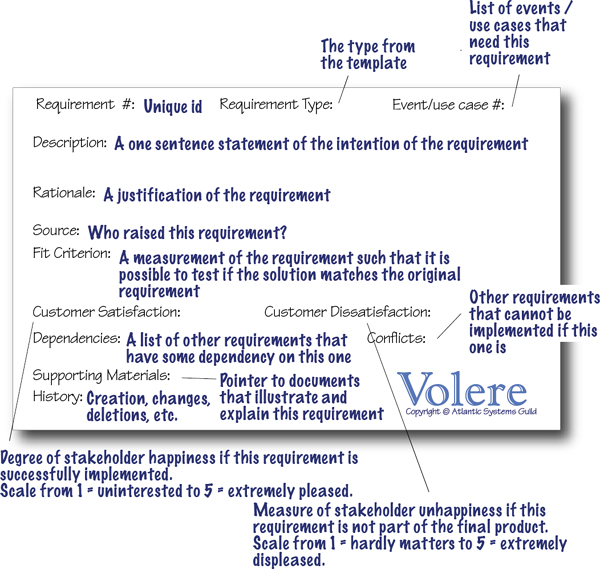

## A.7 1. The Purpose of the Project

[A.7-P001] The first section of the template deals with the fundamental reason your client asked you to build a new product. That is, it describes the business problem the client faces and explains how the product is intended to solve the problem.

### A.7.1 1a. The User Business or Background of the Project Effort

#### A.7.1.1 Content

[A.7.1.1-P001] This part of the specification consists of a short description of the business being done, its context, and the situation that triggered the development effort. It should also describe the work that the user intends to do with the delivered product.

#### A.7.1.2 Motivation

[A.7.1.2-P001] Without this statement, the project lacks justification and direction.

#### A.7.1.3 Considerations

[A.7.1.3-P001] You should consider whether the business problem is serious, and whether and why it needs to be solved.

[A.7.1.3-P002] Perhaps there are no serious problems, just a significant business opportunity your client wishes to exploit. In this case, describe the opportunity.

[A.7.1.3-P003] Alternatively, the project may seek to explore or investigate possibilities. In this case, the project deliverable, instead of a new product, would be a document proving that the requirements for a product can (or cannot) be satisfied.

#### A.7.1.4 Form

[A.7.1.4-P001] A short text description is often sufficient to provide an understanding of the project. You can choose to support the description with some combination of a current situation model, business process models, samples of current documents, photographs and videos of the current situation, website addresses, and organization charts.

### A.7.2 1b. Goals of the Project

#### A.7.2.1 Content

[A.7.2.1-P001] This part of the specification describes what we want the product to do and which advantage it will bring to the overall goals of the work. Do not be too wordy in this section—a brief explanation of the project’s goals is usually more valuable than a long, rambling treatise. A short, sharp goal will be clearer to the stakeholders and improve the chances of reaching a consensus for the goal.

#### A.7.2.2 Motivation

[A.7.2.2-P001] There is a danger that this purpose may get lost along the way. As the development effort heats up, and as the customer and developers discover more about what is possible, the system could potentially wander away from the original goals as it undergoes construction. This is a bad thing unless there is some deliberate act by the client to change the goals. It may be necessary to appoint a person to act as custodian of the goals, but it is probably sufficient to make the goals public and periodically remind the developers of them. *It should be mandatory to acknowledge the goals at every review session.*

#### A.7.2.3 Examples

[A.7.2.3-P001] ***We want to give immediate and complete response to customers who order our goods online.***

[A.7.2.3-P002] ***To reduce road accidents by accurately forecasting and scheduling the de-icing of roads.***

#### A.7.2.4 Measurement

[A.7.2.4-P001] Any reasonable goal must be measurable. This is necessary if you are ever to test whether you have succeeded with the project. The measurement must quantify the *advantage* gained by the business through doing the project. If the project is worthwhile, there must be some solid business reason for doing it. Suppose the goal of the project is this:

[A.7.2.4-P002] We want to give immediate and complete response to customers who order our goods online.

[A.7.2.4-P003] You must ask which advantage meeting this goal brings to the organization. If an immediate response will result in more satisfied customers, then the measurement must quantify that satisfaction. For example, you could measure the increase in repeat business (on the basis that a happy customer comes back for more), the increase in customer approval ratings from surveys, the increase in revenue from returning customers, and so on.

[A.7.2.4-P004] Ask which type of goal is involved:

[A.7.2.4-P005] • *Service goal:* This is measured by quantifying what it does for the customer.

[A.7.2.4-P006] • *Revenue goal:* Quantify how much revenue or revenue growth occurs over which period of time. Alternatively, a revenue goal could be quantified by market share.

[A.7.2.4-P007] • *Legal goal:* This is not a quantification, but rather a way of knowing that the product conforms to a piece of legislation (this could be the law of the land or it might be a standard of your industry or organization).

[A.7.2.4-P008] It is crucial to the rest of the development effort that the goal is firmly established, is reasonable, and is measured. It is usually the latter that makes the former possible.

#### A.7.2.5 Form

[A.7.2.5-P001] You can use the Purpose, Advantage, Measurement (PAM) technique to structure your goal:

[A.7.2.5-P002] • *Purpose:* One sentence that explains the organization’s reason for investing in the project

[A.7.2.5-P003] • *Advantage:* One sentence that describes the benefit that the organization will realize if the project is successful

[A.7.2.5-P004] • *Measurement:* One sentence or a graph or diagram that quantifies the benefit the new product is to deliver

[A.7.2.5-P005] Another form for your goals might be to use some kind of goal model. For example, the Extended Enterprise Modeling Language (EEML) includes a goal modeling technique. If your organization is using enterprise modeling then this provides a connection between the enterprise’s strategic goals and the goal of an individual project.

## A.8 2. The Stakeholders

[A.8-P001] This section describes the stakeholders—the people who have an interest in the product. It is worth your while to spend enough time to accurately determine and describe these people, as the penalty for not knowing who they are can be very high.

### A.8.1 2a. The Client

#### A.8.1.1 Content

[A.8.1.1-P001] This item gives the name of the client (sometimes referred to as the sponsor). It is permissible to have several names, but having more than three negates the point.

#### A.8.1.2 Motivation

[A.8.1.2-P001] The client has the final say on acceptance of the product and, therefore, must be satisfied with the product as delivered. You can think of the client as the person who makes the investment in the product. Where the product is being developed for in-house consumption, the same person often fills the roles of the client and the customer. If you cannot find a name for your client, then perhaps you should not be building the product.

#### A.8.1.3 Considerations

[A.8.1.3-P001] Sometimes, when building a package or a product for external users, the client is the marketing department. In this case, a person from the marketing department must be named as the client.

#### A.8.1.4 Form

[A.8.1.4-P001] • An annotated organization chart showing where the client fits within the organization

[A.8.1.4-P002] • A list of the decisions for which the client will be responsible

[A.8.1.4-P003] You can also include a chart showing the review checkpoints and itemizing what you will provide for the client as progress indicators for the project.

### A.8.2 2b. The Customer

#### A.8.2.1 Content

[A.8.2.1-P001] The customer is the person intended to buy the product. In the case of in-house development, the client and the customer are probably the same person. The customer might also be the manager who decides whether the people for whom he is responsible will adopt a new/changed product.

[A.8.2.1-P002] In the case of development of a mass-market product, this section contains a description of the persona developed as the archetypical customer for the product (see **Section 2e**).

#### A.8.2.2 Motivation

[A.8.2.2-P001] The customer is ultimately responsible for deciding whether to buy or recommend the use of the product. The correct requirements can be gathered only if you understand the customer and his aspirations when it comes to using your product.

#### A.8.2.3 Form

[A.8.2.3-P001] A list of the decisions for which the customer will be responsible.

[A.8.2.3-P002] You can also include a chart showing the review checkpoints and itemizing what you will provide for the customer as progress indicators for the project. This might include a list of possible prototypes or simulations that you will provide for the customer during the progress of the project.

### A.8.3 2c. Other Stakeholders

#### A.8.3.1 Content

[A.8.3.1-P001] The roles and (if possible) names of other people and organizations who are affected by the product, or whose input is needed to build the product. These stakeholders might work for your organization but might be external.

[A.8.3.1-P002] Examples of stakeholders:

[A.8.3.1-P003] • Client/sponsor (refer to **Section 2a**)

[A.8.3.1-P004] • Customer (refer to **Section 2b**)

[A.8.3.1-P005] • Subject-matter experts

[A.8.3.1-P006] • Members of the public

[A.8.3.1-P007] • Users of the current system

[A.8.3.1-P008] • Marketing experts

[A.8.3.1-P009] • Legal experts

[A.8.3.1-P010] • Domain experts

[A.8.3.1-P011] • Usability experts

[A.8.3.1-P012] • Representatives of external associations

[A.8.3.1-P013] • Business analysts

[A.8.3.1-P014] • Designers and developers

[A.8.3.1-P015] • Testers

[A.8.3.1-P016] • Systems engineers

[A.8.3.1-P017] • Software engineers

[A.8.3.1-P018] • Technology experts

[A.8.3.1-P019] • System designers

[A.8.3.1-P020] For a complete checklist, download the stakeholder analysis template from **www.volere.co.uk**.

[A.8.3.1-P021] For each type of stakeholder, provide the following information:

[A.8.3.1-P022] • Stakeholder identification (some combination of role/job title, person name, and organization name)

[A.8.3.1-P023] • Knowledge that the project needs from that stakeholder

[A.8.3.1-P024] • The degree of involvement necessary for that stakeholder/knowledge combination

[A.8.3.1-P025] • The degree of influence for that stakeholder/knowledge combination

[A.8.3.1-P026] • Agreement on how to address conflicts between stakeholders who have an interest in the same knowledge

#### A.8.3.2 Motivation

[A.8.3.2-P001] Failure to recognize stakeholders results in missing requirements.

#### A.8.3.3 Form

[A.8.3.3-P001] A stakeholder map supported by the name of the representative of each role, together with the knowledge to be supplied by that role. The following diagram is a generic stakeholder map that you can use as a checklist and replace the role names with the specific people/roles/organizations for your project.

[A.8.3.3-P002] Another form you can use to identify the stakeholders is a stakeholder analysis spreadsheet. A sample can be downloaded from **www.volere.co.uk**.

[A.8.3.3-P003] An annotated organization chart is also a useful form for defining stakeholders.

[A.8.3.3-P004] 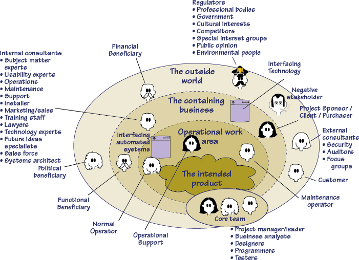

### A.8.4 2d. The Hands-on Users of the Product

#### A.8.4.1 Content

[A.8.4.1-P001] A list of special types of stakeholders—the potential users of the product. For each category of user, provide the following information:

[A.8.4.1-P002] • User name/category: Most likely the name of a user group, such as clerical users, schoolchildren, road engineers, or project managers.

[A.8.4.1-P003] • User role: Summarizes the users’ responsibilities.

[A.8.4.1-P004] • Subject-matter experience: Summarizes the users’ knowledge of the subject matter/business. Rate as novice, journeyman, or master.

[A.8.4.1-P005] • Technological experience: Describes the users’ experience with relevant technology. Rate as novice, journeyman, or master.

[A.8.4.1-P006] • Other user characteristics: Describe any characteristics of the users that have an effect on the requirements and eventual design of the product. For example:

[A.8.4.1-P007] Physical abilities/disabilities

[A.8.4.1-P008] Intellectual abilities/disabilities

[A.8.4.1-P009] Attitude toward job

[A.8.4.1-P010] Attitude toward technology

[A.8.4.1-P011] Physical location

[A.8.4.1-P012] Education

[A.8.4.1-P013] Linguistic skills

[A.8.4.1-P014] Age group

[A.8.4.1-P015] Gender

[A.8.4.1-P016] Ethnic group(s)

#### A.8.4.2 Motivation

[A.8.4.2-P001] Users are human beings who interact with the product in some way. Use the characteristics of the users to define the usability requirements for the product. Users are also known as *actors*.

#### A.8.4.3 Examples

[A.8.4.3-P001] Users can come from wide variety of (sometimes unexpected) sources. Consider the possibility of your users being clerical staff, shop workers, managers, highly trained operators, the general public, casual users, passersby, illiterate people, tradesmen, students, test engineers, foreigners, children, lawyers, remote users, people using the system over the telephone or an Internet connection, emergency workers, and so on.

#### A.8.4.4 Form

[A.8.4.4-P001] A simple list or a spreadsheet containing the user characteristics for each user role + user name/representative.

### A.8.5 2e. Personas

#### A.8.5.1 Content

[A.8.5.1-P001] A story about an invented person that includes the persona’s name, age, job, family, hobbies, residence, favorite food, favorite music, likes, dislikes, holiday destinations, attitude toward technology, attitude toward money, or any other characteristic that could influence the way that the persona thinks about the product. It helps if you include a photograph (download one from the Internet) to represent the imagined person.

#### A.8.5.2 Motivation

[A.8.5.2-P001] By having one or more (limit it to three) personas, you can make the requirements specific to the people whom you are trying to satisfy. This is a particularly effective technique if you are specifying the requirements for a consumer product or a product that will be used by members of the public.

#### A.8.5.3 Form

[A.8.5.3-P001] A profile containing the life story of the persona, including a photograph of the person. The profile can take the form of a document that you use to introduce project participants to the persona. You can also put the profile onto a large-format (A3) card that you display at meetings to remind participants about whose requirements you are trying to discover. Another idea is to build a storyboard of the persona’s life. In addition, you can make a website for the persona and keep him or her alive by adding more about the persona’s everyday life. All of these forms of capturing and communicating the persona are intended to help people think of the persona as a real user with specific—rather than general—real requirements.

### A.8.6 2f. Priorities Assigned to Users

#### A.8.6.1 Content

[A.8.6.1-P001] Attach a priority to each category of user, which identifies the importance and precedence of the user. Prioritize the users as follows:

[A.8.6.1-P002] • Key users: They are critical to the continued success of the product. Give greater importance to requirements generated by this category of user.

[A.8.6.1-P003] • Secondary users: They will use the product, but their opinion of it has no effect on its long-term success. Where there is a conflict between secondary users’ requirements and those of key users, the key users take precedence.

[A.8.6.1-P004] • Unimportant users: This category of user is given the lowest priority. It includes infrequent, unauthorized, and unskilled users, as well as people who misuse the product.

[A.8.6.1-P005] The percentage of the potential customer base represented by each type of user is intended to help you determine the amount of consideration to be given to each category of user.

#### A.8.6.2 Motivation

[A.8.6.2-P001] If some users are considered to be more important to the product or to the organization, then this preference should be stated because it should affect the way that you design the product. For instance, you need to know whether a large customer group has specifically asked for the product and that, if they do not get what they want, the results could be a significant loss of business.

[A.8.6.2-P002] Some users may be listed as having no impact on the product. These users will make use of the product, but have no vested interest in it. In other words, these users will neither complain nor contribute. Any special requirements from these users will have a lower design priority.

#### A.8.6.3 Form

[A.8.6.3-P001] Include the user importance rating on your user characteristics spreadsheet (see **Section 2d**) for the information of the core project team. Depending on the culture of your organization, you might need to treat this as sensitive information.

### A.8.7 2g. User Participation

#### A.8.7.1 Content

[A.8.7.1-P001] Where appropriate, attach to the category of user a statement of the participation that you think will be necessary for those users to provide the requirements. Describe the contribution that you expect these users to provide—for example, business knowledge, interface prototyping, or usability requirements. If possible, assess the minimum amount of time that these users must spend for you to be able to determine the complete requirements.

#### A.8.7.2 Motivation

[A.8.7.2-P001] Many projects fail because of lack of user participation, and sometimes because the required degree of participation was not made clear. When people have to make a choice between getting their everyday work done and working on a new project, the everyday work usually takes priority. This requirement makes it clear, from the outset, that specified user resources must be allocated to the project.

#### A.8.7.3 Form

[A.8.7.3-P001] Include the estimated user participation time, together with the type of knowledge you expect that user to provide, on your user characteristics spreadsheet (see **Section 2d**).

### A.8.8 2h. Maintenance Users and Service Technicians

#### A.8.8.1 Content

[A.8.8.1-P001] Maintenance users are a special type of hands-on users who have requirements that are specific to maintaining and changing the product.

#### A.8.8.2 Motivation

[A.8.8.2-P001] Many of these requirements will be discovered by considering the various types of maintenance requirements detailed in **Section 14**. However, if we define the characteristics of the people who maintain the product, it will help to trigger requirements that might otherwise be missed.

#### A.8.8.3 Form

[A.8.8.3-P001] Include the maintenance users on your user characteristics spreadsheet (see **Section 2d**).

## A.9 3. Mandated Constraints

[A.9-P001] This section describes constraints on the eventual design of the product.

[A.9-P002] Constraints are global—they are factors that apply to the entire product. The product must be built within the stated constraints. Often you know about the constraints, or they are mandated before the project gets underway. They are probably determined by management and are worth considering carefully—they restrict what you can do and, therefore, shape the product. Constraints, like other types of requirements, have a description, rationale, and fit criterion, and generally are written in the same format as functional and non-functional requirements.

### A.9.1 3a. Solution Constraints

#### A.9.1.1 Content

[A.9.1.1-P001] The content specifies constraints on the way that the problem must be solved. Describe the mandated technology or solution. Include any appropriate version numbers. You should also explain the reason for using the technology.

#### A.9.1.2 Motivation

[A.9.1.2-P001] Your goal is to identify constraints that guide the final product. Your client, customer, or user may have design preferences, or perhaps only certain solutions may be acceptable. If these constraints are not met, your solution is not acceptable.

#### A.9.1.3 Examples

[A.9.1.3-P001] Constraints are written using the same form as other atomic requirements (refer to the requirements snow card/shell for the attributes). It is important for each constraint to have a rationale and a fit criterion, as these elements help to expose false constraints (i.e., solutions masquerading as constraints). Also, you will usually find that a constraint affects the entire product rather than one or more product use cases.

[A.9.1.3-P002] ***Description: The product shall use the current two-way radio system to communicate with the drivers in their trucks.***

[A.9.1.3-P003] ***Rationale: The client will not pay for a new radio system, nor are any other means of communication available to the drivers.***

[A.9.1.3-P004] ***Fit Criterion: All signals generated by the product shall be audible and understandable by all drivers via their two-way radio system.***

[A.9.1.3-P005] ***Description: The product shall operate using Windows XP.***

[A.9.1.3-P006] ***Rationale: The client uses XP and does not wish to change to a later version.***

[A.9.1.3-P007] ***Fit Criterion: The product shall be approved as XP-compliant by the MS testing group.***

[A.9.1.3-P008] ***Description: The product shall be a hand-held device.***

[A.9.1.3-P009] ***Rationale: The product is to be marketed to hikers and mountain climbers.***

[A.9.1.3-P010] ***Fit Criterion: The product shall weigh no more than 300 grams, it shall be no more than 15 × 10 × 2 centimeters, and there shall be no external power source.***

#### A.9.1.4 Considerations

[A.9.1.4-P001] We want to define the boundaries within which we can solve the problem. Be careful when doing so, however, because anyone who has experience with or exposure to a piece of technology tends to see requirements in terms of that technology. This tendency leads people to impose solution constraints for the wrong reason, making it very easy for false constraints to creep into a specification. The solution constraints should be only those limits that are absolutely non-negotiable. In other words, no matter how you solve this problem, you must use this particular technology; any other solution would be unacceptable.

#### A.9.1.5 Form

[A.9.1.5-P001] Include the constraint requirements as a specific type of atomic requirement in your requirements spreadsheet or database. For attributes of an atomic requirement, see the atomic requirements shell example at the beginning of this template. Also refer to the article on atomic requirements at **www.volere.co.uk**.

[A.9.1.5-P002] Another form for constraints can be diagrams of the systems architecture for the new/changed product (see **Sections 3b** and **3c**).

### A.9.2 3b. Implementation Environment of the Current System

#### A.9.2.1 Content

[A.9.2.1-P001] This section describes the technological and physical environment in which the product is to be installed. It includes automated, mechanical, organizational, and other devices, along with the nonhuman adjacent systems.

#### A.9.2.2 Motivation

[A.9.2.2-P001] The goal is to describe the technological environment into which the product must fit. The environment places design constraints on the product. This part of the specification provides enough information about the environment for the designers to make the product successfully interact with its surrounding technology.

[A.9.2.2-P002] The operational requirements are derived from this description.

#### A.9.2.3 Examples

[A.9.2.3-P001] Examples can be shown as a diagram, with some kind of icon to represent each separate device or person (processor). Add interfaces between the processors, and annotate them with their form and content.

#### A.9.2.4 Considerations

[A.9.2.4-P001] All component parts of the current system, regardless of their type, should be included in the description of the implementation environment.

[A.9.2.4-P002] If the product is to affect, or be important to, the current organization, then include an organization chart.

#### A.9.2.5 Form

[A.9.2.5-P001] A diagram that represents each hardware and software component/subcomponent/device/building block that will be used to implement the product. The particular diagrams that you use will depend on your organization and your projects’ ways of working. The important issue here is that the implementation environment is unambiguously understandable by the people who must make decisions about how the functional and non-functional requirements will be implemented. Types of UML diagrams commonly used include class, component, component structure, deployment, and package diagrams. Many other home-grown diagrams are possible as well.

### A.9.3 3c. Partner or Collaborative Applications

#### A.9.3.1 Content

[A.9.3.1-P001] This part of the specification describes applications that are not part of the product but with which the product will collaborate. They can be external applications, commercial packages, or preexisting in-house applications.

#### A.9.3.2 Motivation

[A.9.3.2-P001] The goal is to provide information about design constraints caused by using partner applications. By describing or modeling these partner applications, you discover and highlight potential problems of integration.

#### A.9.3.3 Examples

[A.9.3.3-P001] This section can be completed by including written descriptions, models, or references to other specifications. The descriptions must include a full specification of all interfaces that have an effect on the product.

#### A.9.3.4 Considerations

[A.9.3.4-P001] Examine the work context model to determine whether any of the adjacent systems should be treated as partner applications. It might also be necessary to examine some of the details of the work to discover relevant partner applications.

#### A.9.3.5 Form

[A.9.3.5-P001] A diagram or table that identifies all the interfaces between the product to be built and other adjacent systems. Bear in mind that the adjacent systems might be software, human, or hardware. Some adjacent systems are within your organization and hence potentially more easily understood and perhaps influenced. Other adjacent systems may reside outside your organization and might be difficult, if not impossible, to influence. A product scope diagram (see **Section 8a** for an example) is often used to define interfaces with partner or collaborative applications.

### A.9.4 3d. Off-the-Shelf Software

#### A.9.4.1 Content

[A.9.4.1-P001] This section describes commercial, open-source, or any other off-the-shelf (OTS) software that must be used to implement some of the requirements for the product. It could also apply to non-software OTS components such as hardware or any other commercial product that is intended to be part of the solution.

#### A.9.4.2 Motivation

[A.9.4.2-P001] The goal is to identify and describe existing commercial, free, open-source, or other products to be incorporated into the eventual product. The characteristics, behavior, and interfaces of the package represent design constraints.

#### A.9.4.3 Considerations

[A.9.4.3-P001] When gathering requirements, you may discover requirements that conflict with the behavior and characteristics of the OTS software. Keep in mind that the use of OTS software was mandated before the full extent of the requirements became known. In light of your discoveries, you must consider whether the OTS product is a viable choice. If the use of the OTS software is not negotiable, then the conflicting requirements must be discarded.

[A.9.4.3-P002] Note that your strategy for discovering requirements is affected by the decision to use OTS software. In this situation you investigate the work context in parallel with making comparisons with the capabilities of the OTS product. Depending on the comprehensibility of the OTS software, you might be able to discover the matches or mismatches without having to write each of the business requirements in atomic detail. The mismatches are the requirements that you will need to specify so that you can decide whether to satisfy them by either modifying the OTS software, satisfying the requirement in another way, or modifying the business requirements.

[A.9.4.3-P003] Given the spate of lawsuits in the software arena, you should consider whether any legal implications might arise from your use of OTS. You can cover this issue in **Section 17**, Legal Requirements.

#### A.9.4.4 Form

[A.9.4.4-P001] Models or written documentation that specifies the functional and non-functional requirements that can be implemented using this OTS software product. If the OTS product has a well-structured requirements specification and systems architecture model, then that model provides you with the basis for identifying which of your requirements can be satisfied by the product. If the product’s documentation is not traceable and well organized, then you will need to do more detailed work on your own requirements until you find a level at which you can map your requirements to the OTS product.

[A.9.4.4-P002] Another form is one or more people who are experts in the OTS product and who can answer your questions so that you do not have to puzzle through cryptic or marketing-oriented documents.

### A.9.5 3e. Anticipated Workplace Environment

#### A.9.5.1 Content

[A.9.5.1-P001] This section describes the workplace in which the users are to work and use the product. It should describe any features of the workplace that could have an effect on the design of the product, and the social and cultural aspects of the workplace.

#### A.9.5.2 Motivation

[A.9.5.2-P001] To identify characteristics of the workplace so that the product is designed to compensate for any difficulties.

#### A.9.5.3 Examples

[A.9.5.3-P001] ***The single office printer is a considerable distance from the user’s desk. This constraint suggests that printed output should be deemphasized.***

[A.9.5.3-P002] ***The workplace is noisy, so audible signals might not work.***

[A.9.5.3-P003] ***The workplace is outside, so the product must be weather resistant, have displays that are visible in sunlight, and allow for the effect of wind on any paper output.***

[A.9.5.3-P004] ***The product is to be used in a library; it must be extra-quiet.***

[A.9.5.3-P005] ***The product is a printer to be used by an environmentally conscious organization; it must work with recycled paper.***

[A.9.5.3-P006] ***The user will be standing up and working in positions where he must hold the product. This suggests a hand-held product, but only a careful study of the users’ work and workplace will provide the necessary input to identifying the operational requirements.***

#### A.9.5.4 Considerations

[A.9.5.4-P001] The physical work environment constrains the way that work is done. The product should overcome whatever difficulties exist; however, you might consider a redesign of the workplace as an alternative to having the product compensate for such challenges.

#### A.9.5.5 Form

[A.9.5.5-P001] • A written description of the workplace

[A.9.5.5-P002] • Rich pictures showing all the components in the workplace

[A.9.5.5-P003] • Photographs of the workplace

[A.9.5.5-P004] • Videos of the workplace

### A.9.6 3f. Schedule Constraints

#### A.9.6.1 Content

[A.9.6.1-P001] Any known deadlines, or windows of opportunity, should be stated here.

#### A.9.6.2 Motivation

[A.9.6.2-P001] The goal is to identify critical times and dates that have an effect on product requirements. If the deadline is short, then the requirements must be kept to whatever can be built within the time allowed.

#### A.9.6.3 Examples

[A.9.6.3-P001] • To meet scheduled software releases.

[A.9.6.3-P002] • Other parts of the business or other software products that are dependent on this product.

[A.9.6.3-P003] • Windows of marketing opportunity.

[A.9.6.3-P004] • Scheduled changes to the business that will use your product. For example, the organization may be starting up a new factory and your product is needed before production can commence.

#### A.9.6.4 Considerations

[A.9.6.4-P001] State deadline limitations by giving the date and describing why it is critical. Also, identify prior dates where parts of your product need to be available for testing.

[A.9.6.4-P002] You should also ask questions about the implications of not meeting the deadline:

[A.9.6.4-P003] • What happens if we don’t build the product by the end of the calendar year?

[A.9.6.4-P004] • What is the financial impact of not having the product by the beginning of the Christmas buying season?

[A.9.6.4-P005] • Which parts of the product are most critical for the Christmas buying season?

#### A.9.6.5 Form

[A.9.6.5-P001] A written statement giving the date of the deadline, the reason for the deadline, and the effect of not meeting the deadline.

### A.9.7 3g. Budget Constraints

#### A.9.7.1 Content

[A.9.7.1-P001] This section shows the budget for the project, expressed in money or available resources.

#### A.9.7.2 Motivation

[A.9.7.2-P001] The requirements must not exceed the budget. This limitation may constrain the number of requirements that can be included in the product.

[A.9.7.2-P002] The intention of this question is to determine whether the product is really wanted.

#### A.9.7.3 Considerations

[A.9.7.3-P001] The intention is to restrict the wildest ambitions and to prevent the team from gathering requirements for an Airbus 380 when the budget can buy only a Cessna. Is it realistic to build a product within this budget? If the answer to this question is no, then either the client is not really committed to building the product or the client does not place enough value on the product. In either case, you should consider whether it is worthwhile continuing.

#### A.9.7.4 Form

[A.9.7.4-P001] A written statement giving the amount of the budget and the source of the funding.

### A.9.8 3h. Enterprise Constraints

#### A.9.8.1 Content

[A.9.8.1-P001] This section contains requirements that are specific to the enterprise that is making the investment in your project.

#### A.9.8.2 Motivation

[A.9.8.2-P001] The goal is to understand requirements that sometimes appear irrelevant or irrational because they are not obviously relevant to the goals of the project.

#### A.9.8.3 Examples

[A.9.8.3-P001] ***The product shall be installed using only American-made components.***

[A.9.8.3-P002] ***The product shall make all functionality available to the CEO.***

#### A.9.8.4 Considerations

[A.9.8.4-P001] Did you intend to develop the product on a Macintosh, when the office manager has laid down an edict that only Windows-based machines are permitted?

[A.9.8.4-P002] Is a director also on the board of a company that manufactures products similar to the one that you intend to build?

[A.9.8.4-P003] Whether you agree with these enterprise requirements has little bearing on the outcome. The reality is that the system has to comply with enterprise requirements even if you can find a better, more efficient, or more economical solution. A few probing questions here may save some heartache later.

[A.9.8.4-P004] The enterprise requirements might be purely concerned with the politics inside your organization. In other situations, you may need to consider the politics inside your customers’ organizations or the national politics of the country. Another way to think about the enterprise requirements is to view them as constraint requirements that have been defined by strategic decisions that are outside the obvious boundary of your project scope.

## A.10 4. Naming Conventions and Terminology

[A.10-P001] It has been our experience that all projects have their own unique vocabulary usually containing a variety of acronyms and abbreviations. Failure to understand this project-specific nomenclature correctly inevitably leads to misunderstandings, hours of lost time, miscommunication between team members, and ultimately poor-quality specifications.

### A.10.1 4a. Definitions of All Terms, Including Acronyms, Used by Stakeholders Involved in the Project

#### A.10.1.1 Content

[A.10.1.1-P001] A glossary containing the meanings of all names, acronyms, and abbreviations used by the stakeholders. Select names carefully to avoid giving a different, unintended meaning.

[A.10.1.1-P002] If the work that you are studying already has a glossary of terms, then use it as your starting point. This glossary should be enlarged and refined as the analysis proceeds, but for the moment, it should introduce the terms that the stakeholders use and the meanings of those terms. This glossary reflects the terminology in current use within the work area. You might also get started by building on the standard names used within your industry.

[A.10.1.1-P003] For each term, write a description. The appropriate stakeholders must agree on this description of the meaning of the term.

[A.10.1.1-P004] We suggest that you add *all* acronyms and abbreviations. We often encounter situations where team members use acronyms, but admit they do not know the meanings of those acronyms. This section gives you a place to register your acronyms.

#### A.10.1.2 Motivation

[A.10.1.2-P001] Names are very important. They invoke meanings that, if carefully defined, can save hours of explanations. Giving due attention to names early in the project helps to highlight misunderstandings.

[A.10.1.2-P002] As the detailed work progresses, the glossary provides input to the more precisely specified business/work data model and data dictionary (see **Section 7** of the template). As the analysis data dictionary evolves, many of the definitions from the glossary are expanded in the dictionary by adding their data composition.

#### A.10.1.3 Examples

[A.10.1.3-P001] ***Truck: A vehicle used for spreading de-icing material on roads. “Truck” is not used to refer to goods-carrying vehicles.***

[A.10.1.3-P002] ***BIS: Business Intelligence Service. The department run by Steven Peters to supply business intelligence for the rest of the organization.***

[A.10.1.3-P003] ***Thermal Map: A region or other geographical area is surveyed to determine the temperature differences at various parts of the area. The resulting thermal map means the temperature at any part of the area can be determined by knowing the temperature at a reference point.***

#### A.10.1.4 Considerations

[A.10.1.4-P001] Make use of existing references and existing data dictionaries. Obviously, it is best to avoid renaming existing items unless they are so ambiguous that they cause confusion.

[A.10.1.4-P002] From the beginning of the project, emphasize the need to avoid homonyms and synonyms. Explain how they increase the cost of the project.

#### A.10.1.5 Form

[A.10.1.5-P001] An existing glossary of terms, a pointer to industry dictionaries, or a list of terms commonly used in the problem domain along with a sentence describing the meaning and purpose of each term.

## A.11 5. Relevant Facts and Assumptions

[A.11-P001] Relevant facts are external factors that have an effect on the product but are not covered by other sections in the requirements template. They are not necessarily translated into requirements, although they could be. Relevant facts alert the developers to conditions and factors that have a bearing on the requirements.

### A.11.1 5a. Relevant Facts

#### A.11.1.1 Content

[A.11.1.1-P001] This section identifies factors that have an effect on the product, but are not mandated requirements constraints. Facts provide the reader of the specification with more background for understanding the business problem.

#### A.11.1.2 Motivation

[A.11.1.2-P001] Relevant facts provide background information to the specification readers, and might contribute to requirements. They will have an effect on the eventual design of the product.

#### A.11.1.3 Examples

[A.11.1.3-P001] ***One ton of de-icing material will treat three miles of single-lane roadway.***

[A.11.1.3-P002] ***The existing application is 10,000 lines of C code.***

### A.11.2 5b. Business Rules

#### A.11.2.1 Content

[A.11.2.1-P001] These business rules might have an impact on the work/business/domain that is the source of the requirements. Relevant business rules will be the trigger for requirements.

#### A.11.2.2 Motivation

[A.11.2.2-P001] Business rules are mentioned at all stages of the requirements discovery process. It is often difficult to immediately ascertain whether a business rule is or is not relevant to the project that you are doing. This section provides a place to capture the business rules and, as understanding of the work increases, to revisit them and use them as triggers to discover relevant requirements.

#### A.11.2.3 Examples

[A.11.2.3-P001] ***The maximum length of a truck driver’s shift is 8 hours.***

[A.11.2.3-P002] ***The engineers maintain the weather stations once a week.***

#### A.11.2.4 Form

[A.11.2.4-P001] A written statement describing the business rule, the reason for the rule, the authority for the rule.

[A.11.2.4-P002] At the start of a new project, determine whether at least some relevant business rules have already been defined. If so, their existence sets you on the road to requirements reuse. When your project discovers a new or changed business rule, add it to the *business rule book* for your enterprise. The business rule book then becomes input to, and is updated by, every project.

[A.11.2.4-P003] You might include business process models (many different forms exist) to illustrate how the business rule affects the organization.

### A.11.3 5c. Assumptions

#### A.11.3.1 Content

[A.11.3.1-P001] This part of the specification lists the assumptions that the developers are making. These assumptions might be about the intended operational environment, but can be about anything that has an effect on the product. As part of managing expectations, assumptions also contain statements about what the product will *not* do.

#### A.11.3.2 Motivation

[A.11.3.2-P001] The intention is to make people declare the assumptions that they are making, as well as to make everyone on the project aware of assumptions that have already been made.

#### A.11.3.3 Examples

[A.11.3.3-P001] • Assumptions about new laws or political decisions.

[A.11.3.3-P002] • Assumptions about what your developers expect to be ready in time for them to use—for example, other parts of your products, the completion of other projects, software tools, or software components.

[A.11.3.3-P003] • Assumptions about the technological environment in which the product will operate. These assumptions should highlight areas of expected compatibility.

[A.11.3.3-P004] • The software components that will be available to the developers.

[A.11.3.3-P005] • Other products being developed at the same time as this one.

[A.11.3.3-P006] • The availability and capability of bought-in components.

[A.11.3.3-P007] • Dependencies on computer systems or people external to this project

[A.11.3.3-P008] • The requirements that will specifically *not* be carried out by the product.

[A.11.3.3-P009] Some specific examples of assumptions from the IceBreaker project include the following:

[A.11.3.3-P010] ***Roads that have been treated will not need treatment again for at least 2 hours.***

[A.11.3.3-P011] ***Road treatment stops at county boundaries.***

[A.11.3.3-P012] ***Road Engineering’s Apian system will be available for integration testing before November.***

[A.11.3.3-P013] ***The treatment trucks being built will be capable of operating at speeds up to 40 mph. They will have a material capacity of two tons.***

[A.11.3.3-P014] ***The Bureau’s forecasts will be transmitted according to Specification 1003-7 issued by its engineering department.***

#### A.11.3.4 Considerations

[A.11.3.4-P001] We often make unconscious assumptions. It is necessary to talk to the members of the project team to discover any unconscious assumptions that they have made. Ask stakeholders (both technical and business related) questions such as these:

[A.11.3.4-P002] • Which software tools are you expecting to be available?

[A.11.3.4-P003] • Will there be any new software products?

[A.11.3.4-P004] • Are you expecting to use a current product in a new way?

[A.11.3.4-P005] • Are there any business changes you are assuming we will be able to deal with?

[A.11.3.4-P006] It is important to state these assumptions upfront. You might also consider the likelihood that the assumption is correct and, where relevant, provide a list of alternatives if something that is assumed does not happen.

[A.11.3.4-P007] The assumptions are intended to be transient. That is, they should all be cleared by the time the specification is released—the assumption should have become either a requirement or a constraint. For example, if the assumption relates to the capability of a product that is intended to be a partner product to yours, then the capability should have been proven satisfactory, and it becomes a constraint to use it. Conversely, if the bought-in product is not suitable, then it becomes a requirement for the project team to construct the needed capability.

#### A.11.3.5 Form

[A.11.3.5-P001] A written statement describing the assumption along with the effect on the project if the assumption is false. Depending on the complexity of the assumption, it might be necessary to include references to other documents or people.

[A.11.3.5-P002] Understanding of assumptions can be explored and shared by using cause-and-effect diagrams such as Peter Senge’s dynamics models.

## A.12 6. The Scope of the Work

[A.12-P001] The scope of the work determines the boundaries of the business area to be studied and outlines how it fits into its environment. Once you understand the work and its constraints, you can establish the scope of the product (see **Section 8** of the template).

### A.12.1 6a. The Current Situation

#### A.12.1.1 Content

[A.12.1.1-P001] This part of the specification is an analysis of the existing business processes, including the manual and automated processes that might be replaced or changed by the new product. In terms of the Volere Brown Cow Model, you refer to this view as the “How-Now” view. Business analysts might already have performed this investigation as part of the business case analysis for the project. This is where it might be appropriate to build some business process models. The models include roles, individuals, departments, technology, and procedures. They illustrate the workflow and the dependencies between the components of the process.

#### A.12.1.2 Motivation

[A.12.1.2-P001] If your project intends to make changes to an existing manual or automated system, you need to understand the effect of the proposed changes. The study of the current situation provides the basis for understanding the effects of proposed changes and choosing the best alternatives. Business process modeling does not always lead to building software. Instead, some changes in procedures and the way roles are allocated might be the best way of making a necessary improvement.

#### A.12.1.3 Form

[A.12.1.3-P001] Many different notations are suitable for building business process models—for example, activity diagrams, business process diagrams, swim lane diagrams, and data flow diagrams.

### A.12.2 6b. The Context of the Work

#### A.12.2.1 Content

[A.12.2.1-P001] The work context diagram identifies the boundaries of the work that you need to investigate to be able to build the product. Note that it includes more than the intended product. Unless you understand the work that the product will support, you have little chance of building a product that will fit cleanly into its environment.

[A.12.2.1-P002] The adjacent systems on the example context diagram (e.g., Weather Forecasting Service) indicate other subject-matter domains (i.e., systems, people, and organizations) that need to be understood. The interfaces between the adjacent systems and the work context indicate why we are interested in the adjacent system. In the case of Weather Forecasting Service, we are interested in the details of when, how, where, who, what, and why it produces the District Weather Forecasts information.

#### A.12.2.2 Motivation

[A.12.2.2-P001] The goal is to clearly define the boundary for the study of the work and hence the requirements effort. Without this definition, we have little chance of building a product that will fit seamlessly into its environment.

[A.12.2.2-P002] 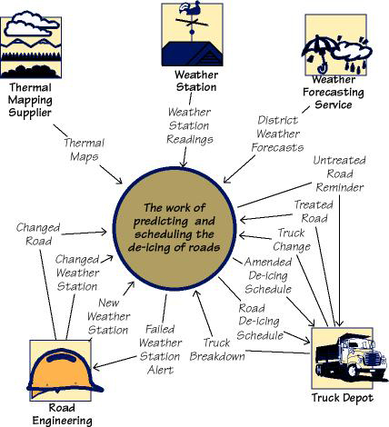

#### A.12.2.3 Examples

[A.12.2.3-P001] This work context model defines the connections between the part of the world that is under investigation and other people, organizations, hardware, and software (referred to as adjacent systems). The inputs and outputs represent the data and material that travel between the work and other parts of the world. The work context is the basis for partitioning the investigation and discovering the requirements.

#### A.12.2.4 Considerations

[A.12.2.4-P001] The names used on the context diagram should be consistent with the naming conventions (**Section 4**) and should eventually be defined in the data dictionary (**Section 7**). Without these definitions, the context model lacks the required rigor, and may be misunderstood. Relevant stakeholders must agree to the definitions of the interfaces shown on the context model.

#### A.12.2.5 Form

[A.12.2.5-P001] • A diagram showing the inputs and outputs that flow between the work and the adjacent systems

[A.12.2.5-P002] *or*

[A.12.2.5-P003] • A table that identifies all the inputs and outputs that flow between the work and the adjacent systems

[A.12.2.5-P004] The names of the inputs and outputs are eventually defined in the data dictionary (see **Section 7b**).

### A.12.3 6c. Work Partitioning

#### A.12.3.1 Content

[A.12.3.1-P001] This part of the specification lists all business events to which the work responds. Business events are happenings in the real world that affect the work. They may also occur because it is time for the work to do something—for example, produce weekly reports, remind nonpaying customers, check the status of a device, and so on. The response to each event is called a business use case (BUC); it represents a discrete functional partition of work.

[A.12.3.1-P002] The event list includes the following elements:

[A.12.3.1-P003] • Event name

[A.12.3.1-P004] • Input or triggering data flow from adjacent systems (identical to the name on the context diagram)

[A.12.3.1-P005] • Outputs to adjacent systems (identical to the names on the context diagram)

[A.12.3.1-P006] • Brief summary of the business use case (This is optional, but we have found it to be a very useful first step in defining the requirements for the business use case—you can think of it as a mini-scenario.)

[A.12.3.1-P007] • Classes of business data relevant to this event (You won’t know this early in the study of the event; as you go into detail, you will start to understand the essential data and you can add it to the event list.)

#### A.12.3.2 Motivation

[A.12.3.2-P001] The goal is to identify logical chunks of the work that can be used as the basis for discovering detailed requirements. These business events also provide the subsystems that can be used as the basis for managing detailed analysis and design. Each business event has a business use case whose details can be studied independently. However, all BUCs connect to each other through the stored business data (see **Section 7**).

#### A.12.3.3 Example

[A.12.3.3-P001] 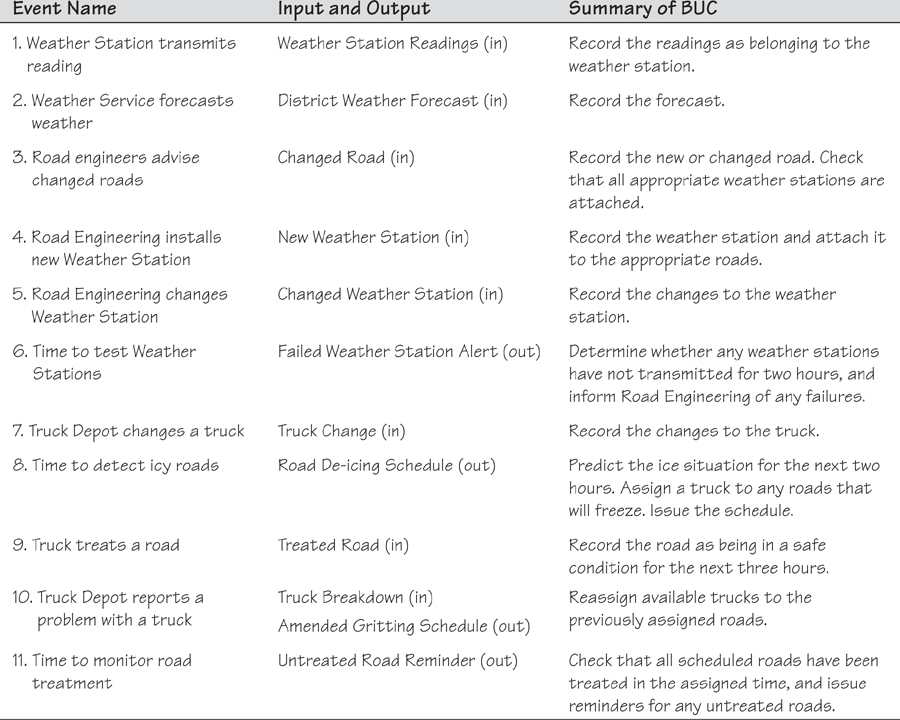

#### A.12.3.4 Considerations

[A.12.3.4-P001] Attempting to list the business events and create a one-sentence summary of each BUC is a way of testing the work context. This activity uncovers uncertainties and misunderstandings about the project and facilitates precise communications. When you perform an event analysis, it will usually prompt you to make some changes to your work context diagram.

[A.12.3.4-P002] We suggest that you gather requirements for discrete sections of the work. Doing so requires you to partition the work, and we have found business events to be the most convenient, consistent, and natural way to break the work into manageable units and to be able to trace the details back to the scope of the work.

#### A.12.3.5 Form

[A.12.3.5-P001] Business event list/table containing the following information for each event: event number, event name, name of input, name of output(s), summary of the business event response. The names on the business event list must match the names on the work context model/table (see **Section 6b**).

### A.12.4 6d. Specifying a Business Use Case

#### A.12.4.1 Content

[A.12.4.1-P001] This part comprises a specification of the details of how a business use case (BUC) responds to a business event.

#### A.12.4.2 Motivation

[A.12.4.2-P001] The purpose is to understand the detailed business response that must be carried out when a business event takes place and to provide a basis for discovering the detailed requirements. The understanding of the BUC also provides a basis for discussing which parts of the BUC should be carried out by the product that will be built.

#### A.12.4.3 Example

[A.12.4.3-P001] In the sample specifications included with the download of this template, you will find examples of BUC scenarios.

#### A.12.4.4 Considerations

[A.12.4.4-P001] Whatever approach you use to specify the details of a BUC, you should stay within the boundary of the input and output(s) for that business event. If you discover additional input or output data, then you need to change the input/output data both on the event list and on the work context diagram.

#### A.12.4.5 Form

[A.12.4.5-P001] A BUC can be specified using any combination of models that suits the analyst. The most commonly used approaches are activity diagrams, BUC scenarios, process flow diagrams, sequence diagrams, mind maps, and interview notes. The only caveat is that the inputs and outputs on your BUC must be precisely the same and hence traceable to the inputs and outputs on the corresponding business event.

## A.13 7. Business Data Model and Data Dictionary

### A.13.1 7a. Data Model

#### A.13.1.1 Content

[A.13.1.1-P001] This part consists of a specification of the essential subject matter, business objects, entities, and classes that are germane to the product. It might take the form of a first-cut class model, an entity relationship model, or any other kind of data model.

#### A.13.1.2 Motivation

[A.13.1.2-P001] The goal is to clarify the system’s subject matter, thereby triggering recognition of requirements not yet considered. To discover missing requirements, you can cross-check the data model and the events using a Create, Reference, Update, Delete (CRUD) table. The data model is a specification for all business data that is relevant to the scope of the work.

#### A.13.1.3 Example

[A.13.1.3-P001] This example is a model of the business system’s business subject matter using the Unified Modeling Language (UML) class model notation. It identifies all of the data that is created, referenced, updated, and deleted by processes within the scope of the work being studied. See **Section 6** for more on the scope of the work.

[A.13.1.3-P002] 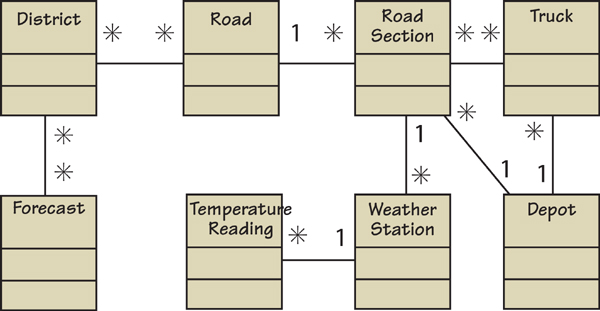

[A.13.1.3-P003] In this model, each of the rectangles represents a class of business data. The attributes of that class are defined in the data dictionary. For example:

[A.13.1.3-P004] District = A geographical area defined by the council

[A.13.1.3-P005] District Name + District Size + District Coordinates

[A.13.1.3-P006] Similarly, each attribute is also defined in the dictionary:

[A.13.1.3-P007] District Name = The unique name used by the engineers to identify a district

[A.13.1.3-P008] You can use any type of data or class model to capture this knowledge. The point is to capture the meaning of the business subject matter and the connections between the individual parts, and to show that you are consistent within your project. If you have an established company standard notation, use that, as it will help you to reuse knowledge between projects.

[A.13.1.3-P009] For more examples of data models, look at the example specifications that are packaged with the download of this requirements template.

#### A.13.1.4 Considerations

[A.13.1.4-P001] Are there any data or object models for similar or overlapping systems that might serve as a useful starting point? Is there a domain model for the subject matter dealt with by this system?

#### A.13.1.5 Form

[A.13.1.5-P001] You can use many different types of data models to model the business data, although you are most likely to encounter the following models:

[A.13.1.5-P002] • UML class model

[A.13.1.5-P003] • Entity relationship diagrams

[A.13.1.5-P004] • A table showing the class name, associations between classes, and attributes for each class

[A.13.1.5-P005] If your organization prefers a particular model, then you must use that one. Whichever type of model you use, note one important caveat: The data model that you build is a *business data model,* not a design for a database. Your model is concerned with identifying business classes by making a logical partitioning of all data within the work context and the necessary business relationships between those business classes. Your model is used as input to designing how the data will be implemented. The definitions of the attributes in each business class are found in the data dictionary (see **Section 7b**).

### A.13.2 7b. Data Dictionary

[A.13.2-P001] The glossary described earlier in **Section 4** of the template serves as the starting point for establishing common understanding of terminology. As you begin to define the scope of the investigation, you define the data inputs and outputs in a formal data dictionary. The terms that you define in this dictionary, right down to elemental level, are the same terms that you use when defining detailed atomic requirements.

#### A.13.2.1 Content

[A.13.2.1-P001] The data dictionary specifies the content of the following items:

[A.13.2.1-P002] • Classes in the data model

[A.13.2.1-P003] • Attributes of the classes

[A.13.2.1-P004] • Associations between the classes

[A.13.2.1-P005] • Inputs and outputs for all models

[A.13.2.1-P006] • Elements of data within the inputs and outputs

[A.13.2.1-P007] When implementation decisions are made, the technical specifications for the interfaces should be added to the dictionary.

#### A.13.2.2 Motivation

[A.13.2.2-P001] The work context diagram provides an accurate definition of the scope of the work being studied, and the product scope diagram (see **Sections 8a** and **8b**) defines the boundary of the product to be built. These definitions can be completely accurate only if the information flows bordering the scope have their attributes defined.

#### A.13.2.3 Examples

[A.13.2.3-P001] The following is a partial data dictionary for the road de-icing project we have been using as an example in this template. Note that this version of the dictionary is sorted alphabetically within the type.

[A.13.2.3-P002] 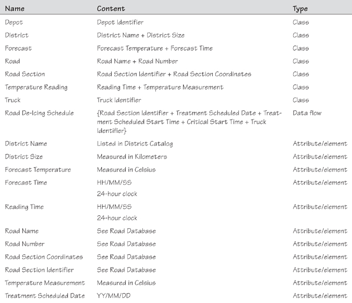

[A.13.2.3-P003] 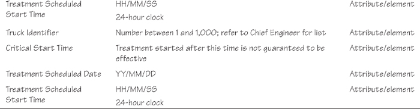

[A.13.2.3-P004] When implementation decisions are eventually made, the format of the data is added to the dictionary by the designers/implementers.

#### A.13.2.4 Considerations

[A.13.2.4-P001] The dictionary provides a link between the requirements/business analysts and the designers/developers/implementers. The implementers add implementation details to the terms in the dictionary, defining how the data will be implemented. Moreover, they add terms that are present because of the chosen technology and that are independent of the business requirements.

[A.13.2.4-P002] As you study the work, you will often discover that an entry that you have put in the Naming Conventions and Terminology (**Section 4**) is actually a specific flow of data or an attribute data. When this happens you should transfer the entry to the data dictionary.

#### A.13.2.5 Form

[A.13.2.5-P001] The data dictionary may be maintained in a variety of forms, depending on the tools that you have at your disposal. The important issue is that you make it as easy as possible to cross-reference the use of terms in requirements, documents, and models with their definitions in the dictionary. Forms commonly used for maintaining the data dictionary include spreadsheets, databases, and automated requirements tools.

## A.14 8. The Scope of the Product

### A.14.1 8a. Product Boundary

[A.14.1-P001] A use case diagram identifies the boundaries between the users (actors) and the product. You arrive at the product boundary by inspecting each business use case (BUC) and determining, in conjunction with the appropriate stakeholders, which part of the business use case should be automated (or satisfied by some sort of product) and which part should be done by the user or some other product. This task must take into account the abilities of the users/actors (**Section 2**), the constraints (**Section 3**), the goals of the project (**Section 1**), and your knowledge of both the work and the technology that can make the best contribution to the work.

[A.14.1-P002] The example use case diagram shows the users/actors outside the product boundary (the rectangle). The product use cases (PUCs) are the ellipses inside the boundary. The numbers link each PUC back to the BUC from which it was derived (see **Section 7**). The arrows denote usage. In this version of a PUC diagram, we put names on the arrows to make it more precise and traceable. Note that actors can be either automated or human.

[A.14.1-P003] You derive the PUCs by deciding where the product boundary should be for each BUC. These decisions are based on your own and appropriate stakeholders’ knowledge of the work and the requirements constraints. Your internal design might, and probably will, mean that you will implement a PUC with several system use cases (SUCs).

[A.14.1-P004] 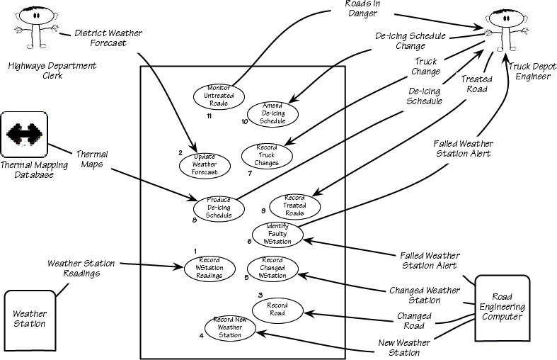

[A.14.1-P005] The numbers on this PUC diagram correspond to the BUC numbers on the business event list (see **Section 7**).

#### A.14.1.1 Example

[A.14.1.1-P001] You can see that the PUC diagram is an effective summary for a small number (fewer than 20 or so) of PUCs. If you have a larger number of PUCs, then a product scope diagram together with a PUC summary table (see **Section 8b**) is a better approach.

[A.14.1.1-P002] Following is an example of a product scope diagram for the Road De-icing project. The content of each interface on this type of diagram is defined in the data dictionary and can also be supported by a prototype or simulation of some kind. Some projects publish a separate document called the interface specification document. The content of that document would be the definitions of the interfaces on the product scope diagram, often supported by prototypes and models.

[A.14.1.1-P003] 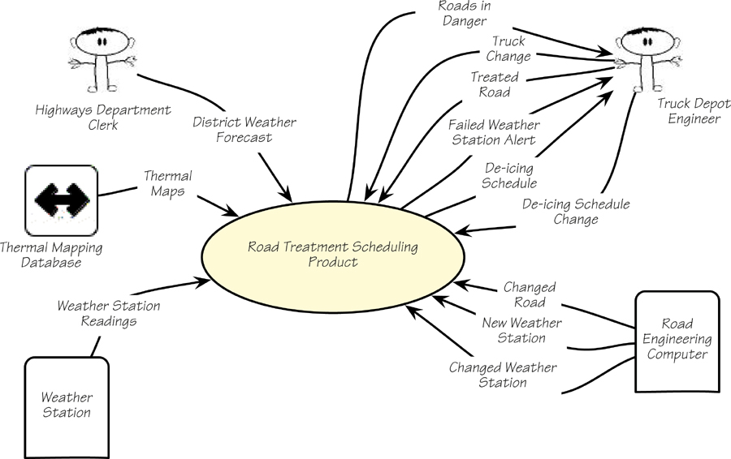

[A.14.1.1-P004] This product scope diagram summarizes the interfaces between the product and the actors/users.

#### A.14.1.2 Form

[A.14.1.2-P001] • A product use case diagram

[A.14.1.2-P002] • A product scope diagram supported by individual use case specification

[A.14.1.2-P003] • Specifications and prototypes of the interfaces on the scope diagram

### A.14.2 8b. Product Use Case Table

[A.14.2-P001] The product scope diagram is a useful summary of all interfaces between the product and other automated systems, organizations, and users. If there are a manageable number of PUCs—say, fewer than 20—then the PUC diagram is useful as a graphical way of summarizing the PUCs relevant to the product. In practice, we have found that a product use case table is more useful because it can handle larger numbers of PUCs and it precisely identifies the input and output data that defines the boundary of each PUC.

[A.14.2-P002] 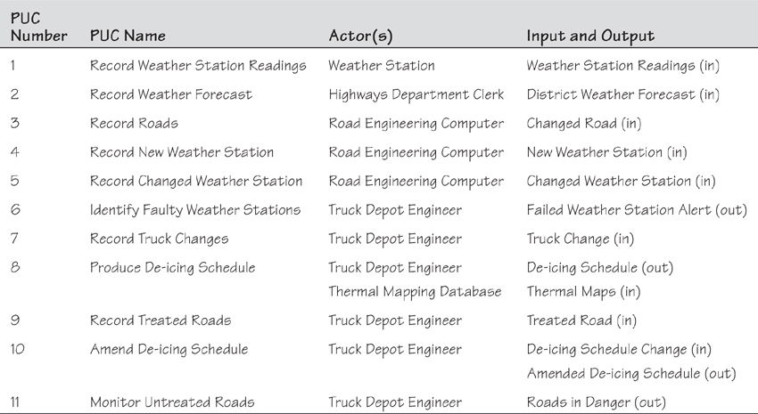

[A.14.2-P003] Product Use Case Summary Table

### A.14.3 8c. Individual Product Use Cases

[A.14.3-P001] This part of the specification is where you define the details about the individual product use cases listed on your PUC table. You can include a scenario or model for each product use case on your list.

#### A.14.3.1 Form

[A.14.3.1-P001] • A text scenario

[A.14.3.1-P002] • A storyboard

[A.14.3.1-P003] • A low-fidelity prototype

[A.14.3.1-P004] • A high-fidelity prototype

[A.14.3.1-P005] • A formal use case specification including exceptions and alternatives

[A.14.3.1-P006] • A sequence diagram, activity diagram, data flow diagram, or any other type of model that is familiar to your project group

## A.15 9. Functional and Data Requirements

### A.15.1 9a. Functional Requirements

#### A.15.1.1 Content

[A.15.1.1-P001] This section consists of a specification of each atomic functional requirement. As for all types of atomic requirements (functional, non-functional, constraint), you can use the requirements shell as a guide regarding which attributes should be specified. A full explanation of the atomic requirement and its attributes is included in this template’s introductory material.

#### A.15.1.2 Motivation

[A.15.1.2-P001] The intention is to specify the detailed functional requirements to be carried out by the product.

#### A.15.1.3 Examples

[A.15.1.3-P001] 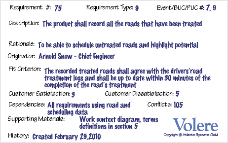

#### A.15.1.4 Fit Criterion

[A.15.1.4-P001] Each functional requirement should have a fit criterion or a test case. Whichever is used, it must be a benchmark that the tester uses to objectively determine whether the implemented product has met the requirement.

#### A.15.1.5 Considerations

[A.15.1.5-P001] If you have produced an event/use case list (see **Sections 6c**, **8a**, and **8b**), then you can use it to help you trigger the functional requirements for each event/use case. If you have not produced such a list, give each functional requirement a unique number and, to help with traceability, partition these requirements into event/use case–related groups later in the development process.

[A.15.1.5-P002] If you have not identified the product boundary and are not in a position to determine the product use cases (PUCs), you should write the functional and non-functional requirements for the business use cases (BUCs). This is an especially good strategy if you are writing business requirements and asking suppliers to tell you which of your business requirements can be satisfied by their product(s).

#### A.15.1.6 Form

[A.15.1.6-P001] The form that you use to capture and maintain your atomic requirements (functional, non-functional, and constraint) depends on the tools that you have available. Volere snow cards are often a useful aid to help you in discovering requirements but, due to the volume of requirements and the need to be able to make changes, some kind of automated form is the best way to manage and maintain your atomic requirements. Common forms for atomic requirements include the following:

[A.15.1.6-P002] • A spreadsheet.

[A.15.1.6-P003] • A database provided with whatever requirements tool(s) you have available. A wide variety of tools are available on the market; refer to **www.volere.co.uk/tools** for a list.

[A.15.1.6-P004] • An intranet set up by you to maintain and make accessible the atomic requirements and their attributes.

[A.15.1.6-P005] • A custom-built database.

[A.15.1.6-P006] Whatever form you use to record and maintain your requirements, it is important to be consistent with your numbering and terminology so that you can check for completeness and respond to change.

## A.16 Non-functional Requirements

[A.16-P001] **Sections 10**–**17** describe the non-functional requirements. The form of these requirements is the same as for the functional requirements as described previously.

## A.17 10. Look and Feel Requirements

### A.17.1 10a. Appearance Requirements

#### A.17.1.1 Content

[A.17.1.1-P001] The section contains requirements relating to the spirit of the product. Your client may have made particular demands for the product, such as corporate branding, colors to be used, and so on. This section captures the requirements for the appearance. Do not attempt to design it until the appearance requirements are known.

#### A.17.1.2 Motivation

[A.17.1.2-P001] The intention is to ensure that the appearance of the product conforms to the organization’s expectations.

#### A.17.1.3 Examples

[A.17.1.3-P001] ***The product shall be attractive to a teenage audience.***

[A.17.1.3-P002] ***The product shall comply with corporate branding standards.***

#### A.17.1.4 Fit Criterion

[A.17.1.4-P001] ***A sampling of representative teenagers shall, without prompting or enticement, start using the product within four minutes of their first encounter with it.***

[A.17.1.4-P002] ***The office of branding shall certify that the product complies with the current standards.***

#### A.17.1.5 Considerations

[A.17.1.5-P001] Even if you are using prototypes, it is important to understand the requirements for the appearance. The prototype is used to help elicit requirements; it should not be envisioned as a substitute for the requirements.

### A.17.2 10b. Style Requirements

#### A.17.2.1 Content

[A.17.2.1-P001] This part identifies requirements that specify the mood, style, or feeling of the product, which influences the way a potential customer will see the product. Also, it specifies the stakeholders’ intentions for the amount of interaction the user is to have with the product.

[A.17.2.1-P002] In this section, you would also describe the appearance of the package, if this is to be a manufactured product. The package may have some requirements as to its size, style, and consistency with other packages put out by your organization. Keep in mind, if applicable, the European laws on packaging, which require that the package not be significantly larger than the product it encloses.

[A.17.2.1-P003] The style requirements that you record here will guide the designers to create a product as envisioned by your client.

#### A.17.2.2 Motivation

[A.17.2.2-P001] Given the state of today’s market and people’s expectations, we cannot afford to build products that have the wrong style. Once the functional requirements are satisfied, it is often the appearance and style of products that determine whether they are successful. Your task in this section is to determine precisely how the product shall appear to its intended consumer.

#### A.17.2.3 Example

[A.17.2.3-P001] ***The product shall appear authoritative.***

#### A.17.2.4 Fit Criterion

[A.17.2.4-P001] ***After their first encounter with the product, 70 percent of representative potential customers shall agree they feel they can trust the product.***

#### A.17.2.5 Considerations

[A.17.2.5-P001] The look and feel requirements specify your client’s vision of the product’s appearance. The requirements may at first seem to be rather vague (e.g., “conservative and professional appearance”), but these will be quantified by their fit criteria. The fit criteria give you the opportunity to extract from your client precisely what is meant, and give the designer precise instructions on what he is to accomplish.

## A.18 11. Usability and Humanity Requirements

[A.18-P001] This section is concerned with requirements that make the product usable and ergonomically acceptable to its hands-on users.

### A.18.1 11a. Ease of Use Requirements

#### A.18.1.1 Content

[A.18.1.1-P001] This section describes your client’s aspirations for how easy it is for the intended users of the product to operate it. The product’s usability is derived from the abilities of the expected users of the product and the complexity of its functionality.

[A.18.1.1-P002] The usability requirements should cover properties such as these:

[A.18.1.1-P003] • Efficiency of use: How quickly or accurately the user can use the product.

[A.18.1.1-P004] • Ease of remembering: How much the casual user is expected to remember about using the product.

[A.18.1.1-P005] • Error rates: For some products it is crucial that the user commits very few, or no, errors.

[A.18.1.1-P006] • Overall satisfaction in using the product: This is especially important for commercial, interactive products that face a great deal of competition. Websites are a good example.

[A.18.1.1-P007] • Feedback: How much feedback the user needs to feel confident that the product is actually accurately doing what the user expects. The necessary degree of feedback will be higher for some products (e.g., safety-critical products) than for others.

#### A.18.1.2 Motivation

[A.18.1.2-P001] The intention is to guide the product’s designers toward building a product that meets the expectations of its eventual users.

#### A.18.1.3 Examples

[A.18.1.3-P001] ***The product shall be easy for 11-year-old children to use.***

[A.18.1.3-P002] ***The product shall help the user to avoid making mistakes.***

[A.18.1.3-P003] ***The product shall make the users want to use it.***

[A.18.1.3-P004] ***The product shall be used by people with no training, and possibly no understanding of English.***

#### A.18.1.4 Fit Criterion

[A.18.1.4-P001] These examples may seem simplistic, but they do express the intention of the client. To completely specify what is meant by the requirement, you must add a measurement against which it can be tested—that is, a fit criterion. Here are the fit criteria for the preceding examples:

[A.18.1.4-P002] ***Eighty percent of a test panel of 11-year-old children shall be able to successfully complete [list of tasks] within [specified time].***

[A.18.1.4-P003] ***One month’s use of the product shall result in a total error rate of less than 1 percent.***

[A.18.1.4-P004] ***Seventy-five percent of the intended users are regularly using the product after a three-week familiarization period.***

#### A.18.1.5 Considerations

[A.18.1.5-P001] Refer to **Section 3**, Users of the Product, to ensure that you have considered the usability requirements from the perspective of all the different types of users.

[A.18.1.5-P002] It may be necessary to have special consulting sessions with your users and your client to determine whether any special usability considerations must be built into the product.

[A.18.1.5-P003] You could also consider consulting a usability laboratory experienced in testing the usability of products that have a project situation (**Sections 1**–**7** of this template) similar to yours.

### A.18.2 11b. Personalization and Internationalization Requirements

#### A.18.2.1 Content

[A.18.2.1-P001] This section describes the way in which the product can be altered or configured to take into account the user’s personal preferences or choice of language.

[A.18.2.1-P002] The personalization requirements should cover issues such as the following:

[A.18.2.1-P003] • Languages, spelling preferences, and language idioms

[A.18.2.1-P004] • Currencies, including the symbols and decimal conventions

[A.18.2.1-P005] • Personal configuration options

#### A.18.2.2 Motivation

[A.18.2.2-P001] The goal is to ensure that the product’s users do not have to struggle with, or meekly accept, the builder’s cultural conventions.

#### A.18.2.3 Examples

[A.18.2.3-P001] ***The product shall retain the buyer’s buying preferences.***

[A.18.2.3-P002] ***The product shall allow the user to select a chosen language.***

#### A.18.2.4 Considerations

[A.18.2.4-P001] Consider the country and culture of the potential customers and users of your product. Any out-of-country users will welcome the opportunity to convert the product’s display to their home spelling and expressions.

[A.18.2.4-P002] By allowing users to customize the way in which they use the product, you give them the opportunity to work more closely with your organization as well as enjoy their own personal user experience.

[A.18.2.4-P003] You might also consider the configurability of the product. Configurability allows different users to have different functional variations of the product.

### A.18.3 11c. Learning Requirements

#### A.18.3.1 Content

[A.18.3.1-P001] These requirements specify how easy it should be to learn to use the product. The learning curve ranges from zero time for products intended for placement in the public domain (e.g., a parking meter or a website) to a considerable amount of time for complex, highly technical products. (We know of one product where it was necessary for graduate engineers to spend 18 months in a training program before being qualified to use the product.)

#### A.18.3.2 Motivation

[A.18.3.2-P001] The goal is to quantify the amount of time that your client feels is allowable before a user can successfully use the product. This requirement guides designers to understand how users will learn the product. For example, designers may build elaborate interactive help facilities into the product, or the product may be packaged with a tutorial. Alternatively, the product may have to be constructed so that all of its functionality is apparent upon first encountering it.

#### A.18.3.3 Examples

[A.18.3.3-P001] ***The product shall be easy for an engineer to learn.***

[A.18.3.3-P002] ***A clerk shall be able to be productive within a short time.***

[A.18.3.3-P003] ***The product shall be able to be used by members of the public who will receive no training before using it.***

[A.18.3.3-P004] ***The product shall be used by engineers who will attend five weeks of training before using the product.***

#### A.18.3.4 Fit Criterion

[A.18.3.4-P001] ***An engineer shall produce a [specified result] within [specified time] of beginning to use the product, without needing to use the manual.***

[A.18.3.4-P002] ***After receiving [number of hours] training, a clerk shall be able to produce [quantity of specified outputs] per [unit of time].***

[A.18.3.4-P003] ***[Agreed percentage] of a test panel shall successfully complete [specified task] within [specified time limit].***

[A.18.3.4-P004] ***The engineers shall achieve [agreed percentage] pass rate from the final examination of the training.***

#### A.18.3.5 Considerations

[A.18.3.5-P001] Refer to **Section 2d**, Hands-on Users of the Product, to ensure that you have considered the ease of learning requirements from the perspective of all the different types of users.

### A.18.4 11d. Understandability and Politeness Requirements

[A.18.4-P001] This section is concerned with discovering requirements related to concepts and metaphors that are familiar to the intended end users.

#### A.18.4.1 Content

[A.18.4.1-P001] This section specifies the requirement for the product to be understood by its users. While “usability” refers to ease of use, efficiency, and similar characteristics, “understandability” determines whether the users instinctively know what the product will do for them and how it fits into their view of the world. You can think of understandability as the product being polite to its users and not expecting them to know or learn things that have nothing to do with their business problem. Another aspect of politeness is that the product should not expect the user to input any information to which the product already has access.

#### A.18.4.2 Motivation

[A.18.4.2-P001] The intention is to avoid forcing users to learn terms and concepts that are part of the product’s internal construction and are not relevant to the users’ world. Another goal is to make the product more comprehensible and, therefore, more likely to be adopted by its intended users.

#### A.18.4.3 Examples

[A.18.4.3-P001] ***The product shall use symbols and words that are naturally understandable by the user community.***

[A.18.4.3-P002] ***The product shall hide the details of its construction from the user.***

#### A.18.4.4 Considerations

[A.18.4.4-P001] Refer to **Section 2d**, Hands-on Users of the Product, and consider the world from the point of view of each of the different types of users.

### A.18.5 11e. Accessibility Requirements

#### A.18.5.1 Content

[A.18.5.1-P001] These requirements specify how easy it should be for people with common disabilities to access the product. These disabilities might be related to physical disability or visual, hearing, cognitive, or other abilities.

#### A.18.5.2 Motivation

[A.18.5.2-P001] In many countries it is required that some products be made available to the disabled. In any event, it is self-defeating to exclude this sizable community of potential customers.

#### A.18.5.3 Examples

[A.18.5.3-P001] ***The product shall be usable by partially sighted users.***

[A.18.5.3-P002] ***The product shall conform to the Americans with Disabilities Act.***

#### A.18.5.4 Considerations

[A.18.5.4-P001] Some users have disabilities other than the commonly described ones. In addition, some partial disabilities are fairly common. A simple, and not very consequential, example is that approximately 20 percent of males are red-green color-blind.

## A.19 12. Performance Requirements

### A.19.1 12a. Speed and Latency Requirements

#### A.19.1.1 Content

[A.19.1.1-P001] This section specifies the amount of time available for the product to complete specified tasks. Such requirements often refer to response times, but they can also refer to the product’s ability to operate at a speed suitable for the intended environment.

#### A.19.1.2 Motivation

[A.19.1.2-P001] Some products—usually real-time products—must be able to perform some of their functionality within a given time slot. Failure to do so may mean catastrophic failure (e.g., a ground-sensing radar in an airplane fails to detect an upcoming mountain) or the product will not cope with the required volume of use (e.g., an automated ticket-selling machine).

#### A.19.1.3 Examples

[A.19.1.3-P001] ***Any interface between a user and the automated system shall have a maximum response time of 2 seconds.***

[A.19.1.3-P002] ***The response shall be fast enough to avoid interrupting the user’s flow of thought.***

[A.19.1.3-P003] ***The product shall poll the sensor every 10 seconds.***

[A.19.1.3-P004] ***The product shall download the new status parameters within 5 minutes of a change.***

#### A.19.1.4 Fit Criterion

[A.19.1.4-P001] Fit criteria are needed when the description of the requirement is not quantified. However, we find that most performance requirements are stated in quantified terms. The exception is the second requirement shown above, for which the suggested fit criterion is this:

[A.19.1.4-P002] ***The product shall respond in less than 1 second for 90 percent of the interrogations. No response shall take longer than 2.5 seconds.***

#### A.19.1.5 Considerations

[A.19.1.5-P001] The importance of different types of speed requirements varies widely. If you are working on a missile guidance system, then speed is extremely important. By contrast, an inventory control report that is run once every six months has no need for a lightning-fast response time.

[A.19.1.5-P002] Customize this section of the template to give examples of the speed requirements that are important within your environment.

### A.19.2 12b. Safety-Critical Requirements

#### A.19.2.1 Content

[A.19.2.1-P001] This part of the specification quantifies the perceived risk of damage to people, property, and environment. Different countries have different standards, so the fit criteria must specify precisely which standards the product must meet.

#### A.19.2.2 Motivation

[A.19.2.2-P001] The intention is to understand and highlight the damage that could potentially occur when using the product within the expected operational environment.

#### A.19.2.3 Examples

[A.19.2.3-P001] ***The product shall not emit noxious gases that damage people’s health.***

[A.19.2.3-P002] ***The heat exchanger shall be shielded from human contact.***

#### A.19.2.4 Fit Criterion

[A.19.2.4-P001] ***The product shall be certified to comply with the Health Department’s standard E110-98. It is to be certified by qualified testing engineers.***

[A.19.2.4-P002] ***No member of a test panel of [specified size] shall be able to touch the heat exchanger. The heat exchanger must also comply with safety standard [specify which one].***

#### A.19.2.5 Considerations

[A.19.2.5-P001] The example requirements given here apply to some, but not all, products. It is not possible to give examples of every variation of safety-critical requirements. To make the template work in your environment, you should customize it by adding examples that are specific to your industry and type of product.

[A.19.2.5-P002] Also, be aware that different countries have different safety standards and laws relating to safety. If you plan to sell your product internationally, you must be aware of these laws. A colleague has suggested that for electrical products, if you follow the German standards, the largest number of countries will be supported.

[A.19.2.5-P003] If you are building safety-critical systems, then the relevant safety-critical standards are already well specified. You will likely have safety experts on your staff; they are the best source of the relevant safety-critical requirements for your type of product. They will almost certainly have copious information that you can use in this part of the template.

[A.19.2.5-P004] Consult your legal department. Members of this department will be aware of the kinds of lawsuits that have resulted from product safety failure. This is probably the best starting place for generating relevant safety requirements.

### A.19.3 12c. Precision or Accuracy Requirements

#### A.19.3.1 Content

[A.19.3.1-P001] This section of the specification quantifies the desired accuracy of the results produced by the product.

#### A.19.3.2 Motivation

[A.19.3.2-P001] The goal is to set the client’s and users’ expectations for the precision of the product.

#### A.19.3.3 Examples

[A.19.3.3-P001] ***All monetary amounts shall be accurate to two decimal places.***

[A.19.3.3-P002] ***Accuracy of road temperature readings shall be within ±2°C.***

#### A.19.3.4 Considerations

[A.19.3.4-P001] If you have done any detailed work on definitions, then some precision requirements might be adequately defined by definitions in the dictionary in **Section 7**.

[A.19.3.4-P002] You might consider which units the product is intended to use. Readers will recall the spacecraft that crashed on Mars when coordinates were sent as metric data rather than as imperial data.

[A.19.3.4-P003] The product might also need to keep accurate time, be synchronized with a time server, or work in UTC.

[A.19.3.4-P004] Also, be aware that some currencies have no decimal places, such as the Japanese yen.

### A.19.4 12d. Reliability and Availability Requirements

#### A.19.4.1 Content

[A.19.4.1-P001] This section quantifies the necessary reliability of the product. The reliability is usually expressed as the allowable time between failures, or the total allowable failure rate.

[A.19.4.1-P002] This section also quantifies the expected availability of the product.

#### A.19.4.2 Motivation

[A.19.4.2-P001] It is critical for some products not to fail too often. This section allows you to explore the possibility of failure and to specify realistic levels of service. It also gives you the opportunity to set the client’s and users’ expectations about the amount of time that the product will be available for use.

#### A.19.4.3 Examples

[A.19.4.3-P001] ***The product shall be available for use 24 hours per day, 365 days per year.***

[A.19.4.3-P002] ***The product shall be available for use between the hours of 8:00 a.m. and 5:30 p.m.***

[A.19.4.3-P003] ***The escalator shall run from 6 a.m. until 10 p.m. or until the last flight arrives.***

[A.19.4.3-P004] ***The product shall achieve 99 percent uptime.***

#### A.19.4.4 Considerations

[A.19.4.4-P001] Consider carefully whether the real requirement for your product is that it is available for use or that it does not fail at any time.

[A.19.4.4-P002] Consider also the cost of reliability and availability, and determine whether the requirement is justified for your product on those bases.

### A.19.5 12e. Robustness or Fault-Tolerance Requirements

#### A.19.5.1 Content

[A.19.5.1-P001] Robustness specifies the ability of the product to continue to function under abnormal circumstances.

#### A.19.5.2 Motivation

[A.19.5.2-P001] The goal is to ensure that the product is able to provide some or all of its services after or during some abnormal happening in its environment.

#### A.19.5.3 Examples

[A.19.5.3-P001] ***The product shall continue to operate in local mode whenever it loses its link to the central server.***

[A.19.5.3-P002] ***The product shall provide 10 minutes of emergency operation should it become disconnected from the electricity source.***

#### A.19.5.4 Considerations

[A.19.5.4-P001] Abnormal happenings can almost be considered normal. Today’s products are so large and complex that there is a good chance that at any given time, one component will not be functioning correctly. Robustness requirements are intended to prevent total failure of the product.

[A.19.5.4-P002] You could also consider disaster recovery in this section. Such a plan describes the ability of the product to reestablish acceptable performance after faults or abnormal happenings.

### A.19.6 12f. Capacity Requirements

#### A.19.6.1 Content

[A.19.6.1-P001] This section specifies the volumes of data that the product must be able to deal with and the amount of data stored by the product.

#### A.19.6.2 Motivation

[A.19.6.2-P001] The intention is to ensure that the product is capable of processing the expected volumes.

#### A.19.6.3 Examples

[A.19.6.3-P001] ***The product shall cater to 300 simultaneous users within the period from 9:00 a.m. to 11:00 a.m. Maximum loading at other periods will be 150 simultaneous users.***

[A.19.6.3-P002] ***During a launch period, the product shall cater to a maximum of 20 people who are in the inner chamber.***

#### A.19.6.4 Fit Criterion

[A.19.6.4-P001] In this case, the requirement description is quantified and, therefore, can be tested.

### A.19.7 12g. Scalability or Extensibility Requirements

#### A.19.7.1 Content

[A.19.7.1-P001] This part specifies the expected increases in size that the product must be able to handle. As a business grows (or is expected to grow), software products must increase their capacities to cope with the new volumes.

#### A.19.7.2 Motivation

[A.19.7.2-P001] The intention is to ensure that the designers allow capacity for future growth.

#### A.19.7.3 Examples

[A.19.7.3-P001] ***The product shall be capable of processing the existing 100,000 customers. This number is expected to grow to 500,000 customers within three years.***

[A.19.7.3-P002] ***The product shall be able to process 50,000 transactions per hour within two years of its launch.***

### A.19.8 12h. Longevity Requirements

#### A.19.8.1 Content

[A.19.8.1-P001] This section specifies the expected lifetime of the product.

#### A.19.8.2 Motivation

[A.19.8.2-P001] The intention is to ensure that the product is built based on an understanding of the expected return on investment.

#### A.19.8.3 Examples

[A.19.8.3-P001] ***The product shall be expected to operate within the defined maximum maintenance budget for a minimum of five years.***

## A.20 13. Operational and Environmental Requirements

### A.20.1 13a. Expected Physical Environment

#### A.20.1.1 Content

[A.20.1.1-P001] This section specifies the physical environment in which the product will operate.

#### A.20.1.2 Motivation

[A.20.1.2-P001] The intention is to highlight conditions that might need special requirements, preparations, or training. These requirements ensure that the product is fit to be used in its intended environment.

#### A.20.1.3 Examples

[A.20.1.3-P001] ***The product shall be used by a worker, standing up, outside in cold, rainy conditions.***

[A.20.1.3-P002] ***The product shall be used in noisy conditions with a lot of dust.***

[A.20.1.3-P003] ***The product shall be able to fit in a pocket or purse.***

[A.20.1.3-P004] ***The product shall be usable in dim light.***

[A.20.1.3-P005] ***The product shall not be louder than the existing noise level in the environment.***

#### A.20.1.4 Considerations

[A.20.1.4-P001] Consider the work environment: Will the product operate in some unusual environment? Does this lead to special requirements? Also see **Section 11**, Usability and Humanity Requirements.

### A.20.2 13b. Requirements for Interfacing with Adjacent Systems

#### A.20.2.1 Content

[A.20.2.1-P001] This section describes the requirements to interface with partner applications and/or devices that the product needs to operate successfully.

#### A.20.2.2 Motivation

[A.20.2.2-P001] Requirements for the interfaces to other applications often remain undiscovered until implementation time. You can avoid a high degree of rework by discovering these requirements early.

#### A.20.2.3 Examples

[A.20.2.3-P001] ***The products shall work on the last four releases of the five most popular browsers.***

[A.20.2.3-P002] ***The new version of the spreadsheet must be able to access data from the previous two versions.***

[A.20.2.3-P003] ***The product must interface with the applications that run on the remote weather stations.***

#### A.20.2.4 Fit Criterion

[A.20.2.4-P001] For each inter-application interface, specify the following elements:

[A.20.2.4-P002] • The data content

[A.20.2.4-P003] • The physical material content

[A.20.2.4-P004] • The medium that carries the interface

[A.20.2.4-P005] • The frequency

[A.20.2.4-P006] • The volume

[A.20.2.4-P007] • The trigger

[A.20.2.4-P008] • The standards/protocols that apply to the interface

### A.20.3 13c. Productization Requirements

#### A.20.3.1 Content

[A.20.3.1-P001] This section specifies any requirements that are necessary to make the product into a distributable or saleable item. It is also appropriate to describe here the operations needed to install a software product successfully.

#### A.20.3.2 Motivation

[A.20.3.2-P001] The goal is to ensure that if work must be done to get the product out the door, then that work becomes part of the requirements. Also, this section is intended to quantify the client’s and users’ expectations about the amount of time, money, and resources they will need to allocate to install the product.

#### A.20.3.3 Examples

[A.20.3.3-P001] ***The product shall be downloadable.***

[A.20.3.3-P002] ***The product shall be able to be installed by an untrained user without recourse to separately printed instructions.***

[A.20.3.3-P003] ***The product shall be of a size such that it can fit on one DVD.***

#### A.20.3.4 Considerations

[A.20.3.4-P001] Some products have special needs to turn them into a saleable or usable product. You might consider that the product has to be protected such that only paid-up customers can access it.

[A.20.3.4-P002] Ask questions of your marketing department to discover unstated assumptions that have been made about the specified environment and the customers’ expectations of how long installation will take and how much it will cost.

[A.20.3.4-P003] Most commercial products have needs in this area.

### A.20.4 13d. Release Requirements

#### A.20.4.1 Content

[A.20.4.1-P001] This section specifies the intended release cycle for the product and the form that the release shall take.

#### A.20.4.2 Motivation

[A.20.4.2-P001] The goal is to make everyone aware of how often you intend to produce new releases of the product.

#### A.20.4.3 Examples

[A.20.4.3-P001] ***The maintenance releases will be offered to end users once a year.***

[A.20.4.3-P002] ***Each release shall not cause previous features to fail.***

#### A.20.4.4 Fit Criterion

[A.20.4.4-P001] The fit criterion describes the type of maintenance as well as the amount of effort budgeted for it.

#### A.20.4.5 Considerations

[A.20.4.5-P001] Do you have any existing contractual commitments or maintenance agreements that might be affected by the new product?

## A.21 14. Maintainability and Support Requirements

### A.21.1 14a. Maintenance Requirements

#### A.21.1.1 Content

[A.21.1.1-P001] This section quantifies the time necessary to make specified changes to the product.

#### A.21.1.2 Motivation

[A.21.1.2-P001] The intention is to make everyone aware of the maintenance needs of the product.

#### A.21.1.3 Examples

[A.21.1.3-P001] ***New BI reports must be available within one working week of the date when the requirements are agreed upon.***

[A.21.1.3-P002] ***A new weather station must be able to be added to the system overnight.***

#### A.21.1.4 Considerations

[A.21.1.4-P001] Sometimes there may be special requirements for maintainability, such as that the product must be able to be maintained by its end users or by developers who are not the original developers. These requirements have an effect on the way that the product is developed. In addition, there may be requirements for documentation or training.

[A.21.1.4-P002] You might also consider writing testability requirements in this section.

### A.21.2 14b. Supportability Requirements

#### A.21.2.1 Content

[A.21.2.1-P001] This section specifies the level of support that the product requires. Support is often provided via a help desk. If people will provide support for the product, that service is considered part of the product: Are there any requirements for that support? You might also build support into the product itself, in which case this section is the place to write those requirements.

#### A.21.2.2 Motivation

[A.21.2.2-P001] The goal is to ensure that the support aspect of the product is adequately specified.

#### A.21.2.3 Considerations

[A.21.2.3-P001] Consider the anticipated level of support, and which forms it might take. For example, a constraint might state that there is to be no printed manual. Alternatively, the product might need to be entirely self-supporting.

### A.21.3 14c. Adaptability Requirements

#### A.21.3.1 Content

[A.21.3.1-P001] Describe other platforms or environments to which the product must be ported.

#### A.21.3.2 Motivation

[A.21.3.2-P001] The goal is to publicize the client’s and users’ expectations about the platforms on which the product will be able to run.

#### A.21.3.3 Examples

[A.21.3.3-P001] ***The product is expected to run on iOS and Android.***

[A.21.3.3-P002] ***The product might eventually be sold in the Japanese market.***

[A.21.3.3-P003] ***The product is designed to run in offices, but we intend to have a version running in restaurant kitchens.***

#### A.21.3.4 Fit Criterion

[A.21.3.4-P001] • Specification of system software on which the product must operate

[A.21.3.4-P002] • Specification of future environments in which the product is expected to operate

[A.21.3.4-P003] • Time allowed to make the transition

#### A.21.3.5 Considerations

[A.21.3.5-P001] Question your marketing department to discover unstated assumptions that have been made about the portability of the product.

## A.22 15. Security Requirements

### A.22.1 15a. Access Requirements

#### A.22.1.1 Content

[A.22.1.1-P001] This part of the specification indicates who is authorized to access the product (both functionality and data), under which circumstances that access is granted, and to which parts of the product access is allowed.

#### A.22.1.2 Motivation

[A.22.1.2-P001] The goal is to understand the expectations for confidentiality aspects of the system.

#### A.22.1.3 Examples

[A.22.1.3-P001] ***Only direct managers can see the personnel records of their staff.***

[A.22.1.3-P002] ***Only holders of a current security clearance can enter the building.***

#### A.22.1.4 Fit Criterion

[A.22.1.4-P001] • Security standards to be complied with

[A.22.1.4-P002] • User roles and/or names of people who have clearance to access specified data

[A.22.1.4-P003] • User roles and/or names of people who have clearance to add, change, delete specified data

#### A.22.1.5 Considerations

[A.22.1.5-P001] Is there any data that management considers to be sensitive? Is there any data that low-level users do not want management to have access to? Are there any processes that might cause damage or might be used for personal gain? Are there any people who should not have access to the system?

[A.22.1.5-P002] Avoid stating how you would design a solution to the security requirements—for instance, don’t specify a password system. Your aim here is to identify the security requirement; the design will flow from this requirement.

[A.22.1.5-P003] Consider asking for help. Computer security is a highly specialized field, and one in which improperly qualified people have no business meddling. If your product has need of more than average security, we advise you to make use of a security consultant. Such consultants are not cheap, but the unhappy results of inadequate security can be even more expensive.

### A.22.2 15b. Integrity Requirements

#### A.22.2.1 Content

[A.22.2.1-P001] This part specifies the required integrity of databases and other files, and of the product itself.

#### A.22.2.2 Motivation

[A.22.2.2-P001] The goals are twofold: (1) to understand the expectations for the integrity of the product’s data and (2) to specify what the product will do to ensure its integrity in the case of an unwanted happening such as attack from the outside or unintentional misuse by an authorized user.

#### A.22.2.3 Examples

[A.22.2.3-P001] ***The product shall prevent incorrect data from being introduced.***

[A.22.2.3-P002] ***The product shall protect itself from intentional abuse.***

#### A.22.2.4 Considerations

[A.22.2.4-P001] Organizations are relying more and more on their stored data. If this data should become corrupt or incorrect—or disappear—then it could be a fatal blow to the organization. For example, almost half of small businesses go bankrupt after a fire destroys their computer systems. Integrity requirements are aimed at preventing complete loss, as well as corruption, of data and processes.

### A.22.3 15c. Privacy Requirements

#### A.22.3.1 Content

[A.22.3.1-P001] This section specifies what the product has to do to ensure the privacy of individuals about whom it stores information. The product must also ensure that all laws related to privacy of an individual’s data are observed.

#### A.22.3.2 Motivation

[A.22.3.2-P001] The intention is to ensure that the product complies with the law, and to protect the individual privacy of your customers. Few people today look kindly on organizations that do not respect and protect their privacy.

#### A.22.3.3 Examples

[A.22.3.3-P001] ***The product shall make its users aware of its information practices before collecting data from them.***

[A.22.3.3-P002] ***The product shall notify customers of changes to its information policy.***

[A.22.3.3-P003] ***The product shall reveal private information only in compliance with the organization’s information policy.***

[A.22.3.3-P004] ***The product shall protect private information in accordance with the relevant privacy laws and the organization’s information policy.***

#### A.22.3.4 Considerations

[A.22.3.4-P001] Privacy issues may well have legal implications, and you are advised to consult with your organization’s legal department about the requirements to be written in this section.

[A.22.3.4-P002] Consider which notices you must issue to your customers before collecting their personal information. Also, do you have to do anything to keep customers aware that you hold their personal information?

[A.22.3.4-P003] Customers must always be in a position to give or withhold consent when their private data is collected or stored. Similarly, customers should be able to view any private data and, where appropriate, correct or ask for correction of the data.

[A.22.3.4-P004] Also consider the integrity and security of private data—for example, when you are storing credit card information.

### A.22.4 15d. Audit Requirements

#### A.22.4.1 Content

[A.22.4.1-P001] This content specifies what the product has to do (usually retain records) to permit the required audit checks.

#### A.22.4.2 Motivation

[A.22.4.2-P001] The goal is to build a system that complies with the appropriate audit rules.

#### A.22.4.3 Considerations

[A.22.4.3-P001] This section may have legal implications. You are advised to seek the approval of your organization’s auditors regarding what you write here.

[A.22.4.3-P002] You should also consider whether the product should retain information on who has used it. The intention is to provide security such that a user may not later deny having used the product or participated in some form of transaction using the product.

### A.22.5 15e. Immunity Requirements

#### A.22.5.1 Content

[A.22.5.1-P001] These requirements indicate what the product has to do to protect itself from infection by unauthorized or undesirable software programs, such as viruses, worms, malware, spyware, and any other undesirable interference.

#### A.22.5.2 Motivation

[A.22.5.2-P001] The intention is to build a product that is as secure as possible from malicious interference.

#### A.22.5.3 Considerations

[A.22.5.3-P001] Each day brings more malevolence from the unknown, outside world. People buying software, or any other kind of product, expect that it can protect itself from outside interference.

## A.23 16. Cultural Requirements

### A.23.1 16a. Cultural Requirements

#### A.23.1.1 Content

[A.23.1.1-P001] This section contains requirements that are specific to the sociological factors that affect the acceptability of the product. If you are developing a product for foreign markets, then these requirements are particularly relevant.

#### A.23.1.2 Motivation

[A.23.1.2-P001] The goal is to bring out in the open requirements that are difficult to discover because they are outside the cultural experience of the developers.

#### A.23.1.3 Examples

[A.23.1.3-P001] ***The product shall not be offensive to religious or ethnic groups.***

[A.23.1.3-P002] ***The product shall be able to distinguish between French, Italian, and British road-numbering systems.***

[A.23.1.3-P003] ***The product shall keep a record of public holidays for all countries in the European Union and for all states in the United States.***

#### A.23.1.4 Considerations

[A.23.1.4-P001] Question whether the product is intended for a culture other than the one with which you are familiar. Ask whether people in other countries or in other types of organizations will use the product. Do these people have different habits, holidays, superstitions, or cultural norms that do not apply to your own culture? Are there colors, icons, measurement units, or words that have different meanings in another cultural environment? If your reaction to a requirement is “That’s rather odd/unusual/weird,” then likely you have a cultural requirement.

## A.24 17. Legal Requirements

### A.24.1 17a. Compliance Requirements

#### A.24.1.1 Content

[A.24.1.1-P001] This section consists of a statement specifying the legal requirements for this system.

#### A.24.1.2 Motivation

[A.24.1.2-P001] The intention is to comply with the law so as to avoid later delays, lawsuits, and legal fees.

#### A.24.1.3 Example

[A.24.1.3-P001] ***Personal information shall be implemented so as to comply with the Data Protection Act.***

#### A.24.1.4 Fit Criterion

[A.24.1.4-P001] Obtain a lawyer’s opinion that the product does not break any laws.

#### A.24.1.5 Considerations

[A.24.1.5-P001] Consider consulting lawyers to help identify the legal requirements.

[A.24.1.5-P002] Are there any copyrights or other intellectual property that must be protected? Conversely, do any competitors have copyrights on which you might be in danger of infringing?

[A.24.1.5-P003] Is it a requirement that developers have not seen competitors’ code or even have worked for competitors?

[A.24.1.5-P004] The Sarbanes-Oxley (SOX) Act, the Health Insurance Portability and Accountability Act (HIPAA), and the Gramm-Leach-Bliley Act may have implications for you. Check with your company lawyer.

[A.24.1.5-P005] Might any pending legislation affect the development of this system?

[A.24.1.5-P006] Are there any aspects of criminal law you should consider?

[A.24.1.5-P007] Have you considered the tax laws that affect your product?

[A.24.1.5-P008] Are there any labor laws (e.g., working hours) relevant to your product?

### A.24.2 17b. Standards Requirements

#### A.24.2.1 Content

[A.24.2.1-P001] This statement specifies applicable standards and references detailed standards descriptions. A standard does not refer to the law of the land—instead, think of it as an internal law imposed by your company or by your industry.

#### A.24.2.2 Motivation

[A.24.2.2-P001] The intention is to comply with standards so as to avoid later delays.

#### A.24.2.3 Examples

[A.24.2.3-P001] ***The product shall comply with MilSpec standards.***

[A.24.2.3-P002] ***The product shall comply with insurance industry standards.***

[A.24.2.3-P003] ***The product shall be developed according to SSADM standard development steps.***

#### A.24.2.4 Fit Criterion

[A.24.2.4-P001] Have the appropriate standard-keeper certify that the standard has been adhered to.

#### A.24.2.5 Considerations

[A.24.2.5-P001] It is not always apparent that there are applicable standards because their existence is often taken for granted. Consider the following:

[A.24.2.5-P002] • Do any industry bodies have applicable standards?

[A.24.2.5-P003] • Does the industry have a code of practice, watchdog, or ombudsman?

[A.24.2.5-P004] • Are there any special development steps for this type of product?

## A.25 Project Issues

[A.25-P001] **Sections 18**–**27** deal with issues that must be faced if the requirements are to be met and the product is to become a reality. These sections also connect the requirements with the project activities that discover and progress the requirements. If you are using a consistent language for communicating requirements, then project managers can use the requirements as input to steering the project. The Volere requirements knowledge model (included with the download of version 16 of the template) provides the basis for a requirements common language by identifying classes of requirements knowledge and the associations between them. Each of the classes of knowledge is cross-referenced to sections in this template.

## A.26 18. Open Issues

[A.26-P001] Open issues have been raised but do not yet have a conclusion.

### A.26.1 Content

[A.26.1-P001] Provide a statement of factors that are uncertain and might make significant difference to the product.

### A.26.2 Motivation

[A.26.2-P001] The goal is to bring uncertainty out in the open and provide objective input to risk analysis.

### A.26.3 Examples

[A.26.3-P001] ***Our investigation into whether the new version of the processor will be suitable for our application is not yet complete.***

[A.26.3-P002] ***The government is planning to change the rules about who is responsible for ice treatment on the motorways, but we do not know what those changes might be.***

[A.26.3-P003] ***The feasibility study to determine whether to use the Regional Weather Center’s online database is not yet complete. This issue affects how we should handle the weather data.***

[A.26.3-P004] ***Planned changes to working hours for drivers may affect the way that trucks are scheduled and the length of the routes that drivers are permitted to travel. The changes are still in the proposal stage; details will be available by the end of the year.***

### A.26.4 Considerations

[A.26.4-P001] When you are probing around the user’s business, questions often come to the surface that cannot for the moment be answered. Similarly, as you are gathering the requirements for a future product, it may well be that your stakeholders are unsure of how the work should be done in the future. Have any issues bubbled up from the requirements-gathering process that have not yet been resolved? Have you heard of any changes that might occur in the other organizations or systems on your context diagram? Are there any legislative changes that might affect your system? Are there any rumors about your hardware or software suppliers that might have an impact?

### A.26.5 Form

[A.26.5-P001] Provide a list of open issues containing the following data:

[A.26.5-P002] • Cross-reference to affected requirements (business events, BUCs, PUCs, atomic requirements, dictionary definitions)

[A.26.5-P003] • Summary of the issue

[A.26.5-P004] • Stakeholders involved

[A.26.5-P005] • Action

[A.26.5-P006] • Resolution

## A.27 19. Off-the-Shelf Solutions

[A.27-P001] This section looks at available solutions and summarizes their applicability to the requirements. This discussion is not intended to be a full feasibility study of the alternatives, but it should tell your client that you have considered some alternatives and determined how closely they match the requirements for the product.

### A.27.1 19a. Ready-Made Products

#### A.27.1.1 Content

[A.27.1.1-P001] List the existing products that should be investigated as potential solutions. Reference any surveys that have been done on these products.

#### A.27.1.2 Motivation

[A.27.1.2-P001] The intention is to give consideration to whether a solution can be bought.

#### A.27.1.3 Considerations

[A.27.1.3-P001] Could you buy something that already exists or is about to become available? It may not be possible at this stage to make this determination with a great deal of confidence, but any likely products should be listed here.

[A.27.1.3-P002] Also consider whether some products must *not* be used.

### A.27.2 19b. Reusable Components

#### A.27.2.1 Content

[A.27.2.1-P001] This section includes a description of the candidate components, either bought from outside or built by your company, that could be used by this project. List libraries that could be a source of components.

#### A.27.2.2 Motivation

[A.27.2.2-P001] Reuse, rather than reinvention, is the goal.

### A.27.3 19c. Products That Can Be Copied

#### A.27.3.1 Content

[A.27.3.1-P001] List other similar products or parts of products that you can legally copy or easily modify.

#### A.27.3.2 Motivation

[A.27.3.2-P001] Reuse, rather than reinvention, is the goal.

#### A.27.3.3 Example

[A.27.3.3-P001] ***Another electricity company has built a customer service system. Its hardware is different from ours, but we could buy its specification and cut our analysis effort by approximately 60 percent.***

#### A.27.3.4 Considerations

[A.27.3.4-P001] While a ready-made solution may not exist, perhaps something, in its essence, is similar enough that you could copy, and possibly modify, it to better effect than starting from scratch. Note that this approach is potentially dangerous because it relies on the base system being of good quality.

[A.27.3.4-P002] This question should always be answered. The act of answering it will force you to look at other existing solutions to similar problems.

#### A.27.3.5 Form

[A.27.3.5-P001] For each of **Sections 19a**, **19b**, and **19c**, identify the alternatives that you think are suitable. If your findings are preliminary, then say so. It is useful to add approximate costs, availability, time to implement, and other factors that may have a bearing on the decision.

## A.28 20. New Problems

### A.28.1 20a. Effects on the Current Environment

#### A.28.1.1 Content

[A.28.1.1-P001] This section describes how the new product will affect the current implementation environment. It should also cover things that the new product should *not* do.

#### A.28.1.2 Motivation

[A.28.1.2-P001] The intention is to discover early any potential conflicts that might otherwise not be realized until implementation time.

#### A.28.1.3 Example

[A.28.1.3-P001] ***Any change to the scheduling system will affect the work of the engineers in the divisions and the work of the truck drivers.***

#### A.28.1.4 Considerations

[A.28.1.4-P001] Is it possible that the new system might damage some existing system? Could people be displaced or otherwise affected by the new system?

#### A.28.1.5 Form

[A.28.1.5-P001] These issues require a study of the current environment. A model highlighting the effects of the change is a good way to make this information widely understandable.

### A.28.2 20b. Effects on the Installed Systems

#### A.28.2.1 Content

[A.28.2.1-P001] This part includes a specification of the interfaces between new and existing systems.

#### A.28.2.2 Motivation

[A.28.2.2-P001] Very rarely is a new development intended to stand completely alone. Usually the new system must coexist with some older system. This question forces you to look carefully at the existing system, examining it for potential conflicts with the new development.

#### A.28.2.3 Form

[A.28.2.3-P001] Provide a model identifying the interfaces between the new and existing systems supported by data dictionary definitions of the interfaces. The interfaces might also be supported by prototypes or sketches of format.

### A.28.3 20c. Potential User Problems

#### A.28.3.1 Content

[A.28.3.1-P001] This section provides details of any adverse reaction that might be suffered by existing users.

#### A.28.3.2 Motivation

[A.28.3.2-P001] Sometimes existing users are using a product in such a way that they will suffer ill effects from the new system or feature. Identify any likely adverse user reactions, and determine whether we care about those reactions and what precautions we will take.

### A.28.4 20d. Limitations in the Anticipated Implementation Environment That May Inhibit the New Product

#### A.28.4.1 Content

[A.28.4.1-P001] This section states any potential problems with the new automated technology or new ways of structuring the organization.

#### A.28.4.2 Motivation

[A.28.4.2-P001] The intention is to make early discovery of any potential conflicts that might otherwise not be realized until implementation time.

#### A.28.4.3 Examples

[A.28.4.3-P001] ***The planned new server is not powerful enough to cope with our projected growth pattern.***

[A.28.4.3-P002] ***The size and weight of the new product do not fit into the physical environment.***

[A.28.4.3-P003] ***The power capabilities will not satisfy the new product’s projected consumption.***

#### A.28.4.4 Considerations

[A.28.4.4-P001] This requires a study of the intended implementation environment.

### A.28.5 20e. Follow-Up Problems

#### A.28.5.1 Content

[A.28.5.1-P001] This part identifies situations that we might not be able to cope with.

#### A.28.5.2 Motivation

[A.28.5.2-P001] The goal is to guard against situations where the product might fail.

#### A.28.5.3 Considerations

[A.28.5.3-P001] Will we create a demand for our product that we are not able to service? Will the new system cause us to run afoul of laws that do not currently apply? Will the existing hardware cope with the anticipated demand?

[A.28.5.3-P002] There are potentially hundreds of unwanted effects. It pays to answer this question very carefully.

## A.29 21. Tasks

[A.29-P001] Which steps have to be taken to deliver the product? This section highlights the effort required to build the product, the steps needed to buy a solution, the amount of effort to modify and install a ready-made solution, and so on.

### A.29.1 21a. Project Planning

#### A.29.1.1 Content

[A.29.1.1-P001] This section provides details of the life cycle and approach that will be used to deliver the product.

#### A.29.1.2 Motivation

[A.29.1.2-P001] The intention is to specify the approach that will be taken to deliver the product so that everyone has the same expectations.

#### A.29.1.3 Considerations

[A.29.1.3-P001] Depending on the maturity level of your process, the new product will be developed using your standard approach. However, some circumstances are unique to a particular product and will necessitate changes to your life cycle. While these considerations are not product requirements, they are needed if the product is to be successfully developed.

[A.29.1.3-P002] If possible, attach an estimate of the time and resources needed for each task based on the requirements that you have specified. Attach your estimates to the events, use cases, and/or functional requirements that you specified in **Sections 6**, **8**, and **9**.

[A.29.1.3-P003] Do not forget issues related to data conversion, user training, and cutover. These needs are usually ignored when projects set implementation dates.

#### A.29.1.4 Form

[A.29.1.4-P001] A high-level process diagram or a task list showing the tasks and the interfaces between them is a good way to communicate this information. Here you can also identify the strategy that you intend to use to maximize your potential for agility.

### A.29.2 21b. Planning of the Development Phases

#### A.29.2.1 Content

[A.29.2.1-P001] This section specifies each phase of development and the components in the operating environment.

#### A.29.2.2 Motivation

[A.29.2.2-P001] The goal is to identify the phases necessary to implement the operating environment for the new system so that the implementation can be managed.

#### A.29.2.3 Considerations

[A.29.2.3-P001] Identify which hardware and other devices are necessary for each phase of the new system. This list may not be known at the time of the requirements process, as these devices may be decided at design time.

#### A.29.2.4 Form

[A.29.2.4-P001] This section usually consists of a mixture of diagrams and text. For each phase of the project, provide the following information:

[A.29.2.4-P002] • Name of the phase

[A.29.2.4-P003] • Value/benefit of delivery to the user

[A.29.2.4-P004] • Required operational date

[A.29.2.4-P005] • Operating environment components included

[A.29.2.4-P006] • Functional requirements included

[A.29.2.4-P007] • Non-functional requirements included

## A.30 22. Migration to the New Product

[A.30-P001] When you install a new product, some things always have to be done before it can work successfully. For example, databases often have to be converted to a different format. There are usually new data to be collected, procedures to be completed, and many other steps to be taken to ensure the successful transition to the new product.

[A.30-P002] In many situations, the organization will run both the old product and the new product in parallel for some period of time until the new one has proved that it is functioning correctly.

[A.30-P003] This section of the specification is where you identify the tasks necessary for the period of transition to the new product. It serves as input to the project planning process.

### A.30.1 22a. Requirements for Migration to the New Product

#### A.30.1.1 Content

[A.30.1.1-P001] This section lists the conversion activities and provides a timetable for project implementation.

#### A.30.1.2 Motivation

[A.30.1.2-P001] The goal is to identify conversion tasks as input to the project planning process.

#### A.30.1.3 Considerations

[A.30.1.3-P001] Will you use a phased implementation to install the new system? If so, describe which requirements will be implemented by each of the major phases.

[A.30.1.3-P002] Which kind of data conversion is necessary? Must special programs be written to transport data from an existing system to the new one? If so, describe the requirements for these programs here.

[A.30.1.3-P003] Which kind of manual backup is needed while the new system is installed?

[A.30.1.3-P004] When are each of the major components to be put in place? When are the phases of the implementation to be released?

[A.30.1.3-P005] Is there a need to run the new product in parallel with the existing product?

[A.30.1.3-P006] Will we need additional or different staff?

[A.30.1.3-P007] Is any special effort needed to decommission the old product?

[A.30.1.3-P008] This section is the timetable for implementation of the new system.

#### A.30.1.4 Form

[A.30.1.4-P001] A cross-reference between the development tasks, your project phases, and the product use cases and atomic requirements.

### A.30.2 22b. Data That Must Be Modified or Translated for the New System

#### A.30.2.1 Content

[A.30.2.1-P001] This section lists data translation tasks.

#### A.30.2.2 Motivation

[A.30.2.2-P001] The intention is to discover missing tasks that will affect the size and boundaries of the project.

#### A.30.2.3 Considerations

[A.30.2.3-P001] Every time you make an addition to your dictionary (see **Section 7**), ask this question: Where is this data currently held, and will the new system affect that implementation?

#### A.30.2.4 Form

[A.30.2.4-P001] • Description of the current technology that holds the data

[A.30.2.4-P002] • Description of the new technology that will hold the data

[A.30.2.4-P003] • Description of the data translation tasks

[A.30.2.4-P004] • Foreseeable problems

## A.31 23. Risks

[A.31-P001] All projects involve risk—namely, the risk that something will go wrong. Risk is not necessarily a bad thing, as no progress is ever made without taking some risk. Risk becomes a bad thing when the risks are ignored and they evolve into problems. Risk management entails assessing which risks are most likely to apply to the project, deciding a course of action if they become problems, and monitoring projects to give early warnings of risks becoming problems.

### A.31.1 Content

[A.31.1-P001] This section of the specification contains a list of the most likely and the most serious risks for your project. For each risk, include the probability of it becoming a problem and any contingency plans.

### A.31.2 Motivation

[A.31.2-P001] The intention is to discover and manage the risks.

### A.31.3 Considerations

[A.31.3-P001] Risks will undoubtedly change during the lifetime of a project. The better you understand the requirements, the better you can identify which risks are most serious for your project. Although the project manager determines how to manage the risks, the requirements specialists and developers provide input on new risks and help identify which risks are turning into problems.

[A.31.3-P002] Use your knowledge of the requirements as input to discover which risks are most relevant to your project. Use the Volere requirements knowledge model (included with the download of version 16 of the template) as a trigger for identifying relevant risks.

[A.31.3-P003] Another useful input for project management is the impact on the schedule, and/or the cost, if the risk does become a problem.

[A.31.3-P004] As an alternative, you may prefer to identify the single largest risk—the showstopper. If this risk becomes a problem, then the project will definitely fail. Identifying a single risk in this way focuses attention on the single most critical area. Project efforts are then concentrated on not letting this risk become a problem.

[A.31.3-P005] This book is not intended to be a thorough treatise on risk management, nor is this section of the requirements specification meant to be a substitute for proper risk management. The intention here is to assign risks to requirements and show clearly that requirements are not free—they carry a cost that can be expressed as an amount of money or time, and as a risk. Later, you can use this information if you need to make choices about which requirements should be given a higher priority.

### A.31.4 Form

[A.31.4-P001] Use a risk list or log. Risk models as defined in the following source: DeMarco, Tom, and Timothy Lister. *Waltzing with Bears: Managing Risk on Software Projects.* Dorset House, 2003.

[A.31.4-P002] For each risk, include the probability of that risk becoming a problem. Capers Jones’s *Assessment and Control of Software Risks* (Prentice-Hall, Englewood Cliffs, NJ, 1994) gives comprehensive lists of risks and their probabilities; you can use these lists as a starting point. For example, Jones cites the following risks as being the most serious:

[A.31.4-P003] • Inaccurate metrics

[A.31.4-P004] • Inadequate measurement

[A.31.4-P005] • Excessive schedule pressure

[A.31.4-P006] • Management malpractice

[A.31.4-P007] • Inaccurate cost estimating

[A.31.4-P008] • Silver bullet syndrome

[A.31.4-P009] • Creeping user requirements

[A.31.4-P010] • Low quality

[A.31.4-P011] • Low productivity

[A.31.4-P012] • Cancelled projects

## A.32 24. Costs

[A.32-P001] The other cost of requirements is the amount of money or effort that you have to spend building them into a product. Once the requirements specification is complete, you can use one of the estimating methods to assess the cost, expressing the result as a monetary amount or time to build.

[A.32-P002] There is no best method to use when estimating costs. The important point is to create your estimates using metrics directly related to the requirements. If you have specified the requirements in the way we have described, you will have the following metrics:

[A.32-P003] • Number of input and output flows on the work context

[A.32-P004] • Number of business events

[A.32-P005] • Number of product use cases

[A.32-P006] • Number of functional requirements

[A.32-P007] • Number of non-functional requirements

[A.32-P008] • Number of requirements constraints

[A.32-P009] • Number of function points

[A.32-P010] The more detailed the work you do on your requirements, the more accurate your estimates will be. Your cost estimate comprises the amount of resources you estimate each type of deliverable will take to produce within your environment. You can create some very early cost estimates based on the work context. At that stage, your knowledge of the work will be general, and you should reflect this vagueness by making the cost estimate a range rather than a single figure. You can use these metrics as the basis for estimating the time, effort, and cost of building the product. First you need to determine what each of these metrics means within the environment in which you are building the product. For example, do you know how long it will take you to do all the work necessary to implement a product use case? If you do not, then you can take one of the use cases and benchmark it.

[A.32-P011] As you increase your knowledge of the requirements, we suggest you try using function point counting—not because it is an inherently superior method, but because it is so widely accepted. So much is known about function point counting that it is possible to make easy comparisons with other products and other installations’ productivity. For details on how to estimate requirements effort and costs, refer to **Appendix C**, Function Point Counting: A Simplified Introduction.

[A.32-P012] At this stage, your client should be told what the product is likely to cost. You usually express this amount as the total cost to complete the product, but you may also find it advantageous to point out the cost of the requirements effort, or the costs of individual requirements.

[A.32-P013] Whatever you do, do not leave the costs in the lap of hysterical optimism. Make sure that this section includes meaningful numbers based on tangible deliverables.

## A.33 25. User Documentation and Training

[A.33-P001] This section specifies the user documentation that will be produced as part of the product-building effort. It is not the documentation itself, but rather a description of what must be produced. The reason for including this description is to establish your client’s expectations, and to give your usability people and your users the chance to assess whether the proposed documentation will be sufficient.

### A.33.1 25a. User Documentation Requirements

#### A.33.1.1 Content

[A.33.1.1-P001] This section lists the user documentation to be supplied as part of the product. Be careful not to waste time defining anything that has already been defined. Bear in mind that the requirements—especially the product use cases, atomic requirements, and definitions of data—provide the input for the user documentation.

#### A.33.1.2 Motivation

[A.33.1.2-P001] The intention is to set expectations for the user manuals and to identify who will be responsible for creating them.

#### A.33.1.3 Examples

[A.33.1.3-P001] • Technical specifications to accompany the product

[A.33.1.3-P002] • User manuals

[A.33.1.3-P003] • Service manuals (if not covered by the technical specification)

[A.33.1.3-P004] • Emergency procedure manuals (e.g., the card found in airplanes)

[A.33.1.3-P005] • Installation manuals

#### A.33.1.4 Considerations

[A.33.1.4-P001] Which documents do you need to deliver, and to whom? Bear in mind that the answer to this question depends on your organizational procedures and roles.

[A.33.1.4-P002] For each document, consider these issues:

[A.33.1.4-P003] • The purpose of the document

[A.33.1.4-P004] • The people who will use the document

[A.33.1.4-P005] • Maintenance of the document

[A.33.1.4-P006] Which level of documentation is expected? Will the users be involved in the production of the documentation? Who will be responsible for keeping the documentation up-to-date? Which form will the documentation take?

[A.33.1.4-P007] Use the requirements that you have already specified as input to writing the user documentation. For example, you have defined all the terms used in the requirements, so then take advantage of this information and use the same definitions and dictionary in the user documentation. Use the product use case (PUC) scenarios as the core of describing how a user can do a particular task. If other people are writing the user documentation, then show them how they can use a lot of the work that has already been done as the basis for user manuals.

### A.33.2 25b. Training Requirements

#### A.33.2.1 Content

[A.33.2.1-P001] This section describes the training needed by users of the product. Be careful not to waste time defining anything that has already been defined. Bear in mind that the requirements—especially the product use cases, atomic requirements, and definitions of data—provide the input for the user training.

#### A.33.2.2 Motivation

[A.33.2.2-P001] The goals are twofold: (1) to set expectations for the training and (2) to identify who is responsible for creating and providing that training.

#### A.33.2.3 Considerations

[A.33.2.3-P001] Which training will be necessary? Who will design the training? Who will provide the training? What are the plans for holding the training sessions?

[A.33.2.3-P002] Use the requirements that you have already specified as input to designing the training. For example, you have specified what a PUC must do; use that PUC scenario or model as the basis for building training for the users who will be carrying out that task. Likewise, you have defined all the terms used in the requirements, so take advantage of this information and use the same definitions and dictionary in the user training.

## A.34 26. Waiting Room

[A.34-P001] The waiting room holds requirements that will not, for one reason or another, be part of the initial release of the product. If you are competent at gathering requirements, your users may often be inspired to think of more requirements than you can fit within the constraints of the project. While you may not want to include all of these requirements in the initial version of the product, neither do you want to lose them.

[A.34-P002] If you are doing iterative development, then the waiting room serves as your backlog.

### A.34.1 Content

[A.34.1-P001] This section may include any type of requirement at any level of detail.

### A.34.2 Motivation

[A.34.2-P001] The goal is to capture all requirements, even though some will not be part of the current development. The waiting room ensures that good ideas are not lost and provides a way to manage a backlog.

### A.34.3 Considerations

[A.34.3-P001] The requirements-discovery process often throws up requirements that are beyond the sophistication of, or time allowed for, the current release of the product. This section holds these requirements in waiting. The intention is to avoid stifling the creativity of your users and clients, by using a repository to retain future requirements. You are also managing expectations by making it clear that you take these requirements seriously, although they will not be part of the agreed-upon product.

[A.34.3-P002] Many people use the waiting room as a way of planning future versions of the product. Each requirement in the waiting room is tagged with its intended version number. As a requirement progresses closer to implementation, then you can spend more time on it and add details such as the cost and benefit attached to that requirement.

[A.34.3-P003] You might also prioritize the contents of your waiting room. “Low-hanging fruit”—requirements that provide a high benefit at a low cost of implementation—are the highest-ranking candidates for the next release. You would also give a high waiting room rank to requirements for which there is a pent-up demand. You can think of the waiting room as a way of managing your backlog.

[A.34.3-P004] The waiting room has a calming effect on everyone because it shows their ideas are being taken seriously. Your users and client know the requirements are not forgotten, but merely parked until it is time to review them and make decisions about whether they will be incorporated in the product.

## A.35 27. Ideas for Solutions

[A.35-P001] Ideas for solutions are obviously not requirements, but it is impossible when gathering requirements not to get ideas for how they might be implemented. Rather than discarding the ideas or—even worse—writing them as if they are requirements, a practical idea is to simply set aside a section of your specification to hold these ideas. Record each one faithfully in this area, and then hand them over, along with the requirements, to your designer.

### A.35.1 Content

[A.35.1-P001] This section includes any idea for a solution that you think is worth keeping for future consideration. It can take the form of rough notes, sketches, pointers to other documents, pointers to people, pointers to existing products, prototypes, and so on. The aim is to capture, with the least amount of effort, an idea to which you can return later.

### A.35.2 Motivation

[A.35.2-P001] The intention is to make sure that good ideas are not lost, while keeping requirements separate from solutions.

### A.35.3 Considerations

[A.35.3-P001] While you are gathering requirements, you will inevitably have solution ideas; this section offers a way to capture them. Bear in mind that this section will not necessarily be included in every document that you publish.

### A.35.4 Form

[A.35.4-P001] The ideas for solutions are an ideal subject for a blog. This is, after all, the place for ideas, and blogs are a great place for creativity and building on one another’s ideas.
