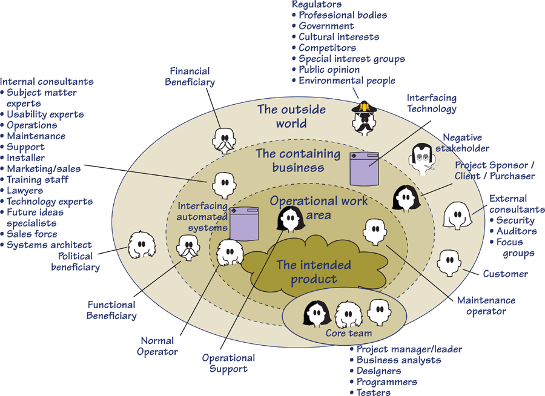
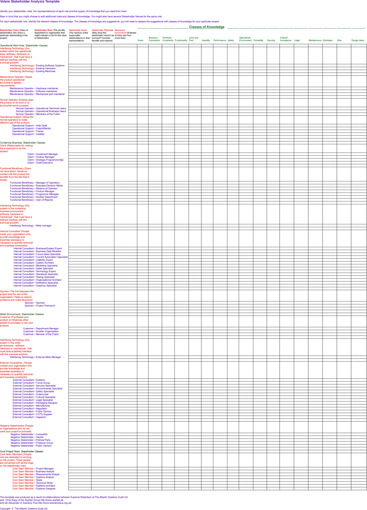

# Appendix B: Stakeholder Management Templates

[B-P001] This appendix contains templates that are designed to help you to manage your stakeholders. Its aim is threefold:

[B-P002] • To help you discover the relevant stakeholders for your project

[B-P003] • To help you identify gaps without stakeholder representation

[B-P004] • To help you agree on your decision-making structure

## B.1 Stakeholder Map

[B.1-P001] **Figure B.1** is a generic stakeholder map showing the potential classes of stakeholders. Use it as an aid for discovering your stakeholders. Refer to **Chapter 3**, Project Blastoff, for a discussion of each of the stakeholder classes.

[B.1-P002] 

[B.1-P003] Figure B.1. This generic stakeholder map shows the various classes of stakeholders. Use it as an aid in identifying your stakeholders.

## B.2 Stakeholder Template

[B.2-P001] The following template is a sample checklist you can use to identify and analyze your stakeholders. Note that the template’s stakeholder classes correspond to those on the stakeholder map shown in **Figure B.1**. For each stakeholder class, we have suggested common roles that represent the class. Of course, you will want to modify this list to include role names that are appropriate for your organization. It will probably be more convenient for you to do so using a spreadsheet. A complete version of the template in the form of an Excel spreadsheet can be found at **www.volere.co.uk**.

[B.2-P002] 
