# Appendix C: Function Point Counting: A Simplified Introduction

[C-P001] *in which we look at a way to accurately measure the size or functionality of the work area, with a view toward using the measurement to estimate the requirements effort*

## C.1 Measuring the Work

[C.1-P001] This primer on function points is an appendix because it is, strictly speaking, outside the scope of the business analyst’s normal responsibilities. That said, being able to measure the work area so as to estimate the effort needed for business analysis is definitely a benefit to any business analyst. Thus, with the idea of making you interested in measuring, or making you interested in making your organization interested in measuring, here is a simplified (but not simplistic) introduction to counting function points.

[C.1-P002] *“To measure is to know.”*

[C.1-P003] —Lord Kelvin

[C.1-P004] The requirements activity is an investigation of a piece of work, with the potential to cause a change to that work, probably by automating some of it. The work to be investigated can be automated, manual, scientific, commercial, embedded, a combination of these, or anything else. The reason for measuring that work is to learn how “large” it is. The bigger the work—that is, the more functionality and data it contains—the longer it takes to study it. You would expect to spend more time studying an airline reservation system than you would studying a system for taking bar orders. Why? The airline reservation system contains more functionality, and it takes longer to discover and record it.

[C.1-P005] Function points are a measure of the size or the amount of functionality contained within a work area. If you have drawn a context diagram, function points measure the functionality inside the central bubble.

[C.1-P006] *“You cannot control what you cannot measure.”*

[C.1-P007] —Tom DeMarco

[C.1-P008] Think of function points like this: Imagine that the work is being done by Lilliputians, the small people whom Gulliver visited on his travels. The Lilliputians work hard, very hard, so the volume of work is not important. However, they have one shortcoming—they can do only one task and are single-minded to the point that whenever you have a new task to do, you have to hire a new Lilliputian. Of course, some tasks are more complex and require more work to be done, so you hire several Lilliputians for these tasks. Sometimes the task is simple and one or two Lilliputians can handle it. By now you are imagining the workplace peopled by these tiny, hard-working people, each one doing part of a task. How many Lilliputians are there in the workplace? Well, it depends on the amount and complexity of the work being done. So that brings us to counting function points, which is just the same as counting the number of Lilliputians you need to do the work.

[C.1-P009] Function points are a neutral measure of functionality. That is, the type of work being done does not influence them. You can count the function points for air traffic control, car traffic control, or car cruise control; in so doing, you count in exactly the same way.

[C.1-P010] Once you know the function point count of a work area, you apply your metric to determine how long it takes to study that size of work area.

[C.1-P011] Over the years our industry has established that for most sizing metrics, there is a standard amount of work to be done to implement one unit of the metric. For example, if you use function points as your sizing metric, then there are industry-standard figures of the number of hours, or the number of dollars, it takes to implement one function point. Thus, if you know the size of the work area in function points, then it is a relatively straightforward matter to translate size into effort required to build the product.

[C.1-P012] For example, Capers Jones of Software Productivity Research gives us this rule of thumb:

[C.1-P013] Effort in staff months = (function points / 150) * function points0.4

[C.1-P014] So for a 1,000-function-point work area (this is a substantial, but not overly large area) the effort in person-hours is (1,000 / 150) * 1,0000.4, which is 105.66 staff-months.

[C.1-P015] Jones’s rule of thumb applies to the complete development effort, and includes the effort expended by everybody on the development side of the project. He is talking about typical software projects where roughly half the effort is spent debugging (most of which entails correcting ill-gathered requirements), so it is safe to say that if you take about one-third of Jones’s number that would cover a thorough requirements effort.

[C.1-P016] Besides, we do not advocate attempting to measure the complete implementation—there are too many variables in implementation and development environments to make that kind of count reliable. Instead, we suggest that you limit yourself to estimating the effort needed for requirements analysis.

[C.1-P017] Please take a moment to consider whether your current estimation process is accurate enough to persist with, or whether you should start to count function points.

[C.1-P018] You can, of course, measure the size of your work area any way you and your organization think is appropriate. The key word here is “measure.” If you are not already using a measuring method, then we suggest you start with function point counting. While it is by no means the ultimate measuring method, it is widely used, so a lot is known about it, and a lot of information and statistics on function points are available.

[C.1-P019] **The key word here is “measure.”**

[C.1-P020] Function points are not the only way to measure the size of a work area. You can use Mark II Function points (these are a variation of standard function points), Capers Jones’s Feature Points (also a variation), Tom DeMarco’s Bang, or any of dozens of measuring methods. However, at the requirements stage of development, function points are convenient, and given what you know of the product at this stage, probably the most appropriate.

[C.1-P021] Reading 

[C.1-P022] Jones, Capers. *Applied Software Measurement: Global Analysis of Productivity and Quality,* third edition. McGraw-Hill Osborne Media, 2008.

[C.1-P023] So if you do not already use another method, and would like to get started with function points, then please join us for this . . .

[C.1-P024] Reading 

[C.1-P025] Pfleeger, Shari Lawrence. *Software Cost Estimation and Sizing Methods, Issues, and Guidelines.* Rand Publishing, 2005.

## C.2 A Quick Primer on Counting Function Points

[C.2-P001] This is definitely not all there is to know about counting the size of a piece of work using function points. However, it is sufficient to get started, and could possibly make you better at estimating than many organizations are at the moment.

[C.2-P002] Function points are a measure of functionality, which is useful on the simple premise that the more functionality contained within the work, the more effort is needed to study it and gather its requirements. This functionality within the work is a direct result of the data it processes. The more data there is, and the more complex it is, the more functionality is needed to process it. Because data is more visible and more readily measurable, it makes sense to measure the data and extrapolate the functionality from it.

[C.2-P003] Reading 

[C.2-P004] Garmus, David, and David Herron. *Function Point Analysis: Measurement Practices for Successful Software Projects.* Addison-Wesley, 2001.

[C.2-P005] As the development proceeds, your models will become more accurate, and thus your measuring can become more accurate along with them. But we are still at the requirements stage, so it is appropriate to follow these guidelines:

[C.2-P006] • Count function points quickly. As you are at an early stage of the project, acceptable measurements at this stage are more useful than perfect measurements later.

[C.2-P007] • Count the function points for the work in its entirety, or for each of the business use cases.

### C.2.1 Scope of the Work

[C.2.1-P001] Let’s start counting function points by using what you already have. During the blastoff you built a context model of the work area. We discussed this model in **Chapter 3**, so to save you flipping back many pages, we reproduce it in **Figure C.1**.

[C.2.1-P002] 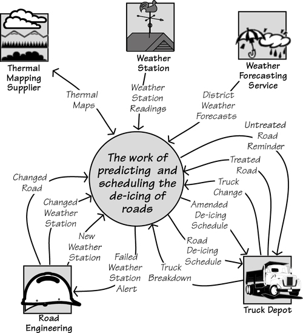

[C.2.1-P003] Figure C.1. The context model is one of the inputs to function point counting. The context model shows the flows of data entering and leaving the work area. Each of these flows triggers some functionality, or is the product of some functionality. The amount of functionality is in proportion to the amount of data carried by the flow.

[C.2.1-P004] The context diagram shows the flows of data entering and leaving the work; each flow that enters the work has to be processed. The amount of functionality needed to process it depends on the amount of data—the number of data elements—carried by the flow. Thus one of the measurements used by function point counting is the number of data elements in the flow. Determining this number is easier if you have already written a data dictionary entry for each flow. If not, it is simple enough to do without.

### C.2.2 Data Stored by the Work

[C.2.2-P001] Another determinant of the needed functionality is the data to be stored by the work. Each database, file, or any other storage medium for data requires some functionality to maintain it. Again, the amount of functionality depends on the amount of data (expressed as the number of data elements) and the complexity of the data (in other words, the number of records or tables the data is organized into). This is easy enough to discover if you have a class model of the data, such as that shown in **Figure C.2**.

[C.2.2-P002] 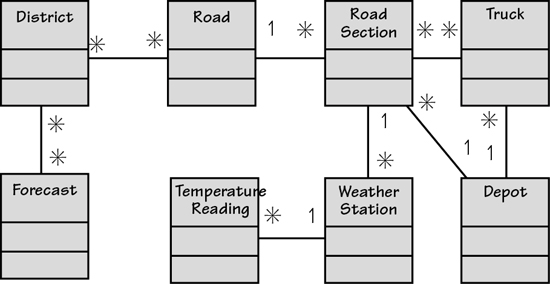

[C.2.2-P003] Figure C.2. The stored data model for the work area. There are a number of classes in the model; each one represents something about which the work stores data. Each class has a number of attributes. The function point counting procedure uses both of these numbers.

[C.2.2-P004] Each of the classes shown in the data model contains attributes—that is, the elementary items of data that together describe the class. The simple way to think of elements is that they have alphanumeric values, and classes are the subjects of the data.

[C.2.2-P005] If you look at both the context model in **Figure C.1** and the class model in **Figure C.2**, you can imagine how the work uses the incoming data to process and maintain the stored data. The two models should be seen as two views of the same piece of work.

[C.2.2-P006] ***Classes are anything that is uniquely identified by the work.***

[C.2.2-P007] If you do not have a data model, then it sufficient for our purposes here to simply list the classes—these are anything that is uniquely identified by the work. If it carries an identifier (such as a credit card, a telephone, an account, an employee, a bank transfer, or a motor car), then consider it to be a class. Considering that speed is more important than hyper-accuracy at this stage, a simple list of classes will suffice.

### C.2.3 Business Use Cases

[C.2.3-P001] Again, we can make use of what you already have to count the function points. In **Chapter 4**, we examined the idea of partitioning the work using business events. A business event is either some happening outside the work or some happening caused by the passage of time that triggers a response (we call it a business use case) from the work. Business use cases are not only a convenient way to gather requirements, but also a convenient way to count function points. Let’s assume you have partitioned the work into business use cases, and show how they are measured.

[C.2.3-P002] Unfortunately, the UML use case diagram is of no help to us here, as it does not contain any information about the inputs, outputs, or stored data. Instead, we will use a data flow model of a business use case to illustrate how function points are counted. We hasten to add there is no need for you to draw these diagrams to count function points; we are using them purely for illustrative purposes.

## C.3 Counting Function Points for Business Use Cases

[C.3-P001] We said earlier that you could count function points either for the work as a whole or for each business use case at a time. It is usually more convenient to count for each business use case, so we will illustrate that technique here.

[C.3-P002] The counting procedure varies slightly depending on the primary intention of the business use case. Think of this as what the adjacent system wants or needs when it triggers the business event. If it simply intends to supply data to be stored within the work—an example of this is when you pay your utility bill—then it is called an *input* business use case. When the primary intention of the adjacent system when it triggers the business use case is to receive some output, then we call it an *output* business use case. Time-triggered business use cases are referred to as *inquiries*; the data stored by the work is being inquired upon, so this name makes sense.

[C.3-P003] To measure the amount of functionality of a business use case—recall that you are trying to figure out how long it will take to analyze it—you count the data elements of the incoming and/or outgoing data flows, and the number of classes referenced by the business use case. We will show how this is done for each type of business use case.

### C.3.1 Counting Input Business Use Cases

[C.3.1-P001] One of the business events we mentioned in **Chapter 4** is called *Weather station transmits reading.* This is a simple enough event—we show it in **Figure C.3**—and its primary intention is to update some internally stored data. Outputs from this kind of business use case, if any, are trivial and can safely be ignored. In the model of the business use case, you see the incoming flow of data *Weather Station Reading* and the functionality it triggers inside the work. The result of the functionality is two classes of data are referenced. “Referenced” in this context can mean either the class is written to or read; it does not matter which one.

[C.3.1-P002] 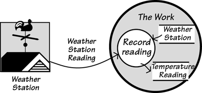

[C.3.1-P003] Figure C.3. The primary intention of this input business use case is to alter internally stored data. It references two classes. It does not matter whether they are written to or read.

[C.3.1-P004] The model of the business use case shown in **Figure C.3** provides all that is needed to count the function points.

[C.3.1-P005] First, count the data elements or attributes that make up *Weather Station Reading.* This is easier if you have a data dictionary entry for it, but failing that, estimate the number. We could say it is likely to have an identifier for the weather station, the temperature, the moisture content of the road surface, the data, the time, and possibly one or two others. That makes seven attributes. Hold on to that number.

[C.3.1-P006] The business use case references two classes of data. Even without any detailed study of the work, it is easy enough to see that there is no need for more stored data to be involved.

[C.3.1-P007] Next, you convert those two numbers to function points. To do so, we use the matrix shown in **Figure C.4**. The example business use case has 7 data attributes in the input flow, and references 2 classes. The cell at the intersection of these counts gives a result of 4 function points.

[C.3.1-P008] 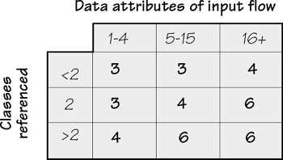

[C.3.1-P009] Figure C.4. The function point counts for an *input* business use case. The correct function point counting terminology for these is *external inputs*.

[C.3.1-P010] That’s it for this business use case. The official function point counting practices have an additional step of assigning a complexity measure and using it to adjust the function point count. However, as few people bother with it and the increment in accuracy is marginal, we shall not bother with it here.

[C.3.1-P011] The process outlined previously is repeated for each of the input business use cases. The function point count can be aggregated to give you the count for the whole of the work, or you can use the counts to compare the relative expense for analyzing each of the business use cases.

[C.3.1-P012] Of course, not all the business use cases are inputs.

### C.3.2 Counting Output Business Use Cases

[C.3.2-P001] An *output* business use case is one where the primary intention of the business use case is to achieve the output flow. That is, when the adjacent system triggers the business event, it wants the work to produce something. The oncoming data flow is a request for the output, and it contains whatever information is needed for the work to determine what is wanted. The work produces the significant output flow, and in so doing, makes some calculations, or it updates stored data, or both.

[C.3.2-P002] When measuring an output business use case, you count the *data elements* in the output flow: These are the individual data items. You can also call them “attributes” of the flow. It would be helpful to have a data dictionary at this stage, but simply looking at the flow leads you to take an educated guess at what it contains. For example, the *Amended De-icing Schedule* in **Figure C.5** would be expected to contain data elements such as the following:

[C.3.2-P003] Road

[C.3.2-P004] Road section

[C.3.2-P005] Truck identifier

[C.3.2-P006] Starting time

[C.3.2-P007] Latest possible time

[C.3.2-P008] Distance to treat

[C.3.2-P009] 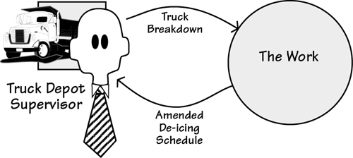

[C.3.2-P010] Figure C.5. This is an *output* business use case. The primary goal of the adjacent system when triggering this business use case is to obtain the output information.

[C.3.2-P011] And maybe one or two others. Let’s say eight. It might seem a little cavalier to be taking guesses like this, but when you look at the matrix in **Figure C.6**, you see the data elements arranged in ranges of 1 to 5, 6 to 19, and 20 and greater. Your real need here is to determine, as best you can, which range the data element count for the output flow falls into.

[C.3.2-P012] 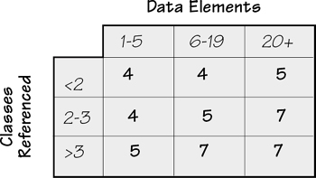

[C.3.2-P013] Figure C.6. The function points for *output* business use cases.

[C.3.2-P014] The next step in the count is to look at the data referenced by the business use case. In **Figure C.3**, we were kind enough to show the classes referenced by the business use case; we won’t be so kind this time. Go back to the class model in **Figure C.2**, and imagine the processing for this business use case. You are rescheduling a truck to cover for a broken-down truck, so all that is needed is to find the roads and road sections allocated to the broken truck, find another truck attached to the same depot, and reallocate the roads and sections.

[C.3.2-P015] That’s four classes: *Road*, *Road Section*, *Truck*, and *Depot*. Now refer to the matrix in **Figure C.6**. The number of elements in the output flow is 8, and the number of classes referenced is 4. The matrix shows 7 function points. These function points are added to your accumulated total, and you continue with the rest of the business use cases.

### C.3.3 Counting Time-Triggered Business Use Cases

[C.3.3-P001] Time-triggered business use cases are almost always reports. They are produced when a predetermined time is reached—we report sales on the last day of the month; we send out invoices five days after the purchase—or because someone wants to see a report or get some information from the work. The function point counting people know this kind of business use case as an *inquiry*. This is not a bad name, as such use cases start by inquiring on the stored data.

[C.3.3-P002] The underlying assumption with this kind of business use case is that there are no significant calculations. If the processing is more than just the simple retrieval of stored data, then it must be classified as an *output* business use case. That is, the stored data is updated and/or nontrivial calculations are involved. Your count must reflect this action by allowing for its greater complexity.

[C.3.3-P003] The example shown in **Figure C.7** is triggered by time. That is, every two hours it is time for the work to generate a schedule of the roads to be treated, and send it to the Depot.

[C.3.3-P004] 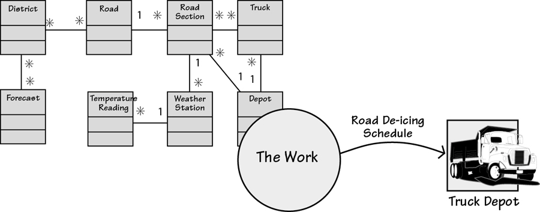

[C.3.3-P005] Figure C.7. An example of a time-triggered business use case. This kind of business use case, in which there is no input from an adjacent system, is also called an *inquiry*. It gets this name because the stored data is simply retrieved and not modified, and there are no calculations. This business use case references all the stored data classes.

[C.3.3-P006] If the business use case shown in **Figure C.7** were to be an on-demand report, then it would be possible for someone at the *Truck Depot* to enter parameters to get the schedule he wanted. Unless nontrivial processing goes on as a result or data stores are modified, this is still considered a time-triggered, inquiry type of business use case. For on-demand reports, count the data elements in both the input parameter flow and the resultant output flow. However, if a data element appears in both the input and output flows, count it only once.

[C.3.3-P007] To count the function points for the time-triggered business use case shown in **Figure C.7**, use the inquiry matrix shown in **Figure C.8**. This business use case has to reference all eight of the classes to make its predictions about ice formation. The amended schedule we saw a little while back had eight data elements; this output would have the same number.

[C.3.3-P008] 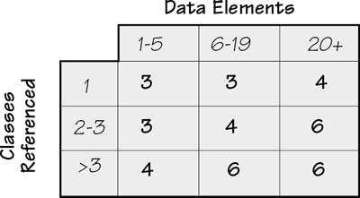

[C.3.3-P009] Figure C.8. The function points for *inquiries* or time-triggered business use cases.

[C.3.3-P010] Note that these are *unduplicated* elements. You are counting unique data elements, which you might also call *data element types*.

[C.3.3-P011] Turning to the matrix shown in **Figure C.8**, the combination of 8 data elements and more than 3 classes referenced yields 6 function points. Add the 6 function points to your total and continue counting the other business use cases.

## C.4 Counting the Stored Data

[C.4-P001] The data stored within the work area has to be maintained. This task naturally requires an amount of functionality, which can also be counted by measuring the amount and complexity of the data. For this part of the count, you take pretty much the same steps as before, except that now you count only the stored data—business use cases do not figure in this count at all.

### C.4.1 Internal Stored Data

[C.4.1-P001] The first of the stored data to be counted is the data held inside the work area. Function point counting manuals refer to such data as *internal logical files.* These items include the databases, flat files, paper files, or whatever else is part of your work area. Keep in mind that any files that are there for implementation reasons are not counted—for example, backups and manual files that are identical (or close) to automated files.

[C.4.1-P002] You count from the class model of the data. This time, for each entity, count its *attributes*. Skip any attributes that are there for purely technological reasons, but count foreign keys (pointers from one class to another). The count should be accurate enough to assign the class to one of the three columns shown in **Figure C.10**.

[C.4.1-P003] The next count is *record elements*. These are either the class itself or subtypes of classes. That is, if the class has no subtypes, it is one unit of data and counts as one record element. If there are subtypes, then you must count those as record elements. We do not have any subtypes in the IceBreaker class model, so let us invent some. Suppose that weather stations come in various types. One special type does not have a surface moisture sensor, so predictions made with the data from this kind of weather station are done differently. Moreover, the work needs to keep special data relating to this kind of weather station. The stations also fail from time to time. When they do, the work needs to store special data relating to past predictions from this station.

[C.4.1-P004] The result of these changes is that we have created two subtypes of the weather station class (you can also call these subclasses). The resulting model is shown in **Figure C.9**.

[C.4.1-P005] 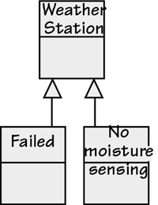

[C.4.1-P006] Figure C.9. The *Weather Station* entity has two subtypes. The *Failed* subtype contains attributes about past predictions that are used in lieu of current readings. The *No moisture sensing* subtype has attributes describing adjustments to be made to compensate for the weather station not being equipped with a moisture sensor. These subtypes are necessary, as their attributes do not apply to all stations.

[C.4.1-P007] In function point terms, the *Weather Station* entity counts for 2 record elements. You count only the subtypes, not the parent entity. For the other entities in the class model, count them as having 1 record element.

[C.4.1-P008] The next step is to count the number of attributes in each class. This task is not as arduous as it might at first seem. According to the matrix shown in **Figure C.10**, you need to know only if there are between 1 and 19 attributes to the class, or between 20 and 50, or more than 51. Given the range of these numbers, and given the desire to do this step quickly, it is permissible to make some inspired guesses about the number of attributes for the entity.

[C.4.1-P009] 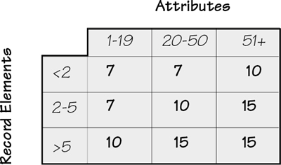

[C.4.1-P010] Figure C.10. The function point counts for *internally stored data*, or *internal logical files* as they are known in function point terminology.

[C.4.1-P011] Pick a class—say, *Truck*. How many attributes does the *Truck* class have? Or, as you could say here, does it have more than 19? Unlikely. So let us say that the *Truck* class has 19 or fewer attributes, and no subclasses so it counts as 1 record element. That means it needs 7 function points worth of functionality to support it.

[C.4.1-P012] Do the same thing for the remainder of the stored data. Most items will also have a count of 7, as none of them should have more than 19 attributes, and only *Weather Station* has two subtypes, and even has few enough attributes to count for 7 function points. There are 8 entities in the stored data model, so the *internal* stored data attracts 56 function points.

### C.4.2 Externally Stored Data

[C.4.2-P001] Most pieces of work you study make use of data stored and maintained outside of the work. For example, almost every project has to reference stored data that is owned by some other part of the organization or, in some cases, by another organization.

[C.4.2-P002] References to external stored data show up on the context diagram as interactions with *cooperative adjacent systems*—that is, adjacent systems that receive requests for data and immediately send back a response. The IceBreaker work makes use of thermal maps that are maintained by an outside body. When the scheduling business use case needs this data, it makes a request for the map of the appropriate district, and the thermal map supplier responds with the requested information. This situation is illustrated in **Figure C.11**.

[C.4.2-P003] 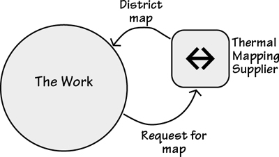

[C.4.2-P004] Figure C.11. The *Thermal Mapping Supplier* is an external system that maintains a database of the temperature differentials within areas. This data is too volatile for the IceBreaker work to maintain, so it elects to query this cooperative adjacent system whenever it needs the data.

[C.4.2-P005] Although external data does not have to be maintained by the work, the need for the data adds functionality to the work; as a consequence, external data is also counted. You can make such a count in the same way as you did for the internal data; however, instead of building a data model, let’s use educated guesses to size the data.

[C.4.2-P006] The external stored data deals with the temperatures of roads. Specifically, it consists of the road surface temperature for every meter of every road. However, even though the data is repetitive, you count a just single iteration.

[C.4.2-P007] No, don’t even count. Look at the matrix in **Figure C.12** and note that once again you just need to guess whether the number of attributes is 19 or fewer, 20 to 50, or more than 50. The thermal mapping database would fall into the first column. Further educated guesswork would suggest there are fewer than 2 record elements—the number could have been as large as 5, as it would make no difference to the count—so this external data adds 5 function points to the functionality of the work.

[C.4.2-P008] 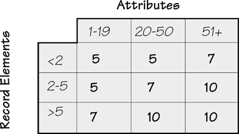

[C.4.2-P009] Figure C.12. The function point counts for *external interface files*, or data stored held by a cooperative adjacent system.

[C.4.2-P010] Repeat this process for each of the classes in the externally stored data. In the case of IceBreaker, it appears there is only one class in the database. This situation is a little unusual, as you will normally find more than that in your databases.

[C.4.2-P011] A small aside: **Figure C.11** shows the use of externally stored data. The flows to and from the adjacent system are *not* counted for function point purposes. They are omitted because the adjacent system is a cooperative system; that is, it provides some service in collaboration with the work area. Thus the flows would be parameters to query the database, and the resultant data comes from that database. For both flows, their attributes would be the same as the attributes of the stored data. For function point counting purposes, think only about the use of the adjacent system’s database—in this case, it is providing data as if it were inside the work area.

## C.5 Adjust for What You Don’t Know

[C.5-P001] You are counting function points during the requirements activity. You may not have all the data you need to create a completely accurate function point count. Earlier, we explained how you count the function points using the inputs, outputs, inquiries, internal files, and external files. Even if you do not have all five of these parameters, you can still count function points. The count is simply adjusted according to how many of these parameters you have available to count.

[C.5-P002] **Figure C.13** provides the *range of uncertainty* depending on the number of parameters used in your count. For example, if you used only 3 parameters—say, the inputs, outputs, and inquiries (the easiest options to find, as they are the data flows that show up on the context model)—then your function point count is accurate within a range of ±15 percent.

[C.5-P003] 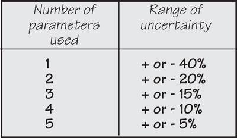

[C.5-P004] Figure C.13. This table, courtesy of Capers Jones, shows the uncertainty ranges based on the number of parameters you use in your function point counting. This information comes from the study of many software projects.

## C.6 Now That I Have Counted Function Points, What’s Next?

[C.6-P001] The function point count for the requirements activity for the project is simply the aggregation of the counts for all the business use cases and the stored data. Now you must convert that count into some indication of effort needed for the requirements activity. In the early part of this appendix, we showed a rule of thumb used by Capers Jones. So many people use this rule that we believe it is worth trying on your project. Of course, data that comes from your own organization is preferable, but obtaining it requires you to count the function points for previous projects to come up with your own metric of hours (or money) needed per function point.

[C.6-P002] You can also get help. Following are some resources that have useful information. As we said at the beginning of this appendix, our aim is to give you a gentle introduction to counting function points, and to make you interested enough to want to carry the subject further.

[C.6-P003] A lot of material is available on the Web, much of it free. These organizations are good places to start for more information on function points, as well as productivity metrics:

[C.6-P004] • International Software Benchmarking Group: **www.isbsg.org**

[C.6-P005] • International Function Point Users Group: **www.ifpug.org**

[C.6-P006] • Quality Plus Technologies: **www.qualityplustech.com**

[C.6-P007] • Software Productivity Research: **www.spr.com**

[C.6-P008] • United Kingdom Software Metrics Association: **www.uksma.co.uk/**

[C.6-P009] Additionally, we recommend the following resources:

[C.6-P010] Bundschuh, Manfred, and Carol Dekkers. *The IT Measurement Compendium: Estimating and Benchmarking Success with Functional Size Measurement*. Springer, 2010.

[C.6-P011] Dekkers, Carol. *Demystifying Function Points: Clarifying Common Terminology*. **http://www.qualityplustech.com**. This source is used internally at IBM as one of its definition standards.

[C.6-P012] Dekkers, Carol. *Function Point Counting and CFPS Study Guides Volumes 1, 2, and 3*. Quality Plus, 2002. **http://www.qualityplustech.com**. In addition to case studies, all of these study guides provide logistics/hints for the IFPUG Certified Function Point Specialist (CFPS) Exam.

[C.6-P013] Fenton, Norman, and Shari Lawrence Pfleeger. *Software Metrics: A Rigorous and Practical Approach,* second edition. Thomson Computer Press, 1996. This book looks at several ways of measuring the software development process. The case studies alone—on Hewlett-Packard, IBM, and the U.S. Department of Defense—are worth the price of the book.

[C.6-P014] Garmus, David, and David Herron. *Function Point Analysis: Measurement Practices for Successful Software Projects*. Addison-Wesley, 2001. This book provides a thorough treatment of function point counting using the IFPUG rules.

[C.6-P015] Pfleeger, Shari Lawrence. *Software Cost Estimation and Sizing Methods, Issues, and Guidelines*. Rand Publishing, 2005. This book covers function points and several other measuring methods. Recommended for its breadth of coverage.

[C.6-P016] Putman, Lawrence, and Ware Myers. *Five Core Metrics: The Intelligence Behind Successful Software Management*. Dorset House, 2003. Not function points but some other and very good ways and things to measure. The authors demonstrate how the five core metrics—time, effort, size, reliability, and process productivity—are used to control and adjust projects.

[C.6-P017] That’s not really all there is to function point counting, but it is enough for the quick counts needed at requirements time.
