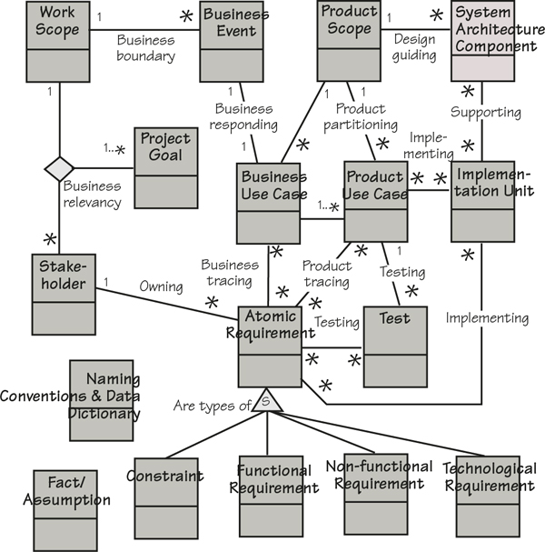
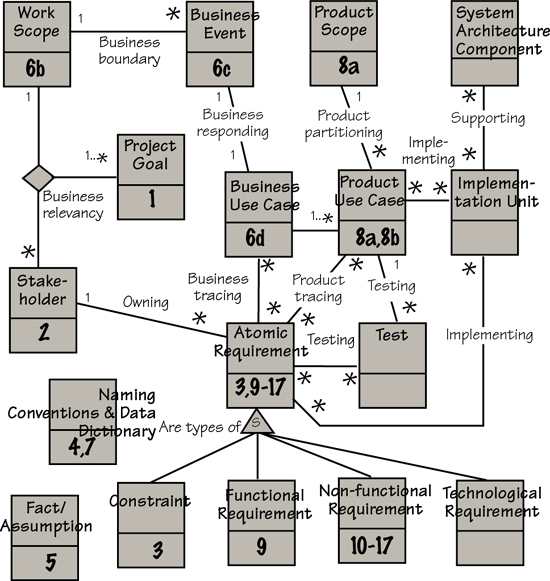

# Appendix D: Volere Requirements Knowledge Model

[D-P001] The Volere Requirements Knowledge Model (**Figure D.1**) provides a language for the knowledge that you discover and accumulate during your requirements activities. We present it as a guide to the information you need to discover, and as a tool for communication between the various stakeholders on your project. The model can also serve as your specification for which requirements knowledge you plan to discover and trace. Your own process must define who gathers which information, to what degree of detail, and how it will be packaged and reviewed.

[D-P002] 

[D-P003] Figure D.1. The knowledge model identifies the classes of knowledge concerned with requirements and the associations between them.

[D-P004] If you are not familiar with this notation:

[D-P005] • A rectangle represents a *class* of knowledge. The name of the class is written in the rectangle.

[D-P006] • A line represents an *association* between two or more classes.

[D-P007] • *Multiplicity* is shown by 1 and \*. This means if you have only one of a class, there are \* (many) of the class at the other end of the association.

## D.1 Definitions of Requirements Knowledge Classes and Associations

[D.1-P001] The purpose of the knowledge model is to provide you with a common of language for communicating and managing requirements. Use the model as a starting point and then, if you need to, add other classes and associations to reflect the way that you need to manage your requirements knowledge.

[D.1-P002] It is, of course, necessary for everyone using the knowledge model to have the same understanding of what the names of the classes mean. This means you need a dictionary to support the model. The following is a definition of the classes of knowledge and their associations; the classes are listed before the associations.

### D.1.1 Knowledge Classes

#### D.1.1.1 Knowledge class: Atomic Requirement

##### D.1.1.1.1 Purpose

[D.1.1.1.1-P001] A Requirement specifies a business need; it has a number of attributes.

##### D.1.1.1.2 Attributes

[D.1.1.1.2-P001] Requirement Number

[D.1.1.1.2-P002] Requirement Description

[D.1.1.1.2-P003] Requirement Rationale

[D.1.1.1.2-P004] Requirement Type

[D.1.1.1.2-P005] Requirement Fit Criterion

[D.1.1.1.2-P006] Requirement Source

[D.1.1.1.2-P007] Customer Satisfaction

[D.1.1.1.2-P008] Customer Dissatisfaction

[D.1.1.1.2-P009] Conflicting Requirements

[D.1.1.1.2-P010] Dependent Requirements

[D.1.1.1.2-P011] Supporting Material

[D.1.1.1.2-P012] Version Number

##### D.1.1.1.3 Considerations

[D.1.1.1.3-P001] Also see the subtypes of requirements—namely, Constraint, Functional Requirement, Non-functional Requirement, Technological Requirement.

##### D.1.1.1.4 Suggested Implementation

[D.1.1.1.4-P001] **Sections 9** though **17** of the Volere Requirements Specification Template. There are various automated tools available; these allow team access to the requirements.

#### D.1.1.2 Knowledge class: Business Event

##### D.1.1.2.1 Purpose

[D.1.1.2.1-P001] A Business Event is some happening outside the work scope that is, in effect, a demand for some service provided by the work. Examples: a motorist passes an electronic tollbooth, a customer orders a book, a doctor asks for the scan of a patient, a pilot lowers the landing gear.

[D.1.1.2.1-P002] Business events can also happen because of the passage of time. Examples: if a customer’s bill is not paid in 30 days, then it is time for the work to send a reminder; it is two months before an insurance policy is due to expire.

##### D.1.1.2.2 Attributes

[D.1.1.2.2-P001] Business Event Name

[D.1.1.2.2-P002] Business Event Adjacent Systems/Actors

[D.1.1.2.2-P003] Business Event Summary

##### D.1.1.2.3 Considerations

[D.1.1.2.3-P001] It is important to recognize the business event. Its nature, the circumstances that exist at the time the event happens, and the activity of the adjacent system at the time of the business event are all important indicators of the appropriate response.

##### D.1.1.2.4 Suggested Implementation

[D.1.1.2.4-P001] **Section 6** of the Volere Requirements Specification Template. A list of the business events and their associated input and output flows will suffice. It is practical to give each business event a unique identifier.

#### D.1.1.3 Knowledge class: Business Use Case

##### D.1.1.3.1 Purpose

[D.1.1.3.1-P001] A Business Use Case (BUC) is the processing done in response to a business event. Example: a policyholder decides to make a claim is a business event. The business use case is all the processing done by the work to approve or deny the claim. Also see Product Use Case.

##### D.1.1.3.2 Attributes

[D.1.1.3.2-P001] Business Use Case Name

[D.1.1.3.2-P002] Business Use Case Description

[D.1.1.3.2-P003] Business Use Case Input

[D.1.1.3.2-P004] Business Use Case Outputs

[D.1.1.3.2-P005] Business Use Case Rationale

[D.1.1.3.2-P006] Business Use Case Priority

[D.1.1.3.2-P007] Normal Case Scenario

[D.1.1.3.2-P008] Exception Case Scenarios

[D.1.1.3.2-P009] Preconditions

[D.1.1.3.2-P010] Post or exit conditions

##### D.1.1.3.3 Considerations

[D.1.1.3.3-P001] Business use cases are self-contained portions of the work, and can be studied independently. For this reason they are an important unit that project leaders can use to structure the analytical work.

##### D.1.1.3.4 Suggested Implementation

[D.1.1.3.4-P001] **Section 6** of the Volere Requirements Specification Template. BUCs can be represented using any combination of business process models, sequence diagrams, activity diagrams, scenarios, or any other representation that is acceptable to the people involved—providing the BUC is within the boundaries declared for the Business Event.

#### D.1.1.4 Knowledge class: Constraint

##### D.1.1.4.1 Purpose

[D.1.1.4.1-P001] A Constraint is a type of requirement. It is a limit placed on the design of the product, or on the project itself, such as budget or time restrictions.

##### D.1.1.4.2 Considerations

[D.1.1.4.2-P001] We treat constraints as a type of requirement that must be met. However, we highlight them, as it is important that you and your management are aware of them.

##### D.1.1.4.3 Suggested Implementation

[D.1.1.4.3-P001] **Section 3** of the Volere Requirements Specification Template. Design constraints should be recorded in the same way as the other requirements. See the Knowledge class **Requirement** for the attributes.

#### D.1.1.5 Knowledge class: Fact/Assumption

##### D.1.1.5.1 Purpose

[D.1.1.5.1-P001] An Assumption states an expectation on which decisions about the project are based. For example, it might be an assumption that another project will be finished first, or that a particular law will not be changed, or that a particular supplier will reach a specified level of performance. If an assumption turns out not to be true, there might be far-reaching and unknown effects on the project.

[D.1.1.5.1-P002] A Fact is some knowledge that is relevant to the project and affects its requirements and design. A Fact can also state some specific exclusion from the product and the reason for that exclusion.

[D.1.1.5.1-P003] Fact/Assumption is a global class and could have an Association with any of the other classes in your knowledge model.

##### D.1.1.5.2 Attributes

[D.1.1.5.2-P001] Description of the Assumption/Fact

[D.1.1.5.2-P002] Reference to people and documents for more details

##### D.1.1.5.3 Considerations

[D.1.1.5.3-P001] Assumptions indicate a risk. For this reason they should be highlighted and all affected parties made aware of the assumption. You could consider installing a mechanism to resolve all assumptions before implementation starts.

##### D.1.1.5.4 Suggested Implementation

[D.1.1.5.4-P001] **Section 5** of the Volere Requirements Specification Template; these can be written in free text. They should be regularly circulated to management and the project team.

#### D.1.1.6 Knowledge class: Functional Requirement

##### D.1.1.6.1 Purpose

[D.1.1.6.1-P001] A Functional Requirement is something that the product must do. Examples: calculate the fare, analyze the chemical composition, record the change of name, find the new route. Functional requirements are concerned with creating, updating, referencing, and deleting the essential subject matter within the context of the study.

##### D.1.1.6.2 Attributes

[D.1.1.6.2-P001] This is a subtype of **Atomic Requirement** and inherits its attributes.

##### D.1.1.6.3 Suggested Implementation

[D.1.1.6.3-P001] **Section 9** of the Volere Requirements Specification Template. See the Knowledge class **Atomic Requirement** for the attributes.

#### D.1.1.7 Knowledge class: Implementation Unit

##### D.1.1.7.1 Purpose

[D.1.1.7.1-P001] The unit for packaging your implementation.

##### D.1.1.7.2 Attributes

[D.1.1.7.2-P001] Implementation Unit Name

##### D.1.1.7.3 Considerations

[D.1.1.7.3-P001] This could be what your customers refer to as a “feature”; if your product is a consumer item, then it might be called a “function.” The choice of implementation unit is driven by a combination of your implementation technology and your implementation process. When you tailor this part of the knowledge model, you might find that you replace your implementation unit with several classes. The important issue is that you can unambiguously trace your implementation unit back to the relevant requirements.

#### D.1.1.8 Knowledge class: Naming Conventions & Data Dictionary

##### D.1.1.8.1 Purpose

[D.1.1.8.1-P001] A dictionary that defines the meaning of terms used within the requirements. This dictionary will be expanded throughout the project to include terms that are related to the implementation. This global class could have an association with any of the other classes in your knowledge model. Consistent use of the same terminology—as defined in the dictionary—helps to minimize misunderstandings.

##### D.1.1.8.2 Attributes

[D.1.1.8.2-P001] Name of the Term

[D.1.1.8.2-P002] Definition of the Term

##### D.1.1.8.3 Suggested Implementation

[D.1.1.8.3-P001] **Section 4** of the Volere Requirements Specification Template; this should be in the form of a **glossary**. Along with the work context and the product context, it provides a good introduction for new team members.

[D.1.1.8.3-P002] **Section 7** of the Volere Requirements Specification Template; there is a formal **dictionary** that defines all of the data in the inputs, outputs, and attributes within the scope of the work and the scope of the product. The dictionary provides a mechanism for connecting business terminology and implementation terminology.

#### D.1.1.9 Knowledge class: Non-functional Requirement

##### D.1.1.9.1 Purpose

[D.1.1.9.1-P001] A Non-functional Requirement is a quality that the product must have. Examples: fast, attractive, secure, customizable, maintainable, portable. Non-functional requirements types are Look and Feel, Usability, Performance and Safety, Operational Environment, Maintainability and Portability, Security, Cultural and Political, and Legal.

##### D.1.1.9.2 Attributes

[D.1.1.9.2-P001] This is a subtype of **Atomic Requirement** and inherits its attributes.

##### D.1.1.9.3 Considerations

[D.1.1.9.3-P001] The non-functional properties are important if the user or buyer is to accept the product.

##### D.1.1.9.4 Suggested Implementation

[D.1.1.9.4-P001] **Sections 10** though **17** of the Volere Requirements Specification Template. It is vital that you give all non-functional requirements the correct fit criteria.

#### D.1.1.10 Knowledge class: Product Scope

##### D.1.1.10.1 Purpose

[D.1.1.10.1-P001] The product scope identifies the boundaries of the product that will be built. The scope is a summary of the boundaries of all the product use cases.

##### D.1.1.10.2 Attributes

[D.1.1.10.2-P001] User Names

[D.1.1.10.2-P002] User Roles

[D.1.1.10.2-P003] Other Adjacent Systems

[D.1.1.10.2-P004] Interface descriptions

##### D.1.1.10.3 Suggested Implementation

[D.1.1.10.3-P001] **Section 8** of the Volere Requirements Specification Template. This should preferably be a diagram, either a use case diagram or a product scope model supported by a product use case summary table. Some interface descriptions might be supported by prototypes or simulations.

#### D.1.1.11 Knowledge class: Product Use Case

##### D.1.1.11.1 Purpose

[D.1.1.11.1-P001] A Product Use Case (PUC) is a functional grouping of requirements that will be implemented by the product. It is that part of the business use case that you decide to build as a product.

##### D.1.1.11.2 Attributes

[D.1.1.11.2-P001] Product Use Case Name

[D.1.1.11.2-P002] Product Use Case Identifier

[D.1.1.11.2-P003] Product Use Case Description

[D.1.1.11.2-P004] Product Use Case Users

[D.1.1.11.2-P005] Product Use Case Inputs

[D.1.1.11.2-P006] Product Use Case Outputs

[D.1.1.11.2-P007] Product Use Case Stories

[D.1.1.11.2-P008] Product Use Case Scenarios

[D.1.1.11.2-P009] Product Use Case Fit Criterion

[D.1.1.11.2-P010] Product Use Case Owner

[D.1.1.11.2-P011] Product Use Case Benefit

[D.1.1.11.2-P012] Product Use Case Priority

##### D.1.1.11.3 Suggested Implementation

[D.1.1.11.3-P001] **Section 8** of the Volere Requirements Specification Template. The product use cases are a good mechanism for communication within the extended project team. They might take the form of models, user stories, scenarios, or anything else that suits the people involved. Whatever the type of representation, the details of the PUC should be within the boundaries declared by the PUC inputs and outputs.

#### D.1.1.12 Knowledge class: Project Goal

##### D.1.1.12.1 Purpose

[D.1.1.12.1-P001] To understand why the company is making an investment in doing this project. There might be several project goals.

##### D.1.1.12.2 Attributes

[D.1.1.12.2-P001] Project Goal Description

[D.1.1.12.2-P002] Business Advantage

[D.1.1.12.2-P003] Measure of Success

##### D.1.1.12.3 Suggested Implementation

[D.1.1.12.3-P001] **Section 1** of the Volere Requirements Specification Template. This is the basis for making decisions about scope, relevance, and priority; it is the guiding light for the project. Ideally, this goal should be defined as part of the project initiation. All project goals should be unambiguously defined and agreed to by stakeholders before putting effort into discovering detailed requirements.

#### D.1.1.13 Knowledge class: Stakeholder

##### D.1.1.13.1 Purpose

[D.1.1.13.1-P001] Identifies all the people, roles, and organizations that have an interest in the project. This population includes the project team, direct users of the product, other indirect beneficiaries of the product, specialists with technical skills needed to build the product, external organizations with rules or laws pertaining to the product, external organizations with specialist knowledge about the product’s domain, opponents of the product, and producers of competitive products.

##### D.1.1.13.2 Attributes

[D.1.1.13.2-P001] Stakeholder Role

[D.1.1.13.2-P002] Stakeholder Name

[D.1.1.13.2-P003] Types of Knowledge

[D.1.1.13.2-P004] Necessary Participation

[D.1.1.13.2-P005] Appropriate Trawling Techniques

[D.1.1.13.2-P006] Contact information (e.g., e-mail address)

##### D.1.1.13.3 Suggested Implementation

[D.1.1.13.3-P001] **Section 2** of the Volere Requirements Specification Template. Use the stakeholder map and stakeholder analysis template to define the attributes for each stakeholder.

#### D.1.1.14 Knowledge class: System Architecture Component

##### D.1.1.14.1 Purpose

[D.1.1.14.1-P001] A piece of technology, software, hardware, or abstract container that influences, facilitates, or places constraints on the design.

#### D.1.1.15 Knowledge class: Technological Requirement

##### D.1.1.15.1 Purpose

[D.1.1.15.1-P001] A Technological Requirement exists because of the technology chosen for the implementation. These requirements are there to serve the purposes of the technology, and are not originated by the business.

##### D.1.1.15.2 Attributes

[D.1.1.15.2-P001] This is a subtype of **Atomic Requirement** and inherits its attributes.

##### D.1.1.15.3 Considerations

[D.1.1.15.3-P001] The technological requirements should be considered only when you know the technological environment. They can be recorded alongside the business requirements, but it must be clear which is which.

#### D.1.1.16 Knowledge class: Test

##### D.1.1.16.1 Purpose

[D.1.1.16.1-P001] The design for Test is the result of a tester reviewing a requirement’s fit criterion (precise measure) and designing a cost-effective test to prove whether a solution meets the fit criterion.

##### D.1.1.16.2 Considerations

[D.1.1.16.2-P001] You might consider having your testing people write the test cases as the requirements are being written. Also consider that the requirement’s fit criterion is the basis of the test case.

#### D.1.1.17 Knowledge class: Work Scope

##### D.1.1.17.1 Purpose

[D.1.1.17.1-P001] Defines the boundary of the investigation necessary to discover, invent, understand, and identify the requirements for the product.

##### D.1.1.17.2 Attributes

[D.1.1.17.2-P001] Adjacent Systems

[D.1.1.17.2-P002] Input Data Flows

[D.1.1.17.2-P003] Output Data Flows

[D.1.1.17.2-P004] Work Context Description

##### D.1.1.17.3 Considerations

[D.1.1.17.3-P001] The work scope should be recorded publicly, as our experience indicates that it is the most widely referenced document. A context model is an effective communication tool for defining the work context.

##### D.1.1.17.4 Suggested Implementation

[D.1.1.17.4-P001] **Section 7** of the Volere Requirements Specification Template. This is best illustrated with a context model.

### D.1.2 Associations

#### D.1.2.1 Association: Business boundary

##### D.1.2.1.1 Purpose

[D.1.2.1.1-P001] To partition the work context according to the functional reality of the business.

##### D.1.2.1.2 Multiplicity

[D.1.2.1.2-P001] For each Business Event, there is one Work Context.

[D.1.2.1.2-P002] For each Work Context, there are potentially many Business Events.

#### D.1.2.2 Association: Business relevancy

##### D.1.2.2.1 Purpose

[D.1.2.2.1-P001] To ensure that there are relevant business connections between the scope of the investigation, the project purpose, and the stakeholders.

##### D.1.2.2.2 Multiplicity

[D.1.2.2.2-P001] The trinary Association is as follows:

[D.1.2.2.2-P002] For each instance of one Work Context and one Stakeholder, there are one or more Project Purposes.

[D.1.2.2.2-P003] For each instance of one Project Purpose and one Stakeholder, there is one Work Context.

[D.1.2.2.2-P004] For each instance of one Project Purpose and one Work Context, there are potentially many Stakeholders.

#### D.1.2.3 Association: Business responding

##### D.1.2.3.1 Purpose

[D.1.2.3.1-P001] To reveal which business use cases are used to respond to the business event.

##### D.1.2.3.2 Multiplicity

[D.1.2.3.2-P001] For each Business Event, there is usually one, but could be more than one, Business Use Case.

[D.1.2.3.2-P002] For each Business Use Case, there can be only one triggering Business Event.

#### D.1.2.4 Association: Business tracing

##### D.1.2.4.1 Purpose

[D.1.2.4.1-P001] To keep track of which requirements are generated by which business use cases. Note that this is a many-to-many association because a given requirement might exist in more than one business use case.

##### D.1.2.4.2 Multiplicity

[D.1.2.4.2-P001] For each Business Use Case, there are potentially many Atomic Requirements.

[D.1.2.4.2-P002] For each Atomic Requirement, there are potentially many Business Use Cases.

#### D.1.2.5 Association: Implementing

##### D.1.2.5.1 Purpose

[D.1.2.5.1-P001] To keep track of which product use cases are implemented in which implementation units.

##### D.1.2.5.2 Multiplicity

[D.1.2.5.2-P001] For each Product Use Case, there are potentially many Implementation Units.

[D.1.2.5.2-P002] For each Implementation Unit, there are potentially many Product Use Cases.

#### D.1.2.6 Association: Owning

##### D.1.2.6.1 Purpose

[D.1.2.6.1-P001] To keep track of which stakeholders are the originators of which requirements. The idea of “ownership” is to identify a person who takes the responsibility for helping to get answers to questions about the requirement.

##### D.1.2.6.2 Multiplicity

[D.1.2.6.2-P001] For each Requirement, there is one Stakeholder.

[D.1.2.6.2-P002] For each Stakeholder, there are potentially many Requirements.

#### D.1.2.7 Association: Product partitioning

##### D.1.2.7.1 Purpose

[D.1.2.7.1-P001] All the product use cases together form the complete scope of the product. The product scope is partitioned into a number of product use cases.

##### D.1.2.7.2 Multiplicity

[D.1.2.7.2-P001] For each Product Use Case, there is one Product Scope.

[D.1.2.7.2-P002] For each Product Scope, there are potentially many Product Use Cases.

#### D.1.2.8 Association: Product tracing

##### D.1.2.8.1 Purpose

[D.1.2.8.1-P001] To keep track of which requirements are contained in which product use cases for the purpose of traceability and dealing with change.

##### D.1.2.8.2 Multiplicity

[D.1.2.8.2-P001] For each Requirement, there are potentially many Product Use Cases.

[D.1.2.8.2-P002] For each Product Use Case, there are potentially many Atomic Requirements.

#### D.1.2.9 Association: Supporting

##### D.1.2.9.1 Purpose

[D.1.2.9.1-P001] To keep track of which systems architecture components support which implementation units for the purpose of tracking tests and assessing impact of change.

##### D.1.2.9.2 Multiplicity

[D.1.2.9.2-P001] For each System Architecture Component, there are potentially many Implementation Units.

[D.1.2.9.2-P002] For each Implementation Unit, there are potentially many System Architecture Components.

#### D.1.2.10 Association: Testing

##### D.1.2.10.1 Purpose

[D.1.2.10.1-P001] To keep track of which atomic requirements or PUC-related groups of atomic requirements are covered by which tests.

##### D.1.2.10.2 Multiplicity

[D.1.2.10.2-P001] For each Test, there are potentially many Atomic Requirements.

## D.2 Knowledge Model Annotated with Template Section Numbers

[D.2-P001] The Volere Requirements Knowledge Model is a formal structure for identifying and relating classes of requirements knowledge. In the view of it presented in **Figure D.2**, the numbers on the classes provide cross-references to the relevant sections of the Volere Requirements Specification Template.

[D.2-P002] 

[D.2-P003] Figure D.2. The Volere Requirements Knowledge Model with cross-references to the relevant sections of the Volere Requirements Specification Template
