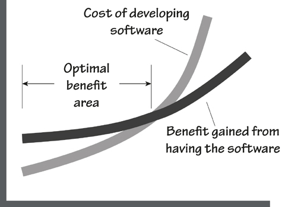
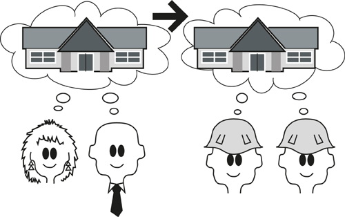
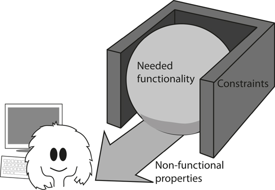

# 1. Some Fundamental Truths

*in which we consider the essential contribution of requirements*

## 1.1 Truth 1

***Requirements are not really about requirements.***

Requirements are what the software product, or hardware product, or service, or whatever you intend to build, is meant to do and to be. Requirements exist whether you discover them or not, and whether you write them down or not. Obviously, your product will never be right unless it conforms to the requirements, so in this way you can think of the requirements as some kind of natural law, and it is up to you to discover them.

That said, the requirements activity is not principally about writing a requirements document. Instead, it focuses on understanding a business problem and providing a solution for it. Software is there to solve some kind of problem, as are hardware and services. The real art of requirements discovery is discovering the real problem. Once you do that, you have the basis for identifying and choosing between alternative solutions. In essence, then, requirements are not about the written requirements as such, but rather an uncovering of the problem to be solved.

Incidentally, when we say “business,” “business problem,” or “work” we mean whatever activity you are concerned with—be it commercial, scientific, embedded, government, military, or, indeed, any other kind of activity or service or consumer product.

***Throughout this book we have used “he” to refer to both genders. The authors (one male and one female) find the use of “he or she” disruptive and awkward.***

Also incidentally, when we say “he” in this book—usually referring to the business analyst—we mean “he or she.” We find it too clumsy to keep saying “he or she” or “he/she.” Believe us, requirements work belongs equally to both genders.

## 1.2 Truth 2

***If we must build software, then it must be optimally valuable for its owner.***

Note that we are concerned with the owner of the end result, and only indirectly the user. This focus seems to run contrary to the usual priorities, so we had best explain it.

The owner is the person or organization that pays for the software (or hardware or any other product you might be building). Either the owner pays for the development of the software or he buys the software from someone else. The owner also pays for the disruption to his business that happens when the software is deployed. On the other side of the ledger, the owner gets a benefit from the software. To describe that relationship very simply, the owner is buying a benefit.

We could say that another way—the owner will not pay unless the product provides a benefit. This benefit usually comes in the shape of providing some capability that was not previously available, or changing some business process to be faster or cheaper or more convenient. Naturally this benefit must provide a value to the owner that exceeds the cost of developing the product (see **Figure 1.1**).

Figure 1.1. As the software becomes more capable and the cost of construction increases, so does the benefit that the software brings. At some point, however, the cost of construction starts to outstrip the benefit and the project is no longer beneficial.

To be *optimally valuable,* the product must provide a benefit that is in proportion to the cost of the product. In some cases, the product can have a very high cost if the value to the owner is great enough. For instance, airlines are willing to pay significant sums for simulators that ensure their pilots are suitably qualified and skilled; lives will be lost if they aren’t. An airline might also pay a lot for an automated check-in system when it will make significant inroads into the cost of getting passengers onto planes. The same airline would pay far less for a canteen staff roster system because, let’s face it—that kind of task can be done manually and having a few wrong people in the canteen is annoying but hardly life-threatening.

The role of the requirements discoverer—call him a “business analyst,” “requirements engineer,” “product owner,” “systems analyst,” or any other title—is to determine what the owner values. In some cases, providing a small system that solves a small problem provides sufficient benefit for the owner to consider it valuable. In other cases (perhaps many others), extending the system’s capabilities will provide a much greater value, and this can be achieved for a small additional cost. It all depends on what the owner values.

This, then, is optimal value—understanding the owner’s problem well enough to deliver a solution that provides the best payback at the best price.

## 1.3 Truth 3

***If your software does not have to satisfy a need, then you can build anything. However, if it is meant to satisfy a need, then you have to know what that need is to build the right software.***

It is worthwhile considering that the most useful products are those for which the developers correctly understood what the product was intended to accomplish for its users, and in what manner it was to accomplish that purpose. To understand these things, you must understand the work of the owner’s business and determine how that work should be carried out in the future.

Once these points are understood and agreed to, then the business analysts negotiate with the owner about which product will best improve the work. The business analysts produce requirements that describe the functionality of the product—what it will do; and the quality attributes of the product—how well it will do it.

Without knowing these requirements, there is little chance that any product emerging from the development project will be of much value. Apart from a few fortuitous accidents, no product has ever succeeded without prior understanding of its requirements.

It does not matter which kind of work the owner wishes to do, be it scientific, commercial, e-commerce, or social networking. Nor does it matter which programming language or development tools are used to construct the product. The development life cycle—whether agile, prototyping, spiral, the Rational Unified Process, or any other method—is irrelevant to the need for understanding the requirements.

This truth always emerges: You must come to the correct understanding of the requirements, and have your client agree with them, or your product or your project will be seriously deficient.

*“On two occasions I have been asked, ‘Pray, Mr. Babbage, if you put into the machine wrong figures, will the right answers come out?’ I am not able rightly to apprehend the kind of confusion of ideas that could provoke such a question.”*

—Charles Babbage

Sadly, the requirements are not always correctly understood. Authors Steve McConnell and Jerry Weinberg provide statistics showing that as many as 60 percent of errors originate from within the requirements activity. Software developers have the opportunity to (almost) eliminate these errors. Yet many choose—or their managers choose—to (almost) eliminate the requirements discovery and rush headlong into constructing the (inevitably) wrong product. As a result, they pay many times the price for their product than they would have if the requirements discovery had been done correctly in the first place. Poor quality is passed on in the development life cycle; it is as simple as that.

## 1.4 Truth 4

***There is an important difference between building a piece of software and solving a business problem. The former does not necessarily accomplish the latter.***

Many software development projects concentrate solely on the software. This might seem reasonable—after all, most software projects manage to produce some software. However, concentrating almost exclusively on the software is a little like trying to build the Parthenon by concentrating on stones. The software, if it is to be valuable to the owner, must solve the owner’s business problem.

We build an awful lot of software. Tens (if not hundreds) of millions of lines of code are produced each year. Much of this output contains errors, and most of those are errors of requirements. As a consequence, an awful lot of the world’s software simply does not solve the correct problem.

Some development processes are based on the idea of delivering some functionality to its intended users, and inviting them to say whether it solves their problem. If it does not, the software is reworked, and then once again presented for approval. The problem here is that we never know whether the users approve the last delivery because they are satisfied with it or because they are exhausted by the process.

More importantly, it is very difficult for an individual user to understand the broader ramifications of deploying a piece of software. Typically software users do not know enough about the wider business to decide whether this incarnation of software will cause problems in some other part of the business.

And at the risk of repeating ourselves, we cannot stress enough that software is there to solve a business problem. Clearly, then, any development effort must start with the problem, and not with a perceived solution.

## 1.5 Truth 5

***The requirements do not have to be written, but they have to become known to the builders.***

It often seems that the aim of a requirements project is to produce as large a specification as possible. It doesn’t seem to matter that very few readers can understand much of it, and that even fewer have the patience to read it. It appears that the requirements writers believe that their work will be appreciated in direct proportion to the thickness of the specification.

Once produced, this considerable document is then thrown over the wall—or, should we say, forklifted over the wall—to the developers, who are expected to rejoice at the sheer volume of the specification. After all, the more pages it contains, the more chance it has not missed anything—or so the theory goes. Naturally enough, the developers are almost always underwhelmed by this document and either ignore it or willfully comply with it. Either way, the end result is usually unsatisfactory.

Despite this bizarre behavior, there remains a need for requirements, and for those requirements to be communicated to the development team (see **Figure 1.2**).

Figure 1.2. Naturally, there is a need to communicate the requirements to the builders of the product.

Whether the requirements are written or not is beside the point. In some cases it is more effective to verbally communicate requirements; in other cases there is an inescapable need for a permanent record of the requirements.

Despite the efficacy of verbal requirements, we feel that it is not feasible to communicate *all* requirements this way. In many cases the act of writing a requirement helps both the business analyst and the stakeholder to completely understand it. As well as improving the understanding, a correctly written requirement provides trace documentation. The rationale of a requirement, or the justification on a story card, documents the team’s decisions. It also provides the testers and the developers with a clear indication of the importance of the requirement, which in turn suggests how much effort to expend on it. Additionally, the cost of future maintenance is reduced when the maintainers know why a requirement exists.

Requirements are not meant to place an extra burden on your project, so nothing should be written unless there is a clear need for it. Nevertheless, when the need exists, then the effort involved in writing a requirement is paid back several times over by the precision of the requirement and the reduction in the maintenance effort that is yet to come.

## 1.6 Truth 6

***Your customer won’t always give you the right answer. Sometimes it is impossible for the customer to know what is right, and sometimes he just doesn’t know what he needs.***

The requirements activity is traditionally seen as somewhat akin to the task of a stenographer. That is, the business analyst listens carefully to the stakeholders, records precisely whatever it is they say, and translates their requests into requirements for the product.

The flaw in this approach is that it does not take into account the difficulty stakeholders have when they are trying to describe what they need. It is no simple task to envisage a product that will solve a problem, particularly when the problem is not always completely understood. Given the complexity and scale of today’s businesses, it is very difficult, indeed, for individuals to understand all appropriate parts of the business.

We also have the problem of *incremental improvements.* It is far too common that when asked about a new system, stakeholders describe their existing system, and add on a few improvements. This incremental approach generally precludes any serious innovation, and it often results in mediocre products that fail to live up to expectations.

The business analyst has to perform a juggling act. In some cases he must record the customer’s request; in some cases he must persuade the customer that what is being asked for is not what is needed; in other cases he has to derive the requirements from the customer’s solution; and in some cases he must come up with an innovation that is not what anyone asked for, but results in a better solution. In all cases, he should think that any stakeholder could be Pinocchio (**Figure 1.3**) and not believe everything he is told.

Figure 1.3. Sometimes, like Pinocchio, your customer does not tell you the whole truth.

## 1.7 Truth 7

***Requirements do not come about by chance. There needs to be some kind of orderly process for developing them.***

Any important endeavor needs an orderly process. Random applications of steel and concrete do not produce buildings; there is a defined process for designing and erecting such structures. Similarly, there is a defined and systematic process for making movies. Your motorcar was designed and built using orderly processes, and your last airline flight was the result of a set of orderly processes that were followed more or less verbatim. Even artistic endeavors, such as novels and paintings, have an orderly process that the artist follows.

These processes are not lockstep procedures where one mindlessly follows every instruction without question, in the prescribed sequence, and without variation. Instead, orderly processes comprise a set of tasks that achieve the intended result, but leave the order, emphasis, and degree of application to the person or team using the process.

Most importantly, the people who are active in the process must be able to see why different tasks within the process are important, and which tasks carry the most significance for their project.

## 1.8 Truth 8

***You can be as iterative as you want, but you still need to understand what the business needs.***

Since the previous edition of this book was published, iterative development methods have become much more popular. This is certainly a worthwhile advance, but like many advances these techniques are sometimes over-hyped. For example, we have heard people say (and some commit to print) that iterative delivery makes requirements redundant.

Cooler heads have realized that any development technique has a need to discover the requirements as a prerequisite to serious development. In turn, the cooler heads have absorbed requirements processes into their development life cycles. Instead of attempting to do away with requirements, intelligent methods simply approach the requirements need from a different direction.

The real concern—and this applies to any kind of development technique—is to discover what is needed without producing unnecessary, premature, and wasteful reams of documentation.

No matter how you develop your software, the need to understand the customer’s business problem, and what the product has to do to solve this problem (in other words, its requirements), remains.

## 1.9 Truth 9

***There is no silver bullet. All our methods and tools will not compensate for poor thought and poor workmanship.***

While we have a need for an orderly process, it should not be seen as a substitute for thinking. Processes help, but they help the smart people much more than they help people who are not prepared to think. This is particularly true of requirements processes where the business analyst is required to juggle several versions of the requirements, and at the same time imagine what will make the best future software product.

The requirements activity is not exactly easy; it takes thought and perception on the part of the business analyst if it is to succeed. Several automated tools are available to help with this endeavor, but they must be seen as aids and not as substitutes for good requirements practices. No amount of blindly following a prescribed practice will produce the same result as a skilled business analyst using his most important tools—the brain, the eyes, and the ears.

*“[E]ven perfect program verification can only establish that a program meets its specification. The hardest part of the software task is arriving at a complete and consistent specification, and much of the essence of building a program is in fact the debugging of the specification.*”

—Fred Brooks, *No Silver Bullet: Essence and Accidents of Software Engineering*

## 1.10 Truth 10

***Requirements, if they are to be implemented successfully, must be measurable and testable.***

At its heart, a functional requirement is something that your product must do to support its owner’s business. A non-functional requirement is the quantification of how well it must carry out its functionality for it to be successful within the owner’s environment.

To build a product that exactly meets these criteria, you must be precise when writing requirements. At the same time, you must take into account the fact that requirements come from humans, and humans are not always, and sometimes never, precise. To achieve the necessary level of precision, you have to somehow measure a requirement. If you can measure the requirement using numbers instead of words, you can make the requirement testable.

For example, if you have a requirement that your product “shall be attractive to new users,” then you can set a measurement that a first-time user can successfully set up an account within 2 minutes, with less than 5 seconds’ hesitation for any item of data for which the user is expected to know—such as his name, e-mail address, and similar items. (Hesitation time is a measure of how intuitive the product is, which is part of its attractiveness to the user.) Naturally, when you measure the requirement this way, your testers can determine whether the product (or in some cases a prototype of the product) meets its need.

It is also safe to say that if you cannot find a measurement for a requirement, then it is not a requirement, but merely an idle thought.

## 1.11 Truth 11

***You, the business analyst, will change the way the user thinks about his problem, either now or later.***

When you come to understand the requirements, especially when they come from different stakeholders, you start to build abstractions and establish vocabulary. When you present models of the business processes, when you work with the stakeholders to find the essence of the work, when you have clear and measurable requirements, and when you reflect all this truth back to the stakeholders, it will change (for the better) their thinking about their business problem.

Once people have a better understanding of the real meaning of their requirements, they are likely to see ways of improving them. Part of your job is to help people, as early as possible, to understand and question their requirements so that they can help you to discover what they really need.

## 1.12 What Are These Requirements Anyway?

After all that truth, what are these requirements that we keep talking about? Simply put, a requirement is something the product must do to support its owner’s business, or a quality it must have to make it acceptable and attractive to the owner. A requirement exists either because the type of product demands certain functions and qualities, or because the client justifiably asks for that requirement to be part of the delivered product.

## Functional Requirements

A functional requirement describes an action that the product must take if it is to be useful to its operator—they arise from the work that your stakeholders need to do. Almost any action (calculate, inspect, publish, or most other active verbs) can be a functional requirement.

***Functional requirements are things the product must do.***

***The product shall produce a schedule of all roads upon which ice is predicted to form within the given time parameter.***

This requirement is one of the things that the product must do if it is to be useful within the context of its owner’s business. You can deduce that owner in this case is an organization that is responsible for maintaining roads safely, and that does so by dispatching trucks to spread de-icing material on roads where ice is about to form.

## Non-functional Requirements

Non-functional requirements are properties, or qualities, that the product must have if it is to be acceptable to its owner and operator. In some cases, non-functional requirements—these specify such properties as performance, look and feel, usability, security, and legal attributes—are critical to the product’s success, as in the following case:

***Non-functional requirements are qualities the product must have.***

***The product shall be able to determine “friend or foe” in less than 0.25 second.***

Sometimes they are requirements because they enhance the product or make people want to buy it:

***The product shall provide a pleasing user experience.***

Sometimes they make the product usable:

***The product shall be able to be used by travelers in the arrivals hall who do not speak the home language.***

Non-functional requirements might at first seem vague or incomplete. Later in this book we will look at how to give them a fit criterion to make them measurable and thus testable.

## Constraints

Constraints are global requirements. They can be limitations on the project itself or restrictions on the eventual design of the product. For example, this is a project constraint:

***Constraints are global issues that shape the requirements.***

***The product must be available at the beginning of the new tax year.***

The client for the product is saying that the product is of no use if it is not available to be used by the client’s customers in the new tax year. The effect is that the requirements analysts must constrain the requirements to those that can deliver the optimal benefit within the deadline.

Constraints may also be placed on the eventual design and construction of the product, as in the following example:

***Constraints are simply another type of requirement.***

***The product shall operate as an iPad, iPhone, Android, and Blackberry app.***

Providing that this is a real business constraint—and not just a matter of opinion—any solution that does not meet this constraint is clearly unacceptable.

Whatever they are constraining, constraints can be seen as another type of requirement. See **Figure 1.4**.

Figure 1.4. The functionality of the end product is restricted by the constraints. The functionality is to the benefit of its user, but it is the nonfunctional requirements that “deliver” the functionality by making the product usable and acceptable to the users.

## 1.13 The Volere Requirements Process

This book describes a process for successfully discovering, verifying, and documenting requirements. Each chapter covers an activity of the process, or some aspect of requirements gathering that is needed to complete the activity.

As you learn more about the Volere Requirements Process, keep in mind that it is meant to be a guide for producing deliverables. What you do with the process is driven by the relevant deliverables, not by the procedures. We would like you to think of the process as a set of tasks that have to be done (to varying degrees of detail) for successful requirements projects, rather than as a lockstep procedure that must be followed at all costs. As you read about each part, think about how you would perform that part of the procedure given your own structural and organizational setup.

***“Volere” is the Italian word for “to wish” or “to want.”***

To understand the process, it is not necessary to read the book in the presented order, but keep in mind that you may encounter some terminology that assumes knowledge from previous chapters. Your requirements needs will naturally differ from those of other readers, so you may be interested in exploring some aspects of the process before others. Once you are familiar with the basic outline of the process—provided in **Chapter 2**—feel free to plunge in wherever you feel it will be most valuable.

***What you do with the process is driven by the relevant deliverables, not by the procedures.***
