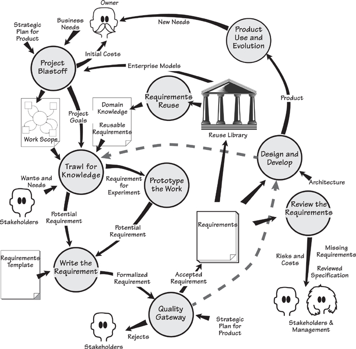
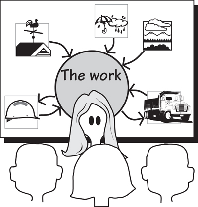
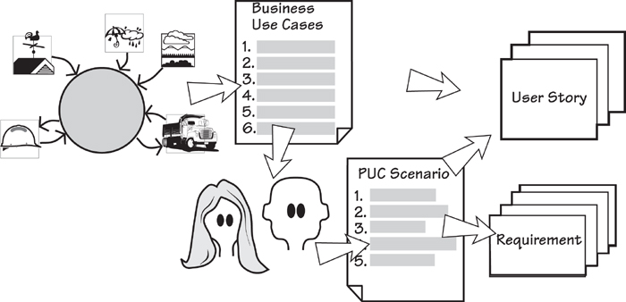
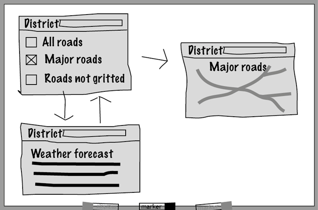
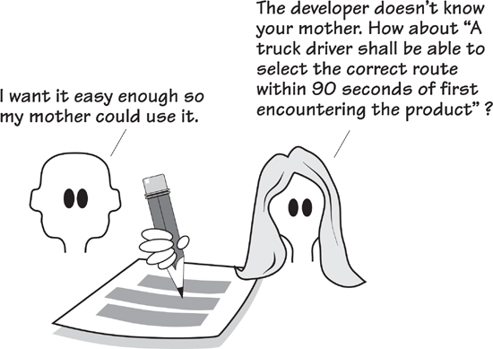
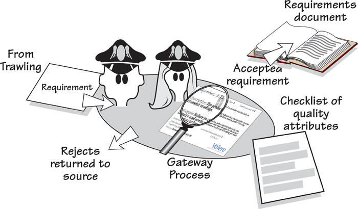
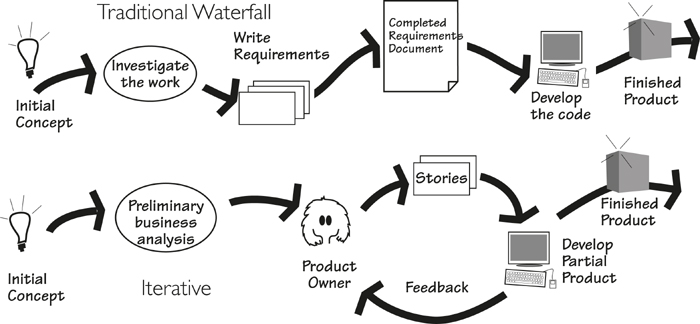
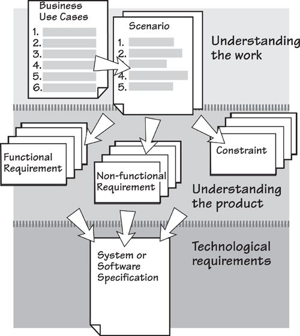
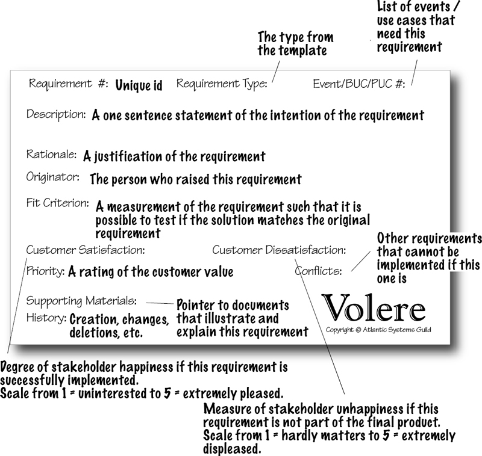

# 2. The Requirements Process

*in which we present a process for discovering requirements and discuss how you might use it*

This book is a distillation of our experience. In it, we describe a requirements process that we have derived from our years of working in the requirements arena—working with clever people who do clever things, and working on projects in wonderfully diverse domains. We have also learned much from the experience of the many people around the world who use various parts of our techniques.

Whether you are building custom systems, building systems by assembling components, using commercial off-the-shelf software, accessing open-source software, outsourcing your development, or making changes to existing software, you still need to explore, discover, understand, and communicate the requirements.

We developed the Volere Requirements Process and its associated specification template from the activities and deliverables that had proved themselves to be most effective in project and consulting assignments with our clients. The result of this experience is a requirements discovery and specification process whose principles can be applied—and indeed have been applied—to almost all kinds of application types in almost all kinds of development environments.

We want to stress from the very beginning that while we are presenting a process, we are using it as a vehicle for discovering requirements; we do not expect you to wave this process around and tell your co-workers that it is “the only way to do things.” However, we have high expectations that you will find many useful things from this process that will, in turn, help you to discover and communicate your requirements more productively and accurately. We have personally seen hundreds of companies adapt the process to their own cultures and organizations, and we know of thousands more that have done so.

**If the right product is to be built, then the right requirements have to be discovered.**

Our clients who use the Volere Requirements Process are those who develop their products using RUP, incremental, iterative, spiral, Scrum, or other variations of iterative development; more formalized waterfall processes; and a variety of homebrewed development processes. Over the years, all of these clients agreed with us: If the right product is to be built, the right requirements have to be discovered. But requirements don’t come about by fortuitous accident. To find the correct and complete requirements, you need some kind of orderly process.

The Volere Requirements Process is shown in Figure 2.1. Each of the activities included in the figure, along with the connections between them, is described in detail in subsequent chapters of this book.

Figure 2.1. This map of the Volere Requirements Process shows the activities and their deliverables. We have used a stylized data flow notation. Each activity (the bubbles) and its deliverables (named arrows or documents) are explained in the text. The dotted lines represent how this process is used with iterative projects.

### The Requirements Process in Context

We need to point out—indeed, we need to stress—that this process is not intended to be a waterfall approach. At various stages throughout this book, we will point out how you might modify the process if you are using some kind of iterative development.

Requirements discovery should be seen as a necessary forerunner of any construction activity, but it should also be viewed as something that can be conducted quite quickly, sometimes quite informally, sometimes overlapping with subsequent design and construction activities, but never ignored.

Let’s look briefly at each of the activities shown in Figure 2.1, which are covered in more detail in subsequent chapters. The intention of this chapter is to give you a gentle introduction to the process, its components, its deliverables, and the ways that they fit together. If you want more detail on any of the activities, feel free to jump ahead to the relevant chapter before completing this overview.

As we go through the process, we describe it as if you were working with a brand-new product—that is, developing something from scratch. We take this approach to avoid, for the moment, becoming entangled in the constraints that are part of all maintenance projects. Later, we will discuss requirements for those situations when the product already exists and changes to it are required.

> “The likelihood of frost or ice forming is determined by the energy receipt and loss at the road surface. This energy flow is controlled by a number of environmental and meteorological factors (such as exposure, altitude, road construction, traffic, cloud cover, and wind speed). These factors cause significant variation in road surface temperature from time to time and from one location to another. Winter night-time road surface temperatures can vary by over 10°C across a road network in a county.”

> —Vaisala News

### A Case Study

We will explain the Volere Requirements Process by taking you through a project that uses it.

The IceBreaker project is to develop a product that predicts when and where ice will form on roads, and to schedule trucks to treat the roads with de-icing material. The new product will enable road authorities to more accurately predict ice formation, schedule road treatments more precisely, and thereby make the roads safer. The product will also reduce the amount of de-icing material needed, which will help both the road authority’s finances and the environment.

Blastoff is also known as “project initiation,” “kickoff,” “charter,” “project launch,” and many other things. We use the term “blastoff” to describe what we are trying to achieve—getting the requirements project launched and flying.

### Project Blastoff

Imagine launching a rocket. 10 – 9 – 8 – 7 – 6 – 5 – 4 – 3 – 2 – 1 – blastoff! If all it needed were the ability to count backward from 10, then even Andorra1 would have its own space program. The truth of the matter is that before we get to the final 10 seconds of a rocket launch, a lot of preparation has taken place. The rocket has been fueled, and the course plotted—in fact, everything that needs to be done if the rocket is to survive and complete a successful mission.

The key purpose of the project blastoff is to build the foundation for the requirements discovery that is to follow, and to ensure that all the needed components for a successful project are in place. The principal stakeholders—the sponsor, the key users, the lead requirements analyst, technical and business experts, and other people who are crucial to the success of the project—gather together to arrive at a consensus on the crucial project issues.

The blastoff defines the scope of the business problem and seeks concurrence from the stakeholders that yes, this is the area of the owner’s organization that needs to be improved. The blastoff meeting confirms the functionality to be included in the requirements discovery, and the functionality that is to be specifically excluded.

Defining the scope of the business problem is usually the most convenient way to start. In the IceBreaker project, the lead requirements analyst coordinates the group members’ discussion as they come to a consensus on the scope of the work—that is, the business area to be improved—and how this work relates to the world around it. The meeting participants draw a context diagram on a whiteboard to show which functionality is included in the work, and by extension, which elements they consider to be outside the scope of the ice forecasting business. The diagram defines—precisely defines—the included functionality by showing the connections between the work and the outside world. (More on this in the next chapter.) This use of a context diagram is illustrated in Figure 2.2. Later, as the requirements activity proceeds, the context diagram is used to reveal the optimal product to help with this work.

Figure 2.2. The context diagram is used to build a consensus among the stakeholders as to the scope of the work that needs to be improved. The eventual product will be used to do part of this work.

Refer to Chapter 3, Scoping the Business Problem, for a detailed discussion of project blastoff.

When they have reached a reasonable agreement on the scope of the business area to be studied, the group identifies the stakeholders. The stakeholders are those people who have an interest in the product, or who have knowledge pertaining to the product—in fact, anyone who has requirements for it. For the IceBreaker project, the people who have an interest are the road engineers, the truck depot supervisor, the weather forecasting people, road safety experts, ice treatment consultants, and so on. These people must be identified, so that the requirements analysts can work with them to find all the requirements. The context diagram, by establishing the extent of the work, helps to identify many of the stakeholders.

The blastoff also confirms the goals of the project. The blastoff group comes to an agreement on the business reason for doing the project, and agrees that there is a clear and measurable benefit to be gained by doing the project. The group also agrees that the product is worthwhile for the business to make the investment, and that the organization is capable of building and operating it.

It is always better to get an idea of the downside of the project (its risk and cost) before being swept away by the euphoria of the benefits that the new product is intended to bring.

It is sensible project management practice at this stage to produce a preliminary estimate of the costs involved for the requirements part of the project—this can be done by using the information already contained in the context diagram. It is also sensible project management to make an early assessment of the risks that the project is likely to face. Although these risks might seem like depressing news, it is always better to get an idea of the downside of the project (its risk and cost) before being swept away by the euphoria of the benefits that the new product is intended to bring.

The blastoff group members arrive at a consensus on whether the project is worthwhile and viable—that is, they make the “go/no go” decision. It might seem brutal to kill off an embryonic project, but we know from bitter experience that it is better to cancel a project at an early stage than to have it stagger on for months—or years—consuming valuable resources when it has little or no chance of success. The blastoff group carefully considers whether the product is viable, and whether its benefits outweigh its costs and risks.

**Reading**

DeMarco, Tom, and Tim Lister. Waltzing with Bears: Managing Risk on Software Projects. Dorset House, 2003.

McConnell, Steve. Software Estimation: Demystifying the Black Art. Microsoft Press, 2006.

Alternatively, if too many unknowns remain at this point, the blastoff group might decide to start the requirements investigation with the intention of reviewing the requirements after a short while and reassessing the value of the project.

### Trawling for Requirements

Once the blastoff is completed, the business analysts start trawling the work to learn and understand its functionality—“What’s going on with this piece of the business, and what do they want it to do?” For convenience and consistency, they partition the work context diagram into business use cases.

Each business use case is an amount of functionality needed by the work to make the correct response to a business event. (These terms will be fully explained soon.) A requirements analyst is assigned to each of the business use cases—the analysts can work almost independently of one another—for further detailed study. The analysts use trawling techniques such as apprenticing, scenarios, use case workshops, and many others to discover the true nature of the work. These trawling techniques are described in Chapter 5, Investigating the Work.

Refer to Chapter 4 for a discussion of business events and business use cases, and an exploration of how you might use them.

Trawling means discovering the requirements. The business analysts sit with the IceBreaker technicians as they describe the work they currently do, and their aspirations for work they hope to do. The business analysts also consult with other interested stakeholders and subject-matter experts—experts on usability, security, operations, management, and so on—to discover other needs for the eventual product. The IceBreaker business analysts spent a lot of time with the meteorologists and the highway engineers.

Refer to Chapter 5, Investigating the Work, for details of the trawling activity.

Perhaps the most difficult part of requirements investigation is uncovering the essence of the system. Many stakeholders inevitably talk about their perceived solution to the problem or express their needs in terms of the current implementation. The essence, by contrast, is the underlying business reason for having the product. Alternatively, you can think of it as the policy of the work, or what the work or the business rule would be if it could exist without any technology (and that includes people). We will have more to say about the essence of the system in Chapter 7, Understanding the Real Problem.

We look at developing innovative products in Chapter 8, Starting the Solution.

Once they understand the essence of the work, the analysts get together with the key stakeholders to decide the best product to improve this work. That is, they determine how much of the work to automate or change, and what effect those decisions will have on the work. Once they know the extent of the product, the requirements analysts write its requirements. We illustrate this process in Figure 2.3.

Figure 2.3. The blastoff determines the scope of the work to be improved. The business use cases are derived from the scope. Each of the business use cases is studied by the requirements analysts and the relevant stakeholders to discover the desired way of working. When this is understood, the appropriate product can be determined (the PUC scenario) and requirements or user stories written from it.

**Reading**

Maiden, Neil, Suzanne Robertson, Sharon Manning, and John Greenwood. Integrating Creativity Workshops into Structured Requirements Processes. Proceedings of DIS 2004, Cambridge, Mass. ACM Press.

Michalko, Michael. Thinkertoys: A Handbook of Creative-Thinking Techniques, second edition. Ten Speed Press, 2006.

Robertson, Suzanne, and James Robertson. Requirements-Led Project Management. Addison-Wesley, 2005.

The IceBreaker product must not be a simplistic automation of the work as it is currently done; the best of our automated products are not mere imitations of an existing situation. To deliver a truly useful product, the analytical team must work with the stakeholders to innovate—that is, to develop a better way to do the work, and a product that supports this better way of working. They make use of innovation workshops where the team uses creative thinking techniques and innovative triggers to generate new and better ideas for the work and the eventual product.

### Quick and Dirty Modeling

Models can be used at any time in the Volere life cycle; in Figure 2.1, we show this activity as “Prototype the Work.” There are, of course, formal models such as you would find in UML or BPMN, but a lot of the time business analysts can make productive use of quick sketches and diagrams to model the work being investigated. One quick and dirty modeling technique we should mention here is using Post-it notes to model functionality; each note can be used to represent an activity, and the notes can be rapidly rearranged to show different ways the work is done or could be done. We find that stakeholders relate to this way of modeling their business processes, and are always willing to participate with hands-on manipulation of the Post-its to show what they think the work should be. We discuss this kind of modeling more fully in Chapter 5, Investigating the Work.

In Chapter 8, Starting the Solution, we examine how you move into an implementation of the requirements discovered so far. At this point, your models change from being something to explain the current work, to something to explain how the future product will help with that work.

We can now start to refer to this type of model as a prototype—a quick and dirty representation of a potential product using pencil and paper, whiteboards, or some other familiar means, as shown in Figure 2.4. Prototypes used at this stage are intended to present the user with a simulation of the requirements as they might be implemented. The IceBreaker business analysts sketch some proposed interfaces and ways that the needed functionality might be implemented—this visual way of working allows the engineers and other stakeholders to coalesce their ideas for the future product.

Figure 2.4. A quick and dirty prototype built on a whiteboard to provide a rapid visual explanation of how some of the requirements might be implemented, and to clarify misunderstood or missing requirements.

### Scenarios

Scenarios are so useful that we have devoted the whole of Chapter 6 to them. Scenarios show the functionality of a business process by breaking it into a series of easily recognizable steps, written in English (or whatever language you use at work) so that they are accessible to all stakeholders. The IceBreaker analysts used scenarios to describe the business processes and present their understanding of the needed functionality. These scenarios were then revised as needed—different stakeholders took an interest in different parts of the scenario, and after a short time, the business analysts were able to have everyone understand and come to a consensus on what the work was to be.

Once they are agreed, the scenarios become the foundation for the requirements.

Refer to Chapter 6 for a discussion about using scenarios.

### Writing the Requirements

A major problem in system development is misunderstood requirements. To avoid any misunderstanding, the analysts must write their requirements in an unambiguous and testable manner, and at the same time ensure that the originating stakeholder understands and agrees with the written requirement before it is passed on to the developers. In other words, the analysts write the requirements so as to ensure that parties at either end of the development spectrum are able to have an identical understanding of what is needed.

Although the task of writing down the requirements might seem an onerous burden, we have found it to be the most effective way to ensure that the essence of the requirement has been captured and communicated, and that the delivered product can be tested. (See Figure 2.5.)

Figure 2.5. The requirements are captured in written form to facilitate communication between the stakeholders, the analysts, and the developers (and anyone else who has an interest). By writing the requirements carefully, the team ensures that the correct product is built.

The IceBreaker analysts start by writing their requirements using business language so that the nontechnical stakeholders can understand them and verify their correctness. They add a rationale to the requirements—it shows the background reason for the requirement, which removes much of the ambiguity. Further, to ensure complete precision and to confirm that the product designers and developers can build exactly what the stakeholder needs, they write a fit criterion for each requirement. A fit criterion quantifies, or measures, the requirement, which makes it testable, which in turn allows the testers to determine whether an implementation meets—in other words, fits—the requirement.

The rationale and the fit criterion make the requirement more understandable for the business stakeholder, who has on several occasions said, “I am not going to have any requirements that I do not understand, nor will I have any that are not useful or that don’t contribute to my work. I want to understand the contributions that they make. That’s why I want each one to be both justified and measurable.”

Chapter 12 describes fit criteria in detail.

The business analyst has a different, but complementary, reason for measuring requirements: “I need to ensure that each requirement is unambiguous; that is, it must have the same meaning to both the stakeholder who originated it and the developer who will build it. I also need to measure the requirement against the stakeholder’s expectations. If I can’t put a measurement to it, then I can never tell if we are building the product the stakeholder really needs.”

The analysts use two devices to make it easier to write their specification. The first device, the requirements specification template, is an outline and guide to writing a requirements specification. The business analysts use it as a checklist of the requirements they should be asking for, and as a consistent way of organizing their requirements documents. The second device is a shell, also known as a snow card. Each atomic (that’s the lowest level) requirement is made up of a number of attributes, and the snow card is a convenient layout for ensuring that each requirement has the correct constituents.

Of course, the writing process is not really a separate activity. In reality, it is integrated with the activities that surround it—trawling, prototyping, and the quality gateway. However, for the purposes of understanding what is involved in putting the correct requirements into a communicable form, we will look at it separately.

Refer to Chapters 10, 11, 12, and 16 for detailed discussions of writing the requirements.

Iterative development methods employ user stories as a way of conveying the requirements. The stories are, in fact, placeholders for lower-level requirements; they are augmented during conversations between the developers and the stakeholders to flush out the detailed requirements. In Chapter 14, Requirements and Iterative Development, we look closely at how the business analyst can produce better user stories. Working iteratively does not obviate the need for requirements, but rather seeks to discover and communicate the requirements in a different manner.

The primary reason for wanting written requirements is not to have written requirements (although that is often necessary), but rather to write them. Writing the requirement, together with its associated rationale and fit criterion, clarifies it in the writer’s mind, and sets it down in an unambiguous and verifiable manner. To put that another way, if the business analyst cannot correctly write the requirement, he has not yet understood it.

### Quality Gateway

Requirements are the foundation for all that is to follow in the product development cycle. Thus it stands to reason that if the right product is to be built, the requirements must be correct before they are handed over to the builders. To ensure correctness, the quality gateway tests the requirements (Figure 2.6). The IceBreaker team has set up a single point that every requirement must pass through before it can become a part of the specification. This gateway is manned by two people—the lead requirements analyst and a tester—and they are the only people authorized to pass requirements through the gateway. Working together, they check each requirement for completeness, relevance, testability, coherency, traceability, and several other qualities before they allow it to be passed to the developers.

Figure 2.6. The quality gateway ensures that requirements are rigorous by testing each one for completeness, correctness, measurability, absence of ambiguity, and several other attributes, before allowing the requirement to be passed to the developers.

Chapter 13 describes how the quality gateway tests the requirements.

By ensuring that the only way for requirements to be made available for the developers is for those requirements to pass through the quality gateway, the project team is in control of the requirements, and not the other way around.

### Reusing Requirements

The requirements for any product you build are never completely unique. We suggest that before starting on any new requirements project, you go through the specifications written for previous projects and look for potentially reusable material. Sometimes you may find dozens of requirements that you can reuse without alteration. More often you will find requirements that, although they are not exactly what you want, are suitable as the basis for some of the requirements you will write in the new project.

For example, in the IceBreaker project, the rules for road engineering have not changed much over the years. Thus, the requirements analysts working on various projects do not have to rediscover them, but can simply reuse them. They also know that the business of vehicle scheduling does not change radically over time, so their trawling process can take advantage of some requirements from previous projects.

Similarly, for different projects within your organization, the non-functional requirements are fairly standard, so you can start with a specification from one of the previous projects and use it as a checklist.

The point about reusing requirements is that once a requirement has been successfully specified for a product, and the product itself is successful, the requirement does not have to be reinvented or rediscovered. In Chapter 15, Reusing Requirements, we discuss how you can take advantage of the knowledge that already exists within your organization, and how you can save yourself time by recycling requirements from previous projects.

See Chapter 15 for more on reusing requirements.

### Reviewing the Requirements

The quality gateway exists to keep bad requirements out of the specification—it does this one requirement at a time. Nevertheless, at the point when you think your requirements specification is complete (or as complete as you need it for the next activity), you should review it. This final review checks that there are no missing requirements, that all the requirements are consistent with one another, and that any conflicts between the requirements have been resolved. In short, the review confirms that the specification is really complete and suitable so that you can move on to the next stage of development.

See Chapter 17, Requirements Completeness, for more on reviewing the specification.

This review also offers you an opportunity to reassess the costs and risks of the project. Now that you have a complete set of requirements, you know a lot more about the product than you did at the project blastoff. In particular, you have a much more precise knowledge of the scope and functionality of the product, so this is a good time to remeasure its size. From that size, and from your knowledge of the project’s constraints and solution architecture, you can estimate the cost to construct the product.

You also know at this stage which types of requirements are associated with the greatest risks. For example, the users might have asked for an interface that your organization has not built before. Or perhaps they want to use untried technology to build the product. Perhaps the developer might not have the people with the skills needed to build the product as specified? By reassessing the risks at this point, you give yourself a more realistic chance of building the desired product successfully.

### Iterative and Incremental Processes

One common misconception in the requirements world is that you have to gather all the requirements before moving on to the next step of design and construction. In other words, doing requirements means that you employ a traditional waterfall process. In some circumstances this is necessary, but not always. On the one hand, if you are outsourcing or if the requirements document forms the basis of a contract, then clearly you need to have a complete requirements specification. On the other hand, if the overall architecture is known, then construction and delivery can often begin before all the requirements are discovered. We show these two approaches in Figure 2.7, and suggest you consider which one works best for you when working on your own requirements projects. We also have a lot more to say on various approaches in Chapter 9, Strategies for Today’s Business Analyst.

Figure 2.7. Two (of many) variations on development life cycles. At the top of the figure is the traditional waterfall approach, in which the complete requirements document is put together before product development begins. At the bottom of the figure is an iterative process, in which, after a preliminary analysis, the product is developed in small increments. Both approaches achieve the same purpose.

On the IceBreaker project, the developers are ready to start building the product, so after the blastoff the key stakeholders select three (it could be any low number) of the highest-priority and greatest-value business use cases. The requirements analysts trawl and gather the requirements for only those business use cases, putting aside the rest of the work for now. Then, when the first tranche of requirements have successfully passed the quality gateway, the developers start their work. The intention is to implement a small number of use cases as early as possible to get the reaction of the stakeholders—if there are going to be any nasty surprises, the IceBreaker team wants to get them as early as possible. While the developers are building and delivering the first lot of business use cases, the analysts are working on the requirements for the next-highest-priority ones. Soon they have established a rhythm for delivery, with new use cases being implemented and delivered every few weeks.

### Requirements Retrospective

You are reading this book about a requirements process, presumably with the intention of improving your own process. Retrospectives, sometimes known as lessons learned, are one of the most effective tools for discovering the good and bad of a process, and suggesting remedial action. Retrospectives for requirements projects consist of a series of interviews with stakeholders and group sessions with the developers. The intention is to canvas all the people involved in the project and ask these questions:

- What did we do right?

- What did we do wrong?

- If we had to do it again, what would we do differently?

By looking for honest answers to these questions, you give yourself the best chance of improving your process. The idea is very simple: Do more of what works and less of what doesn’t.

Keep a record of the lessons learned from your retrospectives. While humans have memory and can learn from their experience to their advantage in future projects, organizations don’t learn—unless you write down the experience. By keeping the lessons learned available in some readily accessible manner, subsequent projects can learn from your accomplishments and mishaps.

> “If we did the project again tomorrow, what would we do differently?”

Your retrospective can be very informal: a coffee-time meeting with the project group, or the project leader collecting e-mail messages from the participants. Alternatively, if the stakes are higher, this process can be formalized to the point where it is run by an outside facilitator who canvases the participants, both individually and as a group, and publishes a retrospective report.

The most notable feature of retrospectives is this: Companies that regularly conduct retrospectives consistently report significant improvements in their processes. In short, retrospectives are probably the cheapest investment you can make in improving your own process.

### Evolution of Requirements

You start a project with little more than a vision—and sometimes a fairly blurred vision—of the desired future state of your owner’s work. (As we have done elsewhere in this book, we use the term “work” to refer to the area of the owner’s organization where improvements are to be made, usually by automating or re-automating part of it.)

During the early stages of requirements discovery, analysts deploy models of varying degrees of formality to help them and the stakeholders to learn what the work is, and what it is to be. From this investigation of the work, everyone arrives at the same level of understanding such that the stakeholders find improvements that will be truly beneficial.

It helps enormously when coming to an understanding of the work if the analysts and stakeholders can see the essence of the work. The essence is an abstraction of the work that sees the underlying policy of the work without the technology that clouds our vision of what the work actually is. This “thinking above the line,” as we call it in Chapter 7, Understanding the Real Problem, is important if the requirements are not to merely replicate whatever it is that exists at the moment, and if “technological fossils” and inappropriate process are not to be inadvertently reimplemented.

The understanding of the work evolves and matures, and at some point it is possible for the stakeholders, guided by the business analysts and the systems architects, to determine the optimal product to improve that work. When this stage is reached, the business analysts determine the detailed functionality for the product (keep in mind that not all of the work’s functionality would be included in the product) and to write its requirements. The non-functional requirements are derived at roughly the same time and written along with those constraints that are not already recorded. At this point, the requirements are written in a technologically neutral manner—they specify what the product has to do for the work, but not how the technology will do it.

You can think of these requirements as “business requirements,” meaning that they specify the product needed to support the business. Once they are adequately understood, they are released to the designer, who adds the product’s technological requirements before producing the final specification for the builders. This process is illustrated in Figure 2.8.

Figure 2.8. The requirements evolve as development of the product progresses. They start out as fairly vague ideas as the analysts and stakeholders explore the work area. As the ideas for the product emerge over time, the requirements become precise and testable. They remain technologically neutral until the designer becomes involved and adds those requirements needed to make the product work in its technological environment.

We have said that the requirements evolve, but this process should not be thought of as an inexorable progression toward some known destination. As Earl Beede points out, every time you think of a solution, it causes some new problems that require you to backtrack and revisit some of your earlier work. When we are talking about a requirements process, keep in mind that the process, if it is to be useful, must allow you to move backward as well as forward. Naturally, you would like to spend most of your time moving forward, but don’t be too disappointed if you have to return to some things you thought you had put behind you.

### The Template

It is easier to write requirements, and far more convenient, if you have a guide to writing them. Appendix A of this book provides The Volere Requirements Specification Template, which is a complete blueprint for describing your product’s functionality and capabilities. This template, which is a distillation of literally hundreds of requirements specifications, is in use by thousands of organizations all over the world.

It is convenient to categorize requirements into several types—each of the template’s sections describes a type of requirement and its variations. Thus, as you discover the requirements with your stakeholders, you add them to your specification, using the template as a guide to necessary content.

The template is designed to serve as a sophisticated checklist, providing you with a list of what to write about, and suggestions on how to write about them. The table of contents for the template is reproduced here, and we will discuss each section in detail later in the book.

The complete Volere Requirements Specification Template is found in Appendix A.

Our associate, Stephen Mellor, suggests using the template by going directly to the most pressing sections—the ones that seem to you to be most useful—and then revisiting the template as needed. You will probably use most of it, but it is not—really not—a template that you fill by starting on page one and working through to the bitter end. Like any good tool, when used wisely the template provides a significant advantage to your requirements discovery.

Here, then, is the content of the template.

Project Drivers—reasons and motivators for the project

1. The Purpose of the Project—the reason for making the investment in building the product and the business advantage that you want to achieve by doing so

2. The Client, the Customer, and Other Stakeholders—the people with an interest in or an influence on the product

3. Users of the Product—the intended end users, and how they affect the product’s usability

Project Constraints—the restrictions on the project and the product

4. Requirements Constraints—the limitations on the project, and the restrictions on the design of the product

5. Naming Conventions and Definitions—the vocabulary of the project

6. Relevant Facts and Assumptions—outside influences that make some difference to this product, or assumptions that the developers are making

Functional Requirements—the functionality of the product

7. The Scope of the Work—the business area or domain under study

8. The Scope of the Product—a definition of the intended product boundaries and the product’s connections to adjacent systems

9. Functional and Data Requirements—the things the product must do and the data manipulated by the functions

Non-functional Requirements—the product’s qualities

10. Look and Feel Requirements—the intended appearance

11. Usability and Humanity Requirements—what the product has to be if it is to be successfully used by its intended audience

12. Performance Requirements—how fast, big, accurate, safe, reliable, robust, scalable, and long-lasting, and what capacity

13. Operational and Environmental Requirements—the product’s intended operating environment

14. Maintainability and Support Requirements—how changeable the product must be and what support is needed

15. Security Requirements—the security, confidentiality, and integrity of the product

16. Cultural Requirements—human and sociological factors

17. Legal Requirements—conformance to applicable laws

Project Issues—issues relevant to the project that builds the product

18. Open Issues—as yet unresolved issues with a possible bearing on the success of the product

19. Off-the-Shelf Solutions—ready-made components that might be used instead of building something from scratch

20. New Problems—problems caused by the introduction of the new product

21. Tasks—things to be done to bring the product into production

22. Migration to the New Product—tasks to convert from existing systems

23. Risks—the risks that the project is most likely to incur

24. Costs—early estimates of the cost or effort needed to build the product

25. User Documentation—the plan for building the user instructions and documentation

26. Waiting Room—requirements that might be included in future releases of the product

27. Ideas for Solutions—design ideas that we do not want to lose

Browse through the template in Appendix A before you go too much further in this book. You will find a lot of information about writing requirements, plus much food for thought about the kinds of requirements you are looking for.

Throughout this book, we will refer to requirements by their type—that is, one of the types as shown in the template’s table of contents.

### The Snow Card

Whereas the template is a guide to what to write about, the snow card is a guide to how to write it. Individual requirements have a structure—a set of attributes, where each attribute contributes something to your understanding of the requirement, and to the precision of the requirement, and thereby to the accuracy of the product’s development.

Any number of automated tools are available for recording, analyzing, and tracing requirements.

Before we go any further, we must point out that although we call this device a card, and we use cards in our courses, and this book is sprinkled with diagrams featuring this card, we are not advocating writing all your requirements on cards. Some good things can be realized by using cards when interviewing stakeholders and quickly scribbling requirements as they come to light. Later, these requirements are recorded in some electronic form; at that time, their component information is filled in. Thus any reference to “card” should be taken to mean (probably) a computerized version.

At first glance, the card might seem rather bureaucratic. (See Figure 2.9.) We are not seeking to add to your requirements burden, but rather to provide a way of accurately and conveniently gathering the needed information—each of the attributes of the snow card makes a contribution. We shall explain these as we work our way through this book.

Figure 2.9. The requirements shell or snow card, consisting of a 5-inch by 8-inch card, printed with the requirement’s attributes, that is used for our initial requirements gathering. Each of the attributes contributes to the understanding and testability of the requirement. Although a copyright notice appears on the card, we have no objections to any reader making use of it for his or her requirements work, provided the source is acknowledged.

### Your Own Requirements Process

The itinerant peddler of quack potions, Doctor Dulcamara, sings the praises of his elixir—it is guaranteed to cure toothache, make you potent, eliminate wrinkles and give you smooth beautiful skin, destroy mice and bugs, and make the object of your affections fall in love with you. This rather fanciful libretto from Donizetti’s opera L’elisir d’amore points out something that, although very obvious, is often disregarded: There is no such thing as the universal cure.

We have distilled experience from a wide variety of projects to provide you with a set of foundation activities and deliverables that apply to any project.

We really would like to be able to present you with a requirements process that has all the attributes of Doctor Dulcamara’s elixir—a process that suits all projects for all applications in all organizations. We can’t. We know from experience that every project has different needs. However, we also know that some fundamental principles hold good for any project. So instead of attempting to provide you with a one-size-fits-all magic potion, we have distilled our experiences from a wide variety of projects to provide you with a set of foundation activities and deliverables that apply to any project.

The process described in this book is made up of the things you have to do to successfully discover the requirements. Likewise, the deliverables presented here are the foundation for any kind of requirements activity. Our intention is not to say that there is only one true path to requirements Nirvana, but rather to give you the components you need for successful requirements projects.

As you read this book, think about how you can use these components within the constraints of your own culture, your own environment, your own organizational structure, and your own chosen way of product development.

**Reading**

Brooks, Fred. No Silver Bullet: Essence and Accidents of Software Engineering, and “No Silver Bullet Refired.” The Mythical Man-Month: Essays on Software Engineering, twentieth anniversary edition. Addison-Wesley, 1995. This is possibly the most influential book on software development; it certainly is timeless.

To adapt this process, you should understand the deliverables it produces—the rest of this book will discuss these items in detail. Once you understand the content and purpose of each deliverable, ask how each one (provided it is relevant) would best be produced within your project environment using your resources:

- What is the deliverable called within your environment? Use the definitions of the terms used in the generic process model and identify the equivalent deliverable in your organization.

- Is this deliverable relevant for this project?

- How much do you already know about this deliverable? Do you know enough to be able to avoid devoting additional time to it?

- Who produces the deliverable? Understand which parts of the deliverable are produced by whom. Also, when several people are involved, you need to define the interfaces between them.

- When is the deliverable produced? Map your project phases to the generic process.

- Where is the deliverable produced? A generic deliverable is often the result of fragments that are produced in a number of geographical locations. Define the interfaces between the different locations and specify how they will work.

- Who needs to review the deliverable? Look for existing cultural checkpoints within your organization. Do you have recognized stages or phases in your projects at which peers, users, or managers must review your specification?

**The generic model describes deliverables and procedures for producing them; our intention is that you decide how you use them.**

We also point you to Chapter 9 of this book, entitled Strategies for Today’s Business Analyst. This chapter considers how you might approach your requirements projects. We suggest that before you become too involved in the mechanics of requirements discovery, you think about the strategy that is most suitable for you.

### Formality Guide

There is every reason to make your requirements discovery and communication as informal as possible. We say “as possible” because it is not so much what you would like as what your situation demands—often the degree of formality will be dictated by factors beyond your control. For example, you may be developing software using contracted outsourced development. In this case, there is a clear need for a complete written requirements specification. In other cases, the way you communicate your requirements can be informal to the point that a portion of the requirements are not written, or partially written, and communicated verbally.

We have included a formality guide to suggest where you might take a more relaxed approach to recording requirements, as well as those times when you should rightly be more systematic with your requirements discovery and communication. These are the conventions you will encounter as you move through this book.

Rabbit—small, fast, and short-lived. Rabbit projects are typically smaller projects with shorter lifetimes, where close stakeholder participation is possible. Rabbit projects usually include a lesser number of stakeholders.

Rabbit projects are usually iterative. They discover requirements in small units (probably one business use case at a time) and then implement a small increment to the working functionality, using whatever has been implemented to solicit feedback from the stakeholders.

Rabbit projects do not spend a great deal of time writing the requirements, but use conversations with the stakeholders as a way to elaborate the requirements written on story cards. Rabbit projects almost always co-locate the business knowledge stakeholders with the business analysts and the developers.

Horse—fast, strong, and dependable. Horse projects are probably the most common corporate projects—they are the “halfway house” of formality. Horse projects need some formality—it is likely that there is a need for written requirements so that they can be handed from one department to another. Horse projects have medium longevity and involve more than a dozen stakeholders, often in several locations, factors that necessitate consistently written documentation.

If you cannot categorize your own project, think of it as a horse.

Elephant—solid, strong, long life, and a long memory. An elephant project has a need for a complete requirements specification. If you are outsourcing the work, or if your organizational structure requires complete, written specifications, you’re an elephant. In certain industries, such as pharmaceuticals, aircraft manufacture, or the military, regulators demand not only that full specifications be produced, but also that the process used to produce them be documented and auditable. Elephant projects typically have a long duration, and they involve many stakeholders in distributed locations. There are also a large number of developers, necessitating more formal ways of communicating.

### The Rest of This Book

We have described—briefly—a process for discovering, communicating, and verifying requirements. The remainder of this book describes the various activities in this process, along with their deliverables, in some detail. Feel free to jump to any chapter that is of immediate concern—we wrote the chapters in more or less the order in which you would do each of the activities, but you don’t have to read them that way.

And please, while you are reading this book, be constantly asking yourself how you will do the things we describe. After all, it is you who has to do them.

We hope find useful ideas, processes and artifacts, in the rest of this book. We also hope you enjoy reading and using it.
