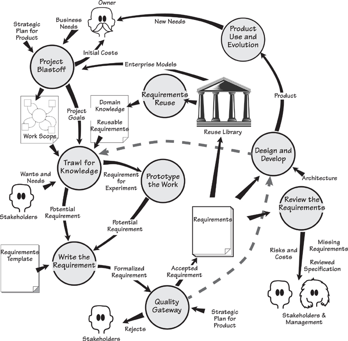
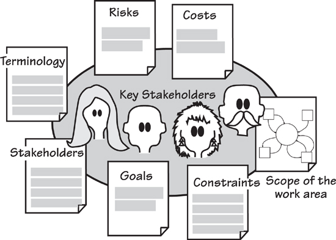
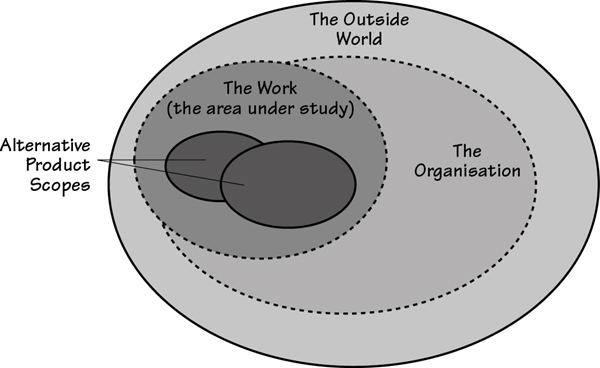
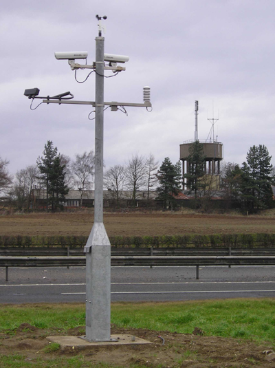
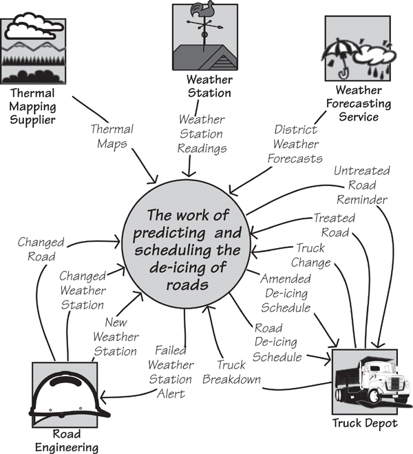
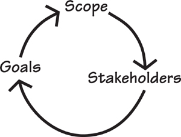
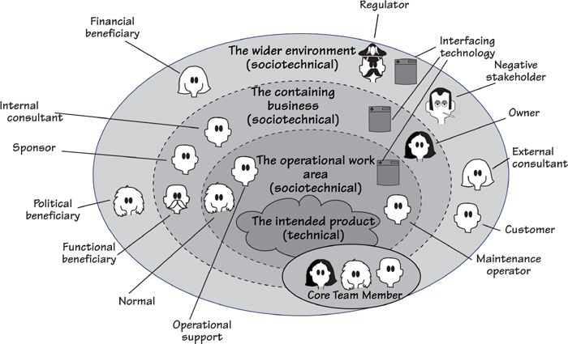

# 3. Scoping the Business Problem

[3-P001] *in which we establish a definition of the business area to be changed, thereby ensuring that the project team has a clear vision of what their project is meant to achieve*

[3-P002] Let’s revisit our fundamental premise: If a piece of software (or any device or service) is to be built, it must be optimally valuable to its owner.

[3-P003] From this statement, you can safely infer that if you are to know what is optimally valuable, you must firstly determine what the owner is actually doing, who he is doing it with or for, and why he wants to do it. To put that another way: What are the scope, stakeholders, and goals? Hold that thought—we will come back to it in a moment.

[3-P004] In the Volere process model, as shown in **Figure 3.1**, the first activity is the Project Blastoff. It is during this activity—typically a meeting of the key stakeholders—that you decide the key factors that, taken together, determine the viability of the requirements project.

[3-P005] 

[3-P006] Figure 3.1. The Project Blastoff activity lays the groundwork for the requirements discovery activities to come.

[3-P007] ***If a piece of software is to be built, it must be optimally valuable to its owner.***

## 3.1 Project Blastoff

[3.1-P001] The blastoff identifies the boundary of the work area the product is to become a part of, and determines the purpose the product is to fulfill. It also identifies the stakeholders—those people who have an interest in the success of the product. Other deliverables from the blastoff qualify the project, and are used as inputs to subsequent requirements discovery activities.

[3.1-P002] You might know this activity as “project kick-off,” “project initiation,” “project launch,” or any one of the many other names given to it. Whatever you call it, its purpose is to lay the groundwork so your requirements discovery is efficient and effective.

[3.1-P003] The blastoff produces a number of deliverables. You might be given some of these by your project manager; others, you might have to dig out for yourself. In any event, you need these deliverables if you are to have a successful requirements activity. Look through the following list and consider the effect that each of these typical blastoff deliverables would have on your project:

- [3.1-P004] *Purpose of the project:* a short, quantified statement of what the product is intended to do, and what benefit it brings to the business. This statement of purpose is an explanation of why the business is investing in the project, along with the business benefit it wants to achieve. This justifies the project and serves as a focus for the requirements discovery process.

- [3.1-P005] *The scope of the work:* The business area affected by the installation of the product. You need to understand this work to specify the most appropriate product.

- [3.1-P006] *The stakeholders:* The people with an interest in the product. This group includes anyone who has some influence on the outcome or has knowledge needed to uncover the requirements for the product.

- [3.1-P007] *Constraints:* Restrictions on the scope or style of the product. These items include predetermined design solutions that must be used, constraints on changing the way that business processes are currently implemented, and the time and money that are available for the project.

- [3.1-P008] *Names:* Any special terminology to be used in this project.

- [3.1-P009] *Relevant facts and assumptions:* Are there any special facts people need to know? Or are there assumptions being made that may affect the outcome of the project?

- [3.1-P010] *The estimated cost:* Some of the deliverables from the blastoff provide input to the estimating process and allow fairly good estimates to be made early in the project. This is not really a requirements issue, but as the requirements deliverables are prime input, your project management will thank you for it.

- [3.1-P011] *The risks:* Possibly a short risk analysis to reveal the main risks faced by the project. Someone skilled at risk assessment should perform this analysis.

[3.1-P012] Taken together (see **Figure 3.2**), these deliverables give you enough information to make the final deliverable from the blastoff:

- [3.1-P013] *Go/no go decision:* Is the project viable, and does the cost of producing the product make it worthwhile? Do you have enough information to proceed with the requirements activity, or should you ask for extra time to gather more information and build a better foundation?

[3.1-P014] 

[3.1-P015] Figure 3.2. The blastoff activity assembles enough information to ensure that the project can proceed smoothly. It also verifies that the project is viable and worthwhile. Most of the outputs serve as the foundation for the trawling activity about to come; the risks and costs are used by project management.

## 3.2 Formality Guide

[3.2-P001] The blastoff deliverables—especially scope, stakeholders, and goals—are needed by any project, regardless of its size or aspirations for informality. Even a small change to an existing system needs to ask these questions. Any project must have a clear understanding of its goals if it is to avoid wandering aimlessly. Additionally, a project must understand the work to be improved; otherwise, it runs the risk of producing a solution in search of a problem.

[3.2-P002] In the previous chapter we spoke about rabbit, horse, and elephant projects. These types relate to formality and their differences are as follows.

[3.2-P003] Rabbit projects should have a sketch of the work scope diagram pinned to the wall close to their user stories; close by should be a list of stakeholders. Finally, written with a broad marker pen on the wall, are the project goals. Rabbits will probably have only a brief blastoff meeting at best, with most of the consensus on the blastoff coming from wikis, phone calls, and other informal interactive means. Despite the relative informality, we cannot stress how important it is to document the work scope, and to ensure that you are thinking about the *work,* and not just the intended product.

[3.2-P004] 

[3.2-P005] Horse projects should be more formal and hold a blastoff meeting; they should also record their deliverables and communicate them to the appropriate stakeholders. Horse projects might benefit from producing a first-cut sketch of the guessed-at product to ensure all stakeholders (we are thinking of the nontechnical ones) understand where the project is headed. This sketch must be destroyed as soon as the stakeholders have confirmed it.

[3.2-P006] 

[3.2-P007] Elephants have a lot to lose by not having the blastoff deliverables firmly in place before proceeding further in the product development process. In most cases, the deliverables are discovered during meetings with the key stakeholders, and the results are recorded and distributed. Elephants should take the additional step of having the quality assurance (QA) people test their blastoff deliverables: Elephant projects are critical, and costly if they make errors, so the foundation of the requirements must be proved to be rock solid. Risk analysis and cost estimation are important to elephant projects; having a clearly defined and properly understood work scope is crucial.

[3.2-P008] 

[3.2-P009] The degree of formality you apply to the blastoff deliverables varies, but that does not stretch to ignoring them. This chapter explains these deliverables.

## 3.3 Setting the Scope

[3.3-P001] Let’s go back to optimal value and the owner.

[3.3-P002] If the owner is an organization, you have to understand the business processes and aims of that organization, or, as is the case for most projects, the part of the organization your project will affect. If the owner is an individual using some personal computer software or a mobile device app, you still have to understand what that owner is doing, and what he wants to do, if you are to deliver optimal value. In any event, if you want to build something valuable, then you have to understand what the owner values and what he is trying to achieve when he uses your product.

[3.3-P003] It is unlikely that you will ever have to study the entirety of the owner’s business. Almost certainly, you need to examine only part of the business—the part that you will change when you install the product you intend to build. Let’s call this part of the business “the work”; the first task in the product development life cycle is to define the precise scope of that work. You need to know which parts of the business are included in the work, and which parts can be safely excluded.

[3.3-P004] **Figure 3.3** illustrates the relationship between different scopes: the scope of the work, the scope of the entire organization within the outside world, and the potential scopes of the product your project is to build.

[3.3-P005] 

[3.3-P006] Figure 3.3. The work is the part of the organization that you need to study to discover the requirements. The work is usually connected to other parts of the organization and to the outside world. You must study the work well enough to understand how it functions. This understanding will enable you to come up with alternative scopes for the product and eventually choose the one to build.

[3.3-P007] For the moment, you are intentionally ignoring any proffered solution; until you understand what the solution is to be used for, there is little point in spending time on it. Instead, you should step back and look at the work that the owner values and, most importantly, define its scope.

[3.3-P008] ***Step back and look at the work that the owner values, and define its scope.***

[3.3-P009] The scope you are interested in at the beginning of the requirements project is the scope of the owner’s work—specifically, the piece of work that the owner would like to change and improve. This work might be a commercial business activity, some scientific or technical work, or a game—anything at all that involves some kind of meaningful activity. The work might be currently automated, it might be manual, or it might take advantage of a combination of these approaches that makes use of several different devices. At this stage it makes no difference whether your product is to be sold to an outside customer or used within your own organization. As long as it involves some processing and some data, we shall refer to it as “work,” and you must know the scope of it.

### 3.3.1 Separate the Work from its Environment

[3.3.1-P001] Any piece of work must be connected to at least one other piece of work; there can be no such thing as a piece of work without any external connections. If there were no connections, then the work would be useless; it would not have any outputs. It is also true that any activity within that work is connected to at least one other activity. With that point in mind, you can separate the activities that you are interested in—the ones inside your work—from other activities that hold no interest for you. The latter activities are considered to be outside the scope of your work.

[3.3.1-P002] To make this separation, you rely on the simple fact that all activities are driven by data. We spoke a moment ago about activities being connected to other activities, with this connection being a flow of data. That is to say, an activity produces some data and then hands this data on to another activity. When the next activity in turn receives its incoming flow of data, it is triggered to do whatever processing it is meant to do, and produces a different data output, which is in turn sent to another activity. Thus these flows of data are the connections between activities.

[3.3.1-P003] By identifying these data connections, you determine the boundary of your interest. To do so, you say that you include in your work area the activity that produces a certain packet of data, but you are not interested in the activity that receives this data packet. By drawing a line to represent your work boundary between similarly coupled activities, you create a partition that eventually includes all the activities that are to be part of your work.

[3.3.1-P004] You cannot effectively describe the work area by simply looking at the processors that do the work. The problem is that almost all processors—computers, humans, and mechanical devices—are capable of carrying out more than one type of activity. Nor can you effectively describe the work area using words alone: It is difficult, if not impossible, to accurately describe what to study and what to ignore.

[3.3.1-P005] ***To achieve the optimal value for the owner, study enough of the owner’s work to identify what is valuable.***

[3.3.1-P006] To achieve the optimal value for the owner, study enough of the owner’s work to identify what is valuable. Then decide how much effort can be expended to build a product to improve the valuable part of the work. Clearly, if you study too much, then the project will produce less value because you are wasting resources studying unnecessary activities. Conversely, if you study too little of the owner’s work, you may fail to achieve the optimal value because you do not know enough about the business to make the correct value decisions.

[3.3.1-P007] Let’s look at an example of how you can isolate the activities to be studied from those you will ignore. We said earlier that activities have data flowing between them. This simple fact enables you to construct a diagram that shows the data that flows from a non-interesting activity to the collection of activities that you find interesting. A sample of this diagram—called a *context diagram* or a *work scope diagram*—appears in **Figure 3.5**. Before examining it, however, you need a little background on this diagram.

## 3.4 IceBreaker

[3.4-P001] IceBreaker is a case study we have put together to illustrate the requirements process. IceBreaker uses data from the environment to predict when ice will form on roads. It then schedules trucks to treat the roads with de-icing material (a salt compound) before the roads can become dangerous. The IceBreaker case study uses subject-matter knowledge from the many ice forecasting and road de-icing systems, and other products produced by Vaisala (U.K.) Limited and Vaisala Worldwide. We acknowledge Vaisala’s permission to use its material and the company’s kind cooperation. **Figure 3.4** depicts a weather station used by IceBreaker.

[3.4-P002] 

[3.4-P003] Figure 3.4. This weather station transmits data about the weather and road surface conditions to IceBreaker, which uses the information to predict ice formation. These predictions are used to dispatch trucks to treat the roads with de-icing material. Photo of Vaisala Weather Station ROSA courtesy of Vaisala. **www.vaisala.com**.

[3.4-P004] Imagine IceBreaker is your project. You work for Saltworks Systems, and you are responsible for producing the requirements specification. The first customer for the IceBreaker product is the Northumberland County Highways Department. Northumberland is a county in the northeast of England, tucked up under the border with Scotland, with serious snow and icy conditions in winter. The Highways Department is responsible for keeping the roads free of ice that is likely to cause accidents; it has agreed to provide expertise and information for you to build the optimally valuable product for the department.

### 3.4.1 First-Cut Work Context

[3.4.1-P001] A lot of activities are carried out as part of the process in which the IceBreaker work predicts whether there is a need to treat a road: A weather forecast is generated, the temperature at the surface of the road is taken, predictions about which roads will freeze are made, trucks are dispatched, and so on. To deliver optimal value, you must determine which of these activities should be studied because they have the possibility for improvement, and which can be safely excluded from the study.

[3.4.1-P002] To illustrate your decisions, collect all the activities to be studied and hide them (for the moment) in the central circle. Put the connected activities that are not part of your study outside the circle, and show the data that connects them. Using this approach, our first draft of the context diagram for the IceBreaker work is shown in **Figure 3.5**.

[3.4.1-P003] 

[3.4.1-P004] Figure 3.5. The work context diagram identifies the scope of the work to be studied. It shows the work as a single activity, surrounded by the adjacent systems. The named arrows represent the data that flows between the work and the adjacent systems. The adjacent systems are the activities that you have decided not to study.

[3.4.1-P005] The context diagram shows the work to be studied, as well as those activities you decide not to study. The latter activities are called *adjacent systems.* The purpose of the context diagram is to show the processing responsibilities of the work and the responsibilities of the adjacent systems. But be aware that the responsibilities are in reality defined by the flows of data on the context diagram. As an example, the flow called *Truck Change* advises the work about changes to the de-icing trucks—for example, new trucks that have been added to the fleet, trucks that have been taken out of service, and modifications to trucks that would affect the way that they are scheduled. Why is this flow there? The work needs this information when it allocates a truck to each road that needs treatment as part of the production of the de-icing schedule. But what if you changed this responsibility? What if the depot became responsible for allocating trucks to the icy roads? In that scenario, the flow would be different. In fact, the *Truck Change* flow would not appear on the work context diagram at all, as the activities that are triggered by this data flow have become the responsibility of the adjacent system.

[3.4.1-P006] ***The work context shows where the responsibilities of the work and the responsibilities of the adjacent systems start and end.***

[3.4.1-P007] This leads to us saying that the data flows around the boundary of the work are the clearest indication of its processing capabilities. By defining these flows, you define the precise point at which the processing of the work ends and that of the adjacent system starts, and vice versa.

[3.4.1-P008] One problem commonly arises in setting the context: Often we see product-centric contexts that contain only the intended software product. Remember that you are investigating some work, and the eventual product will become *part* of that work. To specify the most valuable product, you must understand the work into which that product is to be deployed. In most cases, projects that restrict their study to only what they think the product will contain build less useful products; in fact, they often omit functionality that would have been valuable to the owner. As a rule of thumb for commercial projects, if you do not have any humans inside your work context, then chances are that your work context is too narrow.

[3.4.1-P009] Also consider the possibility that by enlarging the scope of the work, you find other potential areas for automation or other types of improvements that could be valuable. All too often, before we understand the work, we think of an automation boundary, and we never rethink it. Of course, then the “hard stuff”—the work that we did not intend to automate—is not considered. By casting your net wider, you usually find aspects of the work that would benefit from automation or some other improvement, and in the end turn out to be cheaper than first thought. The moral of the story: First understand the work, and then decide which product is most valuable to that work.

[3.4.1-P010] ***The moral of the story: First understand the work, then decide which product provides the best value to that work.***

## 3.5 Scope, Stakeholders, and Goals

[3.5-P001] Scope is not all there is to getting the requirements project off the ground. To build the right product, you have to understand the extent of the work; the people who do it, influence it, or know about it; and the outcome that those people are trying to achieve. This is the trinity of *scope, stakeholders, and goals,* as shown in **Figure 3.6**.

[3.5-P002] 

[3.5-P003] Figure 3.6. The scope, stakeholders, and goals are not decided in isolation from one another. Rather, the scope of the work indicates the stakeholders who have an interest in the work; the stakeholders, in turn, decide what they want the goals of the project to be.

[3.5-P004] The *scope* is the extent of the business area affected by the product. Because it is defining a part of a real-life organization, the scope points to the *stakeholders*—the people who have an interest in, or an effect on, the success of the work. The stakeholders, in turn, decide the *goals,* which is the improvement the business wants to experience when the product is installed.

[3.5-P005] There is no particular order to deciding what these factors should be. Most projects start with scope, but it is not obligatory—you use whatever information is to hand first. You have to iterate between the three factors until you have stabilized them, but this is almost always a short process when your organization knows why it wants to invest in the project.

## 3.6 Stakeholders

[3.6-P001] The next part of the trinity is the stakeholders. Stakeholders include anyone with an interest in, or an effect on, the outcome of the product. The owner is the most obvious stakeholder, but there are others. For example, the intended users of the product are stakeholders—they have an interest in having a product that does their work correctly. A subject-matter expert is an obvious stakeholder; a security expert is a less obvious stakeholder but one who must be considered for any product that could hold confidential or financial information. Potentially dozens of stakeholders exist for any project. Remember that you are trying to establish the optimal value for the owner, and that probably means talking to many people, all of them are potentially sources of requirements.

[3.6-P002] ***Stakeholders are the source of requirements.***

[3.6-P003] The stakeholder map (Ian Alexander calls it an *onion diagram*) in **Figure 3.7** identifies common classes of stakeholders that might be represented by one or more roles in your project. Let’s look a little more closely at this map.

[3.6-P004] 

[3.6-P005] Figure 3.7. This stakeholder map shows the organizational rings surrounding the eventual product, and the classes of stakeholders who inhabit these rings. Use this map to help determine which classes of stakeholders are relevant to your project and which roles you need to represent them.

[3.6-P006] At the center of the stakeholder map is the *intended product.* Notice that it has a vague, cloud-like shape—this is intentional. At the start of the requirements activities you cannot be certain of the precise boundaries of the product, so for the moment we will leave it loosely defined. Surrounding the intended product is a ring representing the *operational work area*—stakeholders who will have some direct contact with the product inhabit this space. In the next ring, the *containing business,* you find stakeholders who benefit from the product in some way, even though they are not in the operational area. Finally, the outer ring, the *wider environment,* contains other stakeholders who have an influence on or an interest in the product. Note that the detailed and multiple involvement of the *core team members*—analysts, designers, project manager, and so on—is emphasized by the fact they span all the rings.

[3.6-P007] Reading

[3.6-P008] For more on stakeholder analysis, refer to Alexander, Ian, Neil Maiden, et al. *Scenarios, Stories, Use Cases Through the Systems Development Life-Cycle.* John Wiley & Sons, 2004.

[3.6-P009] Because so many classes of stakeholders exist, it is helpful to discuss some of the more important ones. After we have discussed these stakeholders, we will point you at a way of formalizing them with a stakeholder analysis template.

### 3.6.1 The Sponsor

[3.6.1-P001] We have said—often, and it shall be repeated—that the product has to provide the optimal value to its owner. However, for many products you do not, and usually cannot, have direct access to the owner. Many projects are carried out by commercial organizations, which are strictly speaking owned by their shareholders. Naturally enough, you can’t go and talk to all the shareholders, nor are you likely to get access to the board of directors. In this case, the usual course of action is to appoint a sponsor for the project to represent the owner’s interest; in many cases, the resources for the development of the new product that come from a sponsor’s budget. You will find that the sponsor is concerned with project issues, and will be instrumental in setting some of the constraint requirements. We will deal with constraints in a little while.

[3.6.1-P002] ***The sponsor pays for the development of the product.***

[3.6.1-P003] On the simple basis that “money talks,” the sponsor, by paying for the development, has the final say in what that product does, how it does it, and how elaborate or how sparse it must be. In other words, the sponsor is the ultimate arbiter of which product will yield the optimal value.

[3.6.1-P004] You cannot proceed without a sponsor. If no one is representing the interest of the organization at large, then there is little point in proceeding with the project. The sponsor is most likely to be present at the blastoff meeting (you should be worried if the sponsor is not there) and is most likely one of these people:

- [3.6.1-P005] *User Management:* If you are building a product for in-house consumption, the most realistic sponsor is the manager of the users who will ultimately operate the product. Their department, or its work, is the beneficiary of the product, so it is reasonable that the cost of construction is borne by the departmental manager.

- [3.6.1-P006] *Marketing Department:* If you build products for sale to people outside your organization, the marketing department may assume the role of sponsor and represent the eventual owners of the product.

- [3.6.1-P007] *Product Development:* If you build software for sale, the budget for its development might be with your product manager or strategic program manager, in which case one of those would be the sponsor.

[3.6.1-P008] Consider your own organization, its structure and job responsibilities: Which people best represent the owner? Who pays for product development? Who, or what, reaps the benefit of the business advantage that the product brings? Whose values do you have to consider when you are determining what the end product is to do?

[3.6.1-P009] Do whatever you need to do to find your sponsor; your project will not succeed without one.

[3.6.1-P010] Let’s assume the sponsor (in this case an owner representative) for the IceBreaker project is Mack Andrews, the CEO of Saltworks Systems. Mr. Andrews has made the commitment to invest in building the product. You record this agreement in **Section 2** of your requirements specification:

[3.6.1-P011] ***The sponsor of the project is Mack Andrews, the CEO of Saltworks Systems. He has said that it is his goal to develop this product to appeal to a broader range of markets in other countries, including airports and their runways.***

[3.6.1-P012] There are several things to note here. First, you name the sponsor. It is now clear to everyone on the project that Mack Andrews takes responsibility for investing in the product, and so will be the final arbiter on scope changes. Second, other information is provided about the sponsor that will be used as the project proceeds and may have a bearing on some of the requirements—particularly, the usability, adaptability, and “productization” requirements.

[3.6.1-P013] For more details on usability, adaptability, productization, and other types of requirements, refer to the template in **Appendix A**.

### 3.6.2 The Customer

[3.6.2-P001] The customer buys the product once it is developed, becoming the product’s new owner. To persuade the customer to purchase the product, you have to build something that your customer will find valuable and useful and pleasurable.

[3.6.2-P002] ***The customer buys the product. You have to know this person well enough to understand what he finds valuable and, therefore, what he will buy.***

[3.6.2-P003] Perhaps you already know the names of your customers, or perhaps they are hundreds or thousands of unknown people who might be persuaded to pay for your product. In either case, you have to understand them well enough to understand what they find valuable and what they will buy.

[3.6.2-P004] There is a difference between customers who buy for their own use and those who buy for use by others. When the product is a retail product and the customer and the owner are the same person, then that person’s own values are of supreme importance to you. Is the customer looking for convenience? Most people are, and if so, you have to discover what the customer is doing that you can make more convenient. How much convenience will he find valuable?

[3.6.2-P005] When customers buy for use by others, the owner is presumably an organizational customer. Your interest lies in what the organization is doing, and what it considers valuable. That is, what can your product do that will make the users within the organization more productive, efficient, quicker, or whatever other quality it is seeking?

[3.6.2-P006] Even if you are developing open-source software, you still have a customer; the difference is simply that no money changes hands.

[3.6.2-P007] You must understand what appeals to your customers, and what they value. What will they find useful? What will they pay for? Understanding your customer correctly makes a huge difference to the success of your product.

[3.6.2-P008] For the IceBreaker product, the Northumberland County Highways Department has agreed to be the first customer.**1**

[3.6.2-P009] ***The customer for the product is the Northumberland County Highways Department, represented by director Jane Shaftoe.***

[3.6.2-P010] As there is a single customer (at this stage), it would, of course, be advisable to invite her to participate as a stakeholder in the project. This kind of outreach results in the customer being actively involved in selecting which requirements are useful, choosing between conflicting requirements, and making the requirements analysts aware of her values, problems, and aspirations.

[3.6.2-P011] Saltworks Systems has further ambitions for the IceBreaker product. In the earlier statement about the sponsor, he said that he wanted an ice forecasting system that could be sold to road authorities and airports in other counties and other countries. If you plan to build the product with this aim, then your requirements specification should include an additional customer statement:

[3.6.2-P012] ***Potential customers for the product include all counties in the United Kingdom, northern parts of North America, and northern Europe and Scandinavia. A summary of the requirements specification will be presented to the Highways Department managers of selected counties, states, and countries for the purpose of discovering additional requirements.***

[3.6.2-P013] It is clear that the customer must always be represented on the project. Where many potential customers exist, you must find a way of representing them in your project. This representation can come from the marketing department, senior users from one or more of your key customers, or a combination of domain and usability experts from within your organization. We will also later discuss personas as a way of representing the customers. The nature of your product, the structure of your organization, your customer base, and probably several other factors decide which roles within your organization are able to represent the customers.

### 3.6.3 Users: Understand Them

[3.6.3-P001] We are using the term *users* to mean the people who will ultimately be the hands-on operators of your product. The stakeholder map (**Figure 3.7**) refers to them as *normal operators, operational support,* and *maintenance operators.* For in-house products, the users are typically the people who work for the project sponsor. For personal computer or mobile device products, the user and the owner are often the same person.

[3.6.3-P002] ***The purpose of identifying the users is to understand what they are doing and which improvements they consider to be valuable.***

[3.6.3-P003] Identifying your users is the first step in understanding the work they do—after all, your product is intended to improve this work. Additionally, you have to learn what kind of people they are so you provide the right user experience (we look at this issue later when we discuss usability requirements). You have to bring about a product that your users are both able to use and want to use. Obviously, the better your understanding of your users, the better the chance you have of specifying a suitable product for them.

[3.6.3-P004] Different users make different demands on your product. For example, an airline pilot has very different usability requirements from, say, a commuter buying a ticket on a rail system. If your user were a commuter, then a “person without cash” and a “person with only one arm free” would raise their own usability requirements.

[3.6.3-P005] Reading

[3.6.3-P006] Don Gause and Jerry Weinberg give a wonderful example of brainstorming lists of users in their book: Gause, Don, and Gerald Weinberg. *Exploring Requirements: Quality Before Design.* Dorset House, 1989. Although this text is getting a little long in the tooth, its advice is still relevant. Most of Jerry Weinberg’s books are available as Kindle books or at Smashwords.

[3.6.3-P007] When developing consumer products, mass-market software, or websites, you should consider using a **persona** as the user. A persona is a virtual person who is archetypical of most of your users. By determining the characteristics of this persona to a sufficient degree, the requirements team can know the correct requirements to satisfy each of the personas. You should decide at this stage if you will use personas, but they can be more fully developed later. More information is provided on personas in **Chapter 5**, Investigating the Work.

[3.6.3-P008] ***A persona is a virtual person that is archetypical of most of your users.***

[3.6.3-P009] The consideration of potential users is vital for agile development. Too many teams operate with only one user asked to supply the requirements for a product, and little or no consideration given to what will happen when the product is released to a wider audience. We strongly urge you to always consider the broadest spectrum of users and, at the very least, to choose user stakeholders from both ends of that spectrum.

[3.6.3-P010] Having identified your users, you have to record them. For example, in the Icebreaker project we had users in the following categories:

- [3.6.3-P011] Qualified Road Engineers

- [3.6.3-P012] Clerks in the truck department

- [3.6.3-P013] Managers

[3.6.3-P014] For each category of user, write a section in your specification to describe, as fully as time allows, the attributes of your users. Consider these possibilities:

- [3.6.3-P015] Subject-matter experience: How much help do they need?

- [3.6.3-P016] Technological experience: Can they operate the product? Which technical terms should be used?

- [3.6.3-P017] Intellectual abilities: Should tasks be made simpler? Or broken down to a lower level?

- [3.6.3-P018] Attitude toward the job: What are the users’ aspirations?

- [3.6.3-P019] Education: What can you expect your user to know?

- [3.6.3-P020] Linguistic skills: Not all your users will speak or read the home language.

- [3.6.3-P021] And most importantly, what is it about their work that they most wish to improve?

[3.6.3-P022] Also, for each category of user, identify the particular attributes that your product must cater to:

- [3.6.3-P023] People with disabilities: Consider all disabilities. This, in some cases, is a legal requirement.

- [3.6.3-P024] Nonreaders: Consider people who cannot read and people who do not speak the home language.

- [3.6.3-P025] People who need reading glasses: This is particularly near and dear to one of the authors.

- [3.6.3-P026] People who cannot resist changing things like fonts, styles, and so on.

- [3.6.3-P027] People who will probably be carrying luggage, large parcels, or a baby.

- [3.6.3-P028] People who do not normally use a computer.

- [3.6.3-P029] People who might be angry, frustrated, under pressure, or in a hurry.

[3.6.3-P030] We realize that writing down all this stuff seems like a chore. However, we have found that taking the time to record it so other people can read it is one of the few ways for you to demonstrate that you understand it. The users are so important to your cause that you must understand what kind of people they are and which capabilities they have. To wave your hands and say, “They are graphic designers” or “They want to buy books on the Web,” falls short of the minimum level of understanding.

[3.6.3-P031] Another category of stakeholder in the operational work area is the maintenance operator. Your product is likely to have maintainability requirements, and you can learn about them from this person.

[3.6.3-P032] Operational support is another source of requirements relating to the operational work area. Roles that are sources of these requirements include help desk staff, trainers, installers, and coaches.

[3.6.3-P033] ***People other than the intended users might end up having contact with your product. It is better to identify superfluous users than to fail to find them all.***

[3.6.3-P034] At this stage, any users you identify are *potential* users. That is, you do not yet precisely know the scope of the product—you determine this later in the requirements process—so you are identifying the people who might possibly use, maintain, and support the product. Remember that people other than the intended users (e.g., firefighters, security personnel) might end up having hands-on contact with your product. It is better to identify superfluous users than to fail to find them all because each different category of user will have some different requirements.

## 3.7 Other Stakeholders

[3.7-P001] There are more people you have to talk to so that you can find all the requirements. Your contact with these people might be fleeting, but it is nevertheless necessary. Any of them may potentially have requirements for your product.

[3.7-P002] *“Every context is composed of individuals who do or do not decide to connect the fate of a project with the fate of the small or large ambitions they represent.”*

[3.7-P003] —Bruno Latour, *ARAMIS or the Love of Technology*

[3.7-P004] The problem that you often face in requirements projects is that you fail to discover all the stakeholders, and thus fail to discover their needs. This shortcoming may result in a string of change requests when the product is released to an audience that is wider than at first thought. Naturally, the people who were overlooked will not be happy. Additionally, you must consider that when any new system is installed, someone gains and someone loses power: Some people find that the product brings them new capabilities, and some people are not able to do their jobs the way they used to do them. The moral of the story is clear: Find all parties who will be affected by the product, and find their requirements.

[3.7-P005] We list our stakeholders in **Section 2** of the Volere Requirements Specification Template. You can find this template in **Appendix A**. The list acts as a checklist for finding the appropriate stakeholders.

[3.7-P006] Let’s consider some other stakeholders by looking at some candidate categories. You can also see most of these groups illustrated as classes on the stakeholder map shown in **Figure 3.7**.

### 3.7.1 Consultants

[3.7.1-P001] Consultants—both internal to your organization and external—are people who have expertise you need. Consultants might never touch or see your product, but their knowledge becomes part of it. For example, if you are building a financial product, a security expert is one of your stakeholders. He might never see your product, but his expertise—and this is his stake in the requirements—ensures the product is secure.

### 3.7.2 Management

[3.7.2-P001] Consider any category of management. These groups show up on the stakeholder map (**Figure 3.7**) as classes like *functional beneficiary, political beneficiary,* and *financial beneficiary.* Is it a strategic product? Do any managers other than those directly involved have a stake?

[3.7.2-P002] Product managers and program managers are obvious sources of requirements. Project managers or leaders who are responsible for the day-to-day management of the project effort likewise have contributions to make.

### 3.7.3 Subject-Matter Experts

[3.7.3-P001] This constituency may include domain analysts, business consultants, business analysts, or anyone else who has some specialized knowledge of the business subject. As a consequence, these experts are a prime source of information about the work.

### 3.7.4 Core Team

[3.7.4-P001] The core team is made up of the people who are part of the building effort for the product. They may include product designers, developers, testers, business analysts, systems analysts, systems architects, technical writers, database designers, and anyone else who is involved in the construction.

[3.7.4-P002] You can also consider the open-source community as stakeholders—they have knowledge about technology and trends in most areas of software. You can contact these people via open-source forums. They are usually very enthusiastic and ready to share knowledge with you.

[3.7.4-P003] When you know the people involved, record their names. Otherwise, use this section of the template to list the skills and duties that you think are most likely needed to build the product.

### 3.7.5 Inspectors

[3.7.5-P001] Consider auditors, government inspectors, any kind of safety inspectors, technical inspectors, or even possibly the police. It may well be necessary to build inspection capabilities into your product. If your product is subject to the Sarbanes-Oxley Act, or any of the other regulatory acts, then inspection is crucial, as are the requirements from the inspectors.

### 3.7.6 Market Forces

[3.7.6-P001] People from the marketing department are probably the stakeholders representing the marketplace. When you are building a product for commercial sale, trends in the market are a potent source of requirements, as is a deep knowledge of the likely consumers. Note the speed at which the smart phone and tablet markets are moving (at the time of writing). Staying ahead of the curve is vital for any consumer product.

### 3.7.7 Legal Experts

[3.7.7-P001] Each year the world is filled with more and more laws—complying with all of them is daunting but necessary. Your lawyers are the stakeholders for most of your legal requirements.

### 3.7.8 Negative Stakeholders

[3.7.8-P001] Negative stakeholders are people who do not want the project to succeed (remember what we said previously about losing power). Although they may not be the most cooperative individuals, you would be wise to consider them. You may find that, if their requirements are different from the commonly perceived version, and you can accommodate their requirements, your opposition could well become your supporters.

[3.7.8-P002] You might also consider the people who threaten your product—the hackers, defrauders, and other malevolent people. You will get no cooperation from them, but you should consider how they might mistreat your product.

### 3.7.9 Industry Standard Setters

[3.7.9-P001] Your industry may have professional bodies that expect certain codes of conduct to be followed or certain standards to be maintained by any product built within the industry or for use by the industry.

### 3.7.10 Public Opinion

[3.7.10-P001] Do any user groups for your product exist? They will certainly be a major source of requirements. For any product intended for the public domain, consider polling members of the public about their opinion. They may make demands on your product that could spell the difference between acceptance and rejection.

### 3.7.11 Government

[3.7.11-P001] Some products must interact with government agencies for reporting purposes, or receive information from a government agency; other products have requirements that necessitate consulting with the government. Although the government may not assign a person full-time to your project, you should nevertheless nominate the pertinent agency as a stakeholder.

### 3.7.12 Special-Interest Groups

[3.7.12-P001] Consider handicapped-interest groups, environmental bodies, foreign people, old people, gender-related interests, or almost any other group that may come in contact with your product.

### 3.7.13 Technical Experts

[3.7.13-P001] Technical experts do not necessarily build the product, but they will almost certainly be consulted about some part of it. For the stakeholders from this constituency, consider usability experts, security consultants, hardware people, experts in the technologies that you might use, specialists in software products, or experts from any technical field that the product could use.

### 3.7.14 Cultural Interests

[3.7.14-P001] This constituency is applicable to products intended for the public domain, and especially when your product is to be sold or seen in other countries. In addition, it is always possible in these politically correct times that your product could offend someone. If there is any possibility that religious, ethnic, cultural, political, gender, or other human interests could be affected by or come into contact with your product, then you should consider representatives from these groups as stakeholders for the project.

### 3.7.15 Adjacent Systems

[3.7.15-P001] The adjacent systems on your work context diagram are the systems, people, or work areas that directly interact with the work you are studying. Look at each adjacent system: Who represents its interests, or who has knowledge of it? When the adjacent system is an automated one, who is its project leader or maintainer? If these stakeholders are not available, you might have to read the adjacent system’s documentation, or its code, to discover whether it has any special demands for interacting with your product. For each adjacent system you need to find at least one stakeholder.

## 3.8 Finding the Stakeholders

[3.8-P001] At scoping time, you normally inspect your context model and hold a brainstorming session to identify all possible stakeholders. You do not have to start from scratch; we have constructed a spreadsheet with many categories of stakeholders, along with the kind of knowledge you need to obtain from each person. This spreadsheet (see **Appendix B**) cross-references the stakeholder map (**Figure 3.7**) and provides a detailed specification of your project’s sociology. Once you have identified the stakeholder, add that person’s name to the list. The complete spreadsheet is available as a free download at **www.volere.co.uk**.

[3.8-P002] ***The greatest problem concerning stakeholders is the requirements you miss when you don’t find all of the stakeholders.***

[3.8-P003] You will be talking to the stakeholders, so at this stage it pays to explain to them why they are stakeholders and why you need to consult them about requirements for the product. Explain specifically why their input will make a difference to the eventual product. It is polite to inform stakeholders of the amount of their time you require and the type of participation that you have in mind; a little warning always helps them to think about their requirements for the product. The greatest problem concerning stakeholders is the requirements that you miss if you do not find all of the stakeholders, or if you exclude stakeholders from the requirements-gathering process.

[3.8-P004] See the Stakeholder Management Template in **Appendix B**, also available as a downloadable Excel spreadsheet at **www.volere.co.uk**.

## 3.9 Goals: What Do You Want to Achieve?

[3.9-P001] When you are busy working with your stakeholders on detailed requirements, it is very easy to go *off piste* and either spend time on irrelevancies or miss important requirements.

[3.9-P002] Your sponsor is making an investment in a project to build a product; to understand the reason behind this investment, you need to determine the precise benefits the project is to deliver. You also need a guide to help you steer your efforts toward those requirements that will make the greatest contributions to the expected business advantage.

[3.9-P003] In other words, you need to know the goal of the project. You can think of the project goal as the highest-level requirement; all the detailed requirements you collect along the way must make a positive contribution toward that goal.

[3.9-P004] ***The project goal is the highest-level requirement.***

[3.9-P005] Spending a little time during the blastoff to ensure that a consensus on the goal of the project has been reached will pay handsome dividends over the course of the project. The goal should be written clearly, unambiguously, and in a measurable way so it quantifies the benefits of the project; this quantification makes the goal testable.

[3.9-P006] How do you make a clear statement of the goal? Start with a statement of the user problem or background to the project. (We make this problem statement the first part of all our specifications; see the template in **Appendix A** for a suggested format.) Those stakeholders who represent the user or business side of the organization should confirm that you do, indeed, understand the problem, and that your problem statement is a fair and accurate one.

[3.9-P007] For the IceBreaker project, the business has given you this background:

[3.9-P008] “Roads freeze in winter, and icy conditions cause road accidents that may potentially kill people. Predictions at the moment rely largely on guesswork, experience, and phoned-in reports from motorists and the police. Trucks do not always get to the icy roads on time to prevent accidents, or they may arrive far too early, which results in the de-icing material being dispersed by the time the road freezes. Road treatment is sometimes indiscriminate, and this wastes de-icing material and causes environmental damage.”

[3.9-P009] You and your blastoff group must learn and articulate the business problem. Only when that is done can you discover the requirements that make the greatest contribution toward solving the problem.

[3.9-P010] Once you have a clear understanding of the problem, it is time to move on and look at how the project’s goal will solve that problem. We use a three-pronged approach to writing the goal statement, with the three prongs being purpose, advantage, and measurement (PAM).

### 3.9.1 Purpose

[3.9.1-P001] The problem is that ice on the roads causes accidents. The only viable**2** solution to this problem is to treat the roads to prevent the ice from forming (and presumably to melt the ice if it has already formed). Thus you can write the purpose for this project as follows:

[3.9.1-P002] ***Purpose: To accurately forecast road freezing and schedule de-icing treatment.***

[3.9.1-P003] The purpose of the project should be not only to solve the problem, but also to provide a business advantage. Naturally, if there is an advantage, you must be able to measure it.

[3.9.1-P004] ***The purpose of the project is not only to solve the problem, but also to provide a business advantage to the owner of the product created through the project.***

### 3.9.2 Advantage

[3.9.2-P001] The business advantage is the reduction—ideally the elimination—of accidents due to ice. The road authorities (your owners) have a charter to maintain their roads in a condition that will make for safe motoring. Thus the owner gets the following advantage from the product:

[3.9.2-P002] ***Advantage: To reduce road accidents by eliminating icy road conditions.***

### 3.9.3 Measurement

[3.9.3-P001] Is this advantage measurable? It can be. The success of your product can be measured by the reduction in the number of accidents where ice is a contributing factor:

[3.9.3-P002] ***Measurement: Accidents attributed to ice shall be no more than one accident per 10,000 vehicle-miles traveled on all roads in the districts covered by the product.***

[3.9.3-P003] You have stated a measurable goal, and monitoring the accidents for a winter or two is reasonable. Accident statistics, police reports, and road usage data are already being collected, so you should have no trouble finding data to measure the performance of your product and establish whether it is successful.

[3.9.3-P004] But is this a reasonable goal? Is the elimination of most of the accidents due to ice worth the cost and effort of building the product? And where did “one accident per 10,000 vehicle-miles” come from? The Northumberland County Highways Department representative (your initial customer) at the blastoff tells you that this is a target figure set by central government. If it can be achieved the county government will be satisfied, and county officials are prepared to spend money to achieve this target.

[3.9.3-P005] Is it viable? One of the reasons for having a blastoff meeting with the key stakeholders present is to answer questions like this. One of the stakeholders is from the National Road Users Association; she assures you that this group’s research shows ice treatment is effective and the expected outcome is realistic.

[3.9.3-P006] Is it achievable? The stakeholders representing the product designers and builders, the technical experts from the hardware side, and the meteorologist all assure the blastoff participants that the technology is available, or can be built, and that similar software solutions are known by the team.

[3.9.3-P007] Note the major aspects of the project goal:

[3.9.3-P008] Purpose: What should the product do?

[3.9.3-P009] Advantage: Which business advantage does it provide?

[3.9.3-P010] Measurement: How do you measure the advantage?

[3.9.3-P011] Viable: Given what you understand about the constraints, is it possible for the product to achieve the business advantage?

[3.9.3-P012] Feasible: Given what you have learned from the blastoff, is it possible to build a product to achieve the measure?

[3.9.3-P013] Achievable: Does the organization have (or can it acquire) the skills to build the product and operate it once built?

[3.9.3-P014] Sometimes projects have more than one purpose statement. Look at the customer’s statement:

[3.9.3-P015] “Road treatment is sometimes indiscriminate, and this wastes de-icing material and causes environmental damage.”

[3.9.3-P016] This reveals another purpose for the project:

[3.9.3-P017] ***Purpose: To save money on winter road de-icing costs.***

[3.9.3-P018] The advantage stemming from this purpose is that accurate forecasting reduces the cost of treatment—only roads in imminent danger of freezing are treated. Additionally, by preventing ice from forming on road surfaces, damage to roads is reduced.**3**

[3.9.3-P019] The advantage is straightforward:

[3.9.3-P020] ***Advantage: Reduced de-icing and road maintenance costs.***

[3.9.3-P021] The measurement of reduced costs is always the amount of money that can be saved:

[3.9.3-P022] ***Measurement: The cost of de-icing shall be reduced by 25 percent of the current cost of road treatment, and damage to roads from ice shall be reduced by 50 percent.***

[3.9.3-P023] Naturally, you need to know the current costs and damage expenditures so that you will know when they have been reduced by 25 percent and 50 percent, respectively. If there is supporting material available, then cite it in your specification:

[3.9.3-P024] ***Supporting Materials: Thornes, J. E. “Cost-Effective Snow and Ice Control for the Nineties.” Third International Symposium on Snow and Ice Control Technology, Minneapolis, Minnesota, Vol. 1, Paper 24, 1992.***

[3.9.3-P025] The engineers also know that applying too much salt compounds to roads damages the environment. By having a more accurate treatment, less material finds its way to the environs of the roads, and less damage results. This means that accurate forecasting gives you another advantage:

[3.9.3-P026] ***Advantage: To reduce damage to the environment by unnecessary application of de-icing compounds.***

[3.9.3-P027] This advantage can be measured by comparing the amount of de-icing material used by the product with that used at present:

[3.9.3-P028] ***Measurement: The amount of de-icing chemicals needed to de-ice the authority’s roads shall be reduced to 70 percent of current usage.***

[3.9.3-P029] ***Supporting Materials: Thornes, J. E. “Salt of the Earth.” Surveyor Magazine, December 8, 1994, pp. 16–18.***

[3.9.3-P030] Note that the purpose statement results in an advantage and a measurement. If you cannot express an advantage for the purpose, or if the advantage is not measurable, then it should not be part of your specification. For example, suppose the purpose of a project is something vague:

[3.9.3-P031] ***Purpose: To improve the way we do business.***

[3.9.3-P032] The advantage here is unclear. Does your owner want the business to make more money, or does he want the business processes to function more smoothly? Or something else? The discipline necessary to give the purpose an advantage and a measurement means that fuzzy or ill-defined purposes are far less likely to find their way into your specifications.

[3.9.3-P033] ***You cannot build the right product unless you know precisely what the product is intended to do and how the product’s success is to be measured.***

[3.9.3-P034] You cannot build the right product unless you know precisely what the product is intended to do and how the product’s success is to be measured. Whether the organization using the product achieves the target defined by the product purpose may depend on how it uses the product. Obviously, if the product is not used as intended, then it may fail to provide the advantages for which it was built. Thus the statement of project purpose must assume that the resulting product will be used as intended.

[3.9.3-P035] When you write the goal, you should make the point that all decisions about the project are driven by it. Make sure everyone understands that if the goal changes during the project, then so do the scope, stakeholders, and any requirements that have already been defined.

## 3.10 Constraints

[3.10-P001] Constraints (which appear in the early part of the requirements specification template) are global requirements. These restrictions help determine which subset of requirements can be included in the eventual product. Constraints affect decisions about the scope of the product by limiting the amount of time or money that may be spent on the project. Sometimes the constraint is a pre-ordained design decision that limits the way the problem is solved.

[3.10-P002] See **Chapter 13**, The Quality Gateway, for more on using the project purpose as a test for relevancy. The Quality Gateway runs each requirement through a series of tests, including relevancy. If a requirement is not in some way relevant to the purpose, it is rejected.

[3.10-P003] You can think of constraints as a special type of requirement that provides some guidance on where to focus your requirements-gathering efforts. These limitations are written as if they were regular requirements. Your management, your marketing colleagues, or your sponsor probably already knows the constraints—the task at blastoff time is to elicit and record them.

[3.10-P004] **Section 3**, Mandated Constraints, of the Volere Requirements Specification Template provides a description of how you record constraints. You can find the template in **Appendix A**.

### 3.10.1 Solution Constraints

[3.10.1-P001] Your specification should describe any mandated designs or solutions. For example, your management may tell you that the only acceptable solution is one that will run on a tablet device—no other design is allowable. While we caution you against designing the solution before knowing the requirements, perhaps for some overriding reason—marketing, cultural, managerial, political, customer expectations, or financial—only one acceptable design solution exists. If this is the case, then that item should be included in your requirements as a constraint.

[3.10.1-P002] Any partner or collaborative applications should also be brought to light and recorded at this time. These are other applications or systems with which your product must cooperate. For example, your product may have to interact with existing databases, reporting systems, or Web-based systems; thus the interfaces to those systems become constraints on your product. Mandated operating systems should also be included in this section of the template.

[3.10.1-P003] Off-the-shelf and open-source applications, if they are to be used, or interacted with, are recorded under the “Constraints” heading as well. There may be good reasons for mandating this cooperation—but then again, there may not. Along with your stakeholders, consider whether the decision to incorporate ready-built software is appropriate for your situation.

### 3.10.2 Project Constraints

[3.10.2-P001] Project constraints describe the time and financial budgets for the project. These parameters should be known at scoping time, because they affect the requirements you gather later. If you have a $500,000 budget, there is no point in collecting the requirements for a $1 million product.

[3.10.2-P002] Time constraints can be imposed to enable the product to meet a window of opportunity, to coincide with coordinated releases of associated products, to meet the scheduled start-up of a new business venture, or to satisfy many other scheduling demands. If this type of constraint exists, then you should make your team aware of it. Keep in mind that a time constraint is not the same thing as an estimate of the time necessary to complete the project.

[3.10.2-P003] ***Financial constraints indicate how elaborate the product may be, and they give you a good idea if the product is really wanted.***

[3.10.2-P004] Financial constraints indicate how extensive the product may be. They also give you a good indication as to whether the product is really desired by the putative customers. If the budget is impossibly small, it probably indicates that the priority for the project is so low that no one really wants the product. Impossibly small budgets and impossibly short deadlines almost always cripple projects—and there is no reason to think your project would be different.

## 3.11 Naming Conventions and Definitions

[3.11-P001] Names are important. Good names convey meaning; poor names do the opposite. Additionally, we have found that every project has names that are particular to it, and this terminology should be recorded to make communication easier, and future understanding more reliable. During the scoping time you begin to collect and record the names, along with their agreed-upon meanings.

[3.11-P002] ***Every project has names that are peculiar to it.***

[3.11-P003] Record the names in **Section 4**, Naming Conventions and Terminology, of the specification template. This glossary serves as a reference point for the entire project. We are always amazed at how many misunderstandings occur simply because no central glossary is available, and how effective good names can be at communicating meaning. It is worth expending effort in this area to ensure smooth communication later on in the project.

[3.11-P004] For example, the IceBreaker project team added the following definition to their glossary during the blastoff:

[3.11-P005] **Weather station *****Hardware capable of collecting and transmitting road temperature, air temperature, humidity, and precipitation readings. Weather stations are installed in eight locations in Northumberland.*****4**

[3.11-P006] ***Starting to define terminology at scoping time has a distinct advantage: You make the words visible. The stakeholders are able to discuss and change them to reflect the consensus of the meaning.***

[3.11-P007] Starting to define terminology at scoping time has a distinct advantage: You make the words visible. The stakeholders can then discuss them and change them to reflect their consensus of the meaning. Subsequent development activities build on understanding the terminology more precisely and use it as the basis for building a complete data dictionary—see **Section 7** of the template.

## 3.12 How Much Is This Going to Cost?

[3.12-P001] At this point, you have a fair amount of information on which to base your estimates of cost and effort. The needed effort is usually proportional to the amount of functionality contained within the work area, and this relationship makes sense—the more functions done by the work area, the more effort needed to study it and devise a solution.

[3.12-P002] At this stage you do not know the size of the product—how much functionality it will contain. Also, given the huge variations in the cost of implementing various technological solutions, you are well advised not to attempt (yet) to estimate the complete development cost. However, you know the size (in terms of its functionality) of the work area—or you do if you measure it.

[3.12-P003] The easiest way to measure the size or functionality of the work area is to count the number of adjacent systems on the context model as well as the number of inputs and outputs. While more accurate ways to measure size have been devised, counting the inputs and outputs is a quick technique that gives you a far better idea of size than merely guessing. If your context has more than 30 inputs and outputs, then it falls into the “average cost per input/output” range of estimating. Your organization has an average cost for gathering the requirements for one input or output. You can determine this cost by going back to previous projects, counting the number of inputs and outputs on the context diagram, and dividing this number into the total cost of that requirements investigation.

[3.12-P004] A more accurate estimate can be developed by determining the number of business events that affect the work. The number of business events can be identified by inspecting the context diagram. Each business event has an amount of functionality that responds to it, so the number of business events is the determining factor in the cost of the requirements effort. It is, of course, necessary to know the cost to your organization of analyzing the average business event: You can learn this cost by looking at previous projects or, if necessary, running a benchmark. Multiply the cost per event by the number of events to give a reasonably accurate cost for requirements gathering.

[3.12-P005] A brief overview of function point counting appears in **Appendix C**, Function Point Counting: A Simplified Introduction.

[3.12-P006] More accurate still is function point counting. At this stage you need to have an idea of the data stored by the work. This can usually be identified in a short time if your team includes some experienced data modelers. Function point counting measures the amount and the complexity of the data processed by the work—the inputs and the outputs from the context model—along with data stored within the work. Enough is known about function points to enable you to find figures for the average cost per function point of requirements investigation for your particular industry.

[3.12-P007] Reading

[3.12-P008] Bundschuh, Manfred, and Carol Dekkers. *The IT Measurement Compendium: Estimating and Benchmarking Success with Functional Size Measurement.* Springer, 2010.

[3.12-P009] It really doesn’t matter which estimating system you use, but it does matter that you use a system based on measurement, not one based on hysterical optimism. Too much risk is courted by not measuring; there is too much evidence to support the downside of not measuring, and too much known about measuring, to have any excuse for not doing it.

[3.12-P010] ***The key consideration is not so much that you use a particular estimating system, but rather that you use a system based on measurement, not hysterical optimism.***

[3.12-P011] We strongly advocate that all projects take into account the amount of functionality in the work area that they are about to improve. Although some development techniques shun this upfront measurement in favor of time boxing, there is a strong argument to be made for measuring the amount of functionality to be delivered by each iteration. It is always helpful to project management, and the requirements activity, to know (rather than guess) how much effort lies ahead.

## 3.13 Risks

[3.13-P001] We face risks every day. Just leaving your home to go to work involves some risk—your car won’t start, the train will be late, you will be assigned to share an office with a boring person with body odor problems. But still you go to work each day, because you know the risks and consider the outcome (a pay packet or job satisfaction) to be worth the risk. Of course, once you are at work, you might well plunge into projects where you have no idea of the risks involved, and thus no idea whether the outcome is worth braving the risks.

[3.13-P002] ***Have you ever worked on a project where nothing went wrong?***

[3.13-P003] Have you ever worked on a project where nothing went wrong? No? Nor has anyone else; something always goes wrong. But did you ever try and figure out ahead of time what could go wrong, and do something to prevent it from going wrong, or at least allow for the mishaps by budgeting for them? This, in its simplest sense, is risk management.

[3.13-P004] Your blastoff process should include a short risk assessment. Such an assessment is probably outside the remit of the business analyst, and should be done by a competent risk-assessment person. The job is to assess both those risks that are most likely to happen and those risks that will have the greatest impact if they do, in fact, become problems. The deliverables from your blastoff provide input for the risk assessor to identify risks. For each identified risk, the assessor determines the probability of it becoming a problem, along with its cost or schedule impact. At the same time, the assessor determines the early-warning signs—the happenings or conditions that signal a risk is coming to fruition. In some cases where the risks are considered serious, a risk manager is assigned to monitor for the telltale signs that some risks are about to become full-blown problems.

[3.13-P005] Reading

[3.13-P006] DeMarco, Tom, and Tim Lister. *Waltzing with Bears: Managing Risk on Software Projects.* Dorset House, 2003.

[3.13-P007] Risk management is common-sense project management or, in the words of our partner Tim Lister, “project management for adults.” If your organization is not doing it, then you should prepare for the budget or time overruns that are coming your way. The most noticeable effect of doing risk analysis is that it makes the risks visible to all stakeholders. Once aware of the risks, they can contribute to risk mitigation. Similarly, the risk assessor makes management aware of the risks and their impact if they become problems.

## 3.14 To Go or Not to Go

[3.14-P001] The deliverables from the project blastoff indicate the viability of your project. When you take a hard look at what these deliverables are telling you, you can decide whether it makes good business sense to press the button and launch the requirements project.

[3.14-P002] Consider your deliverables:

- [3.14-P003] Is the product goal clear and unambiguous? Or does it contain fudge words?

[3.14-P004] Reading

[3.14-P005] Tockey, Steve. *Return on Software: Maximizing the Return on Your Software Investment.* Addison-Wesley, 2004.

- [3.14-P006] Is the goal measurable? That is, will it give a clear indication when you have successfully completed the project?

- [3.14-P007] Does the goal indicate an actual benefit to the owner?

- [3.14-P008] Is it viable? Is it possible to achieve the objectives of the project within the allotted time and budget?

- [3.14-P009] Have you reached agreement on the scope of the work?

- [3.14-P010] Are there some risks that have a high probability of becoming problems?

- [3.14-P011] Is the impact of these risks such that it makes the project unfeasible?

- [3.14-P012] Is the cost of investigation reasonable given the product’s benefit?

- [3.14-P013] Are the stakeholders willing to be involved?

- [3.14-P014] Do you have sufficient justification to invest in the project?

- [3.14-P015] Do you have enough reasons not to invest in the project?

- [3.14-P016] Is there any further investigation that you should do before launching the requirements project?

[3.14-P017] The point is to make an objective decision based on facts, not on boundless enthusiasm or giddy optimism. In the book co-authored with our Guild partners, *Adrenaline Junkies and Template Zombies,* one of the essays is called “Dead Fish.” A Dead Fish project is one of those where it is known from the moment of inception that it is doomed to failure, and yet no one on the project stands up to say that it is doomed, that it will hang around, smelling badly, long after it should have been thrown out with the other trash. Sadly, Dead Fish projects are all too common—and we urge you to do whatever it takes to not be part of one. A little consideration at this stage can prevent Dead Fish projects from being started; it can also give good projects a flying start.

[3.14-P018] *“From Day One, the project has no chance of meeting its goals; most people on the project know this and say nothing.”*

[3.14-P019] —*Adrenaline Junkies and Template Zombies: Understanding Patterns of Project Behavior* (Dorset House, 2008)

[3.14-P020] Other project management techniques can also be brought into play at this time. Sadly, they all have cheesy acronyms, which makes it a little hard for your authors to take them too seriously:

#### 3.14.1 SWOT

[3.14.1-P001] The Strengths, Weaknesses, Opportunities, and Threats are listed. These factors are used to evaluate the overall value and risk of the project.

#### 3.14.2 ALUo

[3.14.2-P001] The Advantages, Limitations, Unique Qualities, and overcome limitations of proposed options. This technique comes from The Creative Problem Solving Group.

#### 3.14.3 SMART

[3.14.3-P001] The project must be Specific, Measurable, Attainable, Relevant, and Time-bound. Management considers if the project is all of these things.

#### 3.14.4 PESTLE

[3.14.4-P001] This model looks at the Political, Economic, Sociological, Technological, Legal, and Environmental factors of the project. It is often used in conjunction with SWOT.

#### 3.14.5 CATWOE

[3.14.5-P001] This technique comes from Peter Checkland’s soft systems methodology and means that you consider the Customers, Actors, Transformation Processes, World view, Owners, and Environment for the project.

[3.14.5-P002] Each of these techniques has its adherents, and when used correctly all of them may provide some value. Our intention here is not to discuss these approaches, but rather to provide a pointer to techniques that can be used in conjunction with the deliverables from the blastoff meeting.

## 3.15 Blastoff Meetings

[3.15-P001] We suggest that the key stakeholders get together for a day or so and derive the deliverables discussed in this chapter. We understand that in many organizations this type of meeting, despite its merit, is simply not possible. Nevertheless, there are other ways to achieve the same results.

[3.15-P002] While coming together is important, it is the deliverables that really matter. Some organizations come up with these items in other forms—a lot of companies write a business plan or some similarly named document that covers many of the topics we advocate. This is fine as long as you have an objective, quantifiable plan and it is circulated and agreed to by the stakeholders.

[3.15-P003] ***You don’t have to hold a meeting, but you do need to know all the facts that the meeting would deliver.***

[3.15-P004] Some organizations use feasibility studies as a way of getting their projects started. Of course, the feasibility study must take an honest look at the costs and risks as well as the benefits from the product. Provided the study delivers realistic numbers, it will serve. We make the proviso that all the key stakeholders must have seen and commented on the accuracy of the feasibility study. You don’t have to hold a meeting, but you do need to know all the facts that the meeting would deliver.

## 3.16 Summary

[3.16-P001] The Project Blastoff is about knowing: Knowing what you want the product to do for you, and what it will cost to build it. Knowing the scope of the work that is to be studied so as to gather the requirements for the product. Knowing which people will be involved in the project, and having them know what is expected of them. Knowing the users, which in turn will lead you to knowing the usability requirements for the product. Knowing the constraints on the project—how much money have you got to spend, and how much or how little time do you have to deliver the product? Knowing the words to be used on the project. Knowing whether you can succeed.

[3.16-P002] ***The *****Project Blastoff***** is about knowing.***

[3.16-P003] The blastoff delivers knowledge at a time that it is most useful. It is at the beginning of the project that crucial decisions—decisions that affect all subsequent stages of the project—must be made. If they are made badly, the project will suffer; if they are made well—and there is no real reason why all decisions cannot be good ones—the project will prosper.

[3.16-P004] The blastoff deliverables will reappear from time to time in this book. Some of them are used as input to the mainstream requirements activities; none of them is wasted.
