# 4. Business Use Cases

[4-P001] *in which we discuss a fail-safe way of partitioning the work and so smooth the way for your requirements investigation*

[4-P002] The blastoff process, which we described in the previous chapter, establishes the scope of the work—the business area to be studied. This scope—ideally shown graphically as a context diagram—defines a business area, part of which is to be automated by your intended product. In reality, this work scope is probably too large to be studied as a single unit. Just as you cut your food into small bites before attempting to eat it, so it is necessary to partition the work into manageable pieces before studying it to find the product’s requirements.

[4-P003] *“Never eat anything bigger than your head.”*

[4-P004] —B. Kliban

[4-P005] In this chapter we provide heuristics for finding the most appropriate use cases. In later chapters you will see how this process allows you to arrive at the most relevant and useful product to build.

## 4.1 Understanding the Work

[4.1-P001] The product you intend to build must improve its owner’s work; it will be installed in the owner’s area of business and will do part of (sometimes all of) the work. It does not matter which kind of work it is—commercial, scientific, embedded real-time, manual, or automated—you always have to understand it before you can decide which kind of product will best help with it.

[4.1-P002] When we say “work,” we mean the system for doing business. This system includes the human tasks, the software systems, the machines, and the low-tech devices such as telephones, photocopiers, manual files, and notebooks—in fact, anything that is used to produce the owner’s goods, services, or information. Until you understand this work and its desired outcomes, you cannot know which product will be optimally valuable to the owner.

[4.1-P003] **Figure 4.1** presents an overview of how we intend to proceed. You might wish to refer back to this figure while reading the text—it will help smooth the way.

[4.1-P004] 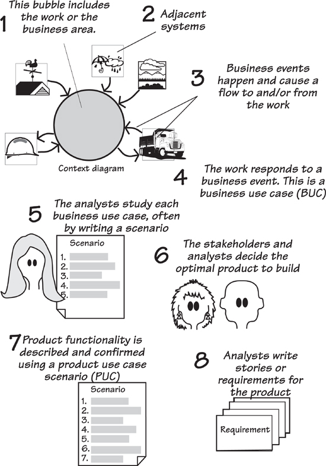

[4.1-P005] Figure 4.1. The scope of the business problem—the work—is agreed to by the blastoff participants. The scope defines both the work area to be studied and the adjacent systems that surround it. The adjacent systems supply data to the work and/or receive data from it. Business events happen in the adjacent systems—usually the event produces a demand for a service provided by the work. In addition, time-triggered business events occur when it is time for the work to provide some information to the adjacent system. The response the work makes to the business event is called a business use case; it includes all of the processes and data necessary to make the correct response. The requirements analysts study the functionality and data of the business use case with the help of the appropriate stakeholders. From this study, they determine the optimal product to build, and construct a product use case scenario to show how the actor and the product will interact. Once agreement is reached on this product use case scenario, the requirements analysts write the requirements or the user stories for the product.

[4.1-P006] If we have some systematic and observable way of partitioning the work, then we are far more likely to be consistent with the results we get. We turn to *business events* as our preferred way of partitioning. The responses to the business events—we call these *business use cases* (BUCs)—meet the following criteria:

- [4.1-P007] They are “natural” partitions—each one makes an obvious and logical contribution to the work.

- [4.1-P008] They have minimal connectivity to other parts of the work.

- [4.1-P009] They have a clearly defined scope.

- [4.1-P010] They have rules for defining their scope.

- [4.1-P011] They have boundaries that can be observed and defined.

- [4.1-P012] They can be named using names that are recognizable to stakeholders.

- [4.1-P013] Their existence can be readily determined.

- [4.1-P014] They have one or more stakeholders who are experts for that part of the work.

[4.1-P015] Before we examine business use cases, let’s look at how different projects need them.

## 4.2 Formality Guide

[4.2-P001] Rabbit projects should pay particular attention to this chapter. When running an iterative project, it is important to have a rock-solid grasp of the business problem to be solved. We strongly suggest that rabbits make use of business use cases to explore their problem domain before starting to formulate a solution. This approach does not add to the documentation load, and it lessens the time spent delivering inappropriate solutions.

[4.2-P002] 

[4.2-P003] Horse projects should consider partitioning the work area using business use cases as we describe them in this chapter. We have found that the BUC scenarios are a useful working tool for discussing the current and future work with your stakeholders. There is also the possibility of using BUC (and later product use case [PUC]) scenarios as the documentation to pass along to the developers, which allows you to avoid writing many of the detailed requirements. We shall discuss this aspect in later chapters.

[4.2-P004] 

[4.2-P005] Elephant projects should definitely use business events. Given that elephant projects have a large number of stakeholders, clear communication is both important and difficult. We have found that BUC scenarios are an ideal mechanism for discussing the work in geographically distributed teams. Later, the BUC scenarios and their PUC derivatives are maintained as part of the formal documentation. The BUC scenario is also useful for discussing high-level issues with outsourcers.

[4.2-P006] 

## 4.3 Use Cases and Their Scope

[4.3-P001] The term **use case** was coined by Ivar Jacobson back in 1987 as a way to describe an interaction between a system and a user of that system. Jacobson needed to break the system into smaller units, as he felt that object models were not scalable. Thus, to conquer the complexity and largeness of modern systems, he said it was first necessary to partition them into convenient chunks, and that these chunks should be based on the user’s view of the system.

[4.3-P002] However, Jacobson left us with some loose ends. For example, his definition of a use case does not indicate precisely where or how a use case starts and ends. In fact, Jacobson’s definition of a use case must have left some ambiguity; other authors have written about use cases and very few of them have the same idea of what it is. There are about 40 published definitions of “use case” with almost none of them agreeing. This chaos is unfortunate.

[4.3-P003] Reading

[4.3-P004] Jacobson, Ivar, et al. *Object-Oriented Software Engineering: A Use Case Driven Approach.* Addison-Wesley, 1992.

[4.3-P005] Jacobson also uses the term **actor** to mean a user role, or perhaps another system, that lies outside the scope of the system. The **system** in this usage is presumed to be the automated system under construction (we refer to this item as the **product**). This now leads to a question: How can anyone know what the automated system is to be before having an understanding of the work for which this system is to be used?

[4.3-P006] ***If the responsibilities of the actor and the system are established at the beginning of the analysis process, and the requirements gathering focuses ******on the automated system, how will you ever understand the work the actor is doing or the work the automated product could be doing for the actor?***

[4.3-P007] Think about this: If the responsibilities of the actor and the system are established at the *beginning* of the analysis process, and the requirements gathering focuses on the automated system, how could you ever understand the work the actor is doing, or the work the automated product might be doing for the actor? Failure to understand the actor’s true task—which surely happens if you exclude the actor from the analysis study—means that you run the risk of missing opportunities for automation, or automating where a non-automation would be a better solution. You also could be guilty of building products that are not as useful as they might be as well as run the risk of constructing interfaces that ultimately do not satisfy what the actor is really trying to do.

[4.3-P008] We can rush headlong into a solution, or we can find out what the problem is. The problem is simply the work that you are meant to improve, and the first step is to establish the scope or the extent of this work. If it is to be effective, this work scope must *include* the intended actors and all the work they are doing. Once you have established a satisfactory scope for the work, you partition it into smaller pieces; these pieces are the business use cases.

[4.3-P009] This chapter discusses the process of partitioning the work. Keep in mind as you are reading it that it probably takes longer to describe each of the steps than it does to actually complete most of them.

## 4.4 The Scope of the Work

[4.4-P001] The work is the business activity of the owner of the eventual product; alternatively, you can think of it as the part of the business that your customer or client wants to improve. To understand this work, it is best to think about how it relates to the world outside it. This perspective makes sense because the work exists to provide services to the outside world. To do so, the work must receive information and signals from the outside world, use these inputs as raw materials, and send information and signals back to the outside world—the customer for such things. This outside world is represented by *adjacent systems,* which comprise the automated systems, people, departments, organizations, and other parties that place some kind of demand on, or make some kind of contribution to, the work.

[4.4-P002] ***Your context diagram shows how your work relates to its business environment.***

[4.4-P003] To locate your work within the outside world, you demonstrate its context by showing how the work connects to the adjacent systems. In other words, your context diagram shows your work in its business environment.

[4.4-P004] **Figure 4.2** shows the context diagram for the work of predicting when roads are due to freeze and scheduling trucks to treat them with de-icing material (this diagram also appeared in **Chapter 3**). The work is surrounded by adjacent systems that either supply the data necessary for this work, or receive services and information from the work.

[4.4-P005] 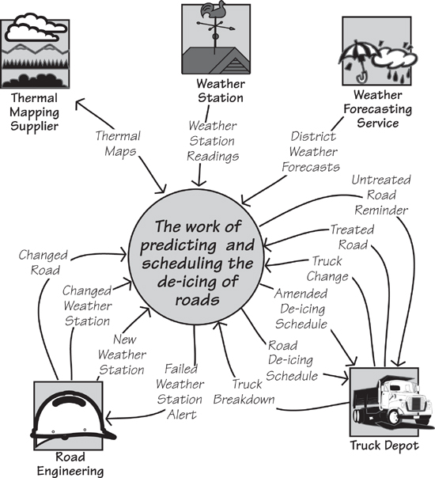

[4.4-P006] Figure 4.2. The context diagram showing the scope of the work. The central area of the diagram represents the work you are about to study, and the product you eventually build becomes part of this work. The outside world is represented by the adjacent systems—*Weather Station, Truck Depot,* and so on. The named arrows represent flows of information between the adjacent systems and the work.

[4.4-P007] ***The work to be studied must include anything that can be affected by your product.***

[4.4-P008] The work to be studied must include anything that can be affected by your product. If you are building a product intended to automate part of some existing work, then the scope of the study should include those parts of the existing work—human activities, together with any existing computer systems—that could potentially be changed by the eventual product. For embedded systems, there may be no human activity in your work, but the work scope must include any devices that can be changed or someway affected by the current development. Even if you are building an electro-mechanical device, such as an automated teller machine (ATM), and most of the human participation occurs outside the product boundary, your work context must still include the work that the human will be doing with the device.

[4.4-P009] ***The work scope includes anything that you are permitted to change, plus anything that you need to understand to decide what can or should be changed.***

[4.4-P010] While we are talking about the work context diagram, note the limited, but nevertheless crucial, aim of the model. This model shows only the flows of information. It does not attempt to show the constraints upon the work, although these limitations may be inferred from the model. Likewise, it does not explicitly show who or what is doing the work, although this information might also be inferred. As is true of most models, the context model is an abstraction that shows a single view. In this case, by highlighting the flows of information, we are able to make better use of the model for determining the business events affecting the work. But first, let’s look at one part of the context model in more detail: the outside world.

### 4.4.1 The Outside World

[4.4.1-P001] As we saw earlier, the adjacent systems are those parts of the world that connect to the work by delivering data to it or receiving data from it.

[4.4.1-P002] Adjacent systems behave like any other systems: They contain processes and consume and/or produce data. You are interested in them because they are often customers for the information or services provided by your work, or because they supply information needed by your work. You can see these relationships by looking at the data flows on the context diagram. It is through these informational connections that the adjacent systems influence the work.

[4.4.1-P003] ***Within reason, the farther away from the anticipated automated system you look, the more useful and innovative your product is likely to be.***

[4.4.1-P004] To find the adjacent systems, you sometimes have to venture outside your own organization. Go to the customers for your organization’s products or services. Go to the outside automated systems and organizations that supply information or services to your work. Go to the other departments that have connections to the work. Use the guideline that the farther away from the anticipated automated system you look, the more useful and innovative your product is likely to be.

[4.4.1-P005] ***Do not be limited by what you think might be the limits of a computer system. Instead, try to find the farthest practical extent of any influence on the work.***

[4.4.1-P006] You will usually find that your work is also closely connected to one or more computer systems, often within your own organization, or that you are making an enhancement to an existing computer system. In this case, the computer systems, or the parts that you are not changing, are adjacent systems. The interfaces between your work and the existing computer systems are critical. Although they may prove difficult to describe, you can never know the extent of your work, and eventually the extent of your product, if you do not define these interfaces clearly.

[4.4.1-P007] Think of it this way: The adjacent systems are the reason why the work exists; they are customers for the services produced by the work. The work produces these services either on demand or at prearranged times, and when it does so, the work is responding to a business event.

## 4.5 Business Events

[4.5-P001] Any piece of work responds to things that happen outside it—it’s that simple. For the sake of clarity, because we are discussing your owner’s work or business, we shall call these happenings *business events.*

[4.5-P002] Let’s look at an example of a business event. You are reading this book, so your authors sincerely hope you paid for it. Let us for the moment suppose that you bought it online. You had already found the book, looked at the sample pages, and decided that you wanted it. At that moment, one of two things could have happened: (1) You could have decided that you had something other to do and abandoned the transaction or (2) you could have decided to buy the book. That moment—that instant when you decided to buy the book—is the business event. Of course, just deciding that you want the book is not quite enough; you have to tell the work that you want it.

[4.5-P003] You signaled the work by indicating that you wanted to check out (or whatever mechanism your online bookseller has for such things) and provided a credit card and shipping address and so on. This incoming flow of data triggered a response in the bookseller’s work, which was to transfer ownership of the book to you, debit your credit card, and send a message to the fulfillment department to ship the book to you. If you bought the book as an e-book, that last step would be replaced by one that started the download.

[4.5-P004] 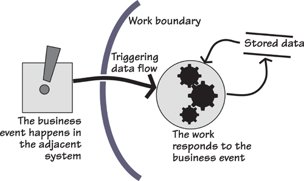

[4.5-P005] Figure 4.3. Business events and their responses: A business event happens at the moment the adjacent system decides to do something, or as part of its work some processing condition occurs. The adjacent system tells the work that the event has happened by sending a triggering data flow. When this stream of data arrives, the work responds by processing the incoming data, and by retrieving and recording stored data.

[4.5-P006] Another example: You pay your credit card bill at the end of the month—that is a business event as seen from the point of view of the credit card company. The credit card company responds to this event by checking that your address has not changed and then recording the date and amount of your payment.

[4.5-P007] In these examples, the moment you decide to buy the book and the moment you decide to pay your monthly bill are the business events. There is always some data resulting from the business event (the triggering data flow), which invokes a preplanned response to the event. This response is the business use case.

[4.5-P008] You as a customer do not own or control either the bookshop or the credit card company. Nevertheless, in both examples you did something to make them respond—they did some processing and manipulated some data. Think of it this way: Those pieces of work have a preplanned business use case that is activated whenever an outside body (the adjacent system) initiates a business event. **Figure 4.4** illustrates this idea.

[4.5-P009] 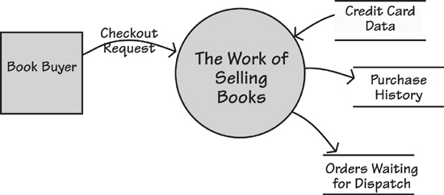

[4.5-P010] Figure 4.4. A business event takes place outside the scope of the work, and the work learns that it has happened through the arrival of an incoming flow of information. The work contains a business use case that responds to this business event.

[4.5-P011] ***When a business event happens, the work responds by initiating a business use case.***

[4.5-P012] Note that business use cases are triggered by the arrival of a data flow from the adjacent system. In the preceding examples, these data flows were your request to buy the book and your payment slip and check arriving at the credit card company. As a consequence, the responsibility for triggering the business use case lies outside the control of the work. We will return to this point shortly. First, however, let’s look at another kind of business event.

### 4.5.1 Time-Triggered Business Events

[4.5.1-P001] Time-triggered business events are initiated by the arrival of a predetermined time (or date). For example, your insurance company sends you a renewal notice a month before the anniversary of your policy; your bank sends you a statement on an agreed day of every month. “The arrival of a predetermined time” may also mean that a certain amount of time has elapsed since another event happened. For example, a computer operating system may check the available memory 2.4 microseconds after the last time it checked, or you may be sent a reminder that you borrowed a library book six weeks ago.

[4.5.1-P002] The usual response to a time-triggered business event is to retrieve previously stored data, process it, and send the resultant information to an adjacent system. Consider the example depicted in **Figure 4.5**.

[4.5.1-P003] 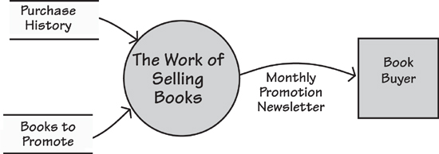

[4.5.1-P004] Figure 4.5. A time-triggered business event happens when a prearranged time is reached. This is based on either a periodic occurrence (for example, the end of the month, or a certain time each day), a fixed time interval (for example, three hours since the last occurrence), or a certain amount of time elapsing since another business event (for example, 30 days after sending out an invoice). The normal response is to retrieve stored data, process it, and send some information to an adjacent system.

[4.5.1-P005] Once the predetermined time for the event arrives, the work’s response is to do whatever is necessary to produce the output. This almost always involves the retrieval and manipulation of stored data. Once again, we use the response to the time-triggered business event—the business use case—as our unit of study.

## 4.6 Why Business Events and Business Use Cases Are a Good Idea

[4.6-P001] We may seem to be going to a lot of trouble to describe something that may, at first glance, seem fairly obvious. But this care with the subject is warranted: Our experience has amply demonstrated the value of having an objective way of partitioning the work, and the value of understanding the work itself, before plunging into the solution. The result is that you discover the real requirements, and you discover them more quickly.

[4.6-P002] Your partitioning of the work will be more objective if you identify the responses to outside stimuli; after all, that is the way your customers see your business. The business’s internal partitions—department and processors, whatever they may be—hold no interest for outsiders. Similarly, it is likely that the current partitioning of any system is based on technological and political decisions made at the time the system was built. Those decisions may no longer be valid—at the very least, you should question them and avoid perpetuating them just because they are there at the moment. By looking not at the inside, but from the outside, you get a clearer idea of the most functional way of partitioning the work.

[4.6-P003] ***By looking not at the inside, but from the outside, you get a much clearer idea of the most functional way of partitioning the work.***

[4.6-P004] The work’s response to a business event brings together all the things that belong together. As a result, you get cohesive partitions with minimal interfaces between the pieces. This partitioning gives you more logical chunks of work for your detailed requirements investigation—the fewer dependencies that exist between the pieces, the more the analysts can investigate the details about one piece without needing to know everything about all the other pieces.

[4.6-P005] ***The work’s response to a business event brings together all the things that belong together.***

[4.6-P006] There is one more reason for using business use cases, and that is to prompt an investigation of what is happening at the time of the business event.

### 4.6.1 The “System” Cannot Be Assumed

[4.6.1-P001] In many of the texts available today, the existence of a “system” is assumed. That is, the author guesses what he thinks the boundary of the automated system should be, and begins the use case investigation by looking at the actor and the interaction with the automated system, and completely ignores the work surrounding this interaction. *To do so is dangerous and wrong.*

[4.6.1-P002] This product-centric way of looking at the problem means that you are ignoring the most important aspect of the automated system: the work that it is meant to improve. By starting with the automated system, projects take a massive gamble that they have, in fact, hit on the right solution, and that they have been able to do so without any study of the problem. Although we seem able to resist the blandishments of the salesman who claims that his particular insurance package will serve all our needs, we have an unhappy tendency to leap at the first automated solution that comes to mind. Looking inward at the solution discourages analysts from asking, “But why is this like it is?” This failure, in turn, leads to “technological fossils” being carried from one generation of a product to the next.

[4.6.1-P003] Consider this example: “An insurance clerk receives a claim from a car insurance policy holder and then enters the claim into the automated system.” This view encourages the requirements analyst to study the work of the clerk entering the details of the claim into the system. However, if you spend a few moments looking at the real business being done here, you will see that the claim is simply the insurance company’s implementation—it is the *accident* that initiates this piece of business. Why is this point important? If you start your business investigation at the real origin of the problem—in other words, you look at what is happening at the time of the business event—you will build a better product. Perhaps it would be feasible to create a product that processes the claim in real time at the scene of the accident. A possible solution for that problem would be a smart phone app that knew where you were, and could take photos of the result of the accident along with the relevant license plates and driver details, and transmit them to the insurance company before the tow-trucks arrive.

[4.6.1-P004] Think of the *real* originator of the business event—in this case, it is the driver or owner of the vehicle (not the insurance clerk). What are the driver’s aspirations here? He wants to have the vehicle repaired as quickly and effortlessly as possible; his goal is *not* to fill in claim forms and wait for them to be approved.

[4.6.1-P005] ***The requirements analyst must look past the obvious, and the current way of doing business, and instead understand the true nature of the work.***

[4.6.1-P006] Another example: “A caller contacts the help desk. The help desk person initiates the use case by asking the caller for details of the problem and logging the call.” The use case is the logging, and the actor is the help desk person. Again, this product-centric view misses the real business event—the event that started it all. In this case, it is the initiation of the call to the help desk.

[4.6.1-P007] Why is it important to find the real origin for the event? If you think of initiating the call as the business event, the correct response is to log the call, use caller ID to identify the caller’s equipment, retrieve information on the equipment, and provide it for the help desk person.

[4.6.1-P008] Stepping back a little further and seeing the end-to-end business (see **Figure 4.6**), you would probably decide that the real business event is the malfunctioning of the caller’s equipment. When you adopt this perspective, you also think of the equipment making the call for help itself. Perhaps a better understanding of the reasons underlying the malfunction might result in your new product giving the help desk operator historical information that will facilitate him in responding correctly to the call.

[4.6.1-P009] 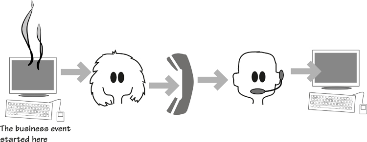

[4.6.1-P010] Figure 4.6. Consider the real end-to-end process. The aim of the diligent requirements discoverer is to look at all the activities and include them in the study. This way, the real business is revealed.

[4.6.1-P011] Stakeholders often don’t ask for these requirements because they are thinking only of an assumed product. It is the task of the accomplished business analyst to look beyond that endpoint, which means understanding the intentions of the adjacent system at the moment it initiates the business event.

### 4.6.2 Step Back

[4.6.2-P001] A security system this time: “The actor receives the shipment and logs it in.” Nope. The real business event is the *dispatch* of the shipment; the business use case should log the shipment as it leaves the shipper and monitor its transit and arrival. We need to step back and see the whole business as in **Figure 4.7**.

[4.6.2-P002] 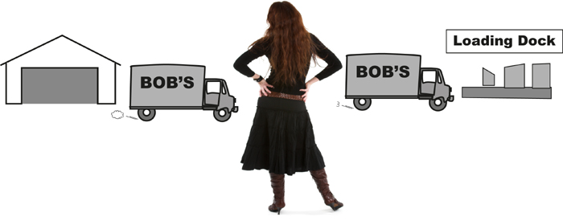

[4.6.2-P003] Figure 4.7. Step back and see the end-to-end process, and at the same time, see the real business.

[4.6.2-P004] By stepping back and seeing the whole of the business process, the business analyst has the best chance of identifying the real work. Conversely, by looking only at the automated system, the analyst is often led down the path of incremental improvements that stakeholders ask for. If you can see the whole spectrum of the business use case from its real inception to its conclusion, you are in a much better position to derive a more appropriate and useful automated product.

## 4.7 Finding the Business Events

[4.7-P001] Business events are things that happen and, in turn, make the work respond in some way. An event may happen outside the scope of the work (an external event), or it may happen because it is time for the work to do something (a time-triggered event). In the case of an external event, a communication to the work from the outside—represented by the adjacent systems—lets the work know that the event has happened. In the other case, the time-triggered event, the outcome is always a flow to the outside world. In either situation, whenever a business event occurs, there must be at least one data flow to show it on the context diagram.

[4.7-P002] **Figure 4.8** provides the context diagram for the de-icing project. The same diagram appeared earlier in this chapter—for convenience, we repeat it here. Take a look at it and note the information flows that connect the adjacent systems to the work. For example, the flow called *Changed Road* is the result of the event that occurs when the Road Engineering department either builds a new road or makes significant alterations to an existing one. The engineering personnel advise the work of the change so that the scheduling work can update its own stored data about roads. The flow called *Road De-icing Schedule* is the outcome of a time-triggered business event: Every two hours, the work produces a schedule of the roads to be treated and sends it to the *Truck Depot*.

[4.7-P003] 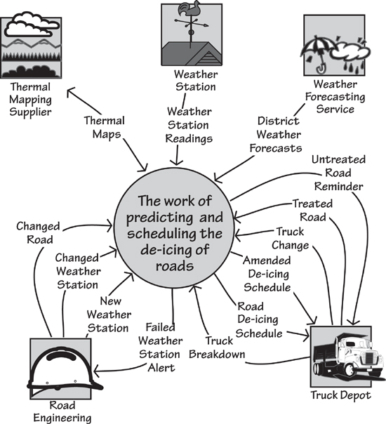

[4.7-P004] Figure 4.8. The context model for the IceBreaker work. Note the flows of data entering and leaving the work. The analyst uses these data flows to determine the business events.

[4.7-P005] Each of the flows that enters or leaves the work is the result of a business event; there can be no other reason for an external communication to exist. Looking at each flow, you can determine the business event that caused it. In some cases, several flows may be attached to the same business event. For example, when the *Truck Depot* advises that a scheduled truck has broken down or will be withdrawn from service for some other reason (the input flow is *Truck Breakdown*), the work responds. Because one of the trucks is now out of service, the other trucks have to be rescheduled to compensate for the shortfall, and the resultant outgoing flow is the *Amended De-icing Schedule*.

[4.7-P006] ***Each of the flows that enters or leaves the work is the result of a business event.***

[4.7-P007] **Table 4.1** shows a list of business events and their input and output flows for the de-icing work. Compare it with the work context diagram in **Figure 4.8**, and reconcile the business events with the data that flows to and/or from the work.

[4.7-P008] Table 4.1. List of Business Events and Their Associated Input and Output Flows for the Road De-icing Work

[4.7-P009] 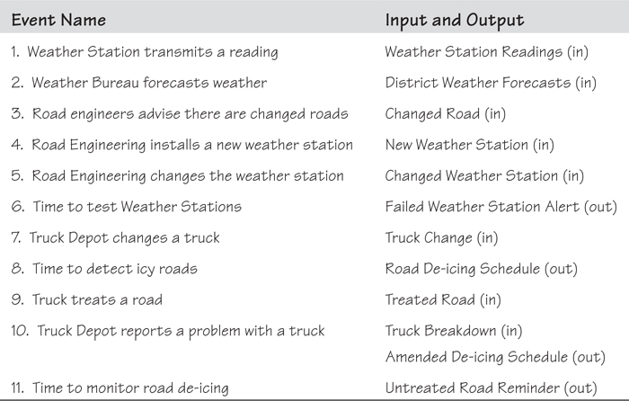

[4.7-P010] Admittedly, you need some knowledge of the work to figure out the business events. To this end we advise you to start the process of determining business events during blastoff, when the key stakeholders are present. In most situations, you will find the stakeholders know the business events (they may not know them by that name, but they will know what they are). If you do not identify all of the business events during the blastoff, you will see them when you begin to study the work.

## 4.8 Business Use Cases

[4.8-P001] Business events are useful to partition the work, but it is the work’s *response* to the event that now captures the interest of the requirements analyst.

[4.8-P002] ***The business use case is the most convenient unit of work to study.***

[4.8-P003] For every business event, there is a preplanned response to it, known as a *business use case* (BUC). The business use case is always a collection of identifiable processes, data that is retrieved and/or stored, output generated, messages sent, or some combination of these. Alternatively, we could simply say that the business use case is a unit of functionality. This unit is the basis for writing the functional and non-functional requirements (we will talk about these requirements in more detail in **Chapters 10** and **11**).

[4.8-P004] ***You can identify one or more stakeholders who are expert in each event.***

[4.8-P005] You can readily isolate the work of a business use case, because it has no processing connections to other BUCs; the only overlap between BUCs is their stored data. As a consequence, different analysts can investigate different parts of the work without the need for constant communication between them. This relative isolation of each business use case makes it easier to identify the stakeholders who are expert in that part of the work, and they can (with your help) describe it precisely and in detail. You can also *observe* the business use case: Business events are known to the stakeholders, and they can show you how the organization responds to any of them. For example, it would not be hard to find someone in your favorite bookshop who can take you through the process of selling a book, or someone in your insurance company who can show you how the company processes a claim. We discuss trawling techniques for this kind of investigation in **Chapters 5**, **6**, and **7**.

[4.8-P006] The processing for a business use case is continuous—it happens in a discrete time frame. Once it is triggered, it processes everything until there is nothing left to do that can logically be done at that time. All the functionality has been carried out, all the data to be stored by the business use case has been written to the data stores, and all the adjacent systems have been notified. You can see an example of this processing in **Figures 4.9** and **4.10**.

[4.8-P007] 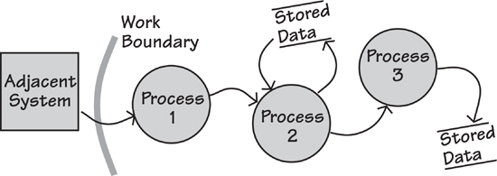

[4.8-P008] Figure 4.9. The work’s response to the business event is to continue processing until all active tasks (the processes) have been completed and all data retrieved or stored. You can think of the response as a chain of processes and their associated stored data. Note that the processes are surrounded by a combination of data stores and adjacent systems.

[4.8-P009] 

[4.8-P010] Figure 4.10. This model uses BPML notation to show the same processing as in **Figure 4.9**, which uses data flow notation. You are urged to use whichever notation you prefer.

[4.8-P011] The product you intend to build contributes to the work being done by the business use case. Sometimes the product will do all the work of the BUC, but usually it will do some part of it. Your product does not change the real nature of the work; it just changes the way it is done. Nevertheless, before you can design the product that makes the optimal contribution to the work, you must understand the work. Most importantly, you must understand your client’s desired outcome from the work. So for the moment, forget the details and technology of the business use case, and instead look outside the organization to see what kind of response is needed, or wanted, by the organization’s customers and suppliers.

## 4.9 Business Use Cases and Product Use Cases

[4.9-P001] We have stressed the importance of understanding the work, not just the product. By looking at the larger scope of the work, you ask more questions about the business requirements and ultimately build a better product. The following example comes from a recent consulting assignment: The product is to rip a CD into MP3 or some other digital format. When the engineers looked at the technical part of the product (they are engineers, so naturally they are interested in technicalities), they saw a use case that was triggered by the insertion of the CD and then went on to rip the CD. Getting the best musical quality (the engineers were mainly concerned with achieving the desired bit rate for the transfer) seemed to be the most important thing.

[4.9-P002] We could have considered that to be the final product use case and written requirements for it. But look what happens when you step back and look at the wider context of the real business being done here (the business use case): You see something more.

[4.9-P003] ***What is the end user trying to accomplish? What are his aspirations and desired outcomes?***

[4.9-P004] What is the end user trying to accomplish? What are his aspirations and desired outcomes? We define them as “getting the music from the CD into an MP3 player.” Thus the real question is not about the technicalities of the assumed product, which is ripping CDs and converting them to MP3 format, but rather about the remainder of the true business.

[4.9-P005] Part of that business indicates that the end user wants the track names to appear on his MP3 player. Thus adding track names must be part of the BUC, as must adding images of the album cover and artist. The business use case should also allow for the order of tracks to be changed, unwanted tracks to be deleted, and any other organizational changes to the music to be carried out.

[4.9-P006] By stepping back and looking at the work being done, we were able to find a much better product to build.

[4.9-P007] So what do you have? At the outset, you have the scope of the work being studied, and the scope is bounded by the communications with the adjacent systems surrounding the work. Business events happen in the adjacent systems when they decide they want some information or service from the work, or they want to send some information to the work. Once the business event has happened and the resulting data flow has reached the work, the work responds. This response constitutes the business use case.

[4.9-P008] Study the business use case, considering what the work does and what the adjacent system desires or needs. In other words, consider whether the organization is making the correct response to the adjacent system. Once you understand the correct work of the business use case, determine the scope of the product that best contributes to that business use case. As part of this effort, consider whether the adjacent system is capable (or desirous) of making a different contribution to the work than it currently does.

[4.9-P009] Don’t assume the responsibilities of the product and the adjacent systems at the beginning of the project. Instead, derive them from an understanding of the work and from what the external customer considers to be a useful product.

[4.9-P010] When that is understood, decide how much of the BUC is to be done by the product use case. Specifically, the part of the BUC handled by the automated system is the *product use case* (PUC). Sometimes the functionality of the PUC ends up being the same as that of the BUC (you have decided to automate everything), but often some part of the functionality does not become part of the PUC; you decide that this task is best done by humans.

[4.9-P011] So here’s the thing: the PUC is *derived.* It is not assumed at the beginning of the requirements investigation, but rather carefully arrived at by examining the work. By deriving the PUC from the BUC, you find a more useful product, one that gives better value to its owner. And that surely is the point of your project.

[4.9-P012] The relationship between PUCs and BUCs is shown in **Figure 4.11**.

[4.9-P013] 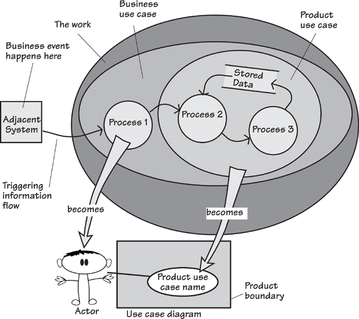

[4.9-P014] Figure 4.11. The business event is some happening in the adjacent system. The resulting information flow notifies the *work* of the event and triggers a response (the *business use case*). After study, the requirements analysts and the interested stakeholders decide how much of the business use case is to be handled by the proposed product (the *product use case*). Whatever is immediately outside the scope of the product becomes the *actor*, who manipulates the functionality of the product use case within the product. A UML use case diagram is shown for comparison.

[4.9-P015] Sometimes, for technical reasons, you might choose to implement a business use case with a number of PUCs. Perhaps you wish to subdivide the work inside the computer into smaller pieces, or perhaps you have the opportunity to reuse product use cases that have previously been developed for other parts of the product or for other products, or maybe different types of stakeholders are concerned with only part of the business use case.

[4.9-P016] The selection of product use cases is somewhat driven by technical considerations. However, if the product is to be recognizable and usable by its intended users, then its PUCs must be based on the original business events and must be traceable back to the business use case.

### 4.9.1 Actors

[4.9.1-P001] When you determine the product use cases, you are also selecting the *actors* who interact with the product.

[4.9.1-P002] Actors are the people or systems that interact with the automated product. In some cases, they are adjacent systems that are outside the work—for example, the organization’s customers. In other cases, you appoint actors from inside the organization. **Figure 4.12** shows the product use cases that were selected for the IceBreaker product as well as the actors that operate each of the product use cases.

[4.9.1-P003] 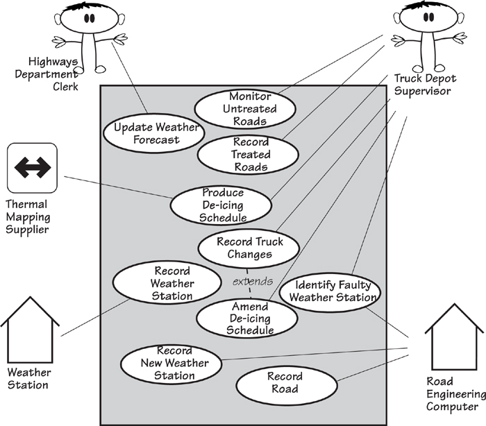

[4.9.1-P004] Figure 4.12. The product use case diagram for the IceBreaker product, showing the product use cases, the actors involved in each product use case, and the product’s boundary. The different notation used for the actors indicates the way they interact with the product. (These distinctions are explained in **Chapter 8**, where we look at starting the product.)

## 4.10 Summary

[4.10-P001] Business events and business use cases allow you to carve out a cohesive piece of the work for further modeling and study. By understanding the work being done by each of the BUCs, you come to understand the optimal product you can build to support that work.

[4.10-P002] If you are outsourcing, you might not determine the product use cases, but work instead on the business use cases. These business use cases can then serve as your negotiating document when you ask your outsourcer which parts of them he can deliver as product use cases.

[4.10-P003] By using business events to partition the work, you take an external view of the work. You are not relying on how it happens to be partitioned internally at the moment, or on someone’s idea of how it might be partitioned in the future. Instead, you partition the work according to the most important view of the work: how the outside world (often your customers) sees it. **Figure 4.13** is an overview of this kind of partitioning.

[4.10-P004] 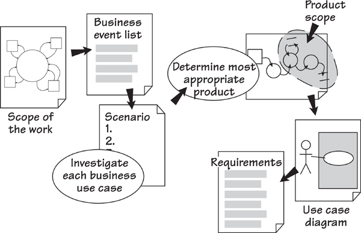

[4.10-P005] Figure 4.13. The flow of requirements discovery: The response to each business event—the business use case—is examined and an appropriate product determined. The analysts write the requirements for each product use case.

[4.10-P006] The idea of deriving the product use cases from the business use case means your requirements are grouped according to how the work responds to the business event. The result is a natural partitioning of the work, which results eventually in a product that is more responsive to the real demands of the outside world, and thereby optimally valuable to its owner.
