# 5. Investigating the Work

[5-P001] *in which we come to an understanding of what the business is doing, and start to think about what it might like to do*

[5-P002] The owner’s work, for better or for worse, is the starting point of the requirements for any new product you build. Your product is intended to improve the existing work or enable some new capabilities for it. The work might be a small, simple task done by an individual, or it might involve many people and software systems and hardware systems, and make up a significant and critical part of the organization.

[5-P003] Whatever the work, it seems sensible to have a fair understanding of it before attempting any changes. If you charge in and make “improvements” with little or no understanding of what you are changing, then you should hardly be surprised if things do not turn out as they should. In contrast, a little time invested in learning the work will significantly enhance your chances of successfully making a beneficial impact on it. And while you are coming to an understanding of the existing work, you are certain to generate ideas on how to make it better.

[5-P004] In this chapter we discuss how to investigate a piece of work prior to changing it. Normally your change would mean building a software product or some other device to do some or all of the work. This seems a reasonable approach given that when you build a piece of software, you are, in essence, automating a task that if you had enough time, you could do using human labor.

## 5.1 Trawling the Business

[5.1-P001] We use the term *trawling* to describe the activity of investigating the business. This term evokes the nature of what we are doing here: fishing. Not idly dangling a line while hoping a fish might come by, but rather methodically running a net through the business to catch every possible requirement (see **Figure 5.1**). With a little experience and good techniques, the skipper of a trawler knows where to fish so that he gets the fish he wants, and avoids the ones that he doesn’t. The objective in this chapter is to show you some trawling techniques, and give you guidelines on how to get the best from them.

[5.1-P002] 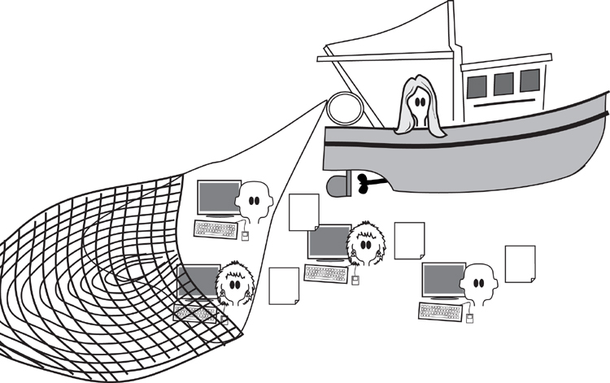

[5.1-P003] Figure 5.1. The business analyst trawls for knowledge by investigating the client’s work. The analogy of running a net through the organization is appropriate: You need to sift through much of the business before you can find the best way to improve it.

[5.1-P004] While it is important to uncover the current business, including both its data and its processes, it is also important that you do not spend too much time doing so. Keep in mind that this is the beginning of the analysis process, and you would like to get through this step as rapidly as possible. Also keep in mind that the business you are studying is about to be changed. Given these caveats, we suggest that you study the current business as quickly as possible—you can always come back later to get additional information should it be necessary.

[5.1-P005] ***While it is important to uncover the current business, including both its data and its processes, it is also important that you do not spend too much time doing so.***

[5.1-P006] This chapter explores the techniques for discovering the business processes, and the people involved in those processes. Inevitably, you will need a variety of techniques to achieve this feat, and you will find that not all techniques are equally acceptable to your stakeholders. For this reason, it will be necessary to vary your approach to best suit the stakeholders who are providing the requirements.

[5.1-P007] When you are reading about the trawling techniques, you will see our suggestions on when and how they are used. Use these suggestions to determine for yourself what is most appropriate for your stakeholders, your preferred way of working, and your project. We have included an owl to provide guidance on whether the technique is applicable to your situation.

## 5.2 Formality Guide

[5.2-P001] The study of the current business is not intended to be a lengthy process. You are encouraged to do it as quickly as possible, and to stop doing it once you have enough information about the current state of the business to enable you and your stakeholders to move on to the next stage. Also keep in mind that requirements are not solutions; you have to learn the requirement before you can find the solution. It just doesn’t work the other way round.

[5.2-P002] Rabbit projects need to understand the work as it currently is, as well as what the work is to be. Because rabbit projects are usually iterative, you are likely to visit the current work in small slices and then proceed to find its essence and ultimately its solution. This cycle is repeated until the product is complete. This iterative way of working should minimize any documentation of the current work. However, that does not obviate the need to *understand* the work.

[5.2-P003] 

[5.2-P004] Some of you will be working on an agile team with a product owner or customer representative. We have found (unfortunately) that a single person is unlikely to have a good enough understanding of the wider business to be able to provide all of the needed information. We suggest you adopt some of the trawling techniques to enhance your iterative team’s understanding of the work, and as a result enhance the product you are building.

[5.2-P005] Horse projects, due to their larger number of stakeholders, probably make more extensive use of apprenticing, interviewing, and use case workshops. These techniques generate some documentation, and while documenting the current work is by no means the objective of the project, it is extremely useful as input to subsequent decisions.

[5.2-P006] 

[5.2-P007] Horse projects are more likely to be dealing with critical infrastructure systems, so knowledge of the work and its goals is important to the project.

[5.2-P008] Elephant projects, due to their larger number of stakeholders, need to document their findings as they go about trawling for their requirements. Because of the more extensive set of possibilities for elephant projects, we suggest that you read this entire chapter, paying special attention to the “owl recommendations.”

[5.2-P009] 

[5.2-P010] Projects using outsourcing are always elephants—they need a formal specification. Additionally, the artifacts produced by investigating the work should be retained for future maintenance.

## 5.3 Trawl for Knowledge

[5.3-P001] We build products to help us do work. For our purposes, it doesn’t matter whether the work is processing insurance claims, analyzing blood samples, designing automotive parts, predicting when ice will form on roads, keeping track of a “things to do” list, controlling a telephone network, downloading music or movies, monitoring a household, manipulating photographs, or one of many other human activities. In all instances, the product that you are being asked to build must improve this work.

[5.3-P002] **Figure 5.2** shows the Volere process and highlights the part where you investigate the work with a view toward discovering the best product to enable or improve that work.

[5.3-P003] 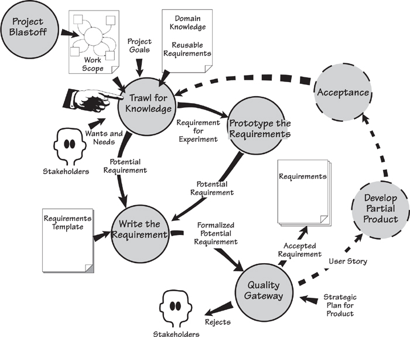

[5.3-P004] Figure 5.2. The trawling activity is central to the requirements process. It uses the outputs of the project blastoff activity as its starting point for investigating the work and accumulating knowledge about it. Over the next few chapters, we will develop this knowledge into requirements for the product to be built. The dotted lines on the diagram indicate how trawling works when you are using iterative development.

[5.3-P005] When you are trawling for knowledge, the first task is to investigate and understand the work as it is currently being done. It is not always necessarily to document this information, but you must certainly understand it. Once you have a fair understanding of the current work, then you can derive its essence. That is, you can strip away the current technology to get a clean picture of the real business.

[5.3-P006] The essential view is then developed in conjunction with the stakeholders to arrive at the requirements for the new product. This is not a laborious process—just a thorough one. We will look at it over the next few chapters.

[5.3-P007] The trawling activity uses outputs from the project blastoff—the scope of the work, the goals of the project, and the constraints that apply to any solution. The blastoff also identified the stakeholders involved in the project and the potential users. These stakeholders are the people with whom you consult to get an understanding of the work.

## 5.4 The Business Analyst

[5.4-P001] The business analyst is also known as a systems analyst, a requirements engineer, and probably several other titles. We use “business analyst” because it is the most commonly used name. Whatever name you use, this person is an investigator and a translator: He has to inspect the work, interview the business stakeholders, understand what they are saying, and then translate that knowledge into a form that can be communicated to and understood by the developers. Initially, the business analyst’s task is to record, clarify, and question the current state of the business. Later, as the analysis progresses, the emphasis changes from recording an existing system to thinking about a new one. For the moment, the task of the business analyst is this:

- [5.4-P002] *Observe and learn the work, and understand it from the point of view of the owner.* As you work with your users, you study their work and question them about what they are doing, and why they are doing it.

- [5.4-P003] *Interpret the work.* A user’s description of some work is not always factual despite the user being the expert on that part of the work. The analyst must filter the description to strip away the current technology, thereby revealing the underlying essence of the work, not its incarnation.

- [5.4-P004] *Record the results in the form of stakeholder-understandable analysis models.* The analyst must ensure that he and the stakeholders have the same, and agreed, understanding of the work. We suggest using models as a common language for communicating your knowledge to the stakeholders.

[5.4-P005] 

[5.4-P006] ***There is a lot to know about trawling—and we know that not all trawling techniques are applicable to all projects. The owl gives you guidance on whether the technique is applicable to your situation. By all means, read this entire chapter—but realize that you don’t need to use all of the trawling techniques on every project.***

[5.4-P007] Many techniques are available to help with the task of studying the business. We provide you with several choices here because we know that no single technique works in every situation. Instead, you have to select the technique that works best for you at the time. In our discussions of the techniques, we indicate when and why one would be useful. But don’t just take our word for it—try to connect each technique to your own situation, and consider where and when each would be most advantageous.

[5.4-P008] Consider your stakeholders. They are *conscious* of some of their processes and requirements and bring them up early. At the same time, they are *unconscious* of others—things that are so ingrained into the stakeholders’ work that they have forgotten they exist, or forgotten how they are done. The techniques that capture the conscious processes may not necessarily work for the unconscious ones. Then there are the *undreamed-of* processes—those functions and features that the stakeholders are not aware they could have. Undreamed-of needs exist because the stakeholders do not realize they are possible, perhaps because the stakeholders lack sufficient technological sophistication, or perhaps because they have never seen their work in the way that you will show it to them.

[5.4-P009] Whatever the situation, your responsibility is to bring the conscious, unconscious, and undreamed-of work to the surface.

## 5.5 Trawling and Business Use Cases

[5.5-P001] 

[5.5-P002] ***Business use case are so fundamental to the requirements activity that we urge you, whatever your situation or project type, to consider doing your requirements trawling one business use case at a time. If you have not already read *****Chapter 4*****, Business Use Cases, we encourage you to do so now.***

[5.5-P003] From the work context diagram, you determine the business events and the resulting business use cases. In **Chapter 4**, we discussed business events, exploring how happenings outside the work cause a response inside the work. This response is a *business use case,* and we suggest that you do your work by studying one business use case at a time.

[5.5-P004] The business use case is the functionality that the work does in response to a business event. When the triggering data flow enters the work, the work starts to process it. If the triggering data flow arrives via a telephone call, then a person might be there to answer it. Alternatively, an automated telephone system might prompt the caller to identify the nature of the call. In the end, it doesn’t matter *how* it is done; the important thing is *what* is done. This functionality is what you study when trawling, as is illustrated in **Figure 5.3**.

[5.5-P005] 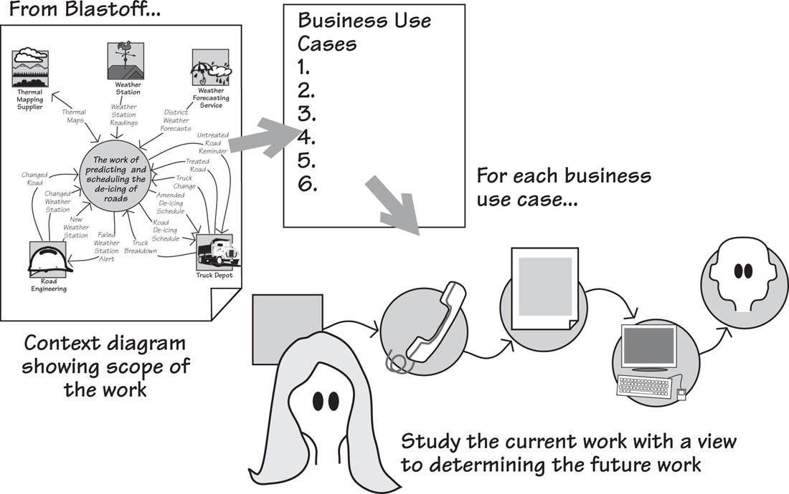

[5.5-P006] Figure 5.3. Business events are determined using the triggering data flows from the adjacent systems on the context diagram. The business use cases are the work’s responses to the business events, and these are studied until the analyst understands the way the work functions.

## 5.6 The Brown Cow Model

[5.6-P001] When you are investigating the work area, there are a number of ways in which you can look at it—*viewpoints*—and there are four really useful ones. We shall demonstrate them using a brown cow.

[5.6-P002] The Brown Cow Model,**1** shown in **Figure 5.4**, takes four views of the work; the two axes separate *What* from *How,* and the *Now* from the *Future.*

[5.6-P003] 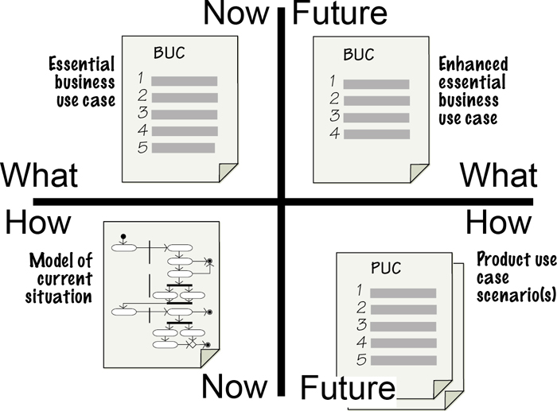

[5.6-P004] Figure 5.4. The Brown Cow Model. This shows four views of the work, each of which provides the business analyst and the stakeholders with information that is useful at different stages of the requirements discovery process.

[5.6-P005] Let’s start in the lower-left quadrant of the model: How-Now. This is sometimes—but not always—the place to start. How-Now shows the implementation of the work as it currently exists, including the physical artifacts, people, and processors used to do the work. You use this view when you need to get enough of a grounding to begin to ask other questions.

[5.6-P006] When you set out to build some new product, you are not trying to simply duplicate whatever you have at the moment; no gain is realized in doing that. Instead, by eliminating the technological fossils and obsolete organizational procedures from the current situation, you begin to see the pure, unadulterated business problem.

[5.6-P007] This brings us above the line to What-Now. This abstract view shows the real business policy, or as we prefer to call it, the *essence* of the work. This view is completely technologically neutral, and it shows the business as if no machines, people, or organizational departments existed. We use this view to cleanse our ideas on what the current business is actually doing without inhibiting it by referring to processors and physical artifacts that might not be part of a future implementation.

[5.6-P008] Moving to the upper-right quadrant, we get to the Future-What view. This view shows the business as your owner wants to have it, but still without the technology that might be used to implement that business. It is the purest version of the proposed future state of the business area. The value of this viewpoint is that it shows—so you can discuss with your stakeholders—precisely what the owner would like to do, without worrying about how the technology might do it.

[5.6-P009] The last quadrant, the lower right, is Future-How. Here you take your idealized view of the future business policy, and augment it with the technology and people needed to bring it into the real world.

[5.6-P010] It is generally not sufficient to simply have two views of the business—the “as is” and the “to be.” These views never get away from the implementation, never see the pure business problem in its true light, and as such are unsuitable for any kind of serious innovation or system development.

## 5.7 The Current Way of Doing Things (How-Now)

[5.7-P001] 

[5.7-P002] ***Building models as a way of investigating the work is best done when you need to understand a medium-to-large work area for which no documentation exists. This technique is also used when the current users struggle to give you an idea of how the work fits together. It is also useful when you know that there will be a significant legacy from the existing work.***

[5.7-P003] We have mentioned several times—and probably will do so again several times more—the need to understand the work. This is best done by being actively involved in investigating the work rather than by being a passive onlooker.

[5.7-P004] Despite any bad reputation the current work may have, it is still useful: It contains functionality that is making a positive contribution to the business. Naturally, much of this functionality must be included in any future system. You may implement it differently with new technology, but its underlying business policy will remain almost unchanged. Thus one reason to build a model of the current work is to identify which parts you need to keep.

[5.7-P005] You can use models to help you understand the work but, paradoxically, you cannot build a model without understanding the work. This paradox follows from the way the modeling activity leads you to ask all the right questions. Any useful model is a *working* model—it is functionally correct in that you can demonstrate the model’s outputs are derivable from its inputs. As a consequence, if your model isn’t working, it means you simply haven’t asked enough questions to get enough right answers (see **Figure 5.5**). Alternatively, we could say that as the model develops, it becomes increasingly more obvious what you don’t know, how much you don’t know, and what the business people don’t know.

[5.7-P006] 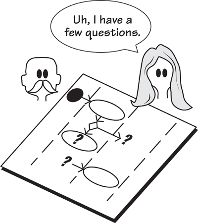

[5.7-P007] Figure 5.5. Knowing where to ask questions, and which questions to ask, is almost as useful as knowing the answers. If your model has flows going nowhere, processes without inputs, read-only or write-only data stores, or other breaches of the modeling conventions, then you need to ask your stakeholders more questions about those aspects of the work.

[5.7-P008] Your models record the work and demonstrate your understanding of it. Because the model is a common language between you and your stakeholders, you can come to have the identical understanding of the situation.

[5.7-P009] When you model the current work, keep in mind that you are not attempting to specify a new product, but rather merely establishing the work that the users currently do. Most likely the users will describe their work in a way that includes the mechanisms and technology they use to get the work done. These mechanisms are not requirements for the new system—you must look beyond them to see the underlying policy of the users’ system. That understanding emerges when you move “above the line” and work with the two segments of the Brown Cow Model above the horizontal axis that deal with *what,* rather than *how.* We shall get to this step in a little while.

[5.7-P010] Reading

[5.7-P011] Robertson, James, and Suzanne Robertson. *Complete Systems Analysis: The Workbook, the Textbook, the Answers.* Dorset House, 1998. This book demonstrates how to build models of current, future, and imaginary work.

[5.7-P012] Modeling the current system should be done as quickly as possible. **Figure 5.6** shows a model of an existing system, built by the authors in conjunction with staff at City University, London. This model was built in about 15 minutes—but we were drinking coffee at the time.

[5.7-P013] 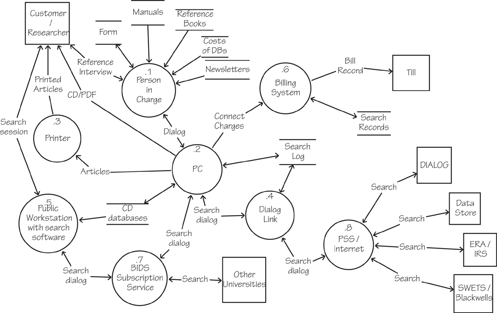

[5.7-P014] Figure 5.6. City University researchers’ process for interrogating commercial databases. This model shows the technology used for the task and was built by the authors working with the user of the process. As the user described the work, the authors modeled and demonstrated their understanding. This model uses conventional data flow notation. Most process models would do the job equally well, so use whichever model you are most familiar with.

[5.7-P015] ***The current work contains many functions that contribute to the continuation of the business. Naturally, these functions must be included in any future work.***

[5.7-P016] Restrict the amount of detail you include in your models of the current system—there is little point in modeling every tiny facet of something you are about to replace. The ideal model contains enough detail to give you an understanding of the work, and no more. The detail shown in **Figures 5.6** and **5.7** is about right. That is, these models show the major parts of the current situation. Such a model would allow the stakeholders to verify that it is a good-enough representation of the work as it stands, and it gives the requirements analyst places to make further inquiries.

[5.7-P017] 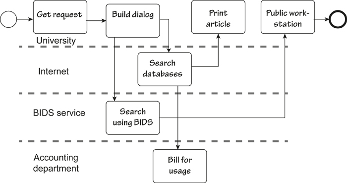

[5.7-P018] Figure 5.7. A UML activity diagram showing the same piece of work as illustrated in **Figure 5.6**. Business analysts should use whatever models they feel most comfortable with.

[5.7-P019] One aspect of the model that should not, within reason, be restricted is the area of the work covered by the model. Here it is almost—and we stress “almost”—a case of “the more, the merrier.” Your models should cover all the work that could possibly be relevant to your product, those parts of the business that could contribute to the new product, and those parts where operational problems have popped up in the past. The other areas worth covering are those where the business is not well understood.

[5.7-P020] The point of having a large scope for models of the current work is that requirements analysis is really *work reengineering.* You specify products to improve work; thus, the more of the work that you study, the more opportunities to improve it that will emerge. The greater the scope of your study, the better your understanding and the better chance you and your stakeholders have of finding areas that will benefit from improvement.

[5.7-P021] The current model is also used to confirm the work scope. During the blastoff exercise (**Chapter 3**), you and the stakeholders built a context model to show the scope of the work you intended to study. Any models you build while looking at the current situation should confirm that all of the appropriate parts of the work are included in the context. If at this stage you discover areas that would benefit from your attention, parts of the work that need to be understood, or anything at all that should be included, then now is the time to adjust the context. Such a revision does entail getting the agreement of the stakeholders, but it is better to enlarge the scope now than to end up with a product that lacks important functionality.

## 5.8 Apprenticing

[5.8-P001] 

[5.8-P002] ***Apprenticing is particularly useful for in-house work. The underlying assumption for apprenticing is that users are currently doing work, and you, as the requirements analyst, have to understand their work. This work could be clerical, commercial, graphic arts, engineering, or almost anything short of brain surgery.***

[5.8-P003] ***If significant parts of the current work and systems are likely to be reimplemented, then apprenticing is appropriate. Please keep in mind, however, that you will not reimplement the work exactly as is. We recommend that all apprentices refer to the section on essence.***

[5.8-P004] Apprenticing—based on the old idea of masters and apprentices—is a wonderful way to observe and learn the work as it really happens. In this case, the requirements analyst is the apprentice, and the user assumes the role of master craftsman. The analyst sits with the user at the user’s place of work, learning the job by making observations, asking questions, and perhaps doing some of the work under supervision. This technique is also sometimes known as “job shadowing.”

[5.8-P005] It is unlikely that many users can explain what they do in enough detail for the business analyst to completely understand the work and thereby capture all the requirements—if you are away from your work, you tend to generalize. Generalizations can be useful, but they do not provide enough detail for them to work every time.

[5.8-P006] Reading

[5.8-P007] Holtzblatt, Karen, Jessamyn Burns Wendell, and Shelley Wood. *Rapid Contextual Design: A How-to Guide to Key Techniques for User-Centered Design.* Morgan Kaufmann, 2004.

[5.8-P008] *“Nobody can talk better about what they do and why they do it than they can while in the middle of doing it.”*

[5.8-P009] —Hugh Beyer and Karen Holtzblatt. *Contextual Design*

[5.8-P010] Nor can you expect users to have the presentation and teaching skills needed to present their work effectively to others. Conversely, almost everyone is good at explaining what they are doing while they are doing it.

[5.8-P011] If the user is doing his job in his normal workplace, he can provide a running commentary and provide details that might otherwise be lost. So if you want to get an accurate explanation of the work, go to the work; sit beside the user in the normal workplace and get a running commentary on the work as it happens. While he is working, the user can describe his task precisely and tell you why he is doing things. If the explanation is not clear, the apprentice asks questions: “Why did you do that?” “What does this mean?” “How often does this happen?” “What happens if this piece of information is not here?” You also get to see the things that can go wrong, and the special cases, and the work-arounds he uses when things are not normal. Through the process of apprenticing, you come to see all the cases and the actions the user takes for each.

[5.8-P012] Apprenticeship can be combined with modeling. As you observe the work and the user explains it, you sketch a model of the tasks and their connections with the other tasks (see **Figure 5.8**). As you build your models, feed them back to the user and confirm that they are correct. Naturally you use this feedback to raise questions about any areas of uncertainty.

[5.8-P013] 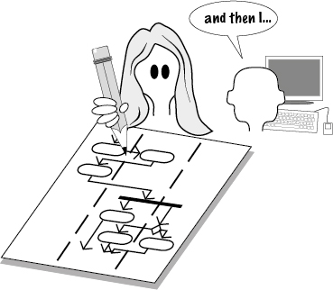

[5.8-P014] Figure 5.8. The requirements analyst learns the work while sitting at the user’s desk, sometimes building models of the work while learning it.

[5.8-P015] When you are apprenticing, you are an interpreter as well as an observer. When you are looking at the current work, you must abstract away from what you see to overcome the user’s close connection to the physical incarnation of the work. In other words, the artifacts, the technology, and other inputs that are currently used must be seen as a product of a previous designer. Someone, some time ago, decided that was the best way to do the work. But times have changed. Today it may be possible to do things that were impossible yesterday. Better ways may now be available—ways that take advantage of up-to-date technology, that use streamlined processes, that simplify the work or automate some or all of it.

[5.8-P016] But first you have to abstract. While you are learning the work by seeing it done in real-world conditions, you are abstracting from the current technology to find the underlying essence of the work. We will come back and have a good look at essence a little later.

## 5.9 Business Use Case Workshops

[5.9-P001] 

[5.9-P002] ***BUC workshops are useful to most projects, and are the most commonly used requirements technique. These workshops look at one slice of the business with the objective of finding the ideal work. You must overcome geographical limitations and ensure that you can assemble the right combination of specialized stakeholders who have an interest in the business use case. These workshops are particularly useful when you are making fundamental changes to the work.***

[5.9-P003] Refer to **Chapter 4**, Business Use Cases, for a complete explanation of business events and BUCs.

[5.9-P004] In **Chapter 4**, Business Use Cases, we discussed business events and how they trigger a response by the work. We called this response a business use case (BUC). We hope that by devoting an entire chapter to business events and business use cases, we have unequivocally signaled the importance of partitioning the work according to how it responds to the world outside it.

[5.9-P005] Now that you have partitioned the work, the business use case workshop is an effective way of understanding each partition and making improvements. The workshop is where interested stakeholders describe or reenact the work they currently do, and discuss the work they desire to do, for one specific business use case. Your task is to record this work in a way that the stakeholders can understand it and agree that is it an accurate portrayal. As a general rule, we suggest that you use scenarios to show the functionality of the business use case (see **Figure 5.9**). Later, you will use this recording of the improved work to derive the requirements for the product to support this work.

[5.9-P006] 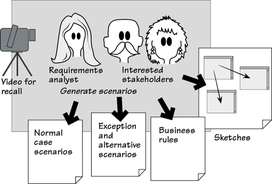

[5.9-P007] Figure 5.9. The business use case workshop records the proposed functionality using scenarios and sketched prototypes. The workshop serves as a forum for interested stakeholders to communicate effectively, express their understanding, ask questions, and give their aspirations for the work.

[5.9-P008] Reading

[5.9-P009] Gottesdiener, Ellen. *Requirements by Collaboration: Workshops for Defining Needs.* Addison-Wesley, 2002. Gottesdiener’s book covers in detail how to plan and conduct requirements workshops.

[5.9-P010] Hass, Kathleen, and Alice Zavala. *The Art and Power of Facilitation: Running Powerful Meetings (Business Analysis Essential Library).* Management Concepts, 2007.

[5.9-P011] In **Chapter 6**, we talk about scenarios as a way of telling the story of the business use case in a fairly structured way. We propose that you use scenarios as part of the business use case workshop—they are easy to understand, and provide a convenient focal point for the workshop. Feel free to peek into **Chapter 6**, but for the moment it will suffice if you think of a scenario as a tool for breaking the business use case’s functionality into a series of steps.

[5.9-P012] The analysts and the stakeholders work together on a business use case and record the following information:

- [5.9-P013] The desired outcome for the BUC

- [5.9-P014] A normal case scenario that describes the work done by the BUC

- [5.9-P015] Exception scenarios describing what can go wrong and what the work does to correct them (these can be postponed until later if desired)

- [5.9-P016] The business rules applicable to the business use case

- [5.9-P017] Sketched prototypes used to help stakeholders visualize the business use case—these throwaway sketches are optional and are not intended to be kept beyond the requirements phase

[5.9-P018] See **Chapter 3**, Scoping the Business Problem, for more on how to discover the relevant interested stakeholders.

### 5.9.1 Outcome

[5.9.1-P001] The outcome is what the organization hopes to achieve from this business use case, cast in terms of results, not outputs. For example, suppose the business use case is “rent a car to a customer.” The desired *outcome* is that the customer drives away in the car of his choice, the rate selected is equitable, the details are recorded, and the transaction is completed with the minimum inconvenience to the customer at minimal cost. The *outputs* of the same business event are the rental document and some recorded data. Achieving the output does not necessarily guarantee the outcome.

[5.9.1-P002] ***Think of outcomes, not outputs.***

[5.9.1-P003] Note that the outcome is a business objective, not a way of achieving something. Outcomes are expressed from the point of view of the owning organization—what it wants to achieve. The outcome gives your business use case its reason for existing.

[5.9.1-P004] The outcome should be able to be written as one sentence along the lines of “When this business event happens, this is what we want to achieve.”

### 5.9.2 Scenarios

[5.9.2-P001] Scenarios describe the work being done by the business use case as a series (usually between three and ten) of steps. The scenario is a stakeholder-friendly document that serves as the focal point of the workshop. The steps do not have to be detailed; the intention is not to capture every small part of the business use case, but rather to obtain a business-level picture of the work that stakeholders can use to arrive at a consensus.

[5.9.2-P002] The normal-case scenario shows the actions of the business use case if everything works as desired and no mistakes are made, no wrong actions are taken, or no other untoward happening occurs. The intention is for you and your stakeholders to reach consensus on what *should* happen. Other scenarios focus on the exception cases—when unwanted things go wrong—and the alternative scenarios—when the users of the business use case may take some allowable variations on the normal case.

[5.9.2-P003] **Chapter 6** provides a full treatise on scenarios.

[5.9.2-P004] The collection of scenarios represents the interested stakeholders’ consensus on what the work should do in response to the business event. We stress again the importance of understanding the work, and not just the product.

### 5.9.3 Business Rules

[5.9.3-P001] The business rules are management prescriptions that transcend and guide the day-to-day business decisions. For example, we discovered these two business rules in the road de-icing project:

[5.9.3-P002] The maximum length of a truck driver’s shift is 5 hours.

[5.9.3-P003] The engineers maintain the weather stations once a week.

[5.9.3-P004] These rules come to the surface as the stakeholders discuss the work for each business event. Later they are used to guide the functional requirements and to help to discover the meaning of stored data. Naturally, any product you build must conform to the business rules, and often it is the product that has to enforce them.

[5.9.3-P005] There is no set form for the business rules. In most cases you will be able to find, with the help of the interested stakeholders, existing documents that spell out these rules. The rules must, of course, become incorporated into the business use case scenarios and the subsequent requirements.

[5.9.3-P006] The business use case workshop gives the interested stakeholders the opportunity to bring out all the relevant business rules.

## 5.10 Interviewing the Stakeholders

[5.10-P001] 

[5.10-P002] ***Interviewing is used by almost all projects, as it is really a part of all elicitation techniques. Despite its omnipresence, we suggest that you do not use interviewing as your only technique for gathering requirements. Rather, you should conduct interviews in conjunction with the use of other techniques discussed in this chapter.***

[5.10-P003] Interviewing the stakeholders is a technique that is commonly employed, but is not without its problems. The interviewer relies on the interviewee to know—and be able to verbalize—all the necessary knowledge about the work. This method may work very well when people are familiar with the work, but that knowledge is often restricted to their own immediate area. There are likely to be few people in the organization who understand enough of the business to be the sole person to describe it for you. Interviewing also requires some abstraction and communication ability on the part of the interviewee. For this reason, it is wise to avoid relying on interviews as your sole method of gathering requirements; instead, use them in conjunction with other techniques.

[5.10-P004] That cautionary note notwithstanding, interviewing skills are highly useful in other contexts. For example, a requirements analyst can “interview” a model or a document. The skill here is to know which questions to ask of the model, or more realistically, the appropriate stakeholder for the model.

[5.10-P005] Some requirements analysts draw up a questionnaire and send it to the stakeholder in advance of the interview. While this preparatory step gives some structure to the subsequent interview, we have found few stakeholders who are motivated enough, or who have time enough, to fill in a questionnaire prior to meeting the analyst. We suggest that you send a brief agenda listing the topics that you wish to cover in your interview along with the planned duration of the interview. This notification at least gives the interviewee a chance to think in background mode, to have needed material close by, or to ask subject-matter experts to be present.

[5.10-P006] Stakeholders should not remain completely passive during the interview. Instead, do your best to involve them by building models—business event responses, use cases, scenarios, and so on—during the interview. This approach creates a feedback loop between you and your stakeholders, and it means you can iteratively test the accuracy of what you are being told. Follow these guidelines to make your interviews more effective:

- [5.10-P007] Set the interview in context. This step is necessary to avoid having your stakeholders talk about something irrelevant to your purpose. It also gives them a chance to withdraw gracefully if they have not prepared for the interview.

- [5.10-P008] Limit the duration of the interview to the time stated in the agenda. We find that interviews running for more than an hour (90 minutes tops) tend to lose focus.

- [5.10-P009] Have business use cases serve as an anchor for the interview. Users recognize business use cases (although they may not necessarily call them by that name), and it makes for more directed conversations if you talk about their work one business use case at a time.

[5.10-P010] ***Feed back your understanding. Build models while you are interviewing the stakeholder.***

- [5.10-P011] Ask a question (more on this in a moment), listen to the answer, and then feed back your understanding.

- [5.10-P012] Draw models and encourage the user to change them. Plenty of models (e.g., data flow diagrams, activity diagrams, sequence diagrams) are available to help you communicate your understanding of a process. You can also construct data models for information, and mind maps to link different subjects.

- [5.10-P013] Use the stakeholders’ terminology and artifacts, both conceptual and real. If the stakeholders do not use their own language, then you force them to make technological translations into terms they think you will understand. This, sadly, usually leads to misunderstandings. By contrast, if you are forced to ask questions about their terminology, you inevitably make new discoveries.

- [5.10-P014] Keep samples or copies of artifacts and log them for future reference. Artifacts are the things the stakeholders use in their daily work. They can be real things: documents, computers, meters, spreadsheets, machines, pieces of software. They can also be conceptual things: status, contracts, schedules, orders. Artifacts will inevitably cause you to raise questions when you examine them later.

[5.10-P015] ***Thank the stakeholders for their time.***

- [5.10-P016] Thank the stakeholders for their time and tell them what you learned and why it was valuable. After all, they have lots of other things to do. Talking to you is not the reason they are employed, and they often view the interview as an interruption.

- [5.10-P017] Write down what you were told. We guarantee you’ll have more questions.

[5.10-P018] Note taking is almost a skill set of its own. We encourage the use of mind maps as a note-taking device—we talk about these later in the chapter. You might also consider some of the smartpens on the market. These devices record an electronic version of your notes (easy to share with the rest of the team) and some record the voice part of the interview. Livescribe pens are popular at the time of writing, and some others offer similar technology.

### 5.10.1 Asking the Right Questions

[5.10.1-P001] We suggested earlier that the business use case was the ideal unit of work to interview someone about. We also urge you to use the Brown Cow viewpoints (shown in **Figure 5.4**) as triggers for asking the right questions. Let’s look at this process by using an example from the IceBreaker road de-icing project.

[5.10.1-P002] Suppose that you have an interview with the Chief Engineer. The business event that you want to explore is *Road Engineering Installs New Weather Station.* Your questions should focus on what the work does to respond to this business event.

[5.10.1-P003] ***Note that the analyst begins with a “W” word—what, why, where, who—to open up the question and elicit information.***

[5.10.1-P004] Business Analyst: “What happens when your engineers install a new weather station?”

[5.10.1-P005] Chief Engineer: “The engineers let us know where the new weather station is located, and we keep a record of it.”

[5.10.1-P006] BA: “How do you keep a record of the new weather station?”

[5.10.1-P007] CE: “I’ll show you the spreadsheet that we use; here it is.”

[5.10.1-P008] BA: “Thank you. I’d like a copy of this weather station spreadsheet. I see that you keep track of the weather station number, geographical coordinates, and installation date. What else do you keep track of?”

[5.10.1-P009] CE: “We have another computer system where we have the maintenance history for each weather station. There are some double entries, but that’s the way it is.”

[5.10.1-P010] BA: “Are there any other facts about the weather station that would be useful to you?”

[5.10.1-P011] CE: “Well, we would like to know the manufacturer and performance of each weather station.”

[5.10.1-P012] BA: “What do you mean by performance?’

[5.10.1-P013] CE: “Which weather stations need the most maintenance. This would help in planning which new technology we spend our budget on. However we’ve never been able to do that in the past.”

[5.10.1-P014] BA: “Would it be acceptable to you if you had a new system that integrates all the information about the weather stations, their maintenance, and their performance?”

[5.10.1-P015] CE: “What, you mean all on one screen?”

[5.10.1-P016] BA: “Yes, something that makes it possible for you to track a weather station and its lifetime performance.”

[5.10.1-P017] CE: “That sounds marvelous, but we’d have to check it with some of the engineers.”

[5.10.1-P018] BA: “Well, once I’ve made sure that I have all the facts about the weather stations properly defined, then I could do a quick mockup to show the engineers our ideas. How would that be?”

[5.10.1-P019] CE: “I like the idea.”

[5.10.1-P020] BA: “Thanks for your time. I’ll go back and review my notes and the samples you have given me, and I’ll send you a brief summary of this interview. I might need to phone you with a couple of questions. Then I’ll make an appointment to explore the mockup with the engineers. Is this approach all right with you?

[5.10.1-P021] CE: “Yes it is. Thank you.”

[5.10.1-P022] In this interview, the business analyst uses the Brown Cow viewpoints to help explore the business use case. He starts by asking how the work is done now (How-Now) and discovers the spreadsheet and the other computer system for maintenance of the weather stations. He asks, “What else do you keep track of?” to discover the attributes that are recorded (What-Now) when a new weather station is installed. The question about “What other facts” is designed to uncover other facts that are not currently recorded or made use of (Future-What). And raising the idea of an integrated system and a mockup (Future-How) is signaling the chief engineer that there will probably be a better way of doing things once the business analyst has properly understood the business of installing weather stations.

[5.10.1-P023] ***The Brown Cow viewpoints help you explore the business use case as it is now, its essence, and what it might be in the future.***

[5.10.1-P024] Notice that the business analyst used a lot of *open questions.* These begin with “What,” “How,” “When,” “Where,” “Why,” or “Who,” and they encourage the interviewee to give a detailed answer rather than a “Yes” or “No” answer.

### 5.10.2 Listening to the Answers

[5.10.2-P001] Being a good listener means being able to understand someone else’s meaning behind the words that they are using. This is difficult to do because we all have our own view of the meaning of words that is based on our own assumptions, experience, and preoccupations. Also, especially when interviewing someone, we are often afraid of silence and might think, “If I’m not saying anything, then maybe the interviewee will think that I don’t know what I’m doing.” In fact, the reverse is true: It is comforting to have some silence and time for reflection. If you are the interviewer, however, even a few seconds silence seems like a lifetime.

[5.10.2-P002] If you want to improve your listening skills, you can learn a lot from the fields of psychology, sociology, and family therapy. These disciplines have realized that to help people with problems, you first have to understand what those people mean by their words and behavior.

[5.10.2-P003] Reading

[5.10.2-P004] The following are books that provide insights into how to ask better questions and listen to the answers.

[5.10.2-P005] O’Connor, Joseph, and John Seymour. *Introducing Neuro-Linguistic Programming.* Conari Press, 2011.

[5.10.2-P006] Sullivan, Wendy, and Judy Rees. *Clean Language: Revealing Metaphors and Opening Minds.* Crown House Publishing, 2008.

[5.10.2-P007] Weinberg, Jerry. *Quality Software Management. Volume 1: Systems Thinking. Volume 2: First-Order Measurement. Volume 3: Congruent Action. Volume 4: Anticipating Change.* Dorset House, 1992–1997.

[5.10.2-P008] In their book *Clean Language,* Wendy Sullivan and Judy Rees talk about the power of “attending exquisitely” to another person’s words. One of their hints on improving listening skills is “Put your attention on what the other person is actually saying rather than on the person themselves or what you think they might mean by their words.” Another helpful piece of advice: “Repeat back some of their words or phrases exactly as you heard them.” By doing so, you demonstrate that you are, in fact, listening to what that person is saying, and this feedback encourages that person to expand further on what he means by his words.

[5.10.2-P009] Most of all, if you want to become a better listener, don’t talk; develop an appreciation of silence.

## 5.11 Looking for Reusable Requirements

[5.11-P001] 

[5.11-P002] ***Many of the our projects deliver similar products. That is, if you work for a finance house, then almost all of your projects will deliver some kind of financial system. Given that your organization has been doing this for a number of years, it is likely that someone, at some time, has studied a piece of work that is similar to yours and has written requirements for a product that is similar to yours. You don’t have to do it all again when you can borrow from those who have gone before.***

[5.11-P003] Investigating the work is a time when you observe and interpret. The interpretation we are looking for here is one where you see a business process and recognize its similarities with other processes. By making abstractions—that is, by ignoring the subject matter and concentrating on the processes (look at the verbs, not the nouns)—you are often able to interpret one piece of work as having the same functionality as another. This does not mean they have the same subject matter, but rather that they have similarities in the way that both pieces of work are done.

[5.11-P004] ***Look for similarities, not differences.***

[5.11-P005] As an example of this, one of our clients, the international section of a bank, had 20 different products. The products ranged from letters of credit, to guaranteed foreign bank loans, to guaranteed funds, and so on. At first glance, the users appeared to handle each of these products differently. However, a common pattern emerged as we studied the work—we were looking for similarities, not differences. We observed that each product was, in fact, a different way of guaranteeing that exporters got paid for their goods in foreign countries. The end result was that we were able to borrow heavily from one project to feed the next. We had to change names and make some alterations to processes, but by and large, by using abstracted requirements from other projects, we were able to save significant project time.

[5.11-P006] We suggest building abstract models of the work structure—that is, models that do not give specific technological names to things, or use distinctive terminology associated with one part of the organization. Such models also do not apply to any particular user, or use terminology identified with a particular user. They are abstracted from their source—they use categorizations rather than specifics, generics rather than actual instances. Instead of modeling the work the way any single user sees it, they model the **class** of work as all users could see it.

[5.11-P007] This kind of abstraction enables you to discover whether the same work pattern exists in another part of the organization. It has been our experience that although the names and the artifacts may vary, the same work pattern occurs several times in an organization. We have used the recurrence of patterns first to understand the requirements more quickly, and then to deploy the implementation of one part of the work to suit another part.

[5.11-P008] **Chapter 15** deals with reusing requirements. We suggest that you visit this chapter if you suspect you have the opportunity to reuse requirements and other artifacts from previous projects.

[5.11-P009] See **Chapter 15**, Reusing Requirements, for more on patterns.

## 5.12 Quick and Dirty Process Modeling

[5.12-P001] 

[5.12-P002] ***Quick and dirty process modeling is a technique for building quick models of business processes to gain understanding and consensus about the current work. We find that business stakeholders relate very well to the dynamic nature of these kinds of models.***

[5.12-P003] ***The technique is useful when much of the legacy system is to be replaced. It can also be used when the stakeholders are geographically dispersed.***

[5.12-P004] Quick and dirty process models simulate the current reality, and of course can be used to model any future processes. They are not formal models in the sense of UML activity diagrams and the like, but rather are put together using whatever physical artifacts are to hand. We find that Post-it notes are the most convenient way to build these models, but they are not confined to that medium (see **Figure 5.10**).

[5.12-P005] 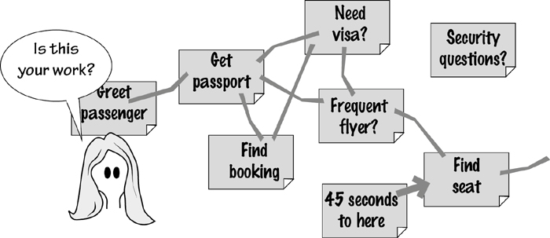

[5.12-P006] Figure 5.10. With quick and dirty process modeling, the business analyst uses Post-it notes to build an informal model of the work. Large notes are stuck on the wall and linked by masking tape. Naturally, interested stakeholders are partners in this modeling activity.

[5.12-P007] The technique is more or less to build a process model using large Post-it notes, or index cards, for each of the activities in the process. You can stick the notes onto a whiteboard and draw lines to link them, or if you are using a regular wall, use masking tape to join one note to the next. In the best of all possible worlds, the walls of your office are painted with whiteboard paint such as IdeaPaint and you can draw and stick and post notes wherever and of whatever you want.

[5.12-P008] The advantage of using Post-it notes to model the business process is that stakeholders are usually willing to become involved in moving the brightly colored notes around to model their process. If an activity is badly named, it can quickly be replaced by another note with a better name. If something is out of place, it can be moved around with little effort.

[5.12-P009] But perhaps the most important benefit of using this technique is that when the stakeholders start moving the Post-it notes around, they often discover ways of simplifying their business process. It is not uncommon to find business stakeholders saying things like “If we just move this activity over here, change that one, we could eliminate those two down there.” These ideas must be kept and brought into play when we look at the essence of the system and derive a new way of working.

[5.12-P010] The Post-its models range from simple models where the activities proceed more or less in a straight line, to the rather elaborate Post-it model shown in **Figure 5.11**.

[5.12-P011] 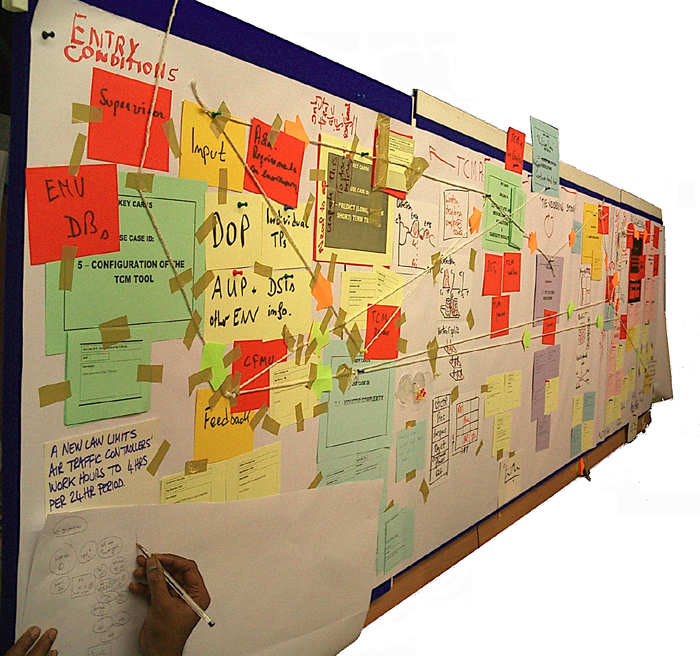

[5.12-P012] Figure 5.11. A five-meter-long Post-it model built by the air traffic controllers during a workshop. This model is perhaps more elaborate than that needed by many businesses, but it helped the controllers to understand their process much better. *Photo: Neil Maiden.*

[5.12-P013] Please keep in mind that while we are advocating the use of physical models, we are not advocating designing screens and delving into low-level detail—those actions are not appropriate at this stage. The intention of using quick and dirty models here is merely to build a more pliable model of the current and future business processes. Little is to be gained—and, in fact, much is to be lost—if business users turn their hand to designing screens at this time.

[5.12-P014] However, if you can avoid designing, you can make good use of sketches of screens and other interfaces.

## 5.13 Prototypes and Sketches

[5.13-P001] Prototyping and sketching—they are really the same thing—can be effective techniques for eliciting requirements. The basic idea is to sketch some proposed product, and then reverse engineer the requirements from the sketch. This is a particularly useful approach in the following situations:

- [5.13-P002] The product has not existed before, and it is difficult to visualize.

- [5.13-P003] The stakeholders for the product have no experience with either the kind of product or the proposed technology.

- [5.13-P004] The stakeholders have been doing their work for some time and are stuck in the way that they do it.

- [5.13-P005] The stakeholders are having trouble articulating their requirements.

- [5.13-P006] The requirements analysts are having trouble understanding what is required.

- [5.13-P007] The feasibility of a requirement is in doubt.

[5.13-P008] When gathering requirements, you ask your stakeholders to imagine what they need their future product to do. The results you uncover are limited by the stakeholders’ imaginations and experiences, and by their ability to describe something that for the moment does not exist.

[5.13-P009] ***The prototype makes the product real enough to prompt stakeholders to bring up requirements that might otherwise be missed.***

[5.13-P010] In contrast, a prototype gives the stakeholder something real, or at least something that has the appearance of reality. The prototype makes the product real enough for stakeholders to bring up requirements that might otherwise be missed. Our colleague Steve McMenamin refers to prototypes as “requirements bait”: When stakeholders see the functionality displayed by a prototype, it inspires them to bring up other requirements. In this way, by demonstrating possibilities through prototypes and giving stakeholders a seemingly real experience, you capture the additional requirements—sometimes there are quite a lot of them—that might otherwise have waited until the product was in use to come to the surface. (See **Figure 5.12**.)

[5.13-P011] 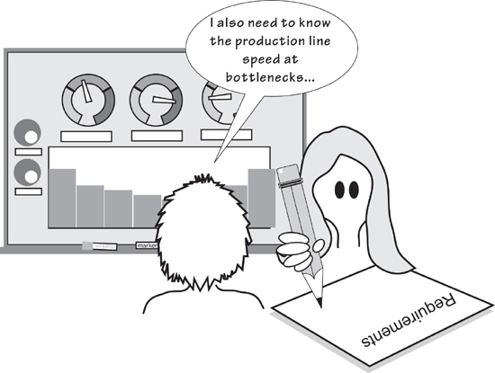

[5.13-P012] Figure 5.12. Requirements prototypes are used to display the functionality of a potential product. The prototype is intended to prompt stakeholders to tell you whether you have understood the needed functionality and, as a result of “using” the prototype, to give you additional requirements suggested by it.

[5.13-P013] *“Prototypes are requirements bait.”*

[5.13-P014] —Steve McMenamin

[5.13-P015] Prototypes are also used to play out the consequences of requirements. You will inevitably come across a strange requirement that has a single advocate who swears he would be lost without it. Who knows whether his requirement is a great idea that will make the product better or merely a complex way of doing something that doesn’t need to be done? The prototype does. Building a prototype of hard-to-fathom requirements makes them visible; it gives everyone the opportunity to understand them, discuss them, possibly simplify them, and then decide whether their merits warrant their inclusion in the final product.

[5.13-P016] We have to emphasize that the prototypes and sketches discussed here are throwaway prototypes; they are not intended to evolve into the finished product. Of course, they might—but that possibility is incidental to your task of requirements gathering.

[5.13-P017] In this discussion, we are using the terms “prototype” and “sketch” to mean some kind of simulation of a product that the stakeholders could use to do their work—the work that you envisage they might do in the future. Put simply, you show your prototype and possibly several alternative prototypes—to your stakeholders and ask if they could do their job using a product something like your simulation. If the answer is yes, then you capture the requirements demonstrated by that version of the prototype. If the answer is no, then you change the prototype and ask again.

[5.13-P018] ***Which aspects of reality are uppermost in the minds of the people you are dealing with? Which metaphors do they use for their work, and how do they envision themselves while they are doing their work?***

[5.13-P019] The stakeholders who must decide whether your prototype is a reasonable demonstration of the proposed work face a somewhat difficult situation. Inevitably, they bring to the prototyping exercise some work-related baggage. They have been doing their job for some time (you probably wouldn’t be asking them to test your prototypes if they hadn’t), and their perception of their work may differ dramatically from yours. This difference in perspectives requires tact on your part to discover which aspects of reality are uppermost in the minds of the people you are dealing with. Which metaphors do they use for their work, and how do they envision themselves while they are doing their work? In addition, you are asking them how they feel about doing different work—the work that you are proposing for the future. Adopting the new product could mean jettisoning artifacts and ways of working that they feel quite comfortable with. It is no easy task for the stakeholders to turn away from their experience and their comfort, and to accept a new, as-yet-untried way of doing their work.

[5.13-P020] ***Build a prototype that relates to the physical anchors in the user’s world.***

[5.13-P021] This means that you should always try to use prototyping techniques that conform, in some way, to the artifacts and experiences that are most familiar to the stakeholders. This means adjusting your prototyping approach for each work situation.

[5.13-P022] Let’s look at some of the possibilities available for requirements prototypes. We can then talk about how they might be gainfully employed. We’ll start with the simplest option: the low-fidelity prototype.

### 5.13.1 Low-Fidelity Prototypes

[5.13.1-P001] *“To look at structure, the first prototypes are always paper.”*

[5.13.1-P002] —Hugh Beyer and Karen Holtzblatt, *Contextual Design*

[5.13.1-P003] By using familiar media, low-fidelity prototypes (we also call these “sketches”) help stakeholders concentrate on the subject matter. Such things as pencil and paper, whiteboards, flip charts, Post-it notes, index cards, and cardboard boxes can be employed to build effective low-fidelity prototypes (**Figure 5.13**). In fact, these prototypes may take advantage of anything that is part of the stakeholders’ everyday life and do not require an additional investment.

[5.13.1-P004] 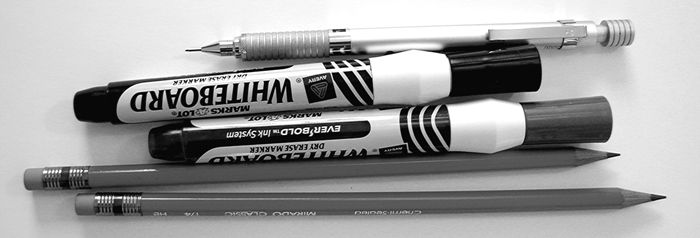

[5.13.1-P005] Figure 5.13. Effective prototyping tools do not have to be complex or expensive.

[5.13.1-P006] The low-fidelity prototype is a sketch, which is not meant to look all that much like the finished product—this is why such prototypes are called “low-fidelity.” This lack of faithfulness to the finished product is both good and bad. The good part is that no one will confuse your prototype with an actual product—it is obviously built with a minimal investment in time, and most importantly it gives no indication that it is anything other than an easy-to-change mockup. The low-fidelity sketch encourages iteration, and it more or less indicates that you are not expecting to get the right answer on your first attempt. The bad part is that such a prototype sometimes requires more effort on the part of the stakeholder who is testing it to imagine that the whiteboard sketch might potentially be his new product. Nevertheless, the ability to make changes easily and the speed with which you can sketch out a prototype usually help you to bring things to life, thereby assisting stakeholders in taking more advantage of their imaginations.

[5.13.1-P007] ***Prototyping is more convenient, and ultimately more accurate, if done one PUC at a time.***

[5.13.1-P008] We find that prototyping is more convenient, and ultimately more accurate, if the prototype involves a single business use case (BUC) or a single product use case (PUC); given that the prototype involves some simulated product, we will assume you are prototyping a PUC. We introduced business and product use cases in **Chapter 4**. Recall that a business use case is an amount of work, triggered by an external business event occurring or by a predetermined time being reached, that takes place in a single, continuous time frame. It also has a known, measurable, testable outcome. The part of the BUC that is to be done by the product is the PUC. Because of its single, continuous time frame, it provides you with an appropriate amount of work as the subject of your prototype.

[5.13.1-P009] Let’s look at prototyping by examining an example use case. The “Monitor Untreated Roads” product use case, as shown in **Figure 5.14**, is suitable for our purposes. This use case is triggered periodically when it is time to monitor the road treatment: The engineer checks whether all the roads that have been scheduled to be treated with de-icing material have, in fact, been covered by one of the trucks. Your task is to find all the requirements for this part of the product.

[5.13.1-P010] 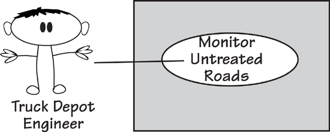

[5.13.1-P011] Figure 5.14. The truck depot engineers are responsible for ensuring that all roads in danger of freezing are treated with de-icing material. Use case number 11, “Monitor Untreated Roads,” represents this part of the work.

[5.13.1-P012] Your aim in building a low-fidelity prototype of this BUC is to unearth the existing requirements that must be carried forward into the new product, along with the new, as yet undreamed-of requirements. Let’s assume the engineers are currently working with a system that supplies them with a list of roads, and use that as a starting point.

[5.13.1-P013] You can quickly sketch a low-fidelity prototype of the current situation, and then begin to explore improvements to it. The prototype focuses on what the product might do; for the moment, it ignores any implementation details.

[5.13.1-P014] *“Paper is eminently practical and meets the primary need: It makes it possible to express the structure of the system and makes it hard to overfocus on user interface detail.”*

[5.13.1-P015] —Hugh Beyer and Karen Holtzblatt, *Contextual Design*

[5.13.1-P016] When you are sketching a low-fidelity prototype, be quick. Demonstrate each requirements suggestion with another sketch, or several alternative sketches. You might intentionally serve up several prototypes of the same PUC, asking for the stakeholders’ preferences and possibly more suggestions for alternatives. Once your stakeholders see you are simulating potential ways of solving their problem and realize their input is not only welcome but also necessary, they will almost certainly help you by suggesting their own enhancements and requirements. Our experience is that once you get people involved by making the problem visible, they tend to become more creative and imaginative—so much so that sometimes your problem becomes one of keeping pace with their suggestions.

[5.13.1-P017] Get started by sketching what the stakeholders**2** might be doing when using the product. Ask the stakeholders what the product could do to contribute to their work, and note their ideas. In the “Monitor Untreated Roads” PUC, stakeholders would probably want the product to provide something like the following information:

- [5.13.1-P018] Roads that have been scheduled for treatment

- [5.13.1-P019] Scheduled roads that have been treated

- [5.13.1-P020] Relative positions of roads

[5.13.1-P021] Now ask the stakeholders what they would do with this information. At this point you are not trying to design a solution to this immediate problem, but rather want to explore ideas for what a potential product *might* do and what the work *might* be with that product:

- [5.13.1-P022] “What is the best way of presenting the needed information?”

- [5.13.1-P023] “Is the requested information the right information for the work being done?”

- [5.13.1-P024] “Could the product do more or less of the work?”

[5.13.1-P025] When you are prototyping, assume that there are no technological limitations. Also, keep in mind that you are designing the work, not the product—you are capturing the things the product might do to help the stakeholders with their work.

[5.13.1-P026] Sketch pictures to elicit ideas from the stakeholders. If they are having trouble getting started, then inject some ideas of your own. Ask them to imagine that they are doing the job of monitoring untreated roads. Which other pieces of information would they need to do the job? Can your prototype provide it, or would they have to look elsewhere for information? Is all of the information in the current version of the prototype needed to do the job of monitoring untreated roads?

[5.13.1-P027] As the prototyping proceeds and the engineers see your sketches, you may hear the following kind of remark:

[5.13.1-P028] “That’s great. Now wouldn’t it be great if we could see the major roads that have not been treated for three hours? But only the major roads—the secondary ones don’t matter so much. Our current system can’t distinguish between major and secondary roads.”

[5.13.1-P029] How long would it take you to add that requirement to your sketch? About 10 seconds. How long would it have taken to modify the installed product if the engineers had asked for this requirement after delivery? Enough said.

[5.13.1-P030] By working with the engineers, you may generate a prototype that is quite different from the product they have at the moment. But that’s the point—to change the work, and to discover new and better ways of doing the work. By encouraging the engineers to tell you more and more about the job, you uncover requirements that otherwise would not come to light. (See **Figure 5.15**.)

[5.13.1-P031] 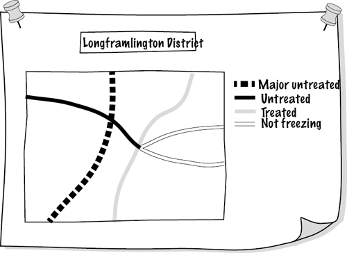

[5.13.1-P032] Figure 5.15. By drawing this low-fidelity prototype on a flip chart or whiteboard, you help identify requirements for the truck depot engineers. They want the product to highlight the major roads within a district that have not been treated and are in a dangerous condition.

[5.13.1-P033] When you sketch a low-fidelity prototype, you demonstrate your ideas to the stakeholders and encourage them to iterate its development by changing and improving your ideas. Recall that a part of the requirements process is inventing a better way to do the work. The prototype is an invention vehicle with which you and your stakeholders to experiment to see how the proposed product could contribute to the new work.

[5.13.1-P034] **The low-fidelity prototype is not a work of art, but rather an idea-generating device.**

[5.13.1-P035] A low-fidelity prototype is informal and fast. No one will mistake it for the finished product. Because it is easy to change, stakeholders are willing to iterate, experiment, and investigate alternative ideas.

### 5.13.2 High-Fidelity Prototypes

[5.13.2-P001] High-fidelity prototypes are built using software tools and have the appearance of working software products. They appear to do whatever the use case does, and they display most of the characteristics of working software products. Development of such a prototype gives stakeholders the opportunity to “use” a realistic-looking product and decide whether the product displays the correct requirements.

[5.13.2-P002] Because the prototype behaves as the stakeholders would expect the final product to behave, it gives them the chance to explore the *potential* of the product, ideally leading them to suggest improvements and new requirements. But herein lies a problem: Because the prototype looks so much like a working product, the stakeholders may be tempted to concentrate on its appearance and possibly forego making functional improvements. To do so, however, would defeat the purpose of requirements prototyping.

[5.13.2-P003] Putting aside the slight risk of stakeholders misunderstanding their role in the prototyping activity, the high-fidelity prototype has a lot to offer. It is interactive, which encourages users to explore its capabilities. The icons and data displayed on the screen are representative of the data and icons used to do the actual work. The stakeholders should feel at home with the prototype: They should be able to open windows, update data, and be told whether they have made an error. In other words, the prototype can be a realistic simulation of the real work.

[5.13.2-P004] A high-fidelity prototype allows you to create lifelike work situations, and ask the stakeholders to operate the prototype as if they were doing real work. By observing the stakeholders’ reactions and noting their comments, you find even more of their requirements.

[5.13.2-P005] An extensive set of high-fidelity prototyping tools is available. Interface builder types of tools incorporate functionality that allows you to easily build screens and simulate functionality. Many of these tools are backed by a database, thereby enabling you to construct small to medium-size working applications.

[5.13.2-P006] Content management systems such as Drupal, Alfresco, Joomla, and many more (a lot of them are available as open-source products) allow prototyping of Web-based products. You should also check the CMS capabilities of SharePoint, as this is already available in many organizations. These tools are more than just prototyping tools—the final result may be the full-strength version of the product. Care must be taken to ensure the requirements for the other aspects of the product—security, maintainability, and so on—keep pace with the front end as it is being prototyped.

[5.13.2-P007] We will not attempt to list all products that could be used for high-fidelity prototypes. Any such list would be out of date before you picked up this book. We suggest searching the Web and, in particular, the open-source community (sourceforge.net) as the best way to find software suitable for requirements prototyping.

[5.13.2-P008] The high-fidelity prototype is effective for discovering usability requirements. As the user attempts to work with it, you observe which parts of the prototype are pleasing and easy to use, and which usability features need improvement. From these observations, the you can write most of the usability requirements.

[5.13.2-P009] But let’s not get ahead of ourselves. In **Chapter 8**, Starting the Solution, we look at the interface of the potential product; this is where you concentrate on the usability aspects and other user-experience attributes of the product. High-fidelity prototypes are more commonly used at that point in the development process, so we will defer any more discussion of them until that chapter.

## 5.14 Mind Maps

[5.14-P001] 

[5.14-P002] **We use mind maps all the time. We use them for taking notes during interviews, planning projects or actions, summarizing workshops—in fact, anytime we need to have a concise and intelligible record. Mind mapping is a skill that will benefit all business analysts.**

[5.14-P003] A mind map is a combination of drawing and text that attempts to represent information in the same way as your brain does. The mind map imitates your brain storage mechanism by using links between the words and pictures that represent the information.

[5.14-P004] **Figure 5.16** shows a mind map—a friend drew this when she was planning her business. The business provides advice and recipes for people who dine alone. This market segment is unusual—lone diners usually do not have well-stocked larders and fridges, and sometimes they find it hard to buy food in quantities suitable for one person. Additionally, they might not be good cooks. Our friend’s business, Good Food for One, provides recipes and advice on cooking when one is on one’s own—you can see the business in the mind map.

[5.14-P005] 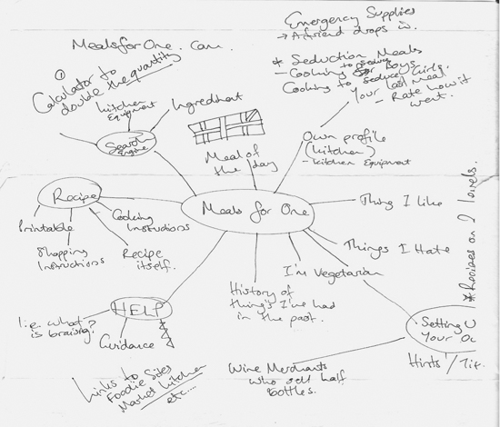

[5.14-P006] Figure 5.16. A mind map drawn while planning the business Good Food for One. This Web-based business provides recipes, shopping advice, and cooking tips for people who cook and eat alone. *Mind map by Joanna Kenneally. Used by permission.*

[5.14-P007] Note the quick sketches and the hastily scribbled words in **Figure 5.16**. Joanna Kenneally, the mind map’s author, was in a hurry. She wanted to start her business right away and needed a quick overview of what it would do; she wanted to record all her ideas, and see if they came together to form a viable business.

[5.14-P008] Mind maps are useful devices for organizing your thoughts. You can see the result of your thinking in one diagram—you get an overview and details at the same time—with each of your subtopics teased out to show divergence and connections. The mind map provides enough information—shown as keywords and links between those keywords—for you to get the overall picture. You can also decide to follow one of the branches, or make decisions based on having all the information laid out in a convenient format. Drawing small pictures on your mind map helps; they obviate the need to have as many words and have the advantage of being more easily remembered than words.

[5.14-P009] ***If you do not draw mind maps already, give them a try; nothing bad can happen.***

[5.14-P010] If you do not draw mind maps already, give them a try; nothing bad can happen to you. Start with the page in landscape format, and place your central subject in the center of it. The central idea should be some words, or a strong image, that tells you, or anyone who reads your mind map, what it is about. The first breakdown, or set of radiating lines, shows the major concepts, themes, ideas, or whatever subdivisions of your subject you choose. Write these ideas on the lines, using one or two words. Look for strong words that name and describe your ideas. And print rather than using cursive writing; the result will be both more readable and more memorable.

[5.14-P011] Use lines to make links between the ideas. We remember colors, so use colored lines for areas of the map that contain one theme. These lines can have arrowheads to denote direction, but most of the time the link between ideas is bidirectional.

[5.14-P012] Reading

[5.14-P013] Buzan, Tony, and Chris Griffiths. *Mind Maps for Business: Revolutionise Your Business Thinking and Practise.* BBC Active, 2009.

[5.14-P014] Mind maps cannot always be built from the center outward. Sometimes you get ideas, or hear things when you are taking notes, that have no connection to anything already in your map. Add it to the map anyway, because you will at some stage find a connection. Your mind map may not end up as organized and pretty as some examples you see, but it still makes sense to your mind—and that is the point. **Figure 5.17** provides an example.

[5.14-P015] 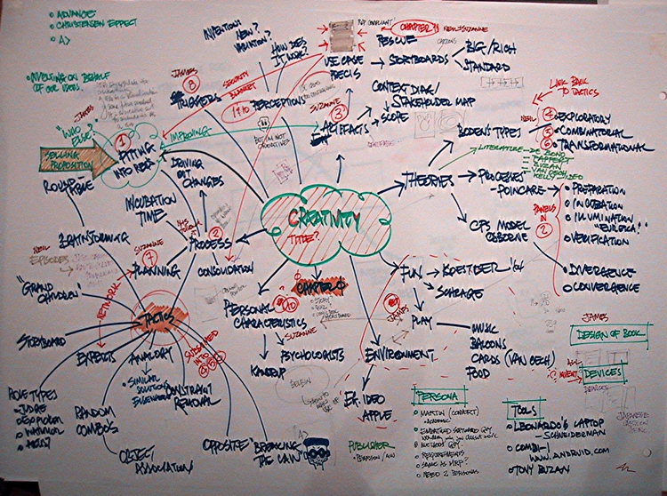

[5.14-P016] Figure 5.17. A mind map your authors drew when planning an article on innovation and creativity.

[5.14-P017] One last thing on the technique of drawing mind maps: Use the biggest sheet of paper or whiteboard you can find. Borrow a large drawing pad, or flip chart, or anything you can get your hands on. Spread out. Give your mind room to move. Amuse yourself with your mind map. And be as imaginative as you can.

[5.14-P018] You can, of course, buy software for drawing mind maps if you want to have them on your computer. There are plenty of mind mapping apps available. Your authors almost never use any of them, however, because it takes away the sheer spontaneity of using paper and colored pencils. We photograph ours for posterity (as in the case of **Figure 5.17**).

[5.14-P019] An alternative technological approach is to use Wacom’s Inkling as a way of recording your mind maps, along with your other sketches and handwritten notes. This technology uses plain paper on which you then draw or write, and faithfully records an electronic version of your drawing. It’s an impressive tool for those of us who like to sketch and doodle.

[5.14-P020] We use mind maps for note taking when interviewing stakeholders about their requirements. The benefit of using mind maps in these situations is realized when your stakeholder tells you about features and functions of their work and the new product. Some of these are linked, and many are dependent on others. By drawing your interviews in mind map format, you become more likely to see the connections as well as to spot connections that the client has not made, but should be explained. Think of the mind map as a more versatile note-taking tool—versatile, because you can replace all of the text it takes to establish connections by simply drawing a line.

[5.14-P021] The best way of learning to draw mind maps is to start drawing mind maps. Use the tips described in this book, or gather examples from the Web to help. But mainly, just start drawing. You will soon see your mind map come to life.

## 5.15 The Murder Book

[5.15-P001] Your authors spend too much time on airplanes. Reading light literature, particularly crime novels, is a favorite way to pass some of the long hours. Several authors, and in particular Michael Connelly and his Los Angeles detective Harry Bosch, make frequent reference to the *murder book*—a case file for a murder investigation. The murder book includes a trail of every document, interview, photograph, and other items of evidence collected during the investigation.

[5.15-P002] We often use this same approach with our business analysis assignments: We collect every document and other piece of “evidence” into a binder, sometimes several binders (see **Figure 5.18**). Like the detectives, our intention is to create a trail of items that can be referred to later from a central repository. Just as detectives often solve murders by going back through the murder book, so the business analyst can often find wonderfully useful material from the project murder book.

[5.15-P003] 

[5.15-P004] Figure 5.18. The murder book is a collection of documents and models generated by the requirements discovery project.

[5.15-P005] The technique is simple: Add every document, interview note, model, mind map, user story, and paper prototype—in fact, everything—to the murder book. This assumes, of course, that you have paper artifacts. If everything is electronic, then you have an electronic murder book. Add your artifacts in chronological order, and that’s about all there is to the technique—except the part where you need to know something, and the murder book is where you look.

[5.15-P006] The murder book provides a trail of the story of the development. In the future when problems arise (and they will arise), the solutions to the new problems usually depend on knowing what took place and why things were decided previously in the project. The murder book is intended to be documentation of your development project.

[5.15-P007] We like this kind of documentation, particularly because it is free. There is no need to write extra material; just collect everything that has been written.

[5.15-P008] Sometimes you need to go a little further with this kind of record keeping and provide some kind of document register to make it easier for others to find your documents (or whatever form your gathered information is in).

[5.15-P009] With the availability of excellent search engines, we can see future potential for the majority of documentation being in this form. Instead of you having to spend a huge amount of time filing and cataloguing documents, the search engine finds what you want when you want it.

## 5.16 Video and Photographs

[5.16-P001] 

[5.16-P002] ***A video or photograph is a way of capturing some moments in time so that you can study them later. It is a particularly useful technique if you want to show the current work to people who cannot visit the stakeholders’ workplace. We also take photos of whiteboards—to show the progression of ideas—and find that we often refer back to these images and include some of them in documents.***

[5.16-P003] ***Video and photographs are especially useful tools for distributed teams.***

[5.16-P004] Video can be used for studying the business. When users and business analysts participate in workshops and brainstorming sessions, for example, the proceedings may be videoed. Interviews and on-site observations may also be videoed. With this technique, video is used initially to record, and then confirm, the proceedings. In addition, you can show the video to developers who do not get the opportunity to meet face to face with the users.

[5.16-P005] *“Video records help fill in the spaces between the paragraphs of more formal written documentation by retaining off-hand remarks, body language, facial **expressions (like raised eyebrows), indications of stress in using the program, the ease of using the keyboard, and so on. Since it retains more information than language, which is simply an abstraction of the information on the tape, it retains the information more faithfully.”*

[5.16-P006] —DeGrace and Stahl

[5.16-P007] Video can serve as an adjunct to interviewing and observing the users in their own workplace. Users have their own ways of accomplishing tasks. They have their own ways to categorize the information that they use, and their own ways to solve problems that they have found worked well for them in their particular situation. Thus, by using video to capture the users at work, you also capture their ways of doing their jobs, their concerns, their preferences, and their idiosyncrasies.

[5.16-P008] Of course, video can be used in a more structured way as well. For example, you might select a business use case and ask the users to work through typical situations they encounter while you make a video recording of them. As they work, the users describe the special circumstances, the additional information they use, the exceptions, and so on. The shrugs, grimaces, and gestures that are normally lost when taking notes are faithfully recorded for later playback and dissection.

[5.16-P009] Obviously, you must ask permission before you begin to video someone. Keep in mind that whoever you are videoing will initially be very self-conscious in front of the camera, but subjects usually relax after a few minutes and accept the presence of the camera. Do not ask any important questions in the first five minutes, as the answers may be given for the benefit of the camera, and not for the benefit of accuracy.

[5.16-P010] We suggest that you try video in the following circumstances:

- [5.16-P011] Video users and developers participating in use case workshops and brainstorms.

- [5.16-P012] Video interviews and on-site observations.

- [5.16-P013] Video users at work.

- [5.16-P014] Video a business event. Ask the users to work through their typical response to an event, and to describe how they do their jobs.

- [5.16-P015] Send video to other members of a distributed team. We find the impact of video to be more involving for those who cannot see events firsthand.

[5.16-P016] Reading

[5.16-P017] DeGrace, Peter, and Leslie Hulet Stahl. *Wicked Problems, Righteous Solutions: A Catalogue of Modern Software Engineering Paradigms.* Yourdon Press, 1990. This book has been around for a long time, but it has some relevant ideas on video to pass along.

[5.16-P018] If video does not seem practical in your environment, then use photographs. We always carry a small camera (the one in your phone is the most convenient) as part of our business analysis kit. During interviews, meetings, and workshops, we photograph stakeholders, whiteboards, flip charts, offices, manufacturing plants, and anything else that we think will be useful in helping us to discover the requirements. We often include photographs in minutes and progress reports. Photos are an effective way of giving people a detailed review without having to write a huge report.

[5.16-P019] You might also consider other recording devices such as the voice recorder on your smartphone, or a Livescribe smartpen, which acts as a pen and a sound recorder simultaneously.

## 5.17 Wikis, Blogs, Discussion Forums

[5.17-P001] 

[5.17-P002] ***This technique can apply to many types of projects. However, because it requires participation from a number of stakeholders, it is most effective for larger projects.***

[5.17-P003] People love to contribute. The success of Facebook, Twitter, Wikipedia, and blogs demonstrate that, given a chance and a forum, people are happy to spend a little time (sometimes a lot of time) recording their opinions and knowledge. These contributions take many forms—you have probably used several—but for the sake of brevity we shall refer to them all as being posted to *wikis.*

[5.17-P004] The basic idea of a wiki in requirements discovery is that anyone—and the point is largely that *anyone* can do it—can make a post or edit or add to whatever has already been posted. Some forums keep discussions threaded so you can see it unfold; some allow contributors to overwrite or reorganize whatever they find. Additionally, anyone can add hypertext links to other useful sources of information or make any other kind of change.

[5.17-P005] Wikis rely on technology, but it is technology readily available to all. You can buy or download free hosting solutions to host your requirements wiki. If your organization will not give you the server space, then many publicly available sites are available. If you take the latter route, check carefully before you post what could be sensitive commercial information in the public domain.

[5.17-P006] To start a wiki, you seed it with an outline of the proposed product and invite stakeholders to add their piece. Once someone posts an opinion on what the product should do, you will no doubt find others chipping in to support or refute the original posting. Others invariably have their say, which usually results in a substantial collection of information and opinions. Anyone can contribute to a wiki; if a contributor is not one of the stakeholders whom you identified in the blastoff, it doesn’t matter. If a person has something to say, you want to hear it, and you want each of your contributors to see what the others are saying.

[5.17-P007] And it is free, or can be.

[5.17-P008] ***The Web is a bountiful source for requirements. Search for your domain of interest. You will likely uncover a lot of information on what other people have done in your domain and, if you are lucky, you will find information that you can readily convert to requirements for your product.***

[5.17-P009] The Web is a bountiful source for requirements. Search for your domain of interest. You will likely uncover a lot of information on what other people have done in your domain and, if you are lucky, you will find information that you can readily convert to requirements for your product. At the very least, you will find papers and articles that provide valuable information about your domain. And, like wikis, searching the Web is free.

## 5.18 Document Archeology

[5.18-P001] 

[5.18-P002] ***Document archeology is a technique of searching through existing reports and files for underlying requirements. It is best used when you have some existing or legacy system, and plan on modifying or renewing it.***

[5.18-P003] Document archeology involves determining the underlying requirements by inspecting the documents and files used by the business. It is not a complete technique, but rather should be used in conjunction with other techniques, and only with caution. Document archeology entails reverse engineering new requirements from the documents used or produced by the current work. Along the way, you look for requirements that should become part of the new product.

[5.18-P004] Obviously, not all of the old work will be carried forward; simply because something exists in a document does not mean that it automatically has to be part of a new system. Nevertheless, where a current system exists, it will always provide plenty of material that is grist for your requirements mill (see **Figure 5.19**).

[5.18-P005] 

[5.18-P006] Figure 5.19. In document archeology, you start by collecting samples of all documents, reports, forms, files, and so on. Gather anything that is used to record or send information, including regular telephone calls. User manuals are rich sources of material—they describe a way to do work.

[5.18-P007] Inspect the documents you have collected (for simplicity’s sake, the term “document” means anything you have collected), looking for nouns, or “things.” These can be column headings, named boxes on forms, or simply the name of a piece of data on the document.

[5.18-P008] For each “thing,” ask several of these questions:

- [5.18-P009] What is the purpose of this thing?

- [5.18-P010] Who uses it and why?

- [5.18-P011] What are all the uses the system makes of this thing?

- [5.18-P012] Which business events use or reference this thing?

- [5.18-P013] Can this thing have an alphanumeric value? For example, is it a number, a code, or a quantity?

- [5.18-P014] If so, to which collection of things does it belong? (Data modeling enthusiasts will immediately recognize the need to find the entity or class that owns the attribute.)

- [5.18-P015] Does the document contain a repeating group of things?

- [5.18-P016] If so, what is the collection of things called?

- [5.18-P017] Can you find a link between things?

- [5.18-P018] Which process makes the connection between them?

- [5.18-P019] Which rules are attached to each thing? In other words, which piece of business policy covers the thing?

- [5.18-P020] Which processes ensure that these rules are obeyed?

- [5.18-P021] Which documents give users the most problems?

[5.18-P022] These questions will not, in themselves, reveal all the requirements for the product. They will, however, give you plenty of background material and suggest directions for further investigation.

[5.18-P023] When doing document archeology, you search for capabilities from the current work that are needed for the new product. This does not mean you have carte blanche to replicate the old system—you are, in fact, gathering requirements because you plan to build a new product. Nevertheless, an existing system will usually have some capabilities in common with its replacement.

[5.18-P024] But be warned: Just because a document is output from a current computer or manual system, it does not mean that it is correct, nor does it mean that it is what is wanted by your client. Perhaps the document serves no useful purpose, or it needs heavy modification before it can be reused successfully.

[5.18-P025] We suggest that you incorporate document archeology into your data modeling approach, because most of the answers from the questions listed earlier are commonly used in the latter discipline. Of course, some document archeology is used as a foundation for object-oriented development. The current documents, if used cautiously, may reveal the classes of the data. They may also reveal the attributes of data stored by the system, and sometimes suggest operations that should be performed on the data.

[5.18-P026] As a rule, we always keep artifacts—documents, printouts, lists, manuals, screens, and anything else that is printed or displayed—from our interviews because we often refer back to them (see the earlier section on the murder book). Make a habit of asking for a copy of any document or screen that is mentioned. It is also prudent to log the document with an ID and version number, as it ensures that everyone has the same idea as to the source of their knowledge.

## 5.19 Family Therapy

[5.19-P001] Family therapists do not set out to make people *agree.* Instead, they aim to make it possible for people to hear and get an understanding of other individuals’ positions, even if they do not agree with them. In other words, you should not expect every stakeholder to agree with every other stakeholder, but you should help the stakeholders as a group to accept that other people may disagree without necessarily being wrong, and that the need for choices and compromises will always arise. Early in the project, identify which mechanisms you will use to deal with these situations when they inevitably occur.

[5.19-P002] ***Family therapists do not set out to make people agree. Instead, they aim to make it possible for people to hear and get an understanding of other individuals’ positions.***

[5.19-P003] The field of family therapy is a rich source of ideas about how to work effectively with a diverse group of people—such as stakeholders in a requirements trawling process. We use ideas from family therapy as a way of helping us to listen to stakeholders and of providing a feedback loop to help avoid misinterpretations.

[5.19-P004] Reading

[5.19-P005] Goldenberg, Herbert, and Irene Goldenberg. *Family Therapy: An Overview,* eighth edition. Brooks Cole, 2012.

## 5.20 Choosing the Best Trawling Technique

[5.20-P001] What is the best trawling technique? This is actually a trick question—there is no “best.” The technique you should use in any given situation depends on several factors. The first, and most important, is that you feel comfortable with the technique. There is nothing quite as dismaying to a stakeholder audience as to have their business analyst stumbling while trying to learn a technique and at the same time use it. If you are a right-brain person and prefer graphical approaches, then that is what you should do. If you are more of a left-brain thinker—that is, your preference is for serial thinking—then text-based techniques such as scenarios would be more attractive to you.

[5.20-P002] Similarly, your stakeholders must feel comfortable with whatever technique you have selected. If a stakeholder cannot understand the model you are showing him, then it is simply the wrong model to use.

[5.20-P003] There are a couple of other considerations:

- [5.20-P004] Geography: When you are selecting a technique, keep in mind the locations of the stakeholders. Some techniques are more readily adaptable to dispersed teams, or when you have to deal remotely with your stakeholders.

- [5.20-P005] Legacy: How much of the current implementation has to remain there? How much does this constraint affect possible future implementations? If you have to carry forward a considerable legacy, then some of the more abstract techniques will not be suitable.

- [5.20-P006] Abstraction: Are you in a situation where you can deal with the business in an abstract or essential way? In some cases your stakeholders are not abstract thinkers, and you have to concentrate more on techniques to deal with physical realities. In contrast, if you are dealing with the desired future state of the business, then techniques involving abstraction are favored.

- [5.20-P007] Knowledge: What is the domain of your work area? It is worth taking this factor into account when you are selecting a trawling technique. Some domains such as engineering are very physical, while others such as finance are more conceptual and you can use more abstract techniques.

[5.20-P008] **Table 5.1** lists various trawling techniques and summarizes their strengths. Some of these techniques have not yet been discussed; we will encounter them in later chapters. We suggest this table as a useful place for getting started in selecting a technique, or for finding alternative techniques to the ones you are using at the moment.

[5.20-P009] Table 5.1. Trawling Techniques and Their Strengths

[5.20-P010] 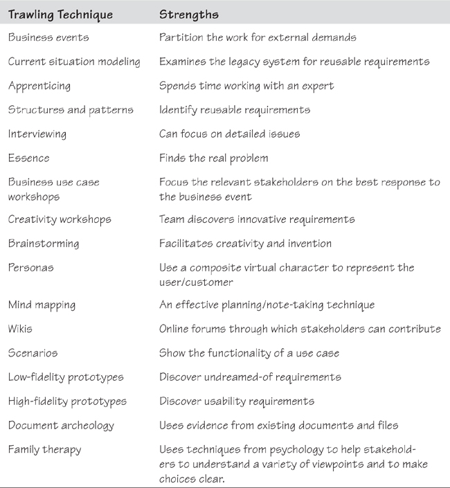

[5.20-P011] We also refer you to the owls in the margins; they indicate when particular techniques are most effective.

[5.20-P012] Always use techniques with which you and your stakeholders are comfortable. The best results come when you and the people you are dealing with feel at ease with the way you are working together to discover requirements. If a technique is not working for you, then try a different one.

## 5.21 Finally . . .

[5.21-P001] Trawling, as we have discussed it here, is concerned with uncovering and understanding the business. At first, the business analyst’s study is mainly concerned with the current work. This study should be done as rapidly as possible, and should be no more than is needed to reach a consensus among the stakeholders as to what the work actually is. The techniques presented in this chapter are tools intended to help with this study. Moreover, you have to do this work yourself—no tool has yet been invented that can do it for you.

[5.21-P002] *“You have two ears and one mouth. I suggest that you use them in that proportion.”*

[5.21-P003] —G. K. Chesterton

[5.21-P004] We have not spent much time with the most critical tools for a business analyst—the ones attached to either side of your head, and the big gray one between those. *Listening* is the most important technique in requirements gathering. If you can listen to what your owner and your other stakeholders are saying, and if you can *think* about what they say and understand what they mean, then the tools described in this chapter will be useful. Conversely, if you don’t listen and don’t think, then you are highly unlikely to uncover the product that the user really wants.

[5.21-P005] The trawling techniques are communication tools; they help you open a dialog with your stakeholders and provide the feedback that is so essential to good communication. Use them well and wisely.
