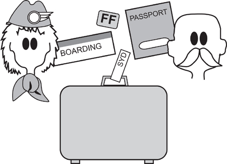
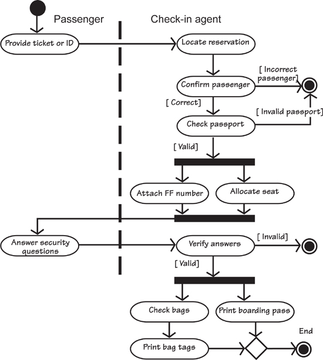

# 6. Scenarios

[6-P001] *in which we look at scenarios, and how the business analyst uses them to communicate with the stakeholders*

[6-P002] At this stage of the requirements process, you have identified the business events, and thereby the business use cases (BUCs) that respond to the events. Here we look at using scenarios to model and record the BUCs. We use scenarios a lot, and find them to be very effective, largely because of their ready acceptance by nontechnical stakeholders.

## 6.1 Formality Guide

[6.1-P001] Scenarios are useful in most situations—anyone can understand them, and they fit into every development style.

[6.1-P002] Rabbit projects can use scenarios as a trawling technique. The requirements analysts and the appropriate stakeholders come together to build a scenario for the business use cases. It is usually faster to discover the required functionality by working with scenarios than by coding prototypes. Rabbit scenarios usually overlook non-functional requirements, and capture them later by writing separate non-functional story cards.

[6.1-P003] 

[6.1-P004] Horse projects *might* consider scenarios as an alternative to writing atomic functional requirements. When they have been developed enough, they can serve to inform the developers of the functional needs of the product. However, this approach does not work all the time. If you have complex products, or if you need the functional requirements documented for contractual purposes, for example, you should use scenarios to discover the requirements—but do not use them as your final specification.

[6.1-P005] 

[6.1-P006] Elephant projects make use of scenarios as a discovery tool. The meetings with the stakeholders are occasions for reviewing the desired way of working for each of the business use cases. When the scenario is complete—that is, when the exceptions and alternatives have been discovered and/or decided—it is used as the basis for writing the functional requirements. Elephant projects should keep their scenarios as part of the documentation; usually the developers want to see them when they start programming.

[6.1-P007] 

## 6.2 Scenarios

[6.2-P001] A *scenario,* to give it its proper meaning, is an outline of a plot, or a postulated sequence of steps. In requirements work, we use this term to mean the plot of a section of the work we are studying. The use of “plot” is intended to imply that you break the work into a series of steps or scenes, and by explaining these steps, you explain the work.

[6.2-P002] ***The scenario tells the story of a business use case.***

[6.2-P003] In **Chapter 4**, we discussed how to partition the functionality of the work using business events; each chunk of the work we called a business use case. Now we look at using scenarios as a way of exploring and defining the functionality of the business use case. Consider the following scenario:

[6.2-P004] ***1. The moviegoer asks for movies based on her previously recorded preferences.***

[6.2-P005] ***2. The moviegoer filters the movies based on the time of screening and the location of the cinema.***

[6.2-P006] ***3. If requested, reviews of the shortlisted movies are provided.***

[6.2-P007] ***4. The moviegoer selects a movie.***

[6.2-P008] ***5. The moviegoer elects to buy the ticket online.***

[6.2-P009] ***6. Ticket details and a quick response code are sent to the moviegoer’s mobile phone.***

[6.2-P010] ***7. The moviegoer elects to send e-mails to selected friends with details of the movie and an invitation to join her at the movies.***

[6.2-P011] ***8. The moviegoer checks parking availability, and public transport options, for the cinema.***

[6.2-P012] ***9. The moviegoer sets an alarm to remind her when it is time to leave for the movies.***

[6.2-P013] A business analyst would use a scenario like this to elicit, and then describe, a business use case to its interested stakeholders. The BUC is a discrete amount of functionality; it happens in its own time frame, and can be considered separately from other parts of the work’s functionality.

[6.2-P014] Reading

[6.2-P015] For information on many other ways to use scenarios, see Alexander, Ian, and Neil Maiden. *Scenarios, Stories, Use Cases Through the Systems Development Life-Cycle.* John Wiley & Sons, 2004.

[6.2-P016] The scenario is a neutral medium, and one that is both simple and understandable to all stakeholders. But you don’t have to show it to all the stakeholders. When you are exploring a business use case, we suggest that you identify and invite only the interested stakeholders—those people with knowledge or expertise in the part of the work that you are modeling with your scenario.

[6.2-P017] You model a scenario and use it to reach agreement on what the work has to do. Once such agreement is achieved, you and the stakeholders decide how much of that work will be done by the product. You then produce one or more scenarios to define the actor’s (user’s) interaction with the product. This latter scenario is a product use case scenario—but we will put these scenarios aside for the moment and consider them more fully in **Chapter 8**, Starting the Solution. For the moment, let’s concentrate on the work.

[6.2-P018] *“A formal language for talking about work organizes concepts that help people learn to see work.”*

[6.2-P019] —Beyer and Holtzblatt, *Contextual Design*

[6.2-P020] We suggest that you write your scenario by breaking the functionality of the business use case down into a series of steps; each step being some meaningful and recognizable activity that forms part of the BUC. Ideally, you should aim for between three and ten steps. There is nothing carved in stone about this range, and nothing untoward will happen to you if you use more steps than ten. However, if you end up with 126 steps, either you have a gigantic business use case (impossible for normal commercial work) or you are writing your scenario with an unnecessarily meticulous level of granularity. The aim is to keep the scenario simple enough to be readily understandable, and three to ten steps usually achieves this goal.

[6.2-P021] ***Write your scenarios using between three and ten steps.***

[6.2-P022] Although a formalized template for a scenario exists (and is provided later in this chapter), your first draft can be simple and informal. As an example, let’s leave our IceBreaker case study for the moment and look at something that you are most likely familiar with: the business use case for checking a passenger onto an international flight (see **Figure 6.1**). Here’s Sherri, one of the check-in agents describing the check-in process. Keep in mind that she is describing the current way of working—the How-Now view of the work—which you are using to start your investigation:

[6.2-P023] “I call the next customer in line. When he gets to my desk, I ask for a ticket. If the passenger is using an e-ticket, I need the booking record locator. Most of the passengers are not organized enough to have it written down, so I ask them their name and the flight they are on. Most people don’t know the flight number, so I usually ask for their destination. They must know that!

[6.2-P024] “I make sure I have the right passenger and the right flight. It would be pretty embarrassing to give away someone else’s seat or to send a passenger to the wrong destination. Anyway, somehow I locate the passenger’s flight record in the computer. If he has not already given it to me, I ask for the passenger’s passport. I check that the picture looks like the passenger and that the passport is still valid.

[6.2-P025] “If there is no frequent-flyer [FF] number showing against the booking, I ask the passenger if he belongs to our mileage scheme. Either he hands me the plastic card with the FF number, or I ask him and if he wishes to join I give him the sign-up form. We can put temporary FF numbers against the flight record so the passenger is credited for that trip.

[6.2-P026] “If the computer has not already assigned a seat, I find one. This usually means I ask if the passenger prefers a window or an aisle seat, or, if the plane is already almost full, I tell him what I have available. Of course, if the computer has assigned a seat, I always ask if it is okay. One way or another we settle on a seat and I confirm it with the computer system. I can print the boarding pass at this stage, but I usually do the bags first.

[6.2-P027] “I ask how many bags the passenger is checking and, at the same time, verify that he is not exceeding the carry-on limit. Some people are unbelievable with what they want to carry into a fairly space-restricted aircraft cabin. I ask the security questions about the bags and get the passenger’s responses. I print out the bag tags and securely attach them to the bags, and then I send the bags on their way down the conveyor belt.

[6.2-P028] “Next I print the boarding pass. This means that I have everything done as far as the computer is concerned. But there is one more thing to do: I have to make sure that everything agrees with the passenger’s understanding. I read out from the boarding pass where he is going, what time the flight is, and what time it will board, and if a gate has been assigned, I tell him that, too. I also read out how many bags have been checked and confirm that their destination matches the passenger’s destination. I hand over the documents, and wish the passenger a good flight.”

[6.2-P029] 

[6.2-P030] Figure 6.1. An airline check-in for an international flight. As we go through the scenario for this case, see if it matches your experience of checking in for a flight.

[6.2-P031] Now sketch out the scenario. Break the story down to the steps that you consider to be the best ones to capture the normal path through the story. There are no hard-and-fast rules about how you accomplish this—just write whatever seems logical to you. After all, you are the person who is going to use the scenario; it might as well fit with your view of the work. Later you will adjust it with your subsequent activities, but for the moment let us suppose that this is your first draft:

[6.2-P032] ***1. Get the passenger’s ticket or record locator.***

[6.2-P033] ***2. Check that this is the right passenger, flight, and destination.***

[6.2-P034] ***3. Check that the passport is valid and belongs to the passenger.***

[6.2-P035] ***4. Record the frequent-flyer number.***

[6.2-P036] ***5. Find a seat.***

[6.2-P037] ***6. Ask security questions.***

[6.2-P038] ***7. Check the baggage onto the flight.***

[6.2-P039] ***8. Print and hand over the boarding pass and bag tags.***

[6.2-P040] ***9. “Have a nice flight.”***

[6.2-P041] ***Stakeholders are invited to participate and revise the scenario until it represents a consensus view of what the work should be.***

[6.2-P042] Confirm this scenario with the interested stakeholders. It is in plain English—that is intentional—so all stakeholders can be invited to participate and revise this scenario until it represents a consensus view of what the work should be. Once a consensus is reached on the work, start to formalize the scenario. Along the way, you will learn more about the work.

[6.2-P043] The first part of the formalized scenario identifies it and gives it a meaningful name.

[6.2-P044] **Business Use Case Name: Check passenger onto flight.**

[6.2-P045] Next, you add the start-up mechanism, or trigger, for the business use case. It usually consists of some data or request (often both) arriving from outside your work area. There are also time-triggered business use cases, in which case you state the time condition (an hour or a date is reached, an amount of time has passed since another business use case, and so on) that initiates the use case.

[6.2-P046] **Trigger: Passenger’s ticket, record locator, or identity and flight.**

[6.2-P047] As you model the work with your scenario, you should always be asking whether you can improve on the work. For example, instead of making the passenger wait to get to the desk, could you start before the passenger gets that far? For example, could he check in at home, or on the way to the airport, or while standing in line? All of these options are technologically possible and probably offer a business advantage. For the moment, we leave this question as an open issue.

[6.2-P048] Now you add any preconditions that must exist when the business use case is triggered. Preconditions indicate the state of the work at initiation. Usually this means certain other business events must have occurred before this business use case makes any sense.

[6.2-P049] **Preconditions: The passenger must have a reservation.**

[6.2-P050] The check-in desk is not the place to be if you do not already have a reservation. While it may seem like good service to allow passengers to make a reservation at the check-in desk, the amount of time needed for this transaction would no doubt annoy the other passengers standing in line.

[6.2-P051] You might consider adding the interested stakeholders to the scenario. These people have an interest in the outcome of the business use case—they will be affected by the manner in which the work is done and which data is produced by it.

[6.2-P052] **Interested Stakeholders: Check-in agent, marketing, baggage handling, reservations, flight manifest system, workflow, security, destination country’s immigration.**

[6.2-P053] There are probably more stakeholders, but this list is adequate to show that you are not only concerned with the immediate problem, but also recognize that whatever you do here has ramifications on a wider scale.

[6.2-P054] Active stakeholders are the people or systems that do the work of the business use case. Usually, one active stakeholder triggers the business use case, and then one or more others participate in the work.

[6.2-P055] **Active Stakeholders: Passenger (trigger), check-in agent.**

[6.2-P056] The passenger triggers the business use case by arriving at the check-in desk; he is also the recipient of the business use case’s output. The passenger interacts with the agent to carry out the work of the business use case. Although the agent manipulates any automated product being used, that action should be thought of as simply the current implementation; it has no binding significance. The essential business is triggered by the passenger, who, in some future incarnation, might be more closely involved. Self-check-in springs to mind here, but we should not leap to the first solution that comes along. The point of the requirements investigation is to fully understand the work before choosing a solution, and there are plenty of other possibilities—checking in by telephone while on the way to the airport, checking in at the club lounge, and using the record locator sent to the passenger’s mobile phone by the airline, to name just a few. But let’s not get ahead of ourselves.

## 6.3 The Essence of the Business

[6.3-P001] The scenario, as we now have it, represents the current incarnation of the work. If you think back to the Brown Cow Model from **Chapter 5**, this scenario belongs to the first quadrant of the model—the How-Now view of the work.

[6.3-P002] To move above the line and look at the What-Now and Future-What views, you must consider the essence of the problem. To do so, go back over the scenario and eliminate any technological bias, while simultaneously asking the question, “What does the business really need to do?”

[6.3-P003] ***The essence is not a better solution to the problem—it is the real problem.***

[6.3-P004] The essence is not a better solution to the problem—it is the real problem. You find the real business problem when you eliminate all the technological camouflage that normally makes up a description of some work. There will be more on essence in the next chapter.

[6.3-P005] ***Assume for the normal case that everything works perfectly.***

[6.3-P006] Also, for the moment, consider only the normal case scenario. The normal case (sometimes called the happy case) is when everything works perfectly. Of course, everything does not always work perfectly, so later you go back over the same scenario and explore the exceptions and alternatives.

[6.3-P007] Let’s revisit the check-in scenario, and this time change the language to be technologically neutral.

[6.3-P008] ***1. Get the passenger’s ticket, record locator, or identity and flight number.***

[6.3-P009] The ticket and the record locator are both constraints on the work. The ticket comes from outside the work—the passenger has been carrying it up to this point. The record locator is a constraint imposed by the current computer system. In this case it is a real constraint, not because a computer system uses it (the computer system belongs to the airline and, therefore, can be changed), but rather because it is used by travel agents and other bodies outside the scope of the organization. For this reason, we accept that it cannot be changed. However, the ticket and the record locator are merely means to an end—the real work to be done is to find the passenger’s reservation. Let’s rewrite step 1 to reflect this understanding:

[6.3-P010] ***1. Locate the passenger’s reservation.***

[6.3-P011] This is the essence of the first step. Stating it in the essential manner, without the technological artifacts, allows us to think of better ways of implementing it. If you want to rush ahead, you can see that there are several possibilities for the future product. Perhaps passengers could swipe a machine-readable passport, use a credit card, or use any of several other ways to identify themselves.

[6.3-P012] For now, put those ideas for future technology aside, and consider that the essence of the problem is to connect the passenger with his reservation.

[6.3-P013] ***2. Check that this is the right passenger, flight, and destination.***

[6.3-P014] This step focuses on ensuring that the passenger is who he says he is, and that the reservation matches his expectations for the flight. Let’s rewrite step 2 accordingly:

[6.3-P015] ***2. Ensure the passenger is correctly identified and connected to the right reservation.***

[6.3-P016] Next the scenario checks the passport.

[6.3-P017] ***3. Check that the passport is valid and belongs to the passenger.***

[6.3-P018] The passport step is slightly more complex and warrants a few words of explanation. We suggest enhancing this step:

[6.3-P019] ***3. Check that the passport is valid and belongs to the passenger.***

[6.3-P020] ***3.1 The passport must be current.***

[6.3-P021] ***3.2 The passport must not expire before the end of the complete trip.***

[6.3-P022] ***3.3 The passport must be valid for travel to the destination country.***

[6.3-P023] ***3.4 Visas (where needed) must be current.***

[6.3-P024] ***3.5 There must be no “refused entry” stamps from the destination country.***

[6.3-P025] Alternatively, you might simply leave this step as it was and refer to notes to complete the business rules for step 3.

[6.3-P026] ***3. Check that the passport is valid and belongs to the passenger.***

[6.3-P027] ***See procedure guidelines EU-175.***

[6.3-P028] This is the essence of the problem. There is an unyielding constraint that the passenger has a passport—this is international travel we are dealing with. The airline’s management needs to enforce the rules on passports because the airline is responsible for returning the passenger if he is refused entry to the destination country. All in all, this seems like a sensible constraint, so we keep it as part of the essence.

[6.3-P029] The same technique of scrubbing away the technology and getting to the essence is employed for later steps in the scenario. Keep working through it until you and your interested stakeholders agree that it is an accurate, but not yet detailed, portrayal of the work. When you are finished, it would look something like this:

[6.3-P030] ***Business Event: Passenger decides to check in.***

[6.3-P031] ***Business Use Case Name: Check passenger onto flight.***

[6.3-P032] ***Trigger: Passenger’s ticket, record locator, or identity and flight.***

[6.3-P033] ***Preconditions: The passenger must have a reservation and a passport.***

[6.3-P034] ***Interested Stakeholders: Check-in agent, marketing, baggage handling, reservations, flight manifest system, workflow, security, destination country’s immigration.***

[6.3-P035] ***Active Stakeholders: Passenger (trigger), check-in agent.***

[6.3-P036] ***1. Locate the passenger’s reservation.***

[6.3-P037] ***2. Ensure the passenger is correctly identified and connected to the right reservation.***

[6.3-P038] ***3. Check that the passport is valid and belongs to the passenger.***

[6.3-P039] ***See procedure guidelines EU-175.***

[6.3-P040] ***4. Attach the passenger’s frequent-flyer number to the reservation.***

[6.3-P041] ***5. Allocate a seat.***

[6.3-P042] ***6. Get the correct responses to the security questions.***

[6.3-P043] ***7. Check the baggage onto the flight.***

[6.3-P044] ***8. Print and convey to the passenger the boarding pass and bag tags.***

[6.3-P045] ***9. Wish the passenger a pleasant flight.***

[6.3-P046] ***Outcome: The passenger is recorded as checked onto the flight, the bags are assigned to the flight, a seat is allocated, and the passenger is in possession of a boarding pass and bag claim stubs.***

[6.3-P047] We add an outcome to the scenario—that is, the desired situation at the successful conclusion of the business use case. Think of it as the stakeholder’s objectives at the time he triggered the business use case.

## 6.4 Diagramming the Scenario

[6.4-P001] Some requirements analysts—and some stakeholders—prefer to use a diagram to explain the functionality of a business use case. This preference is a matter of personal choice, and it depends largely on whether your audience responds more favorably to text or to diagrammatic scenarios. We leave it to you to experiment and decide which form of representation is right for you.

[6.4-P002] Several diagrams can be used for scenarios. The UML (Unified Modeling Language) activity diagram is a popular choice. BPMN (Business Process Modeling Notation) also has its adherents, as do other styles of diagram. There is no best approach—just pick one that you like, or that your organization already uses. **Figure 6.2** shows the airline check-in example as a UML activity diagram.

[6.4-P003] 

[6.4-P004] Figure 6.2. An activity diagram showing the passenger checking in for a flight. This is the equivalent of the scenario shown previously.

[6.4-P005] In **Figure 6.2**, note the “swim lanes”—that is, the dotted lines that divide the work between the participants. Swim lanes are optional, and they are both good and bad: good because they provide a clear explanation of who is doing what; bad because they tread the dangerous path of inviting readers to believe that they define the way the work must be implemented in the future. Be aware that diagrams like **Figure 6.2** are used as explanations. Only after the systems architects and designers have done their work can the swim lanes be taken to mean a specification—more on that in the next chapter.

[6.4-P006] The activity diagram shows a certain amount of parallel processing. For example, there is no reason why the *Attach frequent-flyer number* and *Allocate seat* activities cannot be performed at the same time. The text scenario does not show this possibility. However, if you want to point out the parallel nature of these two activities, you could amend the scenario as follows:

[6.4-P007] ***The following two things can be done in any order or in parallel:***

[6.4-P008] ***4. Attach the frequent-flyer number to the reservation.***

[6.4-P009] ***5. Allocate a seat.***

[6.4-P010] The activity diagram also shows other control aspects. For example, the diamond at the bottom of the model in **Figure 6.2** is called a *merge.* This symbol means that all processing must reach this point before proceeding. In the case of the airline check-in, the entire process cannot end until both the bag tags and the boarding pass have been printed. Diamonds are also used to denote decisions, just as they are in traditional flowcharts. We tend to leave them out where the conditions are obvious or can be shown by attaching *guard conditions* (the words in brackets at the exit of an activity). When using activity diagrams during requirements, simplicity is more useful than correct and complete use of the notation.

[6.4-P011] The book you are reading does not attempt to be a treatise on UML modeling. The reason for including this discussion is so that you can look at the model and the text scenario in a side-by-side fashion, and decide how you can use either models or text to represent scenarios. For more on UML and BPMN, we refer you to the books mentioned in the “Reading” notes and the bibliography.

[6.4-P012] Reading

[6.4-P013] Allweyer, Thomas. *BPMN 2.0.* Herstellung und Verlag: Books on Demand GmbH, 2010.

[6.4-P014] Miles, Russ, and Kim Hamilton. *Learning UML 2.0.* O’Reilly Media, 2006.

## 6.5 Alternatives

[6.5-P001] Alternatives arise when you wish the user to have a choice of possible actions. These choices are intentional, as they are wanted and defined by the business. They usually exist to make the work of the business use case more attractive and convenient to the participants. When you buy books or music online, for example, you can decide whether to place your selected goods in a shopping cart awaiting check-out, or have them sent directly to you when you click “buy.” These deliberate choices offered by the vendor are alternatives.

[6.5-P002] ***Alternatives arise when you offer an intentional choice of user actions.***

[6.5-P003] The work reacts differently depending on which alternative is selected. Consider step 4 of our example case, to which we have added an alternative:

[6.5-P004] ***4. Attach the frequent-flyer number to the reservation.***

[6.5-P005] ***A4.1 Allow the FF number to be changed to that of a partner airline.***

[6.5-P006] You find alternatives by examining each step of the normal case. Look for instances where the step may be carried out differently, or the active stakeholder (you might call this person an actor) can be given a choice. These choices are sometimes interesting from the point of view of improving the work or providing a better service.

[6.5-P007] ***4. Attach the frequent-flyer number to the reservation.***

[6.5-P008] ***A4.1 Allow the FF number to be changed to that of a partner airline.***

[6.5-P009] ***A4.2 Allow the FF number to be changed to that of a family member,***

[6.5-P010] ***A4.3 Allow the mileage of the flight to be donated to a charity of the passenger’s choice.***

## 6.6 Exceptions

[6.6-P001] Exceptions are unwanted but inevitable deviations from the normal case. They are unwanted in the sense that the owner of the work would rather that they did not happen. Nevertheless, we know that they will happen from time to time, so we have to cater for them. For example, a passenger might not know the locator number, an online customer might forget his password, or a passenger could arrive at the airport having forgotten his passport.

[6.6-P002] ***Exceptions are unwanted but inevitable deviations from the normal case.***

[6.6-P003] We must pause here to urge you to delay looking for exceptions until you are satisfied with the normal case scenario. It is far too easy for stakeholders to get carried away with exceptions, and your review session with them can be quickly derailed by needlessly chasing exceptions that are not guaranteed ever to happen. It is only when you have the normal case that you can methodically work through it by looking for the exceptions and deciding what you will do about them.

[6.6-P004] The goal of the exception scenario is to show how the work safely handles the exception. In other words, which steps must be taken to rejoin the path of the normal case? You can write a separate scenario to show the exceptions, but in most cases it is more convenient to add the exception steps to your normal scenario.

[6.6-P005] Consider step 5 as an example:

[6.6-P006] ***5. Find a seat.***

[6.6-P007] ***E5.1 The passenger’s choice of seat is not available.***

[6.6-P008] ***E5.1 Record a request for a seat change by the gate agent.***

[6.6-P009] You find the exceptions by examining each step of the normal case and asking questions such as these:

- [6.6-P010] What happens if this step cannot be completed, or does not go to completion, or comes up with a wrong or unacceptable result?

- [6.6-P011] What can go wrong at this step?

- [6.6-P012] What could happen to prevent the work from reaching this step?

- [6.6-P013] Could any external entity disrupt or prevent this step, or this business use case?

- [6.6-P014] Could any technology used to implement this step fail or become unavailable?

- [6.6-P015] Could the end user fail to understand what is required of him, or misunderstand the information presented by the product?

- [6.6-P016] Could the end user take the wrong action—intentionally or unintentionally—or fail to respond?

[6.6-P017] There are many questions you can ask, each of which seeks to find a different potential error. We suggest that you make a checklist of the questions pertinent to your particular situation, adding to it each time a new project discovers new questions.

[6.6-P018] We have also seen some successful attempts to use automation to help with this task. Our colleague Neil Maiden at City University in London is having success using the university’s ART-SCENE scenario presenter. This tool works with the normal case scenario to automatically generate a list of potential exceptions. It also uses rich-media scenarios where additional information in the form of photographs, movies, sound, and so on is integrated into the scenario.

[6.6-P019] We know from experience that the exceptions have the potential to necessitate a great amount of remedial rework if they are not found at requirements time, so look carefully for things that could go wrong. You can ignore the scenario in which the work is struck by a meteor, but almost anything else is possible.

[6.6-P020] Reading

[6.6-P021] Details of ART-SCENE can be found at **http://hcid.soi.city.ac.uk/research/Artsceneindex.html**.

## 6.7 What if? Scenarios

[6.7-P001] What if? scenarios allow you to explore possibilities and question the business rules. You ask, “What if we did this?” or “What if we didn’t do that?” It becomes easier to find the many possibilities if you think about the constraints. Ask what would happen if the constraint did not exist. As an example, suppose that while going over the scenarios for the flight check-in case, you asked, “What if we took away the constraint of the check-in desk?

[6.7-P002] ***What if? scenarios allow you to explore possibilities.***

[6.7-P003] This freedom gives rise to all sorts of possibilities. Suppose you wrote your what if? scenario like this:

[6.7-P004] ***1. The passenger calls the airline while en route to the airport.***

[6.7-P005] ***2. Ask the passenger if he wants to check in.***

[6.7-P006] ***3. If yes, get the record locator from the passenger’s phone (this was sent at the time of the reservation).***

[6.7-P007] ***4. Check the passenger onto the flight, and text the seat allocation and passcode (the passenger’s phone will be scanned at the gates to allow the passenger to move through the airport).***

[6.7-P008] ***5. Text bag checks (these will activate the automated bag tag printers at curbside).***

[6.7-P009] ***6. Wish the passenger a pleasant flight.***

[6.7-P010] ***What if? scenarios are intended to stimulate creativity and guide your stakeholders to come up with more innovative products.***

[6.7-P011] What if? scenarios are intended to stimulate creativity and guide your stakeholders to come up with more innovative products. We shall revisit this topic in **Chapter 8**, Starting the Solution.

## 6.8 Misuse Cases and Negative Scenarios

[6.8-P001] Misuse cases (you might like to think of them as “unhappy cases”) show negative or harmful possibilities, such as someone abusing the work or attempting to defraud it. Examples include users deliberately entering incorrect data, customers using stolen credit cards, and pranksters making fictitious calls or transactions, planting a virus or other malware, or engaging in any of the myriad other things that can be done to harm the work.

[6.8-P002] *“Maybe ‘abuse cases’ will always sound jokey, but the idea of the Negative Scenario (e.g., Burglar impersonates householder, Alarm Call Center Operator colludes with Burglar, etc.) is important.”*

[6.8-P003] —Ian Alexander

[6.8-P004] It may be helpful here to think in terms drawn from fiction writing and use the idea of the protagonist and the antagonist. The protagonist is the hero or main character of the story: the good guy, the user, the actor using the product following your normal use case scenario. Winnie the Pooh is the ideal protagonist—he is well intentioned and you want him to win out in the end. But like Pooh, your protagonist might be of very little brain and make mistakes: forget his password, choose the wrong option, get honey on the keys, or any of the many unfortunate things a Pooh can do.

[6.8-P005] Cast your protagonist as someone who is forgetful, slow, distracted, and not paying attention. (You are bound to know someone like that.) Go through the normal case scenario, and for each step, ask what can be done wrongly. It may be simpler to write a new scenario for each misuse, as the ramifications of a misstep may be complex enough to warrant their own separate story.

[6.8-P006] ***Examine all of the steps for the normal case and ask if there is a possibility of someone opposing or misusing that action.***

[6.8-P007] So much for the protagonist. The antagonist is the person who opposes the work, seeks to harm it, or wants to defraud it. Hackers are the most commonly thought-of example of antagonists. Examine all of the steps for the normal case and ask if there is a possibility of someone opposing or misusing that action. In this case, the ramifications upon discovering an antagonist’s misuse may be to simply stop the business use case. For example:

[6.8-P008] ***3. Check the passport is valid and belongs to the passenger.***

[6.8-P009] ***M3.1 The passenger produces a passport that is not his.***

[6.8-P010] ***M3.2 Call security.***

[6.8-P011] ***M3.3 Freeze the reservation.***

[6.8-P012] Whether you annotate the normal case with the misuse steps or write a separate misuse scenario depends on the complexity of the situation and the comfort level of the stakeholders.

[6.8-P013] *“I don’t always try to identify the predator flows. I use the same flows as other actors but ask the question, What if a hacker got here? What other precautions need to be implemented? What is the risk to the corporation if they get here? Can the corporation live with the risk of occurrence? How much are you willing to pay to avoid the risk?”*

[6.8-P014] —Patricia Ferdinandi, *A Requirements Pattern: Succeeding in the Internet Economy,* Addison-Wesley, 200

[6.8-P015] Some professions have always made use of what if? scenarios. For instance, chess players routinely think, “What would Black do if I moved my knight to e4?”, leading to the minimize–maximize algorithms for game-play. Our governments routinely generate what if? scenarios to plan policy: “What if the United States reestablished the gold standard?” “What if Switzerland elects a communist government?” “What if Canada closes the St. Lawrence Seaway?” While these examples are obviously fanciful, most governments generate thousands of likely and unlikely scenarios to explore their reactions to possible future events.

[6.8-P016] When gathering requirements, try generating several what if? scenarios to experiment with the unforeseen. The intention is to turn the unforeseen into the foreseen: The more you know about eventualities before you build the product, the more robust and long-lasting it will be.

## 6.9 Scenario Template

[6.9-P001] You may, of course, write your business use case scenarios in whatever form you and your stakeholders prefer. The template presented in this section is one we have found useful on many assignments. We suggest it as a fairly good compromise between informality and an overly bureaucratic approach.

[6.9-P002] **Business Event Name:** The name of the business event to which the business use case responds.

[6.9-P003] **Business Use Case Name and Number:** Give each business use case a unique identifier and a name that communicates the functionality—for example, Record Library Loan, Register New Student Enrollment, Make Benefit Payment, Produce Sales Report. Ideally, the name should be an active verb plus a specific direct object.

[6.9-P004] **Trigger:** The data or request for a service that arrives from an external source and triggers a response from the work. The trigger may be the arrival of data from one of the adjacent systems—that is, from outside the work area that you are studying. Alternatively, the trigger may be the arrival of the temporal condition that causes the use case to become activated—for example, the end of the month.

[6.9-P005] **Preconditions:** Sometimes certain conditions must exist before the use case is valid. For example, a customer has to be registered before he can access his frequent-flyer statement. Note that another business use case usually takes care of the precondition. In the preceding example, the customer would have registered using the Register Passenger business use case.

[6.9-P006] **Interested Stakeholders:** The people, organizations, and/or representatives of computer systems that have knowledge necessary to specify this use case or that have an interest in this use case.

[6.9-P007] **Active Stakeholders:** The people, organizations, and/or computer systems that are doing the work of this use case. Don’t think about users just yet; instead, think of the real people who are involved in the work of the business use case.

[6.9-P008] **Normal Case Steps:** The steps that this use case goes through to complete the desired course of its work. Write these steps as clear, natural-language statements that are understandable to business people related to the project. There are usually between three and ten steps.

[6.9-P009] Step 1 . . .

[6.9-P010] Step 2 . . .

[6.9-P011] Step 3 . . .

[6.9-P012] *Note that a business use case can make use of the services or functionality of another business use case as part of its own processing. However, be careful not to start programming at this stage.*

[6.9-P013] **Alternatives:** Alternatives are acceptable variations on the normal case of processing. For example, gold cardholders may be given an invitation to visit the lounge when they check in. Tell the story in the same way:

[6.9-P014] Alternative step 1 . . .

[6.9-P015] Alternative step 2 . . .

[6.9-P016] Alternative step 3 . . .

[6.9-P017] If the alternative action is simple, you can make it part of the normal case:

[6.9-P018] Step 4. Attach the frequent-flyer number to the reservation.

[6.9-P019] Alternative 4.1 Issue a lounge invitation if the passenger holds a gold card.

[6.9-P020] **Exceptions:** These cases are unwanted but inevitable variations. For example, a customer may have insufficient funds for a withdrawal at an ATM. In this case, the procedure has to offer a lower amount, or offer a loan, or do whatever the stakeholders decide is appropriate. Tag each exception to the appropriate step:

[6.9-P021] Exception 2.1 . . .

[6.9-P022] Exception 2.2 . . .

[6.9-P023] Exception 2.3 . . .

[6.9-P024] **Outcome:** The desired situation at the end of this use case. You might call this the “post condition.” Think of it as the stakeholder’s objective at the time when he triggers the use case. For example, the money has been dispensed and taken from the ATM, the customer’s account has been debited, and the card has been extracted from the ATM.

## 6.10 Summary

[6.10-P001] A scenario is a natural language tool for telling a story. We have discussed how to write this story; its intention is to help you and your stakeholders come to a coherent understanding of the functionality of a business use case. Writing the BUC scenario tests whether sufficient study has been done or the business analyst needs to ask more questions and investigate further.

[6.10-P002] Once the BUC scenario is agreed—that is, you and your stakeholders have come to a consensus that it accurately represents the desired state of the work—it forms the basis for writing the requirements. We shall explore this progression, including the use of scenarios for product use cases, over the next few chapters.
