# 7. Understanding the Real Problem

[7-P001] *in which we “think above the line” to find the true essence of the business, and so deliver the right product—one that solves the right problem*

[7-P002] *I know that’s what I asked for, but it’s not what I need.* You do not have to be part of IT very long to hear that statement and to see the expectant smiles dashed from the developers’ faces—it happens all the time. So what is going wrong here? The developers have delivered exactly what the business stakeholders asked for, but it turns out not to solve their business problem. Why not? *Because the real problem was never stated, and so was never correctly understood.*

[7-P003] When stakeholders ask for some feature or capability, they quite often state their request as an implementation. “I want an external disk to back up my laptop’s drive.” This is a business stakeholder asking for a solution to a problem, but not really saying what that problem is. How can you know if it is the correct solution? You can’t; and until you know what the real problem is there is little point in thinking about solutions.

[7-P004] *“At the end of the day, if the software doesn’t meet the user’s needs, it is still lousy software regardless of how it was created.”*

[7-P005] —Pete McBreen, *Questioning Extreme Programming*

[7-P006] So what is this user’s problem? What does he really need?

[7-P007] If our stakeholder is concerned that his laptop’s hard drive will crash, then perhaps the correct solution is to replace the hard drive with something more reliable. If the user is concerned that his computer will be stolen from the office, then the thieves will most probably cart away the backup drive as well. And if there is a fire, then the backup drive will melt down at about the same time as this guy’s computer.

[7-P008] There’s more: The user wants to back up his hard drive, which suggests that at some stage every day or every week he will boot up the backup program and do the backup. But what if he forgets? Is the real business need still being met if the solution relies on fallible human memory?

[7-P009] In this chapter we talk about how to get to the real problem by using *abstraction*—focusing on ideas rather than solutions. To put it another way, abstraction involves thinking about the *essence* of the subject by discarding the technological and physical components.

[7-P010] 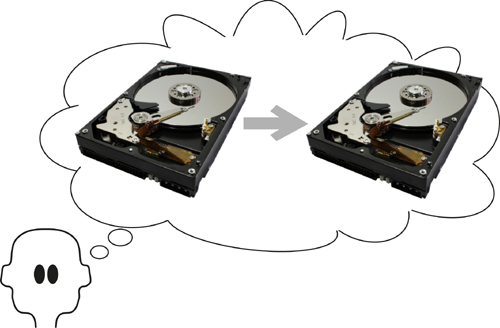

[7-P011] Figure 7.1. The problem is to back up the hard drive—or is it?

[7-P012] Thus, instead of the suggested physical implementation “Back up the hard drive,” you look at the essence and say, “Eliminate loss of data” or “Guard the data against theft” or “Guard the data against fire.” Once you understand the real problem—the underlying business need—then you are much better placed to find the optimal solution for it. So, dear reader, before you leap to a solution for the backup problem—which can range from frequent, automated uploads to a cloud service, to attaching the laptop to a well-trained attack Rottweiler and giving it an exit from the building in case of fire—we want you to consider the idea of abstraction, and how it can work for you.

[7-P013] ***The physical reality was that the company rented DVDs. But if you abstract from that, you see that Netflix is in the business of renting out movies.***

[7-P014] Let’s look at an example of abstraction. Netflix, an American company, had a successful business renting out DVDs though the mail. In return for a monthly fee, customers could have several Netflix DVDs at home, and when they had watched one and returned it, another was sent. At the time when Netflix was founded, this was a new business model for renting movies. But at some point Netflix looked at the abstraction of its business. The physical reality was that the company rented DVDs, but if you abstract from that, you see that Netflix is in the business of *renting out movies.*

[7-P015] Now that we see the real business is about renting movies, we ask if there is a different, more convenient way to do so? Well, yes. Netflix found it and switched its business to providing *downloadable* movies. This model put the customers in direct contact with the Netflix website, and gave the customers even better service by providing a wide choice of instantly available movies, along with the convenience of not having to return their watched DVDs through the mail. By adopting this approach, Netflix changed its operation to be closer to the essence of the problem.

[7-P016] In **Chapter 5**, Investigating the Work, we considered how you go about studying the current state of the piece of the business you are meant to improve. We said at the time that this initial study is undertaken simply to ensure that you and your stakeholders are talking about the same piece of business, and that you have a reasonable idea of the current state of the work. However, when you looked at the business, you saw the physical artifacts and devices that are used to carry out the work.

[7-P017] In this chapter we intend to eliminate the devices and technology that you encountered, and so uncover the real intent of the work.

## 7.1 Formality Guide

[7.1-P001] No matter how formal or informal you are, or how agile or how traditional you are, or want to be, you still have to build something that meets the real needs. Otherwise, you are simply wasting your client’s money and your own time.

[7.1-P002] This chapter is of particular importance to rabbits. As a rabbit project, you are likely to be using techniques such as story cards, Post-it notes, or sketches on a whiteboard. These artifacts display, more often than not, proposed solutions to unstated problems. By finding the essence of the problem, your solution will be far more appropriate, and usually more elegant. The essence does not have to be written as the first draft of the story card (it helps if it is) but it must be revealed during the requirements conversation.

[7.1-P003] 

[7.1-P004] Horse projects’ aspirations to informality are helped if the business analysts and the stakeholders talk about only the essence of the work. Using this approach, they generate fewer models and possibly cut down on the amount of communication needed.

[7.1-P005] 

[7.1-P006] Elephant projects might involve outsourced development, in which case it is vital that they solve the right problem. If not, the delivered product has to be corrected and the outsourcer charges for the corrections.

[7.1-P007] 

[7.1-P008] Similarly, if the elephant project has more formal internal procedures, and the complete specification is handed to the developers before any construction begins, then a time lag will separate the requirements activity and the software delivery. As repair to the system is now difficult, it becomes vital that the specification is specifying the correct product—one that meets the real needs.

## 7.2 The Brown Cow Model: Thinking Above the Line

[7.2-P001] The Brown Cow Model, which we introduced earlier in this text, is shown in **Figure 7.2**. **Chapter 5**, Investigating the Work, discussed how to study the current business. That investigation is represented by the lower-left quadrant of the model, the How-Now view of the business. In fact, anything below the line—the “how”—shows the physical devices and human organizations used to implement the solution.

[7.2-P002] 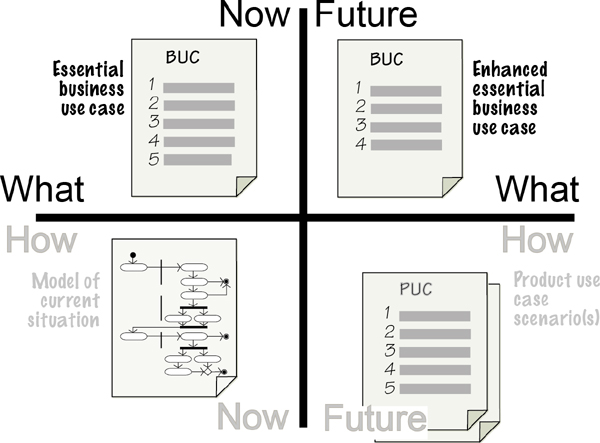

[7.2-P003] Figure 7.2. The Brown Cow Model provides four views of the work, each of which provides the business analyst with information that is useful at different stages of the investigation. In this chapter we look above the line.

### 7.2.1 The Essence

[7.2.1-P001] Now it is time to move above the horizontal line that separates the “how” from the “what.” Here’s where you see the real business—that which we refer to as the *essence* of the business. Up here the air is rarified and you do not need to deal with the mundane, real-world issues of people and technology; instead, you take an abstract view and discover what the business is really doing. Once you see that, you move to what you would like to be doing in the future. In the Brown Cow Model, these views are shown by the What-Now and the Future-What quadrants.

[7.2.1-P002] *“If I had an hour to save the world, I would spend 59 minutes defining the problem.”*

[7.2.1-P003] —Albert Einstein

[7.2.1-P004] The reason for spending time above the line is to discover the real problem and avoid what happens in many organizations where people waste their entire 60 minutes building solutions to the wrong problems.

[7.2.1-P005] When you are trawling for knowledge, much of what you hear is a stakeholder’s idea for a *solution,* not a description of the underlying problem to be solved. This could be a terrific solution, but more likely it is a solution limited by the stakeholder’s experience and imagination. Moreover, as yet you (and your stakeholder) have no idea whether it is solving the right problem. So your task as the requirements discoverer is to interpret what your stakeholder is saying and uncover its essence.

[7.2.1-P006] ***Separate the essence of the problem from any proposed solution.***

[7.2.1-P007] How the work physically accomplishes its functionality—the technology, the instruments, the computers, the people, and so on—is its implementation. To get to its essence, you must ignore any current or future implementation, and reveal the fundamental reason that the work exists. There are several reasons for doing so: The first, and most important, reason is that you solve the right problem—this is obvious but often overlooked. The second reason is that finding the essence means that you don’t inadvertently reimplement outmoded technology. Technology and the organizational structure that were appropriate several years ago when the current system was built will not necessarily be the relevant solution today. And if that is not enough, getting to the essence means that you can avoid the proposed flavor-of-the-month solution that your stakeholder is fixating on.

[7.2.1-P008] ***The essence exists regardless of any technological implementation.***

[7.2.1-P009] The problem, meaning the real business problem you are trying to solve, exists regardless of any technological implementation. This underling business problem—perhaps you prefer to call this the policy—is the essence.

[7.2.1-P010] You can reverse engineer the essence from a technological implementation. For example, think of an automated teller machine: What is the essential piece of business that you conduct with an ATM? The actions that you have to take—such as insert a plastic card, enter a PIN, have your retina scanned, and so on—involve interacting with the technology the bank chooses to use. The essence, however, is that you safely access your bank account and withdraw money from it.

[7.2.1-P011] Reading

[7.2.1-P012] McMenamin, Steve, and John Palmer. *Essential Systems Analysis.* Yourdon Press, 1984. This was the first book to discuss the essence of the business. Sadly, it is out of print, but you can sometimes find a copy on secondhand book sites.

[7.2.1-P013] Note how technology-free that statement is: “You safely access your bank account and withdraw money from it.” Consider it, and now consider how many other ways you could “safely access your account and withdraw money from it.” Lots of technological possibilities exist. For example, when you use the “cash back” option with your debit card at the supermarket, you are accessing your bank account and withdrawing money from it. That the supermarket forces you to use your debit card and buy something is part of that business’s solution; it does not change the essence.

[7.2.1-P014] And that is the point: You are looking for the essence of the business. How you implement it—now or in the future—is not part of the essence and so is not important to you at the moment. If you ignore the essence and jump straight to writing a requirement that contains a technological element, then that technology becomes the requirement and as a result will be implemented. For example, suppose that you have a requirement like this:

[7.2.1-P015] ***The product shall beep and put a flashing message on the screen if a weather station fails to transmit readings.***

[7.2.1-P016] ***If a requirement contains the means of implementation, then it is a solution, not a requirement.***

[7.2.1-P017] What’s wrong here? Several things. First, the “requirement” contains technology—the screen and flashing message—that might not be the best solution. Additionally, an assumption is made that the operator will see the flashing message, pick up the phone, and call for repairs. The developer is being asked to implement exactly what the requirement says. Even worse, this statement is covering up the real need. If you ask the simple question as to why this requirement exists—in other words, what its essence is—then the answer should be obvious: There is a need to repair a defective weather station.

[7.2.1-P018] Now that the essence of the problem is clear, you can think about solutions for it. It is beyond the scope of the IceBreaker work to actually repair the station, but you get a lot closer to the essence if the product sends an alert directly to the repair crew. So you rewrite the requirement as follows:

[7.2.1-P019] ***The product shall alert the repair crew when a weather station fails to transmit its readings.***

[7.2.1-P020] Because you have described the real, *essential* requirement, the designer can now cast about and find the most appropriate solution to the correct problem, and the eventual solution will almost certainly be superior.

[7.2.1-P021] As another example, consider this requirement for a ticket-selling product for a metro train:

[7.2.1-P022] ***The traveler shall touch the destination on a route map on a screen.***

[7.2.1-P023] The stakeholder providing this requirement wanted to employ a touch-sensitive map of the metro network and have the travelers indicate their destination station using their fingers. The product would compute the appropriate fare and, as a bonus, could show an illuminated pathway of the fastest route to the destination. This might be a clever implementation, but the requirement as it now stands does not get to the essence of the problem. The designers could well find better ways to implement a solution if the requirement is expressed in its essential form:

[7.2.1-P024] ***The product shall determine the traveler’s destination.***

[7.2.1-P025] The designer is now free to find the best way to implement the essence, and can use other technologies to get the traveler’s destination into the product. (The touch screen—the stakeholder’s first guess at a solution—turned out to be a bad idea: The metro was in a tourist city, and studies showed that many tourists and some regular commuters were not familiar with the rail network and could not locate their destination quickly enough to achieve the target usage speed.)

[7.2.1-P026] Simply put, the requirement should not prejudge the implementation, no matter how appealing the technology might be.

[7.2.1-P027] ***When you address the real issues, your solution does not have to be chopped up and changed as successive users tweak it to do the job it should have been doing all along.***

[7.2.1-P028] Letting go of these preconceptions is not always easy, and over the years we have found the essence to be one of the hardest concepts to convey to our clients and students. It is subtly even more difficult if you are using one of the agile techniques. Agile techniques were developed to produce solutions as efficiently as possible. While these techniques prescribe a conversation between the developers and the business representative, they do not prescribe getting to the essence of the problem and ensuring that your solution is addressing the real problem. You can change this perspective by making the business analyst become part of the conversation, with the responsibility of guiding the participants toward the essence of the problem. An effective way to do so is to have one story card or model containing the suggested solution—there’s no reason why you can’t start with that—and another story card containing the essence of the problem. Using this quick multiple-viewpoint technique enables you to capture ideas for the solution in parallel with deriving the real essence of the problem. We have found that the more the team members share the understanding of the essence, the more likely they are to change the first idea for solution because they recognize the real problem and almost always find a better solution for it.

[7.2.1-P029] If you make the effort to change your process to include discovery of the essence, then you will unearth not only the best solution, but also one that will last even after today’s technology falls out of favor. When you address the real issues, your solution does not have to be chopped up and changed as successive users tweak it to do the job it should have been doing all along.

### 7.2.2 Abstraction

[7.2.2-P001] *“Perfection is achieved, not when there is nothing more to add, but when there is nothing left to take away.”*

[7.2.2-P002] —Antoine de Saint-Exupery

[7.2.2-P003] At this stage, it might be helpful to talk a little about *abstraction*. Abstraction and getting to the essence are pretty much the same thing, but possibly abstraction is the more natural way to think about this concept. The word has Latin roots—*abs,* which “means away from,” and *trahere*, which means “to draw.” Thus abstraction, as we use the term here, is drawing away or removing physical implementation so as to reduce it to its essential characteristics. In other words, an abstraction is the idea, not the implementation.

[7.2.2-P004] As an example of abstraction, you probably have several of the following media: CD, vinyl record, cassette tape, iPod, online streaming service, radio, MTV, DVD, and so on. Each of these is an implementation; their abstraction is music. Music is still music no matter how you reproduce it.

[7.2.2-P005] Similarly, a business process is a set of activities no matter how you implement it. It does not matter whether the process (now or in the future) is done by a person, computer, robot, mechanical device, or anything else: It is simply a business process. Data is data regardless of whether it is stored in a database, USB flash drive, book, human memory, whiteboard, DVD, the cloud, or any other piece of technology.

[7.2.2-P006] Thinking about the abstraction sets you free to find a better implementation. The iPod is a fine MP3 player and for several years has been the preferred player for many people. Even so, if you think of its essence—it plays music—then you are free to find other implementations for that essence, and it is just a small step to find a more convenient implementation. The obvious one is to put this functionality into a telephone, which you are more likely to be carrying about with you. If you think about it, calling it a “telephone” is somewhat of an essential misnomer: A phone today likely plays music, takes photos, organizes your appointments, lets you read books and newspapers, and—inevitably—plays games.

[7.2.2-P007] The moral of the story is that for any piece of technology—no matter how beguiling state of the art and attractive it is—you must abstract out the technology and see its underlying essential purpose. Or to paraphrase John F. Kennedy, “Ask not what your technology can do for you, but what the technology is doing.”

### 7.2.3 Swim Lanes Begone

[7.2.3-P001] Let’s look at a way that business analysts sometimes accidently introduce implementation artifacts into the business problem.

[7.2.3-P002] Some business analysts go to a great deal of trouble to add swim lanes to their process models, such as those seen in **Figure 7.3**. We spoke about modeling the current situation in **Chapter 5**; while a view of the current implementation is certainly useful, it is also important for the business analyst to ensure that current implementation details are not unnecessarily carried any further. If left there, the swim lanes on the model mislead readers into thinking that the processor boundaries they represent should be preserved for any future implementation. That’s probably not what you want. Let’s look more closely at the example.

[7.2.3-P003] 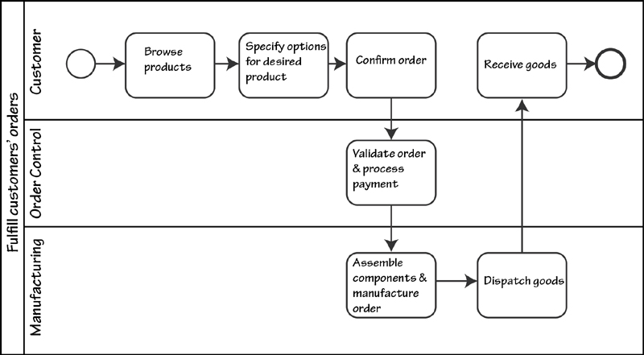

[7.2.3-P004] Figure 7.3. A typical process model showing swim lanes; the horizontal lines on the diagram divide the work by current departmental responsibility.

[7.2.3-P005] **Figure 7.3** shows a model of a business process for a company that processes custom-made furniture. In this model the company’s departments show up as swim lanes separating each of the organization’s current divisions, and these divisions cover up the essence of the problem.

[7.2.3-P006] It works like this: Customers come to the company’s website to specify and buy their furniture. From the offered components, customers virtually assemble their desired furniture on-screen, and this mockup acts as the specification for the product they want. Once the customer confirms the order, the Order Control department takes over; it validates the order and processes the customer’s payment. The paid-for order is sent to the Manufacturing department for construction. At this point the production schedule is updated with the work needed to produce the goods. Herein lies the problem.

[7.2.3-P007] Suppose that the Manufacturing department do not have the necessary components and material to complete the order and it will be several weeks or months before the necessary components are available. Or suppose that Manufacturing is so backed up with orders that this new order will not reach the top of the queue for five weeks. Now we have a situation where the customer might want to cancel the order, but, as you can see in the **Figure 7.3**, the customer has already paid for the goods.

[7.2.3-P008] Now delete the swim lanes on this model, and the problem of scheduling becomes quite apparent. At this stage a savvy business analyst would insert a *Prepare Order & Check Inventory* activity *before* the *Confirm Order* activity, as shown in **Figure 7.4**. By seeing the activities without the swim lanes, the analyst is able to rearrange the process to achieve a better situation, one where the customer knows the delivery time before confirming the order. This could well avert disappointment for customers who are making orders as gifts for birthdays, anniversaries, or Christmas.

[7.2.3-P009] 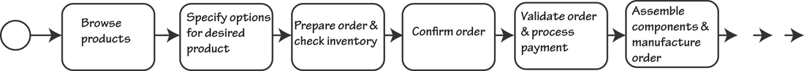

[7.2.3-P010] Figure 7.4. The model of the business after removing the swim lanes. Note how the customer can abort the transaction if the inventory is not available. The *Confirm Order* process can now advise the customer of the delivery date.

[7.2.3-P011] When the swim lanes are removed from the model, it is far easier for the business analyst and the stakeholders to see that activities do not have to be carried out in the same place or in the same order in which they have traditionally been done.

[7.2.3-P012] ***Remove the swim lanes and see the end-to-end business.***

[7.2.3-P013] An important step in looking for the essence of the business is to see the end-to-end process and to ignore the current way of dividing the work up among departments. Departments—indeed, any processors (human or automated)—are a result of the way the work was done in the past. Because it arose based on the technology or the business structure available at the time, the current implementation frequently hides the true essence of the business.

[7.2.3-P014] Some stakeholders have a problem seeing the work without departmental boundaries, and you may have to convince them that departments are not part of the essence. Step back for a moment and consider why we have departments in our organizations: They exist because we employ humans to do the work. There are very few humans with all the talents needed to do all the tasks in any one organization; as a consequence, we divide the organization up according to the skills of the people we employ. If we did not employ humans, but had a collection of robots that were so multitalented as to be able to carry out all of the tasks needed, then it would be foolish indeed to divide the robots by department (or indeed give them managers). Departments—and please keep in mind that these entities show up as swim lanes in process models—are present merely because of past employment policy.

[7.2.3-P015] We urge you to banish your swim lanes and look at the whole of the pool.

## 7.3 Solving the Right Problem

[7.3-P001] 

[7.3-P002] ***The way of thinking discussed here follows from understanding the abstracted essence. This section is relevant to all requirements analysts, regardless of the size or nature of the project. It is equally applicable to iterative and traditional development methods.***

[7.3-P003] You do not have to be around long before you will observe firsthand the following scenario: The project team builds what they consider to be a really cool product. Yet somehow, despite the project team’s enthusiastic cheerleading from the sidelines, not to mention the expense of building the product, the users never seem to put it to use, or use it half-heartedly for a short time and then ask for a truckload of changes. Why, in spite of the project team’s best efforts, did this become a pariah product?

[7.3-P004] Because it solved the wrong problem.

[7.3-P005] One of our clients, a financial institution, was looking into building a new system that would allow passwords to be reset more efficiently. This task posed a major problem for the organization; the cost of securely establishing its customers’ bona fides before resetting their passwords was running at several million dollars per year. The proposed new system would reduce some of the cost of resetting the password.

[7.3-P006] But what is really happening here? The system producers are looking at a slick new system to establish bona fides more effectively. The real problem—the one they are avoiding or just not seeing—is that *customers forget their passwords*.

[7.3-P007] Reading

[7.3-P008] Gause, Don, and Jerry Weinberg. *Are Your Lights On? How to Figure Out What the Problem Really Is.* Dorset House, 1990. This book is now quite old and hard to find, but G&W have some delicious things to say about finding the real problem.

[7.3-P009] The problem the team should be looking at is finding a way for customers to generate secure passwords that they are very unlikely to forget (it can be done). Of course, if you read what we said about essence earlier, you will now be saying, “Hold it! Passwords are a technology for doing something; they are not the essence of the problem.” Passwords are not part of the business problem, but rather the bank’s chosen technology. Like any other piece of technology, they are less than perfect and appear to be getting in the way of solving the real problem.

[7.3-P010] Which means that the right problem to solve is this: Allow customers access to their accounts, and do so in a way that is unique for each customer, cannot be guessed or derived by anyone other than the customer, and does not require any special feat of memory on the part of the customer.

[7.3-P011] Reading

[7.3-P012] Jackson, M. *Problem Frames: Analyzing and Structuring Software Development Problems.* Addison-Wesley, 2001.

[7.3-P013] The real problem to solve is the real problem; it is not a technological solution. Project teams often set out to solve the wrong problem at the beginning of the project by thinking about the product to be built and the technology they will use, rather than the work to be improved. By looking only at the proposed product, the project team fails to see the larger world—the one that contains the real problem to solve.

## 7.4 Moving into the Future

[7.4-P001] So far in this book we have been looking at the current implementation of the business, and then deriving the essence of the business and arriving at the correct problem to solve. Of course, all this activity relates to the current business, its current technology, and its current essence. If you refer to the Brown Cow Model, you have achieved respectively the How-Now and the What-Now views of the work.

[7.4-P002] Once you understand the current essence, it is time to move on to what you want the business to be; this is shown in the Future-What quadrant of the Brown Cow Model. The future business will not be the same as the previous business—your project is meant to improve the work, and here is where you do it. Moving to the Future-What involves questioning and enhancing the current business essence to make the business more effective, efficient, and innovative. See **Figure 7.5**.

[7.4-P003] 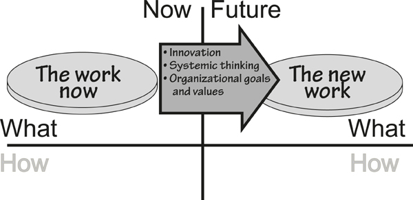

[7.4-P004] Figure 7.5. Having achieved the correct understanding of the work as it is now, we move on to look at what it can be when we finish the project.

[7.4-P005] Before we get too far into the future, it’s worth emphasizing that you must understand the current essence that exists within your work scope—usually defined by a work context diagram, as we discussed in **Chapter 3**, Scoping the Business Problem. Your thinking about the future might mean that you change this scope because your stakeholders have agreed on some new or changed business policy, and the policy needs a new or different interface with an adjacent system in the outside world.

[7.4-P006] To start thinking about the Future-What, ask your owner a simple question, “What business do you want to be doing in the future?” While this is a simple question, sometimes it is not so simple to find the answer. At other times, however, it is almost obvious. For example, for many years Amazon was the largest online seller of books printed on paper. Amazon understood that the future of bookselling could be different, so it developed its Kindle reader. This path led Amazon to selling downloadable e-books to be read on the Kindle (or iPad or any of the many other readers that have sprung up), a change that proved to be successful—Amazon now sells more e-books than it does printed books. This change in direction is Amazon’s answer to the question, “What business do you want to be doing in the future?”

[7.4-P007] Moving into the future is not just a matter of wishful thinking; it requires innovative approaches on the part of the business analyst, as well as a willingness to contribute and be open to new ideas on the part of the business stakeholders. What you are doing here is taking the essence of the business as it now stands and changing it to the essence of the business as it will be in the future.

[7.4-P008] We have to pause here and clarify something. You could say that the essence of Amazon’s business did not change—the company is still selling books, just using a different technology to do so. Not quite. What Amazon (or any other bookseller) actually did was to challenge the constraint that a book is always printed on paper. By removing that constraint and saying that the essence of the book is its information content—the words and pictures—then the bookseller can cast about for other, better ways to sell the information content. The ideal bookselling technology would be for the seller to beam the book directly into the brain of the “reader” (no longer the appropriate word). However, until that kind of technology appears, booksellers will have to be content with e-books.

[7.4-P009] Your innovations for the Future-What state are not necessarily huge changes. When Amazon first started selling (paper) books online, the company quickly gathered information about the book-buying habits of its customers. Amazon also knew the title, genre, author, and other attributes of the books it had for sale. From there, it was not a huge change to develop a new business policy: When a new book arrives from the publisher, compare the attributes of the book with the buying habits of customers and, the next time the customers visit the site, make targeted recommendations.

[7.4-P010] You can see from this example that sometimes the work possesses some essential knowledge that is not being used to the business’s best advantage. Sometimes the business does not recognize its own essential knowledge, or the current implementation makes it difficult to see a new business opportunity.

[7.4-P011] Similarly, you might be working with stakeholders who are eager and willing to change their business, or you might find that you have to drag them kicking and screaming into the future. Additionally, stakeholders cannot always be relied upon to know exactly what they want. We don’t mean that you ignore your customers, but rather be skeptical when they tell you what they want.

[7.4-P012] Also keep in mind that giving stakeholders exactly what they ask for is often heading down the pathway to oblivion. Customers often ask for incremental improvements to their systems: “I want what I have now, but a few more items of information and a little faster, please.” By providing those capabilities and no more, you are turning your back on the innovative leap forward that will result in a superior outcome for the project. Clayton Christensen, in his book *The Innovator’s Dilemma*, provides compelling evidence of companies that went out of business by providing exactly what their customers were asking for.

[7.4-P013] The future work is not just a reimplementation of the current work. You don’t find the future work by simply automating all existing manual processes, or by mechanically reimplementing existing computer systems. There is little to be gained by rewriting an old COBOL system in Java.

[7.4-P014] Nor is the future work the same as the current work with a few extra features tacked on.

[7.4-P015] Reading

[7.4-P016] Christensen, Clayton. *The Innovator’s Dilemma: The Revolutionary Book That Will Change the Way You Do Business.* HarperBusiness, 2011.

[7.4-P017] To make your project worthwhile, it has to result in some significant step forward for the business. In other words, you and your stakeholders have to innovate and find the significant change, and not just settle for some routine incremental improvement. You are not building just another computer system (the world has plenty of those), but you are improving the work. Granted, that probably means building a computer system, but for maximum value, that system must have its roots in an innovative improvement to the work.

## 7.5 How to Be Innovative

[7.5-P001] 

[7.5-P002] ***Today’s business analyst should always be looking for ways to improve his client’s work, and these improvements almost always come about through innovation. Most people do not think of themselves as innovative, but there are some reasonably simple things you can do to encourage yourself to have more and better ideas. Keep in mind that innovation is simply “fresh thinking,” and innovation is not the same as invention.***

[7.5-P003] Very few people think of themselves as innovators; but we suggest that almost anybody can be innovative if given the opportunity and some techniques to work with. There are many techniques, and many books discussing these techniques. We will not attempt within the scope of this book to provide a complete treatise on how to be more innovative, but we want to look at a few things you can do that usually result in new ideas to improve the owner’s work.

[7.5-P004] We said a moment ago that your stakeholders might not know what they want; at least they have trouble telling you what they want. But you know that there are three things that people do want and are willing to spend their discretionary**1** money on: *pleasure, prestige,* and *convenience*. Convenience is the most applicable of these for business analysis, but we should quickly look at the other two.

[7.5-P005] People are willing to pay for pleasure. You simply have to look at the sales of alcohol to see how much people are willing to pay for pleasure (assuming, of course, that people are not merely buying the stuff to drink themselves to oblivion). Going to the movies or watching a movie at home is also an example of people paying for pleasure; as is a woman buying perfume (which is pleasurable to both the woman and other people); as is paying for a properly made cappuccino instead of drinking the brown liquid from the machine in the hall. There are many more examples in our everyday lives. The opportunity for most businesses to provide pleasure is limited, but it should not stop you from asking, “Can we make our customers’ interaction with our company more pleasurable?” Most of us would rather part with our money in places where the experience is pleasurable, and we tend to avoid places where doing business is decidedly unpleasant.

[7.5-P006] People are also willing to pay for prestige. Why do people buy a Mercedes when a Toyota will adequately and comfortably get them to their destination? Because a Mercedes makes its owner feel that he has a better car than the other fellow. Apple’s iPod captured a huge share of the market because people thought it more prestigious that other, clunky MP3 players. Perhaps iPod owners expressed their feelings for the device as “cool”—but is not being cool a form of prestige, particularly if something makes you cooler than your contemporaries? Leica markets a range of high-quality cameras; Panasonic sells the identical cameras at a significantly lower price. Despite Panasonic’s price advantage, the equivalent Leicas continue to sell. Why? Because people want the prestige of owning a Leica: the red spot on the front of the camera that shows that they are using a camera from one of the best optical companies in the world.

[7.5-P007] Despite their attractiveness, however, such opportunities for providing prestige are generally limited for most companies. That leaves us with convenience as a target for people’s discretionary (and nondiscretionary) money.

[7.5-P008] ***People are willing to pay for convenience.***

[7.5-P009] People are willing to pay—sometimes a considerable amount—for convenience. A ready example is the mobile phone. We put up with some fairly dire quality issues—dropped calls, poor reception, and high prices—just to have the convenience of making and receiving calls wherever we are. As mentioned earlier, Netflix was able to take advantage of people’s desire for convenience by providing downloadable movies, and not asking its customers to go to the store to pick up a DVD, and then take it back. Bricks-and-mortar bookshops are (sadly) disappearing with the advent of online shopping for books. The rapid uptake of the Kindle and other e-book readers shows the degree to which we favor convenience.

[7.5-P010] Think back over the years of music reproduction. Each new generation of device—the wax cylinder, the shellac disc, the vinyl disc, the cassette, the CD, the MP3 player—was adopted because it provided more convenience. It is debatable whether each of these advances brought better-quality reproduction; many audio enthusiasts still prefer the well-pressed vinyl disc to CD reproduction. MP3s are definitely a retrograde step in the fidelity of a reproduction. Nevertheless, each generation of device provided a step up in the convenience of reproducing and accessing music.

[7.5-P011] Convenience is something that your business can provide. It is not that difficult a task, but to offer this feature, first you must take a step back from your proposed solution and look at it from the user’s point of view. Think of the user’s essential objective (use the term “essence” as we earlier discussed) and try to get him to that objective using fewer steps than you have already planned. You can copy ideas if you like: Look at how Amazon does things—it did not become the premier online book retailer by being hard to use. As a small but important piece of convenience, Amazon retains every address in an account to which the user has had purchases shipped: Instead of entering the shipping address, a customer directs the shipment to one of the stored addresses. Convenient? Yes. Easy to do? Yes. Can you do something like that in your business? Yes.

[7.5-P012] Can you provide an additional service that your user would find convenient? Almost certainly. Take a look at any service that your organization provides. Brainstorm with a few like-minded colleagues, and we guarantee that you will come up with several ideas for adding a service—and thereby convenience—to something that the organization already provides.

[7.5-P013] ***Look at your proposed product through the eyes of the customer—can you make it more convenient?***

[7.5-P014] There are many things you can do to make your products and solutions more convenient. Such an effort requires not much more than a little time and a little thought. To be successful, however, you have to look at the product through the eyes of the customer, or the person who is to use whatever it is you plan to build. Seeing things through the customer’s eyes is not always easy, but the cardinal rule is to disregard what *you* think, and instead come at it from the customer’s side. Later in this chapter we discuss personas as a way of understanding things from your customer’s way of thinking.

## 7.6 Systemic Thinking

[7.6-P001] As well as innovating, moving into the future means *thinking systemically* about the work, the whole problem, the end-to-end system. Sometimes, when you consider the entirety in preference to the parts, you are better able to see how you can rearrange those parts to form a more beneficial system for the future.

[7.6-P002] It now falls to you in your role as a business analyst to lead the quest for the future work. Often, remarkably often, the future work is apparent as soon as you start applying **systemic thinking** to the current work. Simply by seeing the bigger picture of the current work, it becomes readily apparent what the future work should be.

[7.6-P003] **Look at the parts, but at the*** aggregation ***of the parts***.*

[7.6-P004] Systemic thinking, depicted in **Figure 7.6** as a series of interlocking cogs, is appropriate at requirements time. The basic idea of systemic thinking is to regard the business as a system—that is, a set of connected parts that produces something none of the parts can do alone. So let’s not look at the parts but at the *aggregation* of the parts and the ways in which they interact. This exploration will help us see how they might interact in the future.

[7.6-P005] 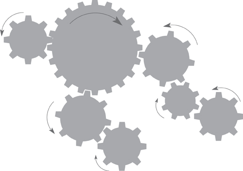

[7.6-P006] Figure 7.6. Systemic thinking, sometimes called systems thinking, requires that you see the system as a whole. Any system is a set of interconnected functions, and the outcome of one function might have an effect on another. Just as with a set of cogs, when one function does something, it causes others to react.

[7.6-P007] *“What we have to understand is how the work works.”*

[7.6-P008] —John Seddon

[7.6-P009] Looking too narrowly, by looking only at the proposed product, inhibits systemic thinking. The product’s fundamental functionality and the ways in which it seeks to interact with the user are certainly important, but what the product is doing within the larger scope of the organization is more important. Step back and see how your product affects the rest of the work.

[7.6-P010] ***Instead of looking inwardly at the solution, step back and look at the whole of the work that you want to improve.***

[7.6-P011] Suppose you are talking to an engineer as one of the stakeholders in the road de-icing project. The engineer asks for “The product to show a map that marks the roads that need treatment in red, and the roads that are safe in blue.” (This was one of the original statements of requirements; we are not making this up.) Note that the engineer is concentrating on the product and his proposed solution for the interface. Now, step back a little and think about the work as a whole—think systemically.

[7.6-P012] First consider the request for red roads and blue roads: This engineer has asked for this color scheme because of his personal preferences. But stepping back just a little, you have to ask if everyone will interpret red and blue the same way this fellow does. It is perfectly reasonable to say that blue represents cold and red is the universal color for hot, which means that it is highly likely that another user would make the contrary interpretation, leading to exactly the wrong result.

[7.6-P013] If you take one more step back and ask why the roads have to be identified on-screen (using *any* color scheme), you get the answer that the engineer has to tell the depot to dispatch a truck to treat the iced-up roads. From a systemic point of view, this answer means that in the wider scope of the whole of the work, there is a need to inform the truck depot of the roads to be treated. Once you see the problem in this way, then you would build a product that informs the depot directly of this need and dispense with color-coded screens and engineers phoning the depot.

[7.6-P014] Now take one more step back: If a truck has to be dispatched, then there is a need within the work to allocate a truck, and this truck should be the one that makes the most sense when you consider (another step back) that many trucks are attached to the depot. From a systemic point of view, if you are to think about building a product to treat roads, then fleet optimization must be part of the solution.

[7.6-P015] Let’s go even further with our systemic point of view: What if the depot has insufficient resources to treat all of the unsafe roads? Perhaps there is a way of requesting resources from geographically neighboring counties, or asking the police to close the untreated roads and advising the traffic radio service that this has been done? When a road is closed, could the work also recommend an alternative route? We may be getting a little far away from the original screen with its blue and red roads, but along the way systemic thinking has turned up some interesting possibilities.

[7.6-P016] The idea of systemic thinking is to think about the entirety of the business, how its component parts interact with one another and, most importantly, what *effect* they have on one another. Instead of looking at a neat process flow diagram, or following someone’s textual description of a process, think about how the different parts of the system *influence* each other. **Figure 7.7** shows this concept.

[7.6-P017] 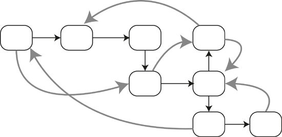

[7.6-P018] Figure 7.7. Some of the activities in this business have an effect on others. This effect, or influence, is shown by the gray arrows. Systemic thinking involves thinking about the outcome of the system as a whole and understanding the consequences of every action.

[7.6-P019] At this stage you could be thinking, “Wait a minute! My job title is business *analyst*. Analysis involves breaking things up and studying the components.” Analytical thinking is, of course, useful and necessary, but we are suggesting—forcefully suggesting—that you enhance your analytical skills with systemic thinking and instead of just analyzing each component, you consider how the components *affect* one another.

[7.6-P020] John Seddon—an author whose work we recommend—speaks of looking at both *value demand* and *failure demand*. Value demand arises when customers make requests or order whatever your organization sells or provides. Failure demand occurs when those same customers make complaints or ask for repairs to what they have been sold. Obviously, when your product or service fails, it costs you money to put things right or repair the product. Thus finding the points at which the system fails is worthwhile. However, the causes of failure demand are often rooted deeply within the organization, and can be found only by looking at the organization as a whole. This, then, is systemic thinking.

[7.6-P021] Reading

[7.6-P022] Ackoff, Russell, and Herbert Addison. *Systems Thinking for Curious Managers: With 40 New Management f-Laws.* Triarchy Press, 2010.

[7.6-P023] Seddon, John. *Systems Thinking in the Public Sector.* Triarchy Press, 2010.

[7.6-P024] Meadows, Donella. *Thinking in Systems: A Primer.* Earthscan Ltd, 2009.

[7.6-P025] Senge, Peter. *The Fifth Discipline: The Art and Practice of The Learning Organization*, revised edition. Crown Business, 2006.

[7.6-P026] The moral of the story is that instead of concentrating on the first solution that you are given, you step back and look at the problem from a wider scope. By questioning the underlying reason for each of the elements in the solution, and by studying the effect that any one element can have on another, you end up deriving more realistic requirements and, as a result, produce a better end product.

## 7.7 Value

[7.7-P001] Our premise for doing requirements is that if you build a piece of software, a consumer product, or a service, then it must be valuable to its owner, so let’s for a moment consider *value*. We are using the term to mean something that you are prepared to pay for—in other words, you make your decision as to whether to buy something based on its value to you. When you feel that the outlay is worthwhile for whatever it is, then you spend your money on it. If you feel that it is not worth the asking price, then for you it is not good value and you do not buy it.

[7.7-P002] Sometimes making the value decision is straightforward. For example, your authors travel widely for their work and from time to time we have to get a visa before we can enter a country. We use a visa service that sends a courier to collect the application form and passport from our home, take them to the embassy in question, and return the next day with the visa stamped in the passport. As an alternative, we could choose to stand in line and wait to get the visa application accepted, and then wait again to have it approved, and then come back the next day to pick up the passport. However, we are willing to pay for the visa service because we think that it provides value: We feel that the time it saves us is better spent doing other things—for example, writing this book—and because the visa service achieves faster turnaround than we could do ourselves, we are not stuck without a passport when trips are close together. The point is that we value time enough to warrant paying a moderate fee to someone else to save some of it for us. However, if the cost of the visa service becomes too expensive, or if we are not particularly busy at the time, then it ceases to be valuable to us.

[7.7-P003] But you, dear reader, do not have to deal with easy stuff like personal preferences and values. Rather, you are focusing on an organization’s value—specifically, the organization that is to own the product you are developing. You have to determine what this organization values and what it wants to achieve. If you are dealing with a commercial organization, then the value can usually be expressed in money terms—money saved or money earned. Scientific organizations value the accuracy or the extent of their research. Real-time control organizations value correct and infallible operation. Organizations building products for sale value innovative and useful products that attract their customers’ attention.

[7.7-P004] ***Value can be thought of as encompassing three factors: reward, penalty, and cost.***

[7.7-P005] Perhaps it is easiest to think about value if we look at three factors: *reward, penalty,* and *cost*. There is, of course, an overriding consideration—the *goal* of the project that you established back in the project blastoff. Then, for any unit of work such as a business use case, or for any requirement, you score each of the three value factors based on how much it contributes to the goal.

[7.7-P006] For example, suppose you have a requirement that your product must have a secure way of logging on. The reward for this feature is low—perhaps a score of 1 or 2 on a scale of 1 to 5. It doesn’t gain you any extra customers or improve the owning organization. Conversely, the penalty for *not* having it is high: Your customers will desert you if they think your product is not secure. Additionally, if sensitive information falls into the wrong hands and it transpires that you did not do enough to protect the information, you could face criminal charges. We would score the penalty for this outcome as 5—very high. The cost of having a secure product is moderate; you can buy off-the-shelf security that will be perfectly adequate for most situations. Let’s score cost as a 3. So this requirement is valuable to you: The cost to have it is less than the cost of not having it.

[7.7-P007] Let’s consider a different business use case, one where the customer buys your goods. The reward for having this capability is (obviously) high: You can score that as 5. The penalty for not having it is also high (5 again), and the cost is moderate to high (let’s say 4). Collectively, all of this means that this capability is valuable, so you include it in your product.

[7.7-P008] Alternatively, you might consider the capability of providing free delivery for your product. The reward for this service is high; let’s say it scores 4 because customers will appreciate the convenience. The penalty for not doing it is low; nobody really expects free delivery for lower-priced goods. The cost is high—it would eat up a significant portion of the profit from selling the goods, so we score cost as a 5. Is this service valuable? No, the cost exceeds the reward, so you would discard this capability.

[7.7-P009] For any business use case, you measure value with the objective of including only those facilities that are valuable (taking into account reward, penalty, and cost) to the owner. We suggest that the real problem—the one you are trying to understand—includes only high-value functionality.

## 7.8 Personas

[7.8-P001] 

[7.8-P002] ***Personas are useful when real users are not available or are too numerous for you to interview all of them. The persona is a virtual character that substitutes for the human users. We strongly sugest using a persona when you do not have access to the real users or customers. Almost always, the persona is a better representation of the user than a human proxy.***

[7.8-P003] A persona is an invented personality; an imaginary but nevertheless archetypical user or customer for whom you are gathering requirements for your product. Why an imaginary character when there are potentially thousands of real users out there? Because, for a mass-market product, or one that is to be used by more than a dozen different people, you don’t know, and can’t get to know, all of the real users. But you can know one really well, and that imaginary user’s attributes guide your requirements: This is your persona.

[7.8-P004] You don’t invent your persona, but rather derive it from market research or other surveys into your likely user population. The degree of precision needed varies in proportion to both the size of the user base and the criticality of the product to be built. In any event, most teams write a one- or two-page description that identifies the persona’s behavior patterns, goals, skills, attitudes, and environment. It is also usual, and indeed desirable, to include enough personal details—including a name—to make the persona seem real to you and your team. You can, of course, have more than one persona for a product, but there should be one who is the primary target of the product. We also find it useful to have a photograph—you can find thousands of photos in the online stock photo agencies—and you select one that the team agrees is their image of your persona.

[7.8-P005] Using a persona makes it easier for business analysts and innovators to think about their customers’ needs. When they can see a photo and speak about the persona by name as someone real, it puts a human face on what otherwise would be abstract data about potential customers. The question to ask is not what a set of data wants, but “What does Emma [or whatever you have called your persona] want?” or “What would Emma do in this situation?”

[7.8-P006] Reading

[7.8-P007] Cooper, Alan, Robert Reimann, and David Cronin. *About Face 3: The Essentials of Interaction Design,* third edition. Wiley, 2007

[7.8-P008] Personas avoid what Alan Cooper calls the “elastic user,” whereby different stakeholders define the characteristics of the product to be everything they have in mind, and to accommodate their own assumptions about the kind of user they are building for. The result is usually too many requirements, many of which conflict with one another, and a product that, by trying to satisfy everyone, satisfies none of its intended audience. Today you can see some wonderful consumer products that fit exactly our own personal preferences. This is not because the product’s builders know you, but because they selected a persona whose attributes matched (more or less) yours. In contrast, if you try to write the requirements for a product to suit everybody on the planet, the functionality would be so heavy as to make the software too large to be installed on any known computer—trying to suit everybody will end up suiting nobody.

[7.8-P009] Having a persona also prevents stakeholders from defining the user as themselves. This “self-referential” approach (see **Figure 7.8**) almost always yields idiosyncratic results with one stakeholder finding the product easy and intuitive, but the rest of the audience not responding to the product in quite the same way.

[7.8-P010] 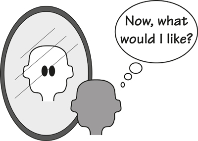

[7.8-P011] Figure 7.8. The self-referential user considers himself only, and inadvertently disregards the wishes or needs of the wider audience.

[7.8-P012] The realness of the persona gives the business analysts and stakeholders a target at which to aim their new system. Details such as computer literacy, attitude toward technology, cultural taboos and viewpoints, gender bias, and so on act as a guide. This apparent reality also tells the designers what the normal case is, and what the persona will find to be the exceptions or edge cases. Such understanding usually prevents the designers from focusing the product on the abnormal cases or user behavior.

[7.8-P013] Your authors have a local government client in one of the London boroughs, part of whose responsibilities is to provide meals for aged people and others who are not able to provide for themselves. We worked with the team who manage this service with the aim of finding a new future state of this work. The assignment was to help the team to decide what the borough council could do to improve the service of providing meals for the elderly. The team came up with a persona whom team members considered to be an archetypical recipient of the meals, and then they began asking, “What service does Elsie really want?” The answers were a revelation to many of the team members; until this time they had designed this service to more or less suit their own experience. Elsie—her photo smiled down on the team—gave them answers that made for a far better and well-received service. See **Figure 7.9**.

[7.8-P014] 

[7.8-P015] Figure 7.9. The team used a persona to represent their customers. By treating the persona as a real person, they were able to devise a far superior Future-What version of their work.

[7.8-P016] When we talk about requirements for software, we often speak of “user requirements.” The problem with this term is that requirements are gathered for *anyone* who could be a user. The way to build a successful product is not to gather requirements that mete out something for everyone, but rather to *thrill* the actual users.

[7.8-P017] Reading

[7.8-P018] Norman, Donald. *The Design of Everyday Things.* Doubleday, 1988. Despite the relative age of this book, Norman’s words on clarity of purpose hold true today.

## 7.9 Challenging Constraints

[7.9-P001] Challenging constraints—seriously questioning constraints and seeking to remove them—is something that every business analyst should be doing. A constraint in this case is an imposed restriction on the problem or solution space—it might be a piece of business policy that says a process must be done in a certain way, a directive about the way in which the solution must be implemented, or about almost anything at all. The problem with constraints is that everyone assumes the constraints are real and immutable.

[7.9-P002] Let’s question that.

[7.9-P003] Suppose that for any constraint, the business analyst challenges it by asking, “Is this constraint real? What would the result be if I pretended for the moment that this constraint did not exist?” Sometimes the answer is that it is impossible to remove the constraint because lives will be lost (or the corporate equivalent), and sometimes you find that it is entirely possible to remove the constraint, and doing so brings with it an innovation, which is your reason for challenging it in the first place.

[7.9-P004] Let us suppose that there is a constraint that you have to sell your company’s product or service at a profit. Seems reasonable enough. But now let’s challenge that truism and see what happens. Better still, let’s look at an example where the creator seemed to ignore profit and gave the product away. A little while ago, the rock band Radiohead gave away its recording “In Rainbows.” The band posted the song on their website and asked fans to pay whatever they wanted to pay, including nothing at all. The publicity, and the new fans this attracted, meant that when the CD was eventually released, it sold well beyond expectations. Many new musicians mimic this approach by freely giving their music away to generate a fan base, and their return is the money they make from live concerts. Look at your app store—there are lots of free apps available that either offer a taste of the fully featured, payable app or serve as a vehicle for advertising. Either way, these apps are a result of removing the constraint of having to make a profit.

[7.9-P005] Constraints are often really *assumptions* about the way in which the organization currently does business. For example, it is either an assumption or a constraint that bills are paid by the Accounting department. Analysts at a large American car builder challenged this constraint. Before they did so, the scenario went like this: When parts deliveries were made, the dock foreman would check the delivery, collect and send the paperwork to the accounting people, who, after a certain amount of processing and receipt of an invoice, would pay the supplier. This process is illustrated in **Figure 7.10**.

[7.9-P006] 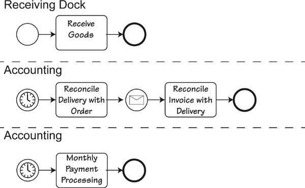

[7.9-P007] Figure 7.10. This activity diagram shows the process for receiving goods and eventually paying for them. This is what the process looked like before the constraints were challenged. Note the use of the swim lanes, which made any systemic approach more difficult.

[7.9-P008] When the constraint was challenged and eventually removed, the resultant process was changed to this: The goods would be delivered, the dock foreman would check that the delivery matched the order, and the dock foreman would authorize a check that was immediately printed and handed to the driver. This process is illustrated in **Figure 7.11**.

[7.9-P009] 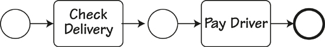

[7.9-P010] Figure 7.11. The streamlined process that resulted from challenging the constraints. The check handed to the driver has now been superceded by making an immediate bank transfer.

[7.9-P011] The new process has several advantages. It is less expensive because it eliminated the costly processing by the Accounting department. And while traditionally organizations like to pay bills as late as possible, in this case the company saved money by paying the bill immediately. The reason for delaying payment is usually to keep the money in the payer’s bank account where it earns interest. However, in these days of low (or zero) interest and poor economy, the discount you get for immediate payment always exceeds any interest that can be earned.

[7.9-P012] Challenging constraints often results in some surprising (and beneficial) innovations. Consider these constraints: For some countries, you need a visa to visit them; in addition, the visa must be stamped in the passport as proof of having it. The Australian Immigration Department challenged this constraint, and the beneficial result is this: To get a visa, you apply online. If you are the right kind of person, you are granted a visa and informed of that fact while you are online; nothing is stamped in your passport (**Figure 7.12**). When you arrive at your entry point into Australia, the immigration officer scans the barcode in your passport and his screen tells him that the holder has been granted a visa. The net return to the department is that this change cuts down the expense of processing, not to mention the time expended by visa applicants queuing up to get visas stamped in their passport at Australian consulates around the world. Check out the department’s website (**www.immi.gov.au**) to see its innovative approach to immigration and visas.

[7.9-P013] 

[7.9-P014] Figure 7.12. The Australian government provides an innovative (and very convenient) facility for online applications for visas. Screenshot used with permission from its source, the Department of Immigration and Citizenship.

## 7.10 Innovation Workshops

[7.10-P001] 

[7.10-P002] ***Innovation workshops are one way of generating ideas. Use them when a large number of stakeholders are involved in the innovation process. These workshops are also appropriate when you want stakeholders to see the advantages of developing a new and better way of working instead of just rebuilding the same old system.***

[7.10-P003] We suggest that as part of moving into the future, you set aside a little time for innovation workshops. These joint sessions are held for the purpose of generating innovations to improve the work. One of the problems we have noticed with innovation is that few people think of themselves as innovative, and fewer people think being innovative is part of their job description. However, we suggest that innovation is part of everyone’s job description—it is only through innovation that we progress.

[7.10-P004] *“If there was no innovation, you would be riding a horse to work.”*

[7.10-P005] The workshops are a place where you and the stakeholders work together to innovate a better piece of work. You, as the business analyst, have to lead the charge in innovation. We have found that stakeholders are sometimes unwilling to give up time for this activity, but once they experience the improvements generated by the workshop, they become keen participants.

[7.10-P006] ***The outcome of the workshops was several hundred innovative requirements.***

[7.10-P007] When Eurocontrol decided to investigate the requirements for the air traffic control systems of the future, the organization found it difficult to think past how things are done now. With our colleague Neil Maiden from City University, we developed requirements creativity workshops as a way of encouraging air traffic controllers, pilots, airline representatives, and systems developers to come up with innovative improvements for the future system. The outcome of the workshops was several hundred innovative requirements. Participants agreed that the requirements coming from the workshops made a significant, almost startling difference to the eventual air traffic product. They also agreed that these requirements would never have seen the light of day but for the creativity workshops.

[7.10-P008] We suggest something along these lines for planning and running innovation workshops:

[7.10-P009] **1.** Set the scope of the innovation. It should not be too narrow, as many innovations are originally thought of as outside the remit of the team. Invite all stakeholders who have an interest in this scope to participate in the workshop.

[7.10-P010] **2.** Partition the scope using business events to allow the participants to concentrate on the end-to-end business processes, while keeping in mind that systemic thinking usually involves all of the business events.

[7.10-P011] **3.** Plan the workshop. You will probably have to use several innovation techniques. Some of these are discussed in this book, and a number of excellent texts on creativty also available. You will have to facilitate the workshop and lead your stakeholder through the techniques.

[7.10-P012] **4.** Record everything that happens in the workshop. *Do not try and assess ideas during the workshop.* Innovating and assessing are two separate activities and should not be tackled at the same time.

[7.10-P013] **5.** After the workshop, feed the results back to participants.

[7.10-P014] **6.** Incubate. Sometimes the really great idea does not happen for some time. People are quite capable of coming back days later with some profound improvement to one of the workshop innovations.

[7.10-P015] These workshops are intended to be more structured than regular brainstorming sessions. The intention is to use a mixture of innovation techniques to generate a more interesting outcome.

[7.10-P016] We cannot recommend one innovation technique over another; people inevitably find that one technique may suit them, yet not others. Innovation is essentially a human activity, so we suggest you use techniques that you are comfortable with and that you like using.

[7.10-P017] Reading

[7.10-P018] Silverstein, David, Philip Samuel, and Neil DeCarlo. *The Innovator’s Toolkit*. John Wiley & Sons, 2009.

## 7.11 Brainstorming

[7.11-P001] 

[7.11-P002] ***Brainstorming is one way of innovating. It is useful for generating lots of contributions regarding the scope of the problem, or what it could be. This strategy is not intended to promote unconstrained scope creep. Instead, the brainstorming session generates ideas that could lead to a better product without incurring additional expense.***

[7.11-P003] Brainstorming takes advantage of the group effect. That is, you gather a group of bright, willing people, and ask them to generate as many ideas as possible for the new product (**Figure 7.13**). Tell them that *any* ideas are acceptable, no matter how crazy they may seem, and that they must not slow the process down by criticizing or debating ideas. The aim is to be as imaginative as possible, and to generate as many ideas as possible, often by using the ideas of others to trigger a different idea of their own.

[7.11-P004] 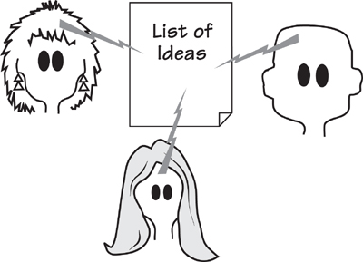

[7.11-P005] Figure 7.13. A brainstorming session is a gathering of interested people whose task is to generate new ideas for the product.

[7.11-P006] There are some simple rules for brainstorming:

- [7.11-P007] Participants in the brainstorming session should come from a wide range of disciplines, with as broad a range of experience as possible. This mixture of backgrounds brings many more creative ideas to the fore.

- [7.11-P008] For the moment, suspend judgment, evaluation, criticism, and, most importantly, debate. Simply record requirements as they are generated. The practice of not stopping the flow is the fastest way to develop a creative and energized atmosphere for the brainstorming group.

- [7.11-P009] Produce lots of ideas. Come up with as many ideas as possible. Quantity will, in time, produce quality.

- [7.11-P010] Try to come up with as many ideas as you can that are unconventional, unique, crazy, and wild. The wilder the idea, the more creative it probably is, and often the more likely it is to turn into a really useful requirement.

- [7.11-P011] Piggyback a new idea onto an old one. That is, build one idea on top of another.

- [7.11-P012] Write every idea down, without censoring.

[7.11-P013] *“Ideas disappear faster than water evaporates unless written down.”*

[7.11-P014] —Alex Osborne, the founder of brainstorming

- [7.11-P015] If you get stuck, seed the session with a word pulled randomly from a dictionary, and ask participants to make word associations that have some bearing on the product.

- [7.11-P016] Make the session fun. You cannot mandate creativity; you have to let it come naturally. You won’t see many ground-breaking ideas if the boss is present at the session and says something like, “I want to hear only ideas that are marketable.”

[7.11-P017] After the brainstorming session, the lead business analysts and key stakeholders evaluate the list of ideas. Some of them will be worthless, but they will have served their brainstorming purpose—inspiring other, more useful ideas. Some ideas may need to be merged with others—perhaps two half-formed ideas, when put together, will make some useful new idea. Keep the best of the ideas and, providing there is a reasonable chance of implementing them within the project constraints, turn them into requirements.

## 7.12 Back to the Future

[7.12-P001] Let’s return to what we are doing here. Your task is to change the current work into the future work, or as we have described it previously, to transform the How-Now into the Future-What. Looked at it another way, this effort involves changing business policy, and the new policy should be innovative. As we have said several times—and it is worth repeating—there is little value in simply reimplementing some old piece of work. If your project is to provide something valuable to the organization, then it must provide an advance, some fresh thinking, to make the end product as useful as possible.

[7.12-P002] *“Our job is to give the client, on time and on cost, not what he wants, but what he never dreamed he wanted; and when he gets it, he recognizes it as something he wanted all the time.”*

[7.12-P003] —Denys Lasdon, architect

[7.12-P004] You must not be afraid to innovate. Customers—both the internal stakeholders and the external business customers—don’t always know what they want. Apple, which is by any standard the most innovative company in the world, almost studiously avoids traditional market research. By its own admission, Apple builds not what people say they want, but what Apple thinks its customers are ready for. People usually don’t know what they want until they see it, so your task is to give them something to see. Improving the work means delivering a product that when they get it, the users realize it is what they want.

[7.12-P005] The future work should provide a better response to the business customers, or for products to be used internally, a better way of working for the users. This means giving them something they did not have before, or providing a facility that makes their task easier.

[7.12-P006] We have suggested using a persona, and looking at the product from the point of view of the persona. This usually results in a change to the work to make it more acceptable—convenient—to the end user or customer. Even eliminating a single step from a buying or ordering process may make a difference. Play through your work from the persona’s point of view and see if you can make it more convenient. And remember—you are not trying to please yourself.

[7.12-P007] The outcome of thinking in the Future-How segment of the Brown Cow Model is a number of models of the future work. These need not be elaborate; we typically use simple scenarios and sketches to elicit the concurrence of the stakeholders. You will, of course, need the full cooperation of the stakeholders, as the Future-What represents a new business policy or the new work to do. Once you have agreed on the extent of the work, define the boundaries of the Future-What view by updating your work context diagram and adding to or changing your event list as needed.

[7.12-P008] Everybody wants an exciting future—make sure your future work does not disappoint.
