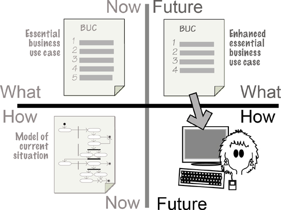
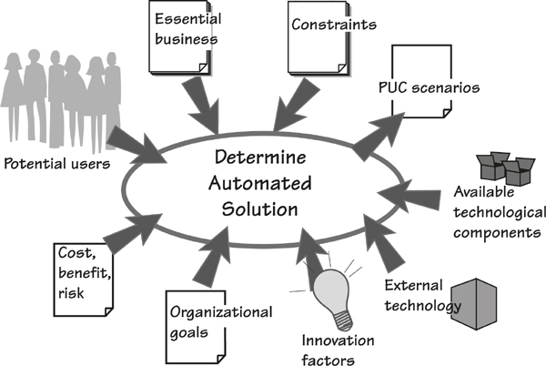
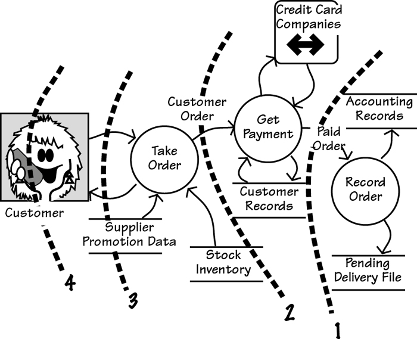
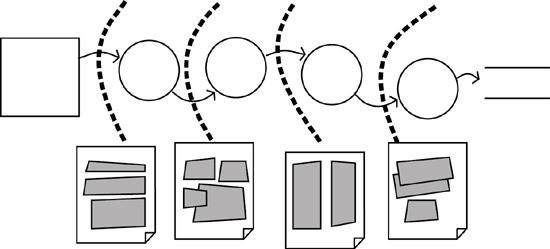
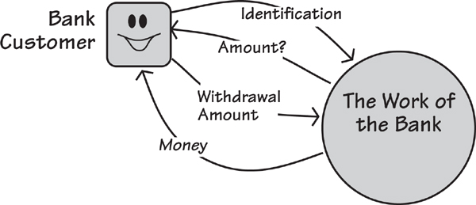
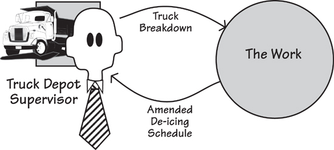
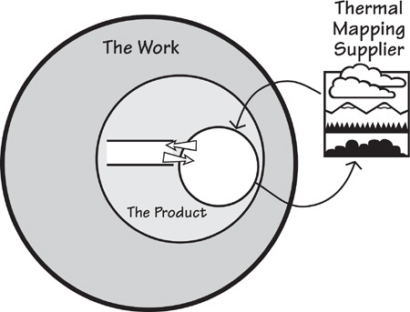
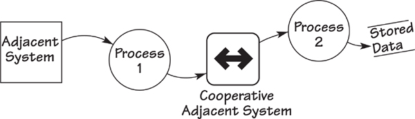
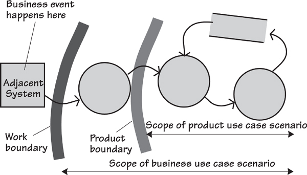
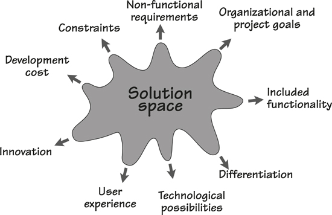

# 8. Starting the Solution

[8-P001] *in which we bring the essence of the business into the technological world of the implementation*

[8-P002] We have arrived at the point where we move away from the virtual, abstract, and perfect world that exists above the line, and bring the business requirements into the reality of the technological world that lies below the line. The line we refer to here is the horizontal line of the Brown Cow Model, and we are moving from the third quadrant (Future-What) to the fourth quadrant (Future-How), as illustrated in **Figure 8.1**. In doing so, we are moving from an abstract world to the physical world; from policy to technology; from problem to solution; from purpose to design. In this fourth quadrant, we begin the design of a solution to the business problem.

[8-P003] 

[8-P004] Figure 8.1. You have reached the last quadrant of the Brown Cow Model. Here you decide how you are going to implement the essential business.

[8-P005] Now that you and your stakeholders have a solid understanding of the essence of the business—the real problem to be solved—it is time to determine which parts of that problem would benefit from being automated. To put that another way, how much of the essential business policy can you beneficially carry out with an automated product, be it software, hardware, or otherwise? You can also think of this activity as deciding the automation boundary.

[8-P006] But there is more to it than simply ring-fencing some of the required functionality and declaring that it should be automated. To arrive at an elegant solution, you must consider, and probably design, the experience that results from your choice of automation boundary. In other words, you must deliver the required functionality so that it works in a way that readily fits into the users’ work customs, meets the operational needs of the organization, contributes to the organization’s goals, and does so at a price that pleases the owner.

[8-P007] Note that we *arrive* at the Future-How view of the product after having first spent some effort discovering what the product is meant to do. Unfortunately, many software projects *begin* with the Future-How; they leap directly to a solution to an as-yet-unstated (and probably not-understood) problem. We sincerely hope that if you are still reading this book, we have been able to show you why it is worth spending the time to understand the real business need before attempting to come up with a solution.

[8-P008] We cannot make this book an exhaustive treatise on the design of software and organizational systems. Each organization has its own unique implementation environment, which means that the designers will come up with a unique design. Nevertheless, we can identify the variables that you need to consider to make the design decisions in your environment. See **Figure 8.2**.

[8-P009] 

[8-P010] Figure 8.2. The business analyst juggles many factors to decide the most appropriate product to build.

## 8.1 Iterative Development

[8.1-P001] **Iterative development** techniques don’t always appear to do much in the way of upfront design, relying instead on frequent releases of software to gauge the design’s suitability. Although this approach can certainly work, it can be time-consuming if the initial releases are not very close to what is actually needed, or if the problem is so poorly understood or defined by the stakeholders that any solution is bound to be wide of the mark. In any event, it is usually more efficient to begin the discovery of need with abstract models and conversations, instead of concrete implementations.

[8.1-P002] Unfortunately, many projects begin with a proposed solution—in our terms, this means starting in the fourth quadrant, the Future-How. By starting here, the development team has to hammer and cajole the solution into some semblance of what is needed, and at the same time attempt to discover what is really needed. Many practitioners find that they are forced to start in the Future-How quadrant, move back to the Future-What view to find out what is really needed, and then proceed once more to the Future-How view of the solution.

[8.1-P003] No matter how you are developing software, the important part of this process is the discovery, by both you and your stakeholders, of the real needs of the solution.

## 8.2 Essential Business

[8.2-P001] We have discussed the essence of the business in various places throughout this book, most notably in **Chapter 7**, so there is no need to repeat all of that information here. Suffice it to say that before starting on a solution, you will have collected a good chunk of the functional needs and a significant portion of the non-functional needs for the work that you have been studying. Moreover, you will have collected these as essential, or technology-free, needs.

[8.2-P002] The functional needs can be presented to you in the form of a business use case (BUC) scenario, a collection of atomic functional requirements, or properly crafted user stories. The level of detail that you address before thinking about the solution will vary depending on your project strategy and the way in which you are working with all the stakeholders. **Chapter 9** is devoted to strategies for getting from needs to solutions.

[8.2-P003] An understanding of the non-functional needs of the essential business is important to crafting a valuable solution. The non-functional requirements—such things as usability, look and feel, operational, environmental, security, and so on—must be taken into account when making choices about the solution. The non-functional needs are largely responsible for specifying the kind of user experience appropriate for the intended audience. We will return to these needs later in the chapter when we look at designing the experience.

[8.2-P004] As we have said before, it is crucial that the business analyst and the associated stakeholders have a clear understanding of the real needs—that is, the essential requirements—before attempting to find a solution. If the essential requirements are missing, then any solution must be at best a shot in the dark, and at worst a solution for a problem that may not have existed.

## 8.3 Determine the Extent of the Product

[8.3-P001] The task of business analysis is to determine what the work should be in the future and how the product can best contribute to that work. As noted earlier in this text, business use cases are responses to requests from the outside world for the work’s service. The optimal response is to provide the most valuable service (from the outsider’s point of view) at the lowest cost in terms of time, materials, or effort (from your organization’s point of view), and in the most pleasing and encouraging manner (from the end user’s point of view). Thus the product you craft should be a contributor to the optimal business use case—one that makes the product cheaper and faster and more convenient and all of the other things your project is to deliver.**1**

[8.3-P002] ***It is only by first understanding the work, and then automating part of it, that we achieve a seamless fit between the automated product and the work.***

[8.3-P003] Your task in determining the future product is to find the best way to achieve the desired outcome for the business use case—the one closest to the essence of the work. The product is the part of the business use case you choose to automate; so let’s look at an example of how we determine what part of the essential work is to become the product.

[8.3-P004] Consider the situation depicted by a data flow diagram in **Figure 8.3**. In this typical business use case, we see a customer (an adjacent system) ordering groceries over the telephone. Where is the best place to put the product boundary? Or, thinking of this issue in another and better way, which product boundary would make the best product?

[8.3-P005] 

[8.3-P006] Figure 8.3. Once you understand the complete business use case, you establish how much of it will be done by the product. The dotted lines in the figure represent alternative product boundaries. Each proposed automation is whatever functionality (shown as circles) appears to the right of the dotted line.

[8.3-P007] What about the product that would result from boundary number 1? Putting the product boundary here would result in an operator entering the checked order and the product recording the order after the credit card company has authorized it. This choice does not yield a very good product, as it forces the operator to do most of the work and misses several opportunities for automation. It also ignores any potential improvements to the service provided to the customer.

[8.3-P008] ***Getting the right product scope is crucial to getting the right requirements.***

[8.3-P009] What about boundary number 2? The user—in this case, the telephone representative—takes the order over the telephone and enters it into the product, which then does the credit card check and records the order. Not bad, but perhaps we could do better.

[8.3-P010] Boundary number 3 automates all of the order-taking work. Customers make a telephone call to a product capable of recognizing voice input or recognizing commands from the telephone keypad. Provided no questions arise and no serious responses are needed, customers get the advantage of calling 24 hours a day. An alternative solution to boundary number 3 is that customers could log on to the grocery company’s website and submit their orders online.

[8.3-P011] Solution number 3 might be convenient for the grocery company, but what about the customer? Do customers want to talk to machines or click choices on a website? Does this approach depersonalize the shopping experience so much that the customer feels alienated? Alternatively, which type of service should the grocery company provide to keep the customer’s loyalty? Also keep in mind that before picking up the phone (or logging on), the customer would have to survey the groceries already in the home to see what is needed.

[8.3-P012] What about solution number 4? Here we see that the product boundary has been pushed all the way into the customer’s home. This solution would take over most of the work previously done by the customer. This solution would count the groceries and trigger the order, perhaps with some collaboration with the customer. This is a higher-risk solution, but it might be attractive enough to the customers to make it a worthwhile approach.

## 8.4 Consider the Users

[8.4-P001] Whatever it is that you intend to build, someone has to use it. If you alone will use the product, or if you just couldn’t give a damn, then feel free to skip ahead and ignore this section. Conversely, if you intend to sell your solution, or if you need people to voluntarily start using it, then it stands to reason that you will want to make the product attractive to its intended audience. With the exception of embedded systems and a few categories of commercial software, everything you design will be used by humans. This simple and unavoidable fact means that it is necessary to consider the human user and what is most appropriate for him.

[8.4-P002] You know the functionality, but now you have to make it fit seamlessly into the users’ expectations, or their perceptions of how it should behave. Of course, you cannot design something that will satisfy people if you don’t know those people or understand how they behave.

[8.4-P003] If you have a substantial budget or if your project has to deliver some absolutely critical product, then it would be appropriate to study the users in significant detail. One way of doing so is to use ethnography—the study of the customs of people and their cultures. The intention of an ethnographical study is to describe the nature of the targeted subjects. Originally ethnography entailed the study of ethnic groups, but for our purposes we are usually not interested in the ethnic background of our users, but rather, as a group, how those users behave and how they think. Ethnographical studies usually involved longish-term close observation, and sometimes interviews and surveys. Ethnographer Bruce Davis describes this type of investigation as “deep hanging out with the subjects.”

[8.4-P004] Unfortunately, most projects do not have the budget to conduct extensive ethnographic studies. Thus you must make do with lesser ways of determining the nature of the users for whom you are constructing a solution.

[8.4-P005] In **Chapter 7**, we spoke about personas, and we can make use of them here. Personas are used when you have a large number of in-house users, or a large number of customers who will be using the product. A persona is a virtual person who represents a group of people (see **Figure 8.4**). Unlike individuals with their idiosyncrasies, personas are constructed from data collected through surveys of your target audience and so represent most of your eventual users. It is important that you construct your persona with enough characteristics for you and your team to feel that they understand it well enough to know what it wants.

[8.4-P006] 

[8.4-P007] Figure 8.4. A persona is a virtual character that represents a large number of customers (or users) with similar characteristics or demographics. The business analysts and designers use a persona as their source of user-specific requirements.

[8.4-P008] Naturally if you have only one or two users, then you can interview them directly. However, we urge caution at this stage, as many people cannot be relied upon to say exactly what they do, and observation is the more likely method for you to understand what your users do and how they feel about how they do it. You can also use prototypes and observe the users’ reactions to them, thereby discovering how they are most likely to respond to your proposed product.

[8.4-P009] We urge you to use either observations of real users, or personas. Our experience of customer surrogates or proxies has been less than satisfactory—the representative often states what he imagines is needed, but as he is not a real user, this statement of need is sometimes wide of the mark.

[8.4-P010] Whatever you do, you must construct a product that is appropriate and well matched to almost all of your users. This might seem obvious, but far too often we have seen project teams constructing the solution that they want or that they feel is appropriate, while forgetting that they will not be the ones using the product. What you or the team want is irrelevant; it is the characteristics of the ultimate end user that determine what the product should be.

[8.4-P011] At this stage you need to be familiar enough with your target audience to design the appropriate experience for them. We assume that you have studied your potential users, or you have interviewed them in some depth, or you have put together a persona or two; now it is time to design the user experience for them.

## 8.5 Designing the User Experience

[8.5-P001] Designing the whole of the user experience is the best way to come up with a product that makes people want to buy it and/or use it. Experience design is a significant topic and one that we consider to be beyond the scope of this book. However, we briefly mention it here because this kind of design is beginning to play a larger part in our development activities.

[8.5-P002] Experience design aims to produce a usage experience that is pleasing and exciting, as well as relevant to the culture and aspirations of the user. Such design focuses much more on how the product makes the user feel than on adding functionality to the product.

[8.5-P003] Simply put, if you provide a pleasing experience that the users enjoy and wish to repeat, then those users are far more likely to accept your product and—importantly—not ask for changes. At the time of writing, Apple is enjoying remarkable sales figures for its iPad. The iPad is a device that is slightly difficult to justify functionally (other devices can do more or less the same thing, often more cheaply), but it is the experience of using it that makes the iPad the desirable object it is.

[8.5-P004] Experience design should not be left to amateurs. It comprises a combination of many disciplines and, if it is to be done properly, should be handled by experienced or professional people. Experience design involves ethnography (as noted earlier, the study of how people behave), along with liberal doses of cognitive psychology, user interface design, human–computer interaction, and a liberal amount of prototyping.

[8.5-P005] The business analyst is not the experience designer, but he has an understanding of the essential business functionality and non-functionality. This knowledge, along with any personas generated or observations of users during the requirements activity, provides the input to experience design. Also, as part of the stakeholder analysis, the business analyst has identified the consultant stakeholders (usability, psychology, graphic design, and cultural experts) who are appropriate for the project in question. The business analyst’s task here is to advise and to be an advocate for the business, as opposed to attempting to design the experience himself.

## 8.6 Innovation

[8.6-P001] This is the time for you to be innovative. If no innovation occurs, then the new product will be much the same as whatever it replaces. It is, of course, important not to disrupt the essential requirements, but there are a number of things that you can do to make a more innovative and acceptable end product.

[8.6-P002] Innovation, as we use the term here, means thinking differently about the problem to find a new and better way to do the work, or in some cases to find better work to do. Instead of rushing ahead with the first-to-mind solution or the obvious solution, we urge you to spend just a little time with fellow business analysts and other stakeholders to come up with something better, something that will be longer lasting and more appealing, something innovative.

[8.6-P003] This section introduces some *innovation triggers*. We use these concepts with our project teams to suggest innovations, and to find fresh and better solutions. We suggest using any of these triggers as a way of helping you to think differently and discover an innovative solution.

### 8.6.1 Convenience

[8.6.1-P001] We love convenience; what’s more, we are willing to pay for it. We typically pay more for mobile phone calls than we do for landline calls, and we usually pay more for our mobile phones than we do for our landline phones. We are willing to pay more because it is just so wonderfully convenient to carry the phone around with us instead of being limited by a cord connected to the wall.

[8.6.1-P002] In several countries, particularly in Australia, Mercedes-Benz dealers are located very close to airports. Why? Convenience. People who buy Mercedes cars are especially likely to be affluent people, and especially likely to be people who fly on business. The near-airport dealer provides a convenience: When the car has to be serviced, the owner takes it to this conveniently located dealer, and the dealer drives the owner to the terminal to catch his flight. When the owner returns, the dealer picks him up at the terminal with the car fully serviced. The car has been washed, and clothing left on the back seat has been dry-cleaned.

[8.6.1-P003] These benefits might at first seem trivial, but put yourself in the position of a Mercedes owner: You are most likely affluent and busy. Anything—and that means *anything*—that saves you time and effort is welcome. In other words, you value convenience and are willing to pay for it.

[8.6.1-P004] ***The user of your proposed solution values his convenience—we all do.***

[8.6.1-P005] But it is not only the busy Mercedes owner who values convenience; the user of your proposed solution also values his convenience—we all do. Think of the devices and services you own that are there primarily to make your life more convenient. But enough about you: Turn instead to asking what is it that the product you intend to build can do to make life more convenient for its user. Think about your favorite consumer products—they are probably your favorite because they are so downright convenient. Or look at the way that successful software products work, notably those from Apple and Google. But think mostly about what your users want to do, and make it as easy and convenient as you can for them.

### 8.6.2 Connections

[8.6.2-P001] We love to be connected. No, let’s be honest here: We are *addicted* to being connected. The number of users and the amount of time spent on Facebook, Twitter, and other social networks attest to an almost pathological need to tell our friends and followers about our daily lives. The almost constant attention paid to e-mail speaks of people who don’t want to be unconnected. People are busy sending text messages while walking in the street, often while in the midst of crossing the street. As soon as the plane lands, every Blackberry owner turns it on (often before the announcement has been made) and starts checking it to see which messages have come while the devices have been (forcibly) switched off. Surveys in the United Kingdom have found that more than one-third of adults and more than half of teenagers consider themselves to be highly addicted to their smartphones. These people leave their phones on 24/7, and are reluctant to turn them off, even at dinner or in a cinema.

[8.6.2-P002] It appears to be so important to remain connected that some people crash their cars while answering their phones, or they risk doing so by texting while driving. Even making the practice illegal—as it is in many countries and states—does not seem to deter addicted phone users.

[8.6.2-P003] Given that your customers, if they are like most of the modern world, are people who value connectedness, it seems sensible to give them as much of it as you can. Your next question must be, “What can my product do to build a better connection with my customers or users?”

[8.6.2-P004] Keep in mind that your customers measure your organization by the way you respond and connect to them—how you answer their questions, how you support them, how you keep them informed about your products and services. This response is the active part of connecting to the customer. Similarly, remembering the customer’s name, preferences, and previous orders is a passive way of remaining connected.

[8.6.2-P005] When you are deciding where the product’s boundary lies, take a few moments to think of a few ways that your product can more closely connect with its customers or users. Providing more information might be one of them.

### 8.6.3 Information

[8.6.3-P001] Think about your business customer: He wants information, wants more of it, and wants it without delay. If you don’t believe that, then look at the astonishing success of Google. What is Google’s product? Information. Almost half of the total Internet population uses Google each day to find information. The billions of hits on Google indicate that our thirst for information is relentless and unquenchable.

[8.6.3-P002] ***Your business customer wants information, wants more of it, and wants it without delay.***

[8.6.3-P003] This dictum also applies to your customers. They know that many organizations are willing to supply as much information as they want, so you must specify your product such that it tells the customer everything he needs or wants to know.

[8.6.3-P004] But the product must do more than just pumping information at the customer (or the user); it has to deliver *useful* information. Some of this makes your product more convenient—you provide all the information needed to make it easier for the customer to carry out the transaction.

[8.6.3-P005] Moreover, the information must convey only the message intended, and not introduce unwanted side effects from the information. As an example, following are two loudspeaker announcements heard at an airport gate/lounge (these are actual announcements heard by your authors):

[8.6.3-P006] “Would all passengers on flight 344 please come to the desk?”

[8.6.3-P007] Passengers, being normal airline passengers, predictably responded by assuming the worst, which was that their flight had been cancelled. Anxious passengers stampeded the desk and angry voices were heard in the queue that immediately formed.

[8.6.3-P008] Now consider this alternative informative announcement:

[8.6.3-P009] “For the attention of passengers on the 3 p.m. flight to Los Angeles. We have had to change the aircraft, which means that your seat assignment *might* have to change. Would all passengers please collect a new boarding pass at the desk before they board the flight? No need to rush—everyone has a comparable seat to the one they had on the previous aircraft.”

[8.6.3-P010] The second message is much longer, but it provides *all* the information the passengers needed. Note also that it said “3 p.m. flight to Los Angeles” and not just “flight 344.” While flight numbers are well known to airline staff, most passengers don’t know them; they care only about their destination and departure time. This, then, is the difference between just providing information and providing usable information.

[8.6.3-P011] Thus, as you determine your product’s boundary, consider which information is available for each of the alternative boundaries you try. A little later we will discuss prototyping, in which you sketch the proposed interfaces and their information content.

### 8.6.4 Feeling

[8.6.4-P001] Systems and products are accepted or rejected based on how the consumer *feels* about them. This might at first seem to be very subjective, but an awful lot of buying decisions and acceptances are subjective. Once again, look at the phenomenal success of Apple’s iPad: This product is all about feeling. The shape of it feels right: The screen has a 3:4 ratio that feels right in both portrait (text) and landscape (video) aspects; the touch screen gives a far more pleasing experience than a small and clunky keyboard; its sleekness and simplicity make its users feel good about having one. And note how the curved underside makes it easy to pick up from a table—doesn’t that feel good?

[8.6.4-P002] ***Your users or customers are unlikely to use your product if they cannot feel good about doing so.***

[8.6.4-P003] There are lots of human feelings, and it is as well to be innovative toward them. This might seem a little idealistic, but do you want your product to be used? Your users or customers are unlikely to use it if they cannot feel good about doing so.

[8.6.4-P004] Do your users feel they can *trust* your product or service? Does it appear competent enough and secure enough for its purpose? Keep in mind that a secure connection is useful only if your users *feel* that it is secure. It can have “https” in the URL, but if people don’t feel safe, then you lose them—no amount of technology can overcome someone’s instincts when it comes to security.

[8.6.4-P005] Do the users feel that your product has sufficient *speed*? Can you provide some innovation that makes the experience seem fast enough to satisfy your customers’ feeling that the product is competent enough to do things quickly?

[8.6.4-P006] You can also make your users and customers feel green; they appreciate doing so. That little notice that asks you to consider the environment before printing an e-mail is there to enhance the green credentials of the sender. It does not actually stop you from printing the e-mail, nor does it make it impossible to print on anything except recycled paper, but it does make you *feel* that the sender cares.

[8.6.4-P007] Lastly, you have to make your user or customer feel that you are being *responsive* to his needs. That is, your solution must be innovative enough to make your customer feel that you have understood his enquiry and are doing all you can to provide the most appropriate answer. Your response is the strongest message you can send to your customer. Your customers expect marketing messages and are prepared to disregard them, but they measure you by the way you respond to them—how you answer their questions, how you support them, how you keep them informed about your products and services. Responsiveness makes your customer feel better about your product or service.

## 8.7 Sketching the Interface

[8.7-P001] Earlier in this chapter, we described how you select alternative solutions by drawing the product boundary at various places on a model of the business use case; see **Figure 8.3** for an illustration. Each time you draw a different boundary, you create a different interface between the product and what is immediately outside it. In most cases when you select a product boundary, you do so based on the assumption that there will be a human user directly outside the product. Thus it would be useful to be able to show that human your plan for an interface. This is illustrated in **Figure 8.5**.

[8.7-P002] 

[8.7-P003] Figure 8.5. Each of the alternative product boundaries is sketched. By doing so, you are able to show potential users what the end result could be.

[8.7-P004] There is no need at this time to build elaborate, fully functional prototypes, when sketches on whiteboards and notebooks are almost certain to be sufficient. The intention of the sketch is simply to show the ramifications of putting the product boundary in one place instead of another.

[8.7-P005] Sketching has certain advantages. It is quick, which is definitely a benefit. Moreover, if the sketch is rudimentary enough, it will dissuade users from trying their hand at screen design. They are not qualified to do so, and it is far too early in the development process to be going into detailed design. There is no point in having a carefully crafted screen layout when you’re still unsure of all the functionality (and non-functionality) that could influence the interface. Anything you can do to dissuade business users from designing screens is very much to your advantage.

[8.7-P006] ***No one seems to mind if a sketch is changed, but most people mind if their carefully crafted design is changed.***

[8.7-P007] Similarly, when you use rough sketches, no one has too much ego invested. Subsequent tasks in crafting a solution could well mean significant changes to your sketches. No one seems to mind if a sketch is changed, but most people mind if their carefully crafted design is changed.

## 8.8 The Real Origin of the Business Event

[8.8-P001] In **Chapter 4**, Business Use Cases, when we discussed business events, we suggested that you look for the real origin of the event. Almost certainly, the origin will not lie within the person normally known as the user; that person is most often part of the work’s *response* to the business event, not the origin of it. The business event almost always originates outside the work when the adjacent system does something. Look back at the business event illustrated in **Figure 8.3**: *The real origin of the business event is when the customer became short of groceries.* When the customer became aware of this fact, he probably went around the kitchen counting groceries and determining what was needed. In short, the origin of the business event occurred quite a while before the customer picked up the phone.

[8.8-P002] ***The real origin of the business event often occurs well before our systems think it does.***

[8.8-P003] From the customer’s point of view, the most useful product is one that would know when the groceries need to be replenished. In other words, the grocery company is aware (for the moment is does not matter how this is done) of the on-hand levels of groceries and their consumption rates. Now the customer would not need to make the telephone call; instead, the company would call the customer, inform him of what he needs, and arrange a suitable delivery time. This scenario extends the product scope until it is inside the adjacent system, and produces a better—from the service and convenience points of view—product.

[8.8-P004] ***Extend the product boundary until it gets into the brain of the adjacent system.***

[8.8-P005] Examine your business events, particularly those that are initiated by humans. By this, we do not mean the human operator or user, but rather the human adjacent system. What is he doing at the time of the event? Can you extend your product scope to include that activity?

[8.8-P006] As an example of extending the product scope, consider the check-in procedure for passengers flying in Virgin Atlantic’s Upper Class. Upper Class (Virgin’s first class) passengers are given a limousine ride to the airport (a welcome piece of innovation), but instead of the limo driver dumping the passengers at the terminal and letting them lug their bags to the check-in desk, passengers check in while they are still in the car. The driver phones ahead to the drive-through check-ins that Virgin has installed at some airports and gives the number of bags to be checked. When the car arrives at the drive-through check-in, passengers are handed their boarding passes and baggage-claim checks (the attendant puts the bags into the baggage-handling system), and then driven to a special entrance to the terminal, where they can walk directly to the Upper Class Lounge. From this example, we learn that Virgin Atlantic considers the real origin of the business event to be *when passengers leave their homes*, not when they reach the check-in desk.

[8.8-P007] Think about your own business use cases. Don’t think about the computer, or your user’s guess at a solution, but rather think of where the transaction really got started. Often, very often, this point lies outside your organization. By moving your product boundary as close as possible to the real origin, you provide a better solution, one that is more valuable and useful to your customer.

## 8.9 Adjacent Systems and External Technology

[8.9-P001] In the preceding section, we spoke about extending the product boundary to be as close as possible to the real origin of the business event, which is often inside the adjacent system. Before you extend your products’ boundaries to include some (or all) of the adjacent system, it is a good idea to consider the nature and technology of the adjacent system—it may well determine the product you design.

[8.9-P002] Adjacent systems are just that—systems of some kind (automated or human) that reside adjacent to your work. They are shown as the square symbols on the work context diagram, and looking at the diagram you see that the adjacent systems receive data or services from your piece of work and, in turn, supply data to your work.

[8.9-P003] The scope of the product you build—that is, the functionality you include in your solution—is partly shaped by the aspirations of the adjacent systems. You need to understand them and their potential role in the work. It helps to think of these systems as belonging to one of three types: active, autonomous, or cooperative.

[8.9-P004] ***Active adjacent systems are humans.***

### 8.9.1 Active Adjacent Systems

[8.9.1-P001] Active adjacent systems are humans who can interact with, or participate in, the work. When active adjacent systems initiate events, they have some objective in mind, and will collaborate with the work—provide data or biometrics, respond to questions, indicate choices—until their objective is satisfied. Given this fact, you can usually locate your product boundary as close as possible to the adjacent system. **Figure 8.6** shows an example of an active adjacent system interacting with the work; in this case a bank customer is using an automated teller machine.

[8.9.1-P002] 

[8.9.1-P003] Figure 8.6. An active adjacent system interacting with a bank. In this case the boundary of the product and the boundary of the work are the same. The bank customer initiates a business event, and then supplies information and does whatever is needed until he achieves the desired outcome.

[8.9.1-P004] Active adjacent systems are able to interact with the work; this interaction can occur face to face, by telephone, via a mobile device, with an automated machine, or over the Internet. Even though the active adjacent system is technically outside the scope of the work, you should consider whether you might be able to extend the scope of your product to include some of it. Can your product do part of the work that the adjacent system currently does? Or is there an advantage to your work if the adjacent system does some of the functionality that the work currently does?

[8.9.1-P005] Back in **Chapter 4**, we had a list of business events for the IceBreaker system. Business event number 10 on that list is called “Truck Depot reports problem with truck.” From time to time, trucks salting the road break down, slide off the road, or somehow get into a situation where they cannot complete the treatment of their allocated roads. In such a case, the driver radios or phones the depot, and the supervisor relays the message to the de-icing work. The work responds by rescheduling trucks so as to disperse the broken truck’s allocated tasks among the remainder of the fleet. That seems straightforward enough, as shown in **Figure 8.7**.

[8.9.1-P006] 

[8.9.1-P007] Figure 8.7. Business events are initiated by the supervisors at the truck depots. Because they wish to be more closely involved with the product, we can make the supervisors into active adjacent systems. This choice will probably result in part of the automated product being located in the truck depots so that the supervisors can have direct interaction with it.

[8.9.1-P008] ***The aim of getting closer to the adjacent system is to provide the opportunity to produce a better end result.***

[8.9.1-P009] If we inspect this adjacent system a little more closely, we find something is happening that the original systems builders did not take into account. The original designer of the product reasoned that trucks would break down when they were in active duty, but not while they were parked in the garage. It turns out that the supervisor is using business use case 10, “Truck Depot reports problem with truck,” not only to handle breakdowns, but also to take trucks out of service for maintenance. This approach causes the supervisor a certain amount of inconvenience. Because it is the only way he is able take his trucks off the active roster so that he can maintain them, however, he puts up with it.

[8.9.1-P010] Why did this happen? No one looked closely enough at the work that this adjacent system was doing when the original requirements were gathered. By inspecting this adjacent system more rigorously, you learn more about its needs: You learn that the supervisor needs to schedule truck maintenance. At first glance, this need appears to call for the definition of a new business event, “Supervisor withdraws a truck for maintenance.” However, you should consider whether the product itself could do that. Given that the product has data about each truck’s activity, it should be straightforward enough for it to schedule the vehicles’ maintenance via a time-triggered event, called something like “Time to withdraw trucks for scheduled maintenance.”

[8.9.1-P011] The result of getting into the brain of the active adjacent system is a product that fulfills more of the requirements that exist in the world surrounding it—in other words, a better, more useful product.

### 8.9.2 Autonomous Adjacent Systems

[8.9.2-P001] An autonomous adjacent system is some external body, such as another company, a computer system, or a customer, that is not directly interacting with your work. It acts independently of the work being studied, but has connections to it. Autonomous adjacent systems communicate through one-way data flows such as letters or e-mails or online forms where no back-and-forth interaction is possible.

[8.9.2-P002] ***An autonomous adjacent system sends and/or receives a one-way data flow to or from the work.***

[8.9.2-P003] For example, when your credit card company sends you a monthly statement, you (the card holder) are an autonomous adjacent system. You passively receive the statement with no interaction. You are acting independently, or autonomously, as seen from the viewpoint of the work of the credit card company.

[8.9.2-P004] Similarly, when you pay your credit card bill, you are again an autonomous adjacent system from the point of view of the work of the credit card company. You send your check by post or make a bank transfer, and you have no expectations about participating in the response the work makes upon the arrival of your payment.

[8.9.2-P005] It might at first appear that there are few opportunities to involve the passive autonomous adjacent systems in the work, but you must be certain the adjacent system actually *chooses* to be autonomous, and is not forced to be so by your work’s technology. For example, some banks and financial institutions force their customers to fill in forms and mail them whenever they want a new service. That makes the customers autonomous. Most people would much prefer to initiate the appropriate business use case with some direct interaction—telephone, Web, or face-to-face meeting—to give the bank the information it needs and initiate the service. This approach would have the added benefit of using the information the bank already holds about its customers, and not ask them to fill in yet again their name, address, account number, and so on.

[8.9.2-P006] There are many opportunities to make better products (from the customer’s point of view) by involving the adjacent systems. All it takes is for you to become familiar enough with the autonomous adjacent system to identify an opportunity and a desire to expand the scope of the product to involve the adjacent system more closely in the work.

### 8.9.3 Cooperative Adjacent Systems

[8.9.3-P001] Cooperative adjacent systems are automated systems that collaborate with the work during the course of a business use case, usually by means of a simple request–response dialog. A cooperative adjacent system might be an automated system containing a database that is accessed or written to by the work, an automated system that does some computation for the work, or any other automated system that provides a predictable and immediate service to the work. Because so much of the functionality of our organizations has been automated, several cooperative adjacent systems almost always appear in your context model.

[8.9.3-P002] ***Cooperative adjacent systems are usually computer systems acting as if they are part of the work.***

[8.9.3-P003] A situation involving a cooperative adjacent system is shown in **Figure 8.8**. The thermal maps are owned by another organization, which provides the information upon request. When the ice prediction work needs to refer to a thermal map, the adjacent system responds with the requested data in an agreed-upon and timely manner. Thus the cooperative adjacent system receives a single input—the district of the needed thermal conditions—and produces a single output in response. The response is quick enough that the requesting product waits for it.

[8.9.3-P004] 

[8.9.3-P005] Figure 8.8. An adjacent system maintaining the thermal map database is not owned by the de-icing business, but the de-icing system is allowed access to the data. When it does so, it expects to get data quickly.

[8.9.3-P006] This immediate and predictable response means that you can think of the cooperative adjacent system as a step or activity in the business use case. In our example, it forms part of the business use case responding to the business event, “Time to predict icy roads.” The processing of the business use case does not stop when it reaches the adjacent system—as would normally occur with an autonomous adjacent system—but rather continues until the desired outcome of the business use case has been reached. For the sake of convenience, we generally include it in our models of the business use case, as illustrated in **Figure 8.9**.

[8.9.3-P007] 

[8.9.3-P008] Figure 8.9. The processing for a business use case does not stop when it involves a cooperative adjacent system. Even though the adjacent system resides outside the scope of the work, it can be considered part of the work due to its ability to respond immediately. The double arrow indicates a special type of adjacent system, in which the data flow “passes through” the adjacent system. This kind of adjacent system neither initiates events nor acts as an external sink for information flows.

[8.9.3-P009] It is unlikely that you will need—or want—to change the interfaces with the cooperative system. Cooperative systems are black boxes, their services are stable, and rarely is there much to be gained from trying to change them. As long as your product can communicate correctly, then the cooperative adjacent system can remain a black box. The only reason for change is if your product needs a different service or different data.

## 8.10 Cost, Benefit, and Risks

[8.10-P001] Naturally enough, choosing a solution is not just a matter of drawing a few lines on process models and hoping for the best. You have the responsibility to come up with the optimally valuable product—that is, optimally valuable to its owner. This implies that the cost of your solution must be in proportion to the benefit it brings to the owner. There is little point spending $10 to develop the product if the benefit it brings is worth only $1—unless, of course, the $1 saving is part of a repetitive process and is applied thousands of times.

[8.10-P002] Naturally, you would love to spend $100 and get $1 million in benefits, but that is unlikely to happen. Thus wise heads must prevail, and your assessment of the cost of development and disruption must be reasonable given the benefits that the new product will bring.

[8.10-P003] Similarly, the risk must be in proportion to the benefit and cost. Risk in this case consists of the likelihood of a potential problem becoming a real problem, together with the downside impact if the problem becomes real.

[8.10-P004] For example, suppose that your proposed solution includes the use of near-field communication (NFC). You have never used this technology before and have no existing in-house expertise—the risk is that you might not be able to successfully implement NFC. Now add in the risk that even if this technology is successfully implemented, your business customers might refuse to use it, citing a lack of control and lack of privacy. (Never mind whether these are irrational fears; if your business customers feel that way, then listen to them.)

[8.10-P005] Now look at the downside impact. You face a cost in the form of disruption in getting all your customers switched over to NFC. This process might also involve a cost in the form of a publicity campaign to persuade customers to switch. In addition, the cost of the development of the NFC system could be wasted if your customers do not accept the product.

[8.10-P006] Now stack that risk up against the benefit. For this level of risk, you would need some substantial benefit to come from the new product. If the benefit is marginal, then you should look at a different solution. Conversely, if the benefit is massive—improved sales, reduced cost of processing, or the opportunity to build on the NFC capability to offer future goods and services to your customers—then the risk is well worth running.

[8.10-P007] Value is the important thing to remember here—value to the owning organization. Sadly, we don’t spend enough time measuring value, because it is too difficult; instead, we measure cost because it is easier to measure. It is safe to say that we measure things only when it is easy to do so: It is easier to measure productivity than it is to measure customer loyalty; it is easier to measure cost than it is to measure effectiveness. As a consequence, we get productivity and ticked-off customers; we get cheap but practically useless systems. Clearly, our projects should decide what it is that provides real value, and build according to that understanding.

[8.10-P008] When you are considering the automated product to be built, you will likely assess several alternative solutions to see which is the optimal one. We discussed earlier how you evaluate alternative product boundaries—this is where you will spend some time with your stakeholders adjudging which one provides the best mix of cost, benefit, and risk. That option is your optimally valuable product.

## 8.11 Document Your Design Decisions

[8.11-P001] When you are working on a solution for the business problem, you are designing. As we use the term here, design—and, in fact, any kind of design—means making the optimal product from a set of variables. Technology is not perfect; you have varying capabilities for the different technological devices that are available to you; the cost and skill of labor vary according to the task and rank of the user. These and several other factors mean that design entails juggling a number of factors, none of which can be perfect.

[8.11-P002] ***Document the reasons why your product is as it is.***

[8.11-P003] Given these caveats, you must make decisions, and part of your responsibility in providing value to your organization is to document your design decisions—the reasons why the resultant system is as it is. Your responsibility also includes leaving behind documentation for the future generations of people who have to maintain your solution.

[8.11-P004] Documentation has a bad reputation, and often justifiably so. Usually it is no more than a mirror of the software’s functionality, and we see no value in mimicking that when the software itself is the up-to-date documentation of the functionality.

[8.11-P005] Documentation is not about what the product does, but about *why* the product does what it does and behaves as it does. The documentation, if it is to be useful, records for posterity the rationale for your design decisions. These decisions are often reached at the end of a difficult and sometimes long set of discussions. At such a time the participants are usually too exhausted to set about recording why they have done something. Nevertheless, the small amount of extra time needed to record the rationale for significant design decisions will be paid back many times over the life of the product. Not knowing the reason for features and functionality is the number one complaint we hear from maintenance developers.

[8.11-P006] As an interesting way of handling this task, Earle Beede told us of a practice at Lucent Technologies: Instead of a written document, one of the designers draws the design and explains its rationale, and this explanation is captured on video. Perhaps future generations of maintainers will be happier with watching this chat on-screen than wading through pages of written explanations.

## 8.12 Product Use Case Scenarios

[8.12-P001] The business analyst uses product use case (PUC) scenarios to communicate the intention of the automated product to the stakeholders. Naturally, the PUC scenario is not the only document available to you at this time. Even so, because it shows the functionality of the product, it is an easy document with which to convey your intentions to the stakeholders. We suggest that you *present* the PUC scenario to the stakeholders at some suitable meeting. Do not simply e-mail it to them—you need their feedback.

[8.12-P002] ***The product use case sets out the functionality of the product.***

[8.12-P003] We suggest this technique as one way of overcoming the problem inherent in many requirements specifications: They are difficult, if not impossible, to read. In many organizations, normal practice is to hand a copy of the requirements specification to the stakeholders, and ask them to sign it if they are satisfied that it describes the product they want developed. Unfortunately, this approach ignores the all-too-obvious fact that requirements specifications are rarely read by the business stakeholders.

[8.12-P004] What does a PUC scenario look like? Not surprisingly, a lot like the BUC scenarios we discussed in **Chapter 4**. The difference is that the business use case contains all of the functionality that responds to a business event, whereas the corresponding product use case contains only that functionality to be implemented in the product. **Figure 8.10** serves as a reminder of the connection between the business use case and the product use case. We will explain how we got to the product use case so that we can point the way from there to the atomic requirements.

[8.12-P005] 

[8.12-P006] Figure 8.10. This functional model depicts the processes that respond to a business event, as does the business use case scenario; the product use case scenario shows the functionality to be included in the product.

[8.12-P007] ***Determine how much of the business use case is to be implemented as the product. The result is the product use case, which you can describe using a product use case scenario.***

[8.12-P008] To begin, first identify the business events. Pick one of them and trawl to discover the functionality that responds to that event (the business use case). As a way of showing your understanding, write a business use case scenario for this event. When your stakeholders are happy with the scenario, determine how much of that BUC can be implemented as the product. Whatever that turns out to be becomes the product use case. Naturally, we suggest you describe it using a PUC scenario.

[8.12-P009] Following is an example of this process.

[8.12-P010] **Business Event Name: *****Passenger decides to check in.***

[8.12-P011] **Business Use Case Name: *****Check passenger onto flight.***

[8.12-P012] **Trigger: *****Passenger’s ticket, record locator, or identity and flight.***

[8.12-P013] **Preconditions: *****The passenger must have a reservation and a passport.***

[8.12-P014] **Interested Stakeholders: *****Check-in agent, marketing, baggage handling, reservations, flight manifest system, workflow, security, destination country’s immigration.***

[8.12-P015] **Active Stakeholders: *****Passenger (trigger), check-in agent.***

[8.12-P016] ***1. Locate the passenger’s reservation.***

[8.12-P017] ***2. Ensure the passenger is correctly identified and connected to the right reservation.***

[8.12-P018] ***3. Check that the passport is valid and belongs to the passenger.***

[8.12-P019] ***See procedure guidelines EU-175.***

[8.12-P020] ***4. Attach the passenger’s frequent-flyer number to the reservation.***

[8.12-P021] ***5. Allocate a seat.***

[8.12-P022] ***6. Get correct responses to security questions.***

[8.12-P023] ***7. Check the baggage onto the flight.***

[8.12-P024] ***8. Print and convey to the passenger the boarding pass and bag tags.***

[8.12-P025] ***9. Wish the passenger a pleasant flight.***

[8.12-P026] **Outcome: *****The passenger is recorded as checked onto the flight, the bags are assigned to the flight, a seat is allocated, and the passenger is in possession of a boarding pass and bag claim stubs.***

[8.12-P027] To make decisions about the product boundary for this BUC, we need to define the constraints. We also need input from the stakeholders who understand the technical and business implications and the possibilities for the product boundary along with the business goals for the project.

[8.12-P028] Let’s suppose that you have that information. That is, you and the stakeholders have decided that the optimal mix of benefit, cost, and risk will be achieved by building a machine that allows passengers to check themselves onto their flights.

[8.12-P029] The PUC scenario for the machine shows what you intend it to do:

[8.12-P030] **Product Use Case Name: *****Passenger checks onto flight.***

[8.12-P031] **Trigger: *****Passenger activating the machine.***

[8.12-P032] ***Preconditions: The passenger must have a reservation.***

[8.12-P033] **Interested Stakeholders: *****Passenger, check-in agent, marketing, baggage handling, reservations, flight manifest system, workflow, security, destination country’s immigration.***

[8.12-P034] **Actor: *****Passenger.***

[8.12-P035] ***1. The product asks for the passenger’s identity or record locator.***

[8.12-P036] ***2. The passenger supplies one or the other and the product locates the passenger’s reservation.***

[8.12-P037] ***3. The product asks for a frequent-flyer number if it is not already attached to the reservation.***

[8.12-P038] ***4. The product asks for and scans the passport if needed.***

[8.12-P039] ***5. The product shows the allocated seat and accepts the passenger’s changes if needed.***

[8.12-P040] ***6. The product asks for the number of bags and for answers to the security questions.***

[8.12-P041] ***7. The product checks the baggage onto the flight, and prints the bag tags.***

[8.12-P042] ***8. The product prints the boarding pass or sends it to the passenger’s phone.***

[8.12-P043] ***9. The product directs the passenger to the bag drop and departure gate.***

[8.12-P044] **Outcome: *****The passenger is recorded as checked onto the flight, the bags are assigned to the flight, a seat is allocated, and the passenger has a boarding pass and bag claim stubs.***

[8.12-P045] Bear in mind that our example PUC scenario reflects a particular set of decisions about the nature and scope of the product. If the stakeholders had made different decisions or different constraints existed, then naturally the PUC scenario would be different.

[8.12-P046] Now let’s consider how you might use this PUC scenario. First, it explains what the intended product does at a level that is suitable for business stakeholders. You might find it necessary to make several revisions of the scenario as you present it, but by the time you and your stakeholders are finished, it should be an accurate portrayal of the product to be built.

[8.12-P047] The level of detail shown by the scenario is aimed at business stakeholders. If necessary, you can expound on any step and provide the underlying detail. Minor details may remain that need to be worked out, and these can be handled in conversations between the developers, business analysts, and stakeholders.

## 8.13 Putting It All Together

[8.13-P001] There is no formulaic method for arriving at the optimal solution; you have lots of factors to juggle, and the best design is simply the best compromise among all of them. **Figure 8.11** illustrates the idea that these factors are pulling the solution in different directions, and your task is to put together the best set of compromises to make the optimally valuable product.

[8.13-P002] 

[8.13-P003] Figure 8.11. Your solution space is being stretched and pulled in many directions at once. Your task is to make the best trade-off between these sometimes opposing influences.

[8.13-P004] You are being pulled in multiple directions. One direction is functionality, and generally speaking, the more functionality you automate, the greater the benefits. Naturally enough, the cost of development is pulling in exactly the opposite direction.

[8.13-P005] Another direction is differentiation. Differentiation does not mean just being different—you could use a different color and that would be different, but not particularly beneficial. Instead, differentiation means establishing a clear separation between your solution and any others, having an end product that represents a distinct leap forward. Generally, the more differentiated your product is, the higher the benefit it brings.

[8.13-P006] Your solution should be innovative. If there is no innovation, then your product will be just more of the same old stuff and will have little benefit to its owner. Innovation does not mean flashy interface features, but rather some innovative and beneficial way for the user to work with your solution, or some innovative and beneficial work being done by your solution. In some cases innovation involves extra cost, but in most cases it brings a benefit that outweighs any additional implementation cost.

[8.13-P007] Another factor to be taken into account is the constraints that affect the design of the product. In some cases these constraints are genuine (always challenge constraints to ensure they are not just someone’s idea of a solution); if so, it means you must develop the solution in the manner prescribed by the constraint.

[8.13-P008] The non-functional requirements also influence your solution. These qualitative needs make the difference between a successful and well-accepted product and a product that falls rapidly into disuse.

[8.13-P009] User experience design also comes into play. Part of the selection of the product boundary consists of ensuring that the intended user of the product has a worthwhile experience while using it.

[8.13-P010] All of these factors are underpinned by the technological possibilities. New technologies can provide new solutions, and the business analyst should always vigorously investigate the technology available for his solution.

[8.13-P011] Overriding all of this, and perhaps representing the most important influences of all, are the corporate and project goals. Obviously, you must come up with a solution that contributes to your organizational goals and performs its functions in a way that contributes to the project goals.

[8.13-P012] We do not pretend that starting the solution is easy, but we do insist that this phase of development is important. A little bit of thought and effort at this stage can mean a longer-lasting and more satisfactory product that over the years requires fewer maintenance changes, provides better customer satisfaction, and delivers greater value to its owner.
