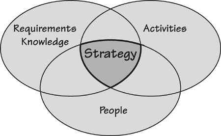
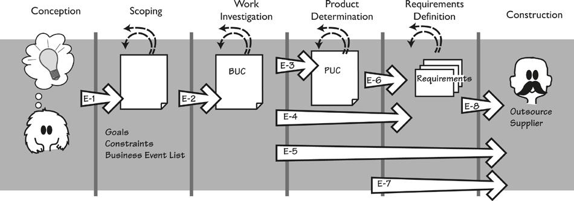
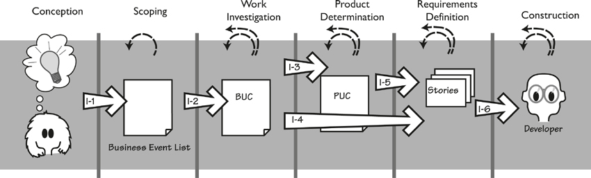
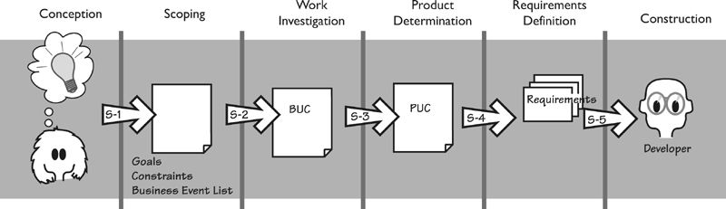

# 9. Strategies for Today’s Business Analyst

[9-P001] *in which we consider strategies for the business analyst to guide requirements discovery in today’s changing environments*

[9-P002] Things used to be a lot simpler. If you were a business analyst, then the chances were that you worked for a large organization, and large organizations always had their own software development teams. The business analyst who worked in this kind of environment would talk to the users who were part of the same organization, write the requirements, and hand them to the internal software developers. This cozy arrangement meant that the BA and the developers were a lot closer to one another. Because the software was built and used in the same organization, it was simple enough to find a developer to make any necessary or requested changes.

[9-P003] Things have changed. The majority of software used today is not developed by the owning organization, but rather purchased. The development role in large organizations is reserved for specialist tasks.

[9-P004] Today, a huge number of ready-made off-the-shelf (OTS) solutions are available. Enterprise resource management (ERM) software, customer resource management (CRM) software, content management systems (CMS), open-source software, Apple’s App Store and similar venues, and a myriad of other applications, components, and solutions are readily available, either freely or for sale.

[9-P005] Given these development and solution options, today’s business analyst has the additional task of deciding the best strategy for discovering and communicating the requirements for whatever approach to automation the organization decides to take.

## 9.1 Balancing Knowledge, Activities, and People

[9.1-P001] A requirements strategy serves as a guide for determining where to start, whether you have sufficient detail, which iterative cycles you need, which form to use when recording your knowledge, when to have reviews, when to involve which stakeholders, when to build prototypes, and when and how to do any of the myriad things that will bring your efforts closer to producing the optimal value for the business. The variations in every project necessitate differences in the order in which you do things, the level of detail to which you do them, and the forms in which you communicate.

[9.1-P002] **Figure 9.1** identifies three variable characteristics that provide useful input for planning your requirements strategy. *Requirements Knowledge* is your understanding of the work, and the product needed to be developed to support that work. It includes the information you obtain from the artifacts you build during the course of your requirements activity and, of course, the requirements you write. *Activities* are the tasks and checkpoints that your project performs to discover and communicate this knowledge. The last characteristic is *People*. Who are the stakeholders—the people whose knowledge you need? What do they know? Where are they? What is their availability?

[9.1-P003] 

[9.1-P004] Figure 9.1. A consistent language for communicating *requirements knowledge*, the *activities* for discovering and disseminating knowledge, and the *people* who are involved are all variables that affect your requirements *strategy.*

## 9.2 Common Project Requirements Profiles

[9.2-P001] Your requirements strategy is a framework for the *Activities* you need to carry out to discover the appropriate level of *Knowledge* and communicate it to the right *People* given the profile of your project. In this chapter, we explore requirements strategies for three project requirements profiles that we commonly encounter in our work: *External, Iterative,* and *Sequential*.

[9.2-P002] A project with an *External* profile is one where, having discovered the requirements, you send them to an external solution provider. The external profile applies when you are buying a ready-made solution from an external vendor, or you have outsourced the development of the solution, or you are sending a request for proposal to several suppliers. It might involve more than one supplier when you are buying and integrating a number of components.

[9.2-P003] With a project with an *Iterative* profile, you have the opportunity to iteratively discover the requirements and release partial solutions until the product is complete. The motivation for this profile is wanting to deliver some results to the customer as quickly as possible, and to be responsive to business changes. With this profile you are developing your solution using developers with whom you can work closely; normally (but not always), they are located within your own organization.

[9.2-P004] Projects fitting the third project profile, known as *Sequential* projects, have more constraints on the specific activities and deliverables; in the most extreme cases, they have rigid phases and documents that must be produced before progressing to the next phase. The requirements must be completely defined before passing them (usually in a prescribed form) to the designers and developers to work on the solution. With this profile, it is difficult to change anything once it has passed through a phase checkpoint.

[9.2-P005] These descriptions focus on the three profiles in their purest form; your project will most likely be a mixture of the three, or incorporate other activities. It is useful to explore and compare the strategies in their absolute form because it provides the basis for you to combine various aspects of each profile to derive a strategy for your own project.

## 9.3 How Much Knowledge Is Needed Before Each Breakout?

[9.3-P001] A question that we come across frequently in our consulting work is, “How much detail, or how much information, do I need in my requirements?” The answer is not the same in every case—it depends on your project profile. Even so, you can use this question as the basis for following the requirements strategy most relevant to your project.

[9.3-P002] All responsible projects have one thing in common—the desire to produce the best result as quickly as possible within the relevant constraints. This means that you don’t waste time by following unnecessary procedures, but neither do you take irresponsible shortcuts that cause the project to miss things that bring about inadequate products, or cause extra maintenance and correction work to be done later in the life of the product. To put it another way, the knowledge you have acquired must be sufficient—and no more than is needed—to enable you to break out of your current activity and start the next one.

[9.3-P003] Each activity in a requirements process builds knowledge; that much is obvious. But how much knowledge is enough? We refer to the accumulation of sufficient knowledge for an activity as meeting its *breakout conditions.* Breakout in this context means that you have reached the point at which the requirements knowledge is sufficient so that moving on to the next activity can be done safely—you have what you need for the next activity to succeed, and as a bonus, you have not wasted time in elaborating requirements that need no more elaboration.

[9.3-P004] The breakout conditions for an activity vary, naturally enough, according to the strategy you are following. In the rest of this chapter we explore example strategies and define the various breakout conditions for each of the project profiles: External, Iterative, and Sequential.

## 9.4 External Strategy

[9.4-P001] **Figure 9.2** summarizes the External project strategy, so named because you are using an external solution provider. In the diagram, note that activities progress from left to right, the arrows show the transitions between activities (which can be jumped over), and are keyed with the breakout condition for the activity.

[9.4-P002] 

[9.4-P003] Figure 9.2. External requirements strategy. This profile applies when the product is to be constructed by an external supplier. The large arrows represent a breakout—a transition from one activity to another. Each arrow is tagged with a key to a breakout condition needed before the transition can be safely made. The smaller dotted arrows represent iteration, both within an activity and within the strategy.

[9.4-P004] The first activity is called *Conception*, which happens when someone has an idea for a project. The idea might be that the organization wants to go into a new business area, or to add to or improve its current capabilities, or comply with some legal obligation, or almost anything else. The people involved in the *Conception* discuss the possibilities, make very preliminary estimates of cost and risk, and derive enough requirements knowledge to enable the project to successfully move on to the next activity. But how much is “enough”?

[9.4-P005] The “enough” is what we call a *breakout condition*. We discussed this before, and the following subsection discusses the breakout conditions for the requirements activities in an External project profile. We suggest that you keep referring to **Figure 9.2** as you read the variations within the strategy.

### 9.4.1 Conception to Scoping

[9.4.1-P001] You achieve breakout *E-1* when you understand enough about the purpose of the project to be able to safely and viably move on to subsequent activities. Taking this step means that you have firmly established the strategic goal of the project. Additionally, you have established the project sponsor, who accepts responsibility for the project and will provide the necessary resources. You have also identified the key stakeholders, and they show willingness to participate. You have identified any solution constraints and time and budget constraints. You have probably discussed external suppliers in enough detail to know that at least one is available to build or supply the intended product.

[9.4.1-P002] Once this knowledge has been assembled and agreed, then you can break out of the conception activity and proceed to scoping.

### 9.4.2 Scoping to Work Investigation

[9.4.2-P001] Breakout *E-2* conditions for the *Scoping* activity are achieved when you have identified the relevant business area (the work) to be studied. Specifically, you have identified the scope of the work by defining the data interfaces between the work and the rest of the world; that is, you know which data enters the work and which data and services the work produces. We discussed this issue at length in **Chapter 3**, Scoping the Work. You should know enough about the scope and the work to be able to partition it into stand-alone chunks using business events or features, and these chunks are traceable back to the scope.

[9.4.2-P002] You also need to have identified all of the stakeholders (business, users, consultants)—not just the key ones—and have determined what involvement you expect from them. You have also ensured that the project goal is measurable, and that you can use it to help you make decisions about where to focus your efforts as you go into detail.

[9.4.2-P003] During the *Conception* activity, you identified the constraints on your project. Now you take them to a more detailed level: Is the constraint justified, and how will you know if it has been satisfied? Understanding the constraints at this stage means that you know what degree of freedom you have in negotiating alternative solutions with your supplier.

[9.4.2-P004] You might also have sketched the intended scope of the product that you want your supplier to deliver. This kind of sketch is not obligatory at this stage, as you most likely have not done enough detailed investigation to be able to accurately identify product scope. However, if you have ideas, then it is better to capture them now. It is, of course, important that future requirements investigation is not limited to this sketched idea for the product.

### 9.4.3 Work Investigation to Product Determination

[9.4.3-P001] The transition from the *Work Investigation* activity can occur when you have accumulated sufficient knowledge of the work to begin thinking about the product to be built, and specifically its interfaces. Breakout *E-3* condition happens when you have understood the business carried out by each business use case (BUC) well enough to make choices about what the product should do to enhance each of those BUCs. This probably means that you have recorded the business functionality in a BUC scenario, some kind of process model, or a list of business rules. At this point, it helps to have a dictionary of the business terminology. Once you have stabilized this knowledge, you are in a position to break out of the *Work Investigation* activity and start determining the scope of the product for your supplier to provide.

### 9.4.4 Work Investigation to Atomic Requirements Definition

[9.4.4-P001] In this variation of the External strategy, you have sufficient knowledge of the business and wish to jump directly from work investigation to atomic requirements definition, without doing any product scope determination. Your intention here is to provide your external supplier with the detailed business requirements, with the intention of the supplier (probably multiple suppliers if you are looking for competitive bids) demonstrating to you which of those requirements can be satisfied by its product.

[9.4.4-P002] Breakout *E-4* conditions are met when you have defined each business use case to a level of agreement and detail such that it can act as the basis for deriving the atomic requirements. The most common way of achieving this level of detail is to write a business use case scenario for each business event (**Chapter 6**). Other options are to build some kind of process model; the exact model you select will depend on your own and your supplier’s preferences. When writing your business use case scenarios, it is important to use the terms you have defined in your dictionary consistently; after all, the purpose of having such a dictionary is to ensure a consistent and unambiguous interpretation of the requirements.

[9.4.4-P003] As mentioned previously, this breakout is commonly used when you want a number of suppliers to bid on your proposal, with the intention of selecting the product that best satisfies your requirements.

### 9.4.5 Work Investigation to Building

[9.4.5-P001] This path is the most radical variation for this strategy: You have accumulated, and documented, sufficient knowledge of the business, and you pass that directly to the supplier with no further elaboration on your part. Your intention is either for the external supplier to design and implement a system to satisfy your business needs, or for the supplier to propose one or more of its products to satisfy as much as possible of your business needs.

[9.4.5-P002] Breakout *E-5* conditions are met when you have identified each business event and have reached a consensus on the functionality of each business use case—probably by writing a scenario for each. Your dictionary, which defines your terminology and data, is quite important here, as it will help your supplier to make an unambiguous interpretation of your scenarios.

### 9.4.6 Product Determination to Atomic Requirements Definition

[9.4.6-P001] Breakout *E-6* conditions are met when you have decided on the desired product scope, and you wish to start defining atomic requirements. At this point, you will have some kind of specification for each product use case; we suggest that you use a PUC scenario, but an activity diagram, a collection of user stories, or any other model will also suffice as long as they indicate the scope of the product and its required capabilities. You should also be careful to supply the rationale behind your decisions about this product boundary.

### 9.4.7 Product Determination to Construction

[9.4.7-P001] Breakout *E-7* conditions can be met when you are working closely with your supplier and you both agree that the requirements at PUC level of detail are sufficient for the supplier to develop or supply a satisfactory product. In this variation of the strategy, because you are not writing atomic requirements, you need to have a clear, consistent, and sufficient PUC specification.

[9.4.7-P002] You must also supply the non-functional requirements for your product use cases. You might annotate your PUC models with the needed non-functionality, or you might find it necessary to write some or all of the non-functional requirements in the usual form. Don’t attempt this breakout unless you have created a dictionary of the terms used in whatever specification you are providing—what you call a “payment” (or anything else) might be very different from what your supplier thinks it is.

### 9.4.8 Atomic Requirements Definition to Building

[9.4.8-P001] Breakout *E-8* conditions occur when you are ready to deliver atomic requirements—functional, non-functional, and constraints—to your supplier. (We describe these requirements in the next few chapters.) Each atomic requirement should have at the very least a description, rationale, and fit criterion (discussed in **Chapter 12**). It may also have—and should have—other attributes that you are using for your atomic requirements. You need some way of tracing each atomic requirement back to its higher-level chunk (business use case and/or product use case). This kind of traceability is crucial when you reach the stage of acceptance testing of the product your external supplier has delivered.

## 9.5 Iterative Strategy

[9.5-P001] With an Iterative project profile (**Figure 9.3**), you are building the product in small increments, and relying to some extent on frequent delivery of these increments, and the feedback they generate, to guide the development of the product. When referring to the diagram in **Figure 9.3**, note that this is an iterative process—each iteration delivers part of the needed functionality. To put that another way, once you have completed the *Construction* activity for one portion, you cycle back to get the next one, possibly going back as far as *Work Investigation* (the dotted arrows indicate iteration). Please refer to this diagram as you read the variations within the Iterative strategy.

[9.5-P002] 

[9.5-P003] Figure 9.3. Iterative requirements strategy. This diagram uses the same activities and conventions as in the previously shown External project strategy (**Figure 9.2**). In this diagram the breakout condition arrows have the prefix “I” for Iterative. The dotted arrows show iteration, both within and between activities.

### 9.5.1 Conception to Scoping

[9.5.1-P001] Breakout *I-1* conditions are met when you have sufficient understanding of the purpose of the project and the business value that the project is intended to deliver. In particular, you and your key stakeholders agree on the vision for the project. At this stage you do not need formal models—although they might help—but enough agreement on the problem to be solved to enable you and your team to move on. We suggest that a rich picture—and, of course, a consensus that it is an accurate explanation of the problem—might be sufficient to make this breakout.

### 9.5.2 Scoping to Work Investigation

[9.5.2-P001] Breakout *I-2* conditions occur when you have identified the scope of the work that is appropriate for the business value your project is to deliver. Perhaps when the project begins to iterate in the later activities, this scope may need to be adjusted slightly, but you have to start with something firm and not a vague idea. We strongly suggest that you satisfy the scoping conditions by building a work context diagram. Unless your scope is for a trivial piece of work, you should partition it. We have found that business events (see **Chapter 4**, Business Use Cases) are the best way of partitioning. The response to the business event—a business use case—is the most convenient unit of work to study in the Work Investigation activity.

[9.5.2-P002] The business use cases are prioritized based on their value to the business, and naturally enough, you work on the highest-priority business events first. Perhaps it is better to think of breakout condition I-2 as having selected the highest-priority business event from those remaining on the list. This list represents your work backlog.

[9.5.2-P003] ***Keep your knowledge visible and shareable so that people can easily see the impact of any change, and respond to it quickly with the minimum amount of administrative overhead.***

[9.5.2-P004] When you iterate back to this activity, you will probably want to reprioritize the list to reflect changes to business priorities, to include new business events that have been discovered as a result of previous iterations, or because new opportunities have arisen that are best met by adjusting your priorities. At any stage you might need to go back and review your work scope; the changes we are speaking of here can affect it at any time. Keep your knowledge visible and shareable so that people can readily see the impact of any change, and respond to it quickly.

### 9.5.3 Work Investigation to Product Determination

[9.5.3-P001] Breakout *I-3* conditions are met when you have learned enough about the selected business use case that you are able to decide the optimal product scope. At this point, you know the business rules carried out by the selected BUC, and you have sufficiently investigated how its functionality fits into the overall work.

[9.5.3-P002] The knowledge is the important thing here, but it is also necessary to share that knowledge with the rest of the team and the business stakeholders. With an Iterative project profile, you are probably working as a member of a small, co-located team, so we suggest that visible displays are probably the best option for sharing information. You might choose to keep your knowledge on the wall in the form of a mixture of posters, scenarios, business story cards, Post-it notes, or other documents that give visibility to the work knowledge you have accumulated. We find it prudent to regularly photograph the wall.

[9.5.3-P003] Of course, this technique won’t work for all iterative projects, as organizational constraints sometimes mandate that you translate your knowledge into prescribed documents. The point is to avoid doing any knowledge translation—that is, production of documents—unless it is unavoidable. The important consideration is that you have the necessary knowledge and it is accessible and understandable to the whole team.

### 9.5.4 Work Investigation to Requirements Definition

[9.5.4-P001] Breakout *I-4* happens when you choose to jump from the business use case directly to defining the requirements for that BUC. These requirements will probably take the form of user stories, as stories usually imply the product boundary. The I-4 breakout conditions are similar to those for I-3, with the addition that you need a profile of the users for whom you are building this part of the product. Additionally, you need to understand any constraints that the solution must respect.

### 9.5.5 Product Determination to Requirements Definition

[9.5.5-P001] Breakout *I-5* conditions are met when you have defined the scope of automation for the chosen business use case. Reaching this point implies that you have taken your knowledge of the BUC and, in conjunction with the business stakeholders, decided how much of it can you profitably automate. This decision was discussed in more depth in **Chapter 8**, Starting the Solution.

[9.5.5-P002] You can represent your product scope decision in many ways. We find it effective to draw the product boundary on a graphic model—an activity diagram or whatever you are using—or to sketch the proposed interface (see **Chapter 8** for more on this topic).

[9.5.5-P003] It is necessary to link your product use case decisions back to your BUCs. This sort of connection enables you to efficiently keep iterating through different ideas and assessing the relative value against the cost for each one.

### 9.5.6 Requirements Definition to Construction

[9.5.6-P001] Breakout *I-6* conditions are satisfied when you have acquired enough knowledge about the part of the work that you are improving to be able to build or assemble the software solution for that piece. Regardless of whether you have chosen to record this knowledge in the form of user stories or atomic requirements (or any other form), you should have captured the functional and non-functional requirements that the product must meet if it is to improve the selected portion of the work.

[9.5.6-P002] Important attributes of the atomic requirement or user story are the rationale—the reason for the requirement—and the fit criterion—a measurement that enables the testers to determine that the delivered product meets the requirement (both rationale and fit criteria are discussed in **Chapter 12**). The reason for including these attributes is to say why the requirement matters, thereby enabling the designers and developers to make the best choices when building the product, and allowing them to decide how much effort to put into testing (requirements with a weak rationale get less attention than showstoppers).

## 9.6 Sequential Strategy

[9.6-P001] A *Sequential* strategy means that the project has formal project phases, and each phase is expected to be completed before the team can progress to the next one; completion of a phase is usually signaled by the production of a document. This strategy is often used by both large-scale projects and projects characterized by an organizational or statutory need for this kind of formality and documentation. **Figure 9.4** illustrates a requirements strategy for sequential projects; this time we have labeled the breakout conditions with an “S” prefix.

[9.6-P002] 

[9.6-P003] Figure 9.4. Sequential requirements strategy. Each of the activities is more or less completed before the next activity begins, making for an orderly progression from beginning to end.

### 9.6.1 Conception to Scoping

[9.6.1-P001] Breakout *S-1* conditions are met when you have enough knowledge about the intention of the project and the value that it will deliver to the business so that you are able to identify the work area that is to be affected by the delivery of the product. To do so, you must have determined the strategic goal that drives the project. You also have a sponsor who accepts responsibility for the project, and you must have identified the key stakeholders. Finally, you should have some idea of the design or technical constraints as well as the budget and time constraints.

[9.6.1-P002] When these items become known, they are recorded for later guidance of the project. In this type of project, it is likely that you have some kind of specific project strategy document that must be completed before you go to the next phase. When this is done, you are able to break out and move to detailed scoping of the work area.

### 9.6.2 Scoping to Work Investigation

[9.6.2-P001] Breakout *S-2* conditions are met when you have specified the boundaries of the work to be investigated (a task described in **Chapter 3**). Your product is intended to improve some part of your client’s work, so you need to investigate that work to discover the requirements and meet the goal of the project. To correctly scope the work, you specify the interfaces between the work and other parts of the organization, or between the work and relevant external systems or customers. These interfaces also serve as guidelines when you are partitioning this work into cohesive functional chunks that are traceable back to the overall scope of the work—these are the business events.

[9.6.2-P002] This scoping knowledge can be represented in any of several ways, but we suggest that a work context diagram and an event list are the quickest and most direct approaches. You also need a stakeholder analysis to define all of your stakeholders (not just the key ones), their responsibilities, and the amount of involvement they need to have in the project.

[9.6.2-P003] In sequential projects, you probably have some kind of prescribed high-level business requirements document that you must populate with scope knowledge to show completion of these breakout conditions.

### 9.6.3 Work Investigation to Product Determination

[9.6.3-P001] Breakout *S-3* conditions are achieved when you have completed the analysis of each of the functional chunks of the work, or business use cases as we are calling them. We wrote about this activity in **Chapter 5**, Investigating the Work. Your accumulated knowledge of the work must be communicated—typically in the form of models and text scenarios, although you should use whatever form is prescribed by standards within your organization.

[9.6.3-P002] The breakout conditions are met when you have understood the work well enough to provide satisfactory documentation of it.

### 9.6.4 Product Determination to Requirements Definition

[9.6.4-P001] Breakout *S-4* can happen when you have defined the scope and high-level functionality of the product you intend to build. For each business use case, you have defined which part of that work the product will do; in other words, you have defined the product use cases. This definition can take several forms: swim lane diagrams, use case diagrams, text scenarios, or annotated process models. In addition, you might have added some interface definitions or example interaction diagrams to illustrate the product scope. It is useful—actually, crucial—to record the rationale for each of your decisions on the product scope.

### 9.6.5 Requirements Definition to Building

[9.6.5-P001] Breakout *S-5* conditions are met when you have defined the atomic requirements for the proposed solution. Each of the atomic requirements (functional, non-functional, constraints) must have a description, rationale, and fit criterion to make it unambiguous, measurable, and testable. Each should be traceable back to the relevant product use case and business use case. Each should use terminology that has been defined in your dictionary. The requirements template in **Appendix A** contains an extensive checklist of the attributes of atomic requirements. We could say that breakout S-5 conditions are met when you have completed the requirements specification according to this template.

## 9.7 Your Own Strategy

[9.7-P001] It is highly unlikely that your project will exactly match one of the profiles just described; instead, you should think of these profiles as generic. There are many variations on the way that projects are run; we cannot possibly hope to illustrate them all. Some of these variations will fall within the parameters of one of the three profiles, while others will use pieces of different profiles. It is also possible that a project might start out using one strategy and then at some stage determine that it would be beneficial to switch to a different strategy, or that within one project, parts could be run using a different strategy. The possibilities are almost endless.

[9.7-P002] We have found that the best way to discover the strategy most suitable for your project is to start with the generic profile model that looks most like your current way of working, and then make changes to accomplish the following goals:

- [9.7-P003] Keep stakeholders involved by having frequent deliveries of artifacts, or working software

- [9.7-P004] Respond to business changes more quickly

- [9.7-P005] Make it easier for stakeholders to provide feedback

- [9.7-P006] Avoid producing deliverables that duplicate existing knowledge, or that provide little or no new knowledge

[9.7-P007] If there are no obvious changes you want to make, then start using your chosen strategy with a view toward possibly changing it as you achieve a better understanding of the profile of your project. Pointing back to **Figure 9.1** at the beginning of this chapter, remember that you are trying to discover and communicate *Requirements Knowledge* in the minimum amount of time, using the level of *Activities* that are most appropriate for the *People* who are involved.

## 9.8 Sharpening Your Requirements Skills

[9.8-P001] A good business analyst is always looking for ways to be a better business analyst. This section highlights some things that you might consider that would make you a better business analyst.

[9.8-P002] “Business analyst” is now considered to be a valid job description. And just as other recognized job descriptions—doctor, engineer, project manager, developer, and so on—have their own organizations and qualifications, so do business analysts. A number of organizations contribute to the recognition of business analysis by offering business analysts’ paths of study leading to qualifications. The three best known are identified here:

- [9.8-P003] International Institute of Business Analysts: **www.iiba.org**

- [9.8-P004] Information Systems Examination Board of the British Computer Society: **certifications.bcs.org**

- [9.8-P005] International Requirements Examination Board: **www.certified-re.de** (in German)

[9.8-P006] There are also conferences and Web forums where you can meet other business analysts and exchange experiences and discuss qualifications.

### 9.8.1 No Longer a Stenographer

[9.8.1-P001] Traditionally, the business analyst was seen as someone who wrote requirements. This task was usually described as “Go and interview the users, and write down whatever they say.” Thus the business analyst filled a passive role, responding to whatever was asked for.

[9.8.1-P002] Today, the business analyst is no longer a stenographer. We can go so far as to say that the today’s business analyst is no longer just a requirements writer.

[9.8.1-P003] ***We know from bitter experience that poor requirements contribute to more than half of all project and system failures.***

[9.8.1-P004] We know from bitter experience that poor requirements contribute to more than half of all project and system failures. This high failure rate suggests very strongly that we must change our approach to discovering requirements. Instead of thinking almost exclusively about a software solution, today’s business analyst is much more concerned with the business problem to be solved. As noted earlier (and repeatedly) in this text, it is the failure to identify the *real* problem to be solved that causes projects to deliver up poor results and poor products.

[9.8.1-P005] Today, the business analyst must be much more proactive. Doing so means interacting more closely with the business stakeholders, and using a variety of models and techniques to ensure that the business stakeholders give an accurate portrayal of the business they are responsible for.

[9.8.1-P006] ***The question to ask is not “What do you want?” but “What do you do?”***

[9.8.1-P007] The emphasis is, or should be, on understanding the problem and letting the solution follow along. As part of this approach, the business analyst must prevent his business stakeholders from becoming fixated on a solution. The question to ask is not “What do you want?” but “What do you do?”

[9.8.1-P008] The business analyst must now study not just the stakeholders’ needs, but also the people who have those needs. The delivered product must match those people, in terms of both the way they work and the skills they have. After all, there is little point delivering a dumbed-down product to a group of scientists, or a standard interface to a group of teenagers who are accustomed to exciting and interesting software products.

### 9.8.2 Limiting the Number of Requirements That Are Written

[9.8.2-P001] A traditional problem with requirements work is the specification. All too often, it is a large, difficult-to-read, and probably ignored document. You know this: When you read a novel, you often skip paragraphs when you think they deal with a topic that has little to do with the development of the story—a lavish description of a room, background information on a protagonist’s car, and so on. Knowing that readers tend to skip these pieces, quite a few authors have said that they take care not to write the parts that readers don’t read.

[9.8.2-P002] We suggest strongly that business analysts emulate these authors and write only requirements that people will read.

[9.8.2-P003] Q: How do you write requirements that are certain to be both read and used by all parties?

[9.8.2-P004] A: Write fewer requirements.

[9.8.2-P005] You can limit the amount of requirements that you have to write by using iteration and prioritization. Let’s look at those processes.

[9.8.2-P006] When you have identified all of the business events, we suggested that you prioritize them. Prioritization, as we are using the term here, means that you find the business events for which an improved implementation will yield the most value to the owning organization. These would be the business events that, when implemented, will result in the greatest reduction in the cost of a business process, or allow your client to sell more of its goods, or provide a service that will result in a larger, more profitable, customer base.

[9.8.2-P007] When you have found these high-value events, implement them using the normal routine of developing the BUC scenario, and from that the requirements. Then go back to the list and do it again. Each time you go back, you are selecting business events that have a lower priority than the last time around.

[9.8.2-P008] ***Once you encounter these low-value events, you stop development.***

[9.8.2-P009] Continue until you have either exhausted the list of business events, or—and here’s where you save time—you find that some business events yield such a low value to the organization that they are not worth developing. Once you encounter these ineffectual events, you stop development.

[9.8.2-P010] We are always surprised (and pleased) at how many business events can be discarded this way, and how many unnecessary requirements are avoided.

### 9.8.3 Reusing Requirements

[9.8.3-P001] Within an organization, projects tend to develop the same kind of products. Insurance companies develops insurance applications, a computer-aided design organization develops CAD applications. Indeed, most organizations find themselves building similar products with each new project.

[9.8.3-P002] ***Most organizations find themselves building very similar products with each new project.***

[9.8.3-P003] In this situation, some overlap between products is likely to occur. Likewise, the business analyst can probably make some use of requirements that have been written for previous projects. To make use of these previously written requirements, you have to create abstractions—look at the requirements and substitute the subject of the current application for the previous one. In other words, instead of a payment for car insurance (the subject of a previous project), the requirement is changed to one that covers paying for house insurance (the subject of the current project). By making these abstractions, the business analyst can often save the effort of rediscovering many of the requirements.

[9.8.3-P004] There is considerable potential to save time and effort by reusing requirements. For that reason, we have devoted the entirety of **Chapter 15**, Reusing Requirements (what else could we call it?), to this very topic.

### 9.8.4 Innovation and the Business Analyst

[9.8.4-P001] Most stakeholders ask for incremental improvements. That is, they want what they have got at the moment, with a few additional changes and features—new buttons on the screen, a little bit more information, the ability to link to one more database, and so on. In other words, people ask for what they’ve got plus minor, incremental improvements.

[9.8.4-P002] Given this fact, it is up to the business analyst to lead the innovation charge. It is not the responsibility of the business analyst to be the only innovator on the project, but he must be the person suggesting innovations and facilitating creativity sessions where the stakeholders are given the opportunity to suggest innovations.

[9.8.4-P003] Having established the need for innovation, the question is obvious: How do you do it? In **Chapter 8**, we discussed some techniques for innovation, but that coverage was by no means an exhaustive treatment of the subject. Many books on innovation techniques are available, and a good place to start is Michael Michalko’s *Thinkertoys.* This author outlines a variety of techniques, several of which you are sure to find suitable for your business analysis work.

[9.8.4-P004]  Reading

[9.8.4-P005] Michalko, Michael. *Thinkertoys: A Handbook of Creative-Thinking Techniques.* Ten Speed Press, 2006.

### 9.8.5 Looking for Business Rules

[9.8.5-P001] Business rules are directions set down by the organization to direct operations, people, and systems as to what they are to do. Such rules can apply to any aspect of the organization, from top management to the lowest-level process. They can be as all encompassing as “Employees are directed not to commit any crime” or as detailed as “The help desk employees will report to their supervisor any cases that are still unresolved 48 hours after the first contact.” Business rules can be written down, or they can be understood by employees and verbally transmitted.

[9.8.5-P002] Some organizations have a process to methodically gather and record their rules. Others approach this task less formally, collecting business rules only as they arise during projects. Sometimes, new business rules that are discovered during a project are recorded; at other times, sadly, they are not. In some cases, your work as a business analyst will uncover previously unknown rules, or will lead to the formulation of new rules. If that was not enough, the Business Rules Approach is a development methodology in which the business rules are recorded in natural language and then translated into business processes, and in some cases, into software.

[9.8.5-P003] Given this kaleidoscope of business rules, it is little wonder that different business analysts approach them in significantly different ways. But let’s consider what we are doing: Business rules are statements of what the business must do. There is no real difference between statements of what the business is to do and the steps in a BUC scenario: The scenario records how the business responds to a business event. That is, it follows the business rules until it has achieved the business objective of the response.

[9.8.5-P004] Given the similarity between business rules and BUC scenarios—and, indeed, some of the requirements—our approach to business rules is probably predictable. At the outset of the project, we ask for the business rules. Naturally, these are provided in varying states of completeness and usefulness. As we work through each of the business use cases, we ensure that all appropriate business rules are embedded into the appropriate scenario (or whatever other model we are using). Business process owners are invaluable in helping to find and interpret the applicable rules.

[9.8.5-P005] ***Your business use case scenarios are a sufficient and useful repository of the business rules.***

[9.8.5-P006] You might consider recording new business rules as a by-product of your business analysis. However, if the organization does not have a formalized way of keeping its business rules, then your BUC scenarios are a sufficient (and probably more useful) repository of the rules.

### 9.8.6 The Business Analyst as Ideas Broker

[9.8.6-P001] We exist in small islands—every organization is made up of them. Most organizations have departments, and the people within one department have limited contact with the people in other departments. This state of affairs leads us to say that a department is an island. Similarly, projects tend to be islands—the people working on one project are usually so busy that they have little time to interact and share ideas with people working on another project. Interaction between different commercial companies is close to nonexistent.

[9.8.6-P002] ***Some of the best ideas come from outside your own island.***

[9.8.6-P003] Despite this segregation, some of the best ideas come from outside your own island. Ideas such as new technology, innovative use of existing technologies, new software products, new ways of working, and almost anything else can be thought of as an idea. While ideas exist in abundance, we have limited mechanisms for discovering these external ideas.

[9.8.6-P004] Most business analysts are already extremely busy, but the role lends itself to external exploration. The role we are suggesting here for the business analysts is that of *broker*. The broker finds ideas, processes, and technology that exist in one island and can be profitably put to use by another island. This type of discovery entails not just an exploration of a problem space, but also a search for useful components and ideas that can be recombined to form new solutions in new problem spaces.

[9.8.6-P005] Why a broker? Because sometimes the business analyst is presenting the ideas to others, and not always making use of those ideas himself. Sometimes the idea is one that has to be changed and adapted before it is practical to use on the business analyst’s own project. Sometimes the ideas are merely stored for future use.

[9.8.6-P006]  Reading

[9.8.6-P007] Hargadon, Andrew. *How Breakthroughs Happen: The Surprising Truth About How Companies Innovate.* Harvard Business School Press, 2003. Hargadon discusses the role of the ideas broker (he calls it “technology broker”) and how it works in many different organizations.

[9.8.6-P008] The business analyst serves as an intermediary, or roving ambassador, between islands. Projects have many stakeholders, who aggregate into islands with their own concerns and interests. Islands—groups of stakeholders—communicate in different ways, and have vastly different levels of skill and knowledge. The accounting people are different from the marketers; the engineers are barely understood by the managers.

[9.8.6-P009] The task of the business analyst as broker is to understand the concerns of each island and to interpret and communicate between them. The business analyst also has to ensure that the concerns of each tribe are prioritized and that the genuinely high-priority items become part of the final product.

### 9.8.7 Systemic Thinking and the Business Analyst

[9.8.7-P001] Systems comprise a set of interconnected components that work together to form a complex whole. Each component (process, machine, person, and so on) plays a part by carrying out some functionality that contributes to the overall goal of the system. Naturally, some of the components will themselves be called a system; looking at these collections from the perspective of the larger context, we can call them a subsystem. Of course, some of these subsystems will contain their own subsystems, and so on.

[9.8.7-P002] ***When a business analyst studies a system, he must see not just the components, but also the way in which they work together.***

[9.8.7-P003] The point to keep in mind is that modern systems are large and complex. When a business analyst studies a system, he must see not just the components, but also the way in which they work together. Changing one of the components may well have an impact on some relatively distant part of the system. Similarly, malfunctioning of one component could cause another component to fail. In addition, any change to a component might change the overall nature of the larger system.

[9.8.7-P004] Systemic (not to be confused with systematic) thinking means looking at how the components play their parts, and considering how one component can disrupt or complement another. Normally the business analyst is concerned with the study of one business area (we refer to this business area as “the work”). However, taking a systemic view means not only looking at the interconnection of the components of the work, but also seeing how the work fits into the larger system that is the organization itself and, indeed, examining how the organization fits into the wider world.

[9.8.7-P005] Systemic thinking is, in one way, the opposite of analysis. Analysis is concerned with partitioning and studying the individual pieces. The word “analysis” comes from the root meaning “to break into constituent parts” or “the process of separating something into its constituent elements.” Thus the title business *analyst* is not exactly appropriate for what we are advocating here, but it shall suffice for the person who studies the business.

[9.8.7-P006] The task is not just thinking about the interface to some new piece of software or the features that make up that software. Instead, the focus is on exploring how that piece of software will fit into the context of the organization, and whether it has the potential to negatively affect some other part of the organization. Doing so means divorcing yourself from the project for the moment and looking at the project from the organization’s viewpoint. Is there anything about this project that could impact—either negatively or beneficially—another part of the organization?

[9.8.7-P007] Naturally, you must do the same thing from within the project. That is, you must consider whether all components of the product being built are working harmoniously with one another.

[9.8.7-P008] We discussed systemic thinking in **Chapter 7**, Understanding the Real Problem. A more detailed look at the subject can be found there, and we urge you to consider systemic thinking as part of your business analysis strategy.

[9.8.7-P009]  Reading

[9.8.7-P010] Meadows, Donella. *Thinking in Systems: A Primer.* Chelsea Green Publishing, 2008. See the bibliography for other books on systems thinking.

### 9.8.8 The Business Analyst as Visualizer

[9.8.8-P001] Visualization is a necessary part of any product development activity. As we discussed previously, it is necessary to understand how the various components and processes within your product and your work interact. As the product has not yet been built, this task requires you to visualize these things, and to communicate your visualization to other stakeholders.

[9.8.8-P002] Visualization is normally associated with data. By visualizing the data and presenting it in a graphic format, the meaning of the data becomes richer and much more powerful. Edward Tufte has written several wonderful books on the subject. A more immediately resource is the Flowing Data website (flowingdata.com). If you visit this site, you will see how the data is more communicable when it is turned into a visual presentation.

[9.8.8-P003] And so it is with systems and products: Words are almost always inadequate to describe them. Your products, systems, and processes are typically multidimensional, and using words alone rarely conveys an accurate picture of their breadth and depth. Yet accuracy is necessary if your stakeholders are to get the right picture of the product you are proposing to build.

[9.8.8-P004]  Reading

[9.8.8-P005] Tufte, Edward. *The Visual Display of Quantitative Information,* second edition. Graphics Press, 2010.

[9.8.8-P006] We suggest that to be an effective visualizer, you become a sketcher. Sketching means, naturally enough, drawing pictures, which many of us are reluctant to do. Perhaps this hesitancy arises because people do not feel they are any good at drawing. Of course, if no one is good at drawing, then the fellow looking at your sketches cannot be critical, because his drawings are no better than yours. So lose your inhibition and draw.

[9.8.8-P007] Your sketches are intended to convey information about the product you visualize. Part of the business analysis process is to liaise with the stakeholders and ensure that they have the same idea of the product as you do. Without visualizing and sketching, however, it is difficult to convey an accurate notion of what the product is to be.

[9.8.8-P008] Visualizing how all the components of the product fit together is not exactly easy; the same is true of visualizing how your product will fit within the larger organization. But it has to be done, and it falls to the business analyst to do it. As we pointed out earlier in this chapter, you are not merely a stenographer who records other people’s wishes, but rather an active player who seeks to bring about a product that will improve a piece of work. Without visualizing how the product fits into the piece of work, it is difficult to say whether it will be beneficial.

## 9.9 Summary

[9.9-P001] This chapter has presented a number of strategies for today’s business analyst. Naturally, not all of them will be immediately applicable to you, but we hope that this discussion has provided some guidance on the variables that affect how you carry out your role. Keep in mind that the business analyst is the central player in most projects. True, the business analyst does not have the same amount of control and authority that the project manager does, nor does the business analyst have the detailed technical skills of the developers. Even so, being in the middle of all things makes the job the most interesting one and, in our humble opinions, the most crucial.
