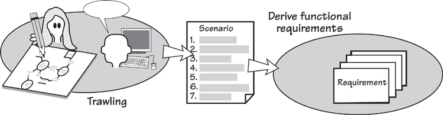
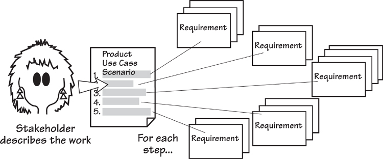
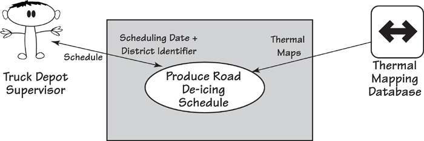
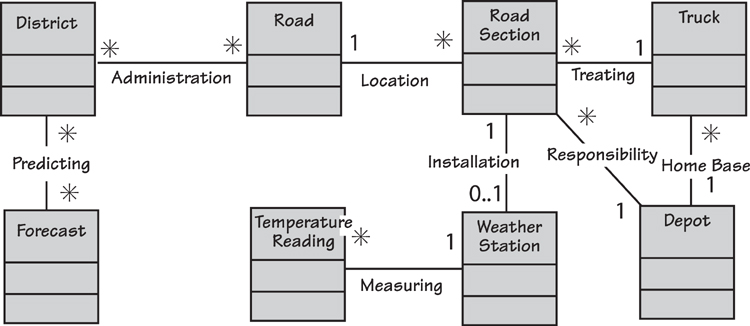
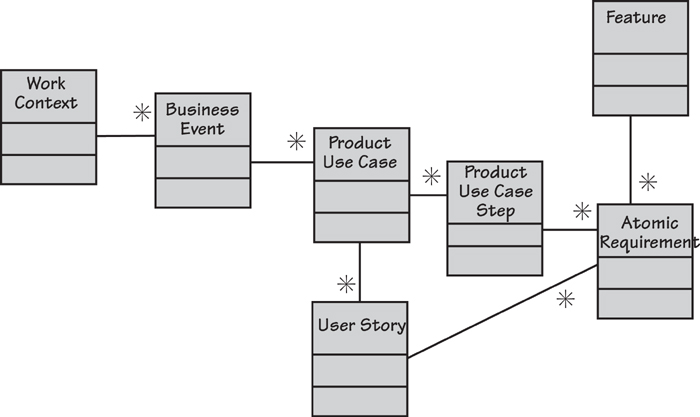
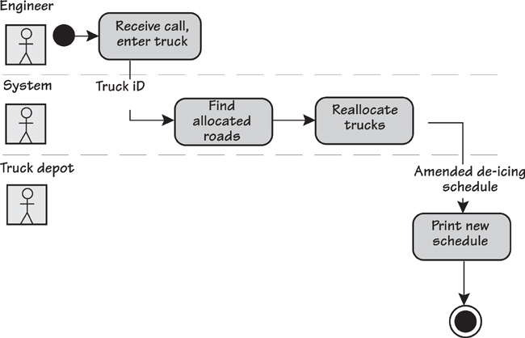
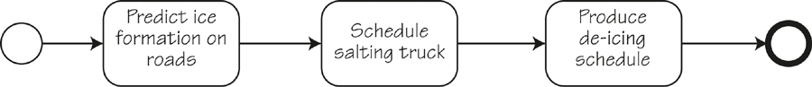
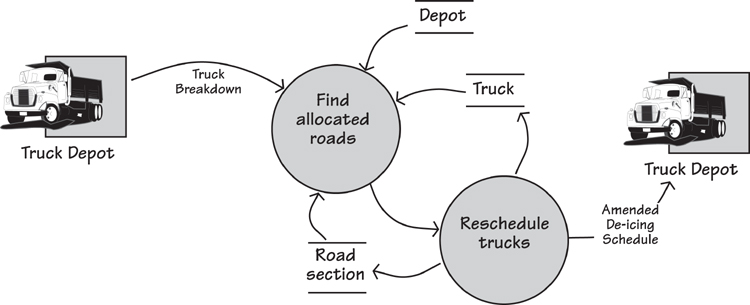

# 10. Functional Requirements

[10-P001] *in which we look at those requirements that cause the product to do something*

[10-P002] Functional requirements specify what the product must do—the actions it must perform to satisfy the fundamental reasons for its existence. For example, this functional requirement describes something the product has to do if it is to complete the work that it is intended to perform:

[10-P003] ***The product shall predict which road sections will freeze within the selected time parameters.***

[10-P004] The reason for functional requirements is that once the business analyst has understood the necessary functionality of the product, he uses the functional requirements to explain to the developers what has to be built.

[10-P005] In **Chapters 5** and **7**, we described how to discover the business needs. In **Chapter 6**, we described how the requirements analyst uses business use case (BUC) scenarios to illustrate the functionality for the interested stakeholders, and product use case (PUC) scenarios to define ideas for the product boundary. Determining the product boundary is discussed in **Chapter 8**.

[10-P006] We assume that you have read the previously mentioned chapters; the interesting part of them now is the transition from the PUC scenarios to the functional requirements. When the stakeholders reach consensus on the PUC scenarios, the business analyst writes a set of functional requirements to specify the functionality indicated by the scenario. These requirements are then used by the developers to build the product. This process is illustrated in **Figure 10.1**.

[10-P007] 

[10-P008] Figure 10.1. The functionality of the work is determined during the trawling activity, and you usually communicate this back to the stakeholders by writing a scenario. You then write functional requirements from the scenario. The end result is a set of functional requirements that specify what the product has to do to support the work.

[10-P009]  **Chapters 5** and **7** describe how to discover requirements. **Chapter 6** explores how to use scenarios to describe business use cases and product use cases.

[10-P010] To get the most out of this chapter, it is necessary to understand the difference between a requirement—a need for your product to do something to support the owner’s business—and a solution—the technological implementation of that requirement. It is also necessary to understand that while we are describing how to write requirements, the most important thing is to understand what the real business need is, and to communicate it in a way that ensures you get the right product built.

[10-P011] Toward the end of this chapter, we discuss some alternative ways of describing the product’s functionality. You may care to jump ahead and preview them, as one (or more) might be suitable for your project.

## 10.1 Formality Guide

[10.1-P001] 

[10.1-P002] Rabbit projects—the small, fast projects—are probably using some form of agile method. These methods emphasize iteration and not producing heavy documentation. We applaud this goal, and suggest that it is not necessary for rabbits to produce the complete requirements specification. Nevertheless, the idea of the description and its rationale contribute greatly to understanding the real requirement and the conversation with the business stakeholders, and should be included in stories. We look at user stories later in the chapter, and discuss alternative ways of specifying the necessary functionality.

[10.1-P003] 

[10.1-P004] Horse projects usually have a need to write their requirements in some communicable form. Compared to rabbits, horses have longer release cycles and geographically scattered stakeholders. This wider distribution of project participants puts greater emphasis on communicating requirements in a more precise and consistent form. It is crucial that team members have a solid understanding of what a functional requirement is, and what the functional requirements mean for the eventual product. That said, horse projects should maximize the potential for communicating the requirements using scenarios and a class model of the work’s stored data.

[10.1-P005] 

[10.1-P006] Elephant projects must have a complete and correct requirements specification. All of the information in this chapter is relevant to elephants, and the discussion on level of granularity is particularly pertinent.

## 10.2 Functional Requirements

[10.2-P001] You have, by this stage, decided how much of your owner’s work is to be done by your automated product. Now you have to describe the functionality of that product.

[10.2-P002] ***Functional requirements describe what the product has to do to support and enable the owner’s work. They should be, as far as possible, independent of the technology used by the eventual product.***

[10.2-P003] Functional requirements are the things your product does to support the work. They should be, as far as possible, expressed independently from any technology that will be used to implement them. This separation might seem strange, as these requirements apply to an automated product. Keep in mind, however that you, as the business analyst, are not attempting to craft a technological solution, but rather to specify what that technological solution must do. How it achieves that outcome is a matter for the designer.

[10.2-P004] The functional requirements specify the product to be developed, so they must contain sufficient detail for the developer to build the correct product with only the minimum of clarification and explanation from the requirements analyst and the stakeholders. Note that we do not say “*no* clarification.” If the developer has absolutely no questions, then you have done too much work and provided too detailed a requirements specification. We explain this point further as we proceed.

## 10.3 Uncovering the Functional Requirements

[10.3-P001] Several artifacts help to describe the product’s functionality. We will look at these items over the course of this chapter, but let’s start with the most obvious one—the scenario. You arrive at scenarios by partitioning the work using the business events that affect it. For each business event, there is a business use case that responds to the business event, and a BUC scenario describes this functionality from the business point of view. From this BUC you derive one, and sometimes more than one, product use case.

[10.3-P002] In **Chapter 6**, we described writing a scenario that shows the PUC’s functionality as a series of steps. The value of the PUC scenario is that it enables you, your business stakeholders, and your developers to have an overview of the functionality for which you are about to write atomic requirements. The steps in the scenario are readily recognizable to the business stakeholders—you write them in the stakeholders’ language. Given this fact, the steps are generalized to encapsulate the details of the product’s functions. Think of the details contained within each step as its functional requirements; your task now is to expose them by writing them as atomic functional requirements. **Figure 10.2** illustrates this progression.

[10.3-P003] 

[10.3-P004] Figure 10.2. The scenario is a convenient way to work with stakeholders to determine the necessary functionality for a product use case. Each of the scenario’s steps is decomposed into its functional requirements. The collection of functional requirements reveals what the product has to do to fulfill the product use case.

[10.3-P005] Let’s look at how this process works by using an example of a product use case scenario. In the IceBreaker road de-icing system, one of the PUCs is “Produce road de-icing schedule.” The actor—the person or thing immediately adjacent to the product (often called a user)—for this use case is the *Truck Depot Supervisor*. He triggers the product to produce the schedule for de-icing the roads in his district. This situation is illustrated in **Figure 10.3**.

[10.3-P006] 

[10.3-P007] Figure 10.3. This use case diagram shows the product generating the road de-icing schedule. This PUC is triggered by the *Truck Depot Supervisor*; the *Thermal Mapping Database* is a cooperative adjacent system providing information to the product use case upon request.

[10.3-P008] The product must do several things to achieve the outcome needed by the actor. The following scenario describes this product use case:

[10.3-P009] Product use case: Produce road de-icing schedule

[10.3-P010] **1.** Engineer provides a scheduling date and district identifier to the product.

[10.3-P011] **2.** Product retrieves the relevant thermal maps.

[10.3-P012] **3.** Product uses the thermal maps, district temperature readings, and weather forecasts to predict temperatures for each road section for the district.

[10.3-P013] **4.** Product predicts which roads will freeze and when they will freeze.

[10.3-P014] **5.** Product schedules available trucks from the relevant depots.

[10.3-P015] **6.** Product advises the engineer of the schedule.

[10.3-P016] The steps in this product use case are sufficient, in general terms, to describe the work, and, as discussed in **Chapter 6**, they can be verified with the interested stakeholders. Having a limited number of steps—we suggest between three and ten—in the scenario prevents you from getting enmeshed in details and ensures that the scenario is written in stakeholder-friendly language.

[10.3-P017] ***Three to ten steps in the scenario give a reasonable level of detail, without making it too complex for nontechnical stakeholders.***

[10.3-P018] Once you and your stakeholders have agreed on the scenario, for each of the steps ask, “What does the product have to do to complete this step?” For example, the first step in the scenario is

[10.3-P019] **1.** Engineer provides a scheduling date and district identifier.

[10.3-P020] What does the product have to do to complete this step? The first thing is fairly obvious, so this is your first functional requirement:

[10.3-P021] **The product shall accept a scheduling date.**

[10.3-P022] When you ask the stakeholders whether there is anything special about the scheduling date, they tell you that due to imprecise forecasts, scheduling is never done more than two days in advance. This information suggests another functional requirement:

[10.3-P023] **The product shall warn if the scheduling date is neither today nor the next day.**

[10.3-P024] Another requirement from the first step is

[10.3-P025] **The product shall accept a valid district identifier.**

[10.3-P026] You discover another requirement when you inquire what is meant by “valid.” The identifier is valid if it identifies one of the districts for which the engineer has responsibility. It would also be valid if it is the identity of a district that is intended by the engineer. This leads us to two more functional requirements:

[10.3-P027] **The product shall verify that the district is within the de-icing responsibility of the area covered by this installation.**

[10.3-P028] **The product shall verify that the district is the one wanted by the engineer.**

[10.3-P029] The number of requirements you derive from any step is not important, although experience tells us that it is usually fewer than six. If you uncover only one requirement from each step, it suggests either the level of detail in your scenarios is too granular or your functional requirements are too coarse. If you find you are writing more than six requirements per step, either your requirements are too fine-grained or you have a very complex use case. The objective is to write enough functional requirements for your developers to build exactly the product your client is expecting and your actor needs to do the work.

[10.3-P030] ***The objective is to write enough functional requirements for your developers to build exactly the product your client is expecting and your actor needs to do the work.***

[10.3-P031] Let’s consider another of the use case steps in our example:

[10.3-P032] **4.** Product determines which roads will freeze and when they will freeze.

[10.3-P033] This step in the use case scenario leads us to write three functional requirements:

[10.3-P034] **The product shall determine which areas in the district are predicted to freeze.**

[10.3-P035] **The product shall determine which road sections are in the areas that are predicted to freeze.**

[10.3-P036] **The product shall determine when each road section will freeze.**

[10.3-P037] Now continue in the same vein, working through each of the steps from the scenario. When you have exhausted the steps, you should have written the functional requirements for the product use case. You should test whether you have completed the use case by walking through the requirements with a group of colleagues, and demonstrating that the use case provides the correct outcome for the actor.

## 10.4 Level of Detail or Granularity

[10.4-P001] Note the level of detail in the preceding examples—the requirements are written as a single sentence with a single verb. When you write this single sentence, you make the requirement much easier to test and far less susceptible to ambiguity. Note also the form “The product shall . . .”; it makes the sentence active and focuses on communicating what the product is intended to do. It also provides a consistent form for the developers and other stakeholders who need to have a clear understanding of what the product is intended to do. You can of course substitute “will” for “shall” (some people claim is it grammatically better), but be consistent with whichever you choose.

[10.4-P002] ***Requirements are written as a single sentence with a single verb.***

[10.4-P003] Incidentally, the word “shall” does not mean that you will definitely be able to find a solution to satisfy the requirement; it simply means that the requirement is a statement of the business intention. The developers are charged with deriving a technological solution to the requirement, and naturally there will be times when they cannot find a cost-effective solution. In the meantime, the requirement clarifies what the business needs the product to do.

[10.4-P004] ***Use a separate component of your requirement to indicate the priority of the requirement.***

[10.4-P005] One last word on the form employed to write the requirements description: Sometimes people use a mixture of “shall,” “must,” “will,” “might,” “could” and so on, to indicate the priority of a requirement. This practice results in semantic confusion, and we advise against it. Instead, use one consistent form for writing your requirements’ descriptions (“The product shall . . .” is the most common) and use a separate attribute of the requirement to identify its priority.

## 10.5 Description and Rationale

[10.5-P001] The examples we have given above are what we call the *description* of the requirement. There is more to a requirement than that. We suggest—strongly suggest—that you add a *rationale* to your requirements to show why the requirement exists. In some cases this might be obvious, but in many circumstances it is a crucial component of the requirement.

[10.5-P002] For example:

[10.5-P003] **Description: The product shall record roads that have been treated.**

[10.5-P004] This might seem at first glance to be a routine requirement and of no great importance. Now let’s add the rationale for this requirement:

[10.5-P005] **Description: The product shall record roads that have been treated.**

[10.5-P006] **Rationale: To be able to schedule untreated roads and highlight potential danger.**

[10.5-P007] Now it looks a little more serious—human lives could possibly be at risk, or at least the owner of this product would not be carrying out his statutory duties. With the inclusion of the rationale, not only have you given the developer the opportunity to build a better solution—one that makes this information readily accessible to the functionality that discovers the untreated roads—but you have also told the tester how much effort to put into testing this requirement. Clearly, the rationale indicates that this requirement is worthy of some attention.

[10.5-P008] ***The rationale indicates whether the requirement is worthy of some attention.***

[10.5-P009] Now consider this example:

[10.5-P010] **Description: The product shall record the start and end time of a truck’s scheduled activity.**

[10.5-P011] This is a normal kind of requirement, one that would not cause much comment. But does it contribute any value to the product? Let’s look at two possible rationales:

[10.5-P012] **Rationale: The truck depot foreman wants to know which trucks are being most used.**

[10.5-P013] or:

[10.5-P014] **Rationale: Trucks are to be scheduled a maximum of 20 out of 24 hours to allow for maintenance and cleaning.**

[10.5-P015] Now we are getting somewhere. The first rationale says that the requirement is very low priority and might not be worthwhile implementing. After all, the depot foreman can discover the trucks’ usage simply by reading their tachometers. The second rationale, however, indicates that this is a valuable requirement—if it is not implemented, then the truck fleet will suffer when the trucks are not properly maintained.

[10.5-P016] By including a rationale with the description, the requirement itself becomes more useful. By knowing *why* something is there, the developers and the testers know much more about the effort they should expend on it. It also indicates to future maintainers why the requirement exists in the first place.

[10.5-P017] ***By knowing why something is there, the developers and the testers know much more about the effort they should expend on it.***

[10.5-P018] The rationale also helps to overcome the possibility of inadvertently writing a solution instead of the real need. For example, this requirement description is written for a machine to sell bus tickets for a city bus company:

[10.5-P019] **Description: The product shall provide the bus network route map on a touch screen.**

[10.5-P020] The description is actually a solution to the problem. When the rationale was added, the real need becomes visible:

[10.5-P021] **Description: The product shall provide the bus network route map on a touch screen.**

[10.5-P022] **Rationale: Passengers have to provide their destination for the fare to be calculated.**

[10.5-P023] The real need—in other words, the real requirement—is for passengers to provide a destination. How they do so is best left to the experience designer and the technology folks. The touch screen might be the best way to accomplish this goal, but then again, it might not. If tourists were prominent users of the buses, then they would not be familiar with the layout of the network, and finding the stop on a map might be a very slow process. This would not please passengers standing behind them in the queue to buy tickets. Also, if the network is divided into zones for charging purposes, then for regular commuters, it might be more efficient to have a way to indicate the number of zones to be covered, and to ignore the actual stops.

[10.5-P024] ***Regardless of how the need is finally implemented, it is clear that writing both the description and the rationale leads to discovery of the real requirement.***

[10.5-P025]  Refer to **Chapter 16**, Communicating the Requirements, for the other attributes of a requirement; **Chapter 12**, Fit Criteria and Rationale, for details of how to make the requirements testable; and **Chapter 13**, The Quality Gateway, for guidelines on testing the requirements.

[10.5-P026] Why is this aspect of requirements development important? Because it is far too easy to hide important functionality by describing an implementation, and far too easy to select the most obvious implementation when better ones may exist. Regardless of how the need is finally implemented, it is clear that writing both the description and the rationale leads to discovery of the real requirement.

[10.5-P027] We have not yet talked about how to ensure that each requirement is measurable and hence testable. We do it by adding a *fit criterion*—and this is so crucial that we have devoted **Chapter 12** to it. We will also illustrate how the requirement description and rationale both serve as input that help you write the correct fit criterion.

## 10.6 Data, Your Secret Weapon

[10.6-P001] As soon as you start to converge on common terminology, you should define what the terms mean in your data dictionary. The first opportunity to do so usually arrives when you have identified the inputs and outputs on the work context diagram. You define these flows by listing their attributes, and these attributes, in turn, enable you to build a business data model. This data model acts as the definition of some of your functional requirements, and provides a common language for your team.

### 10.6.1 Data Models

[10.6.1-P001] Data models—also called class diagrams or entity relationship models—are a rich indicator of the product’s functionality. **Figure 10.4** shows a data model (using UML class diagram notation) for the IceBreaker product. Take a moment to look at it as we discuss how some of the product’s functionality can be derived from this model.

[10.6.1-P002] 

[10.6.1-P003] Figure 10.4. A class diagram showing the stored data that the business needs to predict the formation of ice on roads. A truck is dispatched to treat a road when the readings from the weather station and the forecast indicate the road section is about to freeze.

[10.6.1-P004] The class model shows the classes (or entities) as rectangles. A class is a logical collection of data attributes that is needed by the product to carry out its functionality. The lines between the classes indicate an association between two classes, and the name on the line indicates the reason for the association. The asterisks and the 1s define the multiplicity of the association. For example, a *Road Section* will be recorded as having been treated by one *Truck* (the business policy says that one truck is sufficient to treat a road section, with the sections being about 5 kilometers long), but one *Truck* would be expected to treat many *Road Sections*. The model shows that a *Road Section* has a *Treating* association with one (1) *Truck*, and the *Truck* has the same association with many (\*) *Road Sections*.

[10.6.1-P005] There is a dependency between a product’s stored data and its functionality: You cannot have stored data unless there is some functionality to store and retrieve it, and functions can exist only if they process data. Or, as the song goes, “You can’t have one without the other.”

[10.6.1-P006] Note that the class model is a business data model; it represents the data that must be stored so that the business can do its work. It is not a design for a database, so it does not need to show any implementation details—the database designers will add this information later.

[10.6.1-P007] ***You cannot have stored data unless there is some functionality to store and retrieve it, and functions can only exist if they process data.***

[10.6.1-P008] Let’s examine each of the data classes: *Weather Station* is a data representation of the real-world device installed beside a road. The ice prediction product must have functionality to record the installation of the sensor and its precise location, and to time-stamp and record the *Temperature Readings* as the weather station transmits them. Similarly, there must be functionality to record, change, and delete the *Roads* and their *Road Sections*, and to know which sections are the responsibility of which *Depots*. The product must know which *Trucks* have their home base at a depot, and which are available for scheduling. All of the information we get from the class model indicates the functionality of the product.

### 10.6.2 Data Dictionary

[10.6.2-P001] Your data dictionary defines the meaning of the classes, attributes, and associations on your data model. For example, the data dictionary definition of the class *Road* is

[10.6.2-P002] *Road = Road Name + Road Number*

[10.6.2-P003] Thus, whenever you use the term *Road* in this requirements specification, it complies with this definition. To make it clear why we are interested in a road, there should also be a description of each class. For example:

[10.6.2-P004] *A road is stretch of contiguous (but not necessarily linear) highway that can freeze over causing traffic accidents.*

[10.6.2-P005]  The Volere Requirements Specification Template in **Appendix A** shows an example of the data model and **data dictionary** for the road de-icing project.

[10.6.2-P006] Similarly, your dictionary should also contain a definition of each attribute and association.

[10.6.2-P007] The data model is not an indicator of the complete functionality. However, if you routinely build such a model, it will serve as part of the specification of your functional requirements.

[10.6.2-P008]  See the section in **Chapter 17** on the CRUD check for more about the connection between the data model and the functional requirements.

## 10.7 Exceptions and Alternatives

[10.7-P001] Exceptions are unwanted but inevitable deviations from the normal case caused by errors of processing and incorrect actions. The exception scenario (which we discussed in **Chapter 6**) demonstrates how the product recovers from the unwanted happening. The procedure for writing the requirements remains the same: go through each of the exception steps and determine what the product must do to accomplish that step.

[10.7-P002] For these requirements, you must make it clear that they become reality only if the exception exists. To do so, you might identify a block of requirements as being attached to a particular exception or write each one to include the exception condition:

[10.7-P003] ***If there are no trucks available, the product shall generate an emergency request to truck depots in adjacent counties.***

[10.7-P004] Alternatives are allowable variations from the normal case, which are usually provided at the behest of the business stakeholders. A well-known example is Amazon’s 1-Click. If you have already saved a credit card with Amazon, you have an alternative path available to you when buying goods: Instead of going through the normal check-out routine, you can have the goods be recorded as sold as soon as you click on them. The normal case would look like this:

[10.7-P005] ***The product shall add the selected item to the shopping cart.***

[10.7-P006] Here is the alternative:

[10.7-P007] ***If 1-Click is used, the product shall record the sale of the selected item.***

[10.7-P008] Be prepared to create many requirements to handle the exceptions and alternatives for your product; sometimes these nonroutine cases account for the bulk of the requirements. Given that human users of software systems are capable of the most bizarre actions, you will need to specify a great deal of recovery functionality.

## 10.8 Conditional Requirements

[10.8-P001] Sometimes, you need to add a condition to a requirement. This happens when the requirement comes into play only if certain processing circumstances have occurred. For example:

[10.8-P002] ***If a road scheduled for treatment has not been reported within 30 minutes of its scheduled time, the product shall issue an untreated road alert.***

[10.8-P003] Alternatively, you might find that the requirement reads more easily if you write it with the condition at the end:

[10.8-P004] ***The product shall play the music if requested.***

[10.8-P005] Or even this way:

[10.8-P006] ***The product shall highlight any overdrawn accounts.***

[10.8-P007] This approach works if the conditions rarely appear in your specification—but sometimes that is not true. We discussed alternatives and exceptions earlier, and you will probably find that when these cases arise, many requirements are needed to handle the exception/alternative. Repeatedly writing the condition as an “if” statement is awkward; we suggest that where needed, you tag the requirement with the step of the scenario and write the requirement in the normal imperative way (“The product shall . . .”). You must make your developers aware that the tagged requirements have to be read in conjunction with the scenario to see which are conditional and which are not.

## 10.9 Avoiding Ambiguity

[10.9-P001] Whether the sources of your requirements consist of written documents or verbal statements from interviews, you should be aware of the enormous potential for ambiguity and the misunderstanding that ambiguity can cause. Ambiguity arises from several sources.

[10.9-P002] First, the English language is full of homonyms. English contains an estimated 500,000 words in normal usage and about the same number of technical, scientific, and other specialized words. Normal-language words have been almost randomly added by many different people and from many sources over a long period of time. This growth has led to different usages and meanings of the same word.

[10.9-P003] ***It is difficult to imagine why, when the language contains a huge number of words, that so many of them have multiple meanings.***

[10.9-P004] Consider the word “file,” which is used so commonly in information technology. In addition to meaning an automated storage place for information, it means a metal instrument for abrading or smoothing; a collection of documents; a row of people, as in “single file”; a slang term for an artful or shrewd person; a verb meaning to rub away or smooth; and more recently a verb used by lawyers, as when they “file suits.” Of course, “suit” itself also means the clothing the lawyer wears in court, as well as a set of playing cards such as hearts, diamonds, spades, and clubs. It is difficult to imagine why, when the language contains a huge number of words, that so many of them have multiple meanings.

[10.9-P005] When writing requirements, we have to contend with more challenges than just homonyms. If the context of your product is not clear, then it will also lead to ambiguity. Suppose you have the following requirement:

[10.9-P006] ***The product shall show the weather for the next 24 hours.***

[10.9-P007] The meaning here depends on the type of requirement and what is near it in the specification. Does the requirement mean the product is to communicate the weather that is expected to happen in the forthcoming 24 hours, or must it communicate some weather and continue to do so until one full day has elapsed?

[10.9-P008] We advise you to group your requirements by product use case, and write your requirements one PUC at a time. This system of organization will, to a large extent, reduce ambiguity. For example, consider this requirement:

[10.9-P009] ***The product shall communicate all roads predicted to freeze.***

[10.9-P010] Does “all” refer to every road known to the product? Or just those roads being examined by the user? The PUC scenario tells us that the actor has previously identified a district or an area within the district. Thus we may safely say that “all” refers to the geographical area selected. In fact, the meaning of almost any requirement depends on its context. This is quite a good thing, because we do not need to waste stakeholders’ time by laboriously qualifying every word of every requirement. While anything has the potential to be ambiguous, the PUC scenario, by setting a context for the requirement, minimizes the risk of ambiguity.

[10.9-P011] We love the example erected by the city traffic authority in New York some years ago when it introduced red zones. Red zones are sections of streets where the authorities are particularly anxious that traffic is not impeded. The zones are designated by red-painted curbs and adorned with signs such as that shown in **Figure 10.5**.

[10.9-P012] 

[10.9-P013] Figure 10.5. A traffic sign in New York. The meaning is very clear. Photo by Kenneth Uzquiano, used with the photographer’s permission.

[10.9-P014] Although the last directive on the sign is ambiguous, the workers at the traffic authority made a reasonable judgment in taking the ambiguity risk. Taking into account the context, the authority decided that no driver was foolish enough to think the point intended was that drivers should not make jokes in their cars or give birth to baby goats. In other words, the context determines how drivers interpret the sign.

[10.9-P015] Similarly, when one of the engineers says, “We want to have the trucks treat the roads before they freeze,” it is fairly clear that he does not mean that the roads have to be treated before the trucks freeze. At the very least, the context in which it was said should indicate the meaning.

[10.9-P016] We have already emphasized how progressive definition of terms in your data dictionary (**Section 7**, The Business Data Model and Data Dictionary, of the Volere Requirements Specification Template) will greatly reduce ambiguity. It’s also beneficial to check that the terms defined in the dictionary are being consistently used in the requirements.

[10.9-P017] Here’s another tip: Eliminate all pronouns from your requirements and replace them with the subject or object to which the pronouns refer. (Note the potential ambiguity of the preceding sentence if we had said “they” instead of “the pronouns.”)

[10.9-P018] When you write a requirement, read it aloud. If possible, have a colleague read it aloud. Confirm with your stakeholder that you both reach the same understanding of the requirement. This may seem obvious, but “send the bill to the customer” may mean that the bill goes to the person who actually bought the goods or that the bill is sent to the account holder. It is also unclear whether the bill is sent immediately after the purchase or at the end of the month. And does “bill” refer to an invoice, a bill of materials, or a bill of lading? A short conversation with the appropriate stakeholders about the definition and consistent use of terminology will clarify the intention.

[10.9-P019] Keep in mind that you are writing a *description* of the requirement. The real requirement is revealed when you write the fit criterion. Until you add the fit criterion, a good description and its rationale are both worthwhile and sufficient.

## 10.10 Technological Requirements

[10.10-P001] Technological requirements are functionality that is needed purely because of the chosen technology. In the example of the use case that produces the de-icing schedule, the product interacts with the thermal mapping database. Suppose the designer decides that handling this interaction via an Internet connection is the best option. Because of this technological choice, the product has a need to establish a secure connection. This need is a technological requirement; that is, it arises purely because of the chosen technology. If the designer had selected a different technology to handle this part of the work—say, a direct fiber-optic link—the result would be different technological requirements.

[10.10-P002] ***Technological requirements arise purely because of the chosen technology.***

[10.10-P003] The technological requirements are not there for business reasons, but rather to make the chosen implementation work. We suggest that these requirements either be recorded in a separate specification or be identified clearly as technological requirements and recorded along with the business requirements. Stakeholders must understand clearly why a requirement appears in the specification, so it is important that the technological requirements are not introduced before the business requirements are fully understood.

## 10.11 Grouping Requirements

[10.11-P001] We suggested earlier that you group the functional requirements by use case. The advantage achieved by doing so is that it becomes easy to discover related groups of requirements and to test the completeness of the functionality. Nevertheless, sometimes other groupings may prove more useful.

[10.11-P002] The word “feature” springs to mind here. The meaning and scope of a feature vary depending on the situation. A feature could be as small as turning on an indicator light or as large as allowing the user to navigate across a continent. Indeed, the feature itself is often important from a marketing point of view. Even so, different features have different degrees of value to the organization. For this reason, you might find it necessary to discard or radically curtail features. Grouping the requirements by feature makes it easier to manipulate them and to adjust your specification when the market (or the marketing department’s request) changes. Bear in mind that a feature will usually contain requirements from a number of different product use cases. Thus, if you are grouping requirements by feature so that you can trace changes from and to the business, it makes sense to be able to group them by product use case as well (as illustrated in **Figure 10.6**).

[10.11-P003] 

[10.11-P004] Figure 10.6. A hierarchy of requirements. The work context is the highest-level statement of requirements; it is decomposed into the next level, the business events. The level below the business events comprises the product use cases, each of which is decomposed into a number of product use case steps. The lowest level includes the atomic requirements, each of which can be traced back up the hierarchy. Activity diagrams and user stories are also used to group atomic requirements. Features are a grouping often used by stakeholders from marketing or product version planning.

[10.11-P005] It helps to think of the atomic requirements as the lowest level of requirement specification. You group these into a requirements hierarchy for three reasons:

- [10.11-P006] To be able to involve stakeholders with different depths, breadths, and focuses of interest

- [10.11-P007] To help you discover the atomic requirements in the first place

- [10.11-P008] To be able to deal with volume and complexity

[10.11-P009] A leveled requirements specification meets these expectations as long as you have a non-subjective traceable path from one level to another. We have seen people run into trouble when they create “high-level requirements” and “low-level requirements” that do not have a formal, non-subjective link. This practice creates problems and arguments because “high-level” and “low-level” are subjective. To avoid such conflicts, we recommend that you work with a non-subjective hierarchy such as this: work context, business event, product use case, product use case step, and atomic requirement.

[10.11-P010]  Refer to **Appendix D** for a complete Requirements Knowledge Model that you can use to define your own nonsubjective hierarchy.

## 10.12 Alternatives to Functional Requirements

[10.12-P001] We have just taken you through most of a chapter that tells you how to write functional requirements, and most of this chapter implies that we think writing functional requirements is a good thing to do. However, just as there is more than one way to skin a cat (we have often wondered why anyone would want to skin a cat, and why they would need several methods for doing it—the cat can participate only once), so there is more than one way to describe the functionality of your product.

[10.12-P002] Please keep in mind that whatever you do, you must first understand the correct functionality. The alternatives presented here indicate other forms of capturing and communicating that understanding.

### 10.12.1 Scenarios

[10.12.1-P001] In this and a previous chapter, we suggested that you write product use case scenarios. Earlier in this chapter, we described the process of writing the functional requirements using the steps of the BUC scenario. However, if the intended product is routine and the business area well understood, and if your developers are experienced and willing to collaborate, you might consider simply adding implementation details to the scenario, and use that as your specification. With this approach, you might have to revise the scenario a little to make the steps read from the point of view of the product. You and your developers and testers must be confident that they can write and test the product based on this enhanced scenario.

[10.12.1-P002] If the scenario becomes too long or too elaborate, then revert to writing the functional requirements in the normal manner.

[10.12.1-P003] Do not follow this path if you are outsourcing construction to an external supplier or another department in your organization. For outsourcing, it is better to avoid the increased potential for misinterpretation by writing the atomic functional requirements.

### 10.12.2 User Stories

[10.12.2-P001] User stories are another way to describe the necessary functionality of the product. User stories are used by several agile methods, and you might consider them as an alternative to writing functional requirements.

[10.12.2-P002] The user story is written in this form:

[10.12.2-P003] ***As a [role] I want [functionality] so that [reason for or use of the functionality].***

[10.12.2-P004] User stories are usually written on story cards by the Product Owner (the representative of the customer), who is part of the agile team and represents the business view. The stories are often about features that the product owner thinks should be part of the product.

[10.12.2-P005] ***As a moviegoer I want to have my tickets sent to my mobile phone so that I can avoid the box-office queue at the cinema.***

[10.12.2-P006] The intention of the story card is not to specify the requirements, but rather to act as a starting point, or placeholder, for the requirements. These are discovered as development progresses through conversations between the developers and the stakeholders. Stories are usually written on cards, and the developers annotate the cards with their fleshed-out requirements and the necessary test cases.

[10.12.2-P007] We have written much more about user stories and their use in **Chapter 14**, Requirements and Iterative Development. We refer you to that chapter for a full explanation.

### 10.12.3 Business Process Models

[10.12.3-P001] If, as a matter of course, you build activity diagrams (or any other type of process model), then consider whether they, together with their process descriptions, can serve as the functional requirements. Many organizations (perhaps that should be “many business analysts”) prefer to use process modeling as a way of arriving at an understanding of the necessary functionality. They find their stakeholders relate more easily to diagrams than to text scenarios.

[10.12.3-P002] You can use whatever notation you find most convenient for your process models. There are few bad notations but, unfortunately, many bad ways of using notations. Probably the most popular techniques are the UML activity diagram (**Figure 10.7**), the BPMN process model (**Figure 10.8**), and the data flow model of a business use case (**Figure 10.9**). We have found that analysts have their own preferences when it comes to these diagrams—and these preferences are sometimes expressed with a religious fervor—so we make no attempt to state a preference. Instead, we just ask you to consider them for yourself.

[10.12.3-P003] 

[10.12.3-P004] Figure 10.7. An activity diagram showing the product use case “Truck Depot reports problem with truck.”

[10.12.3-P005] 

[10.12.3-P006] Figure 10.8. A BPMN process model for the BUC that produces the de-icing schedule. Consider how much extra specification your developers need to build the correct product.

[10.12.3-P007] 

[10.12.3-P008] Figure 10.9. A data flow model of the product use case “Truck Depot reports problem with truck.” This diagram is supported by process specifications for each of the processes shown, and a data dictionary to define the data flows and stores.

[10.12.3-P009] Of course, it is also possible to use the process model as a basis, and then write atomic requirements from each of the activities shown on the diagram.

[10.12.3-P010]  Reading

[10.12.3-P011] Robertson, James, and Suzanne Robertson. *Complete Systems Analysis: The Workbook, the Textbook, the Answers*. Dorset House, 1998.

## 10.13 Requirements for COTS

[10.13-P001] We are using the term COTS (commercial off-the-shelf) product to mean any installable software product. It does not matter whether this item is a commercial off-the-shelf software product, an open-source product, or a product that you found in an abandoned bus shelter; we will refer to it as COTS.

[10.13-P002] The COTS product is seen as an alternative to building software from scratch. It contains much of the needed functionality, but usually requires a certain amount of post-installation modification. Sometimes this is easily done using parameters; at other times developers have to write additional code to bring the COTS software into line with what is needed.

[10.13-P003] Many organizations buy a COTS product, and then rearrange the organization and their business processes to fit the COTS. Some organizations consider this approach to be the cheapest way of installing software. Sometimes, some of the rearrangement of the organization seeks to change some of the COTS functionality to meet the needed functionality. When this happens, the business analyst must be able to indicate to the organization the areas of deficiency, and the areas where the COTS product is a mismatch with the desired workings of the organization.

[10.13-P004] ***We recommend that you begin your business analysis by building a context diagram of the work area that will be affected by the COTS product.***

[10.13-P005] There is little point in attempting to document the functionality of the COTS product. However, we recommend that you begin your business analysis by building a context diagram of the work area that will be affected by the COTS product. This activity leads you to the business events of that business area, which you can then compare with the equivalent business event supported by the COTS product. It is not necessary to write a full BUC scenario, as the COTS provider has probably already done so. Nevertheless, you should pay attention to the incoming and outgoing data from each of the business events. Compare this data to the data inputs and outputs of the COTS product, and write requirements for any modifications needed to bring the COTS data in line with the organizational need for data.

[10.13-P006] Alternatively, you can choose to change the organization rather than the COTS product. In this case you write a user manual for the people involved in the business area. This document would describe the new work practices necessary to accommodate the COTS product.

[10.13-P007] Using COTS products does not obviate the need for business analysis. In fact, business analysis is crucial to ensuring that the COTS product functions so that it truly matches the needs of the organization. The task of the business analyst here is to discover and understand the differences between the COTS product and the organization.

[10.13-P008]  Refer to **Chapter 9**, Strategies for Today’s Business Analyst, for more on requirements strategy when you are working with external suppliers.

## 10.14 Summary

[10.14-P001] The functional requirements describe the product’s processing—the things it has to do to support and enable the business. The functional requirements should be a complete and, as far as possible, unambiguous description of the product’s functionality.

[10.14-P002] The functional requirements are derived from the product use cases. The most convenient way we have found to generate the functional requirements is to write a scenario that breaks the product use case into between three and ten steps. Examine each of the steps and ask, “What does the product have to do to accomplish this step?” The things that it does are the functional requirements.

[10.14-P003] We suggest that you write these requirements (for the moment) using two components: a description and a rationale. The latter is the reason for the former’s existence. Elsewhere in this book, we discuss how to formulate the rest of the requirement’s attributes.

[10.14-P004] When you have sufficient functional requirements to achieve the outcome of a product use case, it is time to move on to the next one. As you progress through these PUCs, you may discover that a requirement you defined for one PUC also applies to other PUCs. Reuse the requirement you have already written by cross-referencing it to all relevant product use cases.

[10.14-P005] ***When all of the product use cases have been treated this way, you will have defined the requirements that completely and unambiguously specify the functionality of the product.***

[10.14-P006] When all of the product use cases have been treated this way, you will have defined the requirements that completely and unambiguously specify the functionality of the product.
