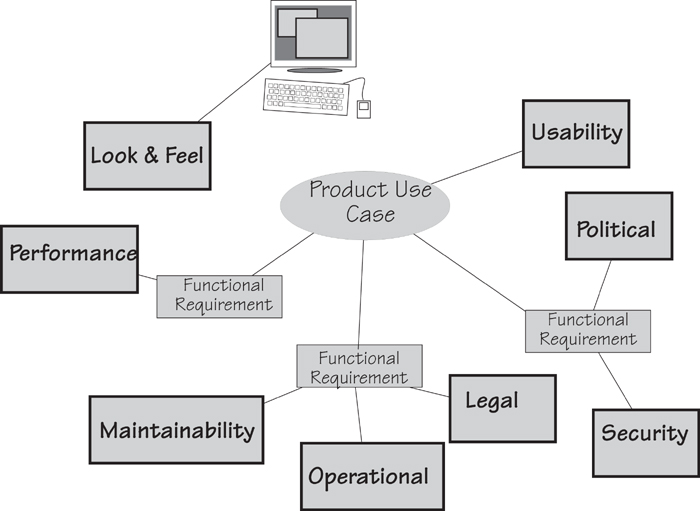
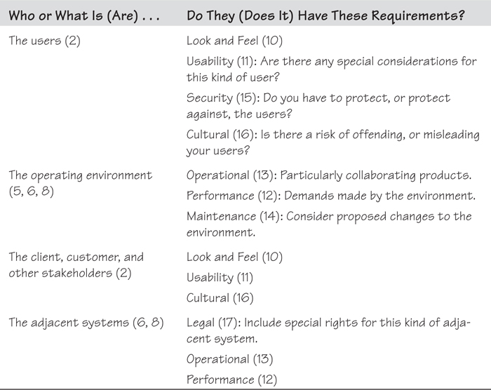

# 11. Non-functional Requirements

[11-P001] *in which we look at the requirements that specify how well your product does what it does*

[11-P002] How can something called “non-functional” be important? Consider this, a story that really happened: The client rejected the delivered help desk software. The functionality was correct—it supported the help desk’s activity, and did all that it was supposed to do, but the client didn’t want it. Why not? Because the users—the help desk operators—refused to use it, preferring to use the existing manual procedures. Why was the product so bad? Because the requirements team had paid almost no attention to the non-functional requirements.

[11-P003] ***Why was the product so bad? Because the requirements team had paid almost no attention to the non-functional requirements.***

[11-P004] We should explain that: The help desk staff already had nine other applications running on their desktops. The requirements team did not bother inquiring about the users’ look and feel requirements. As a consequence, the new software had a completely different interface style with a different set of icons and screen layouts. The help desk people had to use nine other applications and, quite rightfully, refused to learn a new, non-standard interface. The requirements team also ignored the usability requirements—the new software employed work sequences, metaphors, and terminology unfamiliar to the users.

[11-P005] If that was not bad enough, the requirements team failed to gather the performance requirements, which should have specified the speeds and volumes of data handled. The result? A product with a woefully inadequate database that failed to handle the volume of requests made to the help desk. The operational requirements should have set out the operating environment and collaborating products, but didn’t. Security was overlooked, and because cultural requirements were not taken into account, the end product contained several icons considered offensive by some members of the help desk.

[11-P006] All of these issues were non-functional requirements. In this unfortunate case, their omission meant that the project was a complete failure.

## 11.1 An Introduction to Non-functional Requirements

[11.1-P001] Projects that pay little or no heed to non-functional requirements often produce a product that we call “Soviet Style.” If you recall the heavy-handed, awkward designs of the Soviet era, you get the idea. The Soviet products were almost impossible to use, were inconvenient, and often were downright ugly. The central planners had no time for niceties such as usability—and if the comrades didn’t like the look of it, there was always the Gulag.

[11.1-P002]  Reading

[11.1-P003] Soviet Style is one of the patterns of project behavior discussed in our book, *Adrenaline Junkies and Template Zombies: Patterns of Project Behavior.* Dorset House, 2009. Authors: Tom DeMarco, Peter Hruschka, Tim Lister, Steve McMenamin, James Robertson, and Suzanne Robertson.

[11.1-P004] The non-functional requirements describe the qualities that your product must have or, to put that another way, how well it does the things it does. Such requirements make the product attractive, or usable, or fast, or reliable, or safe. You use non-functional requirements to specify response times, or accuracy limits on calculations. You write non-functional requirements when you need your product to have a particular appearance, or be used by people in particular circumstances, or adhere to laws applicable to your kind of business.

[11.1-P005] These properties are not required because they are the functional activities of the product—activities such as computations, data manipulations, and so on—but rather are included because the client expects the activities to be performed in a certain manner and to a specific degree of quality.

[11.1-P006] ***The non-functional requirements describe how well your product does the things it does.***

[11.1-P007] As an example of non-functional requirements in real life, let’s look at Amazon: The Amazon site is easy to navigate, which makes it easier for customers to find things—this, of course, being the purpose of the site. It is also friendly and makes you feel like a valued customer—you can write reviews, get guidance from fellow customers and Amazon’s recommendations, check out and arrange delivery easily, and so on. Amazon has made it so incredibly attractive to shop at its site that people do just that; as a result, Amazon has become the world’s largest online retailer. Likewise, Apple’s iPad is intuitive and a joy to look at; its ease of use is attested to by stories of six-year-old children using iPads without coaching from their parents. As another example, the look and feel of the *New York Times* app boldly says, “This is a newspaper—not a collection of blogs.” Everywhere we see successful products, we see clever discovery of their non-functional requirements.

## 11.2 Formality Guide

[11.2-P001] On some occasions, the non-functional aspects of the product are the prime reason for doing the project. If the users find the existing product difficult to use, slow, or unreliable, then usability, performance, and reliability, respectively, could be considered the most important requirements for the new product. Paradoxically, these non-functional requirements are often overlooked, and sometimes this neglect leads to the downfall of the project.

[11.2-P002] Some, though not all, of the non-functional requirements should be the earliest to be gathered and understood. They should *never* be assumed, as frequently happens, even when the customers and the developers believe they are obvious.

[11.2-P003] 

[11.2-P004] Rabbit projects should use the requirements specification template (see **Appendix A**) as a checklist of non-functional requirements types. Go through the list—ensuring that you check the subtypes—with your key stakeholders and determine their priorities regarding non-functional requirements. “All of them” is not an acceptable answer. Keep the project team aware of these high-priority requirements as you work through the user stories. Also keep in mind that you can write non-functional story cards that are a stand-alone requirement, and have no functional component.

[11.2-P005] 

[11.2-P006] Horse projects have multiple stakeholders. The requirements analysts must ensure that they capture everyone’s non-functional requirements, as well as identify and deal with the conflicts between non-functional requirements originating from the different and scattered stakeholders.

[11.2-P007] 

[11.2-P008] Elephant projects have a need to capture all of their requirements in written form, including the non-functional ones. We suggest you group the non-functional requirements by type in the specification. Requirements can be grouped by use case, but as there will be overlap between use cases, grouping by type prevents duplication.

## 11.3 Functional Versus Non-functional Requirements

[11.3-P001] In our ongoing example, we have explored various aspects of the IceBreaker product in earlier chapters. Part of this product’s functionality is to record road temperatures and moisture levels each time this data is transmitted by the weather stations. Recording data is a functional requirement—it is part of the fundamental business process. Now suppose that this data has to be recorded within half a second; moreover, once it is recorded, no one except a supervising engineer is allowed to alter the data. These two requirements are non-functional, with the first being a performance requirement and the second a security requirement. Although these requirements are not part of the functional reason for the product’s existence, they are needed to make the product perform in the desired manner.

[11.3-P002] ***Think of the functional requirements as those that cause the product to do the work, and the non-functional requirements as those that give character to the work.***

[11.3-P003] Non-functional requirements do not alter the product’s essential functionality. That is, the functional requirements remain the same no matter which properties you attach to them. At the risk of confusing matters, the non-functional requirements might add functionality to the product. In the security example, the product would have to do things to make certain that only supervising engineers alter the data, but that functionality is needed for a non-functional reason—in this case, security. Perhaps it is easier to think of the functional requirements as those that cause the product to do the work and the non-functional requirements as those that give character to the work, and even easier to say that functional requirements are verbs and non-functional requirements are adjectives.

[11.3-P004] Non-functional requirements make up a significant part of the specification. Provided the product meets the required amount of functionality, the non-functional properties—how usable, convenient, and inviting it is (see, for example, Apple’s iPad in **Figure 11.1**)—may be the difference between an accepted, well-liked product and an unused one. Keep in mind that a large part of what people see or feel with your product is there because of the non-functional requirements.

[11.3-P005] 

[11.3-P006] Figure 11.1. Apple’s iPad is a runaway success, largely due to its non-functional requirements. The look and feel of the product is simple and elegant, the usability is legendary (very young children use it), and the performance (the capacity of its memory, battery life, and so on) is impressive. Of course, it is also downright cool (another nonfunctional requirement). While other tablets offer similar functionality, the iPad has won its dominant market share thanks to its superior non-functional qualities. Photo courtesy of Apple.

[11.3-P007] ***Non-functional properties may be the difference between an accepted, well-liked product and an unused one.***

## 11.4 Use Cases and Non-functional Requirements

[11.4-P001] A product use case represents a chunk of work the product does when the work is responding to a business event. In earlier chapters, you saw how the scenario breaks the product use case into a number of steps; for each of these steps, you determine the functional requirements.

[11.4-P002] The non-functional requirements, however, do not fit so neatly into this partitioning theme. Some of them can be linked directly to a functional requirement, some apply to the product use case as a whole, and some apply to the entire product. **Figure 11.2** shows the links between the functionality and the associated non-functional requirements.

[11.4-P003] 

[11.4-P004] Figure 11.2. Non-functional requirements are properties that the functionality must have. The functionality can be represented either by a product use case or by its constituent functional requirements. In this example, the product use case has three functional requirements, each having some non-functional properties. The use case as a whole must meet certain usability requirements, whereas the look and feel requirements relate to the entire product.

## 11.5 The Non-functional Requirements Types

[11.5-P001] We went back over the many requirements specifications we have written and extracted a list of the most useful properties for products to have. For the sake of convenience, we grouped them into eight major non-functional requirement types, and within those, subtypes or variations on the type. You can see these non-functional types and their identifying numbers in the Volere Requirements Specification Template.

[11.5-P002] There is nothing sacred about the categories we have assigned to the non-functional requirements; feel free to make your own. We assigned categories because we have found that having a checklist of requirements types makes it easier to discover all of them—once you are aware of the different types of requirements, you ask your questions about them.

[11.5-P003]  **Appendix A** contains the Volere Requirements Specification Template.

[11.5-P004] Following are the non-functional requirement types we use and recommend. Each number is the identifier allocated to that type of requirement in the requirements specification template.

[11.5-P005] **10** *Look and Feel:* the spirit of the product’s appearance

[11.5-P006] **11** *Usability and Humanity:* the product’s ease of use, and any special considerations needed for a better user experience

[11.5-P007] **12** *Performance:* how fast, how safe, how many, how available, and how accurate the functionality must be

[11.5-P008] **13** *Operational:* the operating environment of the product, and any considerations that must be taken into account for this environment

[11.5-P009] **14** *Maintainability and Support:* expected changes, and the time needed to make them; also specification of the support to be given to the product

[11.5-P010] **15** *Security:* access, confidentiality, recoverability, and auditability of the product

[11.5-P011] **16** *Cultural and Political:* special requirements that come about because of the culture and customs of people who can come in contact with the product

[11.5-P012] **17** *Legal:* the laws and standards that apply to the product

[11.5-P013] We look at each of these categories in more detail as we go through this chapter. In some cases, the nature of the non-functional requirement suggests how you might go about finding any requirements of the types applicable to your product. If nothing suggests itself, refer to the discussion later in the chapter regarding how to go about eliciting the non-functional requirements.

[11.5-P014] ***The requirement type is a device to help you to find the requirements; think of it as a pointer to questions you have to ask.***

[11.5-P015] As you read though these requirement types, keep in mind that sometimes it is difficult to say exactly which type a requirement is. When this sort of uncertainty arises, it could indicate that you have several requirements posturing as one, or that you have one of those not-uncommon requirements that is just too difficult to categorize. If this bothers you, then you can give a requirement multiple types. Don’t sweat it—the category is not important; the requirement is.

[11.5-P016] ***Later you will add a fit criterion to the requirement to clarify it and make it testable.***

[11.5-P017] One other thing to keep in mind as you go through the various non-functional requirements: For the moment, we are dealing only with the description and rationale of the requirement. Some of the examples we give might seem a little vague, ambiguous, or loosely worded. The method of attack is to initially capture the stakeholder’s *intention* for the requirement. Later you will add a measurement—we call it a fit criterion—to the requirement to clarify it and make it testable. We discuss fit criteria in **Chapter 12**, but for the moment we ask you to accept that it is possible to measure such things as “attractive,” “exciting,” “easy,” and other adjectives that appear in the descriptions of non-functional requirements.

[11.5-P018]  Reading

[11.5-P019] Miller, Roxanne. *The Quest for Software Requirements*. MavenMark Books, 2009. This book contains an extensive list of questions to help you discover the nonfunctional requirements.

## 11.6 Look and Feel Requirements: Type 10

[11.6-P001] Look and feel requirements describe the intended spirit, the mood, the style of the product’s appearance. These requirements specify the *intention* of the appearance, and are not a detailed design of an interface. For example, suppose you have a look and feel requirement like this:

[11.6-P002] ***Description: The product shall comply with corporate branding standards.***

[11.6-P003] This requirement does not say the company logo must occupy 10 percent of the screen, nor does it talk about the colors or the typefaces to be used. It simply states that the product must comply with the branding standards your organization has established. These standards are published elsewhere—your own organization has a department (usually the communications department) or group responsible for these standards—and the designer has access to them. The fit criterion, when you add it, measures compliance with the standards.

[11.6-P004] Consider the look and feel requirements that you might build into your next product. Among other appearances appropriate for your product, you might want it to have some of the following characteristics:

- [11.6-P005] Appears to be simple to use

- [11.6-P006] Approachable, so that people do not hesitate to use it

- [11.6-P007] Authoritative, so that users feel they can rely on it and trust it

- [11.6-P008] Conforming to the client’s other products

- [11.6-P009] Attractive to children or some other specific group

- [11.6-P010] Unobtrusive, so that people are not aware of it

- [11.6-P011] Innovative and appearing to be state of the art

- [11.6-P012] Professional looking

- [11.6-P013] Exciting

- [11.6-P014] Cool

[11.6-P015] In some application areas, software has become a commodity, and the distinction between the functionality of competing products has largely disappeared. In such cases, it falls to the non-functional requirements to differentiate one product from another. Usually, the noticeable and exceptional products have a distinctly superior look and feel.

[11.6-P016] You should also consider the audience for your product (see **Figure 11.3**). You are probably not building a product for vampires and their taste for the dark and the gothic, but even when the product will be used in-house, your users have needs when it comes to the appearance of the software. If your product is for sale, then its appearance makes a major contribution to the customer’s buying decision.

[11.6-P017] 

[11.6-P018] Figure 11.3. This is your user—will she be happy with the standard Windows interface? The intended audience for the product largely determines its look and feel requirements. These requirements make it attractive to the audience and sometimes make the difference between a successful product and one that no one wants to use.

[11.6-P019] ***Developers of Web products should place a great deal of emphasis on the look and feel requirements.***

[11.6-P020] Developers of products intended for the Web should place a great deal of emphasis on the look and feel requirements. Your client has in mind the kind of experience he wants visitors to the site to have. Your task is to determine these requirements and to specify them with look and feel requirement descriptions such as these:

[11.6-P021] ***The product shall be conservative.***

[11.6-P022] ***The product shall be intriguing.***

[11.6-P023] ***The product shall appear authoritative.***

[11.6-P024] ***The product shall be attractive to an older audience.***

[11.6-P025] ***The product shall appear simple to use.***

[11.6-P026] ***The product shall appear state of the art.***

[11.6-P027] ***The product shall have an expensive appearance.***

[11.6-P028] You might be tempted to describe the required look and feel by using a prototype; however, we urge caution because a prototype does not always convey the requirements accurately enough. Prototypes (we usually refer to them as “sketches”), when used to aid requirements discovery, are not intended to be designs for the final product. Instead, they are experiments conducted to find the appropriate functionality, and are usually created before all the requirements are known. Unfortunately, because a prototype is a physical artifact, the developer might assume that the end product is supposed to be an almost exact reproduction of the prototype. He has no way of knowing which of the prototype’s features must be implemented exactly as they appear, and which of them are not intended to be definitive. Thus it is important to write the look and feel requirements specifically, and not leave it to someone’s interpretation of a prototype.

[11.6-P029] If you know your product will be implemented using software, then some of your look and feel requirements can be described by citing the appropriate interface standards.

[11.6-P030] ***The product shall comply with Windows User Experience Interaction Guidelines for Windows 8.***

[11.6-P031] And here’s one other requirement that you should consider:

[11.6-P032] ***The product shall conform to the established look and feel of the owning organization’s products.***

[11.6-P033] To reiterate the key point, the look and feel requirements describe the intention of the appearance, and are not the design of the interface. To design the product at this stage would be premature—you do not yet know the complete requirements of the product. Designing is the task of the product’s designers, once they know the requirements.

## 11.7 Usability and Humanity Requirements: Type 11

[11.7-P001] These days, usability is crucial. Your users have become accustomed to products for both personal and business use that make for a pleasant, user-oriented experience. To ignore these usability needs is folly—and yet we find that usability requirements are often overlooked owing to the assumption that no sane developer would build a product that is *hard* to use. In the end, the product’s usability might be one of the key factors that determine whether the intended users actually use it.

[11.7-P002]  For more on how to define your users, refer to the “Stakeholders” section in **Chapter 3**, Scoping the Business Problem. **Appendix B** provides stakeholder templates.

[11.7-P003] The usability and humanity requirements make the product conform to the users’ abilities and expectations. In **Section 3** of the requirements specification template, we describe Users of the Product, and explain how to classify their skill levels. What kind of people are they? What kind of product do they need to do their jobs? The usability requirements ensure that you make a successful product for them. (See **Figure 11.4**.)

[11.7-P004] 

[11.7-P005] Figure 11.4. Consider the capabilities and knowledge of your intended audience when writing the usability requirements.

[11.7-P006] ***Usability requirements make the product conform to the user’s abilities and expectations of the usage experience.***

[11.7-P007] The usability of a product affects productivity, efficiency, error rates, and acceptance (i.e., whether people actually use the product). Carefully consider what your client is trying to achieve with the product before writing these requirements. For example, you might write the following usability requirement:

[11.7-P008] ***The product shall be usable by customers with limited experience of using computers.***

[11.7-P009] You could also target a different user group:

[11.7-P010] ***The product shall be easy to use by certified mechanical engineers.***

[11.7-P011] This requirement captures the intention of your client, and for the moment, it is sufficient; later you will complete it and make it testable. “Easy to use” and “easy to learn” are slightly different characteristics. Easy-to-use products are designed to facilitate an ongoing efficiency, so perhaps some training is necessary before using the product. For example, suppose you were specifying a product to be used for some repetitive task in an office by clerical workers. You would be well advised to make it easy to use, even if the ease of use means training people to use the product, because the ongoing efficiency will pay for this extra effort many times over.

[11.7-P012] Adobe Photoshop is a case in point. Photoshop is a complex product that offers an amazing wealth of options for the manipulation of digital images to its intended audience of graphic artists and photographers. The Photoshop learning curve is a steep one: There is lot to be learned, and we would venture to say that it is not particularly easy to learn (at least it was not for one of your authors). However, once learned, Photoshop’s features make manipulating images a straightforward—even easy—task. Given the depth of functionality needed to do the task and its inherent complexity, Adobe has made its product easy to use once you have learned how to use it.

[11.7-P013] By contrast, easy-to-learn products are aimed at those tasks that are done infrequently and, therefore, may be forgotten between uses—yearly reports, rarely used features of a software product, and so on. Products that are used by the public—for which no prior training is feasible—must also be easy to learn. For example, telephones, Internet connections in public places, and dispensing machines must be easy to learn.

[11.7-P014] You might describe your requirement as follows:

[11.7-P015] ***Description: The product shall be easy to learn.***

[11.7-P016] Alternatively, you might write this requirement:

[11.7-P017] ***Description: The product shall be easy to use on the first attempt by a member of the public without training.***

[11.7-P018] ***Rationale: This is a new product and we need our customers to voluntarily switch to using it.***

[11.7-P019] This description might at first seem blindingly obvious. But it *is* a requirement: Your stakeholder wants the product to be easy to learn, and the rationale gives some insight into why the stakeholder has included the requirement. Later, when you add its fit criterion (which is so important that we have devoted the next chapter to it), you can quantify “easy to use on the first attempt.” A suitable fit criterion might be written this way:

[11.7-P020] ***Fit Criterion: Ninety percent of a panel that is representative of the customer base shall successfully complete [list of tasks] within 90 seconds of their first encounter.***

[11.7-P021] We once had a client who asked for the product to be “friendly.” Because we could not immediately think of a suitable measurement for “friendly,” we felt, naturally enough, that we could not write “friendly” as a requirement. Later on, a little questioning revealed that the product the client had in mind would appeal to the personnel consultants who were to use it. He knew that the consultants would be more productive if they switched to the new product, but he also knew that they would not use it, or would use it badly, if they didn’t like it.

[11.7-P022] With that understanding, the requirement began to look like this:

[11.7-P023] ***The personnel consultants shall like the product.***

[11.7-P024] We suggested to the client that we could measure the number of consultants who, after an initial training period, preferred to work with the new product rather than their old way. The client agreed with this plan: He said that he would be satisfied if 75 percent of the consultants were using the product after a six-week familiarization period. He decided to use an anonymous survey to poll the consultants.

[11.7-P025] Thus we had the description and rationale for our usability requirement:

[11.7-P026] ***Description: The product shall provide the preferred way of working for the personnel consultants.***

[11.7-P027] ***Rationale: To build the consultants’ confidence in the product.***

[11.7-P028] We also had the fit criterion:

[11.7-P029] ***Fit Criterion: Seventy-five percent of the consultants shall switch to using the product after a six-week familiarization period.***

[11.7-P030] Usability and humanity requirements can cover areas such as the following:

- [11.7-P031] Rate of acceptance or adoption by the users

- [11.7-P032] Productivity gained as a result of the product’s introduction

- [11.7-P033] Error rates (or reduction thereof)

- [11.7-P034] Use by people who do not speak the language of the country where the product is to be used

- [11.7-P035] Personalization and internationalization to allow users to change to local spelling, currency, and other preferences

- [11.7-P036] Accessibility to handicapped people (this is sometimes mandated by law)

- [11.7-P037] Use by people with no previous experience with computers (an important, albeit often-forgotten consideration)

- [11.7-P038] Usage during the hours of darkness (this caters to the vampire community)

[11.7-P039] Politeness is another aspect of usability that is often overlooked. Have you ever used a website that asks you to create an account by filling in all of your personal details and then asks you to enter a password? Once you do so, you get this message: “Your password should be a mixture of 8 alphanumeric characters including one uppercase and one numeric digit; reenter your password.” Meanwhile all of the personal details that you entered on your previous attempt to create an account have been obliterated and you are expected to do it all again. We would not tolerate this behavior from another human being, so why should we tolerate it from a piece of software? This sort of behavior toward a user is indicative of a missing politeness requirement:

[11.7-P040] ***Description: The product shall avoid asking the user to duplicate any entered data.***

[11.7-P041] ***Rationale: To build the user’s confidence in the product.***

[11.7-P042] Usability requirements are derived from what your client is trying to achieve with the operability of the product and from which kind of experience the users expect. Naturally, the users’ characteristics make a difference to their expectations. You, as the requirements analyst, have to discover these characteristics and determine which levels of usability will turn the product into a useful and pleasant experience for them.

[11.7-P043] Before you write your usability requirements, it is helpful to have a very clear picture of who will be using your product. In **Chapter 7**, we discussed the process of constructing a persona: a virtual person that is a distillation of the majority of your users. You build a persona by surveying your user community, and then derive the archetypical character to represent that community. When the team derives the persona, team members know it so well that they are able to come to a quick consensus of what is appropriate for that persona. As a consequence, you write the usability requirements to suit the persona—the embodiment of almost all of the people who will actually use your product—instead of writing them to suit your own personal preferences, or the preferences of just the one or two loudest users.

[11.7-P044] Pay attention to usability, as it often leads you to discover the differentiating factor between competing products.

## 11.8 Performance Requirements: Type 12

[11.8-P001] Performance requirements are written when your product needs to perform some tasks in a given amount of time, some tasks need to be done to a specific level of accuracy, or the product needs to have certain data storage capacity, or it has to achieve a certain volume of throughput.

[11.8-P002] Consider these requirements carefully. Everyone asks for a product with a quick response time, but the need for speed must be genuine. All too often, we want things to be done quickly when there is no real need to do so. If a task is to produce a monthly summary report, then there is probably no need to complete this job quickly. By contrast, the very success of the product may depend on speed:

[11.8-P003] ***The product shall identify whether an aircraft is hostile or friendly within 0.25 second.***

[11.8-P004] Capacity is another performance requirement. This requirement is one of the most critical ones for an ATM network:

[11.8-P005] ***The product shall support 2,000 concurrent users.***

[11.8-P006] The client for the IceBreaker product wanted to sell it to road authorities around the world. These authorities are responsible for geographical areas of varying sizes, so the client needed to ensure that the product could handle the largest area covered by any potential client. Initially we would have written the requirement as follows:

[11.8-P007] **The product shall accommodate the largest geographical area of any road authority in the world.**

[11.8-P008] Of course, this is not a practical requirement to hand over to a designer, so eventually we refined it:

[11.8-P009] ***Description: The product shall have the capacity for 5,000 roads.***

[11.8-P010] ***Rationale: The maximum number of roads in the area of any potential customer for the product.***

[11.8-P011] When you are thinking about performance requirements, consider such aspects as these:

- [11.8-P012] Speed to complete a task

- [11.8-P013] Accuracy of the results

- [11.8-P014] Safety to the operator

- [11.8-P015] Volumes of data to be held by the product

- [11.8-P016] Ranges of allowable values

- [11.8-P017] Throughput, such as the rate of transactions

- [11.8-P018] Efficiency of resource usage

- [11.8-P019] Reliability, often expressed as the mean time between failures

- [11.8-P020] Availability—the uptime or time periods when users can access the product

- [11.8-P021] Fault tolerance and robustness

- [11.8-P022] Scalability of most of the above

[11.8-P023] Performance requirements include the risk of damage to people or property. If your product is a lawn mower, then there is a genuine need for the product to avoid cutting off the user’s toes. Isaac Asimov included this requirement in his laws of robotics:

[11.8-P024] ***A robot shall not injure a human being.***

[11.8-P025] Hardware is not the only potential source of damage. You should consider whether your software product could cause damage, either directly or indirectly. The IceBreaker product schedules trucks to spread de-icing materials on roads. Because environmental damage from this material can be serious, the requirement covers this issue:

[11.8-P026] **Description: The product shall schedule de-icing activities so that the minimum necessary amounts of de-icing material are spread on roads.**

[11.8-P027] **Rationale: To minimize environmental damage.**

[11.8-P028] In some cases, you may want to specify a performance requirement for the outcome of a use case. For example, we found this performance-related requirement:

[11.8-P029] ***Description: The product shall schedule de-icing activities so that the rescheduled de-icing truck is estimated to arrive at the breakdown location within 30 minutes of breakdown notification.***

[11.8-P030] ***Rationale: To resume de-icing as soon as possible.***

[11.8-P031] The performance requirements come mainly from the operating environment. Each environment has its own set of circumstances and conditions. The people, machines, devices, environmental conditions, and so on all place demands on the product. The way your product responds to these conditions—how fast it has to be, how strong, how big, how often—dictates the appropriate performance requirements.

## 11.9 Operational and Environmental Requirements: Type 13

[11.9-P001] Operational requirements specify what the product has to do if it is to operate correctly in its environment. In some cases the operating environment creates special circumstances that have an effect on the way the product must be constructed.

[11.9-P002] ***Description: The product shall be used in and around trucks at night and during rainstorms, snow, and freezing conditions.***

[11.9-P003] ***Rationale: These are the most likely conditions that the truck drivers encounter when de-icing roads.***

[11.9-P004] Consider the negative impact on the product if this requirement had not been written, particularly if the designer failed to take into account that the truck driver would be wearing gloves.

[11.9-P005] Not all products must operate in extreme environments—most products are written for personal computers or workstations situated in offices with an uninterruptible power supply. Even the seemingly simple environment may be more demanding than it first appears, however, or it may become more demanding if the operational requirements are not considered carefully.

[11.9-P006] **Figure 11.5** refers to a cargo airline that built its own controller for the high-loader. High-loaders are the machines used to lift the pallets and containers up to the aircraft cargo doors; you have probably watched these devices while staring out the departure gate window waiting for your flight to board. For some reason, the airline’s requirements team failed to include the requirement that the product would be used outside for extended periods—the first rainstorm shorted out the electronics of version 1.0 of the controller.

[11.9-P007] 

[11.9-P008] Figure 11.5. Will the product work in its intended operating environment?

[11.9-P009] Operational requirements are also written when the product has to collaborate with partner products, access outside databases, or interact with other systems that supply information. These items show up as actors on the product use case diagram, or as adjacent systems on the work context model.

[11.9-P010] ***The product shall interact in compliance with the Visa International and Regional Operating Regulations issued January 15, 2012.***

[11.9-P011] To find the operational requirements, look at your product boundary and consider the needs of each of the adjacent systems and/or actors. If necessary, interview each actor or representative of the system to find the requirements resulting from the way that it goes about its product-related work.

[11.9-P012] You might have to describe the physical environment affecting the users when they use the product. This often means special constraints are placed on the way the product is constructed. For example, if the product will be used by people in wheelchairs or while people are driving their cars, then you must specify that constraint.

[11.9-P013] Operational requirements can cover these issues:

- [11.9-P014] The operating environment.

- [11.9-P015] The condition of the users. Are they in the dark (remember those vampires), in a hurry, and so on?

- [11.9-P016] Partner or collaborating systems.

[11.9-P017] Mobile devices have their own special set of requirements:

[11.9-P018] ***The product shall survive being dropped from shoulder height.***

[11.9-P019] ***The product shall be usable in variable lighting conditions.***

[11.9-P020] ***The product shall conserve battery life.***

[11.9-P021] If you are building products for sale, you should include any requirements needed to turn the product into a distributable or saleable item. It is also appropriate to describe any requirements that relate to the successful installation of the product.

## 11.10 Maintainability and Support Requirements: Type 14

[11.10-P001] Usually at requirements time you do not know exactly how much maintenance your product will undergo in its lifetime, nor do you always know which type of maintenance it will need. Nevertheless, maintenance can, to some extent, be foreseen for certain products. Consider whether any expected changes will occur in the following areas:

- [11.10-P002] Organization

- [11.10-P003] Environment

- [11.10-P004] Laws that apply to the product

- [11.10-P005] Business rules

[11.10-P006] Might other factors affect your product? If you know or strongly suspect that the product will undergo relatively heavy maintenance due to expected changes, then specify the types of expected changes and the amount of time allowed for those changes.

[11.10-P007] If you are creating a software product that should be able to run on several different types of operating system, then specify it:

[11.10-P008] ***Description: The product shall be readily portable to Android and iOS.***

[11.10-P009] ***Rationale: We anticipate moving into the mobile device market.***

[11.10-P010] Here you are saying to the developer that you want to be able to implement the product on another platform at some point in the future, and that you will hold him accountable for the adaptability of the product to a new device. When you attach the fit criterion to this requirement, you specify the characteristics of the device and the expected time or effort necessary to make the transition.

[11.10-P011] The IceBreaker product had this requirement:

[11.10-P012] ***The product shall be translated into various foreign languages. As yet, the languages are unknown.***

[11.10-P013] This requirement had a major effect on the product’s designers. They designed the interface in such a way as to make it easy to add new languages. Also, they took into account the fact that different languages sometimes mean different cultures and different ways of presenting data.

[11.10-P014] Support requirements are also covered in this section of the requirements specification. In some cases, your client may indicate that the product will be supported by the existing help desk; in other cases, the product must be entirely self-supporting. By making this point clear at requirements time, you ensure that the designer builds in the appropriate mechanisms for contacting the help desk, or providing answers for questions likely to arise with usage.

## 11.11 Security Requirements: Type 15

[11.11-P001] Security is perhaps the most difficult type of requirement to specify, and potentially the one posing the greatest risk to the owning organization if it is not handled correctly. When you write security requirements, consider the nature of security as it is applied to software and allied products. Shari Lawrence Pfleeger points out that security can be thought of as having three aspects:

- [11.11-P002] Access: The product’s data and functionality are accessible to authorized users and can be produced in a timely manner. Other access requirements focus on denying access to unauthorized people.

- [11.11-P003] Privacy: Data stored by the product is protected from unauthorized or accidental disclosure.

- [11.11-P004] Integrity: The product’s data is the same as the source, or authority, of the data, and is protected from corruption.

[11.11-P005] We have added a fourth security aspect:

- [11.11-P006] Audit: what the product has to do to allow complete verification of its operations and data.

### 11.11.1 Access

[11.11.1-P001] Access also means the data is, well, accessible. In other words, the product stores its data in a way that users can get at it and understand it when they get it.

[11.11.1-P002] In a security context, access requirements specify what the product has to do to ensure that the product’s data is available *only* to authorized users. We often use software “locks” to prevent anyone except the authorized users from reaching the data. At the same time, any security devices employed must not hinder or delay the authorized users from getting what they want when they want it.

[11.11.1-P003] When you write this kind of requirement, you are specifying the allowable access—who is authorized, under which circumstances authorization is valid, and which data and what functions are accessible to each authorized user.

[11.11.1-P004] ***The product shall ensure that only authorized users have access to the [name of] data (or function).***

[11.11.1-P005] The term “authorized” may also need some further explanation. For example, are all authorized users authorized all the time? Does access depend on the time of day or the location of the user at the time of access? Must a user collaborate with another authorized user to gain access? In other words, is the authorization conditional? If so, write these conditions as a requirement.

### 11.11.2 Privacy

[11.11.2-P001] Privacy is a concern to more and more people, as well as to organizations. We are dealing with privacy under the heading of security, but these requirements could also be envisioned as legal requirements; most Western countries have laws governing privacy of personal information held within computer systems.

[11.11.2-P002] Your own concern is most likely writing the requirements for what the product has to do to ensure the privacy of its data. This capability is partly controlled by access, as we discussed earlier, and partly by the product ensuring that its data is not sent or distributed to unauthorized people.

[11.11.2-P003] For example, if data held within the product can be printed, the product loses control of that data. Obviously, printed pages can be removed from the organization’s office, in which case they are no longer secure and privacy can no longer be guaranteed. In the United Kingdom, there have been several recent cases of sensitive government information being printed and then falling into the wrong hands. In one case—we are not making this up—the documents were left on a commuter train in a folder marked “Top Secret.”

[11.11.2-P004] You might consider adding this requirement to your specification:

[11.11.2-P005] ***The product shall prevent all personal and confidential data from being printed.***

[11.11.2-P006] This will prevent any embarrassing (or perhaps illegal) revelations of data. It will also not reveal the existence of any vampires in your records. You might also consider this requirement:

[11.11.2-P007] ***The product shall deliver data in a manner that prevents further or second-hand use by unauthorized people.***

[11.11.2-P008] If your organization holds personal information about its customers, then a little effort expended at the requirements stage might well prevent significant fines being levied later if that private information is ever released, either accidentally or intentionally, from the organization.

### 11.11.3 Integrity

[11.11.3-P001] Integrity means that the data held by the product corresponds exactly to what was delivered to the product from the adjacent system (the authority for the data). You must consider requirements for preventing the loss or corruption of data and, should the worst happen, recovering lost or corrupted data. Your product, when it goes into production, will hold data that is important to the owning organization—integrity requirements are intended to protect that data.

[11.11.3-P002] In our de-icing example, weather stations send data about temperature and precipitation to the IceBreaker product. The weather station originates the data and, therefore, is the authority for it. Any copies of this data, such as those held by IceBreaker, must be faithful to the weather station’s version. Here is the integrity requirement for the IceBreaker product:

[11.11.3-P003] ***The product shall ensure its road temperature data corresponds to the data transmitted by the weather station.***

[11.11.3-P004] You should also consider other integrity requirements, such as those that cause the product to prevent unintentional misuse by authorized users—the most common form of data corruption. Naturally, the product must protect itself against improper usage by outsiders as well.

[11.11.3-P005] Integrity also covers those requirements to prove the integrity of the product after some abnormal happening. These events can include such things as a power failure, an exceptional operating condition, or unusual environmental conditions such as fire, flood, or bombing.

### 11.11.4 Auditing

[11.11.4-P001] You should consider normal auditing to be part of the security section of your specification. Most accounting products have a requirement that they be able to be audited, to ensure that no mistakes are made and that the results shown by the product are correct. Audits are also used to detect fraud or misuse, so audit requirements are often written to say that that the product must leave an audit trail. The precise nature of your audit requirements must be negotiated with your own auditors, who, naturally, are stakeholders for your project.

[11.11.4-P002] Audit requirements are standard for any product dealing with money or valuables. Their inclusion often results in requirements for the product to retain its records for a given time.

[11.11.4-P003] Audit may also mean that the product maintains data on who has accessed which information. The intention of this kind of requirement is to ensure that users cannot later deny they used the product or had access to its information.

[11.11.4-P004] ***Description: The product shall retain a journal of all transactions for the statutory period.***

[11.11.4-P005] ***Rationale: This is required by the auditors and is required by applicable accountancy laws.***

### 11.11.5 . . . And No More

[11.11.5-P001] Consider the effect of adding “. . . and no more” to all of your requirements. This phrase means that the product must do no more than the requirement specifies. For example, if the requirement is to find a name and address from a file, then the product must not delete or change the name and address after finding them.

[11.11.5-P002] Consider this access requirement:

[11.11.5-P003] ***The product shall allow access to authorized users.***

[11.11.5-P004] The “. . . and no more” heuristic yields a complementary requirement:

[11.11.5-P005] ***The product shall ensure that only authorized users are able to gain access.***

[11.11.5-P006] For security reasons, you might consider adding an overriding requirement to your specification:

[11.11.5-P007] **The product shall not do anything except that which has been specified as a requirement.**

[11.11.5-P008] Sometimes well-meaning product builders make the product perform faster or be bigger than specified, or they add unspecified features. While these properties may be beneficial to one or more parts of the product, they may well have a detrimental effect on the product as a whole or on the security of the product. We know of several cases where unauthorized or unspecified features added to a bank’s website opened a serious security loophole. It is necessary to ensure that your development team does not build in extra features or properties without first negotiating their inclusion as requirements.

[11.11.5-P009] Immunity is also part of the security requirements. Specify requirements for the product to protect itself against malevolent software such as viruses, worms, Trojan horses, and any of the many other variations on the theme of attacking another computer.

[11.11.5-P010]  Reading

[11.11.5-P011] Pfleeger, Charles, and Shari Lawrence Pfleeger. *Analyzing Computer Security: A Threat/Vulnerability/Countermeasure Approach*. Prentice Hall, 2011.

[11.11.5-P012] Clearly, security is important, and sometimes essential. It should be assigned a priority that reflects the value of misusing the product. For example, if your product is to be used by a bank, or if it processes credit card or financial trading transactions, then the value of misuse (in financial terms) is high. Similarly, if your product is intended for the military, then misuse may result in loss of life (perhaps even your own) or loss of a military advantage. Thus, for financial, military, or life-support products, security has a higher priority, and consumes more of the budget, than for many commercial systems.

[11.11.5-P013] You should consider calling in a security expert as a consultant stakeholder. Software developers are not usually trained in security, and the security of some functionality and data is so important that you need experts to advise you on the security requirements.

## 11.12 Cultural Requirements: Type 16

[11.12-P001] Cultural requirements specify special factors that would make the product unacceptable because of customs, religions, languages, taboos, prejudices, or almost any other aspect of human behavior. Cultural requirements are needed when you try and sell a product into a different country, particularly when its culture and language are different from your own.

[11.12-P002] While “hello” and “stop” are almost universally recognized words and have the same meaning in all cultures, most other words don’t. In English we have a single word for “you,” whether we are speaking to one or many people (excluding the Southern “y’all”). Many other languages, however, have a different word for the plural and singular “you.” Matters become even more complicated in those languages that have a different “you” depending on the familiarity of the contact. In French, you use the formal *vous* to speak with people in a business situation—especially superiors—and *tu* when speaking to family and close friends. To use *tu* too soon in a relationship can be thought of as rude. In Denmark, the familiar *du* is used almost always except when speaking to old people, when you say *de*. To use the formal *de* is considered stiff and unnatural by most people.

[11.12-P003] The first time your authors went to Italy, looking forward to experiencing the lively Italian atmosphere, we found an elegant, stainless steel coffee bar—the sort of place always full of beautifully dressed people all talking at once. We went to the bar and ordered two *cappuccini* and two pastries. The barman gave us a lengthy explanation in Italian, shook his head and pointed to the cashier. Thus we discovered a cultural requirement: In Italian coffee bars, it is necessary to first go to the cashier and pay, and only then to go to the bar, hand over your receipt, and place your order (**Figure 11.6**). At the risk of being deprived of our morning coffee, we soon learned to fit into the culture.

[11.12-P004] 

[11.12-P005] Figure 11.6. Sometimes cultural requirements are not immediately obvious.

[11.12-P006]  Reading

[11.12-P007] Morrison, Terri, and Wayne Conaway. *Kiss, Bow, or Shake Hands: How to Do Business in 60 Countries*, second edition. Adams Media, 2006.

[11.12-P008] We take our own culture for granted, and we don’t give a lot of thought to how other people might perceive our products and ourselves. If your product is to be used outside your own country, and in some cases outside your own local region or state, consider whether you should call on the services of a cultural expert. Cultural requirements are often unexpected, and at first glance sometimes appear to be irrational, such as vampires will not enter your house unless you invite them. But you have to keep in mind that the reason behind the requirements lies outside your own culture. If your reaction is “Why on earth do they do it like that?”, it is possible that you have discovered a cultural requirement. It is also worth noting that different professions might have cultural differences. The culture of, say, engineering is quite different from that of marketing. Make sure that you do not specify a marketing-type solution for engineers.

[11.12-P009] Following are some requirements you might consider cultural.

[11.12-P010] Religious observances:

[11.12-P011] ***The product shall not display religious symbols or words associated with mainstream religions.***

[11.12-P012] Political correctness:

[11.12-P013] ***The product shall not use any terms or icons that might possibly offend anyone on the planet.***

[11.12-P014] Spelling:

[11.12-P015] ***The product shall use American spelling.***

[11.12-P016] Forcing political or cultural alignment:

[11.12-P017] ***The product shall offer the choice of language in the order appropriate for the region of the country.***

[11.12-P018] This last requirement comes from Belgium, where three or four languages are spoken (depending on whom you are speaking with); each region naturally considers its language to be the most important one. It is considered inappropriate to offer French *before* Flemish if the user is logged in from Flanders.

[11.12-P019] The more we build products for use in different walks of life, by different professions, and for different socioeconomic groups in different countries, the more we need to consider cultural requirements.

## 11.13 Legal Requirements: Type 17

[11.13-P001] The cost of litigation is one of the major risks for software-for-sale, and it can be expensive for other kinds of software as well. You must make yourself aware of the laws that apply to your kind of product, and write requirements to ensure that the product complies with these laws. Even if you are building software for use inside your own organization, be aware that laws applying to the workplace might be relevant.

[11.13-P002] A legal requirement is written like this:

[11.13-P003] ***The product shall comply with the Americans with Disabilities Act of 1990 as amended.***

[11.13-P004] You may need to consult with your lawyers to determine which laws are applicable. The law itself may also specify its own requirements. For example, automated products built for drug development use by the pharmaceutical industry must be self-documenting, although the precise nature of this capability varies. Nevertheless, you (or anyone else writing requirements for these applications) have to understand that these legal requirements exist and write them into your specification.

[11.13-P005] You are required by law to display copyright notices, particularly if you are using other people’s products. Products are required by law to display warning messages if there is any danger that some dim-witted user might do the wrong thing with it. For example, a blanket made in a southeast Asian country carries this warning:

[11.13-P006] ***Warning. Do not use blanket as a hurricane shelter.***

[11.13-P007] A label on a child’s scooter reads:

[11.13-P008] ***This product moves when used.***

[11.13-P009] Start with your company’s lawyers; they have far more experience with the law than you. Here are several things that you can do to facilitate compliance:

- [11.13-P010] Examine adjacent systems or actors—that is, the entities that have contact with your product. You can use your context diagram to identify them.

- [11.13-P011] Consider their legal requirements and rights. For example, are any of the disabled-access laws applicable? Does the adjacent system have any rights to privacy for the data that you hold? Do you need proof of transaction? Or nondisclosure of the information your product has about the adjacent system?

- [11.13-P012] Determine whether any laws are relevant to your product (or to the use case or the requirement). For example, are data protection, privacy laws, guarantees, consumer protection, consumer credit, or right to information laws applicable?

### 11.13.1 Sarbanes-Oxley Act1

[11.13.1-P001] The Sarbanes-Oxley Act (SOx), officially titled the Public Company Accounting Reform and Investor Protection Act of 2002, marks a significant change to the U.S. securities laws. This legislation was enacted following a number of large-scale corporate financial scandals involving WorldCom, Enron, Arthur Andersen, and Global Crossing. The act requires all publicly traded companies to report on the effectiveness of their internal accounting controls.

[11.13.1-P002] SOx has an indirect impact on the requirements activity. That is, it makes it a criminal offense for CEOs and CFOs to neglect the integrity of the internal controls of their companies. As a consequence, traceability between the source of the information and the company’s financial reports is now essential. In effect, the executive needs to be able to review your product at some level (presumably not the code) to determine that it presents fair and accurate data about the financial status of the company. To satisfy this need, you may have to present your requirements to the executive. It certainly means that for all internal financial reporting, you must be able to produce the requirements.

[11.13.1-P003] The Sarbanes-Oxley Act also includes provisions requiring the organization to have a credible and detailed security policy. (We looked at security previously in this chapter.) Section 404 of SOx is the part most closely tied to IT security.

[11.13.1-P004] Even if you are outside the United States, if your product is to be used by an organization that does business with U.S. entities, then there could be SOx implications. Check with your lawyers.

### 11.13.2 Other Legal Obligations

[11.13.2-P001] If you are reading this book in the United States, you should also be aware of the Health Insurance Portability and Accountability Act (HIPAA). This act restricts access and disclosure of personally identifiable medical records: You must not disclose personal medical information to unauthorized parties, and no third party must be able to reengineer statistical data to identify any individual. HIPAA has recently been extended as part of the Affordable Care Act (ACA) of 2010.

[11.13.2-P002] The Gramm-Leach-Bliley Act applies to financial institutions and likewise prohibits the unauthorized disclosure of personal information.

[11.13.2-P003] If your product is to be used by a unit of the U.S. government, the Federal Information Security Management Act of 2002 (FISMA) probably applies.

[11.13.2-P004] If that is not enough to make your head ache, you should also check whether the Dodd-Frank Wall Street Reform and Consumer Protection Act of 2010 applies to your project. This act implements financial regulatory reform, and in some cases is applicable to companies that, while outside the United States themselves, do business with U.S. companies. The act subjects foreign companies to prudential supervision in the United States if the company is adjudged to be carrying on significant financial activity in the United States.

[11.13.2-P005] You should also check whether the Privacy and Electronic Communications (EC Directive) Regulations 2003 applies to your product. This directive, which may shortly be updated, applies to non-European Union (EU) countries that are operating within the EU, as it does to EU companies that wish to export data to other countries, particularly the United States.

[11.13.2-P006] In the United Kingdom, the Data Protection Act of 1998 prohibits using data—and this includes disclosing it—in any manner that does not comply with your organization’s registration under the Data Protection Act. The act prohibits most personal disclosure, but also provides for individuals’ access to personal data held about them.

[11.13.2-P007] There’s more. Lots more. We urge you to consult your organization’s lawyers. After all, they are paid to give advice on matters of legal compliance.

### 11.13.3 Standards

[11.13.3-P001] Legal requirements are not limited to the law of the land. Some products must comply with industrial or professional standards. For example:

[11.13.3-P002] ***The product shall comply with our ISO 9001 certification.***

[11.13.3-P003] Now that we have considered the content of the non-functional requirements, let’s look at ideas for finding them.

## 11.14 Finding the Non-functional Requirements

[11.14-P001] Like all requirements, the non-functional ones can come to light at any time. Nevertheless, there are certain places where we can look that give us better opportunities to discover them.

### 11.14.1 Blogging the Requirements

[11.14.1-P001] When you are trying to elicit non-functional requirements, blogs and wikis can be useful. Start a blog (or any other form of online collaborative thread) using the template’s non-functional sections and subsections as headings. That is, instead of limiting your search to “Usability Requirements,” instead use the subsections “Ease of Use,” “Personalization and Internationalization,” “Ease of Learning,” “Understandability and Politeness,” and “Accessibility.” Do not place any limits on what people can contribute, but encourage your team and your stakeholders to contribute what they think are the right properties for the product to have in these categories. You will inevitably receive a number of solutions instead of requirements, and some completely unworkable ideas, but they will provide you with the basis from which to create the abstraction needed to find the underlying requirement.

### 11.14.2 Use Cases

[11.14.2-P001] You can consider each use case from the point of its non-functional needs. For example, the IceBreaker product has a product use case called “Detect icy roads,” which produces the road de-icing schedule showing the roads to be treated and the trucks allocated to them. The relevant stakeholders tell you that the schedule will be used by a junior or medium-grade engineer. For each of the non-functional requirements types, interview these stakeholders about the product’s needs.

[11.14.2-P002] For example—and we list these requirements in the order they appear in the template—the look and feel of the schedule should be such that new engineers (they have a high turnover rate) can immediately feel comfortable with it:

[11.14.2-P003] ***Description: The product shall appear familiar to new engineers.***

[11.14.2-P004] ***Rationale: We frequently have new junior engineers and want the product to have an appearance that is acceptable to them.***

[11.14.2-P005] This requirement is slightly more difficult to quantify, but you will be able to write a suitable fit criterion for it after you have read **Chapter 12**. For the moment, the stakeholders’ intention is sufficient.

[11.14.2-P006] The usability and humanity requirements for the product use case are next. The stakeholders want the schedule to allow an engineer to easily direct the trucks to the correct roads. The requirement looks like this:

[11.14.2-P007] ***Description: The product shall produce a schedule that is easy to read.***

[11.14.2-P008] ***Rationale: It is important that only the correct roads are treated.***

[11.14.2-P009] The rationale shows us that the reason for wanting an easy-to-read schedule relates to accuracy of the road treatment. Thus, when you write the fit criterion for this requirement, you would add a quantification that measures the number of correct roads have been treated, and thereby the success of the product in implementing this requirement.

[11.14.2-P010] Performance requirements focus on issues such as how many, how fast, and so on. In this case, the schedule has to be produced within a few seconds of the engineer wanting it:

[11.14.2-P011] ***The product shall produce the schedule within 3 seconds of the user’s request.***

[11.14.2-P012] Here’s another performance requirement:

[11.14.2-P013] ***The product shall be able to do ice prediction calculations for 5,000 roads.***

[11.14.2-P014] Operational and environmental requirements deal with the physical operating environment. In the IceBreaker example, they will be the same for all of the product use cases. Naturally, you need write them only once, as they describe the mandated computers, the database, and so on for the product as a whole.

[11.14.2-P015] Maintainability and support requirements specify any special conditions that apply to keeping the product up-to-date or adapting it to another environment. The client for the IceBreaker product intends to monitor roads for different road authorities, so a maintainability requirement is written like this:

[11.14.2-P016] ***The product shall enable the addition of new road authority areas within two days.***

[11.14.2-P017] Also, given that this product use case is usually activated at night, we have the following requirement:

[11.14.2-P018] ***Description: The product shall be self-supporting.***

[11.14.2-P019] ***Rationale: The help desk will not be manned. There will be no fellow users available to help.***

[11.14.2-P020] Security requirements deal with access to the product. For the IceBreaker product, the client does not want unauthorized people running the schedule:

[11.14.2-P021] ***The product shall allow access only to junior and higher-grade engineers.***

[11.14.2-P022] There is also an audit need here, as road authorities must be able to prove they treated the roads correctly:

[11.14.2-P023] ***The product shall retain all ice predictions for all occasions on which the schedule is run.***

[11.14.2-P024] Cultural requirements for this product use case are concerned with fitting into the way that the engineers work:

[11.14.2-P025] ***The product shall use terminology acceptable to the engineering community.***

[11.14.2-P026] Finally, we reach the legal requirements. Many road authorities have a statutory obligation to prove that they have exercised due diligence in monitoring and treating the roads under their control:

[11.14.2-P027] ***The product shall produce an audit report of all road schedules and their subsequent treatments. This must comply with ISO 93.080.99.***

### 11.14.3 The Template

[11.14.3-P001] Use the template as a checklist of non-functional requirement types when interviewing your stakeholders. Go through the template looking at each of the subtypes and probe for examples of each. Refer to the template in **Appendix A** for more explanation and examples of the non-functional requirements.

### 11.14.4 Prototypes and Non-functional Requirements

[11.14.4-P001] You can use prototypes to help drive out non-functional requirements. At requirements time, the prototype usually takes the form of a whiteboard sketch, a paper prototype, or some other quick-and-dirty mockup of what the product *might* be like. The intention here is not to design the product, but rather to ensure you have understood the needs by reverse-engineering the requirements from the prototype. We discussed this process in **Chapter 5**, Investigating the Work.

[11.14.4-P002] In the case of the scheduling product use case, your stakeholders respond favorably to a sketch of a screen showing the roads to be treated in a glowing, cold blue color; the safe roads in green; and the treated roads in yellow. The engineers are delighted that they can see the topography of the district and the roads.

[11.14.4-P003]  See **Chapter 5** for guidance on building requirements prototypes.

[11.14.4-P004] ***The product shall distinguish clearly between safe and unsafe roads.***

[11.14.4-P005] ***The product shall make any unsafe roads obvious.***

[11.14.4-P006] You do not yet know that “a glowing, cold blue color” is intuitive—you need some ergonomic input or user surveys for that. Nevertheless, the intention is clear from the prototype.

[11.14.4-P007] Go over your own prototypes using the template. For each of the non-functional types, which requirements does the prototype suggest? Go through the prototype carefully, and keep in mind that it is not the requirement, but rather a simulation of the requirement. It is unrealistic to hand over the prototype to the developer and expect the correct product to emerge.

### 11.14.5 The Client

[11.14.5-P001] The client for the product may also have expectations that are relevant here. In many cases, the reason for building a new product is to provide a service to the users or to the customers of the business, and the attractiveness of that service depends on one or more non-functional qualities. For example, providing portable, or highly usable, or secure functionality may be crucial to the development effort. Alternatively, your client may say that if you cannot provide an interactive and graphic display of the current trading position, then he does not want the product. Thus your client becomes the prime source of the critical non-functional requirements.

[11.14.5-P002] Once the functional requirements are met, the non-functional qualities may be what persuade a potential customer to actually buy your product. After all, it might well have been its non-functional properties that influenced your own recent buying decisions. Also think about the non-functional requirements of products that you admire.

[11.14.5-P003] **Table 11.1** summarizes the questions to ask for a use case or a functional requirement. Ask your client to what degree these questions are relevant to the product that you are specifying. Your client, or the marketing department, is the source of information about what will make customers buy the product; make use of them.

[11.14.5-P004] Table 11.1. Finding Non-functional Requirements

[11.14.5-P005] 

[11.14.5-P006] For each use case or the product as a whole, consider the factor in the first column of **Table 11.1**. When you have an adequate knowledge of this factor, use it as a trigger to start questioning your stakeholders about the requirement types in the second column. The numbers in parentheses correspond to the sections in the Volere Requirements Specification Template.

[11.14.5-P007] We should also mention Roxanne Miller’s book, *The Quest for Software Requirements* (cited earlier). It offers an extensive treatment of non-functional requirements; the book can be used as a guide and checklist for the business analyst when uncovering the non-functional needs.

## 11.15 Don’t Write a Solution

[11.15-P001] We have already mentioned the danger of writing a solution instead of a requirement. This problem is so widespread (especially with non-functional requirements) and potentially so serious that you will forgive us if we mention it again.

[11.15-P002] Don’t presuppose a design solution, or enforce a solution, by the way you write your requirement. By the same token, don’t adopt a current solution to a problem and write that as the requirement. Suppose, for example, that you write a security requirement like this:

[11.15-P003] ***The product shall require a password to access account data.***

[11.15-P004] Now the designer is forced to use a password as the solution. As a result, even if a better security device than passwords is available—and there are many to choose from—the product builder may not use it. In this case, a poorly-written requirement prevents the designer from searching for an alternative, and possibly better, solution.

[11.15-P005] By writing

[11.15-P006] ***The product shall ensure account data can be accessed only by authorized users.***

[11.15-P007] you are asking the product designer or a security consultant—people qualified to do this—to find the most effective security solution.

[11.15-P008] Apart from potentially solving the wrong problem, one of the main concerns with writing a solution instead of a requirement is that technology is constantly changing. Solutions lock you into one technology or another, and whatever is chosen may be out of date by the time the product is built. By writing a requirement that does not include any technological component, you not only allow the designer to use the most appropriate, up-to-date technology, but also allow the product to change and adapt to new technologies as they emerge.

[11.15-P009] Consider this usability requirement:

[11.15-P010] ***The product shall use a mouse.***

[11.15-P011] We can eliminate the technological component by rewriting the requirement in this way:

[11.15-P012] ***The product shall use a pointing device.***

[11.15-P013] Actually, the requirement can be improved even further by writing it as follows:

[11.15-P014] ***The product shall allow the user to directly manipulate all interface items.***

[11.15-P015] This non-solution requirement would naturally accommodate touch screen and direct finger manipulation of the content, or even eye-movement detection.

[11.15-P016] To follow the guideline of not writing solutions, examine your requirement. If it contains any item of technology or any method, rewrite it to avoid mentioning the technology or method. It may be necessary to make several attempts before you reach the desired level of technological independence, but the effect on the design of the end product is worthwhile.

[11.15-P017] Earl Beede suggests a “three strikes” approach to improving the requirement: List three things wrong with the requirement, and then rewrite the requirement to solve those problems. Do this a total of three times. At that stage the requirement is as good as it is ever likely to be.

## 11.16 Summary

[11.16-P001] The non-functional requirements describe the qualitative behavior, or the “how well” qualities, of the product—whether it has to be fast, or safe, or attractive, and so on. These qualities come about because of the functions that the product is required to carry out.

[11.16-P002] Even something as simple as the common bathroom tap shown in **Figure 11.7** has non-functional requirements that make the difference between success and failure:

- [11.16-P003] Look and Feel: The product shall appear to be easy to operate.

- [11.16-P004] Usability: The product shall be able to be used by someone with wet hands.

- [11.16-P005] Performance: The full flow of water shall be achievable with fewer than three hand movements.

- [11.16-P006] Operational: The product shall operate correctly with water up to temperatures of 70°C.

- [11.16-P007] Maintainability: The product shall allow any routine maintenance (such as changing a washer) to be completed in fewer than 4 minutes by a skilled operator.

- [11.16-P008] Security: The product shall not be able to be operated by a child younger than six years old.

- [11.16-P009] Cultural: The handle or lever shall turn in the direction dictated by local custom.

- [11.16-P010] Legal: The product shall conform to the Queensland Plumbers and Drainers Board code of installation.

[11.16-P011] 

[11.16-P012] Figure 11.7. How many nonfunctional requirements does a common bathroom tap have?

[11.16-P013] At this stage you have written a *description* and usually a *rationale* that capture the intention of the non-functional requirements. Some of them may seem a little vague, and some of them may appear to be well intentioned and little more. Please keep in mind that you have not finished with these requirements, because you have yet to write the fit criteria. When you do so, you will write a measurement to quantify the meaning of each requirement. We look at this task in the next chapter.
