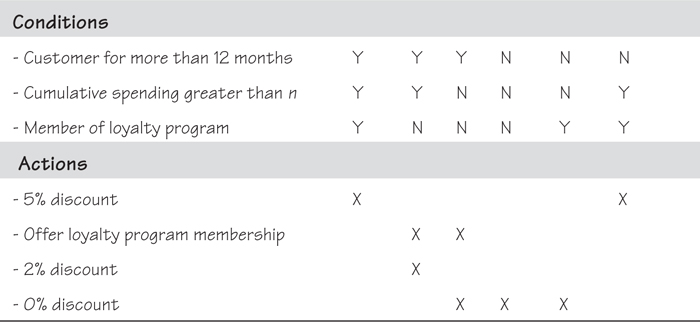
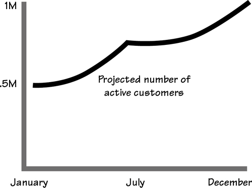

# 12 Fit Criteria and Rationale

[12-P001] *in which we show how measuring requirements makes them unambiguous, understandable, communicable, and testable*

[12-P002] *Fit,* as we use the term here, means a solution completely satisfies or matches the requirement. That is, the solution does exactly what the requirement says it must do or has the property the requirement says it must have—no more and no less. To test whether the solution fits the requirement, however, the requirement itself must be measurable. As a simple example, if the requirement calls for a length of rope “of a suitable size,” it is obviously impossible to test any delivered solution. By contrast, if the requirement says the rope shall be “2 centimeters in diameter and 2 meters long,” then it becomes a simple matter to test whether the delivered rope fits the requirement.

[12-P003] Of course, attaching a measurement to a length of rope is easy. Attaching a measurement to some requirements is more difficult, but still possible, and absolutely necessary.

[12-P004] *“I often say that when you can measure what you are speaking about, and express it in numbers, you know something about it; but when you cannot measure it, when you cannot express it in numbers, your knowledge is of a meager and unsatisfactory kind.”*

[12-P005] —Lord Kelvin

[12-P006] The measurement of the requirement is its *fit criterion*. It quantifies the behavior, the performance, or some other quality of the requirement.

[12-P007] So far in this book we have mainly dealt with the *description* of the requirement; the description sets down the stakeholder’s intention for the requirement, and is the normal thing that stakeholders say when they are giving you their requirements. But to know precisely what they need, you must quantify the description. Once you measure the requirement—that is, express it using numbers—there is little room for misunderstanding.

## 12.1 Formality Guide

[12.1-P001] A pleasing aspect (amongst many) of Kent Beck’s eXtreme Programming technique is its insistence on writing test cases before writing the code. The test case defines the yardstick that the implemented code must match. The fit criterion is more or less the same thing: It is a yardstick for the requirement. By adding a fit criterion to the requirement, you are, in essence, writing its test case.

[12.1-P002] Reading 

[12.1-P003] Beck, Kent, and Cynthia Andres. *eXtreme Programming Explained: Embrace Change,* second edition. Addison-Wesley, 2004.

[12.1-P004] If you are using user stories, then we strongly suggest that you pay particular attention to the reason given for the functionality. This is more or less the same as the rationale, and is an important contributor to ending up with the correct product. Writing test cases on the back of the story card should achieve the same purpose as the fit criterion we speak about here.

[12.1-P005] 

[12.1-P006] We suggested in **Chapter 11** that rabbits use a blog or wiki to discover the non-functional requirements. For each of the non-functional requirements yielded by the blog, we now suggest deriving the appropriate fit criterion, confirming it with the stakeholder, and writing the test case using that fit criterion.

[12.1-P007] Horse projects need to have a precise and easily shareable understanding of the meaning of requirements. It has been our experience that when the project has multiple stakeholders—which is the norm for horse projects—different stakeholders assign different meanings to requirements. Adding a rationale and a fit criterion to each requirement means it is virtually impossible for misunderstandings to occur. We recommend that horse projects include both of these in their requirements.

[12.1-P008] 

[12.1-P009] Elephant projects must use rationales and fit criteria. These projects are forced to produce a written specification to be handed on to some other party, either another part of the organization or an outsourcer. Having a specification containing only unambiguous, testable requirements is crucial to elephant projects if the other party is to understand and then deliver the correct product.

[12.1-P010] 

## 12.2 Why Does Fit Need a Criterion?

[12.2-P001] When you have a requirement for the product to perform some function or to have some property, the testing activity must demonstrate that the product does, indeed, perform that function or possess the desired property. To carry out such tests, the requirement must have a benchmark such that the testers can compare the delivered product with the original requirement. The benchmark is the fit criterion—a quantification of the requirement that demonstrates the standard the product must reach.

[12.2-P002] *“The idea is for each requirement to have a quality measure that makes it possible to divide all solutions to the requirement into two classes: those for which we agree that they fit the requirement and those for which we agree that they do not fit the requirement.”*

[12.2-P003] —Christopher Alexander, *Notes on the Synthesis of Form*

[12.2-P004] You should also consider the builders of the product. It stands to reason that once they know the criterion for the product’s acceptance, they will build to that standard. If they are told their product will be used underwater, and the acceptance criterion is that the product must operate for as long as 24 hours at a depth of 15 meters, then they are unlikely to deliver anything but a waterproof product (see **Figure 12.1**).

[12.2-P005] 

[12.2-P006] Figure 12.1. If they know the performance criterion that the product must meet before it is accepted, the builders will naturally build a product to meet that criterion.

[12.2-P007] Possibly the most challenging part of testing a requirement against an agreed-upon measurement is defining the appropriate measurement for the requirement. It is tricky, but certainly not impossible.

[12.2-P008] Let’s suppose that your stakeholder is inexperienced and asks for a product that is “user friendly.” What that phrase means to you is likely not the same thing as what it means to the stakeholder. However, once you can measure “user friendliness”—that is, put numbers against it—then you and the stakeholder can arrive at the identical understanding.

[12.2-P009] Additionally, the measurement of friendliness is passed along to the developers, who treat it as a benchmark. They now know how you and your stakeholder are going to test the delivered product: You will measure it against the fit criterion.

[12.2-P010] So how do you find a measurement for “user friendly”?

[12.2-P011] First, you need to understand the reason for the requirement. This is where the *rationale* comes into play. You ask the question, “What is the justification for this requirement?”, or as that seems a little formal, “Why do you have this requirement?”

[12.2-P012] Suppose that after some interrogation, your stakeholder reveals that as far as he is concerned, “a user-friendly product will be liked by the customers who are intended to use it.” A little more probing reveals that “liked by the customers” means they voluntarily change over to the new product, and don’t hesitate before using it.

[12.2-P013] ***Description: The product shall be user friendly.***

[12.2-P014] **Rationale: We need customers to voluntarily change to the new product, and not hesitate before using it.**

[12.2-P015] This explanation gives us something to measure: the duration of hesitation before using the product, the time elapsed before complete adoption of it, or the user satisfaction level after a period of usage.

[12.2-P016] ***Fit Criterion: Customers, on average, commence using the product within 5 seconds of encountering it for the first time.***

[12.2-P017] Or:

[12.2-P018] ***Fit Criterion: Eighty percent of customers are voluntarily using the product within six months of its release.***

[12.2-P019] Or:

[12.2-P020] ***Fit Criterion: Customer surveys between six months and a year after launch give a satisfaction rating of greater than 75 percent.***

[12.2-P021] Some of these criteria might seem a little expensive to test, but this is an important requirement. The rationale tells us that when it says customers should start using the product voluntarily. If customers do not switch over to the new product, then the project will be a failure, so it is worth putting some effort into the development and testing of this requirement.

[12.2-P022] All of this goes to say that to make it precise, a requirement cannot be just a text description; it needs a rationale and a fit criterion.

## 12.3 The Rationale for the Rationale

[12.3-P001] The rationale is the reason, or justification, for a requirement. We have found that attaching a rationale to the requirement makes it far easier to understand the real need. Quite often, stakeholders may tell you their perceived solution to the problem, rather than their real need. Alternatively, they may state a requirement that is so vague as to be (for the moment) unusable. In the example given previously, the client asked for a “user-friendly” product, but you could make sense of it when you learned that the rationale was that the project needed the users to readily adopt the product.

[12.3-P002] ***Quite often, stakeholders tell you their perceived solution to the problem, rather than their real need.***

[12.3-P003] Suppose the rationale had been different. Say, instead of ready adoption, the client gave you a rationale that indicated a “user-friendly” product is so easy to use that its users make fewer errors than they do with the current product. The corresponding requirement has a different meaning, and the resulting fit criterion is completely different.

[12.3-P004] ***Description: The product shall be user friendly.***

[12.3-P005] ***Rationale: Users must find the new product easier to use than the current product, so that they make fewer errors.***

[12.3-P006] ***Fit criterion: The average error rate for all user input shall be less than 1.5 percent.***

[12.3-P007] The rationale is not only a guide to help you find the fit criterion, but also a means to help you know when you have several different requirements masquerading as one. One stakeholder says “user friendly” means the product is pleasant to use, another says “user friendly” means the product is exciting, and yet another says a “user-friendly” product encourages users to make return visits to it. In this case you have three different requirements, each with its own fit criterion that measures the desired property.

[12.3-P008] ***You have to pass along a way to measure the requirement’s real meaning.***

[12.3-P009] Additionally, the rationale provides the basis for making decisions about how to implement the requirement. Put yourself in the developers’ shoes: You usually have to choose between several possible solutions, and if you understand the thinking underlying the requirement, you can come up with the most appropriate solution. Also, when you need to make trade-off decisions, it helps if you understand the relative importance of the requirement to the business, and the effect that it will have if the requirement is not correctly implemented.

[12.3-P010] ***Description: The product shall ensure that the buyer is connecting from an approved country.***

[12.3-P011] **Rationale: Some countries do not have copyright laws and our suppliers prohibit us from selling into those countries.**

[12.3-P012] Let’s not forget the testers’ need for a coherent rationale. There are many ways of designing tests for requirements’ fit criteria, some of which involve much more time and expense than others. A tester needs to understand the reason for a requirement if he is to make the best decision about where to spend testing time and money.

[12.3-P013] Later, when a product is being used and maintained, the rationale still has a vital role. You can work out what a software product is doing by reading the code and observing the people who use it. But suppose you have been asked to make a change to a product: If you do not understand why the product does what it does, it is less likely that you will make the correct change, and more likely that your changes will corrupt some related but distant part of the product—the ripple effect. The problems that arise from a lack of understanding of the rationale partly explain why software maintenance is so expensive.

[12.3-P014] The rationale is the cognitive thread that connects the business and the delivered product. It is through knowing why something exists that the business analyst is able to discover the correct statement of need, and the developers are able to construct the correct product.

[12.3-P015] When asking stakeholders for their rationale for a requirement, you might appear to be like the child constantly asking a parent, “Why?” So be it—that is the role of the requirements analyst. You have to ask why, and keep on asking why, until you get to the real reason for the requirement. But you haven’t finished yet, because you still have to pass along a way to measure the requirement’s real meaning. That is why you derive its fit criterion.

## 12.4 Deriving Fit Criteria

[12.4-P001] To come up with the appropriate fit criterion, start by analyzing the description and rationale you have established for the requirement.

[12.4-P002] ***Description: The product shall make it easy for a buyer to find his chosen music.***

[12.4-P003] This requirement is fairly subjective and slightly ambiguous. The rationale provides more information on what is needed:

[12.4-P004] ***Rationale: Music buyers are familiar with the Internet and are accustomed to convenience and fast response times. They will not tolerate slow or awkward searches for their chosen tracks.***

[12.4-P005] Now you know the requirement is about speed—which is fairly easy to quantify—and awkwardness—which is about complexity and perceived ease. For the speed component, imposing a time limit for a search is appropriate. Suppose your market research personnel tell you 10 seconds is the limit of the target audience’s tolerance; to be better than the competition, you are shooting for 6 seconds for your own product.

[12.4-P006] In terms of the awkwardness component of the fit criterion, your ergonomics personnel and market research both say that buyers must be able to find a piece of music in no more than three actions (an action here means a click, a gesture, a menu selection, voice command, or any other conscious action on the user’s part).

[12.4-P007] Your measurement for these things would be this fit criterion:

[12.4-P008] ***Fit Criterion: The average music buyer shall be able to locate any piece of music within 6 seconds, using no more than three actions.***

[12.4-P009] Note that the 6-second time limit also directs the designer to make it obvious to the music buyer what has to be done to buy music—a limit of 6 seconds means that there is very little time for hesitation and figuring out what to do next.

[12.4-P010] ***If you can’t measure a requirement, it is not really a requirement.***

[12.4-P011] Some fit criteria may, at first, be unattainable because of business or real-life constraints. In other cases, your client may not be willing to spend the amount required for the implementation to meet the criterion. Thus sometimes you might negotiate an adjustment to the fit criterion to allow for the product’s operating environment, the intended usage, and the client’s budget. Think of these adjustments as *business tolerances*. As we are certain that some of the intended users of the product will be below-average performers, we would adjust the fit criterion to read as follows:

[12.4-P012] ***Fit Criterion: Ninety percent of music buyers shall be able to locate any piece of music within 6 seconds, using no more than three actions.***

## 12.5 Scale of Measurement

[12.5-P001] Any requirement can be measured: All you have to do is find a suitable scale with which to measure it.

[12.5-P002] The scale of measurement is the unit you use to test the conformance of the product to its requirement. For example, if the requirement is for a certain speed of operation, then obviously the scale is time—microseconds, minutes, months—to complete a given action or set of tasks. For a usability requirement, you can measure the time needed to learn a product, or the time taken before achieving a particular level of competence, or perhaps even the error rate of the work done using the product.

[12.5-P003] ***You can measure anything.***

[12.5-P004] Scales of measurement exist for all sorts of qualities. Color can be measured by specifying its component colors as a percentage of cyan, magenta, yellow, and black. Loudness and softness of sound are measured in terms of decibels. An amount of light is measured in units of lumens. Typefaces can be measured by face names and point sizes. In fact, there is a scale of measurement for almost everything.

[12.5-P005] So far, the only thing that your authors have not been able to find a scale of measurement for is love—we cannot find any way of measuring how much you love someone. Readers are welcome to send suggestions.

## 12.6 Fit Criteria for Non-functional Requirements

[12.6-P001] A non-functional requirement is a quality that the product must have, such as usability, look and feel, performance, and so on. The fit criterion is, therefore, a measure of that quality. Here we examine fit criteria for all the different types of non-functional requirements.

[12.6-P002] Let’s look at an example. Your authors came across this requirement for a consumer electronics product aimed at a teenage market:

[12.6-P003] ***Description: The product shall be cool.***

[12.6-P004] ***Even vague, ambiguous requirements can be measured.***

[12.6-P005] This requirement at first sight might seem hopeless and unable to be measured—there is no deterministic scale of coolness. If you look little bit more closely, however, you will obviously find that “cool” is a term often used to mean “something that is desirable to have or to be.”

[12.6-P006] When we asked why the product had to be “cool,” we were given a rationale that consumers had to be attracted to the product, and to want to own one and be seen to own it. To satisfy this need, we had to first measure the product’s attractiveness to its intended audience. The first attempt at a fit criterion was this:

[12.6-P007] ***Fit Criterion: Forty percent of the people who see the product on display in a store pick it up.***

[12.6-P008] Naturally you would not go live with the real product and see if it met the test; you would follow the lead of most electronics companies, which test prototypes against representative groups of the target audience.

[12.6-P009] We improved the fit criterion to this:

[12.6-P010] ***Fit Criterion: Forty percent of the target audience who see the product on display in the store, pick it up and hold it for at least 5 seconds.***

[12.6-P011] We also felt that should the picker-upper show the product to somebody else, that action would indicate that he felt that the product was desirable. The “Hey, look at this” gesture indicated the value he put on the product. Thus:

[12.6-P012] **Fit Criterion: Forty percent of the target audience who see the product on display in a store, pick it up, hold it for at least 5 seconds, and show it to a companion.**

[12.6-P013] Of course, an even better fit criterion would have been a measure of whether people actually bought the product, but given the target market we had to take into consideration the fact that not everyone would be able to afford it. Therefore simply picking up, holding, and showing the product was seen as the first test of how desirable it was, or the degree of envy from non-owners it would generate, or as the client called it, its coolness.

[12.6-P014] Of course, “coolness” must go beyond the store display. We needed to add other requirements that specified how convenient the product was to use. Clearly, a cool product must be very convenient—cool—to use.

[12.6-P015] Earlier in this chapter, you saw an example of a requirement that specified a “user-friendly” product; the client said that “user friendly” meant the staff liked it. You can measure “like”: If the staff likes the product, they will use it. You can measure how quickly they start using it, how much they use it, or how soon word gets around that the product is good and users encourage one another to use it. All of these criteria quantify the client’s desire that the staff like the product and use it (see **Figure 12.2**).

[12.6-P016] 

[12.6-P017] Figure 12.2. You can measure your users’ liking for a product by surveying their work practices before and after the product is introduced, by measuring how long it takes them to start using the product once it is available, or by surveying them after a period of use to ascertain their liking for the product.

[12.6-P018] You could write a fit criterion like this:

[12.6-P019] ***Fit Criterion: Within three months of introducing the product, 60 percent of the users shall be using it to carry out the agreed-upon work. From those users, the product shall receive a 75 percent or more approval rating.***

[12.6-P020] Note how you clarify the requirement when you add its fit criterion. By negotiating a measurement, you transform the requirement from a vague and somewhat ambiguous intention into a fully formed, testable requirement.

[12.6-P021] You will find that it is usually not possible to get the complete, measurable requirement from your first interview. Indeed, it is highly unlikely that your stakeholders will express themselves in such precise terms. We suggest you go with the flow; don’t slow down your requirements-discovery processes to make the requirement measurable, but rather get the stakeholders’ intention—you write this as the *description*—and the *rationale*. Then analyze your understanding, write your own best interpretation of the fit criterion, and improve it by discussing it with your stakeholder. You both have to agree that your proposed fit criterion is an accurate measurement of the requirement.

### 12.6.1 Product Failure

[12.6.1-P001] The fit criterion might be determined by asking your stakeholder, “What would you consider a failure to meet this requirement?” Suppose you have this requirement:

[12.6.1-P002] ***Description: The product must produce the road de-icing schedule within an acceptable time.***

[12.6.1-P003] Clearly, the scale of measurement here is time. Your client can tell you how much time he thinks would constitute a failure. For example, the client would consider the product unacceptable if the engineer has to wait for more than 15 seconds for the schedule to become available. This means you have the following fit criterion, with suitable business tolerances applied:

[12.6.1-P004] ***Fit Criterion: The road de-icing schedule shall be available to the engineer within 15 seconds from when he makes his request for 90 percent of the times that it is produced. It shall never take longer than 20 seconds.***

[12.6.1-P005] Sometimes, however, you may discover there is no agreement on a quality measure, and hence there can be no fit criterion. In these circumstances, it is possible that the original requirement is not really a requirement. Perhaps several requirements have been lumped together in one requirement; in this case, each of the sub-requirements would then have its own measurement. Alternatively, perhaps the requirement is so vague, and its intention so unrealistic, that it is not possible to know whether it has been satisfied. For example, we cannot imagine a fit criterion for this requirement:

[12.6.1-P006] **Description: I want a product my grandmother would have liked had she been alive today.**

### 12.6.2 Subjective Tests

[12.6.2-P001] Some requirements have to be tested using subjective tests. For example, if a cultural requirement for a product to be used in the public domain is “not offensive to any group,” then the fit criterion must be along these lines:

[12.6.2-P002] ***Fit Criterion: The product shall not be offensive to at least 85 percent of a test panel representing the makeup of the people likely to come in contact with the product. No more than 10 percent of the interest groups represented in the panel shall report that they felt offended.***

[12.6.2-P003] The business tolerance here allows for the fact that you cannot count on 100 percent of humans passing any test. In this case the business tolerances shield the product from the lunatic-fringe extreme views, while at the same time allowing “offensive” to be measured.

[12.6.2-P004] ***Although fit criteria are measures of the product’s performance, it is often more cost-effective to test prototypes built specifically for the purpose.***

[12.6.2-P005] For this kind of testing, it is usually more cost-effective to test prototypes or simulations built specifically for the purpose than to test the delivered product itself. You would hate to put in the effort to build the real thing and then find your audience thought it offensive.

[12.6.2-P006] You can use subjective tests for your fit criteria, but the numbers you use in fit criteria are not subjective. Suppose you have a fit criterion of “reduce the time to perform [some task] by 25 percent of the current time.” This means that the current time must be known and documented, not just guessed. The reason for the target of a 25 percent reduction must be well understood and agreed to by the client, and not just your subjective feeling as to what is acceptable. The reasoning behind wanting 25 percent—and not 20 percent or 30 percent—should be backed by empirical data taken from a study of the business.

### 12.6.3 Standards

[12.6.3-P001] Sometimes numbers are not appropriate, or you can create a better fit criterion by citing a standard. For example, the requirement mentioned earlier that the product is “not offensive to any group” could be handled by citing your organization’s standards of conduct. Alternatively, your communications department might have standards for what is and what is not allowed to be said or displayed for public consumption. By citing that the product must comply with that standard, you are in effect setting the benchmark for lack of offensiveness.

[12.6.3-P002] Sometimes other standards may apply to the kind of products you might be developing. As an example, the ISO 9241 standard covers the ergonomics of human interactions with computer systems. A short glance at the ISO list of standards reveals many others that you might cite in your fit criteria.

[12.6.3-P003] Many of the standards you might use are much closer to home. Your organization has branding standards that are usually maintained by the communications department. Many look and feel requirements have their fit criteria written as:

[12.6.3-P004] ***Fit Criterion: The product shall comply with the branding standard of [name your organization].***

[12.6.3-P005] You might, as a consideration, add a pointer to where the standard can be found, or the contact in the communications department who looks after the standard.

[12.6.3-P006] Legal requirements have a built-in standard—the law. You could cite the appropriate law as your fit criterion, but as it is likely to be unfathomable to you and your development team, the simple approach is to allow your legal department to give their opinion that the solution matches the standard of the law.

[12.6.3-P007] Let’s look at each type of non-functional requirement and consider how you might write the appropriate fit criterion.

### 12.6.4 Look and Feel Requirements

[12.6.4-P001] Look and feel requirements specify the spirit, mood, or style of the product’s appearance and behavior, and the impression the user gets when using the product. Additionally, many companies require their products to be cloaked in company colors. The rationale for this requirement is either adherence to branding standards or a desire to enhance customer recognition. The two points are slightly different, however.

[12.6.4-P002] Let’s look at branding standards first. Your organization has a communications department, which is responsible for the branding standards. Thus the fit criterion should specify the target standard and state who or what is to certify the product’s compliance.

[12.6.4-P003] ***Fit Criterion: The product shall be certified as complying with this year’s corporate branding standards by the head of communications.***

[12.6.4-P004] Where the rationale is customer recognition, we suggest a fit criterion along these lines:

[12.6.4-P005] **Fit Criterion: Sixty percent of the target audience will recognize the product as belonging to the corporation within 5 seconds of encountering it for the first time.**

[12.6.4-P006] Look and feel requirements may start out as “touchy-feely” statements of intent. However, by determining the rationale and looking for its measurable aspects, you will always find a suitable fit criterion.

[12.6.4-P007] ***Look and feel requirements may start out as “touchy-feely” statements of intent. However, by determining the rationale and looking for its measurable aspects, you will always find a suitable fit criterion.***

### 12.6.5 Usability and Humanity Requirements

[12.6.5-P001] Usability and humanity are the requirements for the experience when using the product—in other words, the fitness for use by its intended users. Products are typically required to be easy to use, easy to learn, able to be used by certain types of users, and so on. To write the fit criterion for each of these requirements, you must find a measurement scale that quantifies the objective of the requirement.

[12.6.5-P002] Let’s look at some examples.

[12.6.5-P003] ***Description: The product shall be intuitive.***

[12.6.5-P004] To measure “intuitive,” you must consider the people to whom the product must be intuitive. In the IceBreaker example, you are told the users/actors are the road engineers; they have engineering degrees and meteorological experience.

[12.6.5-P005] ***Rationale: The road engineers must find it easy and intuitive; otherwise, they will not use it.***

[12.6.5-P006] Now that you know this rationale, “intuitive” is much better defined.

[12.6.5-P007] ***Fit Criterion: A road engineer shall be able to produce a correct de-icing forecast within 10 minutes of encountering the product for the first time without reference to any out-of-product help.***

[12.6.5-P008] Sometimes “intuitive” really means “easy to learn.” In this case, you ask how much time can be spent in training, and the resulting fit criterion might look like this:

[12.6.5-P009] ***Fit Criterion: Nine out of ten road engineers shall be able to successfully complete [list of selected tasks] after one day’s training.***

[12.6.5-P010] ***Look for the real meaning of the requirement, and confirm it by having your stakeholders agree that your proposed fit criterion is the correct measurement of that meaning.***

[12.6.5-P011] Fit criteria for usability requirements might also quantify the time allowed for given tasks, the error rates allowed (quantifying ease of use), the satisfaction rating awarded by the users, ratings given by usability laboratories, and so on. Look for the real meaning of the requirement, and confirm it by having your stakeholders agree that your proposed fit criterion is the correct measurement of that meaning.

[12.6.5-P012] ***Description: The product should be pleasant to use.***

[12.6.5-P013] ***Rationale: We want people to enjoy using it so that they continue to visit our site.***

[12.6.5-P014] ***Fit Criterion: Seventy percent of a representative test panel returns to our site more frequently than they do to the ten other similar sites available to them.***

[12.6.5-P015] Accessibility requirements specify how easy it should be for people with common disabilities to access the product. This could result in a fit criterion like this:

[12.6.5-P016] ***Fit Criterion: The product shall be certified to be in compliance with the Americans with Disabilities Act of 1990 as amended.***

[12.6.5-P017] It may also be necessary to specify the relevant parts of the act and the body responsible for certifying compliance.

### 12.6.6 Performance Requirements

[12.6.6-P001] Most of the time, your performance requirements will be easy to quantify—we tend to use numbers when we describe things such as speed, accuracy, capacity, availability, reliability, scalability, and similar characteristics of the product. Typically, then, the nature of the performance requirements will suggest a measurement scale. Let us look at some examples.

[12.6.6-P002] Suppose you have this requirement:

[12.6.6-P003] ***Description: The response shall be fast enough to avoid interrupting the user’s flow of thought.***

[12.6.6-P004] The word “fast” indicates you should measure time. Here is a suggested fit criterion:

[12.6.6-P005] ***Fit Criterion: The response time shall be no more than 0.5 second for 95 percent of responses, and no more than 2 seconds for the remainder.***

[12.6.6-P006] Similarly, the fit criterion for an availability requirement might be written as follows:

[12.6.6-P007] ***Fit Criterion: In the first three months of operation, the product shall be available for 98 percent of the time between 8 ******A.M******. and 8 ******P.M******.***

[12.6.6-P008] A fit criterion may be shown as a range. This is particularly appropriate for performance requirements. For example:

[12.6.6-P009] ***Fit Criterion: The product shall allow for 3,000 downloads per hour, although 5,000 per hour is preferred.***

[12.6.6-P010] The point of using a range is to deter the developers from constructing a product that could be overly expensive, and to make the best design trade-offs to fit the budget and design constraints.

[12.6.6-P011] ***If the requirement is given to you in correctly quantified terms, then the fit criterion and the requirement are the same.***

[12.6.6-P012] As most performance requirements are themselves quantified, it should be fairly straightforward to write appropriate fit criteria. If the requirement is given to you in correctly quantified terms, then the fit criterion and the requirement are the same. In that case, write one or the other.

### 12.6.7 Operational Requirements

[12.6.7-P001] Operational requirements specify the environment in which the product will operate. In some cases, the product has to be used in adverse or unusual conditions. Recall our example from the IceBreaker product:

[12.6.7-P002] ***Description: The product shall be used in and around trucks at night, and during rainstorms, snow, and freezing conditions.***

[12.6.7-P003] The fit criterion for an operational requirement is a quantification of the successful usage in the required environment. For the preceding operational requirement, the fit criterion quantifies the ability of the product to withstand the conditions. For example:

[12.6.7-P004] ***Fit Criterion: The operator shall successfully complete [list of tasks] within [time allowed] in a simulation of a five-year storm*****1***** and the product shall function correctly after 24 hours’ exposure.***

[12.6.7-P005] Operational conditions may also specify that the product must coexist with partner, or collaborating, systems. The fit criterion in this case will cite the specification of the partner system or the way to communicate with the partner:

[12.6.7-P006] **Fit Criterion: The interfaces to the Rosa Weather Station shall be certified as complying with the National Transportation Communication ITS Protocol (NTC/IP).**

[12.6.7-P007] This criterion is testable—by engineers from NTC—and points the product’s builders toward a known and accepted standard.

[12.6.7-P008] Additionally, most things in your operating infrastructure have standards:

[12.6.7-P009] ***Fit Criterion: The product must comply with HTML5 standard as published April 2011 by W3C.***

### 12.6.8 Maintainability Requirements

[12.6.8-P001] Maintainability requirements specify expectations about the maintenance of the product. Usually the fit criteria for these requirements quantify the amount of time allowed to make certain changes. This is not to say that all maintenance changes can be anticipated, but where changes are expected, then it is possible to quantify the time allowed to adopt those changes.

[12.6.8-P002] ***Fit Criterion: All functionality must be migrated to the new website with no more than 10 minutes of unavailability of the site.***

### 12.6.9 Security Requirements

[12.6.9-P001] Security is too important to be left to the whims or the goodwill of the developers. Your organization probably has some security standards in place, either specific to the industry or specific to your type of product. It is important to know which standard applies and to include it in your fit criterion.

[12.6.9-P002] Taking this step has an added benefit: CYA. If a breach occurs in the future, at least you can say your product complied with the standard.

### 12.6.10 Cultural Requirements

[12.6.10-P001] Cultural requirements, by their nature, are subjective and slightly more difficult to quantify. The fit criterion is usually based on who will certify the product’s acceptability. For example:

[12.6.10-P002] ***Fit Criterion: The Shatnez Laboratory of Brooklyn shall certify that the product complies with the shatnez rules.*****2**

[12.6.10-P003] ***Fit Criterion: The communications department shall give the opinion that the product displays no words or symbols that could be construed as religious or political.***

[12.6.10-P004] In almost all cases, your communications department can be considered to be the authority when dealing with cultural issues. This fit criterion is a general-purpose one that could be included in most specifications:

[12.6.10-P005] ***Fit Criterion: The communications department shall certify that the product is culturally acceptable for the target audience.***

### 12.6.11 Legal Requirements

[12.6.11-P001] Legal requirements specify which laws the product must conform to. As a result, this fit criterion applies to most legal requirements:

[12.6.11-P002] ***Fit Criterion: Your client will win a court case brought by someone who uses the product.***

[12.6.11-P003] However, fit criteria must be able to be tested in a cost-effective manner, and court cases are too expensive to be indulged in lightly. Thus the majority of fit criteria will be along the following lines:

[12.6.11-P004] ***Fit Criterion: The legal department/company lawyers shall certify that the product complies with the [appropriate laws].***

[12.6.11-P005] Legal requirements are also written to ensure that the product complies with cited standards. Most standards are written by organizations that either have people who certify compliance—“standards lawyers”—or issue guidelines as to how you can certify compliance for yourself. In either case, fit criteria can be written to specify how compliance with the standard is to be verified.

## 12.7 Fit Criteria for Functional Requirements

[12.7-P001] A functional requirement is something that the product must do—an action it must take. The fit criterion specifies how you will know that the product has successfully carried out that action. For functional requirements, there are no scales of measurement: The action is either completed or not completed. Completion depends on satisfying an authority that the product has correctly performed the action. The authority in this case is either the source of the data or the adjacent system that initiated the action.

[12.7-P002] If the action is to record something, then the fit criterion is that the recorded data complies with the data as it is known to the authority. For example:

[12.7-P003] **Description: The product shall record the weather station readings.**

[12.7-P004] ***Rationale: The readings are necessary for preparing the de-icing schedule, and must be kept for audit purposes.***

[12.7-P005] ***Fit Criterion: The recorded weather station readings shall be identical to the readings as recorded by the transmitting weather station.***

[12.7-P006] The authority in this case is the weather station: It initiated the action, and it is the source of the data. You can say the requirement is for the product to faithfully store the data (allow for the product to make necessary manipulations to the data) as sent from the weather station. If this procedure is done correctly, then the product’s data conforms to that transmitted by the station.

[12.7-P007] The fit criterion does not indicate *how* this conformance is to be tested. Instead, it is simply a statement that the tester uses to ensure compliance.

[12.7-P008] If the functional requirement is to make some calculation, then the fit criterion says the result of the calculation must be consistent with the authority’s view of the data. Where the requirement is “the product shall check . . .,” the fit criterion is “the checked data conforms with . . .” and again cites the authority for the data. “The product shall calculate . . .” results in a fit criterion of “the result conforms to . . .” and gives the algorithm (or source of the algorithm) for the result.

[12.7-P009] The general rule for functional requirements is that the fit criterion ensures that the function has been successfully carried out. That brings us to test cases.

### 12.7.1 Test Cases

[12.7.1-P001] You might find it feasible at this stage to think about writing test cases for your functional requirements. This approach is promoted by several agile techniques wherein the tests are written before the code is. The basic idea is to force the programmer to concentrate on learning the fit criterion for any part of the functionality.

[12.7.1-P002] Many requirements analysts feel uncomfortable delving into writing test cases. However, the testers for your organization will be—we are sure of this—delighted either to help or to write the test cases for you. Testing is most effective early in the development cycle, and involving the testers in the requirements activity is always beneficial. Testers are the best people to tell you whether your functional requirements are testable.

[12.7.1-P003] Reading 

[12.7.1-P004] Beck, Kent. *Test Driven Development: By Example*. Addison-Wesley, 2002.

[12.7.1-P005] Merkow, Mark. *Secure and Resilient Software: Requirements, Test Cases, and Testing Methods*. Auerbach Publications, 2011.

## 12.8 Forms of Fit Criteria

[12.8-P001] The most common way of writing fit criteria is using text and numbers in your natural language. When you follow this route, you need to ensure that all terms that are used in the fit criteria are defined in your specification and consistently used in your requirements. The best way to do so is to create a data dictionary (for examples, see **Section 7** of the requirements template in **Appendix A**) that defines the terms within the scope of your work.

[12.8-P002] See **Section 7** of the Volere Requirements Specification Template in **Appendix A** for examples of data dictionary definitions. 

### 12.8.1 Defining the Data

[12.8.1-P001] For example, within the Ice Breaker project requirements often refer to *Road Section*. If you look in the data dictionary, you will find this definition:

[12.8.1-P002] ***For the fit criteria to be complete, the specification must contain definitions of the terms used in the fit criteria.***

[12.8.1-P003] *Road Section = Road Section Identifier + Road Section Coordinates*

[12.8.1-P004] You can then expect to find a definition of each of the attributes—for example:

[12.8.1-P005] *Road Section Identifier = *Unique identifier for 500 meters of road. The maximum number of road sections per road is 10,000.**

[12.8.1-P006] Another strategy for defining the data is to define each term as part of the fit criterion of each individual requirement. However, as you will usually reference the same term in more than one requirement, it makes sense to maintain a central dictionary that can act as a cross-reference between requirements. Your growing understanding of the data means that you can progressively build a business data/information model that specifies the essential stored data for the requirements you are specifying.

### 12.8.2 Graphic Fit Criteria

[12.8.2-P001] When writing fit criteria, the aim is to be as implementation neutral as possible, thereby giving the designers and developers the maximum amount of freedom in choosing how to meet each requirement. The problem is that natural language is inherently procedural (you are forced to write words in a serial order) and sometimes that order is interpreted incorrectly as part of the requirement. You might consider the following approaches.

### 12.8.3 Decision Tables

[12.8.3-P001] Suppose that your fit criterion defines the rate of discount that a customer should have depending on how long he has been a customer, what his cumulative spending is, and whether he is a member of the customer loyalty program. Rather than writing all of these rules in text form, it would be clearer to build a decision table, as illustrated in **Table 12.1**.

[12.8.3-P002] Table 12.1. Fit Criterion in the Form of a Decision TableFor each combination of conditions, the table identifies which discount rate is applicable and whether to offer a loyalty program membership.

[12.8.3-P003] 

[12.8.3-P004] In this case, because of the many ways that conditions can be combined, a decision table becomes an effective way of writing the fit criterion. The decision table is less procedural than a text-based fit criterion—you can look at it in whatever order necessary. Also, by identifying all of the possible ways of combining the conditions, you, together with the business people who are familiar with the discount policy, can see the places where there are missing actions or inconsistent rules.

### 12.8.4 Graphs

[12.8.4-P001] Another pictorial form of fit criterion is to draw a graph. This approach is particularly suitable when you want to express change in values over a period of time, such as for an extensibility requirement. For example, suppose your client wants a product that can cater to a growth in customers from the current 500,000 to 1 million over the next year. Of course, you can write this fit criterion in text form, but drawing it as a graph conveys more information to the developers and testers. In **Figure 12.3**, you see not just the growth from one number to another but when the peak periods of growth are projected. Just by looking at this picture, the developers and testers get a much better understanding of the business and the nature of the problem that their product has to solve.

[12.8.4-P002] 

[12.8.4-P003] Figure 12.3. Projected growth of the business. This graph showing growth over time is the fit criterion for an extensibility requirement.

[12.8.4-P004] Now that we are in the swing of using a variety of formats for defining fit criteria, we hope that you can see other opportunities for graphical fit criteria. Consider process models, state models, decision trees, dynamics models, or any other technique that best conveys the needed measurement in the least ambiguous way.

## 12.9 Use Cases and Fit Criteria

[12.9-P001] A use case, whether it is a product use case (PUC) or a business use case (BUC), is a collection of requirements—both functional and non-functional—working toward a desired outcome. While each requirement has its own fit criterion to measure its performance, the fit criterion for the use case as a whole is the benchmark for the collection of requirements when they act together.

[12.9-P002] ***You can apply a fit criterion to a use case.***

[12.9-P003] To avoid confusion about this use case criterion, we call it the *outcome*. That is, this criterion is the intended outcome of the (business or product) use case if all works as intended. As we are talking about a collection of requirements, each with a fit criterion, you might prefer to think of the outcome as a summary (or even summation) of all the individual fit criteria. Note that some organizations refer to this as the “end state” or the “post condition” of the PUC.

[12.9-P004] We suggest that you make use of outcomes very early in your requirements gathering. During the blastoff (or as soon as you identify the business events), try to elicit from your stakeholders the intended outcome for each of their business events. You are asking, “When this business event happens, what does the business need to achieve?” The answer to this question, with a little massaging on your part, can be turned into the outcome or fit criterion for the business use case. As your business use cases evolve into product use cases, the same or very similar criteria can be applied. You will find, as we have, that specifying an outcome criterion early in the development process eliminates a lot of misunderstandings about what each business use case is intended to accomplish.

[12.9-P005] As you capture individual requirements, and their fit criteria, keep in mind that each of them has to contribute in some way to the purpose of the product. If you have an outcome criterion attached to each use case, it is easier to ensure that all the requirements you are capturing contribute to the use case as a whole.

## 12.10 Fit Criterion for Project Purpose

[12.10-P001] We have already discussed writing the fit criterion for the project’s purpose. Of course, we didn’t call it a fit criterion back in **Chapter 3** (we called it a measurement), but that is what it is. Let’s look quickly at this idea again: The project’s purpose is a statement of the reason for making the investment in the project. If you go to the trouble and expense of developing a project to develop a product, then it makes sense to have an objective benchmark to measure the delivered product against.

[12.10-P002] The measurement of the purpose is exactly the same as a fit criterion for an individual requirement. The only difference is that the fit criterion measures a single requirement, whereas the purpose’s measurement is the benchmark for the entire project.

[12.10-P003] Refer to **Chapter 3**, Scoping the Business Problem, for information on writing a measurable project purpose. 

## 12.11 Fit Criteria for Solution Constraints

[12.11-P001] Constraints are a special type of requirement—they are global requirements, usually pre-ordained by management—but they still need to be specified correctly just like any other type of requirement. For example, **Section 3a** of the template includes the solution constraints. These constraints place restrictions on the way that the problem must be solved; you could also say they mandate a solution to the problem. For example:

[12.11-P002] ***Description: The software part of the product must run on Linux.***

[12.11-P003] This requirement reflects management’s decision to use Linux. It may or may not have a sound technological basis, but that is beside the point for our purposes here. You are being told that any solution you deliver has to comply with this constraint.

[12.11-P004] We can test compliance—either you comply with the requirement or you don’t—as long as whatever it is that you have to comply with is measurable. For example, you can test whether you have complied with a law, but you can’t test whether you have complied with a constraint that states, “You shall be happy.” In the case of the Linux constraint, you could write the following criterion:

[12.11-P005] ***Fit Criterion: All functionality of the software shall operate as specified when run using Red Hat Enterprise Linux 5.0.***

[12.11-P006] Similarly, all other constraint requirements—for example, implementation environment, partner applications, commercial off-the-shelf software, open-source software, workplace environment, time budget, and financial budget—should have fit criteria.

## 12.12 Summary

[12.12-P001] A fit criterion is neither a test nor the design for a test, but rather a benchmark that the delivered product has to be tested against. It is used as input to building a test case through which the tester ensures that each of the product’s requirements complies with its fit criterion.

[12.12-P002] ***The fit criterion is an unambiguous benchmark that the product is compared against.***

[12.12-P003] Quantifying or measuring the requirement gives you a better opportunity to interact with your stakeholders. By agreeing on a measurement, you confirm that you have understood the requirement correctly, and that both you and your stakeholders have an identical understanding of it. As a by-product, you will also find quantifying it ensures that the requirement is both wanted and necessary.

[12.12-P004] Including a fit criterion in a requirement encourages testers to participate in the requirements process. Testers should be involved early in the development cycle, and they are particularly helpful at requirements time when you are writing your fit criteria. This is not to say that the testers have to write the fit criteria for you, but just that testers are the best source of knowledge about whether something can be tested, and whether the fit criterion contains the appropriate quantification. In other words, the testers are excellent consultants for the fit criteria.

[12.12-P005] ***The fit criterion is the real requirement.***

[12.12-P006] The fit criterion, not the description, is the real requirement. The description you write is the stakeholder’s way of stating the intention of the requirement. If your stakeholders are like most of us, they speak using everyday language, which is, unfortunately, often ambiguous and often not precise enough. You need to clarify the requirement with a fit criterion that is stated in unambiguous, precise terms and probably uses numbers or a measurement to convey its meaning.

[12.12-P007] Fit criteria are also a vehicle for reaching a consensus among multiple stakeholders. Your attempts to clarify and measure will almost always result in hidden meanings becoming visible, hidden requirements bubbling to the surface, and, most importantly, the stakeholders agreeing on what is needed.

[12.12-P008] ***You derive the fit criterion by examining the requirement’s description and rationale, and determining which quantification best expresses the user’s intention for the requirement.***

[12.12-P009] Fit criteria are usually derived after the requirement description is written. You derive a fit criterion by examining the requirement’s description and rationale, and determining which quantification best expresses the user’s intention for the requirement. You may sometimes find that this close examination results in changes to the requirement, but these changes are for the better and should be considered quite normal; their occurrence simply means the requirement was not properly understood in the first instance. With patience and persistence, and with the wise use of measurements, you can ensure that each of your requirements is unambiguous, testable, and real.
