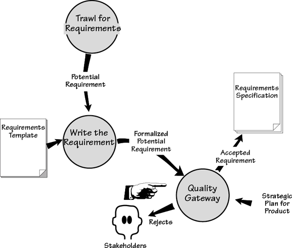
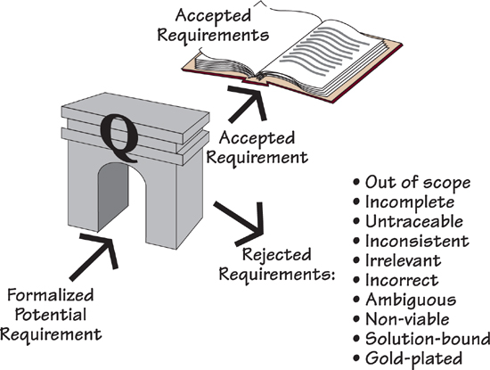
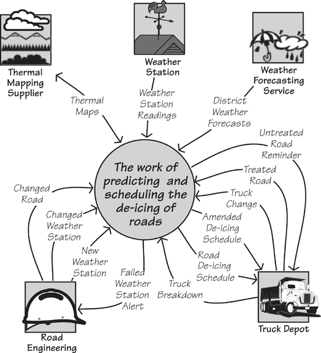
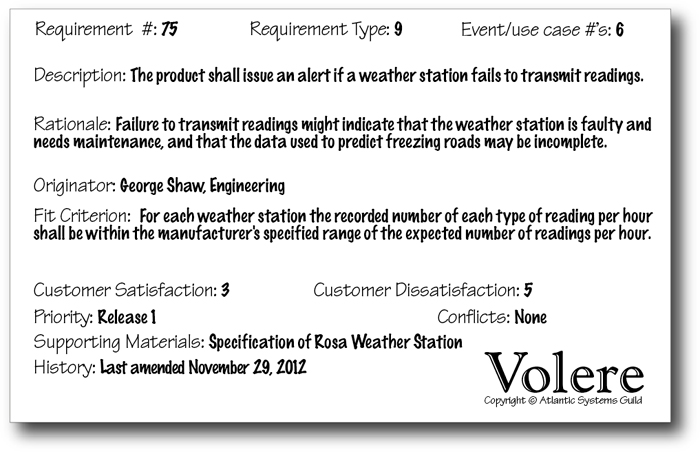
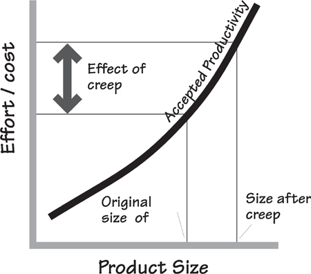

# 13 The Quality Gateway

[13-P001] *in which we prevent unsuitable requirements from becoming part of the specification*

[13-P002] Consider how requirements come about. It isn’t exactly random—we give you trawling techniques to help with your elicitation—and it isn’t exactly badly formed—we give you a template and a snow card to help formulate your requirements. But the requirement comes from people who are not always sure of what they need, are not always able to explain what it is that they want, and it cannot always be carefully written so it is unambiguous and complete.

[13-P003] Here is the point of doing requirements: You have to ensure that what is handed to the developers is a precise, complete, and unambiguous statement of the real need. Anything less negates the reason for doing requirements. Your developers can build anything, but first they have to know what it is they have to build.

[13-P004] This, then, is the job of the Quality Gateway—to ensure that from here on, each requirement is as close to perfect as it can be. It achieves this feat by means of the gatekeepers validating each requirement before allowing it to be included in the specification.

[13-P005] Note in **Figure 13.1** that the incoming flow to the Quality Gateway process is a *formalized potential requirement,* where “potential” indicates that it is not yet ready to see the light of day. Before it is released into the world, it must be tested (and it must pass the test) by the Quality Gateway. Only then does it become an *accepted requirement.*

[13-P006] 

[13-P007] Figure 13.1. (An extract from the Volere requirements process.) The Quality Gateway is the activity where each requirement is tested to ensure its suitability. Suitability in this sense means that the requirement provides downstream activities with a clear, complete, unambiguous description of what to build. To ensure a suitable requirements specification, all requirements must be validated by the Quality Gateway.

[13-P008] When the formalized potential requirement arrives at the Quality Gateway, it should be complete enough that it can undergo tests to determine whether it can be accepted into the specification. Rejected requirements are returned to their originator for clarification, revision, or discarding.

[13-P009] The Quality Gateway tests individual requirements. Later, in **Chapter 17**, Requirements Completeness, we look at how you can assure yourself that you have a complete set of requirements.

[13-P010] You should also consider the *effect* of the Quality Gateway. When requirements analysts know the standards the gatekeepers use to test the requirements against, they are forced to raise their game and improve the quality of the requirements that arrive at the Quality Gateway.

## 13.1 Formality Guide

[13.1-P001] This chapter discusses the Quality Gateway in its most formal incarnation. It is worth emphasizing that you can—in fact, you should—apply some or all of the Quality Gateway tests to a requirement at any stage of your requirements gathering. The way that you implement the Quality Gateway depends on the degree of formality needed for your project.

[13.1-P002] 

[13.1-P003] Rabbit projects, because of the proximity and small number of stakeholders, can make good use of verbally communicated requirements. However, the lack of a written requirement makes it slightly more difficult to determine whether the requirement is correct. Before attempting to implement a requirement, the developer must ensure that it is within scope, is testable, is not gold plating, and meets several other criteria that we cover in this chapter. The Quality Gateway is applicable to rabbit projects, but probably not as a formal checkpoint in the sense that we present it here. Rabbit team members should read this chapter and continuously apply its principles when reviewing their user stories.

[13.1-P004] 

[13.1-P005] Horse projects typically use written requirements within an iterative development cycle. This practice results in a short time elapsing between the discovering of requirements and the release of a partial working version of the product. But putting the product in the user’s hands quickly should not be viewed as a way of avoiding testing the requirements. Even for the fastest of cycles, it is still far more efficient and effective to test the requirements before attempting any implementation. Horse projects should use a fairly informal Quality Gateway.

[13.1-P006] 

[13.1-P007] Elephant projects produce a written specification, because of either outsourcing, the number of stakeholders, or legal reasons. The sheer size of elephant projects means that even small errors in requirements have the potential to balloon into major problems if not caught early. The size of the final specification precludes effective testing of the entire document—people stop seriously reading at about page **15** and start skimming. The idea of testing individual requirements (or cohesive groups of requirements) as they are generated and before they are allowed into the specification has a much better chance of success.

## 13.2 Requirements Quality

[13.2-P001] At this stage, let us take a moment to consider the effect of requirements quality and to explain why it matters.

[13.2-P002] ***For the purposes of this chapter, the word “specification” means the collection of requirements held in whatever manner you use, including the requirements held inside your head.***

[13.2-P003] We are about to talk about a specification. Keep in mind that it need not take the traditional form of a written, sometimes long, usually boring document with sign-offs, versions, release dates, and other administrative niceties appended. We recognize the need for this kind of document in some situations, and the lack of a need for it in others. So, for the purposes of this chapter, the word “specification” means the collection of one or more requirements held in whatever manner you choose, including the requirements held inside your head.

[13.2-P004] The requirements specification is used by several downstream activities and eventually to build your product, whatever it may be. As a result, if the specification is wrong, the product will also be wrong. The Quality Gateway testing is meant to ensure, as far as humanly possible, that the requirements are right.

[13.2-P005] Approximately 50 to 60 percent of errors in software development originate in the requirements and design activity. Another five percent of software errors originate in the coding part of the development. This distribution implies—strongly implies—that it is beneficial to get the requirements right. Errors in requirements are expensive and, if allowed to continue to the downstream activities beyond the requirements process, become more and more expensive.

[13.2-P006] The cost of repairing an error increases each time the product reaches a new phase. It is contested as to exactly how much this increase is (some software commentators put it as much as a thousand times if the product reaches the maintenance phase), but whatever the increment is, it is significant. The cost of repairing an error increases regardless of which type of life cycle you use—waterfall, incremental, or any other. All downstream activities have dependencies on the requirements, so an undiscovered error in requirements means a disproportionate effort to correct it later. Capers Jones of Software Productivity Research estimates that the rework needed to remove requirements errors typically accounts for as much as 50 percent of total software development costs.

[13.2-P007] ***The earlier an error is discovered, the cheaper it is to correct.***

[13.2-P008] You may dispute some of the research, and you may dispute some of the numbers, but the underlying message remains true: The earlier an error is discovered, the cheaper it is to correct.

[13.2-P009] The numbers suggest—no, let’s be honest here, they scream—that you should spend the time testing and correcting your requirements *during the requirements activity* instead of allowing incorrect requirements to percolate through to a downstream activity. Simply put, testing the requirements is the cheapest and fastest way to develop your product.

## 13.3 Using the Quality Gateway

[13.3-P001] In medieval times, castles and fortified towns had gateways designed to keep invaders and unwanted travelers out. The gateways usually sported a portcullis and were manned by gatekeepers—people charged with the protection of the inner sanctum. The Quality Gateway we describe here has the same role—to defend the specification against unwelcome, unwanted, and undesirable requirements.

[13.3-P002] ***The Quality Gateway defends the specification against unwelcome, unwanted, and undesirable requirements.***

[13.3-P003] To pass through the Quality Gateway and be included in the requirements specification (remember the specification does not have to be a formal, written document), a requirement must pass a number of tests. These tests ensure that the requirements are complete and accurate, and do not cause problems by being unsuitable for the design and implementation stages later in the project. We illustrate this situation in **Figure 13.2**.

[13.3-P004] 

[13.3-P005] Figure 13.2. The Quality Gateway tests each requirement for correctness and suitability. Accepted requirements are added to the specification; rejected requirements are returned to their originator.

[13.3-P006] In the next part of this chapter, we discuss the requirements tests. As we do, keep in mind that it takes longer to describe the tests than it does to perform them.

## 13.4 Within Scope?

[13.4-P001] A very common problem in projects is out-of-scope requirements. It is all too easy for your stakeholders to become over-enthusiastic and start giving you requirements that are irrelevant to the purpose of your product, or as we talk about it here, out of scope.

[13.4-P002] This kind of exuberance happens on most projects. Uncontrolled scope creep leads to the project running over time and over budget, and even then it might not deliver the product it set out to build in the first place. We will have more to say about scope creep later in this chapter.

[13.4-P003] Back in **Chapter 3**, Scoping the Business Problem, we discussed how to determine the scope of the work by building a context model. Here we present another use for the context model; this time we use it as the arbiter of whether a requirement is in or out of scope.

[13.4-P004] **Chapter 3**, Scoping the Business Problem, discusses how to determine the scope of the work, and build a context model to define this scope. 

[13.4-P005] You have seen how the flows of data in the context model that enter or leave the work area determine its functionality. Naturally enough, if you choose to automate any of this functionality, you must write requirements. Let’s see how you can use this link between the flows of data and the requirements.

[13.4-P006] Suppose you are the gatekeeper, and you have been given this requirement:

[13.4-P007] ***The product shall pay truck drivers for working overtime.***

[13.4-P008] Look at the context model in **Figure 13.3**: There is no data flowing into the work to provide information about drivers. The work knows about trucks, but not who is driving them. The requirement means that a number of flows would be needed—driver information, work hours, rates of pay, deductions, paychecks, and many other things—which would clearly increase the scope of the work.

[13.4-P009] 

[13.4-P010] Figure 13.3. The context model shows the scope of the work using the flows of data that enter and leave it.

[13.4-P011] You can see that either this requirement is out of scope or the scope of the work is incorrect. Given the nature of the work being done, you would decide the requirement is out of scope and reject it.

[13.4-P012] Now suppose the potential requirement was this:

[13.4-P013] ***The product shall report on the accuracy of weather forecasts.***

[13.4-P014] There is no data flow on the context model that has anything to do with reporting on the weather forecasts. Presumably the report would have to be sent to some entity outside of the work. By adding a flow to carry that information, you are increasing the scope of the work. While its subject matter might seem relevant to the work being done, the lack of a data flow says clearly that it is not part of the work as it stands.

[13.4-P015] Here is another potential requirement:

[13.4-P016] ***The product shall record the hours that the trucks are active.***

[13.4-P017] This requirement could be in or out of scope. To judge it accurately, you need the rationale for the requirement. On the one hand, if the rationale is to provide some kind of report on truck activity, then we can say it is out of scope—there is no flow on the context model that carries such information. On the other hand, suppose we have this situation:

[13.4-P018] ***Description: The product shall record the hours that the trucks are active.***

[13.4-P019] ***Rationale: Trucks may not be scheduled for more than 22 out of 24 hours to allow for maintenance and cleaning.***

[13.4-P020] The rationale says that the data is kept and used inside the work, and there is no reason for it to ever leave the work. Given this rationale, you can say that the requirement is within scope.

### 13.4.1 Relevancy

[13.4.1-P001] While the context model is a clear indicator of scope, you also have to consider the relevancy of the requirement.

[13.4.1-P002] In **Chapter 3**, we discussed how to identify the purpose of the project and to record it as quantified project goals. These goals serve as the arbiter of relevancy throughout the project.

[13.4.1-P003] **Chapter 3**, Scoping the Business Problem, discusses how to define the purpose of the product. 

[13.4.1-P004] To test a requirement for relevancy, compare its intention with the project goals. The test is fairly simple: Does this requirement contribute to the purpose of the project? Does this requirement help make the product, directly or indirectly, meet the project’s purpose?

[13.4.1-P005] ***Does this requirement contribute to the purpose of the project?***

[13.4.1-P006] Let’s go back to the IceBreaker project. Suppose you are the gatekeeper and you encounter this requirement:

[13.4.1-P007] ***The product shall maintain a lookup table of the times of sunrise and sunset throughout the year.***

[13.4.1-P008] At first this requirement appears to be relevant. The product has to predict the formation of ice on roads, and ice usually forms at night. Thus this requirement appears to contribute to the project goal:

[13.4.1-P009] ***Project Goal: To accurately predict when ice will form on road surfaces and to efficiently schedule the appropriate de-icing treatment.***

[13.4.1-P010] However, if we dig a little deeper, we discover that the temperature of the road surface is the determinant of whether ice will form, and road temperature is monitored and transmitted by weather stations—whether it is night or day does not override the actual temperature. As ice is perfectly capable of forming during the daylight hours, there is no reason for the product to have any knowledge of day or night.

[13.4.1-P011] Requirements can contribute indirectly to the product. Sometimes the requirement may call for the product to do something that has no immediate connection to the purpose; however, without this requirement, the product could not achieve its purpose. As an example, consider this requirement:

[13.4.1-P012] ***Description: The product shall record the salt capacity of the trucks.***

[13.4.1-P013] At first glance, this requirement appears to have nothing to do with the goal of the product, which is to efficiently schedule trucks to treat roads with de-icing material. But look at the rationale for this requirement:

[13.4.1-P014] ***Rationale: Different trucks have different capacities. The scheduling of trucks depends on their capacity to treat the number of road sections predicted to have ice formation.***

[13.4.1-P015] Now that the reason for the requirement is apparent, the gatekeeper would be correct to allow this requirement to pass: It contributes to the goals of the project.

[13.4.1-P016] Many of the non-functional requirements also make an indirect contribution to the project’s goals. In contrast, irrelevant requirements indicate a need to talk to the source of the requirement—an “irrelevant” requirement might indicate that a stakeholder has misunderstood the project purpose, or it might signal that a new business area is opening.

[13.4.1-P017] When considering relevancy, pay particular attention to the following sections of your requirements specification:

[13.4.1-P018] • Users (**Section 2**): Who are you building the product for, and is it a product suitable for these users?

[13.4.1-P019] • Requirements Constraints (**Section 3**): Is the product relevant within the constraints? Have all the constraints been observed by the requirements?

[13.4.1-P020] • Relevant Facts (**Section 5**): Have the requirements failed to account for any external factors?

[13.4.1-P021] • Assumptions (**Section 5**): Are the requirements consistent with any assumptions you are making about the project?

## 13.5 Testing Completeness

[13.5-P001] In **Chapter 16**, Communicating the Requirements, we discuss how to use the requirements shell (we also refer to the shell as a “snow card”) as an easier way to formulate a complete requirement. We use these cards for training purposes and low-tech requirements gathering. You can see an example in **Figure 13.4**.

[13.5-P002] 

[13.5-P003] Figure 13.4. An example of a complete atomic requirement using the Volere snow card. All of the attributes are present, and the analyst has marked the requirement as having no known conflicts with other requirements. This requirement passes the completeness tests.

[13.5-P004] Think of the snow card as a compartmentalized container for an atomic requirement, with each compartment being an attribute of the requirement. Here we use the snow card to test the completeness of a requirement.

### 13.5.1 Are There Any Missing Attributes?

[13.5.1-P001] The first test for completeness is to use the snow card as a checklist to ensure all relevant attributes have been supplied.

[13.5.1-P002] **Chapter 16** discusses the process of writing the requirements in detail. 

[13.5.1-P003] Sometimes, not all of the shell attributes are necessary. For example, sometimes the description makes it obvious why the requirement is important, and there is no point writing the rationale. Sometimes the description can be dropped, because a clear and readable fit criterion is provided. Sometimes there are no supporting materials.

[13.5.1-P004] The snow card is packaged as part of the Volere Requirements Specification Template in **Appendix A**. 

[13.5.1-P005] Naturally, if one of the attributes is missing, then its omission should occur because it is not necessary rather than because it is too difficult or has been overlooked. If the attribute is missing because you are still investigating it (and perhaps waiting for an answer from someone), then include that information in the requirement to keep everyone informed and to forestall unnecessary questions:

[13.5.1-P006] ***Supporting Material: Waiting for county engineer to supply details of road treatment volumes.***

[13.5.1-P007] The completeness test says that each requirement must have all relevant attributes. If they are not part of the requirement, their absence should be obvious or explained.

### 13.5.2 Meaningful to Stakeholders?

[13.5.2-P001] Once you are satisfied that the requirement has all its needed attributes, you should ensure that the attributes add to the meaning and common understanding of the requirement. To do so, the requirement must be written as clearly as possible. And while we certainly admire conciseness, you must ensure that the requirement is written so that all needed information is included.

[13.5.2-P002] *“Everything should be made as simple as possible, but not one bit simpler.”*

[13.5.2-P003] —Albert Einstein

[13.5.2-P004] Test each attribute of the requirement. Taking the point of view of the appropriate stakeholder, ask, “Is it possible to misunderstand this?” For instance, **Figure 13.4** includes the following information:

[13.5.2-P005] ***Supporting Material: Specification of Rosa Weather Station***

[13.5.2-P006] We ask, “Is it possible to confuse this? Is there more than one specification of the Rosa Weather Station? Is there any doubt about where to find this specification?” The answers to these questions help us to be more precise about exactly what we mean. The resultant entry reads:

[13.5.2-P007] ***Supporting Material: Specification of DRS511 Rosa Weather Station, release 1.1, published January 22, 2010.***

## 13.6 Testing the Fit Criterion

[13.6-P001] Requirements can be ambiguous; in fact, any English-language (or any other language) statement is probably ambiguous in some way, as well as vulnerable to being subjectively understood. This is obviously not the way that we should write requirements. To overcome this ambiguity, we add a fit criterion to measure the requirement and make it accurate and testable.

[13.6-P002] See **Chapter 12** for a full explanation of how to write fit criteria. 

[13.6-P003] The task of the gatekeeper is to ensure that the fit criterion is a reasonable measurement of the requirement—one that allows the product to be tested against the requirement.

[13.6-P004] The first question to ask is, “Does the requirement have a correctly defined fit criterion?” If not, it is probably not well enough understood. The next question for the fit criterion is, “Can it be used as input when designing acceptance tests?” You should also consider whether a cost-effective (within the project’s constraints) way of testing a solution to this requirement exists.

[13.6-P005] The fit criterion must also meet the purpose of the project. We have discussed how the requirement must conform to the project purpose, so it makes sense that the measurement of the requirement must likewise conform to this purpose.

[13.6-P006] While the fit criterion uses numbers to express the requirement, the numbers themselves must not be subjective, but rather must be based on evidence. For example:

[13.6-P007] ***Description: The product shall be easy to learn.***

[13.6-P008] ***Fit Criterion: A user shall be able to learn to process a claim within 30 minutes of starting to use the product for the first time.***

[13.6-P009] The question to ask about this fit criterion is, “Where did the 30 minutes come from?” Is it simply the whim of a stakeholder or the requirements analyst? Or is it based on evidence that a learning curve longer than 30 minutes means the users will become discouraged and give up? It is, of course, useful if the requirement writer has included a reference to the evidence in the Supporting Materials component of the requirement.

[13.6-P010] A fit criterion can also be written using a predefined standard. For example, when the requirement specifies that the product is to conform to company branding, the fit criterion should cite the company’s branding standards and refer to the communications department for verification.

[13.6-P011] Security requirements would probably also use a standard as the fit criterion—either an industry-specific security standard or the organization’s own internal security standards.

[13.6-P012] Where a standard is used, the gatekeeper should check that the standard is appropriate for the requirement, and that it is accessible enough for the developers to deliver a product that complies with it.

[13.6-P013] Whether the criterion uses numbers or cites a standard depends entirely on the type of requirement. Performance and usability requirements normally use numbers, whereas look and feel, security, and cultural requirements mostly use standards.

[13.6-P014] In any event, the lack of an appropriate fit criterion is sufficient to consign the requirement to the “rejected” bin.

## 13.7 Consistent Terminology

[13.7-P001] When a poet writes a poem, he intends that it should inspire rich and diverse visions in anyone who reads it. The requirements analyst has the opposite intention: He would like each requirement to be understood in precisely the same way by every person who reads it. Requirements specifications are not poetry—they are not even novels where the reader uses his imagination to see the story being told. Requirements must have only one interpretation; otherwise, there is a high risk of building a product that satisfies the wrong interpretation of the requirement.

[13.7-P002] ***Does the specification contain a definition of the meaning of every essential subject-matter term within the specification?***

[13.7-P003] To specify a requirement such that it has only one meaning, you need, in addition to a fit criterion, to define the terms, and the meanings of those terms, within the context of the specification. **Section 4** of the Volere Requirements Specification Template is called Naming Conventions and Terminology. This section acts as a glossary of the words specific to this project and provides a starting point for understanding the language.

[13.7-P004] Eventually, each of the terms used in the atomic requirements is formally defined in **Section 7**, which comprises the data dictionary. The terms are given a non-ambiguous definition that is agreed to by the stakeholders, and these terms are then used to write the requirements.

[13.7-P005] ***Is every reference to a defined term consistent with its definition?***

[13.7-P006] The next act of consistency is to test that each requirement uses terms in a manner consistent with their defined meanings. As an example of inconsistency, a requirements specification we once audited used the term “viewer” in many parts of the specification. Our audit identified six different meanings for the term, depending on where it was used. Had the requirements using this term been allowed to continue on their ambiguous way, the end product would have included some serious problems.

[13.7-P007] Without an authority—in this case, a data dictionary—to define the meaning of terms used in requirements, developers and stakeholders will assume different meanings, and different stakeholders will naturally have different meanings, and the project will descend into Babel.**1**

[13.7-P008] One last word about inconsistency: You should expect it, and you should eliminate it with the Quality Gateway.

## 13.8 Viable within Constraints?

[13.8-P001] Viable requirements are those for which it is possible to develop and implement a solution in a cost-effective manner, and when implemented, the solution will be operationally successful. In addition, the solution must be able to be implemented within the constraints for both the design of the product and the budget of the project.

[13.8-P002] Constraints are described in **Section 3** of the Volere Requirements Specification Template in **Appendix A**. 

[13.8-P003] The Quality Gateway rejected the following requirement because it is not viable: It could not be operationally successful.

[13.8-P004] ***Truck drivers shall receive weather forecasts and schedule their own de-icing.***

[13.8-P005] Truck drivers do not have the necessary information at hand to predict the time a road will freeze—they do not know which roads have been treated and which are in a dangerous condition. Coordinating a number of trucks treating multiple roads stretching over the whole of a county is a matter for centralized control.

[13.8-P006] The users for a product might not always be sophisticated computer users. For example, it is probably not viable to pay pensions to the very elderly using cutting-edge, high-tech mechanisms. You would have to wait for today’s teenagers to retire before that approach would be viable—and, of course, by that time today’s high-tech mechanisms would be replaced by tomorrow’s high-tech devices.

[13.8-P007] You might also consider whether the organization is mature enough to cope with a requirement. There is little point in specifying a product for users who need to have engineering degrees to use it when you are employing minimum-wage manual laborers.

[13.8-P008] ***Do you have the technological skills to build the requirement?***

[13.8-P009] Do you have the technological skills to build the requirement? It is an easy matter to write a requirement, but it is sometimes a different, more difficult task to construct a working solution for it. There is little point in specifying a product that is beyond your development capabilities. This test is a matter of assessing—unfortunately, there can be no measurement here—whether the requirement is achievable given the technical capabilities of the development team.

[13.8-P010] ***Do you have the time and the money to build the requirement?***

[13.8-P011] Do you have the time and the money to build the requirement? This test asks you to estimate the cost of (or seek advice on) meeting the requirement, and to assess it as a share of the total budget. (The budget should be shown as a constraint in **Section 3** of the requirements specification.) If the cost of constructing a requirement exceeds its budget, then the customer value attached to the requirement indicates how you should proceed: High-value requirements are negotiated, while low-value requirements are discarded.

[13.8-P012] Is the requirement acceptable to the stakeholders? If a requirement is very unpopular with a large section of the stakeholders, then history tells us that it is futile to include it in the product. Stakeholders have been known to sabotage the development or operation of products because they disagree with part of it. Users have been known to ignore and not use products because not all of the functionality was as they thought it should be.

[13.8-P013] ***Is the requirement acceptable to all stakeholders?***

[13.8-P014] Do any other constraints make the requirement nonviable? Do any of the partner applications or the expected work environment contradict the requirement? Do any solution constraints—constraints on the way that a solution must be designed—make the requirement difficult or impossible to achieve?

## 13.9 Requirement or Solution?

[13.9-P001] The description of a requirement is unfortunately, often stated in terms of a solution. We all unconsciously talk about requirements in terms of how we think they should be solved, based on our personal experience of the world. The result is a statement that focuses on one possible solution—not necessarily the most appropriate one—and usually hides the real requirement.

[13.9-P002] ***The more abstract the requirement, the less likely it is to be a solution.***

[13.9-P003] Examine the requirement: Does it contain any element of technology? Is it written in a way that describes a type of procedure? Consider this potential solution:

[13.9-P004] ***The product shall use JavaScript for the interface.***

[13.9-P005] You cannot tell if it is the *best* solution. In any event, it is not a real requirement and must be sent back to the originator for clarification.

[13.9-P006] Sometimes we unconsciously state solutions. For example, this is a solution:

[13.9-P007] ***The product shall have a clock on the menu bar.***

[13.9-P008] Both “clock” and “menu bar” are parts of a solution. We suggest that the real requirement is this:

[13.9-P009] ***The product shall make the user aware of the current time.***

[13.9-P010] This might seem pedantic, but there could well be a better way of implementing the requirement. When you write the requirement in an abstract manner, other solutions become possible. There are ways other than a clock to make people aware of the time—the astrolabe (look it up) is one (albeit not necessarily a better one). Likewise, there are ways other than JavaScript to build usable interfaces.

[13.9-P011] Examine the requirements for technological content. You must reject any that are a solution and not the requirement, unless that solution is actually a constraint.

## 13.10 Requirement Value

[13.10-P001] The customer satisfaction and customer dissatisfaction ratings attached to a requirement indicate the value the customer places on a requirement. The satisfaction rating measures (from 1 to 5) how happy the customer will be if you successfully deliver an implementation of the requirement, and the dissatisfaction rating measures (from 1 to 5) how unhappy the customer will be if you do not successfully deliver this requirement.

[13.10-P002] ***The customer satisfaction/dissatisfaction ratings indicate the value that the customer places on a requirement.***

[13.10-P003] The test for the Quality Gateway is whether the requirement carries an appropriate rating of the value that the customer assigns to the requirement.

## 13.11 Gold Plating

[13.11-P001] The term “gold plating” comes from the domain of bathroom taps—some wealthy people and some rock stars like to have gold-plated taps. The water does not flow out of gold-plated taps any better than it does from chrome-plated ones, and the water is exactly the same water. The difference is that the gold-plated tap costs more and might, to some eyes, look a little better. This term has been taken up by the software industry to mean unnecessary features or requirements that contribute more to the cost of a product than they do to its functionality or usefulness.

[13.11-P002] See **Chapter 16**, Communicating the Requirements, for a discussion of customer satisfaction and customer dissatisfaction, and **Chapter 17**, Requirements Completeness, for a discussion of how to use the customer satisfaction and dissatisfaction ratings to prioritize requirements. 

[13.11-P003] Let’s look at an example. Suppose a requirement for the IceBreaker product states that it shall play a piece of classical music when an engineer logs on. Our knowledge of the IceBreaker product leads us to suspect that this is a gold-plated requirement. It does not contribute to the goals of the product (to make roads safe from ice).

[13.11-P004] ***Does it matter if this requirement is not included?***

[13.11-P005] The gatekeeper must judge this requirement to be gold plating. It is there because it might be “nice to have,” but no one would really mind if the requirement were omitted from the product. The first test of gold plating is, “Does it matter if the requirement is not included?” If no one can truly justify its inclusion, then it may be considered gold plating.

[13.11-P006] ***A low dissatisfaction rating indicates a requirement that is probably gold plating.***

[13.11-P007] The second, and perhaps more reliable, test is to look at the customer satisfaction/dissatisfaction ratings attached to the requirement. A low dissatisfaction rating indicates the requirement is probably gold plating. After all, when the customer says that it does not matter if this requirement is not included, then he is signaling that the requirement does not make a vital contribution to the product.

[13.11-P008] We hasten to add that there is a difference between unnecessary gold plating and cool features that either sell the product to the consumer or make it far more acceptable to the user. Some of these features could be considered to be gold plating, but before you delete them, ask whether they add to the appeal of the product or merely add to the cost.

[13.11-P009] The point is that you should know whether a requirement is gold plating. If so, and you decide to include it, then it should be a conscious choice.

## 13.12 Requirements Creep

[13.12-P001] Requirements creep refers to the process in which new requirements enter the specification after the requirements are considered complete. Creep can have a serious impact on the project budget—some commentators put the average creep figure at approximately 30 percent of the total cost of meeting all requirements. This is far too much.

[13.12-P002] The Quality Gateway has a part to play in controlling creep. We noted earlier that you can use the flows on the context model as a determinant of whether a requirement is in or out of scope. Also, you should ensure that each requirement carries valid customer satisfaction/dissatisfaction ratings. These ratings tell you the value that your customers assign to the requirement. If it is high, then creeping requirements might be tolerated (with a concomitant adjustment to the budget).

[13.12-P003] The rationale attached to the requirement must also make sense, as often creeping requirements have a rationale that indicates the requirement is out of scope.

[13.12-P004] A little earlier in this chapter we mentioned the relevancy of requirements, and noted how the requirement must be relevant both to the product purpose and within the scope of the work. If requirements are creeping outside the scope or are not relevant to the product purpose, then we suggest you have serious cause for concern. Is the scope correct? Are the goals for the product correct and realistic? We suggest you look long and hard at the root cause of your **requirements creep**. Perhaps the scope was set incorrectly in the first place, or perhaps the scope should be changed (in consultation with the business stakeholders and a suitable revision of the budget).

[13.12-P005] The effect of requirements creep is shown in **Figure 13.5**, where the graph depicts the cost of delivering functionality. Look at what happens when the size of the product creeps up by 35 percent: The effort needed expands by even more than that percentage—and yet this is the part of the product that somebody expected to get for free. When the requirements grow beyond what was originally anticipated, the budget must grow in tandem. But how often do you hear, “Just one more little thing—it won’t affect the budget”?

[13.12-P006] 

[13.12-P007] Figure 13.5. When you know the rate of productivity at your organization, it is a fairly simple exercise to convert the size of the product into the amount of effort or cost using a graph such as the one shown here. The ratio of cost to size is not a straight line: Cost increases disproportionally as size increases and more effort is needed in terms of integration work. When the requirements creep occurs, the amount of effort needed also increases, and it is this disproportionate increase that causes many projects to fall behind schedule or fail completely.

[13.12-P008] Requirements creep has a bad reputation, mostly because of the disruption to the schedules and the bloated costs of product delivery associated with this phenomenon. Without wanting to defend requirements creep, we do think it prudent to look at some of the causes of creep and to discuss how we can approach this problem.

[13.12-P009] ***Most creep occurs because the requirements were never gathered properly in the first place.***

[13.12-P010] First, most creep occurs because the requirements were never gathered properly in the first place. If the requirements are incomplete, then as the product develops, more and more omissions must of necessity be discovered. The users, aware that product delivery is now imminent, ask for more and more “new” functions. But are they really new? We suggest they are requirements that were really part of the product all along. They were just not, until now, part of the requirements specification.

[13.12-P011] Similarly, if the users and the clients are not given the opportunity to participate fully in the requirements process, then the specification will undoubtedly be incomplete. Almost certainly the requirements will creep as delivery approaches and the users begin asking for functionality they know they need.

[13.12-P012] We have also observed creep that arose because the original budget was set unrealistically low (often for political reasons). When the incredibly noticeable creep set in, it was not so much a matter of the requirements creeping, but of the product bringing itself up to its correct functionality.

[13.12-P013] Requirements also change. Quite often they change for the very good reason that the business has changed, or because new technological advances have made change desirable. These kinds of changes are often seen as requirements creep. In truth, if changes that cause new requirements happen after the official “end” of the requirements process—and they could not have been anticipated—then this type of requirements creep could not have been avoided.

[13.12-P014] The role of the Quality Gateway in this situation is to make project management aware that requirements creep is happening and, if possible, to help determine the cause of this creep.

## 13.13 Implementing the Quality Gateway

[13.13-P001] We have described the Quality Gateway as a process for testing requirements. Now you have to decide how you will implement it in your organization.

[13.13-P002] The first decision focuses on who is involved in the Quality Gateway. Is it one person? If so, who? Should it be a small group? If so, will that group be made up of testers or requirements analysts? Does the group include the project leader? Is the client represented? The answers to these questions are as varied as the organizations that have implemented Quality Gateways.

[13.13-P003] ***We suggest you start your Quality Gateway with two people—perhaps the lead requirements analyst and a tester. This gateway is meant to be a fast, easy test of requirements, not a laborious process involving half of the development team.***

[13.13-P004] We suggest you start your Quality Gateway with two people—perhaps the lead requirements analyst and a tester. Keep in mind that this gateway is meant to be a fast, easy test of requirements, not a laborious process involving half of the development team. We have clients who implement their Quality Gateway electronically—the requirements analysts e-mail requirements as they write them to the gatekeepers, who then add the accepted ones to the specification. They report this strategy is both convenient and effective.

[13.13-P005] Clients who use requirements tools typically assign an attribute to the requirement that indicates whether it has been tested and approved by the gatekeepers. The gatekeepers are, naturally enough, the only people to have write permission for this attribute.

[13.13-P006] The degree of formality also brings up many questions: How formal does the Quality Gateway need to be? Should you issue inspection reports? Should you hold prearranged Quality Gateway inspection meetings? And so on.

[13.13-P007] Most of the time we advise clients to keep their Quality Gateway procedures as informal as will allow for the satisfactory checking of their requirements. Some organizations deal with complex, technical subject matter; their Quality Gateways are, of necessity, formal and rigorous. Some clients deal with more accessible subject matter, where all the participants in the requirements-gathering process are well versed in the business; their Quality Gateways are so informal that they happen almost without anybody noticing.

[13.13-P008] ***The use of automated tools can help to reduce the amount of human intervention in the Quality Gateway process.***

[13.13-P009] The use of automated tools can help to reduce the amount of human intervention in the Quality Gateway process. Some requirements-gathering tools can do the preliminary mechanical checking ensuring that all the attributes are present, use the correct terminology, are correctly identified, and so on.

[13.13-P010] Existing procedures may also play a part in your Quality Gateway. If people already have the job of inspecting work, then they are likely to be involved in your Quality Gateway. If inspection procedures exist, then they should be adapted for requirements rather than trying to implement a whole new process.

### 13.13.1 Alternative Quality Gateways

[13.13.1-P001] We have discussed the Quality Gateway as a process whereby appointed gatekeepers test the requirements before they become part of the requirements specification. We have said that this endeavor should be a permanent, but informal process. Of course, there are other ways of testing the quality of your requirements.

[13.13.1-P002] Requirements analysts can test each other’s requirements, for example. This informal “buddy pairing” approach works well when the analysts are able to approach their work in an ego-free manner. The partners check each other’s output and trap errors early in the process. This strategy works best when the “buddies” have learned to be objective about each other’s work.

[13.13.1-P003] ***In “buddy pairing,” requirements analysts test each other’s requirements.***

[13.13.1-P004] At other times, the process is far more formal and rigorous. One elephant project we worked on implemented the Quality Gateway as a four-stage process. With this approach, in the first stage, each individual developer has a checklist and uses it to informally review and improve requirements throughout the development process.

[13.13.1-P005] The second stage is a peer review, in which another member of the team formally reviews each written requirement. We found it very effective for the peer reviewer to be someone from the test team. Rather than examine the entire specification, these reviews concentrate on all the requirements related to a particular use case. The results of the review are recorded for the requirement as part of its history.

[13.13.1-P006] The third stage is a team review that includes customers and users. Problem requirements that have not passed the Quality Gateway tests are presented by one person, and are discussed and possibly resolved by the team members.

[13.13.1-P007] The fourth, and final, stage is a management review that is mostly concerned with looking at a summary of the Quality Gateway successes and failures. The results of this review are used to manage and fine-tune the requirements project.

[13.13.1-P008] See **Chapter 2**, The Requirements Process, and **Chapter 17**, Requirements Correctness and Completeness, for more on tailoring your requirements-development process. 

[13.13.1-P009] Whatever your situation, you should think of the Quality Gateway both as a means of testing the requirements before they become part of the specification, and as a way of improving the quality of your requirements process.

## 13.14 Summary

[13.14-P001] The Quality Gateway tests the potential requirements, and assesses whether they meet the following criteria:

[13.14-P002] • Completeness

[13.14-P003] • Traceability

[13.14-P004] • Consistency

[13.14-P005] • Relevancy

[13.14-P006] • Correctness

[13.14-P007] • Ambiguity

[13.14-P008] • Viability

[13.14-P009] • Being solution-bound

[13.14-P010] • Gold plating

[13.14-P011] • Creep

[13.14-P012] The requirements are tested *during* the requirements activity. By preventing incorrect requirements from slipping into the specification, the Quality Gateway reduces the cost of development—eliminating errors early is the fastest and cheapest way of developing products.

[13.14-P013] Testing the requirements has a beneficial effect on the writers of those requirements. When an analyst knows his requirements will be subjected to certain tests, then naturally he writes them so they will pass the tests. This greater attention to correctness, in turn, leads to better requirements practices as well as more effective use of analytical time when fewer errors are generated.

[13.14-P014] The way you implement the Quality Gateway should reflect the particular needs and characteristics of your organization. In any event, be sure to implement your Quality Gateway so that all requirements, with no exceptions, pass through it before they can become part of the specification.
