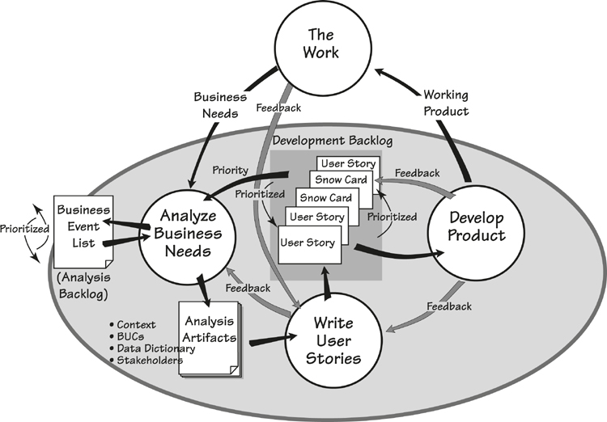
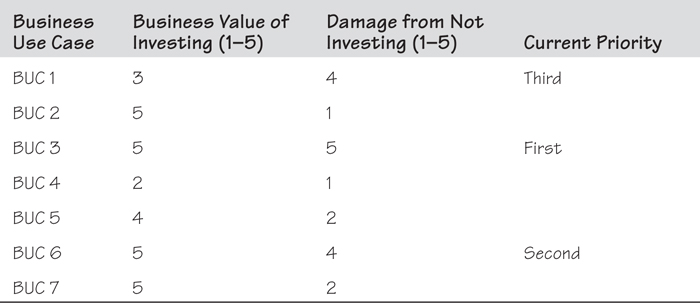
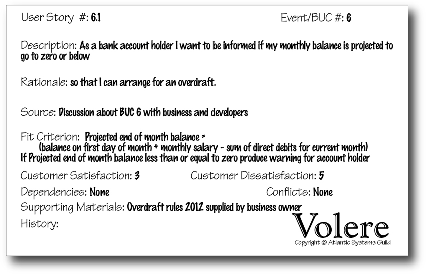
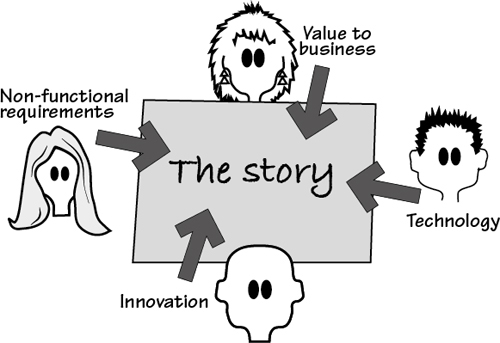

# 14 Requirements and Iterative Development

[14-P001] *in which we look at how to discover and implement requirements in an iterative development environment*

## 14.1 The Need for Iterative Development

[14.1-P001] A significant development in our field is the shared commitment (shared by developers and business people) to doing everything we can to deliver valuable and relevant working product as *quickly* as we can. To be *valuable* and *relevant*, the delivered product must contribute to the business’s ability to carry out its work—insurance, retail, communications, medical imaging, banking, government—whatever work is the raison d’être of the organization in question.

[14.1-P002] Let’s look at the “quickly” part of this commitment. The delivery of a working product for a piece of work of any significant size usually involves a wait—sometimes a long wait. Of course, people don’t want to wait; if they have a problem, then they want a solution quickly, before the business problem changes once again.

[14.1-P003] Instead of waiting for every detail of the requirements to be defined, many organizations find it preferable to iterate through the business activities, define some of the requirements, develop part of the solution, define some more requirements, and so incrementally deliver releases until the solution is adjudged complete. This iterative approach means that concerns, ideas, and changes in both the business environment and the development environment are more in synch with each other. The result is that the developers are informed of today’s business problem and the working product fits into today’s business world.

[14.1-P004] You have no doubt come across development techniques—usually called “agile”—such as SCRUM, Crystal Clear, eXtreme Programming, Kanban, and others. The common element is that these techniques are designed to deliver a working product iteratively. A core idea is to avoid writing a complete requirements specification upfront (the waterfall process), and instead to build the product iteratively and discover the requirements in parallel with the product’s development. The agile techniques advocate using a small, cross-functional team to deliver software frequently in small increments on a regular cycle. They also advocate close cooperation with the customer, including frequent conversations between the customer and the developer to flesh out, clarify, and explore the requirements prior to development. As it is developed, software is delivered incrementally, with each delivery adding some working functionality to the whole product.

[14.1-P005] ***How can I make my requirements discovery iterative?***

[14.1-P006] We are frequently asked by business analysts how they can make requirements discovery compatible with iterative development:

[14.1-P007] • How can I make my requirements discovery iterative?

[14.1-P008] • How can I communicate the requirements without producing unnecessary documents?

[14.1-P009] • How can I trace business requirements to iterative development?

## 14.2 An Iterative Requirements Process

[14.2-P001] **Figure 14.1** illustrates an iterative process for integrating the analysis of business needs, discovery of requirements, and development of working product. First let’s look at the activities involved in this process; later we will look at variations on who does what and how to manage the iterations.

[14.2-P002] 

[14.2-P003] Figure 14.1. Requirements in an iterative development process.

### 14.2.1 The Work

[14.2.1-P001] *The Work*, at the top of the diagram, represents the day-to-day operation of an organization. As this operation proceeds, the people involved with it continually discover new business needs and opportunities: “We should make that process faster,” “We’re going to launch a new service,” “Let’s update the help desk,” “We need to investigate that emerging market,” and so on. It is these continuously emerging *Business Needs* that need to be analyzed so that appropriate action can be taken to meet them.

### 14.2.2 Analyze Business Needs

[14.2.2-P001] *Analyze Business Needs* is a continuous activity that gathers new business needs—these could be in any variety of forms, ranging from a hurried phone call to a detailed business plan—and explores, evaluates, and prioritizes them. The analysis techniques that we have covered previously in this book are the same techniques that are used here to discover the scope, stakeholders, and goals of the problem, and to identify the business events for each new business need. New business events are added to a business event list—the *Analysis Backlog*—that contains all of the identified business events. The analyst prioritizes the events on the list based on the current business situation, demands, and what is considered important at the moment. This analysis of business needs requires the skills of a business analyst along with input from business stakeholders to make the correct choices about the current priorities.

[14.2.2-P002] In parallel with helping identify new business needs, the business analyst elaborates the business use cases for the highest-priority business events, producing the *Analysis Artifacts.* These items could be business use case (BUC) scenarios or any other type of model that is acceptable to the stakeholders and the development team.

### 14.2.3 Write User Stories

[14.2.3-P001] The *Analysis Artifacts* provide the foundation for deciding what the product will do to support and improve the work. This determination is made by some combination of the business analyst, the developers, and the business stakeholders.

[14.2.3-P002] This is the crux of the process. The team members examine the real business, and decide (using the same approach that we described in **Chapter 8**) what is the most beneficial product to build—the optimally valuable (for the owner) product.

[14.2.3-P003] See **Chapter 7**, Understanding the Real Problem, and **Chapter 8**, Starting the Solution, for the core techniques for requirements analysis. 

[14.2.3-P004] Of course, this decision—this design of the solution—has to be communicated. Most iterative processes use *User Stories* for this purpose. A collection of user stories represents the functionality needed for the next release.

[14.2.3-P005] User stories are way of representing a level of requirements that you can envision as being roughly equivalent to a step in a product use case (PUC) scenario, although this can vary and is sometimes equivalent to just the name of the PUC. User stories originate with eXtreme Programming, but now have been incorporated into most iterative methods. The usual form—at least the suggested form—of a user story is this:

[14.2.3-P006] As a [role], I want [feature] so that [reason]

[14.2.3-P007] For example, the story might be as shown in **Figure 14.2**.

[14.2.3-P008] 

[14.2.3-P009] Figure 14.2. A user story written on an index card.

[14.2.3-P010] The story is initially handwritten on an index card, like that shown in **Figure 14.2**. (Later we will show you how the Volere snow card is used as a slightly more structured container for user stories.) The user story is brief, and at this stage of its evolution, is really a placeholder signaling that there is some functionality whose details have yet to be worked out.

[14.2.3-P011] ***Prioritization is continuous.***

[14.2.3-P012] As the stories are written, they are added to the *Development Backlog*. Here they are prioritized according to architectural and development demands and, of course, the needs and priorities of the business. This prioritization is continuous, which results in products that are more immediate, and closer to the business’s focus of attention.

### 14.2.4 Develop Product

[14.2.4-P001] User stories provide the requirements for developing the next release of the product. If the developers are working closely with the business analysts—and if iterative development is to work well, then these groups will be co-located—there is the opportunity for the requirements to be fleshed out of the user stories. Usually test cases are written on the story card, and other development notes added as needed. Naturally, conventional requirements can be written on snow cards, and we suggest doing so for the non-functional requirements. Because there is practically no time delay between the requirements conversation and the development of that part of the product, it is quite feasible for some of the requirements to be communicated verbally and carried in the developer’s head.

[14.2.4-P002] If the opportunity for interaction is limited by geographical boundaries or divided responsibilities, then it will probably be necessary to derive and write the atomic requirements for each user story. In this case the developers can use the snow card to write the atomic functional and non-functional requirements, and to raise questions for the business.

[14.2.4-P003] As you can see in **Figure 14.1**, discoveries during the development can lead to feedback that might cause changes to the *Development Backlog*. The developers deliver the *Working Product* to *The Work*; it consists of a partial product or, as it is more generally thought of, a release.

[14.2.4-P004] Because the product is being developed in piecemeal fashion, the latest-delivered piece of the product might potentially be not quite what the users want; that is, users may provide *Feedback* asking for changes to the *Product*. This flexibility was once trumpeted as the overriding benefit of agile processes—just deliver something and, if the users don’t like it, redesign, refractor, and deliver again. This approach approximates the “infinite number of monkeys on word processors eventually producing the entire works of Shakespeare,” and has fortunately (and justifiably) fallen out of favor. Nevertheless, there should be some capacity in your process for making minor corrections after delivery.

[14.2.4-P005] Reading 

[14.2.4-P006] Boehm, Barry, and Richard Turner. *Balancing Agility and Discipline: A Guide for the Perplexed.* Addison-Wesley, 2004.

[14.2.4-P007] Cockburn, Alastair. *Agile Software Development: The Cooperative Game*. Addison-Wesley, 2006.

[14.2.4-P008] Cohn, Mike. *Succeeding with Agile: Software Development Using Scrum*. Addison-Wesley Professional, 2009.

[14.2.4-P009] Highsmith, Jim. *Adaptive Software Development: A Collaborative Approach to Managing Complex Systems*. Dorset House, 1999.

[14.2.4-P010] The point of iterative development is to deal with small pieces—small sets of requirements that can be readily managed, small increments of functionality that can be more easily understood by all concerned, and small pieces of the working product that can be more readily accepted and integrated into the work environment. Moreover, due to the constant rhythm of delivery, the stakeholders become more involved and more interested in the eventual outcome.

## 14.3 Business Value Analysis and Prioritization

[14.3-P001] The analysis of a new business need might result in the addition of new business events to the analysis backlog, changes to events already on the backlog, or changes in the priority of the analysis backlog.

[14.3-P002] For each business event and its associated BUC in the analysis backlog, the business analyst, along with the business stakeholders, monitors the relative business value of each—that is, the business value of a BUC relative to the others in the backlog (see **Table 14.1** for an example). This relative value determines the priority of the BUCs, which dictates the order in which they will be developed.

[14.3-P003] Table 14.1. A Business Analysis Backlog The business analysis backlog shows sample business use cases and the relative business values assigned to them. The purpose of having such a list is to prioritize the business events.

[14.3-P004] 

[14.3-P005] The following questions are asked about each business use case—and the answers must come from the business:

[14.3-P006] • Relative to the goal and benefit of this project, how much business value would be provided by investing in a new solution to this BUC? Use a scale from 1 (little or no value) to 5 (highest possible value).

[14.3-P007] • Relative to the business goal, how much damage would be done or disadvantage would occur if we do *not* provide a new solution to this BUC? Once again, use the scale from 1 (doesn’t really matter) to 5 (would seriously damage this part of the business).

[14.3-P008] This value analysis, at the BUC level, identifies which business functions or processes would benefit most from investing in a new solution. The business analyst, as part of his daily work, continues to do value analysis at this level to reflect the current state of the business. The intention is for every new piece of development to truly reflect what is most beneficial to the current state of the business.

[14.3-P009] ***This value analysis, at the BUC level, identifies which business functions or processes would benefit most from investing in a new solution.***

[14.3-P010] It is the business analyst’s responsibility to clarify the choices, but making the final choice is the responsibility of the business owner. The business analyst uses the analysis backlog to keep the development teams aware of what is currently most valuable to the business.

[14.3-P011] ***It is the business analyst’s job to clarify the choices, but making the final choice is the responsibility of the business owner.***

[14.3-P012] An advantage of using BUCs as the source of user stories is that all of the stories are traceable back to a BUC. Whenever the business environment changes, the business analyst can identify which BUCs are affected, and in turn discuss with the developers which user stories might potentially be affected. This connection makes it possible to be aware of and plan for the ripple effect of any changes.

## 14.4 How to Write a Good User Story

[14.4-P001] The user story identifies the things that the product will do for a user, but it must also address the business problem identified by the business use case. Thus the BUC serves as the starting point for stories, and there are usually one or more stories derived from each BUC.

### 14.4.1 Questions to Ask

[14.4.1-P001] Suppose that your organization is a bank. The first step in a BUC scenario for this bank is summarized here:

[14.4.1-P002] ***The bank wants to prevent customers from unexpectedly overdrawing their bank accounts. The penalty for non-arranged overdrafts, while profitable, is causing disputes with customers who claim that they need a better way of monitoring their accounts.***

[14.4.1-P003] To discover the user stories, ask this question: What can the product do for the user (in this case, the bank customer) to satisfy the business intention behind this BUC?

[14.4.1-P004] Suppose, as a result of your discussions with the business stakeholders, you decide that bank account holders would be less likely to unexpectedly overdraw their accounts if they could check their account balance. This provides you with a starting point for the story:

[14.4.1-P005] ***As a bank account holder, I want to check my balance online.***

[14.4.1-P006] This at first might seem a reasonable and obvious story, but some requirements analysis can make it a lot better. First, there is no “so that” part. Some authors say that this can be omitted, but we suggest very strongly that you *always* include the reason in your stories. When you fail to justify the requirement (that is, when you omit the “so that” part), you reveal only part of the requirement, which puts the developers and testers at a disadvantage. Additionally, without this rationale (it’s the same thing as the rationale on the snow card), future maintenance teams are deprived of a valuable clue as to why a particular requirement was included in the software product.

[14.4.1-P007] The question is, “Why does the account owner want to check the balance?” Let’s revisit the story and this time look at the reason given for the requirement:

[14.4.1-P008] ***As a bank account holder, I want to check my balance online so that I can access my daily balance 24 hours a day.***

[14.4.1-P009] This is not exactly a good reason for checking the balance. The “24 hours a day” is slightly more enlightening, but it doesn’t really do more than tell us that the account owner may have nocturnal habits. Why does the account owner wish to check the balance? It is not something we do for fun, so there probably is some business reason behind it. We just don’t yet know what that is. Let’s make some conjectures.

[14.4.1-P010] Suppose the reason for the frequent checking is that the account holder is on a tight budget, and is concerned about becoming overdrawn. If so, the owner of the product—that is, the bank—can be more effective and at the same time provide a better service.

[14.4.1-P011] Instead of the account owner having to repeatedly check the balance to confirm that it’s not going into the red, it would be better to build a capability that notifies the account owner if the normal monthly payments such as rent, electricity, school fees, and so on will reduce the account balance to zero or beyond.

[14.4.1-P012] ***As a bank account holder I want to be informed if my monthly balance is projected to go to zero or below so that I can arrange for an overdraft.***

[14.4.1-P013] By arranging for an overdraft, the bank customer avoids the high penalty charges for non-arranged overdrafts, and the bank feels that this is better for customer relations.

[14.4.1-P014] Further, we suggest that it is far more useful for the account owner to be periodically informed of the amount of discretionary money in the account.

[14.4.1-P015] ***As a bank account holder I want to be informed of the discretionary amount after all regular monthly payments have been deducted so that I know how much I can safely spend.***

[14.4.1-P016] If you try to write the user stories without the BUC for guidance, you could possibly end up with the obvious and simple feature that lets the account owner check the balance online. But, as we have seen, this simplistic approach of writing the first story that comes to mind usually leads to features that do not solve the real business problem. If other banks solve the real problem—that is, if they understand the real needs of their customers—and offer this service to attract more customers, then the original story could hardly be said to providing optimal business value.

[14.4.1-P017] ***The BUC provides business guidance so that the user stories support the business rather than just identifying user interfaces.***

[14.4.1-P018] There’s more. The story is a placeholder and serves as the basis for a conversation that is to follow; if the story starts out poorly, then you can expect that it will be no better than mediocre by the time you have finished with it. In contrast, if you write a good story, then the product that emerges from it will certainly be superior, and provide much better value to the business.

[14.4.1-P019] To write a really good story, you must do more than passively listen to the business stakeholders and write down what they think they want. You must apply much of the craft of business analysis that we have been writing about in this book.

[14.4.1-P020] • Innovation is important. If your stories are not innovative, then they probably are not providing any advance over what existed previously and, therefore, are probably not providing any real value to the business.

[14.4.1-P021] • The innovation triggers should be used as a checklist when writing stories. They are bound to make your story better.

[14.4.1-P022] • The real origin of the business event is important. Ask what was happening at the time of the event and try to get your product as close as possible to that point.

[14.4.1-P023] • Think of the essence of the problem. By looking at the real underlying need and not the guessed-at solution, you almost always make a better story.

[14.4.1-P024] • Think “above the line.”

[14.4.1-P025] These points were covered previously in **Chapters 7** and **8**. It is worth looking back at them to explore the advice they offer about writing better stories. The point of good stories is this: The better your story starts out, the better the final product will be. Weak stories lead to weak products—good stories lead to great products.

[14.4.1-P026] ***Good stories lead to great products.***

### 14.4.2 Formalizing Your User Stories

[14.4.2-P001] The level of granularity of user stories varies; but it is normally somewhere between, but might be either, a product use case and an atomic requirement. Surprisingly, the precise level of detail in the story is not important, as long as it conveys the intention and can serve as the foundation for prioritization, and for the elaboration conversation that is to follow.

[14.4.2-P002] The components of a user story are as follows:

[14.4.2-P003] As a [role], I want [feature] so that [reason]

[14.4.2-P004] Most iterative development teams write their stories on blank cards, but you can also use the Volere snow card (also used for atomic requirements) for this purpose. **Figure 14.3** shows how this works.

[14.4.2-P005] 

[14.4.2-P006] Figure 14.3. You can use the snow card as the container for your user stories.

[14.4.2-P007] The requirement number is substituted with a User Story number—note how User Story number 6.1 traces the story back to BUC 6. The Description contains the “As a [role], I want [feature],” and the Rationale contains the “so that [reason].” Your test conditions are written in the Fit Criterion area of the snow card.

### 14.4.3 Fleshing out the Story

[14.4.3-P001] When stories are selected for development, they are removed from the backlog and augmented. This augmentation usually takes place as the result of conversations between the developers, the business analysts, and various stakeholders. This augmentation is pretty much the same as writing the atomic requirements; the business analyst or the developer adds whatever functional details are needed for correct implementation, and non-functional requirements are attached to the story card or become the subject of a new card. As **Figure 14.4** illustrates, augmenting the user story involves input from a number of fields of expertise: the business; non-functional specialties such as usability, security, and look and feel; technology; innovation, and more.

[14.4.3-P002] 

[14.4.3-P003] Figure 14.4. Fleshing out the story is a collaboration involving the business analyst, the developer, and other interested stakeholders.

[14.4.3-P004] Of course, these specialist areas of knowledge might not be represented by different people; it depends on how, in your organization, expertise is spread between roles. The story card provides a gathering point or a focus for exploring the different types of requirements that the product needs to satisfy the original intention of the story.

[14.4.3-P005] The way that you express the requirements details depends on how you are working. In a small co-located team—a rabbit project—you would probably make notes directly on the story card, with those notes then becoming your requirements specification. If you are working on a larger and/or more fragmented project—horses and elephants—you would probably write a snow card for each atomic requirement related to the user story. This latter approach builds a more formal specification, which is particularly critical if you are outsourcing some of the development work.

## 14.5 Iterative Requirements Roles

[14.5-P001] The iterative requirements and development process shown in **Figure 14.1** highlights the need for continuous integration of business and technical knowledge. If only one person had all of this knowledge, then communication would be easy. In the most-likely absence of this superperson, you must find the source of each of the inputs, wherever it lies within your organization. Let’s first look at the input that we need and then consider how the appropriate roles can be found.

[14.5-P002] You need a subject-matter expert who is the source of knowledge about the business or work problem and who is both current on the business/problem and available to answer questions, inform you about changes, and make business-related choices. You also need a source of knowledge about the technical solution space—this source is sometimes called a system architect, and sometimes a developer. This source makes recommendations on the solution and identifies opportunities for how the available technology can be best used to meet the business requirements.

[14.5-P003] Given the different focuses of the business problem viewpoint and the technical solution viewpoint, it is also necessary to have someone who knows how to connect, analyze, and trace the connections between the business concerns and the technical concerns.

### 14.5.1 Business Knowledge

[14.5.1-P001] A knowledge of the business is important—given that the reason for your project is to improve a part of the owner’s business and to provide the optimally valuable product, we can say that business knowledge is the most crucial component of the project. The responsibility for the business knowledge is, reasonably enough, the responsibility of the business. In many cases, however, this knowledge is spread between different stakeholders, each of whom specializes in one or other parts of the business.

[14.5.1-P002] On the one hand, it is difficult to perform iterative development if the developers must talk to all these different people. On the other hand, giving responsibility for business knowledge to just one person is problematic, except in very small and simple projects.

[14.5.1-P003] One attempt to address this problem is to have a representative of the business who works closely with—in fact, becomes part of—the development team. This person, often called a *product owner*, answers all business-related questions.

[14.5.1-P004] The problem is simple: It is rare to find in one person all the skills needed for the role. Consider that the product owner needs to have an in-depth knowledge of the business, be current with technological issues, be innovative and imaginative, be available full-time to the development team, be able to articulate needs, understand the essence of the problem, make the right calls about prioritization, and a lot more. If you have someone in your organization who meets this specification, then you are very lucky indeed. Alas, most teams don’t have this luxury.

[14.5.1-P005] The product owner role has been abandoned by many iterative development teams—it is just too hard to make it work. Some organizations that develop software for sale have a product manager (sometimes called a program manager) role; as this person is responsible for the financial success of the product, his role comes much closer to that of the ideal product owner. Most teams now use a combination of business analysts and business stakeholders to act as the source of business knowledge.

### 14.5.2 Analytical and Communication Knowledge

[14.5.2-P001] Why is the business analyst a useful source of business knowledge? Because the business analyst is not part of either the business or the development team. The business analyst is a neutral channel who is trained to observe and discover the business needs and to communicate those needs to the developers. The difference between a traditional business analyst’s role and that of an iterative business analyst is that the analyst communicates the requirements to the developers in much smaller fragments and the analyst uses techniques to encourage and facilitate feedback.

### 14.5.3 Technical Knowledge

[14.5.3-P001] The technical knowledge is embodied in some combination of the roles of developer, systems architect, tester, and external supplier. It all depends on how you have allocated the responsibilities in your organization. However, there is one big difference here between the business specialists and the technical specialists. The technical specialists are devoted to working on solutions and keeping up-to-date with new technology; their job is to work on projects and solve problems. The business specialists are focused on running the business and doing their day-to-day jobs; they expect the technical specialists to come up with better tools to help them.

## 14.6 Summary

[14.6-P001] Today’s highly dynamic world requires that we iteratively develop and improve solutions to business problems. We need ways to continuously explore the business and its problems, and to communicate those needs to technical specialists, who in turn provide technical solutions for the business.

[14.6-P002] This ongoing exploration of the work means that the business analyst is continuously analyzing and adding new stories or requirements to the analysis backlog. This backlog, in turn, is continuously analyzed for value, for it is business value that most matters here. The backlog is prioritized according to value and urgencies, with the highest-priority items being handed over to the developers for development.

[14.6-P003] The developers, with input and explanations from the business analyst and others, write the stories that best meet the business need. The developers prioritize the user stories in their development backlog, and for the selected ones, augment and determine the atomic requirements to be implemented in the next release of working product. Feedback from each release demonstrates to the team if they are, in fact, working toward the optimally beneficial product.
