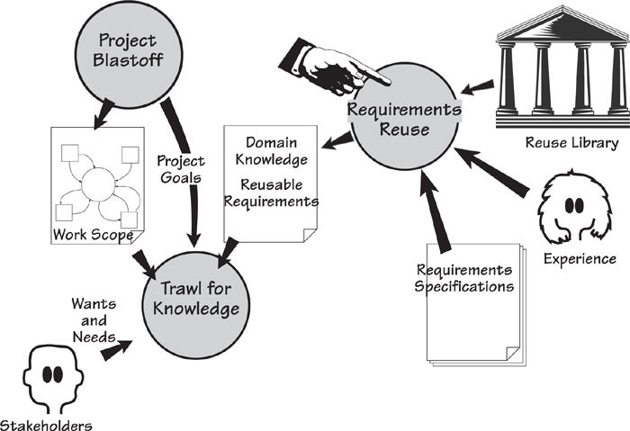
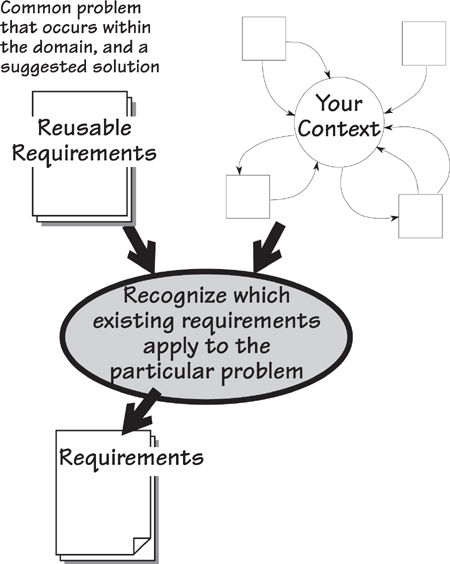
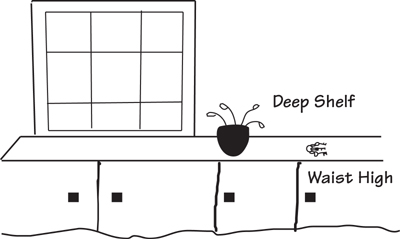
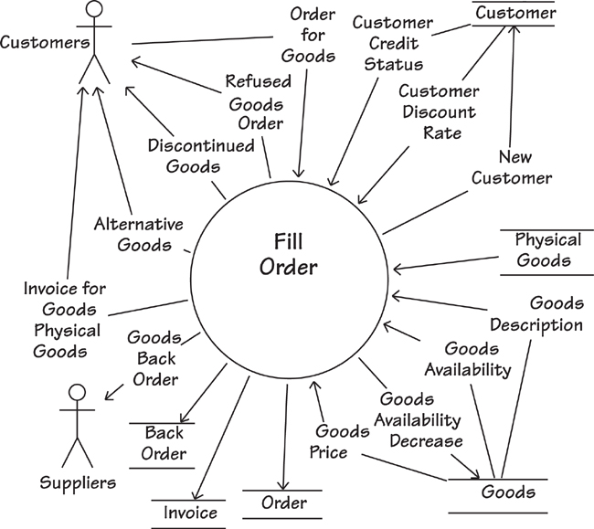
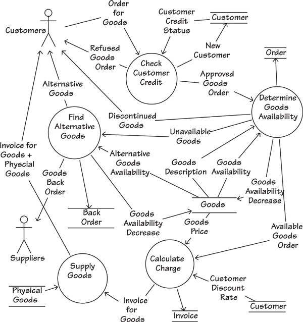
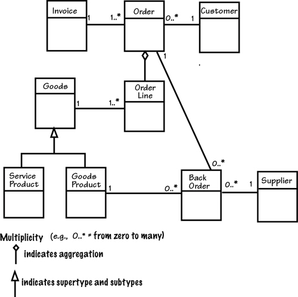
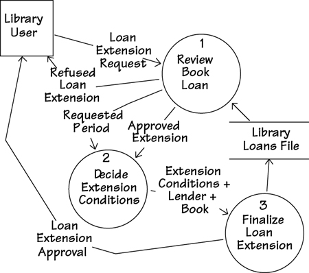
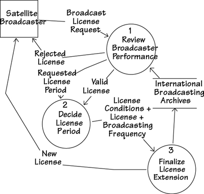
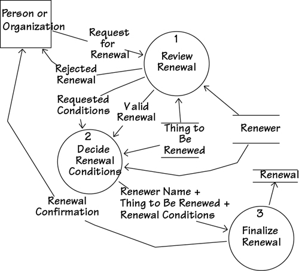

# 15 Reusing Requirements

[15-P001] *in which we look for requirements that have already been written and explore ways to make use of them*

[15-P002] A few days ago, one of your authors needed to know how to do something on his computer—how to type the symbol for degree, as in °C for Celsius temperature. I knew that other people must know this, so I headed to the Mac support forum. I entered my search term and found a thread where some kind soul had previously answered this question. So now I could reuse knowledge that someone else had provided at a previous time.

[15-P003] We all reuse knowledge—the note that you left on the heating system to remind yourself how to restart it; the post that a blogger made about the best way to get a red wine stain out of the carpet; a cooking recipe; the calendar of events on your smartphone. All of these things are knowledge that we put aside for when we need it.

[15-P004] Some of these things were intentionally set down for later reuse, while others were stored without the intention that they be reused (the support thread, for example). Whether it was intended to be reused or not, an amazing amount of knowledge is available to us if only we would make use of it.

[15-P005] A few years ago, it was fashionable to reuse code. A whole movement grew up based on the premise that by reusing code, development time could be considerably reduced. There is no doubt about the veracity of that statement, yet somehow the idea of code reuse never really got off the ground. At least, we see very little of the reuse of in-house code.

[15-P006] One major problem with this approach is illustrated by a conversation overheard at a seminar on code reuse.

[15-P007] Developer: “I get it. From now on I am going to write all my code so that it can be reused.”

[15-P008] Developer’s manager: “No, you don’t get it. From now on you are going to *reuse* code.”

[15-P009] Herein lies the problem—everyone wants to build reusable components for others, and no one wants to reuse someone else’s components. But this does not have to be a problem.

[15-P010] When you are specifying the requirements for a new product, it is always possible to save effort if you start by asking, “Have these requirements, or similar ones, already been written?”

## 15.1 What Is Reusing Requirements?

[15.1-P001] Although they might have different names and different features, the products you build are not completely unique. Within an organization, projects tend to build the same or similar products over time—a retail company builds retail software products, a scientific research center builds scientific products. As a consequence, the chances are that someone in your organization has already built a product that contains some—by no means all—of the requirements that are germane to your current project.

[15.1-P002] By taking advantage of these requirements, your effectiveness as a requirements discoverer increases significantly. Early in your requirements projects, look for requirements that have already been written that, with a little modification or abstraction, can be incorporated into your own project. We illustrate this idea in **Figure 15.1**.

[15.1-P003] 

[15.1-P004] Figure 15.1. Reusing requirements entails making use of requirements written for other projects. Such requirements can come from a number of sources: a reuse library of specifications, other requirements specifications that are similar or in the same domain, or informally from other people’s experience.

[15.1-P005] These requirements are not exactly free, however: You have to do something for them. Successful reuse starts with having an organizational culture that consciously encourages reuse rather than reinvention. If you have this attitude—that is, if you are willing to look at existing requirements—then you are in a much better position to include requirements reuse as part of your requirements process.

[15.1-P006] ***Successful reuse starts with having an organizational culture that consciously encourages reuse rather than reinvention.***

[15.1-P007] Refer to **Chapter 3** for more on how to run a project blastoff meeting. 

[15.1-P008] When you run a project blastoff meeting, use the first seven sections of the requirements template to trigger questions about reuse:

[15.1-P009] **1.** The Purpose of the Project: Are there other projects in the organization that are compatible or that cover substantially the same domains or work areas?

[15.1-P010] **2.** The Client, the Customer, and Other Stakeholders: Can you reuse an existing list of stakeholders, a stakeholder map, or a stakeholder analysis spreadsheet? Users of the Product: Do other products involve the same users and thus have similar usability requirements?

[15.1-P011] **3.** Mandated Constraints: Have your constraints already been specified for another project? Are there any organization-wide constraints that also apply to your project?

[15.1-P012] **4.** Naming Conventions and Definitions: You can almost certainly make use of parts of an existing glossary.

[15.1-P013] **5.** Relevant Facts and Assumptions: Pay attention to relevant facts from recent projects. Do other projects’ assumptions apply to your project?

[15.1-P014] **6.** The Scope of the Work: Your project has a very good chance of being an adjacent system to other projects that are underway in your organization. Make use of the interfaces that have been established by other work context models. Consider your work scope and ask whether other projects have already defined similar business events.

[15.1-P015] **7.** Business Data Model and Data Dictionary: Are there business data models from overlapping or connected projects that you could use as a starting point?

[15.1-P016] Don’t be too quick to say your project is different from everything that has gone before it. Yes, the subject matter is different, but if you look past the names, how much of the underlying functionality is substantially the same? How many requirements specifications have already been written that contain material that you can use unaltered, or at least adapted, in your own specification? We have found that significant amounts of specifications can be assembled from existing components rather than having to be discovered from scratch. See **Figure 15.2**.

[15.1-P017] 

[15.1-P018] Figure 15.2. At project blastoff time, the subject matter of the context, together with its adjacent systems and boundary data flows, should indicate the potential for reusing requirements from previous projects.

[15.1-P019] For more on stakeholder maps and stakeholder analysis, see **Appendix B**, Stakeholder Management Templates. 

[15.1-P020] The stakeholders who participate in the blastoff meeting are wonderful sources of reusable components. Ask them about other documents that contain knowledge relevant to the work of the project. Ask about related projects that they have participated in. Consider whether someone else might have already investigated subject matter domains that overlap with your project. Closely examine the blastoff deliverables—they provide a focus for identifying reusable knowledge that might not otherwise be found.

[15.1-P021] ***The blastoff deliverables provide a focus for identifying reusable knowledge that might not otherwise be found.***

[15.1-P022] When you are trawling for knowledge, continue to look for reusable requirements by asking the people you interview about them: “Have you answered these questions, or questions like them, before? Do you know sources of information that might already contain the answers to these questions?” This fairly informal approach means that you encounter potentially reusable requirements in many different forms. Some are precisely stated and hence directly reusable; others merely provide clues or pointers to sources of knowledge.

[15.1-P023] The problem with reuse is that unless the knowledge is readily accessible, it lies gathering dust in some database and is not reused. In the past it often took longer to find a reusable component than it did to start from scratch. Today, of course, search technology has greatly accelerated this process. Now everyone, especially in larger companies, has searchable intranets, wikis, SharePoint, requirements tools, and databases that contain a cornucopia of potentially reusable requirements.

[15.1-P024] We mentioned previously that using the first seven sections of the requirements template to drive your project blastoff provides you with a good starting point for discovering reusable requirements. We recommend that as soon as you have captured your first-cut work context model, you use it as the driver for searching for reusable requirements knowledge within your organization. At the very least, perform a search for each of the interfaces on your model. You will likely discover other places, documents, projects, and people who are connected with each interface and might have already specified requirements that are relevant to your project.

[15.1-P025] Naturally enough, if everyone structured their requirements and used terminology in a consistent way, such as we are suggesting to you, then all requirements would be more easily reusable by future projects. In this chapter, we explore the thinking behind reuse, development of the ability to spot potential, and the habit of leaving a reusable trail of knowledge.

## 15.2 Sources of Reusable Requirements

[15.2-P001] When you want to learn to cook the perfect fried egg, one of the best ways to get started is to learn from someone whose fried eggs you admire. They tell you the egg should be less than five days old, and the butter—slightly salted is best—should be heated until it is golden but not brown. You break the egg, gently slide it into the bubbling butter, and then spoon the golden liquid over it until the white turns opaque. You serve the egg with a sprinkling of fresh coriander and, optionally, Tabasco sauce.

[15.2-P002] ***Informal experience-related reuse of requirements: We do this when we ask questions of our colleagues. We want to learn from one person’s experience so that we do not have to start our own endeavors from scratch.***

[15.2-P003] This example demonstrates informal experience-related reuse of requirements; we do this when we ask questions of our colleagues. We want to learn from one person’s experience so that we do not have to start our own endeavors from scratch. We might not always find out everything we want to know, and we might make changes to what we are told, but we use the information discovered to build on other people’s knowledge.

[15.2-P004] More formal reusable requirements for the domain of fried-egg cookery come from cookbooks. For example, Jenny Baker, in her *book Simple French Cuisine,* instructs us to follow these steps:

[15.2-P005] “Heat sufficient oil . . . fry the tomatoes with a garlic clove . . . break the eggs on top and cook gently until set.”

[15.2-P006] In *Italian Food,* Elizabeth David advises us to do this:

[15.2-P007] “Melt some butter . . . put in a slice of mozzarella . . . break two eggs into each dish . . . cover the pan while the eggs are cooking.”

[15.2-P008] ***Once you know the context of your work, you can look for requirements specifications that deal with all or part of that context and use them as the source of potentially reusable requirements.***

[15.2-P009] You can think of a cookbook as a requirements specification—it’s just written for a different context of study than the one you are currently working on. Even though the preceding examples have some differences, both have aspects that could be reused as a starting point for generating a new way to fry eggs. Thus, once you know the context of your work, you can look for requirements specifications that deal with all or part of that context and treat them as the source of potentially reusable requirements.

[15.2-P010] You can reuse requirements or knowledge from any of the sources that we have discussed: colleagues’ experiences, existing requirements specifications, domain models, and, of course, books. The only thing necessary is that you can recognize the reusable potential of anything you come across. Recognition itself requires that you perform abstractions, so as to see past the technology and procedures that are part of existing requirements. Abstraction also involves seeing past subject matter to find recyclable components. We will have more to say about abstraction later in this chapter; for now, let’s look at making use of the idea of patterns.

[15.2-P011] Reading 

[15.2-P012] Three cookery writers who have made knowledge about cooking accessible and reusable are Jenny Baker, Elizabeth David, and Delia Smith. Any of the books by these writers can help you improve your cooking skills and enjoyment of food.

[15.2-P013] Baker, Jenny. *Simple French Cuisine.* Faber & Faber, 1992.

[15.2-P014] David, Elizabeth. *Italian Food.* Penguin Books, 1998.

[15.2-P015] Smith, Delia. *How to Cook: Book One.* BBC Worldwide, 1998.

## 15.3 Requirements Patterns

[15.3-P001] A pattern is a guide; it gives you a form to follow when you are trying to replicate, or make a close approximation of, some piece of work. For example, the stonecutters working on classical buildings used wooden patterns to help them to carve the column capitals to a uniform shape. The tailor uses patterns to cut the cloth so that each jacket follows the same basic form, with minor adjustments made to compensate for an individual client’s body shape.

[15.3-P002] But what about patterns in a requirements sense? Patterns imply a collection of requirements that make up some logical grouping of functions. For example, we can think of a requirements pattern for selling a book in a shop: determine the price; compute applicable taxes; collect the money; wrap the book; thank the customer. If this is a successful pattern, then it pays you to use the pattern for any future bookselling activities, rather than reinvent the process of selling a book.

[15.3-P003] Refer to **Chapter 4**, Business Use Cases, for more on the connection between business events and use cases. 

[15.3-P004] Typically, we use requirements patterns that capture the processing policy for a business use case (BUC). If we use the BUC as a unit of work, then each pattern is bounded by its own input, output, and stored data. As a consequence, we can treat it as a stand-alone mini-system.

[15.3-P005] Requirements patterns improve the accuracy and completeness of requirements specifications. You reduce the time needed to produce a specification because you reuse a functional grouping of requirements knowledge that has already been specified by other projects. To do so, look for patterns that may have some application in your project. Keep in mind that a pattern is usually an abstraction and that you may have to do a little work to adapt existing requirements to your own needs. Nevertheless, the time saved in completing your specification and the insights gained by using other people’s patterns is significant.

### 15.3.1 Christopher Alexander’s Patterns

[15.3.1-P001] The most significant collection of patterns—and one that inspired the pattern movement in software design—was published in *A Pattern Language,* written by a group of architects headed by Christopher Alexander. This book identifies and describes patterns that contribute to functionality and convenience for everyday human life within buildings, living spaces, and communities. The book presents these patterns to architects and builders for use as guides for new building projects. Even if you are neither a builder nor an architect, there is much to learn from this book.

[15.3.1-P002] Reading 

[15.3.1-P003] Alexander, Christopher, et al. *A Pattern Language: Towns, Buildings, Construction.* Oxford University Press, 1977.

[15.3.1-P004] The Waist-High Shelf (illustrated in **Figure 15.3**) is one of the patterns defined by Alexander and his colleagues. In this case, they looked at many people and observed what happens when we enter and leave our houses. Suppose it is time to leave for work and you are in a hurry. You need your keys, your sunglasses, your building pass, and your phone. If these things are difficult to find, you become irritated, probably forget something, and have a bad start to the day. The Waist-High Shelf pattern is based on the observation that we need somewhere to put our keys and whatever other bits and pieces we are carrying when we arrive, so that we can easily find them again when we leave.

[15.3.1-P005] 

[15.3.1-P006] Figure 15.3. Alexander defined the Waist-High Shelf pattern because, as he observed, “In every house and workplace there is a daily ‘traffic’ of the objects which are handled most. Unless such things are immediately at hand, the flow of life is awkward, full of mistakes: things are forgotten, misplaced.”

[15.3.1-P007] The pattern specifies there should be a horizontal surface at waist height (a convenient height to reach), located just inside the front door (you do not have to carry objects farther than necessary), and big enough for you to deposit items that are commonly transported in and out of the house. In your authors’ house, the Waist-High Shelf pattern implemented itself without us realizing it. We noticed that we naturally put our keys and sunglasses on one of the steps of the staircase that is conveniently on your right (we are both right-handed) as you come through our front door. We also noticed that, without being told, our visitors also leave their keys on the “waist-high step.”

[15.3.1-P008] Note the role of the pattern: It is a guide, not a rigid set of instructions or an implementation. It can be reused—there is no need to experiment and reinvent the pattern. It is a collection of knowledge or experience that can be adapted or used as is.

[15.3.1-P009] Now let us look at patterns as they apply to your requirements.

## 15.4 A Business Event Pattern

[15.4-P001] Let’s start by looking at an example of a requirements pattern. Like most of them, this one is based on the response to a business event:

[15.4-P002] ***Pattern Name: Customer Wants to Buy Goods***

[15.4-P003] ***Context: A pattern for receiving goods orders from customers, supplying or back-ordering the goods, and invoicing for them.***

[15.4-P004] ***Forces: An organization has demands from its customers to supply goods or services. Failure to meet his demand might result in the customer seeking another supplier. Sometimes the goods or services are unavailable at the time the order is received.***

[15.4-P005] The following models define this pattern in more detail; we’ll start with the context model in **Figure 15.4**. You would use this diagram to determine whether the details of the pattern might be relevant to the work you are doing. The flows of data (or material) around the boundary of the context indicate the kind of work being done. If the majority of these flows are compatible with the inputs and outputs of your event, then the pattern is potentially reusable within your project.

[15.4-P006] 

[15.4-P007] Figure 15.4. This context model defines the boundaries of the pattern Customer Wants to Buy Goods. The arrows identify flows of data and material. All flows coming into the process *Fill Order* are used by that piece of work to carry out the business rules that produce the flows coming out of *Fill Order.* Some flows come from or go to adjacent systems such as *Suppliers* or *Customers.* Other flows come from or go to stores of information such as *Goods* or *Back Order,* as indicated by a pair of parallel lines. Of course, this diagram is merely a summary showing the boundaries; the individual requirements reside inside the process *Fill Order.*

### 15.4.1 Context of Event Response

[15.4.1-P001] Once you have decided that the pattern is suitable for your use, it’s time to move on to the details. These can be expressed in a number of different ways. The technique that you use depends on the volume and depth of your knowledge about the pattern. For example:

[15.4.1-P002] • A step-by-step text description or scenario of what happens after a Customer sends an Order for Goods

[15.4.1-P003] • A definition of all the individual requirements related to the Fill Order process

[15.4.1-P004] • A detailed model that breaks the pattern into subpatterns and their dependencies before specifying the individual requirements

### 15.4.2 Processing for Event Response

[15.4.2-P001] **Figure 15.5** illustrates how a large pattern can be partitioned into a number of subpatterns. From this diagram, we can identify other potentially reusable clusters of requirements. For instance, the diagram reveals a subpattern called Calculate Charge along with its interactions with other subpatterns. We can use this subpattern independently whenever we want to specify the requirements for calculating any type of charge. The interactions indicate which other patterns might also be relevant to us when we are interested in the pattern for calculating a charge. Other ways of depicting this pattern are to use a UML activity diagram, a sequence diagram, or a scenario.

[15.4.2-P002] 

[15.4.2-P003] Figure 15.5. This diagram breaks the process *Fill Order* (shown in **Figure 15.4**) into five subprocesses (groups of functionally related requirements) and shows the dependencies between them. Each of the subprocesses (shown with a circle) is connected by named data flows to other subprocesses, data stores, or adjacent systems. Each subprocess also contains a number of requirements. Rather than forcing an arbitrary sequence on the processes, this model focuses on the dependencies between the processes. For example, we can see that the process *Determine Goods Availability* has a dependency on the process *Check Customer **Credit.* Why? Because the former needs to know about the *Approved Goods Order* before it can do its work.

### 15.4.3 Data for Event Response

[15.4.3-P001] The class diagram in **Figure 15.6** shows the classes that participate in the pattern Customer Wants to Buy Goods, along with the associations between them. We can cluster the attributes and operations unique to each object. For instance, the class Goods has a number of unique attributes, such as its name and price; similarly, it has some unique operations such as calculate discounted price and find stock level. Because we have this cluster of knowledge about the class called Goods, whenever we need to specify requirements for goods we can potentially reuse some or all of this knowledge.

[15.4.3-P002] 

[15.4.3-P003] Figure 15.6. This class diagram shows the classes and associations between them that are part of the pattern Customer Wants to Buy Goods. Consider the business rules communicated by this diagram. A **Customer** may make zero or many *Orders,* each of which is invoiced. The *Order* is for a collection of *Order Lines.* An *Order Line* is for *Goods,* which might be a *Service Product* or a *Goods Product.* Only *Goods Products* can have a *Back Order.* Now consider how many situations in which these business rules, data, and processes might be reused.

## 15.5 Forming Patterns by Abstracting

[15.5-P001] The requirements pattern we have been discussing is the result of analyzing many business events—quite often from very different organizations—that deal with the subject of a customer wanting to buy something. We derived this pattern by making an abstraction that captures all of the common processing policy, so if your project includes a business event centered on a customer wanting to buy something, then this pattern is a realistic starting point.

[15.5-P002] ***Use the idea discussed in *****Chapter 7*****, Understanding the Real Problem, and focus on thinking above the line.***

[15.5-P003] The same rubric applies with other events and other domains. Use the idea discussed in **Chapter 7**, Understanding the Real Problem, and focus on thinking above the line where you find the essence of the problem. Form your patterns by looking past the specific to see the abstract. Look away from the technology that the organization currently uses to see the business policy that is being processed. Think of the work, not in its current incarnation, but rather as a baseline for work that can be done in the future.

[15.5-P004] Of course, you can have many patterns, covering many business events and domains. To file them so that they are accessible, we organize these patterns in a consistent way according to the following template (which is really a pattern itself):

[15.5-P005] ***Pattern Name: A descriptive name to make it easy to communicate the pattern to other people.***

[15.5-P006] ***Forces: The reasons for the pattern’s existence.***

[15.5-P007] ***Context: The boundaries within which the pattern is relevant.***

[15.5-P008] ***Mechanics: A description of the pattern using a mixture of words, graphics, and references to other documents.***

[15.5-P009] ***Related Patterns: Other patterns that might apply in conjunction with this one; other patterns that might help to understand this one***

### 15.5.1 Patterns for Specific Domains

[15.5.1-P001] Suppose that you are working on a system for a library. One of the business events within your context is almost certain to be Library User Wants to Extend Book Loan. **Figure 15.7** shows a model of the system’s response to this event. When a *Library User* submits a *Loan Extension Request,* the product responds with either *Refused Loan Extension* or *Loan Extension Approval.*

[15.5.1-P002] 

[15.5.1-P003] Figure 15.7. A summary of the library system’s response to the event Library User Wants to Extend Book Loan.

[15.5.1-P004] ***One of the benefits of using a disciplined process for writing requirements specifications is that you naturally produce requirements that are more easily reusable by future projects.***

[15.5.1-P005] Your work on the project in the library domain has led to the specification of detailed requirements for a particular product. As a by-product of doing this work, you have identified some useful requirements patterns, clusters of business-event–related requirements that are potentially reusable on other projects in the library domain.

[15.5.1-P006] When you specify requirements using a consistent discipline, you make them more accessible to other people and, therefore, reusable. If you or someone else began another project for the library, a good starting point would be the specifications that you have already written. They are usually a prodigious source of recyclable requirements knowledge within this domain.

[15.5.1-P007] Now imagine that you are working on a system in a very different domain, that of satellite broadcasting. One business event within this context is Satellite Broadcaster Wants to Renew License. When the satellite broadcaster submits a *Broadcast License Request,* the product responds with either *Rejected License* or *New License.* **Figure 15.8** summarizes the system’s response to the event.

[15.5.1-P008] 

[15.5.1-P009] Figure 15.8. A model of the satellite broadcasting product’s response to the event Satellite Broadcaster Wants to Renew License.

[15.5.1-P010] When you work on the requirements for the satellite broadcasting project, you also discover requirements patterns that are potentially reusable on products within this domain.

[15.5.1-P011] Now let’s look a little farther afield. We have talked about the idea of identifying and reusing requirements patterns within a specific subject matter domain. But how can we use patterns outside the originating domain?

### 15.5.2 Patterns Across Domains

[15.5.2-P001] At first glance, the event responses to Library User Wants to Extend Loan and Satellite Broadcaster Wants to Renew License appear to be very different. Indeed, they are different in that they come from very different domains. Nevertheless, let’s revisit the two event responses, this time looking for similarities. If we find shared characteristics, then we have a chance of deriving a more abstract pattern that could be applied to many other domains.

[15.5.2-P002] Both library books and broadcasting licenses are “things to be renewed.” The business decides whether to renew an item in response to requests from a renewer. The business rules for renewing books or licenses share some similarities. For instance, the business checks whether the renewer is eligible to renew the thing; it decides the conditions of renewal; it records the decision and informs the renewer. By looking at several different responses, we can make an abstraction: We have some processing policy that is common to all renewable items. We also discover that some attributes of a “thing to be renewed” are the same regardless of whether we are talking about a book or a broadcasting license. For example, each thing to be renewed has a unique identifier, a standard renewal period, and a renewal fee.

[15.5.2-P003] **Figure 15.9** shows the result when we make an abstraction of the processing policy from the two business use cases. Here we are using abstraction to identify common characteristics. To do so, we look past what we see on the surface, and find useful similarities or classifications. In addition, we ignore some characteristics in our quest to find common ones.

[15.5.2-P004] 

[15.5.2-P005] Figure 15.9. This business use case model is the result of finding the similarities between a business use case in the library domain and a business use case in the satellite broadcasting domain.

[15.5.2-P006] When creating an abstract, you ignore the physical artifacts and subject matters. For example, in **Figure 15.9** we have ignored the physical artifacts of library books and broadcasting licenses. Instead, concentrate on the underlying actions of the two systems, with a view toward finding similarities that you can use to your advantage. If, for example, a part of a route allocation system has functional similarities to a container storage system (one of the authors actually found these similarities), then the work done for one system can be recycled for the other.

[15.5.2-P007] The skill of identifying and using patterns is tied to several other abilities:

[15.5.2-P008] • The ability to see work at different levels of abstraction

[15.5.2-P009] • The ability to categorize, or classify, in different ways

[15.5.2-P010] • The ability to see that lenses and glass spheres filled with water are both magnifying devices

[15.5.2-P011] • The ability to spot similarities between apparently different things

[15.5.2-P012] • The ability to disregard physical artifacts

[15.5.2-P013] • The ability to see things in the abstract

## 15.6 Domain Analysis

[15.6-P001] Domain analysis is the activity of investigating, capturing, and specifying generic knowledge about a subject matter area. You could think of **domain analysis** as non-project systems analysis: The goal is to learn about the business policy, data, and functionality—not to build something. The knowledge gained about the domain is used, and ideally reused, by any project that builds a product to be used within that domain.

[15.6-P002] Domain analysis works in the same way that regular systems analysis does. That is, you work with domain experts to extract their hitherto unarticulated knowledge, and you record it in a manner that allows other analysts to reuse the knowledge. This process suggests that regular analysis models—event-response models, activity diagrams, sequence diagrams, class diagrams, state models, data dictionaries, and so on—are the most useful, as these kinds of models have the greatest currency in the analysis world.

[15.6-P003] ***The point is not to rediscover knowledge, but rather to reuse models of knowledge.***

[15.6-P004] Once the domain knowledge has been captured and recorded, it becomes available to anyone who builds a product for that domain. The domain knowledge applies to any product for that domain. The point is not to rediscover knowledge that has always existed, but rather to reuse the models of knowledge.

[15.6-P005] Domain analysis is a long-term project. That is, the knowledge gained is reusable, but this benefit will be realized only if you get the opportunity to reuse that knowledge. An investment in domain analysis is like any other investment: You must have a good idea that the investment will be paid back. In the case of domain analysis, there is no limit to the number of times that domain knowledge can be reused.

## 15.7 Summary

[15.7-P001] We can informally reuse requirements knowledge by talking to our colleagues and reusing our own experience. Requirements modeling techniques produce deliverables such as work context models, activity diagrams, scenarios, and atomic requirements specifications, among many others; moreover, all of them make requirements visible and, therefore, potentially reusable to a much wider audience.

[15.7-P002] Requirements specifications that have been written for other projects can also contain material you might find reusable. We have a tendency to disregard anything that comes from another project team, but there is usually something to be gained by looking at the documents of others. Naturally, the clearer and better your requirements documents are, the more likely that someone will find them reusable.
