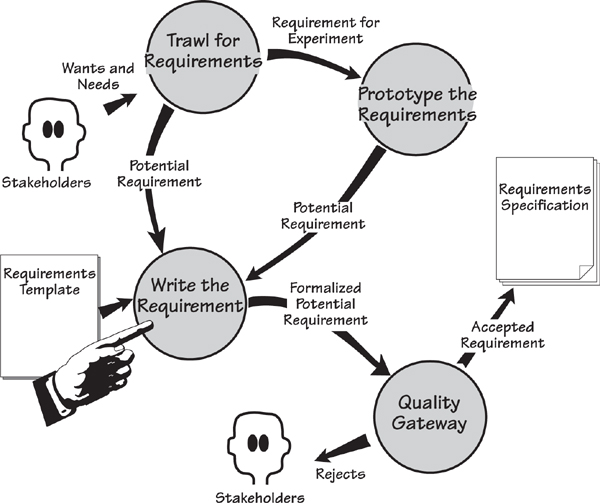
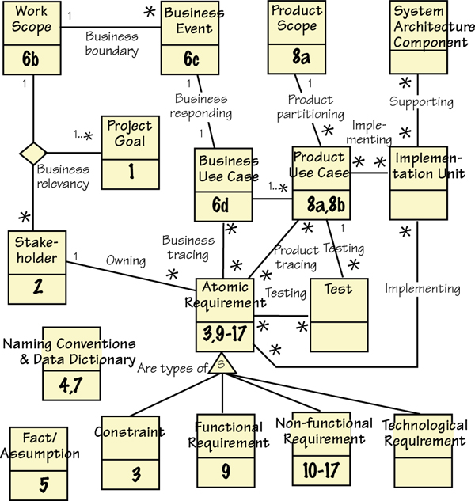
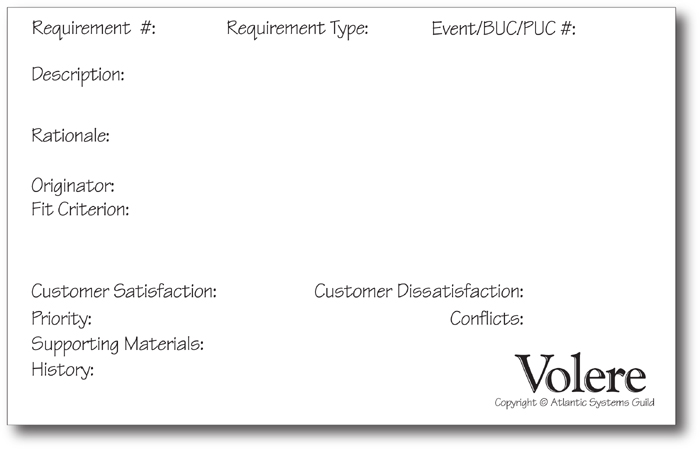
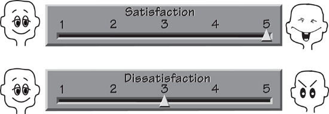
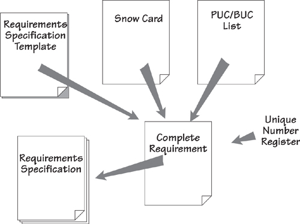
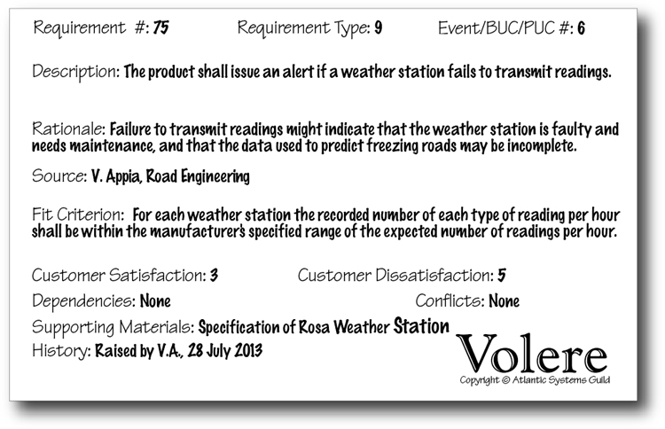
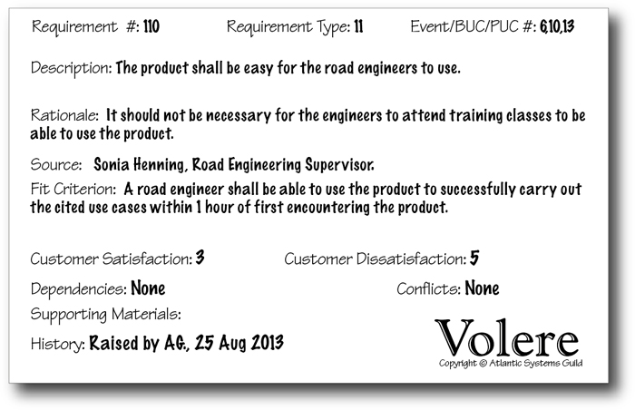

# 16 Communicating the Requirements

[16-P001] *in which we turn the requirements into communicable form*

[16-P002] At one end of the development universe, you have a business; at the other end, you have developers and technicians who have to build something for that business. The task, which is a lot simpler to say that it is to do, is to communicate the business needs to the development team. Typically, you do this by writing a requirements specification, but there are other ways of getting the needed information, precisely and correctly, to the people who need it. The requirement for the requirements is that they must be conveyed in a style such that the people receiving the information actually read it, understand it, and make use of it.

[16-P003] *“No matter how brilliantly ideas formed in his mind, or crystallized in his clockworks, his verbal descriptions failed to shine with the same light. His [John Harris, who solved the problem of Longitude] last published work, which outlines the whole history of his unsavory dealings with the Board of Longitude, brings his style of endless circumlocution to its peak. The first sentence runs on, virtually unpunctuated for twenty-five pages.”*

[16-P004] —Dava Sobel, *Longitude*

[16-P005] Writing the requirements is not necessarily a separate activity, but rather something done during the trawling and discovery activities. However, there are some things about writing and packaging your requirements that are significant, and we discuss them in this chapter.

## 16.1 Formality Guide

[16.1-P001] This chapter is about *communicating* the requirements. You don’t always write the requirements in a specification document, but they must be formalized to the point where all concerned stakeholders can see them well enough to agree with your understanding of the requirements.

[16.1-P002] Rabbit projects usually don’t write a formal specification, but you should consider how to communicate some of the attributes of the requirements. In particular, rabbit projects usually write test cases instead of a fit criterion. If you are using story cards, then they *must* contain a rationale, and adding a customer value attribute is useful.

[16.1-P003] 

[16.1-P004] Keep in mind that getting the requirements right is not making development more bureaucratic, but making it more effective.

[16.1-P005] Horse projects should start with the requirements knowledge model (shown in **Figure 16.2** later in this chapter). Make sure you know where and how these components are recorded. It is not necessary for all of them to reside in one specification, but it is necessary to have them somewhere. Horses should consider the amount of specification they need. We describe here a complete and rigorous specification, but please assess your needs before producing each part of the specification.

[16.1-P006] 

[16.1-P007] Elephant projects build a complete specification and should use some kind of automated tool to contain it. Many such tools are available, and the prime consideration is to allow the team of requirements analysts to access the specification simultaneously. Because of their size, fragmentation, and long lifetime—and, in turn, higher number of rippling changes—elephant projects need to be ultra-concerned with having enough formality (including an agreed-upon requirements knowledge model) to ensure that their requirements are traceable from the product to the work, and from the work to the product.

[16.1-P008] 

## 16.2 Turning Potential Requirements into Written Requirements

[16.2-P001] During the trawling and prototyping activities, the requirements you find are not always precise—they are ideas or intentions for requirements, and are sometimes vague and half-formed. By contrast, the requirements specification you produce is the basis for the contract to build a product. As a consequence, it must contain clear, complete, and testable instructions about what has to be built. The task we tackle in this chapter is turning the half-formed ideas into precise and communicable statements of requirement—a task illustrated in **Figure 16.1**.

[16.2-P002] 

[16.2-P003] Figure 16.1. You discover the intention of the requirements when you are trawling and prototyping. We refer to these as *potential requirements.* The writing activity transforms the resulting ideas and half-formed thoughts into precise and testable requirements; we call these *formalized potential requirements*. Finally, the Quality Gateway tests the requirements before adding them to the requirements specification.

[16.2-P004] This translation from vagueness to precision is not always straightforward, and we have found it useful to have some help. To do so, we make use of a specification template and a requirements shell. The template is a ready-made guide or checklist for the contents of a specification, and the shell is the container for an individual—we shall call it an “atomic”—requirement. Let’s start at the beginning.

## 16.3 Knowledge Versus Specification

[16.3-P001] Before plunging into a description of how to write requirements and assemble them to make a specification, it is worth spending a few moments to consider the knowledge you accumulate as you progress through the requirements process. By understanding this knowledge and having a common language for talking about it, you make better decisions on how the requirements specification is written, published, and distributed.

[16.3-P002] ***Think facts, not documents or databases.***

[16.3-P003] Let’s start with the requirements knowledge model shown in **Figure 16.2**. Think of this model as a conceptual filing system, containing all of the information you have about your requirements. You can also think of it as an abstract way of looking at the contents of the requirements template. Each rectangle in **Figure 16.2** represents a class of requirements information. The way in which you store this information is not important, and you should not be overly concerned with its format. Put simply, the *information* is the crucial aspect of this conceptual model. Think facts, not documents or databases.

[16.3-P004] 

[16.3-P005] Figure 16.2. The requirements knowledge model represents the information you discover during the requirements process. For convenience, we use a UML class diagram to model this information. Each of the classes (shown as rectangles) is a repository of information about the subject (the name of the class). The associations (lines) between the classes are relationships needed to make use of the information. The numbers attached to the classes correspond to the section numbers in the Volere Requirements Specification Template (see **Appendix A**).

[16.3-P006] The model represents your collected knowledge of the requirements. To make it easier to distribute this information, we suggest that most of it be written as a specification. To that end, the numbers on the classes provide a cross-reference to the specification template.

[16.3-P007] The complete Volere Requirements Knowledge Model is found in **Appendix D**. 

[16.3-P008] The classes in the knowledge model (**Figure 16.2**) are associated with other classes. These associations express the working relationships that give additional meaning to the information held within the class model. For example, the classes **Work Scope**, **Project Goal**, and **Stakeholder** have three-way association between them. This relationship represents the dependency of one on the others—change the scope and you change the stakeholders; change the goal and you change the scope, and probably the stakeholders. Back in **Chapter 3** we discussed the trinity of scope, stakeholders, and goals. **Figure 16.2** provides a graphic representation of that trinity; to give it more meaning, we named the association *Business Relevancy* on the model.

[16.3-P009] Think of the knowledge model as an abstract representation of the requirements information you accumulate, manage, and trace over the course of your development project. Now it falls to you to decide how you will format and store this knowledge. You decide which combination of automated and manual procedures you will use to record and keep track of the content. Typically projects use a combination of spreadsheets, word processors, requirements management tools, modeling tools, and—let us not forget—good, old-fashioned, but still effective cards to manage the information that is represented by the knowledge model.

[16.3-P010] You should also consider which parts of which classes of knowledge will be published in which of your documents. For example, **Figure 16.2** includes an association called *Product Tracing* between the classes called *Product Use Case* and **Atomic Requirement**. An asterisk appears at both ends of the line, indicating that each product use case needs a number of atomic requirements to carry out its functionality and non-functionality, and that each requirement may potentially be used by a number of product use cases.

[16.3-P011] Reading 

[16.3-P012] For more details on building your own tailored requirements knowledge model, see the following source: Robertson, Suzanne, and James Robertson. *Requirements-Led Project Management: Discovering David’s Slingshot.* Addison-Wesley, 2005.

[16.3-P013] This association means that when it comes to publishing your documents, you might choose, for example, to publish one or more product use cases and show their details by including all of the associated atomic requirements. The result would be a useful document for implementation purposes. Alternatively, that same association means that you could select a particular requirement and publish a list of all product use cases that contain it. This is useful for determining the impact of changes, and later during system maintenance.

[16.3-P014] When you have a well-organized knowledge model, you can choose which parts of it should appear in which documents, and provide stakeholders with the information they need.

## 16.4 The Volere Requirements Specification Template

[16.4-P001] Thousands of good requirements specifications have already been written. Your task of writing another one becomes easier if you make constructive use of some of the existing good specifications.

[16.4-P002] *“Bernard of Chartres used to say that we are like dwarfs on the shoulders of giants, so that we can see more than they, and things at a greater distance, not by virtue of any sharpness of sight on our part, or any physical distinction, but because we are carried high and raised up by their giant size.”*

[16.4-P003] —John of Salisbury

[16.4-P004] We assembled the Volere Requirements Specification Template by “standing on the shoulders of giants.” Your authors borrowed useful content and components from specifications of many successfully built products, and packaged the best of them into a reusable template. The intention of the template is that it forms the foundation of *your* requirements specifications. This way, you, too, get to stand on the shoulders of giants.

[16.4-P005] The Volere template is a compartmentalized container for requirements. We examined requirements documents and categorized their requirements into types that prove useful for the purpose of recognition and elicitation. Each of the types is allocated to a section of the template.

[16.4-P006] The Volere Requirements Specification Template is found in **Appendix A**. This chapter repeatedly refers to the template. 

### 16.4.1 Template Table of Contents

#### 16.4.1.1 Project Drivers

[16.4.1.1-P001] **1.** The Purpose of the Project

[16.4.1.1-P002] **2.** The Stakeholders

#### 16.4.1.2 Project Constraints

[16.4.1.2-P001] **3.** Mandated Constraints

[16.4.1.2-P002] **4.** Naming Conventions and Terminology

[16.4.1.2-P003] **5.** Relevant Facts and Assumptions

#### 16.4.1.3 Functional Requirements

[16.4.1.3-P001] **6.** The Scope of the Work

[16.4.1.3-P002] **7.** The Business Data Model and Data Dictionary

[16.4.1.3-P003] **8.** The Scope of the Product

[16.4.1.3-P004] **9.** Functional Requirements

#### 16.4.1.4 Non-functional Requirements

[16.4.1.4-P001] **10.** Look and Feel Requirements

[16.4.1.4-P002] **11.** Usability and Humanity Requirements

[16.4.1.4-P003] **12.** Performance Requirements

[16.4.1.4-P004] **13.** Operational and Environmental Requirements

[16.4.1.4-P005] **14.** Maintainability and Support Requirements

[16.4.1.4-P006] **15.** Security Requirements

[16.4.1.4-P007] **16.** Cultural Requirements

[16.4.1.4-P008] **17.** Legal Requirements

#### 16.4.1.5 Project Issues

[16.4.1.5-P001] **18.** Open Issues

[16.4.1.5-P002] **19.** Off-the-Shelf Solutions

[16.4.1.5-P003] **20.** New Problems

[16.4.1.5-P004] **21.** Tasks

[16.4.1.5-P005] **22.** Migration to the New Product

[16.4.1.5-P006] **23.** Risks

[16.4.1.5-P007] **24.** Costs

[16.4.1.5-P008] **25.** User Documentation and Training

[16.4.1.5-P009] **26.** Waiting Room

[16.4.1.5-P010] **27.** Ideas for Solutions

### 16.4.2 Template Divisions

[16.4.2-P001] The template is set out in five main divisions. First come the *Project Drivers*. These factors cause the project to be undertaken in the first place. Drivers include such things as the purpose of the project—why you are involved in gathering the requirements for a product, and who wants or needs that product.

[16.4.2-P002] Next are *Project Constraints*. These are restrictions that limit the requirements and the outcome of the project. The constraints are written into the specification at blastoff time, although you probably have some mechanism in place for determining them earlier.

[16.4.2-P003] Think of those first two sections as setting the scene for the requirements that are to follow.

[16.4.2-P004] The next two divisions deal with the requirements for the product. Both the *Functional Requirements* and the *Non-functional Requirements* are specified here. Each requirement is described to a level of detail such that the product’s constructors know precisely what to build to satisfy the business need, and what to test to ensure the delivered product matches its requirement.

[16.4.2-P005] The final division of the template deals with *Project Issues*. These are not requirements for the product, but rather issues that must be faced if the product is to become a reality. This part of the template also contains a “waiting room”—a place to store requirements not intended for the initial release of the product. If you are using an iterative development technique, the waiting room is more or less the same as your backlog.

[16.4.2-P006] The complete Volere Requirements Specification Template contains examples and guidance for specifying its content. For each section, the Content, Motivation, Considerations, Examples, and Form provide the template user with guidance for writing the requirements. We recommend that you use the template as a guide to assembling your requirements specification.

## 16.5 Discovering Atomic Requirements

[16.5-P001] The first eight sections of the requirements specification, which cover the drivers, constraints, and scope of the project, use a mixture of models and free text.

[16.5-P002] However, the atomic functional and non-functional requirements should be written more formally and with a consistent structure. We call these “atomic” requirements because they do not have to be decomposed. They do contain attributes, just as a real atom is made up of subatomic particles, but are more useful if treated as a single unit. The attributes that make up a complete atomic requirement, are most conveniently thought of as the requirements *shell.*

### 16.5.1 Snow Cards

[16.5.1-P001] Before we discuss the attributes of the shell, we want to introduce the *snow card.* It is simply a card—white, of course—that contains the shell attributes. We borrowed the idea of using cards from an architect called William Pena. Members of Pena’s architectural firm use cards to record requirements and issues relating to buildings they are designing. The team members tape cards containing unresolved issues to the conference room walls, and then use this visual display to get a quick impression of the progress of the building.

[16.5.1-P002] We have found a similar use for these cards when gathering requirements. **Figure 16.3** shows an example of a snow card. This low-tech approach to requirements gathering is convenient when trawling for requirements, and, of course, the cards can be transferred to an automated tool. Snow cards are also used as story cards—they have attributes in common.

[16.5.1-P003] 

[16.5.1-P004] Figure 16.3. The Volere shell in its snow card form. Each 8-inch by 5-inch card is used to record an atomic requirement. The requirements analyst completes each of the items as it is discovered, thereby building a complete, rigorous requirement.

[16.5.1-P005] In our requirements seminars, we place small stacks of snow cards on the students’ tables, and students use them to record requirements during the workshops. What always surprises us is that, even though the snow card is a low-tech device, the students take away all the unused ones at the end of the seminar. We get e-mails telling us how much they like using snow cards for the early part of the requirements-gathering process.

[16.5.1-P006] When working on our own projects, we use cards when we are interviewing stakeholders, and record requirements as we hear them. Initially the requirement is not fully formed, so we might simply capture the description and the originator. As time moves on and we have a better understanding of the requirements, we progressively add more content to the cards.

[16.5.1-P007] ***We were intrigued to receive a snow card with our address and postage stamp on the back.***

[16.5.1-P008] One advantage of loose cards is that they can be distributed among analysts. We have several clients who make use of cards in the early stages of requirements gathering. They find it convenient to pin them to walls, to hand them to analysts for further clarification, to mail them to users (we were intrigued to receive a snow card with our address and postage stamp on the back), and generally to be able to handle a requirement individually.

[16.5.1-P009] We also use snow cards for capturing user stories—more on this in **Chapter 14**, Requirements and Iterative Development.

[16.5.1-P010] ***We also use snow cards for capturing user stories.***

## 16.6 Attributes of Atomic Requirements

[16.6-P001] Now let us look at how a complete, formalized atomic requirement is constructed. As we treat each of the attributes that make up the requirement, consider how you would discover it, and how well it applies to your project. Refer to **Figure 16.3** as you go through this list.

### 16.6.1 Requirement Number

[16.6.1-P001] Each requirement must be uniquely identified. The reason for this mandate is straightforward: Requirements must be traceable throughout the development of the product, so it is logical to give each requirement a unique identifier. It is not important *how* you uniquely identify the requirement, just that you do so in some fashion.

### 16.6.2 Requirement Type

[16.6.2-P001] The requirement type comes from the Volere Requirements Specification Template—the template includes 27 sections, each of which contains a different type of requirement. Functional requirements are type 9, look and feel requirements are type 10, usability requirements are type 11, and so on. If you have trouble deciding on one type for an atomic requirement, then it is acceptable to assign multiple types.

[16.6.2-P002] Attaching the type to the requirement is useful in several ways:

[16.6.2-P003] • You can sort the requirements by type. By comparing all requirements of one type, you can more readily discover requirements that conflict with one another.

[16.6.2-P004] • It is easier to write an appropriate fit criterion when the type of requirement is understood.

[16.6.2-P005] • When you group all of the known requirements of one type, it becomes readily apparent if some of them are missing or duplicated.

[16.6.2-P006] • The ability to group requirements by type helps delineate stakeholder involvement. For example, you can easily identify all of the security requirements and make them available for review by a security expert.

### 16.6.3 Event/BUC/PUC #

[16.6.3-P001] The context of the work is broken into partitions using the business events; the response to each business event is a business use case (BUC); and when you decide which part of the business use case is to be handled by the product, then that is your product use case (PUC). All of these items are identified—usually just a number—for convenient referencing.

[16.6.3-P002] You can write atomic requirements for any of these elements, but generally business analysts write requirements for the BUC. Whatever level you write the requirement for, you should identify it. The Event/BUC/PUC # allows you—and everybody else—to trace the atomic requirement back to its grouping. **Figure 16.4** illustrates how requirements are identified.

[16.6.3-P003] 

[16.6.3-P004] Figure 16.4. The requirement number, requirement type, and business event number, business use case number, or product use case number.

[16.6.3-P005] Tracing is useful, but being able to assemble the entire set of requirements for a BUC is extremely useful. It allows you to verify that all requirements for the BUC have been written, and, assuming that you are implementing one BUC at a time, allows your developers to see much more clearly the task that lies ahead for them.

### 16.6.4 Description

[16.6.4-P001] The description is the intent of the requirement. It is an English (or whatever natural language you use) statement in the stakeholder’s words as to what the stakeholder thinks he needs. Do not be too concerned about whether the description contains ambiguities—but neither should you be sloppy with your language. Your fit criterion will define the precise, testable meaning of this requirement. The objective when you write the description is to capture the stakeholder’s wishes. Thus, for the moment, your description should be as clear as you and your stakeholder can make it.

### 16.6.5 Rationale

[16.6.5-P001] The rationale is the reason behind the requirement’s existence; it explains why the requirement is important and how it contributes to the product’s purpose. Adding a rationale to a requirement helps both you and your stakeholder understand the real need for the requirement. The rationale signals the importance of the requirement, and guides the developers and the testers as to how much effort to put into developing and testing it.

[16.6.5-P002] In user stories (story cards), the rationale is the “so that . . .” part of the story. We urge you to *always* include a rationale, omitting it only when the need for the requirement is obvious to even the dullest mind.

### 16.6.6 Originator

[16.6.6-P001] The originator is the person who raised the requirement, or the person who asked for it. You should attach the originator’s name or initials to each requirement in case questions arise or clarification is needed, or in case this requirement is found to be in conflict with another. It is also useful if the Quality Gateway rejects the requirement. The originator must have the knowledge and authority appropriate for the type of requirement.

### 16.6.7 Fit Criterion

[16.6.7-P001] A fit criterion is a quantified benchmark that the solution has to meet. Whereas the description and rationale are written in the language of the users, the fit criterion is written in a precise, quantified manner so that the delivered solution can be tested against the requirement.

[16.6.7-P002] Fit criteria and rationales are so important that we have devoted an entire chapter to them. If you have not already done so, please visit **Chapter 12**, Fit Criteria and Rationale, for more on this topic.

[16.6.7-P003] **Chapter 12** looks in depth at fit criteria. 

### 16.6.8 Customer Satisfaction and Customer Dissatisfaction

[16.6.8-P001] Each requirement should carry a customer satisfaction and customer dissatisfaction rating. (See **Figure 16.5**.) The satisfaction rating measures how happy your client (or panel of stakeholders) will be if you successfully deliver a solution to the requirement; the dissatisfaction rating measures how unhappy the client will be if you fail to deliver a solution for that requirement.

[16.6.8-P002] 

[16.6.8-P003] Figure 16.5. The customer satisfaction and customer dissatisfaction scales measure the client’s concern about whether requirements are included in the final product. A high score on the satisfaction scale indicates that the client will be happy if a solution to the requirement is successfully delivered; a high score on the dissatisfaction scales indicates that the client will be very unhappy if a solution to the requirement is *not* included in the product.

[16.6.8-P004] For example, this is a fairly normal and unremarkable requirement:

[16.6.8-P005] ***The product shall record changes to the road network.***

[16.6.8-P006] Naturally, your client expects the product to be able to record changes to the road network so that it can tell the engineers which roads must be treated. The client is unlikely to get excited over this requirement, so the satisfaction rating may be anything from 3 to 5. However, if the product cannot record changes to roads, you would expect the client to be rather angry, and thus would give a dissatisfaction rating of 5. The high dissatisfaction score gives significance to this requirement.

[16.6.8-P007] Now consider this requirement:

[16.6.8-P008] ***The product shall issue an alert if a weather station fails to transmit readings.***

[16.6.8-P009] This feature of the product would be both useful and nice to have. Your client may give it a satisfaction rating of 5. However, the requirement is not crucial to the correct operation of the product: The engineers would eventually notice if readings failed to turn up from one of the weather stations. In this case the client may well rate the dissatisfaction as 2 or 3. In other words, if the product never performs this task, the engineers will not be too unhappy.

[16.6.8-P010] The satisfaction and dissatisfaction ratings indicate the value of the requirement to your client. Although they are typically appended to each atomic requirement, you may elect to attach the ratings to each product use case as a measure of the value that the client assigns to the successful delivery of that part of the work.

[16.6.8-P011] The client normally determines the satisfaction and dissatisfaction ratings. As the client is paying for the development of the product, it stands to reason that he should be the one to put a value on the requirements. However, some organizations prefer to have a small group of the principal stakeholders assign the ratings.

### 16.6.9 Priority

[16.6.9-P001] The priority of a requirement indicates the importance of the requirement’s implementation relative to the whole project and governs which requirements will receive priority for development for the next release of the product.

[16.6.9-P002] For more on prioritization techniques, refer to **Chapter 17**, Requirements Completeness. 

### 16.6.10 Conflicts

[16.6.10-P001] Conflict between requirements means that two (or more) requirements cannot both be implemented; to develop one would prevent the development of the other. For example, a requirement might be to calculate the shortest route to the destination, and another requirement might say the product is to calculate the quickest route to the destination. A conflict arises when you consider that, due to traffic and other conditions, the shortest route is not always the quickest.

[16.6.10-P002] Similarly, you may discover a conflict between two or more requirements when you begin to look at solutions—the solution to one requirement might mean the solution to another is impossible, or at least severely restricted.

[16.6.10-P003] Conflicts happen. Don’t be too concerned if they arise—you can always solve the problem somehow. **Chapter 17** has more advice about resolving conflicts.

### 16.6.11 Supporting Materials

[16.6.11-P001] Do not attempt to put everything in the specification. There will always be other material that is important to the requirements, and it can be simply cross-referenced by this item.

[16.6.11-P002] ***Supporting Materials: Thornes, J. E. Cost-Effective Snow and Ice Control for the Nineties. Third International Symposium on Snow and Ice Control Technology, Minneapolis, Minnesota, Vol. 1, Paper 24, 1992.***

[16.6.11-P003] When you are writing a requirement that would involve many steps to complete—for example, the annual interest calculation for a mortgage—it is almost always easier to not write those steps as requirements, but instead to point to the document that is the authority for calculating interest. Similarly, there are always business rules, standards, laws, regulations, and other situations in which it is more efficient to write the requirement as, for example, “The product shall determine the saline level” and point to the document that tells the developer all he has to do if the product is to successfully find the right salinity.

[16.6.11-P004] This is a useful attribute, but don’t overdo it. Not all requirements need supporting materials.

### 16.6.12 History

[16.6.12-P001] The History attribute records the date that the requirement was first raised, dates of changes, dates of deletions, date of passing through the Quality Gateway, and so on. Add the names of people responsible for these actions if you think it will help later, but limit the history to only that information necessary and relevant in your environment.

## 16.7 Assembling the Specification

[16.7-P001] The specification is not so much written, as assembled (see **Figure 16.6**). The Volere Requirements Specification Template and snow card are convenient guides as to what to assemble to make a complete specification. The template serves as a guide to the topics to be covered by the specification, and the snow card indicates what to write for each atomic requirement.

[16.7-P002] 

[16.7-P003] Figure 16.6. Assembling the specification. The template provides a guide to the types of requirements, and explains how to describe each one. The attributes for each functional requirement and non-functional requirement are compiled using the snow card as a guide. You write the requirements one PUC at a time. You can think of the requirements specification as an assembly of completed snow cards.

[16.7-P004] Keep in mind that it is not always necessary to assemble the entire specification before any other activity can commence. You might decide to publish partial versions, and there are many reasons for doing so.

[16.7-P005] You might also like to think about the way your specification is ordered. The template appears to be saying that requirements are published within a type—all the functional requirements together, all the look and feel requirements together, and so on. In your own work, however, you might find it more useful to publish all the requirements belonging to a product use case together. This has the advantage of making it easier for the developers to do their work, and easier for you to see that you have a complete set of requirements for that PUC.

[16.7-P006] Naturally, your assembled specification can be published in other ways, and this is where some automation can help.

## 16.8 Automated Requirements Tools

[16.8-P001] The low-tech approach using cards and pencils is certainly feasible in the early stage of requirements gathering. However, if more than a few analysts are working on your project, you will find that an automated tool pays dividends as the work progresses and the number of requirements grows. Such a tool does not have to be elaborate. In fact, many of our clients find that a word processor or spreadsheet is satisfactory. We do not know this for a fact, but we are strongly of the opinion that the majority of requirements specifications are written using Microsoft Word.

[16.8-P002] A wide variety of automated requirements tools are available. It would be nice to think that these tools could actually go out and find the requirements for you—but no, you have to discover the requirements; the tool simply records them for you. The features of these tools are quite variable, and we are not about to make any recommendations here. We maintain a list of available requirements tools on our website (**www.volere.co.uk/tools.htm**). We suggest that it as a starting point for finding which tool or combination of tools is right for you.

[16.8-P003] Before you commit to any particular tool, try comparing your requirements knowledge model (**Figure 16.2**) with the tools that are available to you. Which classes of knowledge can the tool help you to record? How about the relationships between the different classes of knowledge—which of these can the tool help you maintain? Bear in mind that you are unlikely to find a single tool that will handle everything on your requirements knowledge model, but you can certainly get as close as possible.

[16.8-P004] Free tools are also available. Check the open-source sites for the availability of free requirements tools, and also look at the possibility of using Google Docs. The latter is a free word processor (there is also a spreadsheet and a presentation app) that is useful when multiple business analysts and stakeholders need to collaborate on the specification. Microsoft SharePoint is also available as a collaborative way to build requirements specifications.

[16.8-P005] Reading 

[16.8-P006] Requirements tools change constantly. We maintain a list of available tools at **www.volere.co.uk/tools.htm**.

[16.8-P007] Look around: You are bound to find something that suits your requirements for recording requirements.

## 16.9 Functional Requirements

[16.9-P001] Here is an example of a functional requirement for the IceBreaker project:

[16.9-P002] ***The product shall record the new weather stations.***

[16.9-P003] This requirement states an action that, if carried out, contributes to the goal of the product. If the goal is to predict when the roads will freeze, then it is necessary to collect data from weather stations, and thus it is necessary to know the existence and location of the weather stations. When new ones are added to the network, the product must be able to record their details.

[16.9-P004] Similarly, the following requirement contributes to the product’s purpose:

[16.9-P005] ***The product shall issue an alert if a weather station fails to transmit readings.***

[16.9-P006] This requirement is necessary if the product is to know about failures of the stations and the possibility of the product having incomplete data. However, these example functional requirements are not complete. You may also think that they are too casual and possibly ambiguous.

[16.9-P007] 

[16.9-P008] Figure 16.7. A complete functional requirement written on a snow card.

[16.9-P009] To complete each requirement, you use the snow card as a checklist and take the following steps:

[16.9-P010] • Assign an identification number to the requirement.

[16.9-P011] • Attach the product use case or business event from which this piece of functionality is derived.

[16.9-P012] • If the rationale is not self-evident, include it.

[16.9-P013] • Show the originator.

[16.9-P014] • Add a fit criterion.

[16.9-P015] • Describe any conflicts, if they are known.

[16.9-P016] • Include any supporting materials you consider useful.

[16.9-P017] **Figure 16.7** illustrates a completed functional requirement.

[16.9-P018] For more on how to derive and write functional requirements, refer to **Chapter 10**. 

## 16.10 Non-functional Requirements

[16.10-P001] Non-functional requirements are written like other requirements. They have all the usual attributes—they are identified, they have a type, they have a description, they have a fit criterion, and so on. Thus you use the snow card and write them just as you would a functional requirement (see **Figure 16.8**).

[16.10-P002] 

[16.10-P003] Figure 16.8. A non-functional requirement; this one is a usability requirement.

[16.10-P004] Here you focus on the properties the product must have, such as the spirit of its appearance, how easy it must be to use, how secure it must be, which laws apply to the product, and anything else that must be built into the product, but is not a part of its fundamental functionality.

[16.10-P005] **Chapter 11**, Non-functional Requirements, describes these types of requirements and discusses how to write them. 

## 16.11 Project Issues

[16.11-P001] Project issues are concerns that are brought to light by the requirements activity. You can use the Volere Requirements Specification Template Sections 18–27 both as a checklist and as a guide to writing these sections.

[16.11-P002] We sometimes include project issues in a requirements specification for fear they will become lost if we do not do so. However, if your organization already has procedures in place or suitable documents or files in which to record this information, then please do not add these issues to your requirements specification.

## 16.12 Summary

[16.12-P001] Writing the requirements specification is not a separate activity, but rather one that is carried out in conjunction with other parts of the requirements process. Requirements analysts write requirements, or parts of requirements, whenever they find them. Not all requirements are completed at the same time.

[16.12-P002] Even so, writing the specification is not a random activity. Business events, business use cases, product use cases, the template, and the shell enable you to make this an orderly process, and they also measure the degree of completion—and more importantly the areas in need of completion—at any time.

[16.12-P003] A requirements knowledge model offers an abstract view of your filing system for managing your requirements knowledge. It provides the basis for keeping track of the effect of one piece of knowledge on another. We suggest that you construct your own knowledge model (use ours as a starting point) to guide your requirements discovery activity.

[16.12-P004] Writing requirements correctly is important. A well-specified set of requirements pays for itself many times over—the construction is more precise, the maintenance costs are lower, and the finished product more accurately reflects what the customer needs and wants.
