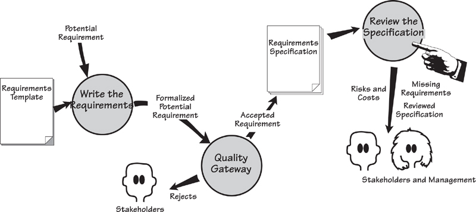
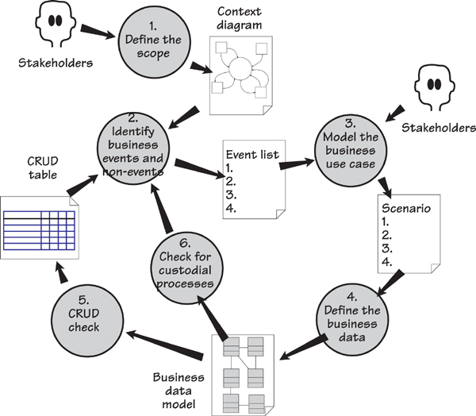
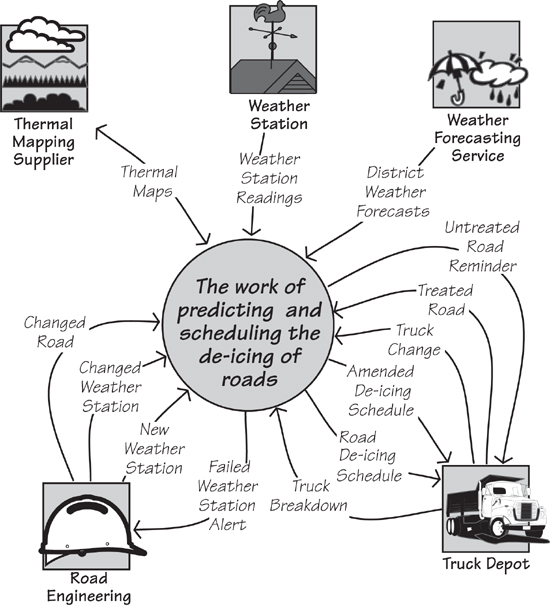
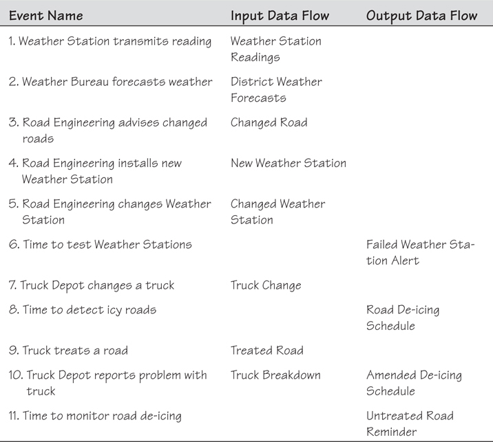
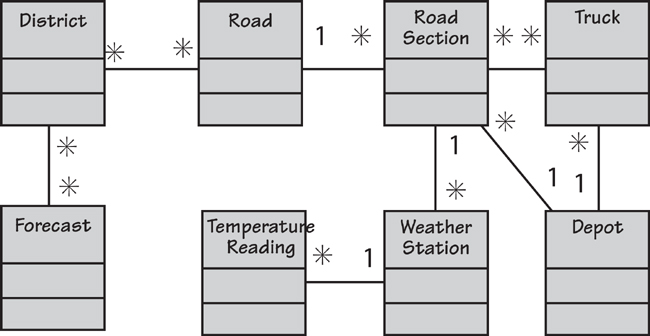
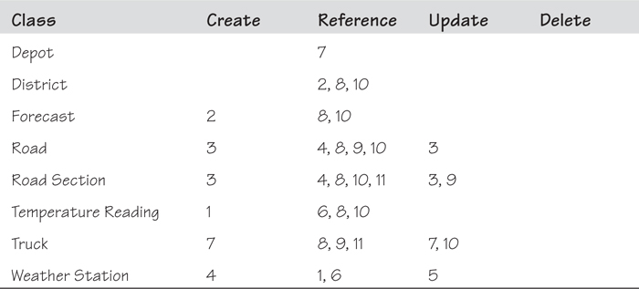
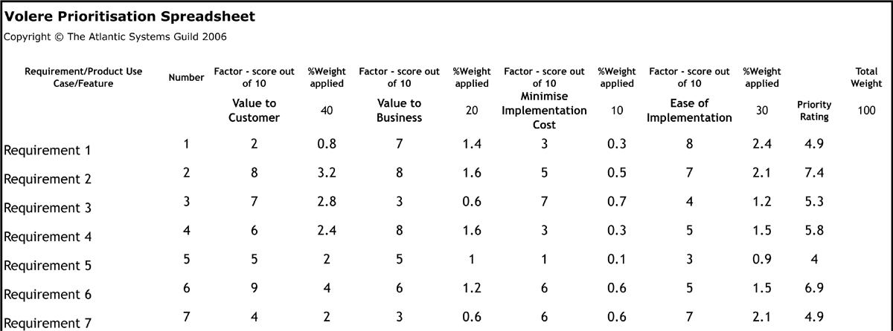
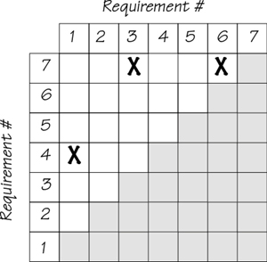
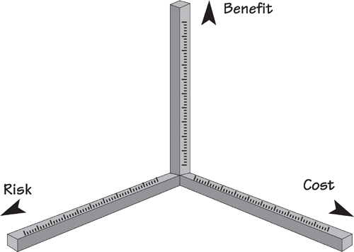

# 17 Requirements Completeness

[17-P001] *in which we decide whether our specification is complete, and set the priorities of the requirements*

[17-P002] At some stage during your requirements process, you need to release all or part of your specification—other people, such as developers, testers, marketers, and suppliers, need it. To be released, the specification does not have to contain all the requirements: It could be a partial version with the requirements just for the next iteration, a version of the specification you want to publish for marketing reasons, an extract to use with a request for proposal (RFP), or any portion that you release for any other reason. Nevertheless, before releasing the specification, you need to ensure that it is complete for its intended purpose.

[17-P003] We use the term “specification” here to mean whatever collection of requirements you have. This material does not have to be a formally written specification—it does not even have to be formal. It could be a wiki or a set of story cards; it might hold only the requirements for a partial release of the product. Whatever your intention, this review ensures the specification is sufficient before you hand it over to anyone else.

[17-P004] **Figure 17.1** illustrates how the Quality Gateway and the Specification Review work together. The Quality Gateway tests an individual requirement—ensuring that it is correctly stated, unambiguous, within scope, testable, traceable, and not gold plating—thereby confirming that only correct atomic requirements are included in the specification.

[17-P005] 

[17-P006] Figure 17.1. You have arrived at the point in the process where you want to consider the specification as a whole. The Quality Gateway has tested and accepted individual requirements, and added them to the specification. Now it is time to assess whether you have a complete specification. This review can be done iteratively—ideally for one product use case worth of requirements at a time.

[17-P007] **Chapter 11** discusses the Quality Gateway. 

[17-P008] Now you have to consider whether the specification is complete, which means reviewing the specification as a whole and ensuring that all the parts that should be there are there. This review makes sense when you consider that it performs these tests:

[17-P009] • Determine whether any requirements are missing.

[17-P010] • Prioritize the requirements so the builders understand their importance and urgency.

[17-P011] • Check for conflicts between requirements that could prevent one or the other from being satisfied.

[17-P012] Additionally, your project management might undertake some other useful tasks at this stage:

[17-P013] • Estimate the cost of construction.

[17-P014] • Evaluate the risks faced by the project.

[17-P015] Reviewing the requirements specification can done at any time, not just before a release—it can be an ongoing activity. You might, for example, review the specification as a check on the progress of the requirements activity. The quality (or lack thereof) of the specification tells you more about progress than the volume of the specification does.

## 17.1 Formality Guide

[17.1-P001] Rabbit projects rarely package all of their requirements into a complete specification; instead, they act on each tranche of requirements as it comes along. The review process discussed in this chapter is useful for progressively checking completeness in such projects. Rabbits should look at the sections of this chapter covering non-events and the CRUD check. The section on prioritization, while created with written requirements in mind, is also relevant for rabbit projects.

[17.1-P002] 

[17.1-P003] Horse projects almost always have some kind of written specification. It does not have to be as formal as a specification for an elephant project, but knowing it is complete and relevant is desirable. Horses may not build all of the models we describe here, but that’s okay: The review process still works without all of them being present. Horse projects should definitely prioritize their requirements.

[17.1-P004] 

[17.1-P005] Elephant projects always need a complete specification. This is either for statutory reasons or because you are outsourcing the development of the product. If there are statutory demands, then it is incumbent upon you to ensure that you have a complete and correct specification, and in some cases to demonstrate how you confirmed its completeness and correctness. If you are outsourcing and you lack an accurate specification, then you will probably be disappointed with the end result—the supplier can do no more than build what you ask for.

[17.1-P006] 

[17.1-P007] In this review process we make use of several models, most notably a model of the stored data (UML class model, entity relationship diagram, or your choice of model). Elephant projects almost always make use of models, so here we present another way that you can reap the benefits from such representations.

## 17.2 Reviewing the Specification

[17.2-P001] This review process is iterative. Finding errors or omissions, and correcting them, could mean introducing new errors; as a consequence, it might be necessary to iterate through this process once or twice to ensure that the specification is watertight. It is useful to maintain a record of the errors you encounter; the types of errors you discover in this review suggest where you need to improve your requirements process.

[17.2-P002] This review gives you an ideal opportunity to reassess your earlier decision on whether to go ahead with the project. A seriously flawed or incomplete specification, or measurements that say the costs and the risks outweigh the benefits, are almost always indications that you need to consider project euthanasia.

## 17.3 Inspections

[17.3-P001] One fairly effective way of reviewing the specification is a formalized process called a *Fagan inspection*. Fagan inspections have been around for quite some time, and much has been written about them, so we do not propose to add much to that body of literature here—a brief outline of the process will be sufficient for our purposes.

[17.3-P002] The inspection process kicks off with a moderator determining the material to be inspected and the inspectors to inspect it. The inspectors are given an overview of the document under consideration, and they have a day or so to study the material. The inspection meeting proper—limited to two hours—studies the document using checklists of previously found errors. The checklist is applied to the document: “Does this error exist? Does that error exist?” This has proved itself to be a very effective way of trapping errors, yielding a higher detection rate than other review techniques. The checklists are updated when new errors—those not already on the list—are discovered. The author reworks the document, and the moderator ensures all defects have been removed. If necessary, the moderator arranges a follow-up inspection.

[17.3-P003] Reading 

[17.3-P004] The original paper on Fagan inspection (one of the most cited papers in software history) is this: Fagan, Michael. Design and Code Inspections to Reduce Errors in Program Development. *IBM Systems Journal,* vol. 15, no. 3 (1976): 258–287. (We said this process has been around for a while.)

[17.3-P005] You can easily adopt some of the Fagan rules. Try these:

[17.3-P006] • Assign a moderator (probably the business analyst) to take responsibility for arranging the inspection and distributing the materials.

[17.3-P007] • Build a checklist of the most likely errors. You will augment this list with subsequent inspections.

[17.3-P008] • Give inspectors some time to read the document and prepare for the inspection.

[17.3-P009] • Limit inspections to two hours and no more than two inspections a day.

[17.3-P010] • Have between three and eight inspectors.

[17.3-P011] Fagan inspections can be a very effective weapon to ensure the correctness and completeness of your requirements. Try them.

## 17.4 Find Missing Requirements

[17.4-P001] The review determines whether all of the requirement types appropriate to your product have been discovered. Use the Volere Requirements Specification Template and its requirement types as a guide when determining whether your specification contains the types of requirements called for by the nature of the product. For example, if you are developing a financial product but you have no security requirements, something is definitely missing. Similarly, a Web product that lacks either usability or look and feel requirements is certainly in trouble.

[17.4-P002] The Volere Requirements Specification Template appears in **Appendix A**. 

[17.4-P003] The functional requirements should be sufficient to complete the work of each use case. To check this aspect, play through each of the product use cases as if you were the product. If you do everything the requirements call for, do you arrive at the outcome for the use case? Are your users (you should have them with you when you perform this role-play) satisfied the product will do what they need for their work?

[17.4-P004] Look for exceptions to the normal things the product must do. Have you generated enough exception and alternative scenarios to cover these eventualities, and do your functional requirements reflect this coverage? Revisit your scenarios and, for each step, determine whether exceptions can occur there or whether an exception might prevent that step from being reached.

[17.4-P005] Scenarios are discussed in **Chapter 6**. 

[17.4-P006] Check each product use case against the non-functional requirement types. Does it have the non-functional requirements that it needs and that are appropriate for this kind of use case? Use the requirements template as a checklist. Go through the non-functional requirement types, read their descriptions, and ensure that the correct non-functional requirements have been included.

## 17.5 Have All Business Use Cases Been Discovered?

[17.5-P001] For each business event, you determined the business response (the business use case [BUC]) and decided how much of that response will be carried out by the product (the product use case [PUC]). We suggested that you discover the requirements one PUC at a time, and continue until you have covered all of the business events. This approach works well, providing, of course, that you have discovered all of the business events.

[17.5-P002] ***You do not have to produce more documents to do the review, but just make more use of what you have.***

[17.5-P003] So how do you know whether you have discovered all of the business events? There is a short procedure that uses the outputs of your requirements process and system modeling. In other words, you do not have to produce more stuff, but just make more use of what you already have.

[17.5-P004] **Figure 17.2** illustrates the procedure for confirming the completeness of your list of business events. Refer to the model of this procedure as we describe its activities.

[17.5-P005] 

[17.5-P006] Figure 17.2. The procedure for determining that you have found all of the business events. The process is iterative, going through the activities until the *Identify business events and non-events* activity fails to discover anything new.

### 17.5.1 1. Define the Scope

[17.5.1-P001] The scope we are concerned with here is the scope of the work to be studied. In **Chapter 3**, Scoping the Business Problem, we built a context model to show the scope of the IceBreaker work, and we reproduce it in **Figure 17.3**. The context model is mainly completed during the blastoff activity, then refined further as requirements discovery progresses. The review process we describe here checks the completeness of your context diagram and, where necessary, updates it.

[17.5.1-P002] 

[17.5.1-P003] Figure 17.3. The context diagram of the work shows the data entering and leaving the scope of the work. These data transfers are referred to as boundary data flows. We use these flows to determine the business events.

### 17.5.2 2. Identify Business Events and Non-events

[17.5.2-P001] During the blastoff, or at the beginning of trawling, you determined the business events by looking at the boundary data flows on the context diagram. If a business event happens outside the work, the adjacent system sends a data flow (which we are calling a boundary data flow) to the work, and the work responds by processing the data contained in the flow. Thus a business event is associated with each incoming boundary data flow. The outgoing boundary flows are either part of the response to an externally triggered business event (the work responds by processing the incoming flow and produces the outgoing flow) or the result of a time-triggered event (such as reporting and sending out reminders or alerts). In short, each flow on the context model is connected to a business event. When you have found all of the boundary flows from the context model, you have determined all of the possible business events . . . for the moment.

[17.5.2-P002] **Chapter 4**, Business Use Cases, tells you how to determine business events from the context model. 

[17.5.2-P003] The output of this activity is a list of business events. The list of the Ice-Breaker business events appears in **Table 17.1**.

[17.5.2-P004] Table 17.1. The Business Event List for the IceBreaker Work

[17.5.2-P005] 

### 17.5.3 Non-events

[17.5.3-P001] Now look for non-events. The term “non-events” is a play on words, and here we use it to mean events that happen if another event does not happen. **Table 17.1** lists Event 9, *Truck treats a road*. What happens if the truck does *not* treat the road? The work has to do something, and what it does is a non-event (it happened because another event did not happen), so now we have identified Event 11, *Time to monitor road de-icing*. The work responds to this (non) event by checking whether all roads have been treated as directed and, if they have not, issues an *Untreated Road Reminder*.

[17.5.3-P002] A more common example found in many businesses is the business event called “Customer pays invoice.” You are no doubt familiar with this event, probably by being the payer rather than the payee. So what happens if the customer does not pay the invoice? There is a corresponding non-event called “Time to send reminder notice to nonpayers.”

[17.5.3-P003] During your specification review, go through your list of business events and ask, “What happens if this event does not happen?” Not all business events have a non-event—most don’t—but checking the list for their existence will reveal missing events.

[17.5.3-P004] Add any new business events discovered through this exercise to the list of business events, and update the context model with the appropriate flows. Continue searching the list of existing events for more non-events, but don’t be overly concerned if you don’t find one for every event. Often when you ask the question, “What happens if this event does not happen?”, the answer is “Nothing.”

### 17.5.4 3. Model the Business Use Case

[17.5.4-P001] Activity 3 (**Figure 17.2**) is not part of the requirements review, but something you have already done. As part of your requirements investigation, you will have built models or scenarios to help you and your stakeholders understand the desired response to the business event. Given that scenarios are the most commonly used models, we show a scenario in the schematic of the review process. However, many business analysts prefer to use UML activity diagrams or similar forms. The type of model you use is not important. What *is* important is that your model shows the functionality of the business use case; from this information, you can determine the stored data used by that functionality.

[17.5.4-P002] Reading 

[17.5.4-P003] Robertson, James, and Suzanne Robertson. *Complete Systems Analysis: The Workbook, the Textbook, the Answers.* Dorset House, 1998. This book is a thorough treatment of business use case modeling.

### 17.5.5 4. Define the Business Data

[17.5.5-P001] The next part of the review process is a step you might have already performed: building a model of the stored data needed by the work. You can use a class diagram, an entity relationship model, a relational model, or any other data-modeling notation you prefer. As long as it shows classes, entities, or tables, and the associations or relationships between them, it will suffice.

[17.5.5-P002] **Figure 17.4** shows a sample model of the data used by the IceBreaker work.

[17.5.5-P003] 

[17.5.5-P004] Figure 17.4. This model shows the stored data used to predict and schedule the de-icing of roads. It uses UML class model notation.

[17.5.5-P005] If building this kind of model is a task you do not normally tackle, ask one of the database people to do it for you. They have to build such a model at some stage of the development, and they may as well do it now when it can serve more purposes than just aiding the logical database design. However, you must insist that the database person builds a model of the *business data*, and does not start designing a database; these are two different things.

[17.5.5-P006] If you don’t want to build a model of the stored data, a simple alternative is to make a list of the classes of data used by the business. Data classes (also called “entities”) are the subject matter of stored data—they are the things that we store data about. You can think of a class as a collection of elementary data items (their correct name is “attributes”) for something that is important to the business. The “something” can be real, such as a customer or goods you sell, or it can be abstract, such as an account, a contract, or an invoice. The important thing to note is that the class does not have an alphanumeric value. For example, an account has no alphanumeric value, but its attributes—the account number, the account balance, and so on—are items that do have alphanumeric values. This is a useful rule for those times when you are wondering whether something is a class or an attribute.

[17.5.5-P007] ***Classes are uniquely identified.***

[17.5.5-P008] Another, perhaps more useful rule is that classes are uniquely identified. Thus anything to which your organization attaches an identifier is a class—accounts, credit cards, cars, shipments, flights, and so on—and all have unique identifiers.

[17.5.5-P009] Do not agonize too long over identifying the data classes—just do as well as you can without spending the rest of the month on it. Some heuristics are generally helpful in identifying classes by defining their properties:

[17.5.5-P010] • Things, concrete or abstract, used by the business

[17.5.5-P011] • Things that are identified—accounts, sales opportunities, customers

[17.5.5-P012] • Subjects of data, not the data itself

[17.5.5-P013] • Nouns with a defined business purpose

[17.5.5-P014] • Products or services—mortgages, service agreements

[17.5.5-P015] • Branches of organizations, locations, or constructions

[17.5.5-P016] • Roles—case officer, employee, manager

[17.5.5-P017] • Events that are remembered—agreements, contracts, purchases

[17.5.5-P018] • Adjacent systems from the context diagram

[17.5.5-P019] You can also find the classes from your context model. The stored data used by the work comes in via data flows and leaves via other data flows. Think about it this way: If data resides inside the work, there must be some flow of data to bring it there. In turn, you can dissect the data flows found on the context model and look at their attributes: “What is this attribute describing?” or “What is the subject of this data?” These subjects are your classes. Analyze all boundary flows, both inward and outward, looking for “things” that conform to the properties of classes listed earlier. When you have analyzed all of the flows, you have most likely identified all of the business data classes.

[17.5.5-P020] Now we get to the fun part.

### 17.5.6 5. CRUD Check

[17.5.6-P001] Each class of data (check these on your class model) must be Created and Referenced. Some are also Updated or Deleted. Build a CRUD table, such as the one shown in **Table 17.2**, to show whether every class has all the appropriate actions performed on it. These actions are performed by business use cases, so this step is where you reveal any missing events.

[17.5.6-P002] Table 17.2. The CRUD TableEach cell shows the identifier of the business event that creates, references, updates, or deletes the entity. Gaps in the table indicate missing events.

[17.5.6-P003] 

[17.5.6-P004] ***Each class of data must be Created and Referenced. Some are also Updated or Deleted.***

[17.5.6-P005] If a class is referenced without first being created, it means the creation event is missing. If a class is created without being referenced, then either an event is missing or some data has been created that does not have to be created. Some classes (but not all) are updated, and some are deleted. Naturally, for either of these last two events to occur, the data must have been created.

[17.5.6-P006] Empty cells in the CRUD table reveal missing business events. For example, the classes Depot and District do not have any creating business event, yet they are referenced. Thus the context is incomplete: It does not have the incoming flows needed to create these classes of stored data.

[17.5.6-P007] When you find missing business events, you have to revisit your stakeholders to find out more about them. When you determine what the events are, update the context diagram, add them to the event list, update the CRUD table, and continue the process.

[17.5.6-P008] The Delete column of the CRUD table shows classes that are deleted for business policy reasons only. This is not the same as archiving or cleaning up the database. For example, if a Depot were to be taken out of service, then it is deleted from a business point of view. However, a Forecast is never deleted—there is no essential business policy reason for doing so.

### 17.5.7 6. Check for Custodial Processes

[17.5.7-P001] The work’s processes can be fundamental or custodial. *Fundamental processes* are connected to the reason for the product’s existence—for example, analyzing the roads, recording the weather forecasts, and scheduling the trucks to treat the roads. In contrast, *custodial processes* exist to maintain—that is, keep custody of—the stored data. These processes make changes to the data solely to keep it up-to-date and are not part of the fundamental processing.

[17.5.7-P002] For example, when you hand over your credit card to make a purchase, the credit card company records the amount and other details of your purchase. That is a fundamental process.

[17.5.7-P003] ***If a class has changeable attributes, there is probably a custodial business event to change them.***

[17.5.7-P004] Now imagine that you move to a new home. After doing so, you advise the credit card company of your change of address, and the company updates its records accordingly. This is a custodial process; it exists just to keep the data up-to-date.

[17.5.7-P005] To check for custodial processes, go through the class model and the CRUD table, and ensure that you have sufficient business events and their processes to maintain all of the work’s stored data. If a class has changeable attributes, then there is probably a custodial business event to change them.

### 17.5.8 Repeat Until Done

[17.5.8-P001] Activities 1 through 6 of the business event discovery process are iterative. That is, you continue to go through the process—identifying business events; modeling the business use cases; adding to the class model; checking that the classes are created, referenced, updated, and deleted—until activity 2, *Identify business events and non-events,* fails to reveal any new events. At that point, you can be confident that there are no more business events relevant to your work.

[17.5.8-P002] You might also investigate the automated tools at your disposal, as some of this procedure can be automated. It is not that hard to do manually, but if you can get some automated help, why not?

## 17.6 Prioritizing the Requirements

[17.6-P001] One problem with requirements is that there are always too many of them. Prioritizing gives you a way to choose which ones to implement in which versions of the product. Decisions about prioritization are complex because they involve different factors and these factors are often in conflict with each other. Also, because the various stakeholders probably have different goals, it may prove difficult to reach agreement about priorities.

[17.6-P002] Despite its difficulty, this task must be done sooner or later, and sooner is best: The earlier you prioritize, the easier it is. But let’s go back to being difficult—there are quite a few factors that are considered when prioritizing. We spoke earlier about the customer satisfaction and customer dissatisfaction.

[17.6-P003] Each requirement should carry a customer satisfaction and customer dissatisfaction rating. These ratings help the customer to consider the relative value of individual requirements, and to prioritize them.

[17.6-P004] See **Chapter 16**, Communicating Requirements, for more on customer satisfaction and dissatisfaction. 

[17.6-P005] ***You can group requirements together and prioritize them as a unit.***

[17.6-P006] To prioritize requirements, you can group them together into logical (to you) groups. These groups are then prioritized as a unit, on the assumption that all of the composing requirements have the same priority as the group as a whole. A group might be a use case, a component, a feature, or any other collection of requirements that it makes sense to prioritize as a unit instead of treating them individually.

[17.6-P007] To make it easier to read, for the next few pages, we use the term “requirements” to mean “groups of requirements,” “features,” “product use cases,” or any other grouping you care to use.

### 17.6.1 Prioritization Factors

[17.6.1-P001] The following factors commonly affect prioritization decisions:

[17.6.1-P002] • The cost of implementation

[17.6.1-P003] • Value to the customer or client

[17.6.1-P004] • Time needed to implement the product

[17.6.1-P005] • Ease of technological implementation

[17.6.1-P006] • Ease of business or organization implementation

[17.6.1-P007] • Benefit to the business

[17.6.1-P008] • Obligation to obey the law

[17.6.1-P009] Not all of these factors are relevant to every project, and the relative importance of each factor differs for each project. Within a project, the relative importance of the factors is not the same for all of the stakeholders. Given this combinatorial complexity, you need some kind of agreed-upon prioritization procedure to provide a way of making choices. Part of that procedure is to determine when you will make prioritization decisions.

### 17.6.2 When to Prioritize

[17.6.2-P001] How soon should you make choices? As soon as you have two items to choose between. And keep in mind that the more visible you make your requirements knowledge, the more chances you have to make, and help others make, informed choices.

[17.6.2-P002] If your requirements have a well-organized structure, you can prioritize them early in your project. The process described in this book includes a project blastoff (**Chapter 3**) that advocates building a work context model, and then partitioning it using business events. We strongly suggest that you assign a priority rating to each business use case during the blastoff. You can, if you like, attach customer satisfaction and dissatisfaction ratings to the business events at this time. This early prioritization indicates which parts of the business should be investigated first, and which can be safely ignored until later, or in some cases, abandoned. In addition, you use this first prioritization to guide your iterations and version planning.

[17.6.2-P003] As you write atomic requirements, you should progressively consider whether to prioritize them. If any requirements obviously have low value, then tag them as such. Use the customer satisfaction and customer dissatisfaction ratings, discussed in the previous section, to help other people make choices.

[17.6.2-P004] ***Your stakeholders often assume the term “requirements” means these capabilities will definitely be implemented. “Requirements” are really desires or wishes that we need to understand well enough to decide whether and how to implement them.***

[17.6.2-P005] Part of the reason for progressive prioritization is to manage expectations. Your stakeholders often assume the term “requirements” means these capabilities will definitely be implemented. “Requirements” are really desires or wishes that we need to understand well enough to decide whether and how to implement them. For example, we might have a requirement that is really high priority but, due to a mixture of constraints, we cannot meet its fit criterion 100 percent. However, we do have a solution that will meet the fit criterion at the 85 percent level.

[17.6.2-P006] If you have been progressively prioritizing requirements throughout the project, people are able to accept such compromises without feeling cheated. Prioritization prepares stakeholders for the fact you cannot implement all the requirements.

### 17.6.3 Requirement Priority Grading

[17.6.3-P001] You can grade your requirement priority however it suits your way of working. A common way of grading requirements is “high,” “medium,” and “low,” but this approach usually means that all requirements are somehow high priority. There is also the MoSCoW approach, which is popular; this acronym stands for Must have, Should have, Could have, Won’t have.

[17.6.3-P002] Some organizations assign their requirements to releases: R1, R2, R3, and so on. The idea is that the R1 requirements are the highest priority or have the highest customer appeal, and are intended to appear in the first release. But having assigned your requirements to releases, suppose you discover you have too many requirements in the R1 category. At that point, you need to prioritize further.

[17.6.3-P003] Reading 

[17.6.3-P004] Davis, Al. *Just Enough Requirements*. Dorset House, 2005.

[17.6.3-P005] The idea of sorting the requirements into prioritization categories is often referred to as *triage*. This term (from the French verb *trier*, meaning “to sort”) comes from the field of medicine. It was first adopted during the Napoleonic wars when field hospitals were not capable of treating all soldiers who had been wounded. The doctors used triage to place the patients into one of three categories:

[17.6.3-P006] • Those who would live without treatment

[17.6.3-P007] • Those who would not survive

[17.6.3-P008] • Those who would survive if they were treated

[17.6.3-P009] Due to scarce medical resources, the doctors treated the third group only. The idea of triage can be used in project work using the categories:

[17.6.3-P010] • Those requirements needed for the next release

[17.6.3-P011] • Those requirements definitely not needed or wanted for the next release

[17.6.3-P012] • Those requirements you would like if possible

[17.6.3-P013] If the first and last categories leave you with more requirements than will fit into your budget, you need to prioritize further.

### 17.6.4 Prioritization Spreadsheet

[17.6.4-P001] A prioritization spreadsheet (**Figure 17.5**) enables you to prioritize the overflow requirements. Ideally—and especially if you have done a good job on progressive prioritization—these requirements will fit into the “would like if possible” category.

[17.6.4-P002] 

[17.6.4-P003] Figure 17.5. This prioritization spreadsheet can be downloaded from **www.volere.co.uk**.

[17.6.4-P004] Reading 

[17.6.4-P005] The downloadable Volere Prioritization Spreadsheet (**www.volere.co.uk**) offers a way to prioritize requirements. This spreadsheet contains some examples that you can replace with your own data.

[17.6.4-P006] Earlier in this chapter, we identified seven prioritization factors (or you may use any other prioritization factors relevant to your project). On our spreadsheet (see **Figure 17.5**), we have limited the number of factors to four, as more than that makes it difficult, if not impossible, to agree on a weighting system.

[17.6.4-P007] The *% Weight Applied* column shows the relative importance assigned to each factor. You arrive at this percentage weight by stakeholder discussion and voting.

[17.6.4-P008] In column 1, list the requirements you want to prioritize. These might be atomic requirements or recognized groups of requirements. Give each requirement–factor combination a score out of 10. This score reflects the positive contribution to the factor made by this requirement, where 1 means no contribution and 10 means the maximum possible contribution. In the example, for requirement 1, we assigned a score of 2 for the first factor because we believe that it does not make a very positive contribution to *Value to Customer*. The same requirement scores a 7 for *Value to Business,* as it makes a significant contribution to the business. The score for *Minimizing the Cost of Implementation* is 3; we think this requirement is relatively expensive to implement. It scored an 8 in terms of its *Ease of Implementation*, reflecting the relative simplicity of this requirement.

[17.6.4-P009] For each score, the spreadsheet calculates a weighted score by applying the percent weight for that factor. The priority rating for the requirement is calculated as the total of the weighted scores for the requirement.

[17.6.4-P010] You may use a variety of voting systems to arrive at the weights for the factors and the scores for each requirement. To make sure everyone is heard, issue voting tokens (gold stars, Monopoly money, or some such device) and ask each stakeholder to place his voting tokens on his highest-priority requirements. Of course, the spreadsheet is merely a vehicle for enabling a group of stakeholders to arrive at a consensus when prioritizing the requirements. By making complex situations more visible, you make it possible for people to communicate their interests, to appreciate other individuals’ opinions, and to negotiate.

## 17.7 Conflicting Requirements

[17.7-P001] Two requirements are conflicting if you cannot implement them both—the solution to one requirement prohibits implementing the other. For example, if one requirement asks for the product to “be available to all” and another says it shall be “fully secure,” then both requirements cannot be implemented as specified.

[17.7-P002] Prioritization, as we discussed earlier, might prevent some conflicts from happening. However, nothing is perfect, so you might need to take the following steps.

[17.7-P003] As a first pass at finding conflicting requirements, sort the requirements into their types. Then examine all entries that you have for each type, looking for pairs of requirements whose fit criteria are in conflict with each other. See **Figure 17.6**.

[17.7-P004] 

[17.7-P005] Figure 17.6. This matrix identifies conflicting requirements. For example, requirements 3 and 7 are in conflict with each other. If we implement a solution to requirement 3, it will have a negative effect on our ability to implement a solution to requirement 7, and vice versa.

[17.7-P006] Of course, a requirement might potentially conflict with any other requirement in the specification. To help you discover these problems, here are some clues to the situations where we most often find requirements in conflict:

[17.7-P007] • Requirements that use the same data (search by matching terms used)

[17.7-P008] • Requirements of the same type (search by matching requirement types)

[17.7-P009] • Requirements that use the same scales of measurement (search by matching requirements whose fit criteria use the same scales of measurement)

[17.7-P010] For functional requirements, look for conflicts in outcomes. As an example, suppose one requirement for the IceBreaker project calls for a roads section to be treated by the nearest truck, and another specifies that truck scheduling must rotate the trucks to allow for maintenance and driver rest periods. These two requirements would probably result in different outcomes.

[17.7-P011] ***Conflicts between requirements are normal for most requirements-gathering efforts, and indicate the need for some sort of conflict resolution mechanism.***

[17.7-P012] Conflicts may arise because different stakeholders have asked for different requirements, or because stakeholders have asked for requirements that are in conflict with the client’s idea of the requirements. This type of overlap, which is normal for most requirements-gathering efforts, indicates you need to establish some sort of conflict resolution mechanism.

[17.7-P013] You, as the requirements analyst, have the most to gain by settling conflicts as rapidly as possible, and as early as possible, so we suggest that you take the lead role in resolving them. When you have isolated the conflicting requirements, approach each of the stakeholders separately (this is one reason why you record the originator of each requirement). Go over the requirement with the user and ensure that both of you have the same understanding of it. Reassess the satisfaction and dissatisfaction ratings: If one stakeholder gives low marks to the requirement, then he may not care if you drop it in favor of the other requirement. Do this with both stakeholders and do not, for the moment, bring them together.

[17.7-P014] When you talk to each stakeholder, explore his reasoning. What does the stakeholder really want as an outcome, and will it be compromised if the other requirement takes precedence? Also, ensure that the requirement is not a solution, as often stakeholders ask for solutions that are within their own realm of experience, and naturally, experiences differ.

[17.7-P015] Most of the time we have been able to resolve conflicts by talking to the stakeholders. Note that we use the term “conflict” here, not “dispute.” There is no dispute. There are no positions taken, no noses put out of joint by the other guy winning. The stakeholder need not even know who the conflicting party is.

[17.7-P016] If you, as a mediator, are unable to reach a satisfactory resolution, then we suggest that you determine the cost of implementing the opposing requirements, assess their relative risks, and, armed with numbers, call the participants together and see if you can reach some compromise. Except in cases of extreme office politics, stakeholders are usually willing to compromise if they are in a position to do so gracefully without loss of face.

## 17.8 Ambiguous Specifications

[17.8-P001] The specification should, as far as is practical, be free of ambiguity. You should not have used any pronouns, and should be wary of unqualified adjectives and adverbs—all of these parts of speech introduce ambiguity. Do not use the word “should” when writing your requirements; it infers that the requirement is optional. Nevertheless, even if you follow these guidelines, some problems may remain.

[17.8-P002] The fit criterion quantifies a requirement, thereby making it unambiguous. We described fit criteria in **Chapter 12**, explaining how they make each requirement both measurable and testable. If you have correctly applied fit criteria, then the requirements in your specification will be unambiguous.

[17.8-P003] This leaves the descriptions of the requirements. Obviously, the less ambiguity they contain, the better, but a poor description cannot do too much damage if you have a properly quantified fit criterion for the requirement. However, if you are concerned about this issue, then we suggest that you select 50 requirements randomly. Take one of them and ask a panel of stakeholders to give their interpretation of the requirement. If everyone agrees on the meaning of the requirement, then set it aside. If the meaning of the requirement is disputed, then select five more requirements. Repeat this review until either it becomes clear that the specification is acceptable or the collection of selected requirements to test has grown so large (each ambiguity brings in five new ones) that the problem is obvious to all.

[17.8-P004] If the problem is truly bad, then consider rewriting the specification using a better-qualified requirements writer. Or, if it is really, really bad, consider aborting the project. A problem with requirements is the most common problem with crippled projects—there appears no point to proceeding when you know you have poor, ambiguous requirements.

[17.8-P005] The terms used in the requirements must be those defined in the Data Dictionary section of the specification. If every word has an agreed-upon definition and you have used the terms consistently, then the meanings throughout the specification must be consistent and unambiguous.

## 17.9 Risk Assessment

[17.9-P001] Risk assessment is not really a requirements problem, but rather a project issue. At this stage of the requirements process, you have a complete specification of a product that you intend to build. You have invested a certain amount of time deriving this specification, and you are about to invest even more time in building the product. Now seems like a good time to pause for a moment and consider the risks involved in proceeding.

[17.9-P002] As a requirements analyst, you do not have to handle the risk assessment by yourself. This task is more likely to be performed by the project manager, and if your organization is of a reasonable size, there should be someone on staff who is trained in risk assessment.

[17.9-P003] Reading 

[17.9-P004] DeMarco, Tom, and Tim Lister. *Waltzing with Bears: Managing Risk on Software Projects.* Dorset House, 2003. This book contains strategies for recognizing and monitoring risks.

[17.9-P005] The role of the business analyst in risk assessment is to consider requirements from the point of view of whether they contain some risk that could affect the success of the project. Some requirements pose greater risk than others. For example, some requirements might call for a technology or an implementation that the development team has never attempted before. That is not to say that they cannot pull it off, but there is a risk that they can’t. Consider the risks that could be present within the following parts of the Volere Requirements Specification Template:

### 17.9.1 Project Drivers

#### 17.9.1.1 1. The Purpose of the Project

[17.9.1.1-P001] Is the purpose of the product reasonable? Is it something your organization can achieve? Or are you setting out to do something you have never done before, with only hysterical optimism telling you that you can deliver the objective successfully?

#### 17.9.1.2 2. The Client, the Customer, and Other Stakeholders

[17.9.1.2-P001] Is the client a willing collaborator? Or is he uninterested in the project? Is the customer represented accurately? Are all stakeholders involved and enthusiastic about the project and the product? Hostile or unidentified stakeholders can have a very negative effect on your project. What are the chances that everyone will make the necessary contributions? Which risks do you run by not gaining the cooperation you need?

#### 17.9.1.3 2. Users of the Product

[17.9.1.3-P001] Are the users properly represented? While user representative panels are useful, experience has shown that they are frequently wrong in their assessment of what the real users want and need. Are the users capable of telling you the correct requirements? Many project leaders often cite the quality of user contributions to requirements as their most serious and frequently encountered risk.

[17.9.1.3-P002] Many system development efforts result in substantial changes to the users’ work and the way that users work. Have you considered the risk that the users will not be able to adapt to the new arrangements? Remember that humans do not like being changed, and your new product is bringing changes to your users’ work. Are the users capable of operating the new product? Consider these risks carefully, as the risk of the users not being prepared to change may turn out to be a substantial obstacle.

### 17.9.2 Project Constraints

#### 17.9.2.1 3. Mandated Constraints

[17.9.2.1-P001] Are the constraints reasonable, or do they indicate design solutions with which your organization has no experience? Is the budget reasonable given the effort needed to build the product? Unrealistic schedules and budgets are among the most common risks cited by projects.

#### 17.9.2.2 5. Relevant Facts and Assumptions

[17.9.2.2-P001] Are the assumptions reasonable? Should you make contingency plans for the eventuality that one or more of the assumptions turns out not to be true? It pays to keep in mind that assumptions are really risks.

### 17.9.3 Functional Requirements

#### 17.9.3.1 6. The Scope of the Work

[17.9.3.1-P001] Is the scope of the work correct? Do you run the risk of not including enough work to produce a satisfactory product? If the scope is not large enough, then the resulting product will not do enough for the user to make it truly valuable to him. A failure to define the work scope correctly always results in early requests for modifications and enhancements to the product.

#### 17.9.3.2 7. Business Data Model and Data Dictionary

[17.9.3.2-P001] Is the terminology defined so that everyone has the same interpretation of the terms contained in the requirements?

#### 17.9.3.3 8. The Scope of the Product

[17.9.3.3-P001] Does the scope of the product include all of the needed functionality, or just the easy stuff? Is it feasible given the budget and time available? Having the wrong product scope risks having many change requests after delivery.

[17.9.3.3-P002] Other commonly cited risks include creeping user requirements and incomplete requirements specifications. Risk analysis does not make all of these risks disappear, but it does ensure that you and management become aware of problems that might arise and can make appropriate plans for monitoring and addressing them. It is far more preferable to raise the alert early than to watch a disaster unfold while knowing that you might have been able to prevent it.

## 17.10 Measure the Required Cost

[17.10-P001] Measuring the cost or effort needed is not usually the responsibility of the requirements analyst. We mention this topic here because now that the requirements are known, you have an ideal opportunity to measure the size of the product. Common sense suggests that you do not proceed past this point without knowing its size, and thus the effort needed to build the product.

[17.10-P002] To this end, we have included a short introduction to function point counting in **Appendix C**. The appendix shows how this technique works and suggests it as an effective way to estimate size.

[17.10-P003] **Appendix C**, Function Point Counting: A Simplified Introduction, gives a brief but sufficient primer on this commonly used technique for measuring the size of your work or your product. 

[17.10-P004] The work you have done in gathering the requirements provides input to the measuring process; your context model is the definitive guide to the size of the work; a data model (if you have one) provides guidance to the effort needed to store the data. You can simply count the number of requirements you have written. All of these are measurements, and any are vastly preferable to guesswork, or blind acceptance of imposed deadlines.

[17.10-P005] One of the most commonly encountered risks is the risk of poor estimates of time needed to complete the project. This risk almost always manifests itself by turning into a real-world problem—when time starts to run out, the project team usually responds by taking shortcuts, skimping on quality, and ends up delivering a poor product even later than originally planned. It becomes avoidable when you take the short time needed to measure the size of the product, thereby determining—accurately—the required effort to build it.

[17.10-P006] We suggest that you include some kind of measurement activity in your completeness review.

## 17.11 Summary

[17.11-P001] The purpose of the review we have been talking about is to assess the correctness, completeness, and quality of the requirements specification. This review also gives you an opportunity to measure the benefit, cost, and risk attached to building the product, and to assess whether it is worthwhile to continue development of the product.

[17.11-P002] Consider the model shown in **Figure 17.7**. It provides a composite measure of the overall value of the product by measuring the risk, the cost to build and operate the product, and the benefit it brings along each of the corresponding scales. What does your profile look like? If you have high scores for cost and risk but a low score for benefit, you should consider abandoning the product. Conversely, you would love to have high benefit with low costs and low risks, but you probably won’t get it. The point is to map these factors and note whether the overall profile of your product indicates that it is one to build or one to avoid.

[17.11-P003] 

[17.11-P004] Figure 17.7. Each axis represents one of the factors that determines whether the product is worthwhile. The Cost axis, measuring the cost of construction and operation, can be assessed using function points or some other size measurement. The Benefit axis measures the value to the business and reflects the customer ratings placed by the stakeholders on the product. The Risk axis measures the severity of risks determined by the risk analysis activity.

[17.11-P005] And that brings us to the end of our book. In the course of getting from page one to here, we have tried to inject our experience of requirements projects that spans many years and many continents. If we have been able to pass along some advice, show you a process, give you some tips, suggest a direction, solve a problem, provide a shortcut, and explain the previously unfathomable, then we have succeeded in meeting our goal for this text.

[17.11-P006] If we have provided you with a reliable companion for your requirements work, then that is what we set out to do. If we have made some noticeable difference to the way that you go about discovering requirements, and if you feel that those requirements are better than they would have been without this book, then the past year will not have been in vain.

[17.11-P007] Enjoy our book; we hope it makes some difference, and the difference is beneficial to you.
